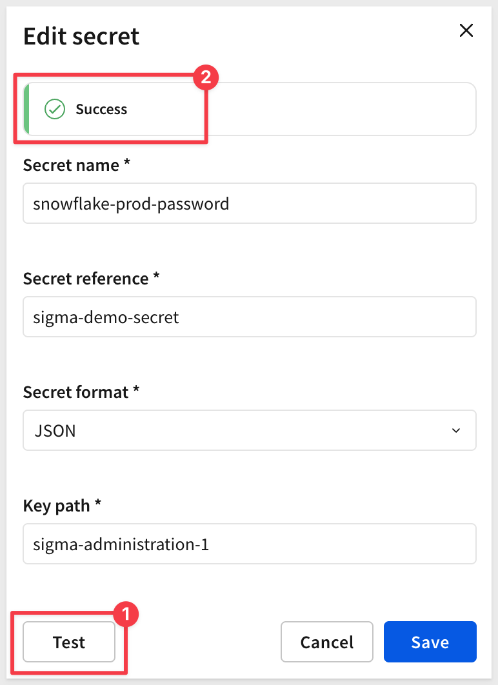
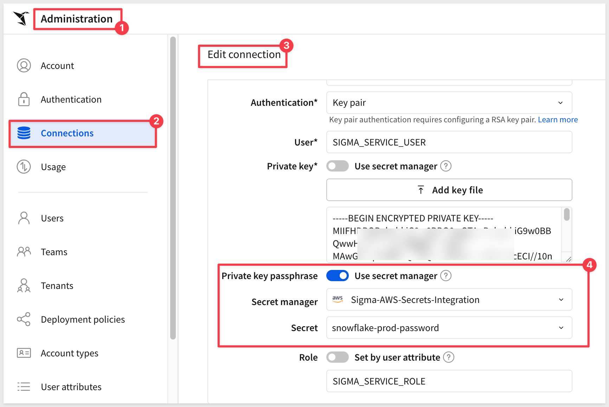

author: pballai
id: security_secrets_management
summary: security_secrets_management
categories: security
environments: web
status: Published
feedback link: https://github.com/sigmacomputing/sigmaquickstarts/issues
tags: default
lastUpdated: 2026-12-31

# Secrets Management in Sigma

## Overview
Duration: 5

Connect Sigma to an external secret manager — [AWS Secrets Manager](https://aws.amazon.com/secrets-manager/) or [HashiCorp Vault](https://www.hashicorp.com/en/products/vault) — so database credentials live in your own vault instead of being typed directly into a Sigma connection.

Sigma supports two secret managers, each with its own integration flow. Read the section that matches your environment — `Connect AWS Secrets Manager to Sigma` or `Connect HashiCorp Vault to Sigma` — then continue with the shared steps that apply no matter which one you chose:

- Connect AWS Secrets Manager or HashiCorp Vault to Sigma and complete the trust handshake
- Add a secret in Sigma and map it to the right key or path
- Attach a secret to a connection using the secret manager toggle
- Track where each secret is being used with the `Secret access` tab

<aside class="positive">
<strong>WHY IT MATTERS:</strong><br> Credentials stay where your security team already manages them. Sigma never stores the underlying password — it only holds a reference to the secret, and every connection that draws on it is visible in one place.
</aside>


<aside class="positive">
<strong>IMPORTANT:</strong><br> Some screens in Sigma may appear slightly different from those shown in QuickStarts. This is because Sigma continuously adds and enhances functionality. Rest assured, Sigma's intuitive interface ensures that any differences will not prevent you from successfully completing any QuickStart.
</aside>

For more information on Sigma's product release strategy, see [Sigma product releases](https://help.sigmacomputing.com/docs/sigma-product-releases)

If something doesn't work as expected, here's how to [contact Sigma support](https://help.sigmacomputing.com/docs/sigma-support)

### Target Audience
This QuickStart is for Sigma organization admins and security teams responsible for managing connection credentials, particularly those who already store secrets in AWS Secrets Manager or HashiCorp Vault.

### Prerequisites

<ul>
  <li>Admin account type in your Sigma organization.</li>
  <li>Access to an AWS Secrets Manager or HashiCorp Vault instance. If you don't already have a secret stored, this QuickStart walks through creating one.</li>
  <li>Permission to create IAM policies and roles in the AWS account that owns the secret (for the AWS Secrets Manager path).</li>
  <li>Some familiarity with Sigma is assumed. Not all steps will be shown, as the basics are assumed to be understood.</li>
 </ul>

<aside class="positive">
<strong>IMPORTANT:</strong><br> Sigma recommends using non-production resources when completing QuickStarts.
</aside>

<button>[Sigma Free Trial](https://www.sigmacomputing.com/free-trial/)</button>

<aside class="negative">
<strong>IMPORTANT:</strong><br> Some features may carry a "Beta" tag. Beta features are subject to quick, iterative changes. As a result, the latest product version may differ from the contents of this document.
</aside>


## Connect AWS Secrets Manager to Sigma
Duration: 15

Before Sigma can reference a secret, it needs a trusted integration with the secret manager that stores it. This section covers AWS Secrets Manager, which uses AWS Security Token Service (STS) cross-account role assumption — Sigma assumes a role in your AWS account rather than holding a long-lived AWS key.

<aside class="negative">
<strong>NOTE:</strong><br> Using HashiCorp Vault instead? Skip ahead to `Connect HashiCorp Vault to Sigma`, then rejoin this QuickStart at `Add and Use a Secret`.
</aside>

### Create an IAM policy in AWS

Log in to the AWS Management Console as an administrator and open the `IAM` console. In the left navigation menu, click `Policies`, then `Create policy`:


Select the `JSON` tab and paste a policy (replacing the sample JSON) that grants read access to your secrets:

```copy-code
{
  "Version": "2012-10-17",
  "Statement": [
    {
      "Effect": "Allow",
      "Action": [
        "secretsmanager:GetSecretValue",
        "secretsmanager:DescribeSecret"
      ],
      "Resource": "arn:aws:secretsmanager:{region}:{aws-account-id}:secret:*"
    }
  ]
}
```

<aside class="negative">
<strong>IMPORTANT:</strong><br> Replace `{region}` and `{aws-account-id}` with your actual AWS region and 12-digit account ID before creating the policy. Leaving the placeholders in place causes AWS to reject the policy with "The policy failed legacy parsing" — the ARN grammar requires real values, not placeholder text. Your region is visible in the browser's URL bar (for example, `us-east-1` in `https://us-east-1.console.aws.amazon.com/...`); your account ID is in the AWS Console's account menu in the top right.
</aside>


Scroll down and click `Next`, enter a policy name (for example, `SigmaSecretsManagerPolicy`), and scroll down to click `Create policy`:


### Create an IAM role in AWS

In the IAM console, click `Roles`, then `Create role`. 


Select `AWS account` as the trusted entity type, then `Another AWS account`:
- Account ID: enter your own 12-digit AWS account ID as a temporary placeholder — you'll replace this with Sigma's IAM Principal ARN in a later step

- Select `Require external ID` and enter a temporary placeholder value (for example, `0000`) — you'll replace this with Sigma's generated External ID in a later step
- Leave `Require MFA` unchecked


Click `Next`.

- Select the policy you created above (`SigmaSecretsManagerPolicy`), click `Next` again,


- Enter a role name (for example, `SigmaSecretsManagerRole`), and scroll down to click `Create role`.


- Open the new role


- Copy its Role ARN — you'll need it in the next step.


### Register the integration in Sigma

In Sigma, navigate to `Administration` > `Authentication` > `Secret Manager`, then click `Add secret manager`:


Select `AWS Secrets Manager` as the type and `AWS STS` as the authentication method, then fill in:

- Integration Name: a descriptive name for this integration (`Sigma-AWS-Secrets-Integration`)
- Region: the AWS Region where your secrets reside (for example, `us-east-1`)
- Role ARN: the Role ARN you copied from AWS
- Role Session Name (optional): a custom session identifier for tracking requests in AWS CloudTrail
- Secret Format: the default format for secrets added under this integration — `JSON`, `Plain text`, `Base64`, or `Base64-encoded JSON` (you can override this per secret later). `JSON` is the best fit for most database credentials — AWS Secrets Manager's built-in templates (for example, "Credentials for RDS database") store username and password as JSON key-value pairs by default, and `JSON` lets you reference a specific key with a `Key path`:


Click `Add`, then open the new integration from the list and record the generated IAM Principal ARN and External ID.


### Complete the trust handshake in AWS

Return to the AWS IAM console and select the role you created (`SigmaSecretsManagerRole`). Open the `Trust relationships` tab, click `Edit trust policy`:


Replace the placeholder values with the `IAM Principal ARN` and `External ID` Sigma generated:

```copy-code
{
  "Version": "2012-10-17",
  "Statement": [
    {
      "Effect": "Allow",
      "Principal": {
        "AWS": "{iam-principal-arn-from-sigma}"
      },
      "Action": "sts:AssumeRole",
      "Condition": {
        "StringEquals": {
          "sts:ExternalId": "{external-id-from-sigma}"
        }
      }
    }
  ]
}
```

<aside class="negative">
<strong>IMPORTANT:</strong><br> Replace `{iam-principal-arn-from-sigma}` and `{external-id-from-sigma}` with the actual values Sigma generated in the previous step. As with the IAM policy above, leaving placeholder text in place causes AWS to reject the trust policy with a parsing error.
</aside>

Click `Update policy`. Sigma can now assume the role and read secrets from this AWS account.

<aside class="positive">
<strong>NOTE:</strong><br> The integration is registered, but you haven't confirmed it actually works yet. Skip ahead to `Add and Use a Secret` to add a secret and attach it to a connection — that's where you'll verify the trust handshake succeeds end to end.
</aside>


<!-- END OF SECTION-->

## Connect HashiCorp Vault to Sigma
Duration: 15

### ...placeholder — Self-Signed JWT auth: Vault URL, mount path, Vault role, Audience ID, CA certificate; Sigma-generated Subject ID / Issuer ID / Public Key fed back into Vault's JWT auth method + policy. Not yet drafted — gated on Phil's HCP Vault trial.


<!-- END OF SECTION-->

## Add and Use a Secret
Duration: 10

With the trust handshake complete, create a secret in AWS Secrets Manager (if you don't already have one) and then reference it in Sigma. Sigma only stores a reference to it — **the value itself stays in AWS Secrets Manager.**

### Create a secret in AWS Secrets Manager

In the AWS Secrets Manager console, click `Store a new secret`:


Select `Other type of secret`.

Add the key/value pair you want Sigma to reference — for example, a single key such as `sigma-administration-1` mapped to the value you want to protect. You can add more rows if you have multiple values to store, or switch to `Plaintext` instead if you'd rather store a single raw value with no key.

<aside class="negative">
<strong>IMPORTANT:</strong><br> Note the key name and its value somewhere safe and temporary (a password manager or scratch note) before continuing. You'll need the key name for `Key path` when adding the secret in Sigma, and the value itself to confirm the connection actually authenticates later in this QuickStart.
</aside>

Choose the default encryption key (`aws/secretsmanager`) unless your organization requires a customer-managed key.


Click `Next`, enter a secret name (for example, `sigma-demo-secret`), click `Next` through the remaining screens (automatic rotation is optional, but we will skip it for this walkthrough)

On the final `Review` page, click `Store`.

<aside class="positive">
<strong>NOTE:</strong><br> Whatever key name(s) you choose here (for example, `sigma-administration-1`) are what you'll reference later in `Key path` when adding the secret in Sigma.
</aside>

### Add the secret in Sigma

In Sigma, navigate to `Administration` > `Authentication` > `Secret Manager`, then open the integration you created.

On the `Secrets` tab, click `Add secret`:


Fill in the secret's details:

- Secret name: a friendly label used to identify the secret within Sigma. For example:

```copy-code
snowflake-prod-password
```

- Secret reference: the secret's own name or ARN from AWS Secrets Manager. For example, the name you gave it in the previous step:

```copy-code
sigma-demo-secret
```

- Secret format: `JSON` if the AWS secret is stored as key-value pairs, `Plain text` if it's a raw string
- Key path: required only when Secret format is `JSON` or `Base64-encoded JSON` — not used for `Plain text` or `Base64`. For example:

```copy-code
sigma-administration-1
```

<aside class="negative">
<strong>IMPORTANT:</strong><br> `Secret reference` and `Key path` each point at something different, and it's easy to mix them up. `Secret reference` is the secret's own name or ARN from AWS Secrets Manager — not the Role ARN from the previous section (`SigmaSecretsManagerRole`), and nothing appended to it. `Key path` is the JSON key name only — never the value. For a secret named `sigma-demo-secret` with a single key `sigma-administration-1`, that's `Secret reference` = `sigma-demo-secret` and `Key path` = `sigma-administration-1` — the value stored under that key never belongs in either field.
</aside>

Not sure what your key names are? In the AWS Secrets Manager console, open the secret and click `Retrieve secret value` under `Secret value` to see its JSON structure.

If your secret has nested JSON instead of one flat key, join each key name with a dot to walk down to the one you want — for example, `db.credentials.password` for a value nested inside `db` > `credentials` > `password`.

Click `Add`:


The secret now appears in the `Secrets` list for this integration.

### Confirm Sigma can retrieve the secret

Before attaching this secret to a connection, confirm the trust handshake actually works. Open the secret, click the `3-dot` menu > `Edit`:


Click `Test access`:



<aside class="positive">
<strong>NOTE:</strong><br> A successful test confirms Sigma can assume the AWS role and read the secret value — the same permissions a connection will use once you attach this secret to one.
</aside>

If `Test access` fails, double check that the IAM role's trust policy has the exact `IAM Principal ARN` and `External ID` Sigma generated, and that the IAM policy's `Resource` ARN covers the secret you're referencing.


<!-- END OF SECTION-->

## Attach a Secret to a Connection
Duration: 5

With a secret added and confirmed working, attach it to whichever connection field needs it. Each sensitive credential field on a connection — `Password`, `Private key`, `Private key passphrase`, depending on the connection type — has its own `Use secret manager` toggle, so you can mix secret-manager-backed fields with directly-entered ones on the same connection.

### Enable the secret manager toggle on a connection

In Sigma, navigate to `Administration` > `Connections`, then open the connection you want to update (or create a new one).

<!--  -->

On the credential field that should pull from your secret manager, turn on `Use secret manager`, then fill in:

- Secret manager: the integration you created earlier (for example, `Sigma-AWS-Secrets-Integration`)
- Secret: the secret you added (for example, `snowflake-prod-password`)

<!--  -->

<aside class="positive">
<strong>NOTE:</strong><br> Each credential field toggles independently, so you can mix secret-manager-backed fields with directly-entered ones on the same connection. On a Snowflake key pair connection, for example, you might leave `Private key` entered directly (via `Add key file`) while `Private key passphrase` uses the secret manager — or attach the secret manager to both. Either is valid; use it wherever it fits your setup.
</aside>

Click `Save`.

<aside class="positive">
<strong>WHY IT MATTERS:</strong><br> The connection never stores the private key or passphrase directly — only a pointer to the secret. Rotate the value in AWS Secrets Manager, and every connection referencing it picks up the change automatically, with nothing to update in Sigma.
</aside>

Confirm the connection still works — open a workbook that uses it, or run a query against it, to verify the secret-manager-backed credentials authenticate correctly.


<!-- END OF SECTION-->

## Monitor Secret Usage
Duration: 5

### ...placeholder — Secret access tab, which connections/API connectors use a secret


<!-- END OF SECTION-->

## What we've covered
Duration: 5

In this QuickStart, we ...

- ...
- ...

**Additional Resource Links**

[Blog](https://www.sigmacomputing.com/blog/)<br>
[Community](https://community.sigmacomputing.com/)<br>
[Help Center](https://help.sigmacomputing.com/hc/en-us)<br>
[QuickStarts](https://quickstarts.sigmacomputing.com/)<br>

Be sure to check out all the latest developments at [Sigma's First Friday Feature page!](https://quickstarts.sigmacomputing.com/firstfridayfeatures/)
<br>

[](https://twitter.com/sigmacomputing)&emsp;
[](https://www.linkedin.com/company/sigmacomputing)&emsp;
[](https://www.facebook.com/sigmacomputing)


<!-- END OF WHAT WE COVERED -->
<!-- END OF QUICKSTART -->
