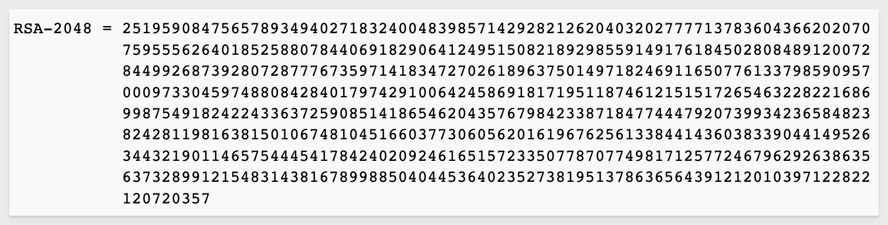
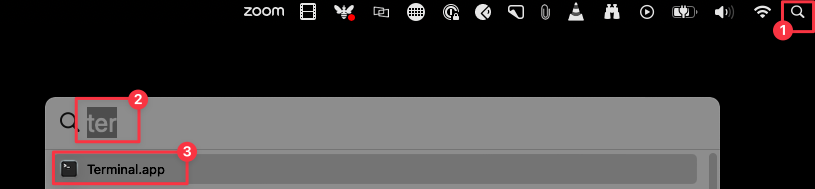
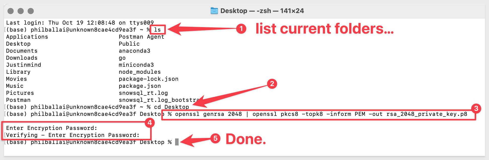
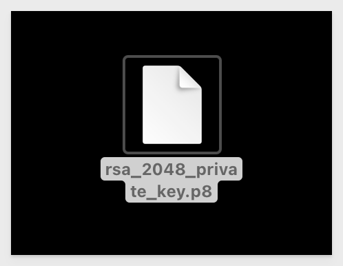
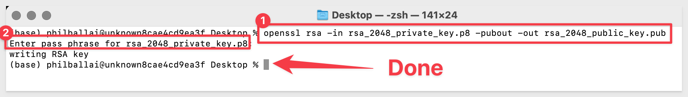
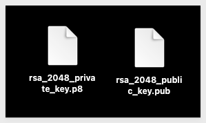
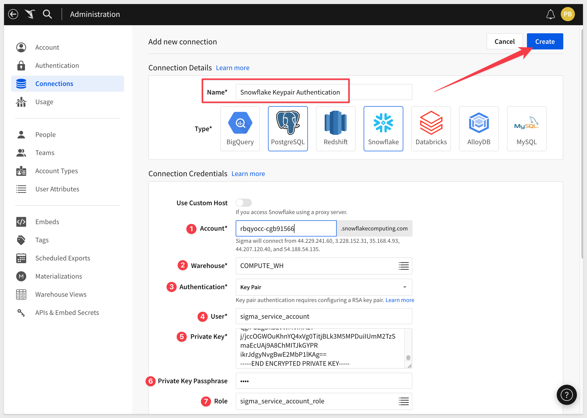

author: pballai
id: security_snowflake_keypair_rotation
summary: security_snowflake_keypair_rotation
categories: Administration
environments: web
status: Published
feedback link: https://github.com/sigmacomputing/sigmaquickstarts/issues
tags: default
lastUpdated: 2023-10-18


# Snowflake Key-pair Authorization

## Overview
Duration: 5 

Sigma supports Basic Auth (username + password) and Oauth for new Snowflake connections. 

With this feature release, we add support for the authentication method by key pair (public key + private key), for Snowflake connections.

Snowflake supports authentication using a combination of a public and private RSA key pair. The private key remains with the client (Sigma), and the corresponding public key is stored by the holder of the correct public key (in this case, Snowflake). 

The main idea is that Snowflake can verify the identity of the client without the client ever revealing its private key.

Every public key matches to only one private key. 

Private keys can have one or many public key holders (for example, multiple Sigma connections, if you prefer to use one private key).

Data encrypted with the private key can be decrypted only with the public key, and vice versa.

Together, they are used to encrypt and decrypt messages. In this case, the messages are Sigma's connection to Snowflake as configured in Sigma.

When keys are used for authentication, Sigma uses the private key to generate a digital signature. 

The client decrypts the signature using the public key and compares the hash with its own computed hash. If the values match, Sigma's authentication is successful.

We will discuss RSA encryption a little more in the next section, which is optional, but provided for it's educational value.

 ### Target Audience

Sigma administrators who are interested in implementing RSA connection encryption via key pair authorization and key rotation.

### Prerequisites

<ul>
  <li>A computer with a current browser. It does not matter which browser you want to use.</li>
  <li>Access to a Sigma environment.</li>
  <li>Access to a Snowflake environment.</li>
  <li>Some familiarity with Sigma is assumed. Not all steps will be shown as the basics are assumed to be understood.</li>
</ul>

<aside class="postive">
<strong>IMPORTANT:</strong><br> Sigma recommends that you use non-production resources when doing QuickStarts.
</aside>

<button>[Sigma Free Trial](https://www.sigmacomputing.com/free-trial/)</button> <button>[Snowflake Free Trial](https://signup.snowflake.com/)</button>
  
### What You’ll Learn

## RSA Encryption
Duration: 20

Snowflake uses RSA 2048-bit encryption for it's support of key pair authorization. 

Sigma is able to leverage this support via it's custom Go driver that is used to create connections to Snowflake. 

It is important to have a general understanding of RSA encryption (RSA) to appreciate just how good it is. We would be remiss if not to mention the three inventors behind RSA, who did the work way back in 1977. In fact, the name `RSA` is derived from their initials. They are:


RSA has evolved over the many years but at it's core, the security lives in the difficulty in factoring of semi-prime numbers. 

A semi-prime number is a natural number that is the product of two prime numbers. 

Factoring a semi-prime results in two prime numbers. For example:

1515 is a semi-prime because it is the product of two prime numbers, 33 and 55.

There's no known algorithm that can factor large semi-primes in polynomial time (relative to the number of digits in the semi-prime). All known algorithms take time that grows at least exponentially with the size of the semi-prime, making them impractical for very large semi-primes.

There are quantum algorithms, like [Shor's algorithm](https://en.wikipedia.org/wiki/Shor%27s_algorithm), that can factor semi-primes in polynomial time. However, as of now, large-scale quantum computers that can run Shor's algorithm efficiently don't exist. If and when they do, they will pose a threat to cryptographic systems based on semi-prime factoring difficulty, like RSA in the long run.

#### The contest

The RSA Factoring Challenge was a challenge put forward by RSA Laboratories on March 18, 1991 with cash awards to successful participants.

The organizers published a list of semi-primes (numbers with exactly two prime factors) known as the RSA numbers, with a cash prize for the successful factorization of some of them. The smallest of them, a 100-decimal digit number called `RSA-100` was successfully factored by April 1, 1991. 

This is why you will never see anyone using RSA-100 in commercial applications today. In fact, the largest RSA number un-factored to date (in 2020) is `RSA-250`.

Many of the bigger numbers have still not been factored and are expected to remain un-factored for quite some time.

[You can read more about the content here:](https://en.wikipedia.org/wiki/RSA_Factoring_Challenge)

As mentioned earlier, Snowflake is using `RSA-2048` which has never been un-factored despite the cash prize for doing so being $200,000 at the time. 

RSA-2048 is considered by many to be currently impossible to factor, and may not be factorizable for many years to come, unless considerable advances are made in integer factorization or computational power. 

Of course, Sigma and Snowflake will adapt should progress be made in this area.

An example of what a RSA-2048 number looks like is:




<!-- END OF SECTION-->

## Key Pair Auth
Duration: 20

Key pair authentication is a method of authenticating a user or service (Sigma connection) based on a pair of keys: a private key, which is kept secret, and a public key, which is shared. 

In the context of Snowflake, users or services can authenticate using RSA-2048 private keys rather than passwords.

Key rotation is the process of replacing an existing key with a new one, enhancing security.

Here are the basic steps:

**1: Key Pair Generation:**  
The user or service generates a pair of keys (private and public). This is typically done with [OpenSSL](https://www.openssl.org/)<br>

**2: Public Key Registration:** <br>
The Sigma connection is created and configured, using the private key created in step 1.

**3: Public Key Registration:** <br>
The public key is registered with Snowflake.

**4: Authentication:** <br>
For authentication of the Sigma connection request, Snowflake challenges Sigma, which Sigma proves by using their private key without revealing it.

**5: Key Rotation:** <br>
After a set period or under certain conditions, the old key pair is deprecated and a new key pair is generated. The new public key is then registered with Snowflake, and the process continues.


<!-- END OF SECTION-->

## Key Generation
Duration: 20

We will use OpenSSL to generate our encrypted private key. 

Generally, it is safer to generate encrypted keys although Sigma does support unencrypted private keys too. 

Sigma recommends communicating with your internal security and governance officers to determine which key type to generate prior to completing this step.

How OpenSSL is installed depends on your operating system; we are using Mac and macOS has shipped with OpenSSL preinstalled since 2000. If you are running a different O/S, consult [OpenSSL's documentation](https://www.openssl.org/docs/). 

You can also review the setup that [Snowflake recommends here](https://docs.snowflake.com/en/user-guide/key-pair-auth).

#### Step 1: Private Key

**Step 1:** Open a new `Terminal` session:



<aside class="positive">
<strong>IMPORTANT:</strong><br> If you are not familiar with Terminal, make sure you know what folder (or directory) you are working in. The next command we run will create a file in that folder and you need to know where it lives. 
</aside>

Run the following command:
```code 
openssl genrsa 2048 | openssl pkcs8 -topk8 -v2 des3 -inform PEM -out rsa_2048_private_key.p8
```

<aside class="negative">
<strong>NOTE:</strong><br> If you do want to use an unencrypted private key, just append -nocrypt to the command provided above.
</aside>

We will place this new file on our Desktop.

You will be promoted to enter an encryption key. We will use `1234` for our passphrase. You can choose your own value or use this one. Just make sure to save your encryption key value somewhere safe if you use your own value.



<aside class="positive">
<strong>IMPORTANT:</strong><br> When entering a passphrase into the terminal window, you will need to manually type the passphrase. Copy paste may lead to unexpected results as the text is not shown. We also recommend using strong passphrases and not "1234" in production.
</aside>

A new file called `rsa_2048_private_key.p8` is created on our Desktop:



#### Step 2: Public Key Generation

From the command line, generate the public key by referencing the private key. 

The command generates the public key in PEM format.

The following command assumes the private key is encrypted and contained in the file named: `rsa_keyrsa_2048_private_key.p8`.

```code
openssl rsa -in rsa_2048_public_key.p8 -pubout -out rsa_2048_public_key.pub
```

You will be prompted for the passphrase (encryption key) we created earlier. Enter that `1234`; unless you created your own, then provide that instead:



We now have 2 keys on our desktop, one private and one public:



#### Step 3: Store Keys Securely
Copy the public and private key files to a local directory for storage. Record the path to the files. Note that the private key is stored using the PKCS#8 (Public Key Cryptography Standards) format and is encrypted using the passphrase you specified in the previous step.

However, the file should still be protected from unauthorized access using the file permission mechanism provided by your operating system. It is your responsibility to secure the file when it is not being used.


<!-- END OF SECTION-->

## Snowflake Configuration
Duration: 20

We will now assign our public key to a Snowflake user. It is best practice to create a user that is dedicated for this purpose to avoid connection interruption when users are removed from Snowflake when they leave the company. 

This is referred to as a `Service Account` user and is designed to serve only the purpose of enabling authentication for a particular external application, service or API. 

Log into your Snowflake environment, using a user who has the admin role.

#### Step 1: Snowflake Script:

Since we are using a Snowflake trial account and the provided Snowflake_Sample_Data, there are some limitations that we want to mention but will not disrupt our work in general.

STOPPED HERE. I NEED TO ADD INTO THE SCRIPT THE CREATION OF A WRITEBACK DATABASE

```code
-- Change Role to ACCOUNTADMIN
USE ROLE ACCOUNTADMIN;

-- Resume default warehouse to use (if it is not running):
ALTER WAREHOUSE COMPUTE_WH RESUME;

-- Set the compute_wh as active:
USE WAREHOUSE COMPUTE_WH;

-- Set database to sample data:
USE DATABASE SNOWFLAKE_SAMPLE_DATA;

-- Create Service Account Role:
CREATE OR REPLACE ROLE sigma_service_account_role comment = 'For Sigma Key Auth QuickStart';

-- Create a Service Account user for new Sigma Connection:
CREATE USER IF NOT EXISTS sigma_service_account
    password = 'a*Gu2sc9DBk*8c'
    login_name = 'sigma_service_account'
    display_name = 'sigma_service_account'
    first_name = 'sigma'
    last_name = 'service_account'
    must_change_password = false
    disabled = false
    default_warehouse = sigma_quickstart_wh
    default_namespace = SNOWFLAKE_SAMPLE_DATA
    default_role = sigma_service_account_role
    rsa_public_key = 'MIIBIjANBgkqhkiG9w0BAQEFAAOCAQ8AMIIBCgKCAQEAtQf87lGW3XBmSmPqI80a
4A87nH7+ODaFPCy2+PUmOwggTYZ8KV2UK8w0jObVLuaL4UDel+WKeTx7gmhhnV9W
TxW/xg5eFD3veN8HNIY20AEtq2pnjbWJ35G89cOiyraQRC8GXUxKbZUhsNfeIV4e
QXQtzR4LcbLf16GBIwu5bGoKwrVAT3hp3BRcpISJ5LEGl25MdvdiVnK359G+OKVJ
0gT6VexChuxKfbpNIRLU2gQmsojNCNMaeoPCIHOdtIHXwLIqsDS0UTIwRBl4pWjn
IOGH6H4OLxZN0Jwed3uhH8UIZ+rBJAElyu/qOD35mxB6r3I/Akm2O9OxNYajme8X
YwIDAQAB'
    comment = 'For Sigma Key Auth QuickStart';
   
-- Grant privileges to the newly created role on one Snowflake sample database:
-- The Snowflake Sample Database is shared asset and that limits what privileges are allowed. This is ok, we will work around that:
GRANT IMPORTED PRIVILEGES ON DATABASE SNOWFLAKE_SAMPLE_DATA TO ROLE sigma_service_account_role;

-- We are granted Select and Usage to all database schema objects now:
Show grants to role sigma_service_account_role;

-- NOTES ON ADVANCED SIGMA FEATURES AND SNOWFLAKE TRIAL ACCOUNT WITH THE SNOWFLAKE SAMPLE DATA:
-- We will not be able to preform some Sigma functions unless we create a place that allows write-back:
-- For CSV uploads. Materialization, Input tables to work, usage is required, and as explained above, a new database. 
-- We will not explore these feature in the QuickStart so we won't preform steps to provision another database.

-- Grant the role to the user
GRANT ROLE sigma_service_account_role to user sigma_service_account;

-- Check role was created:
SHOW ROLEs;
```


<!-- END OF SECTION-->

## Sigma Connection Configuration
Duration: 5

Now that we have setup Snowflake with our service account user, role and assigned the public key, we are ready to add a new connection in Sigma

Log into Sigma (as administrator) and navigate to `Administration` > `Connections` and click `Create Connection`:


Give your connection a name and fill out the required fields (as shown numbered 1-7) below:




Snowflake Encrypted RSA-2048


<!-- END OF SECTION-->

## What we've covered
Duration: 5


<!-- END OF SECTION--

## What we've covered
Duration: 5

In this lab we learned how to.........

INSERT FINAL IMAGE OF BUILD IF APPROPRIATE

<!-- THE FOLLOWING ADDITIONAL RESOURCES IS REQUIRED AS IS FOR ALL QUICKSTARTS -->
**Additional Resource Links**

[Blog](https://www.sigmacomputing.com/blog/)<br>
[Community](https://community.sigmacomputing.com/)<br>
[Help Center](https://help.sigmacomputing.com/hc/en-us)<br>
[QuickStarts](https://quickstarts.sigmacomputing.com/)<br>
=======
Be sure to check out all the latest developments at [Sigma's First Friday Feature page!](https://quickstarts.sigmacomputing.com/firstfridayfeatures/)
<br>

[](https://twitter.com/sigmacomputing)&emsp;
[](https://www.linkedin.com/company/sigmacomputing)
[](https://www.facebook.com/sigmacomputing)


<!-- END OF WHAT WE COVERED -->
<!-- END OF QUICKSTART -->