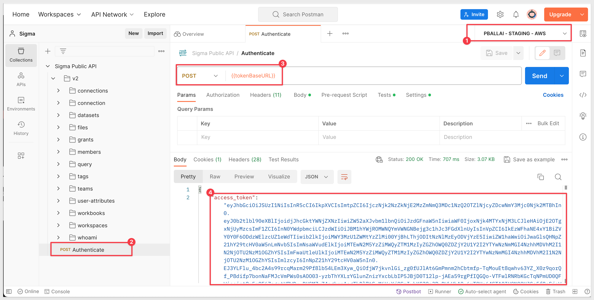

author: pballai
id: security_snowflake_keypair_rotation
summary: security_snowflake_keypair_rotation
categories: security
environments: web
status: Published
feedback link: https://github.com/sigmacomputing/sigmaquickstarts/issues
tags: default
lastUpdated: 2023-06-04

# Snowflake Key-pair Authorization

## Overview
Duration: 5 

Sigma supports Basic Auth (username + password) and OAuth for new Snowflake connections.

With this feature release, we've added support for the key pair authentication method (public key + private key) for Snowflake connections.

<aside class="positive">
<strong>IMPORTANT:</strong><br> At the time of this QuickStart Snowflake announced that they will require key pair authentication for service users starting in November 2025. This will be a mandatory requirement, and single-factor password authentication will no longer be supported. This change is part of Snowflake's broader initiative to enhance security and enforce multi-factor authentication (MFA) for all users. 
</aside>

Snowflake supports key pair authentication using a combination of public and private RSA key pairs. The private key remains with the client (Sigma), while the corresponding public key is stored by the holder of the correct public key (in this case, Snowflake).

Using public and private keys for encryption and decryption, commonly known as public-key cryptography or asymmetric cryptography, offers **multiple benefits to businesses:**

 <ul>
      <li><strong>Enhanced Security:</strong> The most apparent benefit is the heightened security provided by the separation of encryption and decryption keys. A message encrypted with the public key can only be decrypted by the corresponding private key, and vice versa. This ensures that even if a malicious actor intercepts an encrypted message, they cannot decipher it without access to the appropriate private key.</li>
      <li><strong>Authentication:</strong> Asymmetric cryptography isn't just for encryption; it's also used for authentication. Digital signatures can be created using a private key, and anyone with the corresponding public key can verify the authenticity of the signature. This helps ensure that a message's sender is genuine.</li>
      <li><strong>Integrity:</strong> Coupled with authentication, asymmetric cryptography ensures the integrity of a message. If a digitally signed message is altered in transit, the signature will no longer match, alerting the recipient to the discrepancy.</li>
      <li><strong>Non-repudiation:</strong> Since only the holder of the private key can generate a digital signature, the sender cannot later deny (i.e., repudiate) having sent the message.</li>
      <li><strong>Non-repudiation:</strong> Since only the holder of the private key can generate a digital signature, the sender cannot later deny (i.e., repudiate) having sent the message.</li>
      <li><strong>Scalability and Efficiency:</strong> In a business setting where many individuals need to communicate securely, public-key cryptography eliminates the need for each pair of users to share a unique secret key. This scalability can simplify key management dramatically in large organizations.</li>
      <li><strong>Flexible Key Distribution</strong> Distributing public keys is easy and doesn't require secure channels. Anyone can have access to a public key without compromising security. On the other hand, distributing shared secret keys (as in symmetric encryption) securely can be a challenge</li>
      <li><strong>Flexible Key Distribution:</strong> Distributing public keys is easy and doesn't require secure channels. Anyone can have access to a public key without compromising security. On the other hand, distributing shared secret keys (as in symmetric encryption) securely can be a challenge.</li>
      <li><strong>Perfect Forward Secrecy (PFS):</strong> By frequently generating new key pairs (key rotation) for sessions, even if a private key is compromised, only data from that specific session is vulnerable. Past and future sessions remain secure, provided their keys remain un-compromised.</li>
      <li><strong>Support for Digital Certificates:</strong> Public key infrastructure (PKI) systems use asymmetric cryptography to issue digital certificates, which vouch for the identity of the public key holder. This adds an extra layer of trust and verification in business transactions.</li>
      <li><strong>Regulatory Compliance:</strong> Many industries have regulations and standards that mandate strong encryption and secure communication. Using public-key cryptography can help businesses meet these regulatory requirements.</li>
      <li><strong>Enhanced Customer Trust:</strong> Knowing that a business uses strong cryptographic measures can increase trust among clients and customers, reinforcing the brand's reputation for valuing security and privacy.</li>
</ul>
 
#### Some specifics:

**The main idea is that Snowflake can verify the client's identity without the client ever revealing its private key.**

Each public key corresponds to only one private key.

Private keys can be associated with one or multiple public key holders (for example, multiple Sigma connections, if you prefer to use one private key).

Data encrypted with the private key can only be decrypted with the public key, and vice versa.

Together, they encrypt and decrypt messages. In this context, the messages are Sigma's connections to Snowflake as configured in Sigma.

For authentication purposes, Sigma uses the private key to generate a digital signature. A digital signature assures that the person/service sending the message is who they claim to be.

The client decrypts the signature using the public key and compares the hash to its own computed hash. If the values match, Sigma's authentication is confirmed.

We'll discuss RSA encryption further in the next (optional) section, which is provided for its educational value.

<aside class="positive">
<strong>IMPORTANT:</strong><br> Some screens in Sigma may appear slightly different from those shown in QuickStarts. This is because Sigma is continuously adding and enhancing functionality. Rest assured, Sigma’s intuitive interface ensures that any differences will not prevent you from successfully completing any QuickStart.
</aside>

For more information on Sigma's product release strategy, see [Sigma product releases.](https://help.sigmacomputing.com/docs/sigma-product-releases)

### Target Audience
Sigma administrators interested in implementing RSA connection encryption via key pair authorization and key rotation.

### Prerequisites

<ul>
  <li>A computer with a current browser. It does not matter which browser you want to use.</li>
  <li>Access to a Sigma environment.</li>
  <li>Access to a Snowflake environment. Enterprise is required for trial account testing</li>
  <li>Some familiarity with Sigma is assumed. Not all steps will be shown as the basics are assumed to be understood.</li>
</ul>

<aside class="postive">
<strong>IMPORTANT:</strong><br> Sigma recommends that you use non-production resources when doing QuickStarts.
</aside>

<button>[Sigma Free Trial](https://www.sigmacomputing.com/free-trial/)</button> <button>[Snowflake Free Trial](https://signup.snowflake.com/)</button>
 

## RSA Encryption (optional reading)
Duration: 20

Snowflake uses RSA 2048-bit encryption for its support of key pair authorization.

Sigma can leverage this support through its custom Go driver, which is used to create connections to Snowflake.

It's important to have a general understanding of RSA encryption (RSA) to fully appreciate its effectiveness. We'd be remiss not to mention the three inventors behind RSA, who developed it back in 1977. In fact, the name RSA is derived from their initials:<br>


While RSA has evolved over the years, its core security principle remains rooted in the challenge of factoring semi-prime numbers.

A semi-prime number is a natural number that is the product of two prime numbers.

Factoring a semi-prime results in two prime numbers.

A genuine example of a semi-prime is the number 15. 15 is the product of two prime numbers: 3 and 5. So, 15 is a semi-prime because it is the product of the prime numbers 3 and 5.

There is no known algorithm that can factor large semi-primes in polynomial time (relative to the number of digits in the semi-prime). All known algorithms require time that grows at least exponentially with the size of the semi-prime, making them infeasible for very large semi-primes.

Quantum algorithms, like [Shor's algorithm](https://en.wikipedia.org/wiki/Shor%27s_algorithm), have the potential to factor semi-primes in polynomial time. However, as of this writing, large-scale quantum computers capable of running Shor's algorithm efficiently are still in the realm of future possibilities. If they become a reality, they could challenge cryptographic systems that rely on the difficulty of semi-prime factoring, including RSA.

#### The contest

The RSA Factoring Challenge was introduced by RSA Laboratories on March 18, 1991, offering cash rewards to those who could successfully factor specific numbers.

The organizers released a list of semi-primes (numbers with precisely two prime factors) known as the RSA numbers and attached a cash prize for the successful factorization of select numbers from the list. The smallest of them, a 100-decimal digit number dubbed RSA-100, was successfully factored by April 1, 1991.

Consequently, RSA-100 is no longer seen in commercial applications today. As of 2020, the largest yet-to-be-factored RSA number is RSA-250.

Several larger RSA numbers remain un-factored and are projected to stay that way for a considerable duration.

[You can read more about the content here:](https://en.wikipedia.org/wiki/RSA_Factoring_Challenge)

As previously highlighted, Snowflake employs RSA-2048, a number that has resisted factorization attempts even with a cash incentive of $200,000.

RSA-2048 is widely regarded as nearly impossible to factor given our current technological capabilities. It may remain so for many years, barring significant breakthroughs in integer factorization or a surge in computational power.

Naturally, both Sigma and Snowflake will make necessary adjustments should advancements occur in this domain.

An example of what a RSA-2048 number looks like is:


<!-- END OF SECTION-->

## Key Pair Auth
Duration: 20

Key pair authentication is a method used to authenticate a user or service (like a Sigma connection) based on a pair of keys: a private key, which remains confidential, and a public key, which is shared.

In the context of Snowflake, users or services can authenticate using RSA-2048 private keys instead of traditional passwords.

Key rotation refers to the act of substituting an existing key with a new one, thereby bolstering security.

Here are the basic steps involved:

**1. Key Pair Generation:**<br>
The user or service generates a pair of keys (private and public). This is typically accomplished using [OpenSSL](https://www.openssl.org/).<br>

**2. Public Key Registration with Snowflake:**<br>
The public key is then registered with Snowflake.

**3. Sigma Connection Creation and Configuration:**<br>
After generating the keys, a Sigma connection is created and set up using the private key from step 1.

**4. Authentication:**<br>
To authenticate a Sigma connection request, Snowflake issues a challenge to Sigma. Sigma then verifies its identity using its private key, without ever exposing it.

**5. Key Rotation:**<br>
After a predetermined period or under specific conditions, the old key pair is retired and replaced with a new one. The fresh public key is then registered with Snowflake, and the cycle repeats.


<!-- END OF SECTION-->

## Key Generation
Duration: 20

We will use [OpenSSL](https://www.openssl.org/) to generate our encrypted private key. 

Generally, it is safer to generate encrypted keys, although Sigma does support unencrypted private keys too. Sigma recommends communicating with your internal security and governance officers to determine which key type to generate prior to completing this step.

How OpenSSL is installed depends on your operating system; we are using Mac and macOS has shipped with OpenSSL preinstalled since 2000. If you are running a different O/S, consult [OpenSSL's documentation](https://www.openssl.org/docs/). 

You can also review the setup that [Snowflake recommends here](https://docs.snowflake.com/en/user-guide/key-pair-auth).

#### Step 1: Private Key

**Step 1:** Open a new `Terminal` session:


<aside class="positive">
<strong>IMPORTANT:</strong><br> If you are not familiar with Terminal, make sure you know what folder (or directory) you are working in. The next command we run will create a file in that folder and you need to know where it lives. 
</aside>

Run the following command:
```code 
openssl genrsa 2048 | openssl pkcs8 -topk8 -v2 des3 -inform PEM -out rsa_2048_private_key.p8
```

<aside class="negative">
<strong>NOTE:</strong><br> If you do want to use an unencrypted private key, just append -nocrypt to the command provided above.
</aside>

We will place this new file in a folder, on our Desktop.

You will be promoted to enter an encryption key. We will use `1234` for our passphrase. You can choose your own value or use this one. Just make sure to save your encryption key value somewhere safe if you use your own value.


<aside class="positive">
<strong>IMPORTANT:</strong><br> When entering a passphrase into the terminal window, you will need to manually type the passphrase. Copy paste may lead to unexpected results as the text is not shown. We also recommend using strong passphrases and not "1234" in production.
</aside>

A new file called `rsa_2048_private_key.p8` is created on our Desktop:


#### Step 2: Public Key Generation

From the command line, generate the public key by referencing the private key. 

The command generates the public key in PEM format.

The following command assumes the private key is encrypted and contained in the file named: `rsa_2048_private_key.p8`.

```code
openssl rsa -in rsa_2048_private_key.p8 -pubout -out rsa_2048_public_key.pub
```

You will be prompted for the passphrase (encryption key) we created earlier. Enter that `1234`; unless you created your own, then provide that instead:


We now have 2 keys on our desktop, one private and one public:


#### Step 3: Store Keys Securely
Copy the public and private key files to a local directory for storage. Record the path to the files. Note that the private key is stored using the PKCS#8 (Public Key Cryptography Standards) format and is encrypted using the passphrase you specified in the previous step.

However, the file should still be protected from unauthorized access using the file permission mechanism provided by your operating system. It is your responsibility to secure the file when it is not being used.

<aside class="negative">
<strong>NOTE:</strong><br> Although we can open the private key file using a text editor and view what looks like a key, what we are actually seeing is the PEM-encoded representation of the key (or the encrypted and PEM-encoded representation if passphrase-protected), and not the raw key values. The PEM format uses Base64 encoding to represent binary data as ASCII characters.
</aside>


<!-- END OF SECTION-->

## Snowflake Configuration
Duration: 20

We will now assign our public key to a Snowflake user. It is best practice to create a user that is dedicated for this purpose to avoid connection interruption when users are removed from Snowflake (for example, when they leave the company). 

This is referred to as a `Service Account` user and is designed to serve only the purpose of enabling authentication for a particular external application, service or API. 

Log into your Snowflake environment, using a user who has the admin role.

#### Step 1: Snowflake Script:

Since we are using a Snowflake trial account and the provided Snowflake_Sample_Data, there are some limitations that we will handle in the script.

Run each command in the script, one at a time to make sure they run without error. There are nine commands.

<aside class="positive">
<strong>IMPORTANT:</strong><br> Remember to replace the value for "PROVIDE YOUR PUBLIC KEY, WITHOUT THE HEADER AND FOOTER TEXT" with the value of your public key (without the public key's header and footer text.):
</aside>

For example, copying the value of the public key, without headers/footers:


```code
-- 1: Change Role to ACCOUNTADMIN
USE ROLE ACCOUNTADMIN;

-- 2: Resume default warehouse to use:
ALTER WAREHOUSE COMPUTE_WH RESUME;

-- 3: Set the compute_wh as active:
USE WAREHOUSE COMPUTE_WH;

-- 4: Set database to sample data:
USE DATABASE SNOWFLAKE_SAMPLE_DATA;

-- 5: Create Service Account Role:
CREATE OR REPLACE ROLE sigma_service_account_role comment = 'For Sigma Key Auth QuickStart';

-- 6: Grant privileges to the newly created role on one Snowflake sample database:
-- The Snowflake Sample Database is shared asset and that limits what privileges are allowed. This is ok, we will work around that:
GRANT IMPORTED PRIVILEGES ON DATABASE SNOWFLAKE_SAMPLE_DATA TO ROLE sigma_service_account_role;

-- 7: Create a Service Account user for new Sigma Connection:
CREATE OR REPLACE USER sigma_service_account
    password = 'a*Gu2sc9DBk*8c'
    login_name = 'sigma_service_account'
    display_name = 'sigma_service_account'
    first_name = 'sigma'
    last_name = 'service_account'
    must_change_password = false
    disabled = false
    default_warehouse = sigma_quickstart_wh
    default_namespace = SNOWFLAKE_SAMPLE_DATA
    default_role = sigma_service_account_role
    rsa_public_key = 'PROVIDE YOUR PUBLIC KEY, WITHOUT THE HEADER AND FOOTER TEXT'
    comment = 'For Sigma Key Auth QuickStart';
   
-- 8: Grant the role to the user
GRANT ROLE sigma_service_account_role to user sigma_service_account;

-- 9: Grant warehouse usage to role:
GRANT USAGE ON WAREHOUSE COMPUTE_WH TO ROLE sigma_service_account_role;

```

Once all the script steps are run and verified, we can move on to the next step.


<!-- END OF SECTION-->

## Sigma Connection Configuration
Duration: 5

Now that we have setup Snowflake with our service account user, role and assigned the public key, we are ready to add a new connection in Sigma

Log into Sigma (as administrator) and navigate to `Administration` > `Connections` and click `Create Connection`:


Give your connection a name and fill out the required fields:


<aside class="negative">
<strong>Why Sigma asks for both a private key and a public key fingerprint:</strong><br> When configuring a Snowflake connection using key-pair authentication, Sigma requires both the private key and the corresponding public key fingerprint.

The private key is used by Sigma to authenticate as the Snowflake service user.

The public key fingerprint is used by Sigma to verify that the uploaded private key matches the public key registered on the Snowflake user.

Snowflake itself never receives or stores the private key. Only the public key is registered on the Snowflake user. Supplying the public key fingerprint in Sigma helps prevent configuration errors (for example, pasting the wrong private key or targeting the wrong Snowflake user) and ensures the key pair is correctly aligned.
</aside>

Sigma will establish the connection if after a few seconds you should receive a  message at the bottom of the page.

You may now click the `Browse Connection` button:


We can now navigate the data assets that our Snowflake role allows, for our service account user.

If we want to go further into the data, we are able to `Explore` and enter the standard Sigma exploration workflow:


<!-- END OF SECTION-->

## Key Rotation
Duration: 5

Snowflake supports multiple active keys to allow for uninterrupted rotation. You can manually rotate your public and private keys based on whatever expiration schedule you follow internally. 

This process can be automated via the Snowflake and Sigma APIs as well.

In Snowflake, you can use the `RSA_PUBLIC_KEY` and `RSA_PUBLIC_KEY_2` parameters to associate up to two public keys with a single user; in our case, the `sigma_service_account` user.

The manual steps are as follows:

1: Generate a new public and private key pair:

**Private Key**
```code
openssl genrsa 2048 | openssl pkcs8 -topk8 -v2 des3 -inform PEM -out rsa_2048_private_key2.p8
```

Set the password to `1234` for testing purposes.

**Public Key**
```code
openssl rsa -in rsa_2048_private_key2.p8 -pubout -out rsa_2048_public_key2.pub
```

We now have the original keys and the new keys, the new keys have a `2` appended to the name:


2: Set second public key for their snowflake user by running the snowflake command on Snowflake (use your key, replacing "YOUR PUBLIC KEY 2 HERE"):
```code
alter user sigma_service_account set rsa_public_key_2='YOUR PUBLIC KEY 2 HERE';
```

3: Update the private key and private key passphrase for their snowflake connection configuration on Sigma:

In Sigma, navigate to `Administration` > `Connections` > `Snowflake Keypair Authentication` and click the `Edit` button:


We will need to provide the new `Private Key` and `Private Key Passphrase` (1234 or whatever passphrase you created when creating private key 2):


Click `Save`. 

Sigma will update the connection and if successful, will display .

4: Remove the old public key from the user profile by running the snowflake command on Snowflake:
```code
ALTER USER sigma_service_account UNSET rsa_public_key;
```

Running the following command in Snowflake allows us to see if the old public key has been removed:
```code
DESC USER sigma_service_account;
```


The key rotation is now in place and working and the old public and private keys are removed. 


<!-- END OF SECTION-->

## Sigma API
Duration: 5

As mentioned earlier, it is possible to create and update a Sigma connection via a RESTful API.

We will demonstrate how to do that using the popular program [Postman](https://www.postman.com/)

If you would like to learn how to use Postman with the Sigma API, [reference this QuickStart](https://quickstarts.sigmacomputing.com/guide/sigma_api_with_postman/index.html?index=..%2F..index#0)

If you are familiar with APIs and prefer to review [Sigma's swagger reference, that is here](https://docs.sigmacomputing.com/api/v2/)

[The general API documentation is here](https://docs.sigmacomputing.com/#overview)

#### Create a new Sigma Connection with Key Pair Auth:

<aside class="negative">
<strong>NOTE:</strong><br> The following steps assume you have a Postman account (the free account is fine) and have imported Sigma's OpenAPI spec.
</aside>

**1:** In Postman, open the Sigma Public API and select the `Authenticate` method. 

**2:** Be sure to have a Postman Environment setup [(reference the Sigma with Postman QuickStart)](https://quickstarts.sigmacomputing.com/guide/sigma_api_with_postman/index.html?index=..%2F..index#0) for your configuration details.

**3:** Click `Send`. We should receive a response that includes our "access token" (also known as "bearer token").



**4:** Open the method `v2` > `connections` > `POST Creates a new connection`.

**5:** Paste the following code in the `Body` of the POST method. Replace values as required:
```code
{
  "details": {
    "type": "snowflake",
    "user": "sigma_service_account",
    "host": "YOUR SNOWFLAKE ACCOUNT.snowflakecomputing.com",
    "role":  "sigma_service_account_role",
    "warehouse": "COMPUTE_WH",
    "useOauth": false,
    "account": "YOUR SNOWFLAKE ACCOUNT",
    "authType": "key-pair",
    "privateKey": "YOUR PRIVATE KEY WITH HEADER AND FOOTER",
    "privateKeyPassphrase": "1234"
  },
  "name": "Encrypted-Key-Pair-via-API",
  "description": {},
  "timeoutSecs": 600,
  "useFriendlyNames": false
}
```

<strong>IMPORTANT:</strong><br> 
The API will not automatically handle line breaks if you just paste your private key into the body of the POST message. 

The private key needs to be formatted so that it is interpreted as a single string, 

Options include:

**Replacing Newlines with \n:**<br> 
Replace actual newlines with the characters "\n". This ensures that the multi-line RSA key becomes a single string that's easier to transmit in many API payloads. 

For our simple test, we will use this method. You can manually add the "/n" to each line or use your browser's inspection feature to grab the string as a JSON literal. 

In order to copy the key as JSON, open your browser's inspector and then open the key pair auth connection we created earlier in Sigma and edit it. Change the name (add a "1" to the end of it's name for example), reenter your private key and passphrase and click `Save`. 

In inspector, copy the private key as a JSON literal. This can be found under `Network` > `check` as shown:


This can now be used in our Postman POST method for private key and will include the line breaks for us.

**Reading the RSA Key from a File:** <br> 
Storing your private key in a file (and ensuring it's kept secure) allows you to read it into your script without having to hard-code it.

**Using a Script to Call the API:** <br>
Using a script to call the API can be a more flexible and automated approach than using tools like Postman, especially when there are additional preprocessing steps involved. Third-party key management software is useful in this regard and has additional advantages such as centralizing enterprise key management. 

**5:** Run the POST to create the connection

If successful, you should receive a response body and a `Status=201 Created`:


**6:** In Sigma, `Administration` > `Connections`, we see our new connection: 


<aside class="negative">
<strong>NOTE:</strong><br> If the private key that corresponds with the public key applied earlier in Snowflake was used, we will be able to browse the Sigma connection's data. If not, Snowflake will need to obtain the correct public key as described earlier in this QuickStart.
</aside>


<!-- END OF SECTION-->

## Sigma Write Access
Duration: 5

Although we will not cover write access in this QuickStart, Sigma key pair authentication supports the functionality that is enabled by providing access (in the Sigma connection configuration) to a Snowflake resource.

Specifically, these include CSV upload, materialization, input tables, and dataset warehouse views, all require write access to a destination in your warehouse.

Once you have your Sigma connection to Snowflake configured for key pair authentication, enabling write access is the same as if the connection was using basic authorization. 

For more information, see [Set up write access](https://help.sigmacomputing.com/docs/set-up-write-access)


<!-- END OF SECTION-->

## What we've covered
Duration: 5

In this QuickStart we learned the features and benefits of key pair authentication and some background on the RSA encryption algorithm. Next, we covered how to make key pair authorization work in Sigma and Snowflake and how to rotate the keys manually. 

#### Additional Resource Links

Be sure to check out all the latest developments at [Sigma's First Friday Feature page!](https://quickstarts.sigmacomputing.com/firstfridayfeatures/)

[Help Center Home](https://help.sigmacomputing.com)<br>
[Sigma Community](https://community.sigmacomputing.com/)<br>
[Sigma Blog](https://www.sigmacomputing.com/blog/)<br>
<br>

[](https://twitter.com/sigmacomputing)&emsp;
[](https://www.linkedin.com/company/sigmacomputing)&emsp;
[](https://www.facebook.com/sigmacomputing)


<!-- END OF WHAT WE COVERED -->
<!-- END OF QUICKSTART -->
