author: pballai
id: administration_sso_okta
summary: administration_sso_okta
categories: security
environments: web
status: Published
feedback link: https://github.com/sigmacomputing/sigmaquickstarts/issues
tags: default
lastUpdated: 2023-05-01

# Single Sign-On with Sigma and Okta
<!-- The above name is what appears on the website and is searchable. -->

## Overview 
Duration: 5 

We can configure Sigma to use Single Sign-On (SSO) Authentication with any platform that supports SAML (ie Okta, OneLogin and Google SSO). We can also configure Sigma to use custom implementations that uses SAML.‍ 

For this QuickStart, we will focus on Okta.

When using Okta SSO, there are several user management options available. These include:

 <ul>
      <li><strong> User Provisioning:</strong> Okta can automatically provision user accounts in the target applications when the user is added or modified in Okta. This can reduce manual effort and ensure consistency across applications.</li>
      <li><strong>User Deprovisioning:</strong> Okta can automatically deprovision user accounts in the target applications when the user is deleted or deactivated in Okta. This can help ensure that former employees or contractors no longer have access to company data.</li>
      <li><strong> Group Management:</strong> Okta allows administrators to create groups and assign users to those groups. This can simplify application provisioning and deprovisioning by allowing administrators to manage access based on groups instead of individual users.</li>
      <li><strong> Access Policies:</strong> Okta allows administrators to define access policies that govern user access to specific applications or data. These policies can be based on factors such as user location, device, or role.</li>
      <li><strong> Password Policies:</strong> Okta provides password policies that can enforce password complexity rules and expiration policies. This can help ensure that users have strong passwords and reduce the risk of password-related security breaches.</li>
      <li><strong> User Self-Service:</strong> Okta provides a self-service portal that allows users to reset their passwords or update their profile information. This can reduce the burden on IT help desks and improve user satisfaction.</li>
</ul>

While Okta has many options available, we will focus on the foundational features.

 ### Target Audience
Sigma administrators or security professionals who are interested in learning how to implement Sigma SSO with Okta.

### Prerequisites

<ul>
  <li>A computer with a current browser. It does not matter which browser you want to use.</li>
  <li>Access to your Sigma environment. A Sigma trial environment is acceptable and preferred.</li>
  <li>An Okta account as Administrator. A development environment is acceptable.</li>
</ul>

<aside class="postive">
<strong>IMPORTANT:</strong><br> Sigma recommends that you use non-production resources when doing QuickStarts.
</aside>

<button>[Sigma Free Trial](https://www.sigmacomputing.com/free-trial/)</button> <button>[Okta Developer Account](https://developer.okta.com/signup)</button>

<aside class="postive">
<strong>IMPORTANT:</strong><br> We will assume you have access to (or setup trials) as outlined above before starting this QuickStart. We will not cover the steps to access the base sites as the vendors have made the process very straight-forward.
</aside>
  
### What You’ll Learn
How to implement and customize Sigma Single-Sign-On using Okta as the identity provider. 

### What You’ll Build
The results of this QuickStart will be a Sigma instance that only allows SSO, with user management provided by Okta. In the end, we will have a test user who can login to Sigma with SSO, have Sigma Creator rights but is not allowed to export any data.


<!-- END OF OVERVIEW -->

## **Initial SSO Configuration**
Duration: 20

Login into Okta as Administrator and navigate to `Applications` > `Applications` and click `Browse App Catalog`:

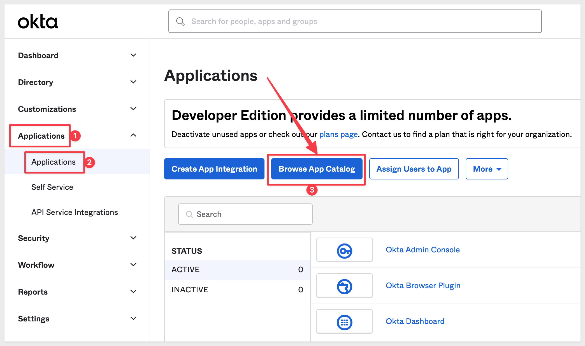

Type `Sigma` into the search bar and select either "Sigma on AWS" or "Sigma on GCP" depending on where your Sigma instance is hosted:


<aside class="negative">
<strong>NOTE:</strong><br> To see where your Sigma instance is hosted, login to Sigma (as Administrator) and navigate to Administration > Account. The cloud provider is listed near the top in the "Site" grouping.
</aside>

On the next page we see that Sigma is "Okta Verified". Click `Add Integration`:


Give the integration a name and click `Done`:

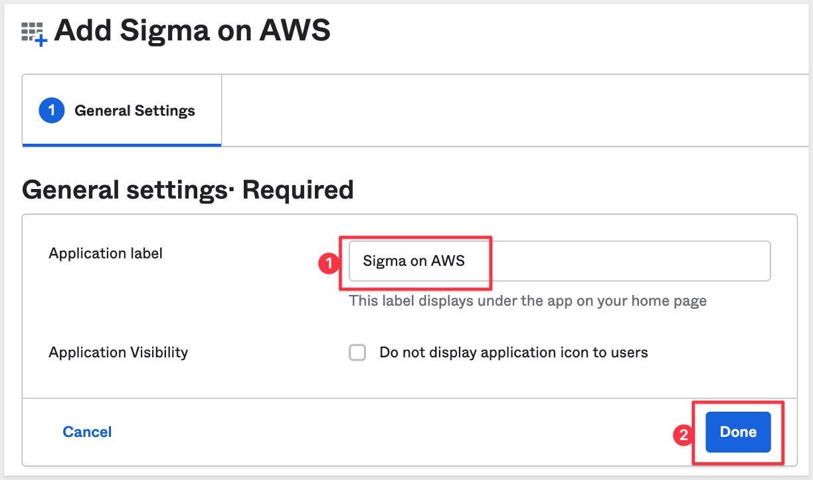

We have to get some information and configure things in Sigma as we set this up.

In another browser tab, log into Sigma and navigate to `Administration` > `Account` and copy the URL as shown:


This is the URL Okta will use to reach Sigma. Save it off in a text file so we can use it later.

Navigate to `Administration` > `Authentication` and click `Edit`:

Select `SAML or password` so that we can login with Okta SSO or directly into Sigma with a our admin username and password. 

There are other options on this page but we will leave them at the defaults. The links below provide more information on those options:

[Guest Access](https://help.sigmacomputing.com/docs/guest-user-accounts)

[Multi-Factor Authentication](https://help.sigmacomputing.com/docs/two-factor-email-authentication#enable-two-factor-authentication)


<aside class="positive">
<strong>IMPORTANT:</strong><br> Sigma supports the configuration of both SP-initiated and IdP-initiated authentication. This means your organization members can choose to login to Sigma from either your IdP console or your Sigma login page. After testing, we will change this to enforce SSO only login.
</aside>

Sigma needs to have an Identity Provider (IDP) login URL and X509 certificate. We can gets these from Okta (our IDP).

Return to Okta and navigate to the `Sign On` tab. Scroll down to find `Settings` group and the button to `Show details` after the "Metadata URL". We want to click to copy `Sign on URL`:


Paste this value into Sigma for the value of `Identity provider login URL`:


Now click to copy the x509 certificate, which little further down in the same group.


Paste this value into Sigma under the value for `Identity provider X509 certificate` and click `Save`:

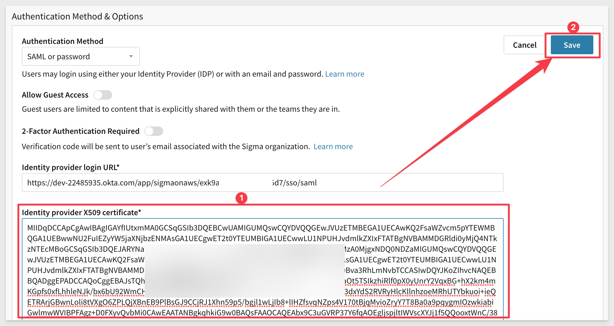

Return to Okta and the `Sign On` page. This time, click `Edit` in the `Settings` group:

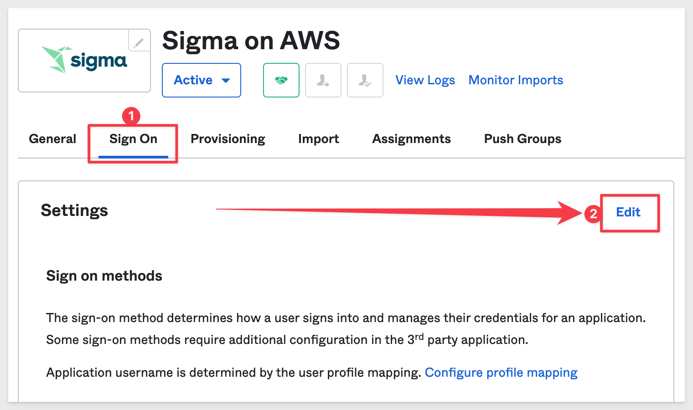

Copy the Sigma Account URL we saved off to a text file earlier and paste it into the `Default Relay State` box:


**NOTE:** The value for `Default Relay State` will vary depending on cloud provider. For AWS, append "/finish-login" to the URL. For example: <br>
```plaintext
https://app.sigmacomputing.com/[yourCompanyId]/finish-login
```

Scroll all the way to the bottom and click `Save`.

Sigma will now allow users to login with SSO or username/password.

We have not yet completed the Okta/Sigma integration, but SSO is setup. Later we will complete the integration such that users/groups added in Okta, will be  pushed to Sigma. 

## Testing SSO

Open a new Chrome browser, in `Incognito mode`, so that we avoid issues with session cookies. You could also just use another browser like Firefox or Safari to create isolation. 


Navigate to your Sigma portal using whatever URL you typically use. 

For example: https://app.sigmacomputing.com/{YOUR ACCOUNT NAME}

Now that SSO is enabled, we are presented an additional login option. Recall that we left username/password authentication on. We will turn this off later.

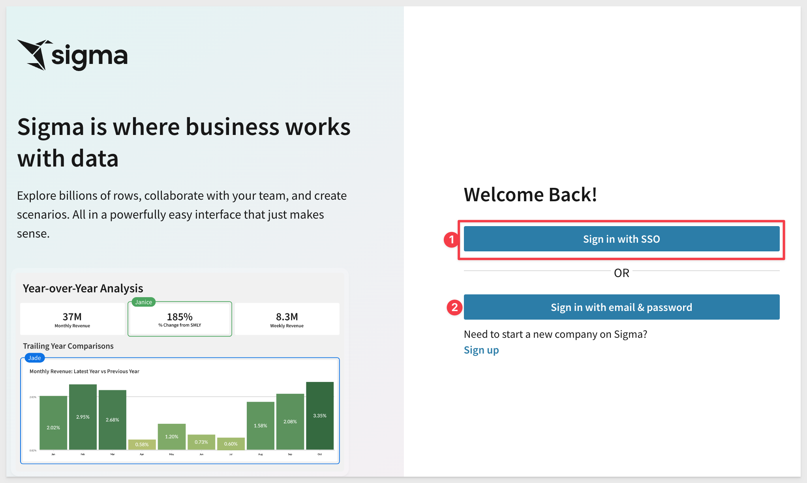

Click the `Sign in with SSO` button. We are talking to an Okta page for signing into Sigma now.

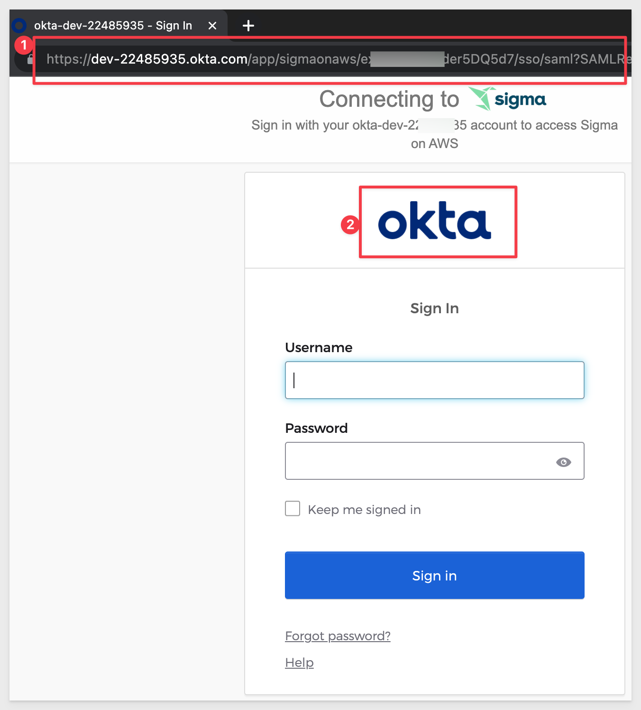

Try to login with your Sigma credentials. **It will fail.** This is because we have not created this user in Okta.

<aside class="positive">
<strong>IMPORTANT:</strong><br> We are doing it this way because if we just disable username/password authentication in Sigma, we will not have a user we can use SSO to login with. Okta will not have a record that matches the Sigma record we normally login with. This method prevents us from becoming locked out of Sigma until we have the full integration completed later.
</aside>

When errors occur in Okta (before reaching out to Sigma) it can be useful to review the Okta Application error log:

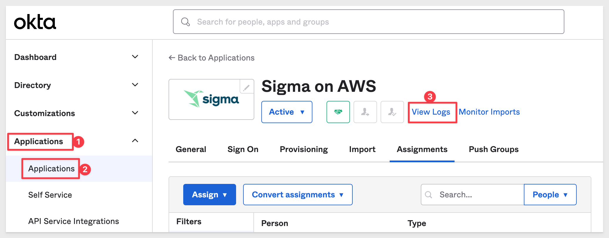

Here we see `Verification error` which indicates that Okta does not have a record for this user login attempt:

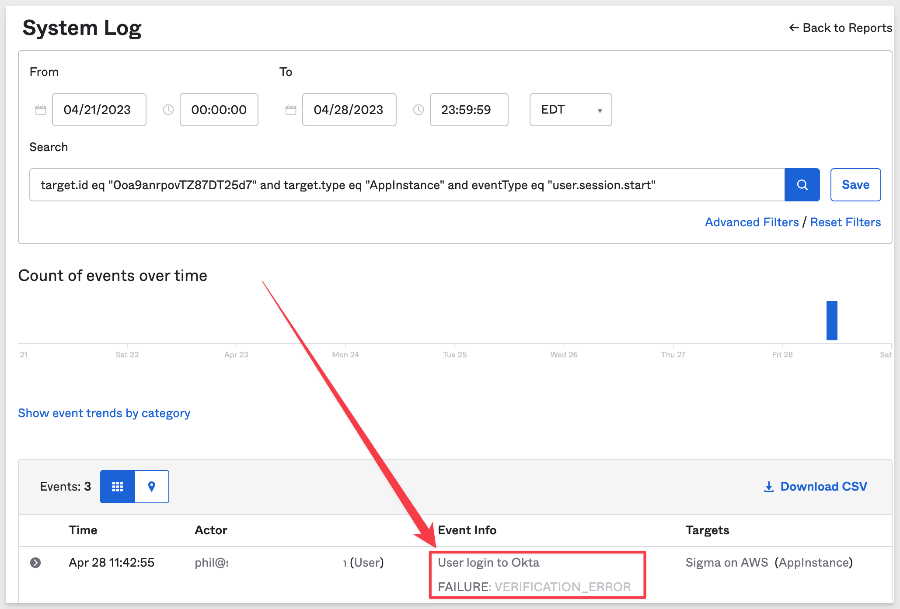

### Add User in Okta

We need to add our Sigma Admin user in Okta so we can disable non-SSO logins to Sigma. 

Navigate to `Directory` > `People` and click `Add person`:

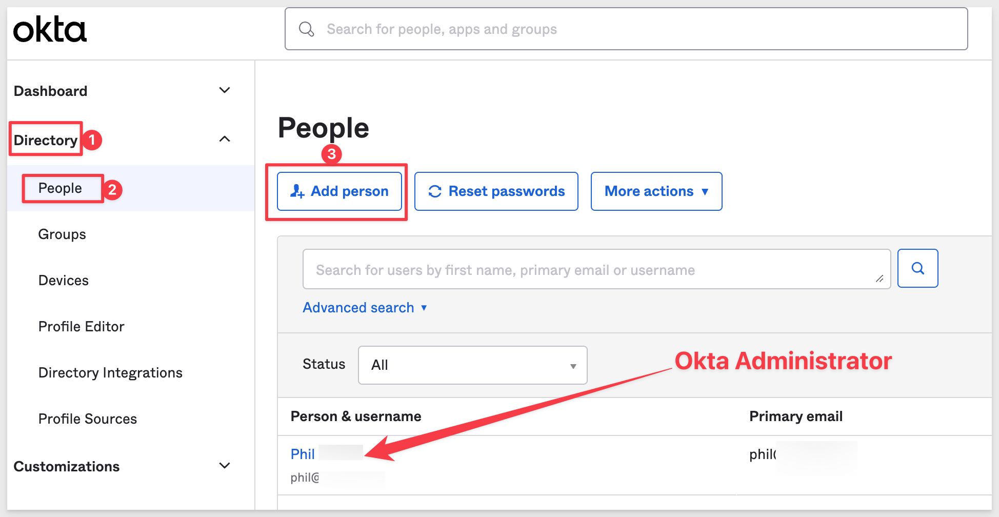

Configure the new user as follows and use the same password used for your Administrator user in Sigma:


Go back to the incognito Chrome window and try to login again. **It will fail but this time, the errors is more instructive:**


The user needs to be "assigned" to the Sigma application. Currently, this Okta user is not allowed to use anything.

In Okta, navigate to the `People` list again and click on the user we created previously.

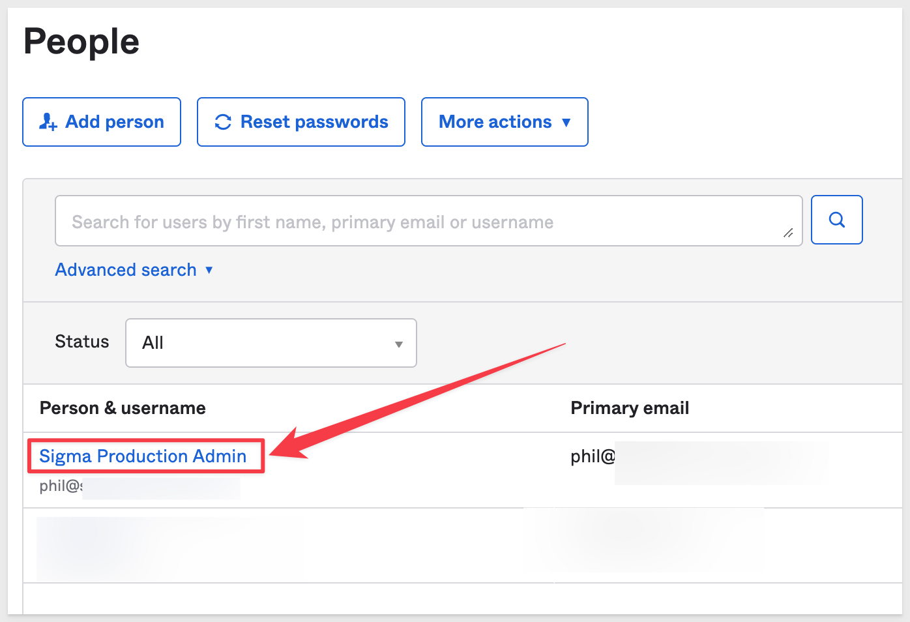

Click the `Assign Application` button.


Click to assign the `Sigma on AWS` application:

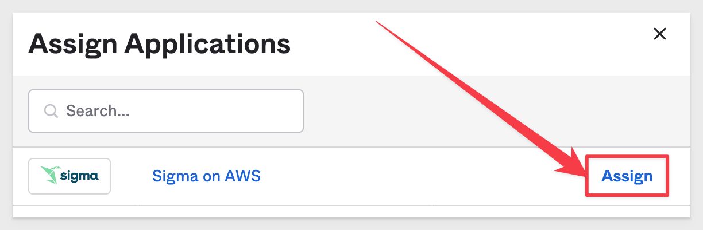

Next click `Save and go back`:

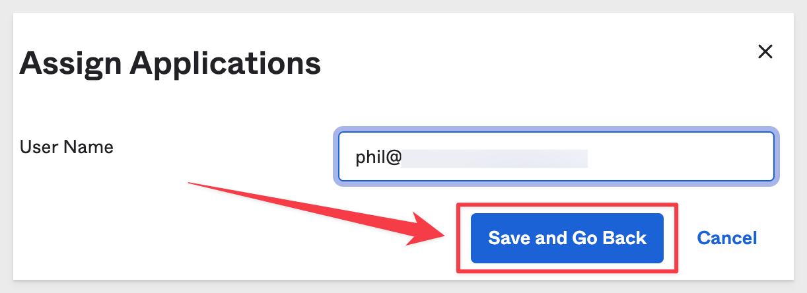

Click `Done`.

Now that the user is added in Okta, go back to incognito Chrome again and try to login again.

We are now able to login to Sigma with SSO.

Another inspection of the Okta log for the Sigma application reveals the two steps that occured:


<!-- END OF SECTION -->

## **Disable Standard Authentication**
Duration: 20

We want to disable username/password logins to Sigma and enforce only SSO with Okta.

In Sigma, navigate to `Administration` > `Authentication` and click the `Edit` button.

Change the `Authentication Method` to only `SAML`. 


Sigma will now only support SSO login, in this case with Okta.

After logging out of Sigma, close the incognito browser and reopen a new one. Browse to Sigma like:

https://app.sigmacomputing.com/{ACCOUNT NAME}/login

We now only see the `Sign in with SSO` button:

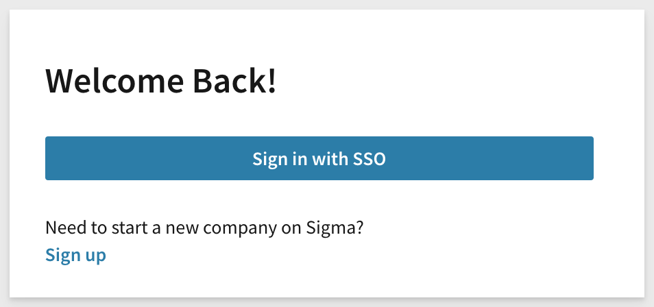

The Sigma admin user is still able to login, but only with SSO. 


<!-- END OF NEXT SECTION-->

## **SCIM**
Duration: 20

So far, we have only used the admin user account in Sigma to setup and test Okta SSO with. Now we want to learn how to manage other users who may have different roles with SSO. There are many ways to do this, but we will focus on using **“System for Cross-domain Identity Management”**, better known by its acronym **SCIM**, which is a standard for the automation of user and group provisioning between two services. In this case, the two services are Okta and Sigma.

Configuring SCIM for your Sigma organization will allow you to centralize management of users and teams through Okta.

This is preferred, as we want to manage users in one place (Okta) which likely is handing security operations for other applications besides Sigma. 

Once SCIM provisioning is enabled for both services, all management of users and teams must be done through Okta. While not directly editable in Sigma, both will be displayed in your Sigma Admin Portal.

When you add SCIM to your Okta configuration, we will gain the ability to manage Sigma teams from Okta, and both user and group/team data in Okta will automatically be pushed to your Sigma organization (via REST API), regardless of user login. 

The following functions are available with Okta / Sigma:

<ul>
  <li></li>
    <li>Push New Users:
        <ul>
        <li>New users created through Okta will also be created in Sigma.</li>
        <li>An Admin, Creator or Viewer user type (aka account type in Sigma) can be defined for each Sigma user in Okta. If no user type is defined, Sigma will limit the user to Viewer only permissions.</li>
        </ul>
    </li>
        <li>Push User Profile Updates:
        <ul>
        <li>Updates made to the user's name (‘given name’ and ‘family name’) in their Okta profile will automatically be pushed to Sigma.</li>
        <li>Updates made to a user’s ‘user type’ (via that application Assignment page) will automatically be pushed to Sigma.</li>
        </ul>
    </li>
        </li>
        <li>Deactivate Users:
        <ul>
        <li>Deactivating a user through Okta will deactivate the user in Sigma.</li>
        <li>The user's profile information will be maintained as an inactive user.</li>
        <li>Ownership of any documents created by the user will be transferred to the Admin performing the deactivation. Any documents located in the user’s My Documents folder will automatically be transferred to a folder in the Admin’s My Documents.</li>
        </ul>
    </li>
        </li>
        <li>Reactivate Users:
        <ul>
        <li>Sigma user accounts can be reactivated by reactivating the corresponding account in Okta.</li>
        <li>The user's profile information will be maintained as an inactive user.</li>
        <li>Ownership of any documents created by the user will be transferred to the Admin performing the deactivation. Any documents located in the user’s My Documents folder will automatically be transferred to a folder in the Admin’s My Documents.</li>
        </ul>
        </li>
        <li>Push Groups / Teams:
        <ul>
        <li>Groups created in Okta will be created as Teams in Sigma.</li>
        </ul>
        <li>Deactivate Groups / Teams:
        <ul>
        <li>Deactivating a group in Okta will deactivate the corresponding team in Sigma.</li>
        <li>Any documents located in the team’s workspace folder will automatically be transferred to the My Documents folder of the Admin performing the deletion.</li>
        </ul>
</ul>

[Learn more about SCIM with Sigma](https://help.sigmacomputing.com/docs/manage-users-and-teams-with-scim)


<!-- END OF NEXT SECTION-->

## Configure API Integration

Before we add anymore users in Okta, we want to configure the automated exchange of data between Okta and Sigma.

In Sigma, navigate to `Administration` > `Authentication` and click the `Setup` button for "Account Type and Team Provisioning":


In the popup, check the box on for `I have read and understand the above guidance.` and click `Next`:

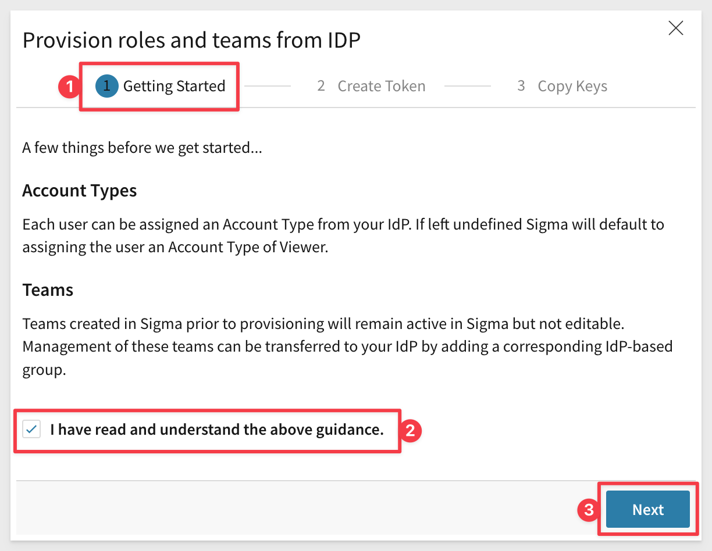

<aside class="negative">
<strong>NOTE:</strong><br>If left undefined in Okta, Sigma will default to assigning the user an Account Type of Viewer.
</aside>

Give the token a friendly name and click `Next`:

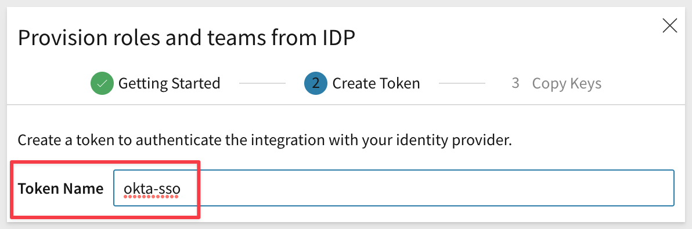

Click `Copy` for the `Directory Base URL` and `Bearer Token` and save these values to a text file for now. We will use them later.

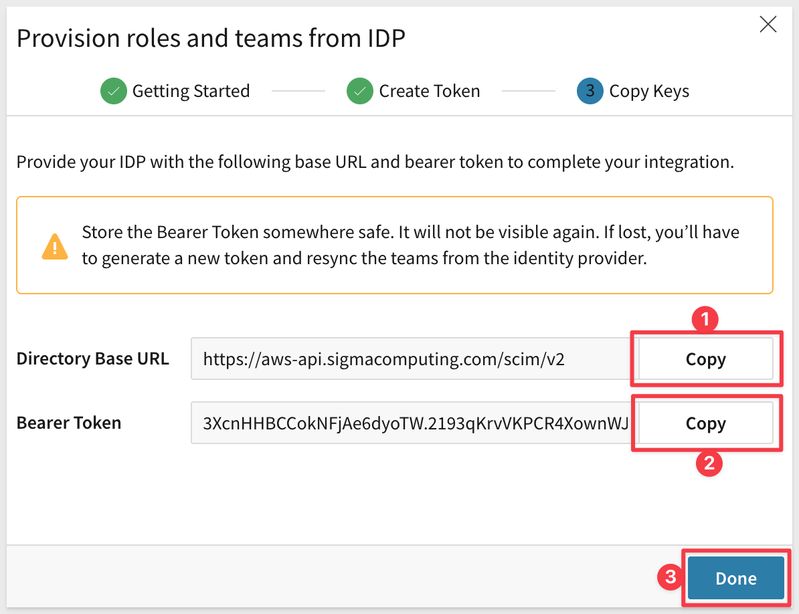

Click `Done`.

Back in Okta, navigate to `Applications` > `Applications` and click into `Sigma on AWS`. 

Click on the `Provisioning` tab. Click the `Configure API Integration` button:

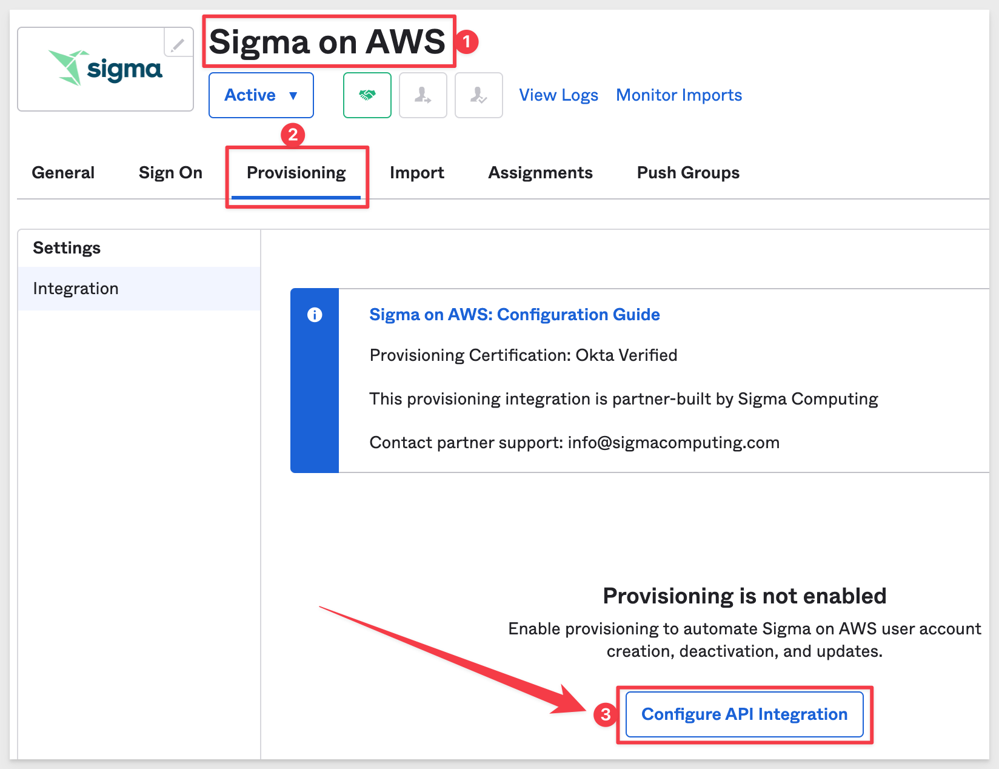

Click on the checkbox for `Enable API Integration`, paste the `API Token` (Bearer Token) we saved earlier and click the `Test API Credentials` button:

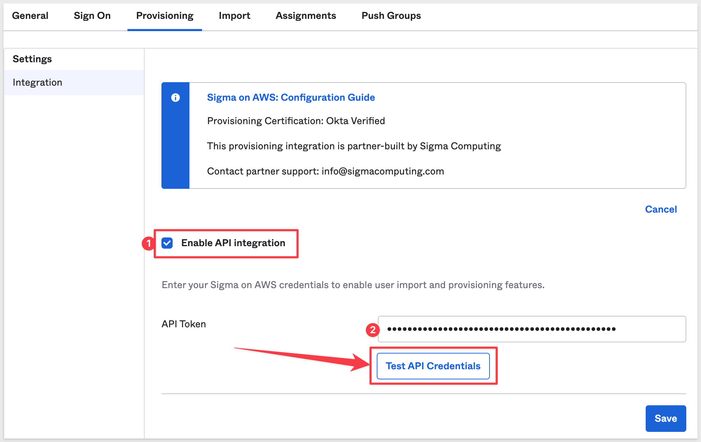

We should receive a message `Sigma on AWS was verified successfully!` if all is good.

Click `Save`.

Now Okta is able to communicate with Sigma's REST endpoint for this account only.

We now have more configuration options available to us in Okta to control SSO. 

We want to control what happens when a user who exists in Okta (and is allowed to access Sigma) but does not exist in Sigma, is handled. 

We want Okta to creates a user in `Sigma on AWS` when assigning the app to a user in Okta. 

Click `Edit at the top right corner  across from `Provisioning to App.

Then click the `Enable` checkbox on adjacent to `Create`.

Also enable the checkboxes for `Update User Attributes` and `Deactivate Users`. Okta provides information that describes what these do.

Click `Save`.


<!-- END OF NEXT SECTION-->

## Standard Account Types

Okta supports Sigma "out-of-the-box" account types. It manages this in it's `Profile Editor`. 

Navigate to `Directory` > `Profile Editor` and click on `Sigma on AWS User`:

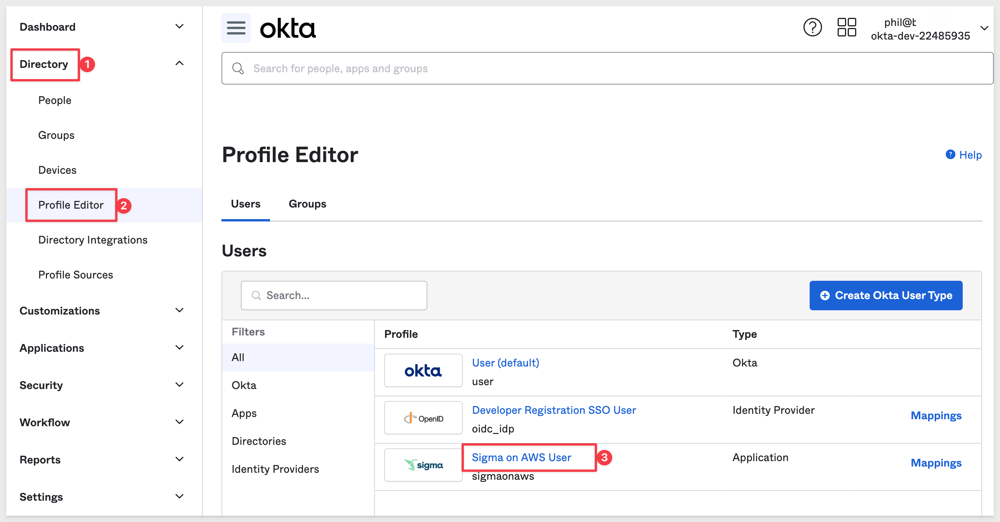

Click on the "pencil" icon for `User Type`:

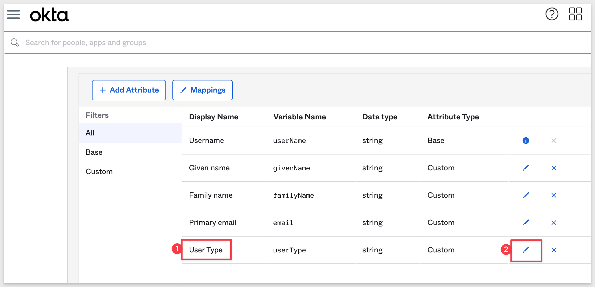

We are presented with the pre-configured settings for `User Type`. We see that the "base" Sigma `Account Types` that are included in all Sigma accounts are pre-configured for us:
```console
Viewer
Author (also called "Creator")
Admin
```

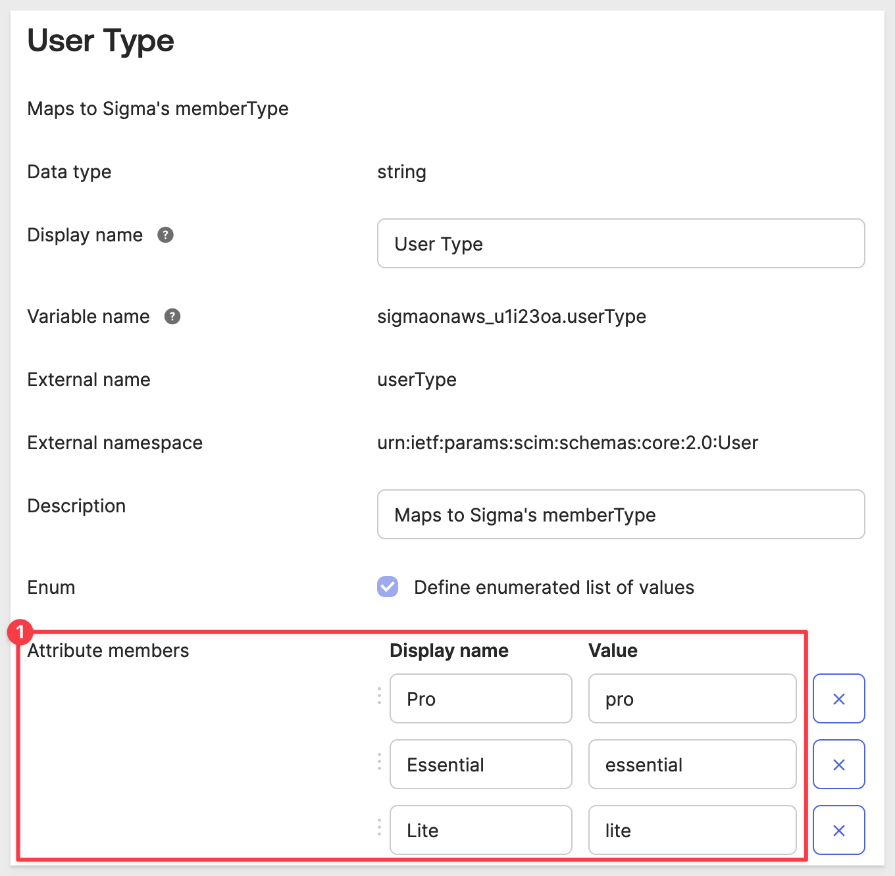

This is where we can also `+ Add Another` to support Sigma custom `Account Types` later. 

<aside class="negative">
<strong>NOTE:</strong><br> Custom Account Types in Sigma provide a way to restrict users to specific Sigma functionality. For example, not allow users to export data.
</aside>


<!-- END OF NEXT SECTION-->

## Add Group(s)
A user's `Account Type` can be managed in Okta directly and this is fine when there are only a few users. It is a best practice to use Okta `Groups` to manage what Sigma operations are permitted to all group members. 

Groups created in Okta will be pushed to Sigma now that we have the integration all set up. There is no need to create them first in Sigma. 

<aside class="negative">
<strong>NOTE:</strong><br> Okta Groups are called "Teams" in Sigma. If there were Teams already created in Sigma (if Okta was implemented some time after Sigma), they will be synchronized back to Okta automatically.
</aside>

Lets add a `Group` for `Viewers`.

In Okta, navigate to `Directory` > `Groups` and click the `Add Group` button.

You may notice some groups already exist, having been imported from Sigma (in this example, some existed but can be ignored as we will not use them). 

The `Everyone` group is created automatically by Okta. There are three Okta users, but since no application is assigned, these users have no right to login to Sigma. They can however, log into Okta, which is expected since in practice, there would be other business applications being secured by Okta.

There is one application assigned to an existing Sigma Team called `FinanceViewers`, but no users, so that is also protected from logging in via SSO.

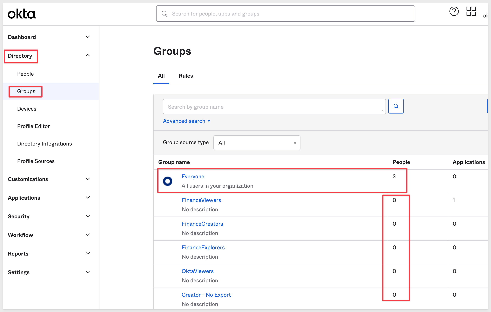

Click `Add Group` and give it a name `OktaViewers` and click `Save`:

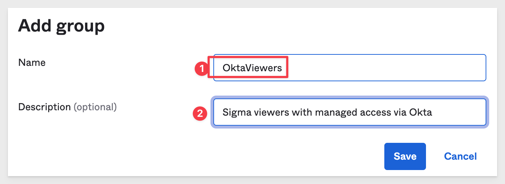

<aside class="negative">
<strong>NOTE:</strong><br> You may need to refresh your browser to have Okta show the new Group on the list.
</aside>

We need to assign the `Sigma on AWS` application to this group. Click onto the new `OktaViewers` group and click `Assign applications`.

Click the `Assign` button in the `Sigma on AWS` row.

We now need to set the Sigma `Account Type` this new group will use. We have the three standard Sigma `Account Types` to choose from. 

Select `Viewer` and click `Save` and `Done`.

Anyone who is a member of this group will get `Viewer` access as defined in Sigma > `Administration` > `Account Types` > `Viewer`.

While we are here, lets create another `Group` for Sigma Creators Account Type. The workflow is the same, but in the last step, assign the new group the `Account Type` of `Author` (which maps to Sigma Creators).

We can call this group `OktaCreators`.

When done, our `Groups` list should look this this, with the two new groups each having one application and no users assigned yet:

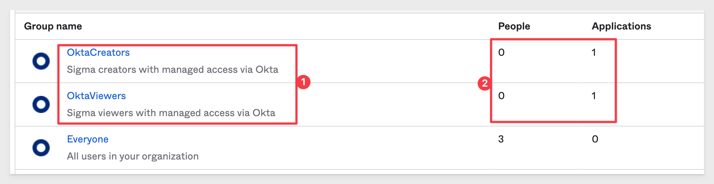

The last step (and whenever new groups are created) is to push the new group(s) to Sigma.

Navigate to `Applications` > `Applications`. We can see that our `Sigma Viewer` user has an error. This is because we did not push the new groups to Sigma yet (and they are a member of one).

Click the `Push Groups` tab.

Select `Push Groups` and `Find groups by name`.

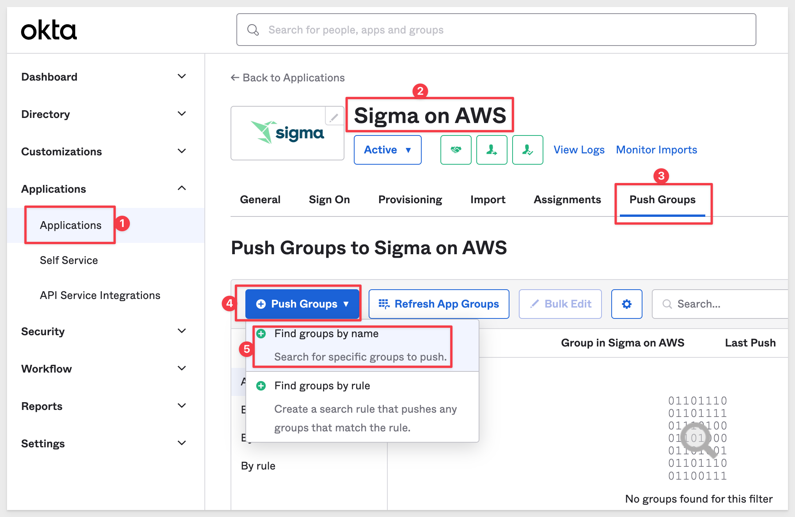

Start typing `Ok` and click to add the `OktaViewers` group:

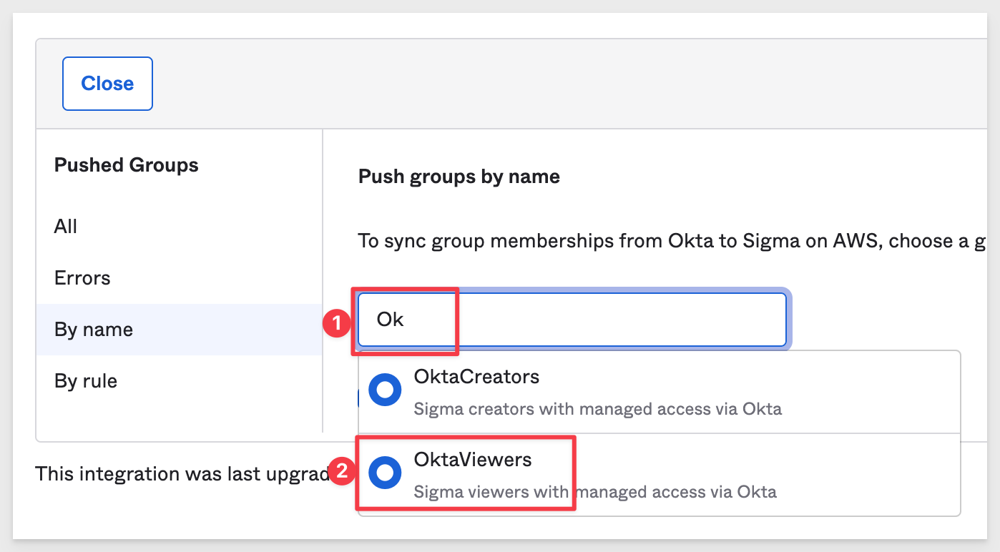

Click `Save & Add Another` and add the `OktaCreators` group as well. 

Then click `Save`. The new groups should show a status as `Pushing` to `Active` fairly quickly:

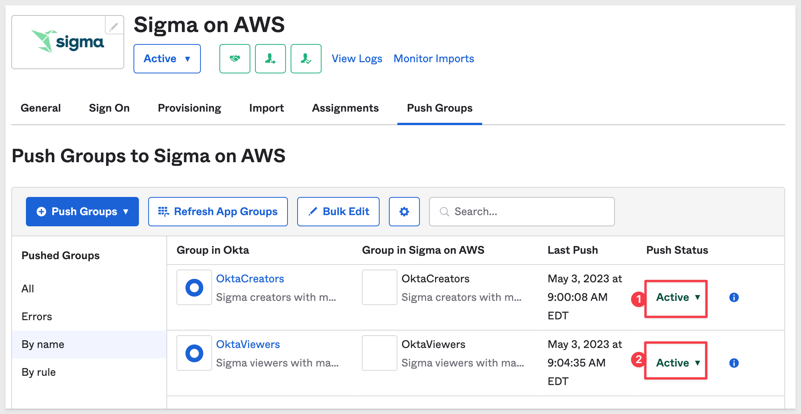


<!-- END OF NEXT SECTION-->

## Add User(s)
Duration: 20

Now we can assign new users to groups in Okta as we create them. These new users can then use SSO to gain access to Sigma and will have the group rights that are afforded to them by Sigma Account Type.

<aside class="positive">
<strong>IMPORTANT:</strong><br> We are demonstrating the general framework / workflow, which can be used to create any RBAC integration between Okta and Sigma that your organization may need. The Okta / Sigma integration is very flexible. 
</aside>

We will make our first new user a `Viewer` in Sigma.

In Okta, navigate to `Directory` > `People` and click the `Add Person` button:

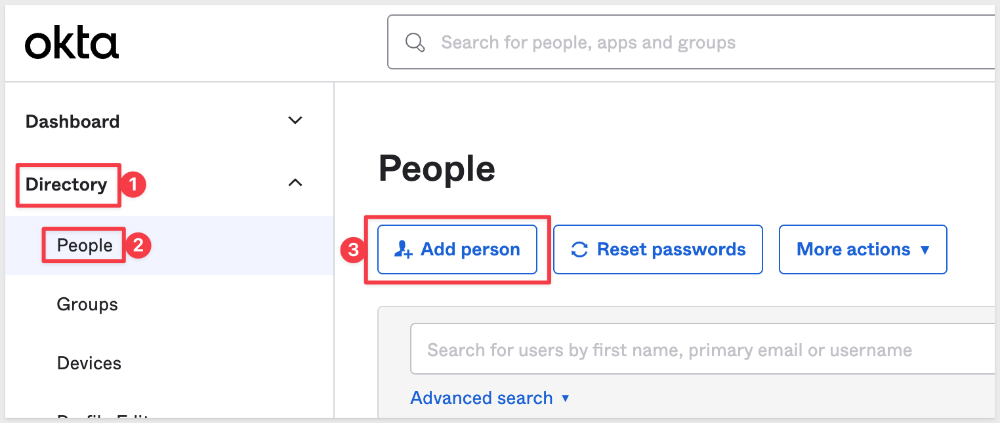

Configure the new user as shown, tailoring the details to suit the user. Check the box (#2) to set `User must change password...` on:

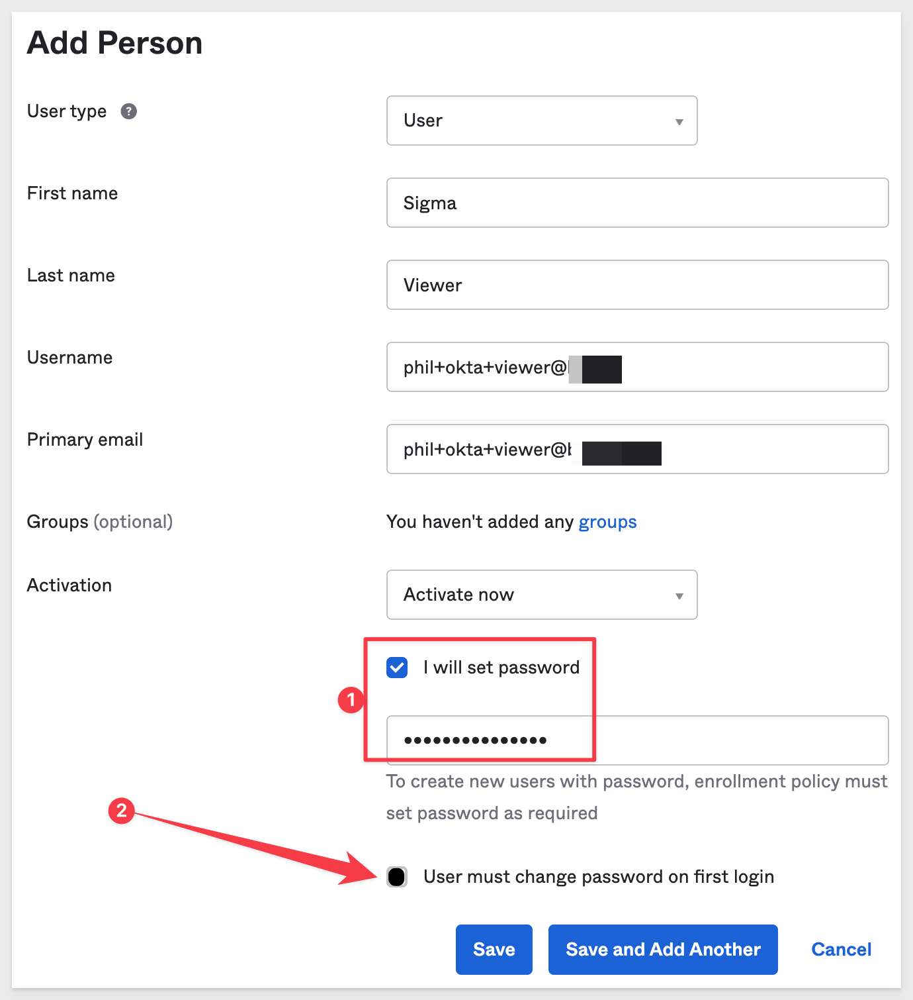

Click `Save` when done.

### Test New User

Open a new incognito Chrome browser and navigate to your Sigma account.

Click `Sign in with SSO`.

For `Username` use the email address assigned to the new user created in Okta. Enter the password as well.

Okta will respond with a page asking for a new password. Provide one. 


<aside class="negative">
<strong>NOTE:</strong><br> Okta sign-on policies and rules provide a secure and flexible way to control how users authenticate and sign in to their accounts. Password policies, Okta sign-on policies, and app-specific application sign-on policies can be configured.
</aside>

[Read more about Okta Sign-on policies](https://help.okta.com/en-us/Content/Topics/Security/policies/policies-home.htm)

After resetting the password and trying to login again we face another problem:


***What happened?***

In Okta, we created a `Group` and assigned the `Sigma on AWS` application to the group but we did not assign this user to the group. Lets do that now.

Navigate to `Directory` > `Groups` and click into the `OktaViewers` group we created. Click `Assign people`:

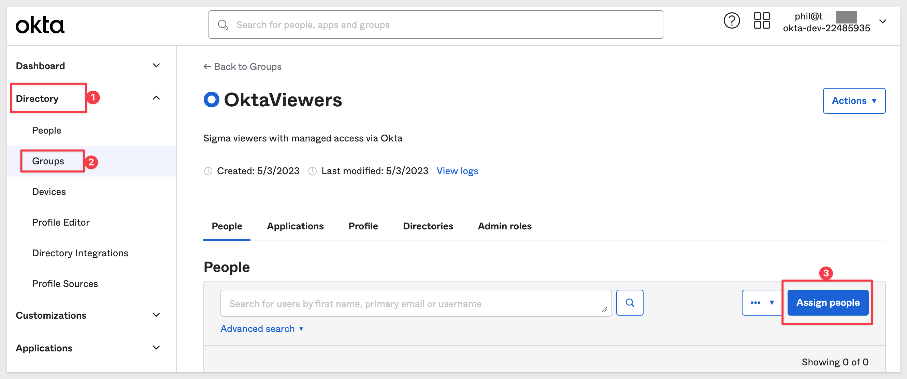

Select the `Sigma Viewer` user we created earlier by clicking on the `+`:


That user is now `Assigned` with a green checkmark in the list.

We don't need to give the new user permission to use the `Sigma on AWS` application in Okta. That is implied when we granted the Group access.

After changing password, we can successfully log into the Sigma portal. In the users `Profile` we have `Viewer` access and a team membership of `OktaViewers`:

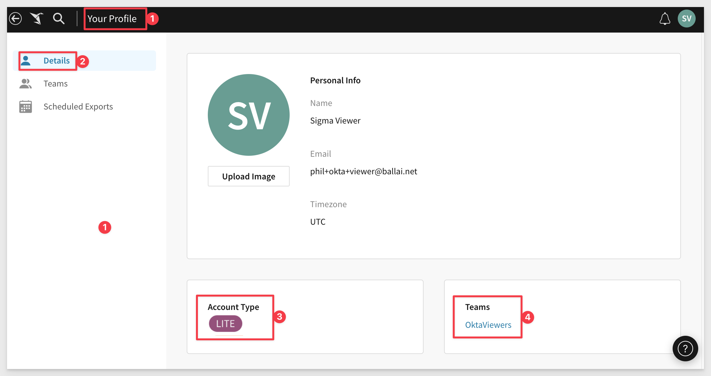

<aside class="negative">
<strong>NOTE:</strong><br> It may take a few minutes for the Okta developer account to synchronize the team down to Sigma. Refresh the Sigma page if only the "Account Type" is populated with a value.
</aside>

It is also possible to see the Sigma App in the Okta portal for this user. 

The address to login to an Okta developers account is:
```console
https://dev-22485XXX-admin.okta.com/
```

Replace the "dev-[number]" with your dev account value.

Login to Okta (in another incognito browser window). Use the new user's email and password to login. 

The Okta portal should show the Sigma App tile:


Clicking on the tile will take you directly into Sigma, as your user is Okta authenticated already.


<!-- END OF NEXT SECTION-->

## **Custom Account Types with Okta**
Duration: 20

It is common for companies to give users access to Sigma, but disallow them the ability to export (download) data for various reasons. This is done by creating an `Account Type` in Sigma, with exporting restricted, and map an Okta group to it.

Any users who are assigned to this "download restricted" group/team, will not be able to export content. 

Lets see how to adjust the user we just created in Okta to grant more rights, but also not allow exports.

Since Okta has no record for a new `Account Type` we need to add it so we can then assign it to group(s).

Navigate to `Directory` > `Profile Editor`. Locate the `Attributes` section and then `User Type`. Click the pencil icon:

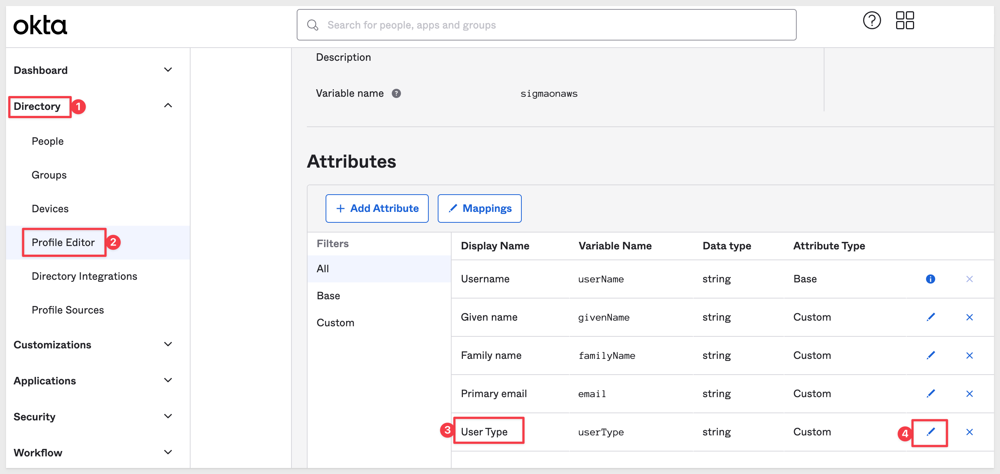

Click `Add another` and enter the values as shown:

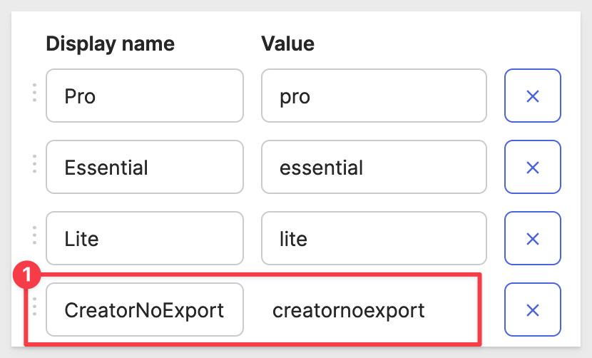

Scroll to the bottom and click `Save Attribute`.

We will need to create a new `Group` in Okta (which we will push to Sigma as a `Team`) so that we can manage the level of access we want users to have. 

<aside class="negative">
<strong>NOTE:</strong><br> Sigma comes with three "out-of-box" teams and they can be customized to suit or you can create as many other teams as needed. We just added a new one, and will restrict it's allowed Sigma functions in a bit.
</aside>

In Okta, `Directory` > `Groups`, click `Add group`:

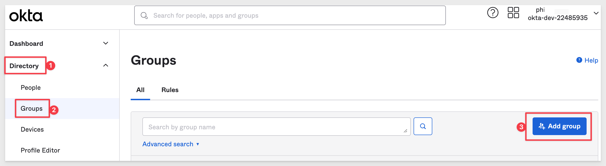

Give the `Group` a name and description as shown and click `Ok`.


We need to assign this new group to the `Sigma on AWS` application:

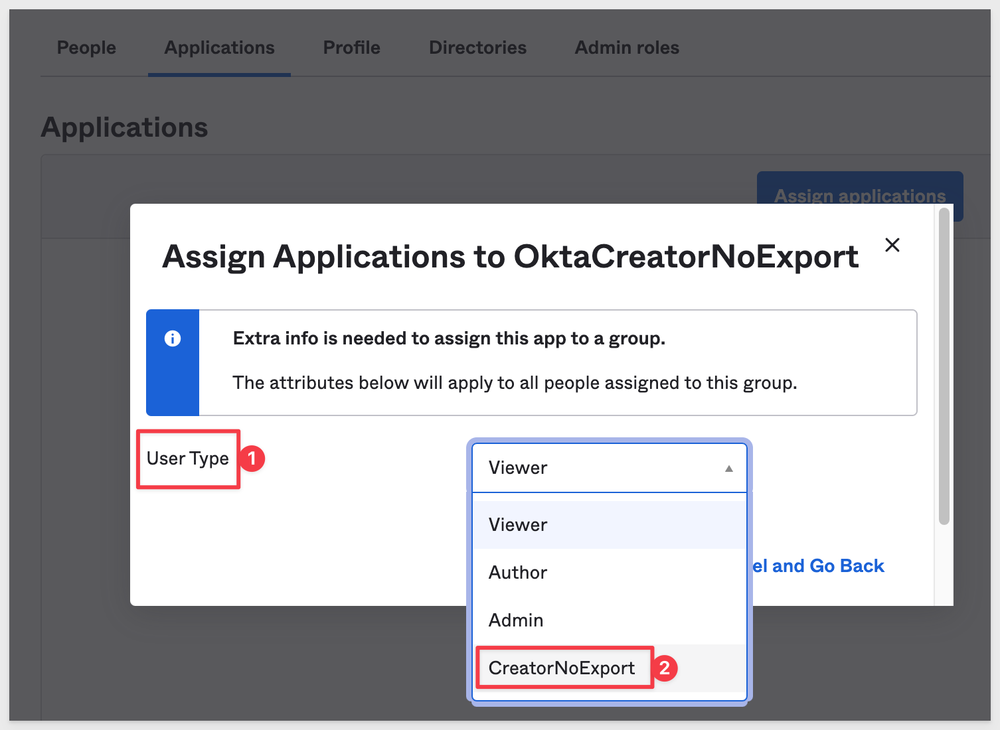

Click `Save and Go Back` and then `Done`.

The `Sigma Viewer` user already has `Viewer` rights in Sigma via Okta group membership in the `Okta Viewer` group. 

Add our test user to the new `OktaCreatorNoExport` group (using the same workflow we have done previously.)

Since this user is a member of more than one group, we need to make sure that the correct group is used when they log in. 

Navigate to the `Assignments` tab on the `Sigma on AWS` > `Applications` page.

Click `Groups`. Our three custom groups are listed. The first column is the `Priority` in which they are assigned to a user (if the user is a member) when a user logs in. We want our user to have `OktaCreatorNoExport`, so click and hold on the drag bar and drag it to the top (#1) position as shown:

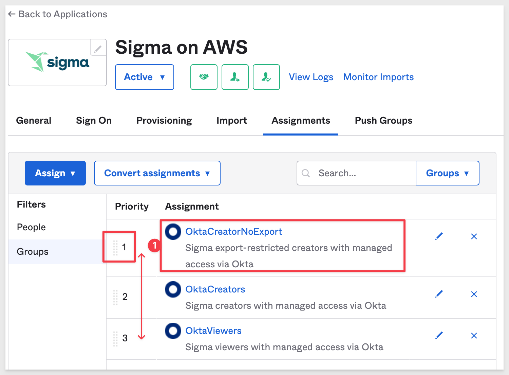

Navigate to the `Sigma on AWS` application, `Push Groups` tab. 

Click `+ Push Groups` and `Find groups by name` and select the `OktaCreatorNoExport` group.

Wait for the group to become `Active`.

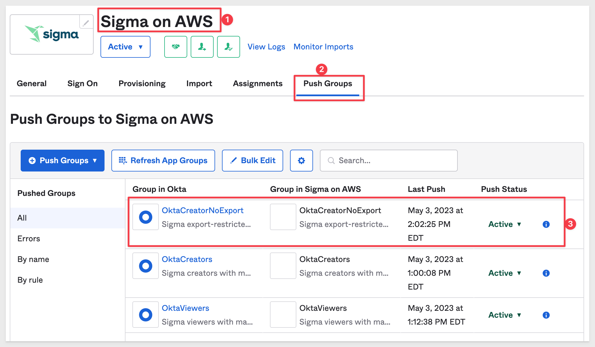

<aside class="positive">
<strong>IMPORTANT:</strong><br> Organizations that use SCIM will need to manually add all newly-created custom Account Types to their IDP.
</aside>

Return to Sigma (as Administrator)

Navigate to `Administration` > `Teams`. Our Okta Group is listed here. 

Lets add a new `Account Type`. Click on `Account Types` > and `Create New Account Type` button:

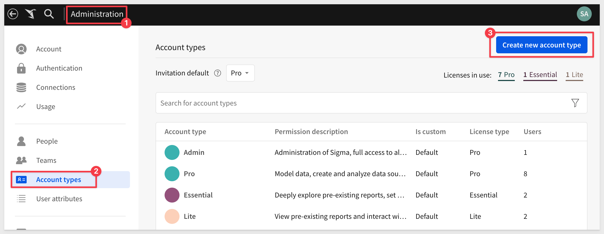

Configure the Account Type as shown. Notice that we are not allowing any Export functionality (shown in light red):

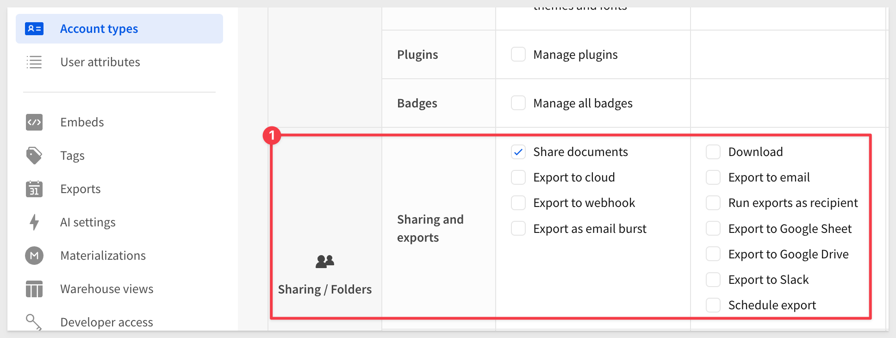

Click `Create`.

### Test New Role in Sigma

Using a new incognito browser, login to Sigma as our test user.

Navigate to `User Profile` > `Details` (the icon in the upper-most right corner) and see that this user is a member of both teams now, and has `CreateorNoExport`. We cannot change this in Sigma as Okta is handling user management operations now. 


<!-- END OF NEXT SECTION-->

## Items of Note

The Sigma / Okta integration enables many additional capabilities than covered here. We encourage you to explore based on use case needs and curiosity. 

A few of them are:

 <li>
    <ol type="n"> 
      <li><strong>User Roles:</strong> The concept of User Attribute in Sigma is implemented by using Okta userRoles to pass user-specific role information upon login. </li>
      <li><strong>Sigma Audit Logging:</strong> Captures user login events (in addition to Okta logs) for customers who want the extra layer of information.</li>
      <li><strong>Zonal Restrictions:</strong> Prevent users from logging on based on physical location.</li>
      <li><strong>Device Restriction:</strong> Prevent users from logging on based on device operating system.</li>
      <li><strong>Behavior Detection:</strong> Behavior Detection analyzes patterns of user behavior and create profiles of typical patterns based on previous activity.</li>
    </ol>
  </li>

[More reading on the extensive features Okta provides is available here](https://help.okta.com/en-us/Content/index.htm)


<!-- END OF NEXT SECTION-->


## What we've covered
Duration: 5

In this lab we learned how to implement and customize Sigma Single-Sign-On using Okta as the identity provider. 


<!-- THE FOLLOWING ADDITIONAL RESOURCES IS REQUIRED AS IS FOR ALL QUICKSTARTS -->
**Additional Resource Links**

Be sure to check out all the latest developments at [Sigma's First Friday Feature page!](https://quickstarts.sigmacomputing.com/firstfridayfeatures/)

[Help Center Home](https://help.sigmacomputing.com)<br>
[Sigma Community](https://community.sigmacomputing.com/)<br>
[Sigma Blog](https://www.sigmacomputing.com/blog/)<br>
<br>

[](https://twitter.com/sigmacomputing)&emsp;
[](https://www.linkedin.com/company/sigmacomputing)&emsp;
[](https://www.facebook.com/sigmacomputing)


<!-- END OF WHAT WE COVERED -->
<!-- END OF QUICKSTART -->
