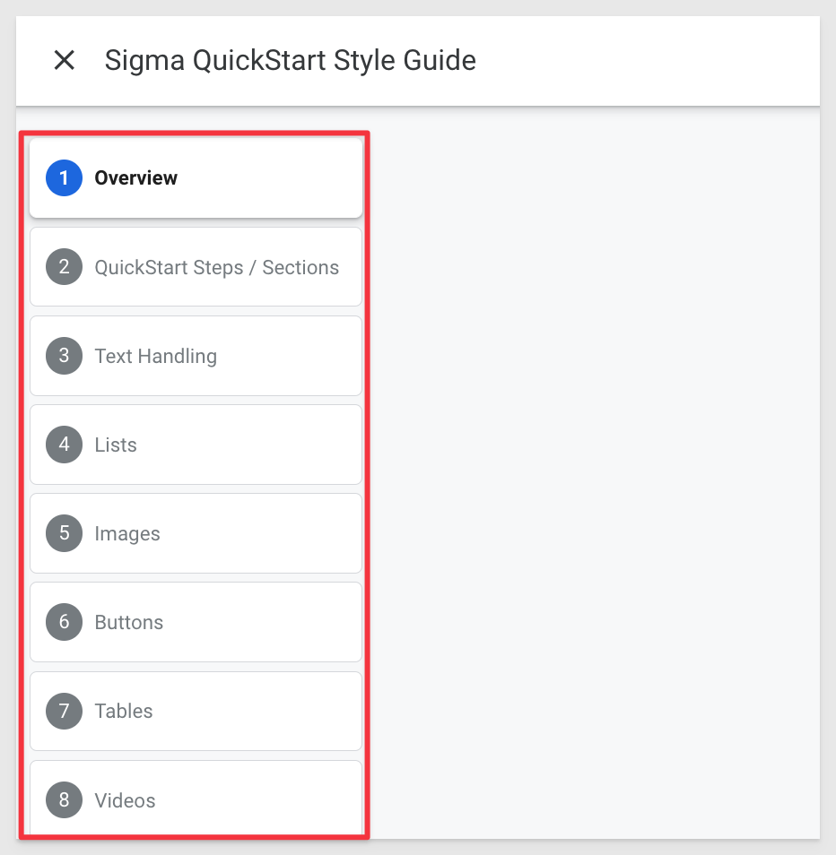
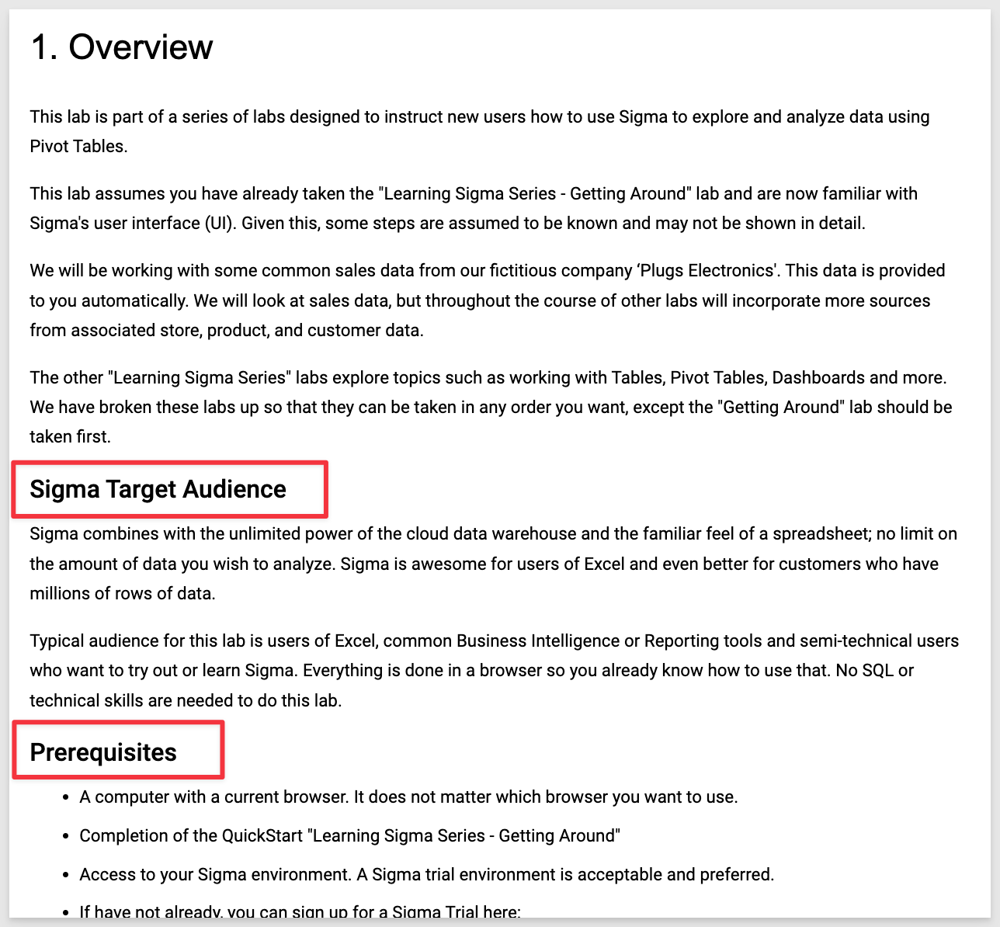
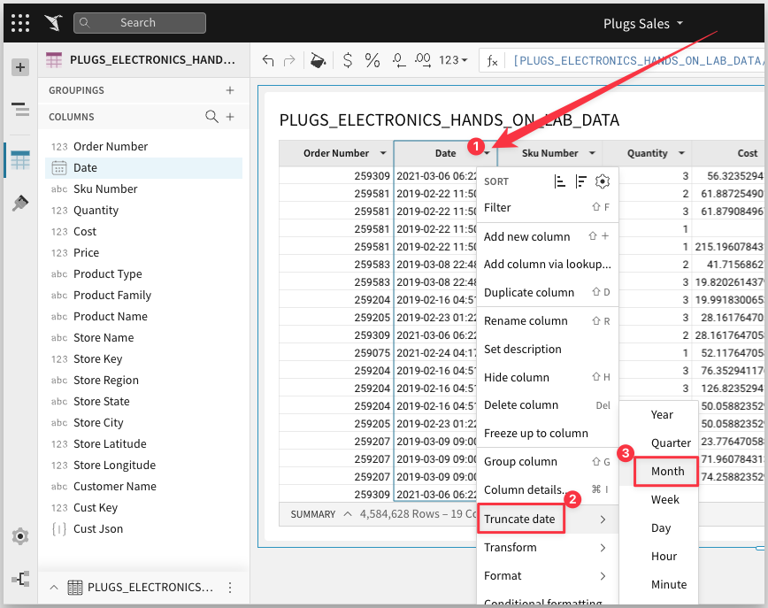
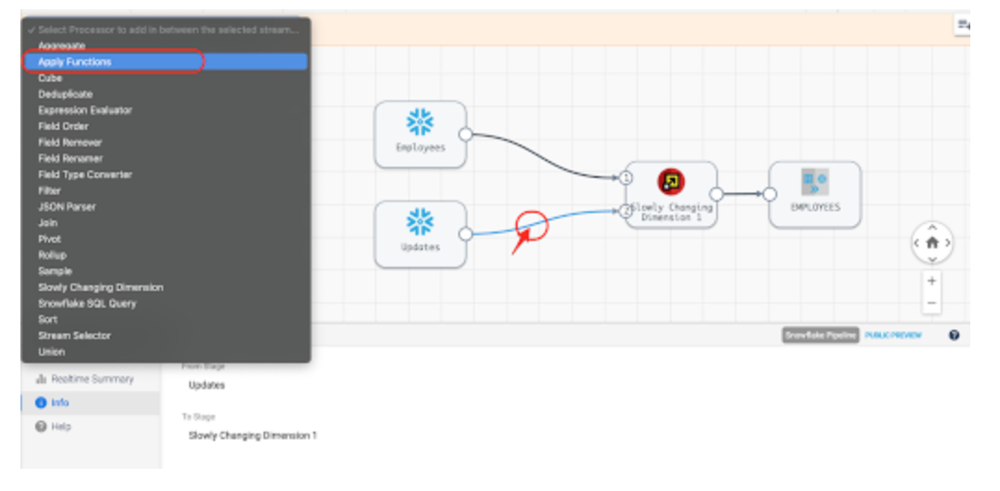

author: pballai
id: sigma-style-guide
summary: This is a sample Sigma Guide
categories: Getting-Started
environments: web
status: Hidden
feedback link: https://github.com/sigmacomputing/sigmaquickstarts/issues
tags: Getting Started

# Sigma QuickStart Style Guide

## Overview 
Duration: 5 

This QuickStart **QS** provides all the common Markup to be used in new QS. 

Sample code and examples are shown for each item.

[We encourage you to review the QS called Getting Started Working with Tables](https://quickstarts.sigmacomputing.com/guide/fundamentals-2-working-with-tables/index.html)

 ### Target Audience
Anyone who is trying to create QS content for Sigma. 

### Prerequisites

1: A computer with a current browser. It does not matter which browser you want to use.<br>
2: [Review of the Sigma QS Readme](https://github.com/Sigmacomputing/sigmaquickstarts#readme).<br>
3: Completion of the Sigma QS Readme perquisites.<br>
4: A working local copy of the Sigma QS portal as described in the Readme.<br>
  
### What You’ll Learn
How to apply Sigma approved Markdown for your QS.

### What You’ll Build
[A good example of the Sigma style that we want to try to adhere to is here](https://quickstarts.sigmacomputing.com/guide/fundamentals-2-working-with-tables/index.html)<br>


<!-- END -->

## **QuickStart Steps / Sections**
Duration: 5

There are 3 types of QS Sections:

1: `#`. There is only one for each QS. It's text defines the name to be displayed to the user in the QS Portal.<br><br>
2: `##`. This defines a main section and is used to drive the QS Steps as shown:<br><br>
<br><br>
3: `###`. One or more of these can exist in a `##` section and will appear as a subsection on a Step:<br><br>



All Sections **must end with the Sigma Footer.** You can do this by placing this code at the end of your section:

```plaintext

<!-- END -->
```


**Additional Resource Links**<br>
Your **"What we've covered"** Section should use the same content for "Additional Resource Links". You can do this by placing this code at the end of your section:


```plaintext
[Help Center Home](https://help.sigmacomputing.com/hc/en-us)<br>
[Sigma Community](https://community.sigmacomputing.com/)<br>
[Sigma Blog](https://www.sigmacomputing.com/blog/)<br>
<br>

[](https://twitter.com/sigmacomputing)&emsp;
[](https://www.linkedin.com/company/sigmacomputing)
[](https://www.facebook.com/sigmacomputing)
```


<!-- END -->

## **Text Handling**
Duration: 5

**Bold text** is created by formatting the text as `**some bold text**`.<br>

***Italic text*** is created by formatting the text as `***some italic text***`.<br>

`Boxed Text` is created by surrounding the desired text with the ***`*** apostrophe character.<br>

```plaintext
&ensp ...will provide a single space between to items (useful for side by side images)
```


**To create a CODEBOX, you can use this formatting:**<br>

**MAKE SURE YOU USE THE `(apostrophe) CHARACTER (AS OPPOSED TO WHAT IS SHOWN IN THE SAMPLE CODE):**

```plaintext
This is an example of a Codebox, good for showing code samples inline.
```

**Markdown for a CODEBOX:**
```plaintext
'''plaintext
Your text here...
'''
```


**To high-lite something Important, you can use this formatting:**<br>
<aside class="postive">
<strong>IMPORTANT:</strong><br> Use this style when pointing out very important text that differentiates Sigma.
</aside>

**Markdown for IMPORTANT:**
```plaintext
<aside class="postive">
<strong>IMPORTANT:</strong><br> Your text here.
</aside>
```


**To high-lite a Note, you can use this formatting:**<br>
<aside class="negative">
<strong>NOTE:</strong><br> Use this style when you want to point out some noteworthy text you want the user to understand.
</aside>

**Markdown for NOTE:**
```plaintext
<aside class="negative">
<strong>NOTE:</strong><br> Your text here.
</aside>
```


<!-- END -->

## **Lists**
Duration: 5

**ORDERED LIST:**
 <li><strong>My Content:</strong> Some text...
    <ol type="n"> 
      <li><strong>Workbook:</strong> text...</li>
      <li><strong>Dataset:</strong> text...</li>
      <li><strong>Custom SQL:</strong> text...</li>
    </ol>
  </li>

**Markdown for a ORDERED LIST:**
```plaintext
 <li><strong>My Content:</strong> Some text...
    <ol type="n"> 
      <li><strong>Workbook:</strong> text...</li>
      <li><strong>Dataset:</strong> text...</li>
      <li><strong>Custom SQL:</strong> text...</li>
    </ol>
  </li>
```


**UNORDERED LIST:**
 <ul>
      <li><strong>Bar charts:</strong> Some text...</li>
      <li><strong>Line charts:</strong> Some text...</li>
      <li><strong>Area charts"</strong> Some text...<li>
</ul>

**Markdown for a UNORDERED LIST:**
```plaintext
 <ul>
      <li><strong>Bar charts:</strong> Some text...</li>
      <li><strong>Line charts:</strong> Some text...</li>
      <li><strong>Area charts"</strong> Some text...<li>
</ul>
```


<!-- END -->

## **Images**
Duration: 5

When using images on pages you should use `red bounding boxes`, `red arrows` to direct the users attention. When items should be done in steps, `use numbers` to direct the user to the right workflow. Here is an example:




Images should be screenshot on the highest display you have available, in full screen mode and with a quality screenshot software. **We do not want blurry images as shown below:**




**Markdown for a Images (2 types):**
```plaintext
When you want the image full size on the page:


When you want to control the size of the image better on the page:

```

<aside class="postive">
<strong>IMPORTANT:</strong><br> Image filenames should be lowercase with no special characters.
</aside>


<!-- END -->

## **Buttons & Links**
Duration: 5

Buttons are created as shown:.<br>

<button>[Free Trial](https://www.sigmacomputing.com/free-trial/)</button>

```plaintext
<button>[Free Trial](https://www.sigmacomputing.com/free-trial/)</button>
```


**Basic hyperlink created as shown:**<br>
[Link text Here](https://link-url-here.org)

**Markdown for basic hyperlink:**<br>
```plaintext
[Link text Here](https://link-url-here.org)
```


**Hyperlink from image:**<br>
[](https://twitter.com/sigmacomputing)

**Markdown for hyperlink with image:**<br>
```plaintext
[](https://twitter.com/sigmacomputing)
```


<!-- END -->

## **Tables**
Duration: 5

Tables are created as shown:.<br>

<table>
    <thead>
        <tr>
            <th colspan="2"> **The table header** </th>
        </tr>
    </thead>
    <tbody>
        <tr>
            <td>The table body</td>
            <td>with two columns</td>
        </tr>
    </tbody>
</table>

**Markdown for Table:**
```plaintext
<table>
    <thead>
        <tr>
            <th colspan="2"> **The table header** </th>
        </tr>
    </thead>
    <tbody>
        <tr>
            <td>The table body</td>
            <td>with two columns</td>
        </tr>
    </tbody>
</table>
```


<!-- END -->

## **Videos**
Duration: 5

Videos from YouTube can be directly embedded using only the video ID:<br>
<video id="E9G2a4QkLYE"></video>

**Markdown for Video:**

```plaintext
<video id="E9G2a4QkLYE"></video>
```


<!-- END -->

## **Surveys (future feature)**
Duration: 5


<!-- END -->

## What we've covered
Duration: 5

The desired look and feel for a Sigma QuickStart and the Markdown options at your disposal.

<aside class="postive">
<strong>IMPORTANT:</strong><br> If you are building QuickStarts in a Series please include the link to the next one in the Series:
</aside>

**Markdown for QuickStart Series link:**
```plaintext
[Click here to move to the next QuickStart in this series.](https://quickstarts.sigmacomputing.com/guide/**{your QuickStart guide name here}**/index.html)
```

<aside class="negative">
<strong>NOTE:</strong><br> If you are interested, you can review Sigma's overall Style Guide here: 
</aside><br>

[Link to Style Guide](https://docs.google.com/document/d/1C-qIOxKkMMHOhAfcs8wuId1KSyDGXn966prHnYdOB7Y/)

**Additional Resource Links**

[Help Center Home](https://help.sigmacomputing.com/hc/en-us)<br>
[Sigma Community](https://community.sigmacomputing.com/)<br>
[Sigma Blog](https://www.sigmacomputing.com/blog/)<br>
<br>

[](https://twitter.com/sigmacomputing)&emsp;
[](https://www.linkedin.com/company/sigmacomputing)
[](https://www.facebook.com/sigmacomputing)


<!-- END OF WHAT WE COVERED -->
<!-- END OF QUICKSTART -->