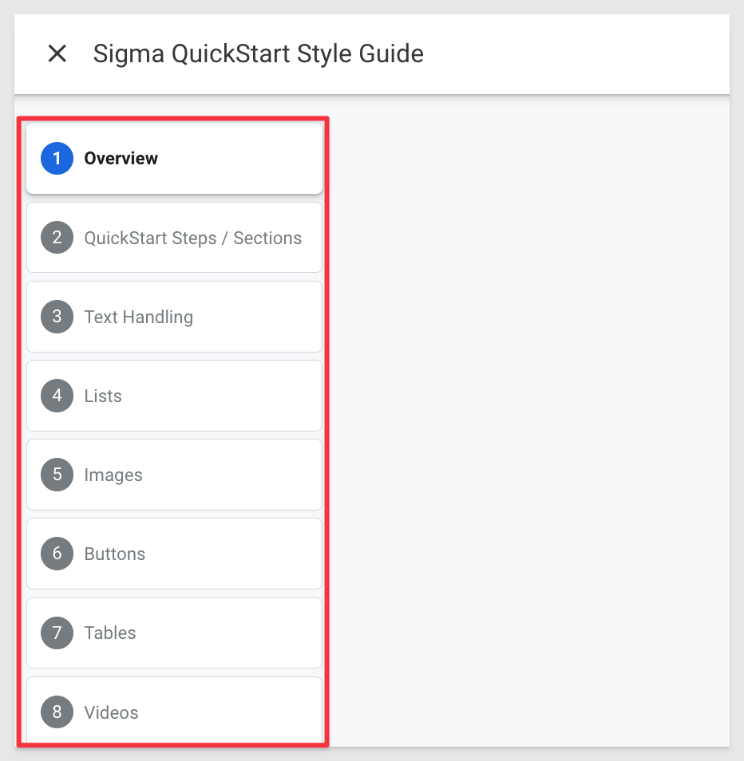
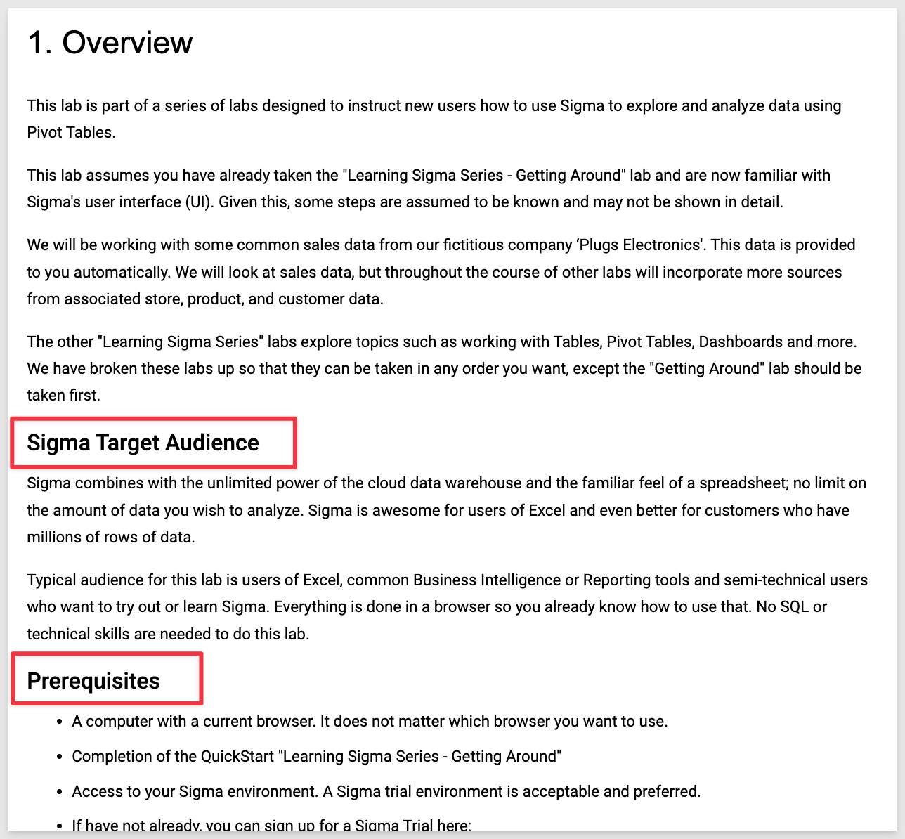
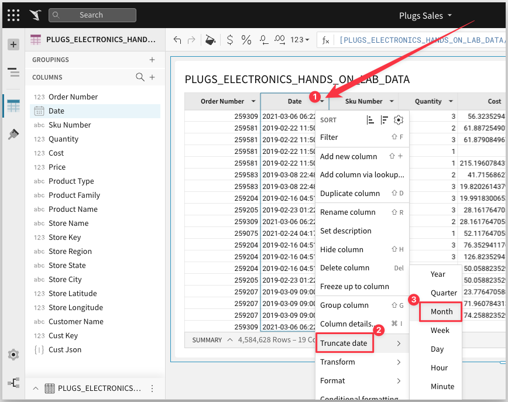
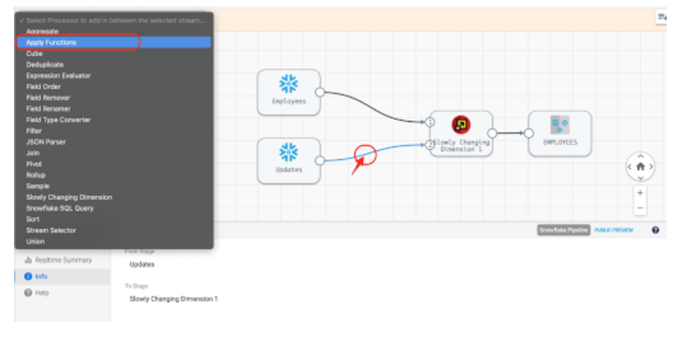
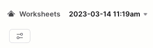

author: pballai
id: sigma-style-guide
summary: This is a sample Sigma Guide
categories: Getting-Started
environments: web
status: Hidden
feedback link: https://github.com/sigmacomputing/sigmaquickstarts/issues
tags: internal
lastUpdated: 2026-06-15

# Sigma QuickStart Style Guide

## Overview 
Duration: 5 

This QuickStart **QS** provides all the common Markup to be used in new QS. 

Sample code and examples are shown for each item.

[We encourage you to review the QS called Getting Started Working with Tables](https://quickstarts.sigmacomputing.com/guide/fundamentals-2-working-with-tables/index.html)

<aside class="positive">
<strong>IMPORTANT:</strong><br> Some screens in Sigma may appear slightly different from those shown in QuickStarts. This is because Sigma is continuously adding and enhancing functionality. Rest assured, Sigma’s intuitive interface ensures that any differences will not prevent you from successfully completing any QuickStart.
</aside>

For more information on Sigma's product release strategy, see [Sigma product releases.](https://help.sigmacomputing.com/docs/sigma-product-releases)

 ### Target Audience
Anyone who is trying to create QS content for Sigma. 

### Prerequisites

1: A computer with a current browser. It does not matter which browser you want to use.<br>
2: [Review of the Sigma QS Readme](https://github.com/Sigmacomputing/sigmaquickstarts#readme).<br>
3: Completion of the Sigma QS Readme perquisites.<br>
4: A working local copy of the Sigma QS portal as described in the Readme.<br>
  
### What You’ll Learn
How to apply Sigma approved Markdown for your QS.

### What You’ll Build
[A good example of the Sigma style that we want to try to adhere to is here](https://quickstarts.sigmacomputing.com/guide/fundamentals-2-working-with-tables/index.html)<br>


<!-- END -->

## **QuickStart Steps / Sections**
Duration: 5

There are 3 types of QS Sections:

1: `#`. There is only one for each QS. It's text defines the name to be displayed to the user in the QS Portal.<br><br>
2: `##`. This defines a main section and is used to drive the QS Steps as shown:<br><br>
<br><br>
3: `###`. One or more of these can exist in a `##` section and will appear as a subsection on a Step:<br><br>



All Sections **must end with the Sigma Footer.** You can do this by placing this code at the end of your section:

```copy-code

<!-- END -->
```


**Additional Resource Links**<br>
Your **"What we've covered"** Section should use the same content for "Additional Resource Links". You can do this by placing this code at the end of your section:


```plaintext
[Help Center Home](https://help.sigmacomputing.com/hc/en-us)<br>
[Sigma Community](https://community.sigmacomputing.com/)<br>
[Sigma Blog](https://www.sigmacomputing.com/blog/)<br>
<br>

[](https://twitter.com/sigmacomputing)&emsp;
[](https://www.linkedin.com/company/sigmacomputing)&emsp;
[](https://www.facebook.com/sigmacomputing)
```


<!-- END -->

## **Text Handling**
Duration: 5

**Bold text** is created by formatting the text as `**some bold text**`.<br>

***Italic text*** is created by formatting the text as `***some italic text***`.<br>

`Boxed Text` is created by surrounding the desired text with the ***`*** apostrophe character.<br>

```copy-code
&ensp; ...will provide a single space between to items (useful for side by side images)
```

 ...will provide a single space between to items (useful for side by side images)


**To create a CODEBOX, you can use this formatting:**<br>

**MAKE SURE YOU USE THE `(apostrophe) CHARACTER (AS OPPOSED TO WHAT IS SHOWN IN THE SAMPLE CODE):**

```plaintext
This is an example of a Codebox, good for showing code samples inline.
```

**Markdown for a CODEBOX:**
```copy-code
'''console
Your text here...
'''
```


**To high-lite something Important, you can use this formatting:**<br>
<aside class="postive">
<strong>IMPORTANT:</strong><br> Use this style when pointing out very important text that differentiates Sigma.
</aside>

**Markdown for IMPORTANT:**
```copy-code
<aside class="positive">
<strong>IMPORTANT:</strong><br> Your text here.
</aside>
```


**To high-lite a Note, you can use this formatting:**<br>
<aside class="negative">
<strong>NOTE:</strong><br> Use this style when you want to point out some noteworthy text you want the user to understand.
</aside>

**Markdown for NOTE:**
```copy-code
<aside class="negative">
<strong>NOTE:</strong><br> Your text here.
</aside>
```


<!-- END -->

## **Lists**
Duration: 5

### ORDERED LIST:

<ol>
  <li><strong>My Content:</strong> Some text...
    <ol type="a">
      <li><strong>Workbook:</strong> text...</li>
      <li><strong>Dataset:</strong> text...</li>
      <li><strong>Custom SQL:</strong> text...</li>
    </ol>
  </li>
</ol>


**Markdown for ORDERED LIST:**
```copy-code
<ol>
  <li><strong>My Content:</strong> Some text...
    <ol type="a">
      <li><strong>Workbook:</strong> text...</li>
      <li><strong>Dataset:</strong> text...</li>
      <li><strong>Custom SQL:</strong> text...</li>
    </ol>
  </li>
</ol>
```


### UNORDERED LIST:

<ul>
  <li><strong>Bar charts:</strong> Some text...</li>
  <li><strong>Line charts:</strong> Some text...</li>
  <li><strong>Area charts:</strong> Some text...</li>
</ul>


**Markdown for UNORDERED LIST:**
```copy-code
<ul>
  <li><strong>Bar charts:</strong> Some text...</li>
  <li><strong>Line charts:</strong> Some text...</li>
  <li><strong>Area charts:</strong> Some text...</li>
</ul>
```

**Empty Version for quick copy:**
```copy-code
<ul>
  <li><strong></strong> </li>
  <li><strong></strong> </li>
  <li><strong></strong> </li>
</ul>
```


### NESTED LIST:

<ul>
  <li>Sample</li>
  <li>Sample 2:
    <ul>
      <li>Viewer</li>
      <li>Viewer+</li>
      <li>Explorer</li>
    </ul>
  </li>
</ul>


**Markdown for NESTED LIST:**
```copy-code
<ul>
  <li>Sample</li>
  <li>Sample 2:
    <ul>
      <li>Viewer</li>
      <li>Viewer+</li>
      <li>Explorer</li>
    </ul>
  </li>
</ul>
```


<!-- END -->

## **Images**
Duration: 5

When using images on pages you should use `red bounding boxes`, `red arrows` to direct the users attention. When items should be done in steps, `use numbers` to direct the user to the right workflow. Here is an example:




Images should be screenshot on the highest display you have available, in full screen mode and with a quality screenshot software. **We do not want blurry images as shown below:**




**Markdown for a Images (2 types):**

When you want the image full size on the page:

```copy-code

```

When you want to control the size of the image better on the page:

```copy-code

```

<aside class="postive">
<strong>IMPORTANT:</strong><br> Image filenames should be lowercase with no special characters.
</aside>


<!-- END -->

## **Buttons & Links**
Duration: 5

Buttons are created as shown:.<br>

<button>[Free Trial](https://www.sigmacomputing.com/free-trial/)</button>

```copy-code
<button>[Free Trial](https://www.sigmacomputing.com/free-trial/)</button>
```


**Basic hyperlink created as shown:**<br>
[Link text Here](https://link-url-here.org)

**Markdown for basic hyperlink:**<br>
```copy-code
[Link text Here](https://link-url-here.org)
```


**Hyperlink from image:**<br>
[](https://twitter.com/sigmacomputing)

**Markdown for hyperlink with image:**<br>
```copy-code
[](https://twitter.com/sigmacomputing)
```


<!-- END -->

## **Tables**
Duration: 5

Tables are created as shown:.<br>

<table>
    <thead>
        <tr>
            <th colspan="2"> **The table header** </th>
        </tr>
    </thead>
    <tbody>
        <tr>
            <td>The table body</td>
            <td>with two columns</td>
        </tr>
    </tbody>
</table>

**Markdown for Table:**
```copy-code
<table>
    <thead>
        <tr>
            <th colspan="2"> **The table header** </th>
        </tr>
    </thead>
    <tbody>
        <tr>
            <td>The table body</td>
            <td>with two columns</td>
        </tr>
    </tbody>
</table>
```


## **Gifs**
Duration: 5

Gifs are supported as:



**Markdown for GIF:**

```copy-code

```


<!-- END -->

## **Videos**
Duration: 5

### MP4

Use ffmpeg to convert video into MP4. For example, convert `.mov` to MP4:
```copy-code
ffmpeg -i videoname.mov -vcodec libx264 -crf 28 -preset slow -vf "scale=1280:-2" -an output.mp4
```

Use ffmpeg to crop the video first. For example, to remove a URL bar from the incoming video:

```copy-code
ffmpeg -i sidebar_demo.mov -vcodec libx264 -crf 28 -preset slow -vf "crop=iw:ih-150:0:150,scale=1280:-2" -an output.mp4
```

Embed the Video in the QuickStart with:
```copy-code
<video src="assets/yourfile.mp4"></video>
```
For example:
<video src="assets/sidebar.mp4"></video>

### YouTube can be directly embedded using only the video ID:<br>
<video id="E9G2a4QkLYE"></video>

```copy-code
<video id="E9G2a4QkLYE"></video>
```


<!-- END -->

## **Surveys (future feature)**
Duration: 5


<!-- END -->

## What we've covered
Duration: 5

The desired look and feel for a Sigma QuickStart and the Markdown options at your disposal.

<aside class="postive">
<strong>IMPORTANT:</strong><br> If you are building QuickStarts in a Series please include the link to the next one in the Series:
</aside>

**Markdown for QuickStart Series link:**
```copy-code
[Click here to move to the next QuickStart in this series.](https://quickstarts.sigmacomputing.com/guide/**{your QuickStart guide name here}**/index.html)
```

<aside class="negative">
<strong>NOTE:</strong><br> If you are interested, you can review Sigma's overall Style Guide here: 
</aside><br>

[Link to Style Guide](https://docs.google.com/document/d/1C-qIOxKkMMHOhAfcs8wuId1KSyDGXn966prHnYdOB7Y/)

**Additional Resource Links**

[Help Center Home](https://help.sigmacomputing.com/hc/en-us)<br>
[Sigma Community](https://community.sigmacomputing.com/)<br>
[Sigma Blog](https://www.sigmacomputing.com/blog/)<br>
<br>

[](https://twitter.com/sigmacomputing)&emsp;
[](https://www.linkedin.com/company/sigmacomputing)&emsp;
[](https://www.facebook.com/sigmacomputing)


<!-- END OF WHAT WE COVERED -->
<!-- END OF QUICKSTART -->
