author: pballai
id: sigma_api_with_postman
summary: How to use the Sigma API with Postman
categories: administration
environments: web
status: Published
feedback link: https://github.com/sigmacomputing/sigmaquickstarts/issues
tags: Getting Started, Analytics, Data Engineering, BI, Business Intelligence, Sigma, Sigma Computing, Snowflake, Dashboarding, Visualization, Analysis, Excel, Spreadsheet, Embedding, API
lastUpdated: 2023-03-15

# Sigma API with Postman

## Overview 
Duration: 5 

This QuickStart will discuss and demonstrate how to leverage the very popular API platform called Postman with Sigma's REST API. 

Postman is an API platform for developers to design, build, test and iterate their APIs. Postman reports having more than 20 million registered users and 75,000 open APIs, which it says constitutes the world's largest public API hub.

Postman offers a tiered pricing model, with a free option that allows for "designing, developing, and testing APIs". We will use the free tier for testing.

 ### Target Audience
Developers who are interested in using the API methods provided by Sigma to automate operations or use functionality embedded in their own commercial applications. 

### Prerequisites

<ul>
  <li>A computer with a current browser. It does not matter which browser you want to use.</li>
  <li>Access to your Sigma environment. A Sigma trial environment is acceptable and preferred.</li>
  <li>Postman installed. Web or Desktop version will work.</li>
  <li>If have not already, you can sign up for a Sigma Trial here:</li>
</ul>

<button>[Free Trial](https://www.sigmacomputing.com/free-trial/)</button>
  
### What You’ll Learn
We will install Postman, add the Sigma API to a new Postman API, configure authorization and test a few API methods.

### What You’ll Build
When done, we will have a **ready for use** Sigma API in Postman we can use whenever we want to evaluate methods and the returns.


<!-- END -->

## **Setup Postman**
Duration: 10

Postman offers a native web experience as well as a Desktop version. Either is fine; we will use the web version for simplicity. For this QuickStart there is not much difference in the web/desktop versions of Postman.

If you already have a Postman account you can use that or otherwise you will have to sign up for an account (free tier for our use case):

<button>[Login or Sign Up to Postman](https://identity.getpostman.com/login)</button>

After signing into Postman, click into `Workspaces`:


There are several workflows available in Postman and we will use this one:

Create a `new Workspace` called `Sigma`:


Give it the `name`, `description` and set the `visibility to Personal` for now. Click `Create Workspace`:


We want to create a new API and there are several ways to do that. In our case, we will use the `Import` option as we will grab the latest Sigma API release from our public Swagger page.

Click the `Collections` icon and click then the `Import` icon:

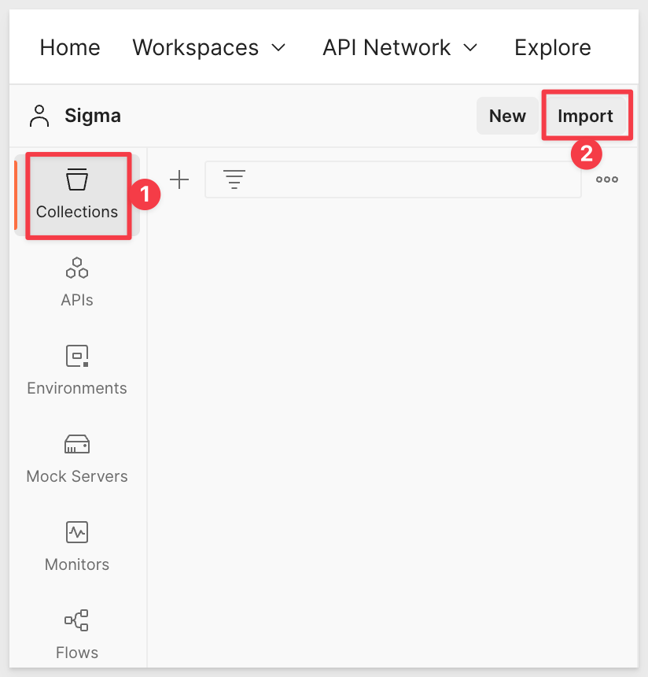

Next we will need to get the link (URL) to the latest Sigma API. Open another browser tab.

[Browse to this Sigma Help page](https://help.sigmacomputing.com/hc/en-us/articles/4408827709459-Sigma-s-Swagger-Playground) and click the link as shown below:


Click the button `View OpenAPI Spec (New Tab1)`:


Copy the URL from the address bar:

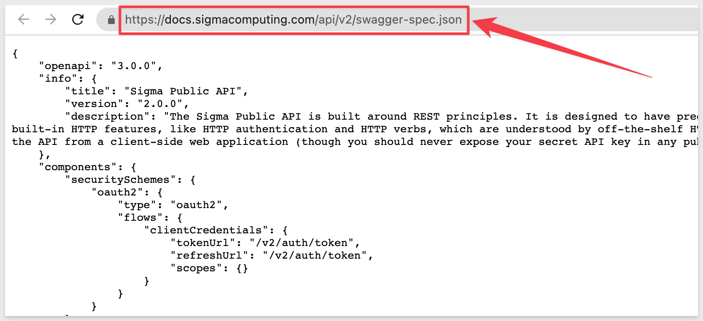

Paste the address into the Postman UI (in the link section) as shown and click `Import`:

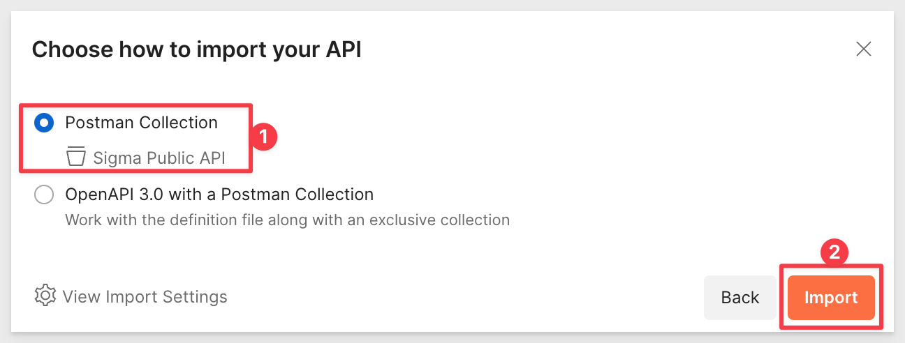

When done, it API will appear as a new `Collection`. It may be helpful to rename the collection if you have more than one copy.

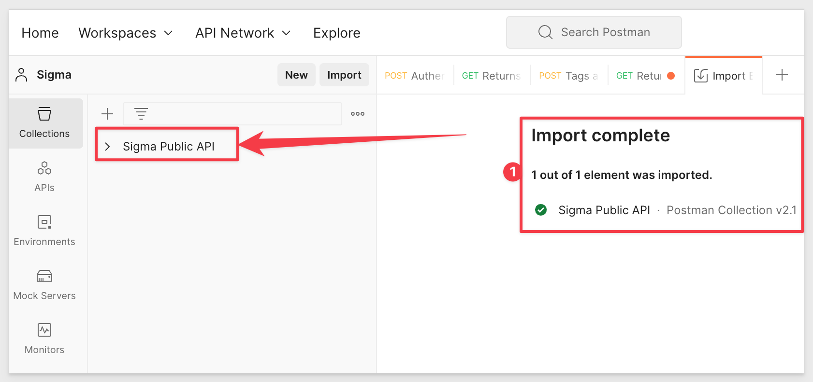

Expand the `Sigma Public API` to see the available methods as below:


In order to be able to use any API in the web version of Postman, you need to install the Postman Agent on your local machine. 

The Postman Desktop Agent is a micro-application that runs locally on your desktop. It enables you to bypass the limitations that exist in the browser by allowing API requests to originate in the browser, but be routed through your local machine and network. The Postman Desktop Agent overcomes the Cross Object Resource Sharing (CORS) limitations of browsers and acts as your agent for making API requests from the Postman web app.

Download and install the Postman Desktop Agent. You will need to unzip to perform the installation. 


<!-- END -->

## Generate ClientID / Secret
Duration: 10

In preparation for using the API we need to use Sigma to generate a new API Token.

Log onto Sigma (as Administrator). Navigate to `Administration`, `APIs & Embed Secrets`

Click the `Create New` button:


Select `API Token`, give it a name and description. Notice that we have also created a Service Account user for automation purposes; this is a best practice. Since we are just testing, you can choose any Admin user you prefer. Click `Create`.


Copy the `ClientID` and `Secret` from the popup and save them to a secure location. We will use them later. Close the popup:


<!-- END -->

## Postman Variables
Duration: 10

Postman variables enable us to store and reuse values in Postman. By storing a value as a variable, we can reference it throughout our API Collection (API).

At the top level node of the API, click the `Variables` tab and add the following variables and corresponding values. 

Leave the "initial value" blank where we have not provided any default value.

<aside class="positive">
<strong>IMPORTANT:</strong><br> The value for "baseUrl" may appear pre-filled with a value. Be sure to replace the initial and current values with the correct URLs based on where the Sigma portal is hosted (ie: AWS, GCP or Azure)
</aside>

If unsure where Sigma is hosted, this is found in `Sigma` > `Administration` > `Account`:

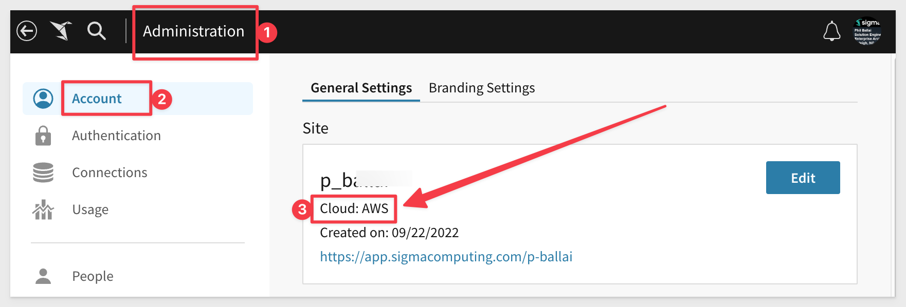

[The baseURL for each cloud is available here](https://docs.sigmacomputing.com/api/v2/#servers)

Modify the `tokenBaseURL` as needed for the cloud provider.

```console
VARIABLES:    / INITIAL VALUES:
baseUrl       / https://aws-api.sigmacomputing.com
tokenBaseURL  / https://aws-api.sigmacomputing.com/v2/auth/token
clientID      / {use the clientID we created earlier that you saved off to a text file}
secret        / {use the secret we created earlier that you saved off to a text file}
token         
expires_in
```

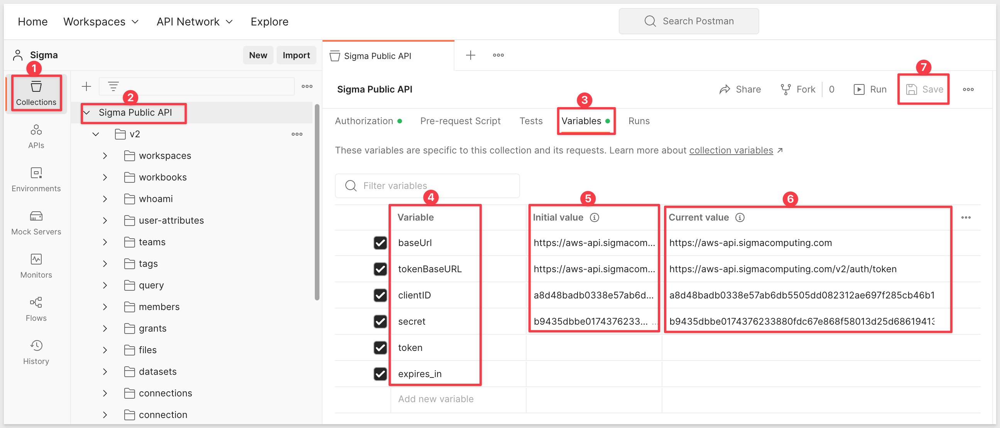

Click on the `Authorization` tab and configure the value for `Token` to use our new variable using the format shown:

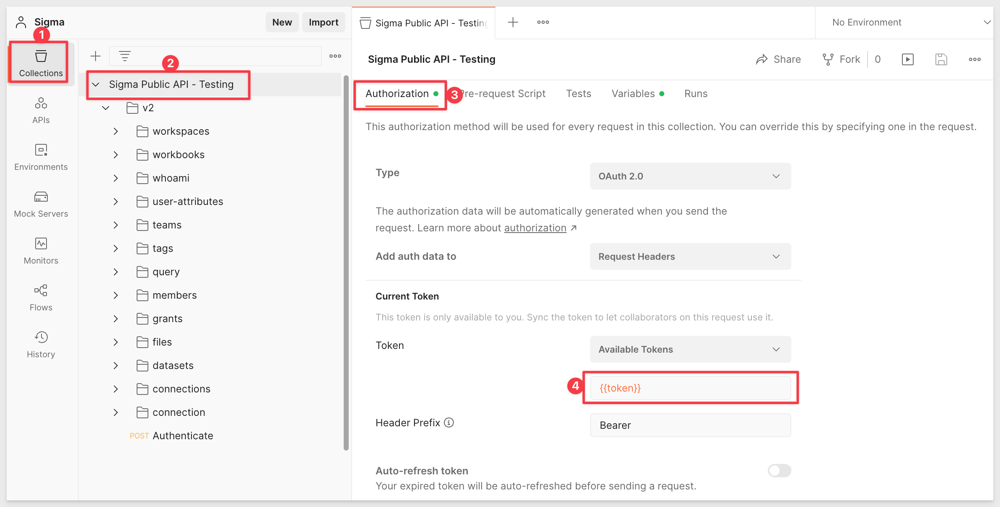

Save the changes. 

## Postman Environments
Duration: 10

Postman provides the ability to create distinct environments which contain one or more values you can use in your Postman requests and easily switch between them using variables. 

For example, you might want to use a different set of credentials to test API calls. Having two environments configured with different credentials allows you to use the same API methods but switch the environment with a click to use the different credentials / variables.

We will use this to ease the Authentication required for the Sigma API (or any token based API) by creating an Environment to hold required values and then let the API methods just inherit. It is a timesaver.

Postman displays the active environment in the environment selector, located in the top right of the workbench.

You can access all environments from Environments in the sidebar. Select the set active icon Set active icon next to an environment to make it the active environment.

To create a new environment, select `Environments` on the left and `select +`.


Name the Environment `Sigma API - AWS` and set the `Variables` and `Initial Values` as follows:

```console
VARIABLES:    / INITIAL VALUES:
baseUrl       / https://aws-api.sigmacomputing.com
tokenBaseURL  / https://aws-api.sigmacomputing.com/v2/auth/token
clientID      / {use the clientID we created earlier that you saved off to a text file}
secret        / {use the secret we created earlier that you saved off to a text file}
```
Click `Save`

The Environment should look like this:


<aside class="negative">
<strong>NOTE:</strong><br> We are using urls for AWS because that is where our specific Sigma instance is hosted. If you are using GCP or Azure you will need to adjust those values accordingly or the API calls will fail. Please refer to Sigma's online documentation for those URLs.
</aside>

Postman uses tabs, similar to a browser. 

Select the new Environment but using the drop list as shown:


Now all our API methods will use these variable values (once we configure that in the Sigma API),

You can close this Environment tab as it does not need to be open for us to use it.


<!-- END -->

## Authentication
Duration: 10

Sigma's API requires that we authenticate prior to use. We will be using variables that we setup in the last step to request a `token`. This token is also know as a Bearer or JSON web token (JWT).

We are going to add a `POST` method to automate authenticating, retrieving a token and persisting it in a variable. 

### New POST Method

Click `v2` > `Add request`:

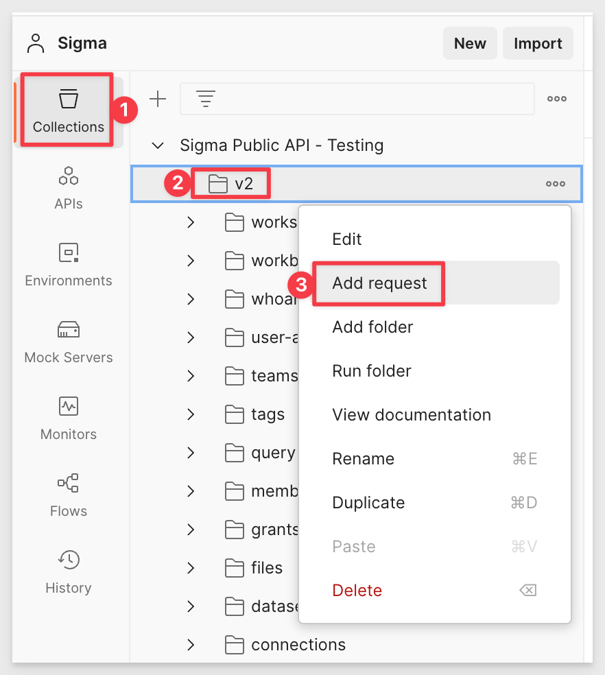

This opens a new request which we will rename to `Authenticate`.   

Change the `method` to `POST` and `Authorization` to `No Auth`:

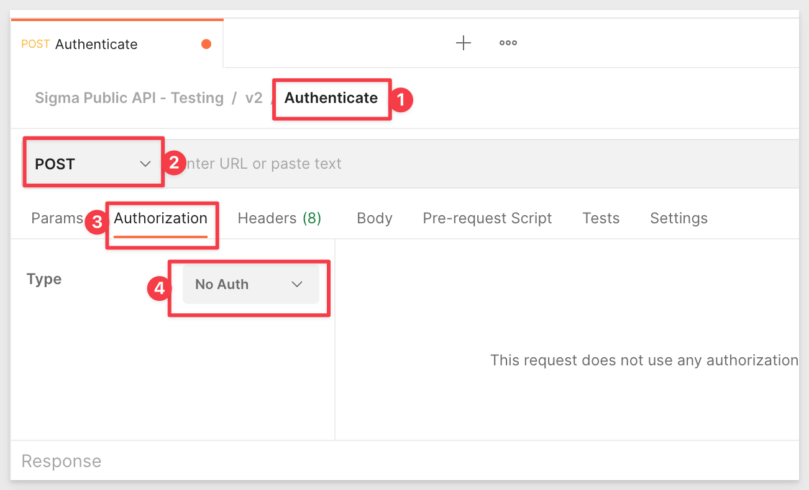

Under the `Body` tab, all the following values (two are environment variables and one is static):

Be sure to select the **x-www-form-urlencoded** message type.

```console
grant_type      / client_credentials
client_id       / {{clientID}}
client_secret   / {{secret}}
```

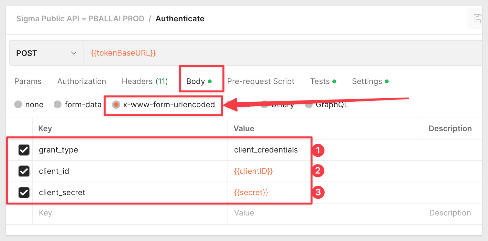

Provide the request url using the curly-brace format to leverage our environment variable for `tokenBaseURL`:

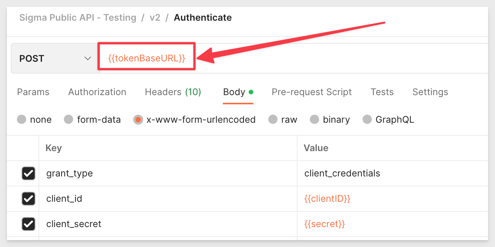

Now that we are configured, click `Save` and `Send` to try our request. If all is correct, we will get a `Status 200 OK` and an access token:

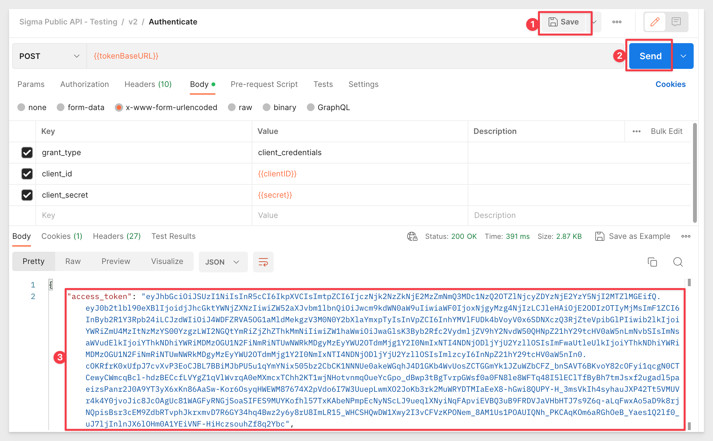

<aside class="negative">
<strong>NOTE:</strong><br> The token that we must now pass for all requests (withing this expiration period) is the value between the quotation marks.
</aside>

Click `Save` and `Send`:

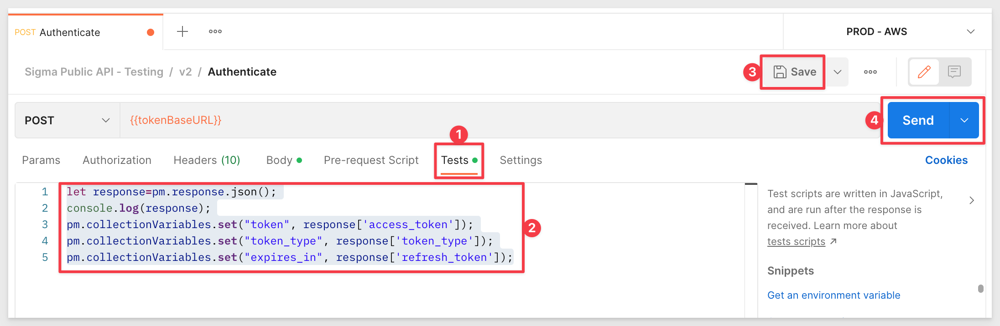

We will get a valid response

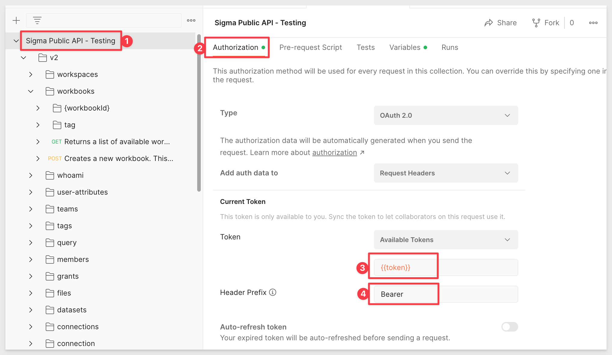

<aside class="negative">
<strong>NOTE:</strong><br> Tokens do expire. If the API later returns one of these (or similar):<br>
message="invalid signature"<br>
code="unauthorized"<br>
message="jwt expired"<br>

...we just need to resend the Authentication request, copy and paste the new token as we demonstrated earlier in this section.
</aside>


<!-- END OF SECTION-->

## Our First API Request
Duration: 10

Let's use the API to `Get` a list of available Connections.

Expand the API to show the method under `V2`, `connections`, `Returns a list of available connections` and click to select open it in a new tab.

We need to uncheck the two checkboxes (item #4 in the screenshot) for `Params` as we just want to return all the connections. These two optional parameters allow us to filter the return but we won't do that at this point. Click `Send`:


In the `Body` section is the return from the API in JSON. For example, our first connection is described this way:

```plaintext
        {
            "organizationId": "adbfe832-733a-4c83-b64d-bdbf6ae8d2cb",
            "connectionId": "10eed7b7-4a10-4c40-802b-4ba91287d5fe",
            "isSample": true,
            "lastActiveAt": "2023-01-25T14:44:50.000Z",
            "name": "Sigma Sample Database",
            "type": "snowflake",
            "useOauth": false,
            "createdBy": "1IDcJykBMeDwcot0MXWaw5R1RUwI7",
            "updatedBy": "yRn1UFV8ngVWBM1Hgrl51h7MS8uow",
            "createdAt": "2022-09-22T18:41:47.151Z",
            "updatedAt": "2023-01-25T14:44:50.695Z",
            "isArchived": false
        },
```

Even if you are only using a Sigma Trial and have not created a connection yourself there will be one shown. This is Sigma's sample database and is included on all Sigma instances by default. Your ID values will be different of course.


<!-- END -->

## New Connection using POST
Duration: 10

The API provides methods to *add/update/delete* a Sigma instance using `POST` messages. We will demonstrate this by creating a new Snowflake connection. 

**This is a demonstration only** as we will show duplicating an existing connection. 

<aside class="negative">
<strong>NOTE:</strong><br> You may use this demonstration to perform the same operation but will have to supply your own Snowflake connection details.
</aside>

We will use the following code to configure a POST message to create a new connection in Sigma. 

[You can get this code and more information here.](https://help.sigmacomputing.com/hc/en-us/articles/4487189442963-Connection-API#create)

**The values shown below are for example only:**

<aside class="negative">
<strong>NOTE:</strong><br> The code to enable write access has been removed to simplify this example.
</aside>

```plaintext
{  
 "name": "Snowflake via API POST",     
    "details": { 
                    "type": "snowflake", 
                    "account": "tester", 
                    "host": "testing.snowtest.com", 
                    "password": "<password>", 
                    "role": "A_ROLE", 
                    "user": "THE_DEV", 
                    "warehouse": "TEST_WAREHOUSE", 
                }
}
```

Configure the method `"Creates a new connection"` as shown and click `Send` (we have masked some values of course). A successful result is similar to what is shown in item #6:


Logging into the Sigma portal we can see we have a new connection:


<!-- END -->


## What we've covered
Duration: 5

We created a Postman account, created API token secrets in Sigma, imported the Sigma API to a new Postman API, configured authorization and tested GET and POST methods.

<!-- THE FOLLOWING ADDITIONAL RESOURCES IS REQUIRED AS IS FOR ALL QUICKSTARTS -->
**Additional Resource Links**

[Sigma API Documentation](https://help.sigmacomputing.com/hc/en-us/sections/4408551771411-API-Get-Started)

[Postman Learning Center](https://learning.postman.com/docs/getting-started/introduction/)<br>

[Sigma Help Center Home](https://help.sigmacomputing.com/hc/en-us)<br>
[Sigma Community](https://community.sigmacomputing.com/)<br>
[Sigma Blog](https://www.sigmacomputing.com/blog/)<br>
<br>

[](https://twitter.com/sigmacomputing)&emsp;
[](https://www.linkedin.com/company/sigmacomputing)
[](https://www.facebook.com/sigmacomputing)


<!-- END -->
<!-- END OF QUICKSTART -->
