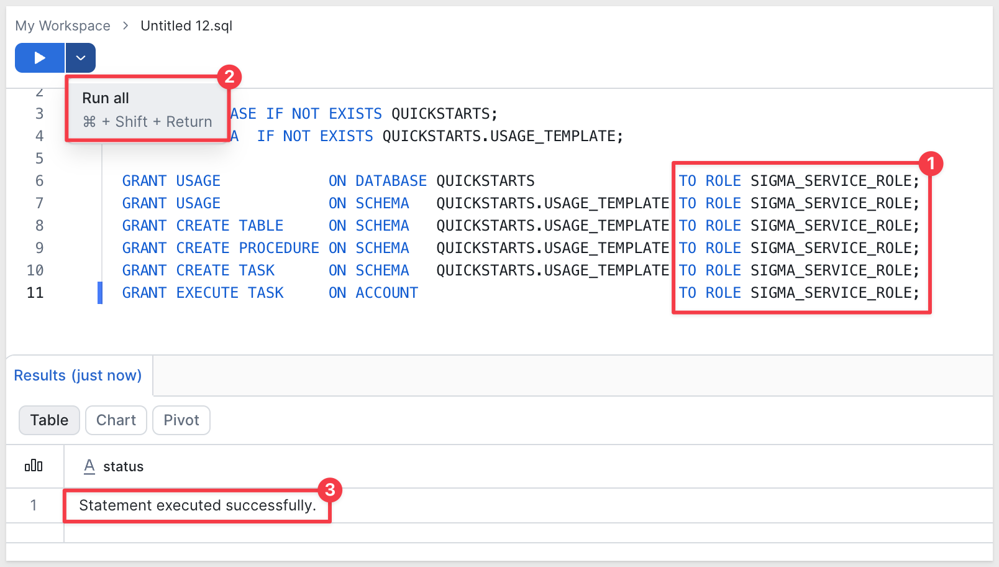
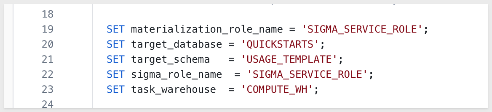
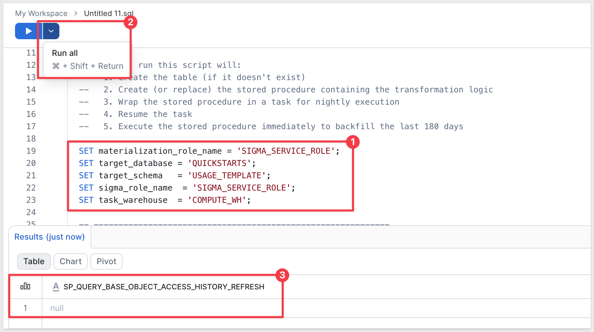
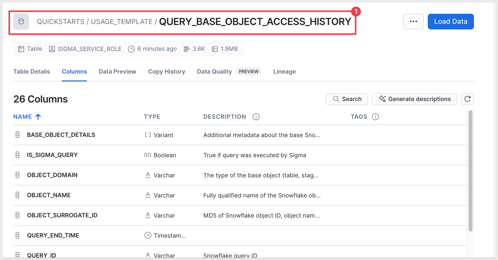
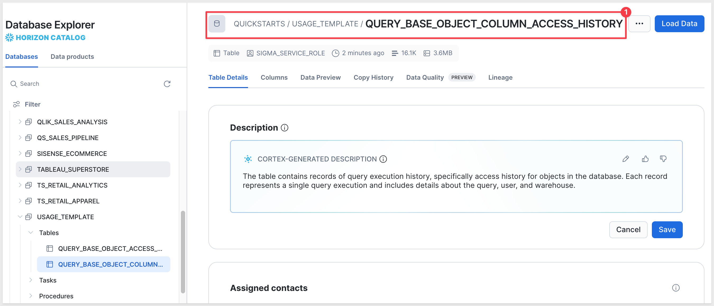
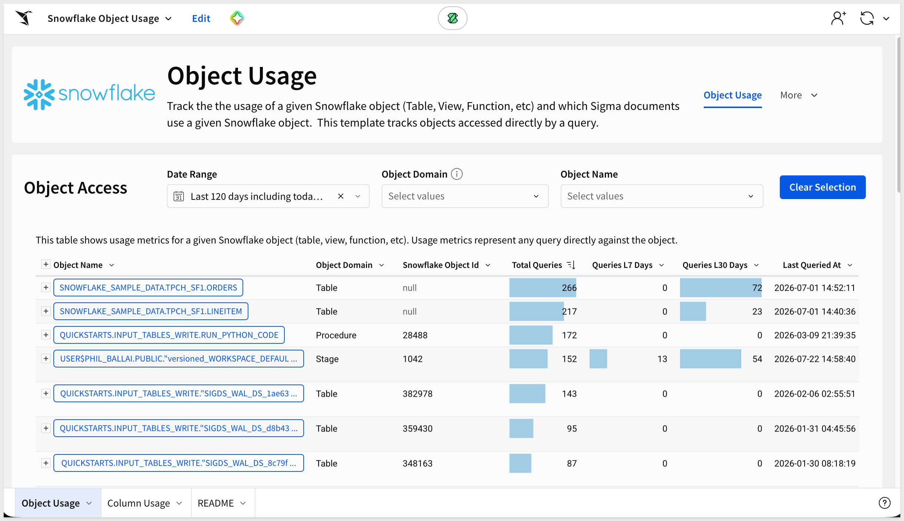
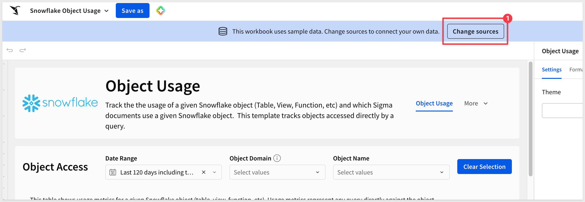
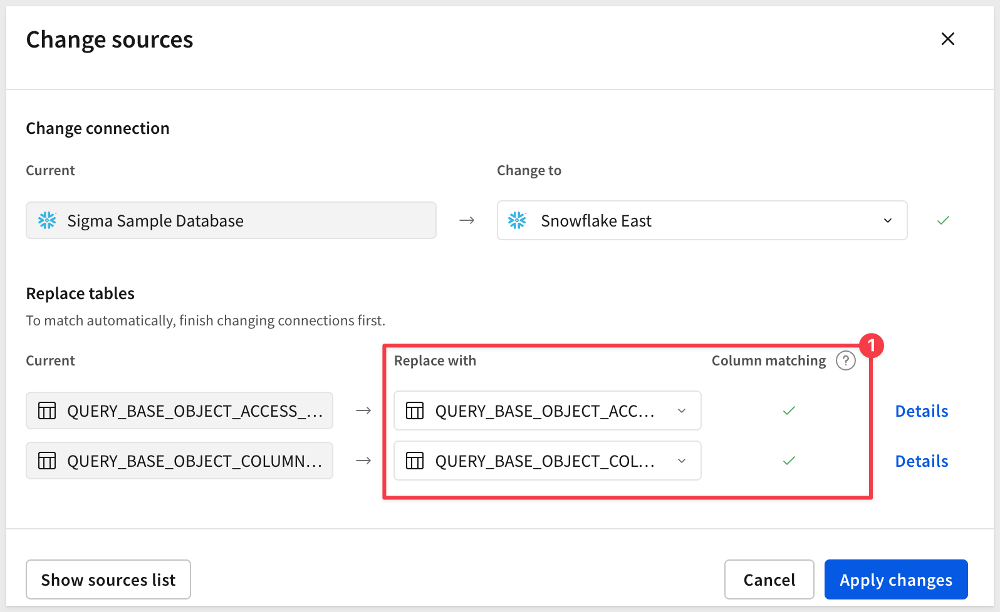

author: obashaw
id: snowflake_object_usage_template_setup
summary: Set up Sigma's Snowflake Object Usage template to surface object- and column-level query activity across your Snowflake account.
categories: administration
environments: web
status: Published
feedback link: https://github.com/sigmacomputing/sigmaquickstarts/issues
tags: default
lastUpdated: 2026-07-23

# Snowflake Object Usage Template Setup

## Overview 
Snowflake captures detailed access history for every query run against your account, but extracting useful signal from that data requires custom work that most teams never get around to. Without it, the questions that matter for governance, cost optimization, and access control go unanswered: which tables and views are actually being queried, how often, by whom, and from which systems?

Sigma's Snowflake Object Usage template solves this by materializing Snowflake's access history into two purpose-built, incrementally refreshed tables and surfacing the results in a prebuilt Sigma workbook. Setup takes minutes, and the workbook gives you immediate visibility into object- and column-level usage patterns across Sigma and any other system querying your Snowflake account.

Setup involves two phases: running SQL scripts in Snowflake to materialize the access history data, then launching the template in Sigma and connecting it to those tables.


<aside class="positive">
<strong>IMPORTANT:</strong><br> Some screens in Sigma may appear slightly different from those shown in QuickStarts. This is because Sigma is continuously adding and enhancing functionality. Rest assured, Sigma’s intuitive interface ensures that any differences will not prevent you from successfully completing any QuickStart.
</aside>

For more information on Sigma's product release strategy, see [Sigma product releases](https://help.sigmacomputing.com/docs/sigma-product-releases)

### Target Audience
Anyone who is trying to understand which objects in Snowflake are being used, who is using them and which systems are accessing them.

### Prerequisites

<ul>
  <li>A computer with a current browser. It does not matter which browser you want to use.</li>
  <li>Access to your Snowflake account with the ability to create tables and grant access to the role used in your Sigma connection.</li>
  <li>Access to your Sigma environment.</li>
</ul>

<button>[Sigma Free Trial](https://www.sigmacomputing.com/free-trial/)</button>

### What You’ll Build
<ul>
  <li>The "query_base_object_access_history" table in Snowflake that shows every base object used by each query.</li>
  <li>The "query_base_object_column_access_history" table in Snowflake that shows every column used by each query.</li>
  <li>A Sigma workbook that shows you how Snowflake objects and columns are being used by Sigma and any other system querying Snowflake.</li>
</ul>


<!-- END OF SECTION-->

## Building the object access history table
Duration: 5

You will create the `query_base_object_access_history` table by running the SQL script below in your Snowflake account.

This script creates a table called `query_base_object_access_history` with one row per Snowflake object used by a query — so a single query may produce many rows. It is built by taking Snowflake's `access_history` view and laterally flattening the `base_objects` column. The query tag is parsed to extract additional metadata on Sigma-generated queries.

The script also sets up incremental materialization via a nightly task, and performs an initial backfill of the last 180 days on first run.

<aside class="positive">
<strong>NOTE:</strong><br> 
Snowflake distinguishes between "base" objects accessed by a query and "direct" objects accessed by a query. If a query selects from a Snowflake view, that view would likely appear in the list of direct objects accessed. If the view references source tables or other objects, those would appear in the list of base objects. The tables you're creating in this QuickStart reference the base objects accessed by a query.
</aside>

The target database and schema must exist before running the main script, and the materialization role must have the necessary privileges on them. 

Run the following in a new Snowflake SQL worksheet, replacing `{materialization_role_name}` with the role you plan to use:

```copy-code
USE ROLE ACCOUNTADMIN;

CREATE DATABASE IF NOT EXISTS QUICKSTARTS;
CREATE SCHEMA  IF NOT EXISTS QUICKSTARTS.USAGE_TEMPLATE;

GRANT USAGE            ON DATABASE QUICKSTARTS                TO ROLE {materialization_role_name};
GRANT USAGE            ON SCHEMA   QUICKSTARTS.USAGE_TEMPLATE TO ROLE {materialization_role_name};
GRANT CREATE TABLE     ON SCHEMA   QUICKSTARTS.USAGE_TEMPLATE TO ROLE {materialization_role_name};
GRANT CREATE PROCEDURE ON SCHEMA   QUICKSTARTS.USAGE_TEMPLATE TO ROLE {materialization_role_name};
GRANT CREATE TASK      ON SCHEMA   QUICKSTARTS.USAGE_TEMPLATE TO ROLE {materialization_role_name};
GRANT EXECUTE TASK     ON ACCOUNT                             TO ROLE {materialization_role_name};
GRANT IMPORTED PRIVILEGES ON DATABASE SNOWFLAKE               TO ROLE {materialization_role_name};
```



Before running the main script below, update the five variables at the top (lines 19–23) to match your environment:
<ul>
  <li>Line 19 — materialization_role_name : the role that will create and own the table, procedure, and task</li>
  <li>Line 20 — target_database : the target database for the table</li>
  <li>Line 21 — target_schema : the target schema for the table</li>
  <li>Line 22 — sigma_role_name : the role used in your Sigma connection</li>
  <li>Line 23 — task_warehouse : the warehouse used to create and update the table</li>
</ul>

For example:



Open a new Snowflake SQL worksheet and paste the following script:

```copy-code
-- query_base_object_access_history
-- One row per base object (table, materialized view, UDF, etc.) accessed per query.
-- Incrementally materialized nightly via Snowflake Task + Stored Procedure using MERGE.
--
-- Configuration: replace the variables below before running.
--   materialization_role_name    : role used to create/own the table, procedure and task
--   target_database              : database where the table and task will be created
--   target_schema                : schema where the table and task will be created
--   sigma_role_name              : role used in your Sigma connection (granted SELECT on the table)
--   task_warehouse               : warehouse the procedure/task will use when it runs
-- 
-- On first run this script will:
--   1. Create the table (if it doesn't exist)
--   2. Create (or replace) the stored procedure containing the transformation logic
--   3. Wrap the stored procedure in a task for nightly execution
--   4. Resume the task
--   5. Execute the stored procedure immediately to backfill the last 180 days

SET materialization_role_name = 'role to use while running this job that will own the table, stored procedure and task';
SET target_database = 'target database';
SET target_schema   = 'target schema';
SET sigma_role_name  = 'role used in Sigma connection';
SET task_warehouse  = 'warehouse to use for incremental materialization';

-- ------------------------------------------------------------
-- 1. Create the table (cluster by date)
-- ------------------------------------------------------------
USE role identifier($materialization_role_name);
USE database identifier($target_database);
USE schema identifier($target_schema);

CREATE TABLE IF NOT EXISTS query_base_object_access_history (
    query_id                    VARCHAR         NOT NULL    COMMENT 'Snowflake query ID',
    object_surrogate_id         VARCHAR         NOT NULL    COMMENT 'MD5 of Snowflake object ID, object name and object domain',
    snowflake_object_id         VARCHAR                     COMMENT 'Snowflake object ID where present; unique across account and domain',
    object_name                 VARCHAR         NOT NULL    COMMENT 'Fully qualified name of the Snowflake object',
    database_name               VARCHAR                     COMMENT 'Database name where the Snowflake object exists',
    schema_name                 VARCHAR                     COMMENT 'Schema name where the Snowflake object exists',
    object_name_parsed          VARCHAR                     COMMENT 'Name of the Snowflake object, parsed from fully qualified name',
    object_domain               VARCHAR         NOT NULL    COMMENT 'The type of the base object (table, stage, view, function, etc)',
    query_start_time            TIMESTAMP_LTZ               COMMENT '',   
    query_end_time              TIMESTAMP_LTZ               COMMENT '',
    query_text                  VARCHAR                     COMMENT '',
    query_type                  VARCHAR                     COMMENT 'Snowflake query type',
    user_name                   VARCHAR                     COMMENT 'Snowflake user who executed the query',
    role_name                   VARCHAR                     COMMENT 'Snowflake role used to execute query',
    warehouse_name              VARCHAR                     COMMENT '',
    warehouse_size              VARCHAR                     COMMENT '',
    query_tag                   VARCHAR                     COMMENT 'The complete query tag sent to Snowflake',
    is_sigma_query              BOOLEAN                     COMMENT 'True if query was executed by Sigma',
    sigma_query_kind            VARCHAR                     COMMENT 'The kind of the Sigma query',
    sigma_source_url            VARCHAR                     COMMENT 'Sigma document or element where query originated',
    sigma_org_slug              VARCHAR                     COMMENT 'Sigma org where query originated',
    sigma_document_name         VARCHAR                     COMMENT 'Sigma document name where query originated',
    sigma_document_type         VARCHAR                     COMMENT 'Sigma document type where query originated',
    sigma_document_base_62_id   VARCHAR                     COMMENT 'Sigma document ID where query originated',
    sigma_request_id            VARCHAR                     COMMENT '',
    sigma_user_email            VARCHAR                     COMMENT 'Sigma user who executed the query',
    sigma_user_id               VARCHAR                     COMMENT '',
    sigma_user_email_domain     VARCHAR                     COMMENT '',
    base_object_details         VARIANT                     COMMENT 'Additional metadata about the base Snowflake object accessed'
)
CLUSTER BY (to_date(query_start_time));

-- ------------------------------------------------------------------------------
-- 2. Stored procedure that contains the MERGE logic. Runs with owner's rights
-- ------------------------------------------------------------------------------

CREATE OR REPLACE PROCEDURE sp_query_base_object_access_history_refresh(lookback_days FLOAT)
RETURNS STRING
LANGUAGE SQL
EXECUTE AS OWNER
AS
BEGIN
    MERGE INTO query_base_object_access_history AS target
    USING (
        with objects_accessed as (
            select
                query_id
                , base_objects.value as base_object_details
                , base_objects.value:objectName::string as object_name
                , base_objects.value:objectDomain::string as object_domain
                , base_objects.value:objectId::number as snowflake_object_id
                , md5(coalesce(base_objects.value:objectId::string, 'empty-id') || '|' || object_name || '|' || object_domain) as object_surrogate_id
            from snowflake.account_usage.access_history
            , lateral flatten(input => base_objects_accessed) as base_objects
            where query_start_time >= DATEADD('day', -:lookback_days, current_timestamp())
              and object_name is not null
              and object_domain is not null
        )

        , query_details as (
            select
                query_id
                , query_text
                , query_type
                , start_time as query_start_time
                , end_time as query_end_time
                , user_name
                , role_name
                , warehouse_name
                , warehouse_size
                , query_tag
                , contains(query_tag, 'Sigma Σ') as is_sigma_query
                , try_parse_json(replace(query_tag, 'Sigma Σ ', '')) as sigma_query_tag_json
                , sigma_query_tag_json:kind::string as sigma_query_kind
                , sigma_query_tag_json:sourceUrl::string as sigma_source_url
                , parse_url(sigma_source_url, 1):path::string as sigma_source_url_path_parsed
                , split_part(sigma_source_url_path_parsed, '/', 1) as sigma_org_slug
                , split_part(sigma_source_url_path_parsed, '/', 2) as sigma_document_type
                , split_part(sigma_source_url_path_parsed, '/', 3) as sigma_document_slug
                , regexp_substr(sigma_document_slug, '[A-Za-z0-9]{22}$') as sigma_document_base_62_id
                , trim(replace(regexp_replace(sigma_document_slug, '-[A-Za-z0-9]{22}$', ''), '-', ' ')) as sigma_document_name
                , sigma_query_tag_json:"request-id"::string as sigma_request_id
                , sigma_query_tag_json:email::string as sigma_user_email
                , sigma_query_tag_json:"user-id"::string as sigma_user_id
                , split_part(split_part(sigma_user_email, '@', 2), '.', 1) as sigma_user_email_domain
            from snowflake.account_usage.query_history
            where start_time >= DATEADD('day', -:lookback_days, current_timestamp())
        )

        select
            q.query_id
            , o.object_surrogate_id
            , o.snowflake_object_id
            , o.object_name
            , o.object_domain
            , case 
                when o.object_domain = 'Stage' and (o.object_name ilike '"USER$%' or o.object_name ilike '%@%')
                    then null
                when o.object_domain = 'Stage' and array_size(split(o.object_name, '.')) = 1 
                    then null
                when array_size(split(o.object_name, '.')) = 3 and o.object_domain in ('Table', 'View', 'Dynamic table', 'Sequence', 'Event table', 'Materialized View', 'Procedure', 'Function', 'Stage')
                    then split_part(o.object_name, '.', 1)
                when array_size(split(o.object_name, '.')) = 1 and o.object_domain in ('Function', 'Procedure', 'Table function')
                    then null
                when array_size(split(o.object_name, '.')) = 2 and o.object_domain in ('Table function')
                    then null
                else null
            end as database_name

            , case 
                when o.object_domain = 'Stage' and (o.object_name ilike '"%' or o.object_name ilike '%@%')
                    then null
                when o.object_domain = 'Stage' and array_size(split(o.object_name, '.')) = 1 
                    then null
                when array_size(split(o.object_name, '.')) = 3 and o.object_domain in ('Table', 'View', 'Dynamic table', 'Sequence', 'Event table', 'Materialized View', 'Procedure', 'Function', 'Stage')
                    then split_part(o.object_name, '.', 2)
                when array_size(split(o.object_name, '.')) = 1 and o.object_domain in ('Function', 'Procedure', 'Table function')
                    then null
                when array_size(split(o.object_name, '.')) = 2 and o.object_domain in ('Table function')
                    then split_part(o.object_name, '.', 1)
                else null
            end as schema_name

            , case 
                when o.object_domain = 'Stage' and o.object_name ilike '"%' 
                    then o.object_name
                when o.object_domain = 'Stage' and array_size(split(o.object_name, '.')) = 1 
                    then o.object_name
                when array_size(split(o.object_name, '.')) = 3 and o.object_domain in ('Table', 'View', 'Dynamic table', 'Sequence', 'Event table', 'Materialized View', 'Procedure', 'Function', 'Stage')
                    then split_part(o.object_name, '.', 3)
                when array_size(split(o.object_name, '.')) = 1 and o.object_domain in ('Function', 'Procedure', 'Table function')
                    then o.object_name
                when array_size(split(o.object_name, '.')) = 2 and o.object_domain in ('Table function')
                    then split_part(o.object_name, '.', 2)
                else o.object_name
            end as object_name_parsed

            , q.query_start_time
            , q.query_end_time
            , q.query_text
            , q.query_type
            , q.user_name
            , q.role_name
            , q.warehouse_name
            , q.warehouse_size
            , q.query_tag
            , q.is_sigma_query
            , q.sigma_query_kind
            , q.sigma_source_url
            , q.sigma_org_slug
            , q.sigma_document_name
            , q.sigma_document_type
            , q.sigma_document_base_62_id
            , q.sigma_request_id
            , q.sigma_user_email
            , q.sigma_user_id
            , q.sigma_user_email_domain
            , o.base_object_details
        from query_details q
        inner join objects_accessed o on o.query_id = q.query_id

    ) AS source
    ON  target.query_id = source.query_id
    AND target.object_surrogate_id = source.object_surrogate_id

    WHEN MATCHED THEN UPDATE SET
        target.snowflake_object_id         = source.snowflake_object_id
        , target.object_name               = source.object_name
        , target.database_name             = source.database_name
        , target.schema_name               = source.schema_name
        , target.object_name_parsed        = source.object_name_parsed
        , target.object_domain             = source.object_domain
        , target.query_start_time          = source.query_start_time
        , target.query_end_time            = source.query_end_time
        , target.query_text                = source.query_text
        , target.query_type                = source.query_type
        , target.user_name                 = source.user_name
        , target.role_name                 = source.role_name
        , target.warehouse_name            = source.warehouse_name
        , target.warehouse_size            = source.warehouse_size
        , target.query_tag                 = source.query_tag
        , target.is_sigma_query            = source.is_sigma_query
        , target.sigma_query_kind          = source.sigma_query_kind
        , target.sigma_source_url          = source.sigma_source_url
        , target.sigma_org_slug            = source.sigma_org_slug
        , target.sigma_document_name       = source.sigma_document_name
        , target.sigma_document_type       = source.sigma_document_type
        , target.sigma_document_base_62_id = source.sigma_document_base_62_id
        , target.sigma_request_id          = source.sigma_request_id
        , target.sigma_user_email          = source.sigma_user_email
        , target.sigma_user_id             = source.sigma_user_id
        , target.sigma_user_email_domain   = source.sigma_user_email_domain
        , target.base_object_details       = source.base_object_details

    WHEN NOT MATCHED THEN INSERT (
        query_id
        , object_surrogate_id
        , snowflake_object_id
        , object_name
        , database_name
        , schema_name
        , object_name_parsed
        , object_domain
        , query_start_time
        , query_end_time
        , query_text
        , query_type
        , user_name
        , role_name
        , warehouse_name
        , warehouse_size
        , query_tag
        , is_sigma_query
        , sigma_query_kind
        , sigma_source_url
        , sigma_org_slug
        , sigma_document_name
        , sigma_document_type
        , sigma_document_base_62_id
        , sigma_request_id
        , sigma_user_email
        , sigma_user_id
        , sigma_user_email_domain
        , base_object_details
    )
    VALUES (
        source.query_id
        , source.object_surrogate_id
        , source.snowflake_object_id
        , source.object_name
        , source.database_name
        , source.schema_name
        , source.object_name_parsed
        , source.object_domain
        , source.query_start_time
        , source.query_end_time
        , source.query_text
        , source.query_type
        , source.user_name
        , source.role_name
        , source.warehouse_name
        , source.warehouse_size
        , source.query_tag
        , source.is_sigma_query
        , source.sigma_query_kind
        , source.sigma_org_slug
        , source.sigma_source_url
        , source.sigma_document_name
        , source.sigma_document_type
        , source.sigma_document_base_62_id
        , source.sigma_request_id
        , source.sigma_user_email
        , source.sigma_user_id
        , source.sigma_user_email_domain
        , source.base_object_details
    );
END;

GRANT usage  ON database identifier($target_database)       TO role identifier($sigma_role_name);
GRANT usage  ON schema   identifier($target_schema)         TO role identifier($sigma_role_name);
GRANT select ON table    query_base_object_access_history   TO role identifier($sigma_role_name);
-- ------------------------------------------------------------
-- 3. Nightly task
-- ------------------------------------------------------------

CREATE OR REPLACE TASK task_query_base_object_access_history_refresh
    WAREHOUSE = identifier($task_warehouse)
    SCHEDULE  = 'USING CRON 0 6 * * * UTC'   -- 6am UTC daily; adjust as needed
AS CALL sp_query_base_object_access_history_refresh(3);

-- ------------------------------------------------------------
-- 4. Resume the task so it runs nightly
-- ------------------------------------------------------------

ALTER TASK task_query_base_object_access_history_refresh RESUME;


-- ------------------------------------------------------------
-- 5. Initial load (backfills the last 6 months)
-- ------------------------------------------------------------

CALL sp_query_base_object_access_history_refresh(180);
```

Click `Run All`:




Verify that you can see the new table in the Sigma connection browser:




<!-- END OF SECTION-->


## Building the column access history table
Duration: 5

You will create the `query_base_object_column_access_history` table by running the SQL script below in your Snowflake account.

This script creates a table called `query_base_object_column_access_history` with one row per column used by each query — so a single query will typically produce many rows. It is built by taking Snowflake's `access_history` view, laterally flattening the `base_objects` column, and then laterally flattening the `columns` array within each base object. The query tag is parsed to extract additional metadata on Sigma-generated queries.

Like the previous script, it sets up incremental materialization via a nightly task and performs an initial backfill of the last 180 days on first run. It also references base objects only, not direct objects.

Before running, update the five variables at the top of the script (lines 19–23) to match your environment:
<ul>
  <li>Line 19 — materialization_role_name : the role that will create and own the table, procedure, and task</li>
  <li>Line 20 — target_database : the target database for the table</li>
  <li>Line 21 — target_schema : the target schema for the table</li>
  <li>Line 22 — sigma_role_name : the role used in your Sigma connection</li>
  <li>Line 23 — task_warehouse : the warehouse used to create and update the table</li>
</ul>

Open a new Snowflake SQL worksheet and paste the following script:

```copy-code
-- query_base_object_column_access_history
-- One row per column accessed per base object per query.
-- Incrementally materialized nightly via Snowflake Task + Stored Procedure using MERGE.
--
-- Configuration: replace the variables below before running.
--   materialization_role_name    : role used to create/own the table, procedure and task
--   target_database              : database where the table and task will be created
--   target_schema                : schema where the table and task will be created
--   sigma_role_name              : role used in your Sigma connection (granted SELECT on the table)
--   task_warehouse               : warehouse the procedure/task will use when it runs
-- 
-- On first run this script will:
--   1. Create the table (if it doesn't exist)
--   2. Create (or replace) the stored procedure containing the transformation logic
--   3. Wrap the stored procedure in a task for nightly execution
--   4. Resume the task
--   5. Execute the stored procedure immediately to backfill the last 180 days

SET materialization_role_name = 'role to use while running this job that will own the table, stored procedure and task';
SET target_database = 'target database';
SET target_schema   = 'target schema';
SET sigma_role_name  = 'role used in Sigma connection';
SET task_warehouse  = 'warehouse to use for incremental materialization';

-- ------------------------------------------------------------
-- 1. Create the table
-- ------------------------------------------------------------
USE role identifier($materialization_role_name);
USE database identifier($target_database);
USE schema identifier($target_schema);

CREATE TABLE IF NOT EXISTS query_base_object_column_access_history (
    query_id                    VARCHAR         NOT NULL    COMMENT 'Snowflake query ID',
    object_surrogate_id         VARCHAR         NOT NULL    COMMENT 'MD5 of Snowflake object ID, object name and object domain',
    column_surrogate_id         VARCHAR         NOT NULL    COMMENT 'MD5 of object surrogate ID, column ID and column name',
    snowflake_object_id         VARCHAR                     COMMENT 'Snowflake object ID where present; unique across account and domain',
    object_name                 VARCHAR         NOT NULL    COMMENT 'Fully qualified name of the Snowflake object',
    database_name               VARCHAR                     COMMENT 'Database name where the Snowflake object exists',
    schema_name                 VARCHAR                     COMMENT 'Schema name where the Snowflake object exists',
    object_name_parsed          VARCHAR                     COMMENT 'Name of the Snowflake object, parsed from fully qualified name',
    object_domain               VARCHAR         NOT NULL    COMMENT 'The type of the base object (table, dynamic table, iceberg table, etc)',
    snowflake_column_id         VARCHAR                     COMMENT 'Snowflake column ID',
    column_name                 VARCHAR                     COMMENT 'Name of the column accessed',
    query_start_time            TIMESTAMP_LTZ               COMMENT '',
    query_end_time              TIMESTAMP_LTZ               COMMENT '',
    query_text                  VARCHAR                     COMMENT '',
    query_type                  VARCHAR                     COMMENT 'Snowflake query type',
    user_name                   VARCHAR                     COMMENT 'Snowflake user who executed the query',
    role_name                   VARCHAR                     COMMENT 'Snowflake role used to execute query',
    warehouse_name              VARCHAR                     COMMENT '',
    warehouse_size              VARCHAR                     COMMENT '',
    query_tag                   VARCHAR                     COMMENT 'The complete query tag sent to Snowflake',
    is_sigma_query              BOOLEAN                     COMMENT 'True if query was executed by Sigma',
    sigma_query_kind            VARCHAR                     COMMENT 'The kind of the Sigma query',
    sigma_source_url            VARCHAR                     COMMENT 'Sigma document or element where query originated',
    sigma_org_slug              VARCHAR                     COMMENT 'Sigma org where query originated',
    sigma_document_name         VARCHAR                     COMMENT 'Sigma document name where query originated',
    sigma_document_type         VARCHAR                     COMMENT 'Sigma document type where query originated',
    sigma_document_base_62_id   VARCHAR                     COMMENT 'Sigma document ID where query originated',
    sigma_request_id            VARCHAR                     COMMENT '',
    sigma_user_email            VARCHAR                     COMMENT 'Sigma user who executed the query',
    sigma_user_id               VARCHAR                     COMMENT '',
    sigma_user_email_domain     VARCHAR                     COMMENT ''
)
CLUSTER BY (to_date(query_start_time));

-- ------------------------------------------------------------------------------
-- 2. Stored procedure that contains the MERGE logic. Runs with owner's rights
-- ------------------------------------------------------------------------------

CREATE OR REPLACE PROCEDURE sp_query_base_object_column_access_history_refresh(lookback_days FLOAT)
RETURNS STRING
LANGUAGE SQL
EXECUTE AS OWNER
AS
BEGIN
    MERGE INTO query_base_object_column_access_history AS target
    USING (
        with columns_accessed as (
            select
                query_id
                , base_objects.value:objectName::string as object_name
                , base_objects.value:objectDomain::string as object_domain
                , base_objects.value:objectId::number as snowflake_object_id
                , md5(coalesce(base_objects.value:objectId::string, 'empty-id') || '|' || object_name || '|' || object_domain) as object_surrogate_id
                , base_object_columns.value:columnId::number as snowflake_column_id
                , base_object_columns.value:columnName::string as column_name
                , md5(
                    object_surrogate_id || '|'
                    || coalesce(base_object_columns.value:columnId::string, 'empty-id') || '|'
                    || coalesce(base_object_columns.value:columnName::string, 'empty-name')
                  ) as column_surrogate_id
            from snowflake.account_usage.access_history
            , lateral flatten(input => base_objects_accessed) as base_objects
            , lateral flatten(input => base_objects.value:columns) as base_object_columns
            where query_start_time >= DATEADD('day', -:lookback_days, current_timestamp())
              and lower(object_domain) in ('table', 'dynamic table', 'iceberg table', 'view', 'external table', 'materialized view')
        )

        , query_details as (
            select
                query_id
                , query_text
                , query_type
                , start_time as query_start_time
                , end_time as query_end_time
                , user_name
                , role_name
                , warehouse_name
                , warehouse_size
                , query_tag
                , contains(query_tag, 'Sigma Σ') as is_sigma_query
                , try_parse_json(replace(query_tag, 'Sigma Σ ', '')) as sigma_query_tag_json
                , sigma_query_tag_json:kind::string as sigma_query_kind
                , sigma_query_tag_json:sourceUrl::string as sigma_source_url
                , parse_url(sigma_source_url, 1):path::string as sigma_source_url_path_parsed
                , split_part(sigma_source_url_path_parsed, '/', 1) as sigma_org_slug
                , split_part(sigma_source_url_path_parsed, '/', 2) as sigma_document_type
                , split_part(sigma_source_url_path_parsed, '/', 3) as sigma_document_slug
                , regexp_substr(sigma_document_slug, '[A-Za-z0-9]{22}$') as sigma_document_base_62_id
                , trim(replace(regexp_replace(sigma_document_slug, '-[A-Za-z0-9]{22}$', ''), '-', ' ')) as sigma_document_name
                , sigma_query_tag_json:"request-id"::string as sigma_request_id
                , sigma_query_tag_json:email::string as sigma_user_email
                , sigma_query_tag_json:"user-id"::string as sigma_user_id
                , split_part(split_part(sigma_user_email, '@', 2), '.', 1) as sigma_user_email_domain
            from snowflake.account_usage.query_history
            where start_time >= DATEADD('day', -:lookback_days, current_timestamp())
        )

        select
            q.query_id
            , c.object_surrogate_id
            , c.column_surrogate_id
            , c.snowflake_object_id
            , c.object_name
            , case 
                when c.object_domain = 'Stage' and (c.object_name ilike '"USER$%' or c.object_name ilike '%@%')
                    then null
                when c.object_domain = 'Stage' and array_size(split(c.object_name, '.')) = 1 
                    then null
                when array_size(split(c.object_name, '.')) = 3 and c.object_domain in ('Table', 'View', 'Dynamic table', 'Sequence', 'Event table', 'Materialized View', 'Procedure', 'Function', 'Stage')
                    then split_part(c.object_name, '.', 1)
                when array_size(split(c.object_name, '.')) = 1 and c.object_domain in ('Function', 'Procedure', 'Table function')
                    then null
                when array_size(split(c.object_name, '.')) = 2 and c.object_domain in ('Table function')
                    then null
                else null
            end as database_name

            , case 
                when c.object_domain = 'Stage' and (c.object_name ilike '"%' or c.object_name ilike '%@%')
                    then null
                when c.object_domain = 'Stage' and array_size(split(c.object_name, '.')) = 1 
                    then null
                when array_size(split(c.object_name, '.')) = 3 and c.object_domain in ('Table', 'View', 'Dynamic table', 'Sequence', 'Event table', 'Materialized View', 'Procedure', 'Function', 'Stage')
                    then split_part(c.object_name, '.', 2)
                when array_size(split(c.object_name, '.')) = 1 and c.object_domain in ('Function', 'Procedure', 'Table function')
                    then null
                when array_size(split(c.object_name, '.')) = 2 and c.object_domain in ('Table function')
                    then split_part(c.object_name, '.', 1)
                else null
            end as schema_name

            , case 
                when c.object_domain = 'Stage' and c.object_name ilike '"%' 
                    then c.object_name
                when c.object_domain = 'Stage' and array_size(split(c.object_name, '.')) = 1 
                    then c.object_name
                when array_size(split(c.object_name, '.')) = 3 and c.object_domain in ('Table', 'View', 'Dynamic table', 'Sequence', 'Event table', 'Materialized View', 'Procedure', 'Function', 'Stage')
                    then split_part(c.object_name, '.', 3)
                when array_size(split(c.object_name, '.')) = 1 and c.object_domain in ('Function', 'Procedure', 'Table function')
                    then c.object_name
                when array_size(split(c.object_name, '.')) = 2 and c.object_domain in ('Table function')
                    then split_part(c.object_name, '.', 2)
                else c.object_name
            end as object_name_parsed
            , c.object_domain
            , c.snowflake_column_id
            , c.column_name
            , q.query_start_time
            , q.query_end_time
            , q.query_text
            , q.query_type
            , q.user_name
            , q.role_name
            , q.warehouse_name
            , q.warehouse_size
            , q.query_tag
            , q.is_sigma_query
            , q.sigma_query_kind
            , q.sigma_source_url
            , q.sigma_org_slug
            , q.sigma_document_name
            , q.sigma_document_type
            , q.sigma_document_base_62_id
            , q.sigma_request_id
            , q.sigma_user_email
            , q.sigma_user_id
            , q.sigma_user_email_domain
        from query_details q
        inner join columns_accessed c on c.query_id = q.query_id

    ) AS source
    ON  target.query_id            = source.query_id
    AND target.object_surrogate_id = source.object_surrogate_id
    AND target.column_surrogate_id = source.column_surrogate_id

    WHEN MATCHED THEN UPDATE SET
        target.snowflake_object_id         = source.snowflake_object_id
        , target.object_name               = source.object_name
        , target.database_name             = source.database_name
        , target.schema_name               = source.schema_name
        , target.object_name_parsed        = source.object_name_parsed
        , target.object_domain             = source.object_domain
        , target.snowflake_column_id       = source.snowflake_column_id
        , target.column_name               = source.column_name
        , target.query_start_time          = source.query_start_time
        , target.query_end_time            = source.query_end_time
        , target.query_text                = source.query_text
        , target.query_type                = source.query_type
        , target.user_name                 = source.user_name
        , target.role_name                 = source.role_name
        , target.warehouse_name            = source.warehouse_name
        , target.warehouse_size            = source.warehouse_size
        , target.query_tag                 = source.query_tag
        , target.is_sigma_query            = source.is_sigma_query
        , target.sigma_query_kind          = source.sigma_query_kind
        , target.sigma_source_url          = source.sigma_source_url
        , target.sigma_org_slug            = source.sigma_org_slug
        , target.sigma_document_name       = source.sigma_document_name
        , target.sigma_document_type       = source.sigma_document_type
        , target.sigma_document_base_62_id = source.sigma_document_base_62_id
        , target.sigma_request_id          = source.sigma_request_id
        , target.sigma_user_email          = source.sigma_user_email
        , target.sigma_user_id             = source.sigma_user_id
        , target.sigma_user_email_domain   = source.sigma_user_email_domain

    WHEN NOT MATCHED THEN INSERT (
        query_id
        , object_surrogate_id
        , column_surrogate_id
        , snowflake_object_id
        , object_name
        , database_name
        , schema_name
        , object_name_parsed
        , object_domain
        , snowflake_column_id
        , column_name
        , query_start_time
        , query_end_time
        , query_text
        , query_type
        , user_name
        , role_name
        , warehouse_name
        , warehouse_size
        , query_tag
        , is_sigma_query
        , sigma_query_kind
        , sigma_source_url
        , sigma_org_slug
        , sigma_document_name
        , sigma_document_type
        , sigma_document_base_62_id
        , sigma_request_id
        , sigma_user_email
        , sigma_user_id
        , sigma_user_email_domain
    )
    VALUES (
        source.query_id
        , source.object_surrogate_id
        , source.column_surrogate_id
        , source.snowflake_object_id
        , source.object_name
        , source.database_name
        , source.schema_name
        , source.object_name_parsed
        , source.object_domain
        , source.snowflake_column_id
        , source.column_name
        , source.query_start_time
        , source.query_end_time
        , source.query_text
        , source.query_type
        , source.user_name
        , source.role_name
        , source.warehouse_name
        , source.warehouse_size
        , source.query_tag
        , source.is_sigma_query
        , source.sigma_query_kind
        , source.sigma_source_url
        , source.sigma_org_slug
        , source.sigma_document_name
        , source.sigma_document_type
        , source.sigma_document_base_62_id
        , source.sigma_request_id
        , source.sigma_user_email
        , source.sigma_user_id
        , source.sigma_user_email_domain
    );
END;

GRANT usage  ON database identifier($target_database)            TO role identifier($sigma_role_name);
GRANT usage  ON schema   identifier($target_schema)              TO role identifier($sigma_role_name);
GRANT select ON table    query_base_object_column_access_history TO role identifier($sigma_role_name);
-- ------------------------------------------------------------
-- 3. Nightly task
-- ------------------------------------------------------------

CREATE OR REPLACE TASK task_query_base_object_column_access_history_refresh
    WAREHOUSE = identifier($task_warehouse)
    SCHEDULE  = 'USING CRON 0 6 * * * UTC'   -- 6am UTC daily; adjust as needed
AS CALL sp_query_base_object_column_access_history_refresh(3);

-- ------------------------------------------------------------
-- 4. Resume the task so it runs nightly
-- ------------------------------------------------------------

ALTER TASK task_query_base_object_column_access_history_refresh RESUME;


-- ------------------------------------------------------------
-- 5. Initial load (backfills the last 6 months)
-- ------------------------------------------------------------

CALL sp_query_base_object_column_access_history_refresh(180);
```

Click `Run All` and verify that you can see the new table in the Sigma connection browser:
<br>



<!-- END OF SECTION-->

## Deploying the Template
Duration: 5

Once you have created the `query_base_object_access_history` and `query_base_object_column_access_history` tables, go to Sigma.

From the home page, navigate to the `Templates` section, and search for `Snowflake`.

Select the `Snowflake Object Usage` template:



Click `Use Template`.

You will see a blue banner at the top of the screen asking you to swap your data in. 

Click `Change sources`:



Verify that Sigma has selected the correct connection and found the `query_base_object_access_history` and `query_base_object_column_access_history` tables, then click `Apply Changes`:



Click `Save As` and give your workbook a title.

You should now see the Snowflake Object Usage template on top of your own data.


<!-- END OF SECTION-->

## What we've covered
Duration: 0

This QuickStart walked through the full setup of Sigma's Snowflake Object Usage template — from materializing Snowflake's raw access history into two incrementally refreshed tables to connecting those tables to a prebuilt Sigma workbook.

The result is a reusable analytics foundation: object-level and column-level query activity, sourced directly from Snowflake's access history, available in Sigma without any custom reporting work. The pattern — materialize a Snowflake system view, swap sources into a Sigma template — applies equally to other operational analytics use cases where Snowflake metadata needs to be surfaced for a broader audience.

<!-- THE FOLLOWING ADDITIONAL RESOURCES IS REQUIRED AS IS FOR ALL QUICKSTARTS -->
**Additional Resource Links**

Be sure to check out all the latest developments at [Sigma's First Friday Feature page!](https://quickstarts.sigmacomputing.com/firstfridayfeatures/)

[Help Center Home](https://help.sigmacomputing.com)<br>
[Sigma Community](https://community.sigmacomputing.com/)<br>
[Sigma Blog](https://www.sigmacomputing.com/blog/)<br>
<br>

[](https://twitter.com/sigmacomputing)&emsp;
[](https://www.linkedin.com/company/sigmacomputing)&emsp;
[](https://www.facebook.com/sigmacomputing)


<!-- END OF WHAT WE COVERED -->
<!-- END OF QUICKSTART -->
