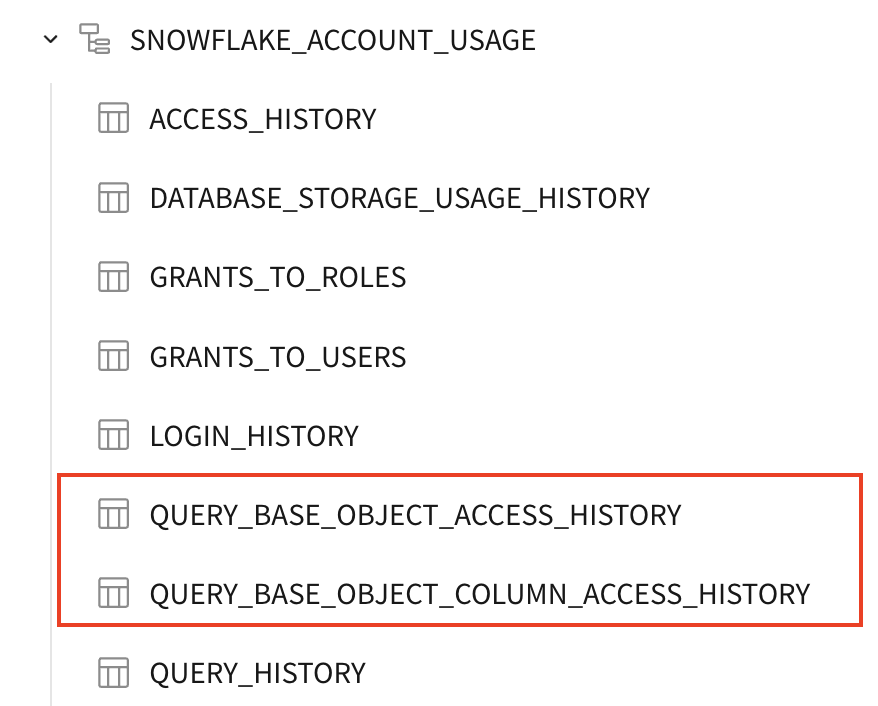
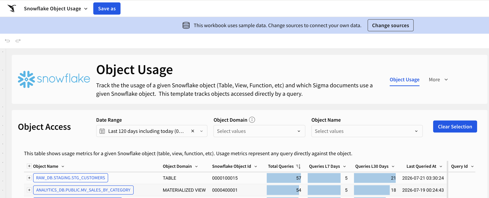
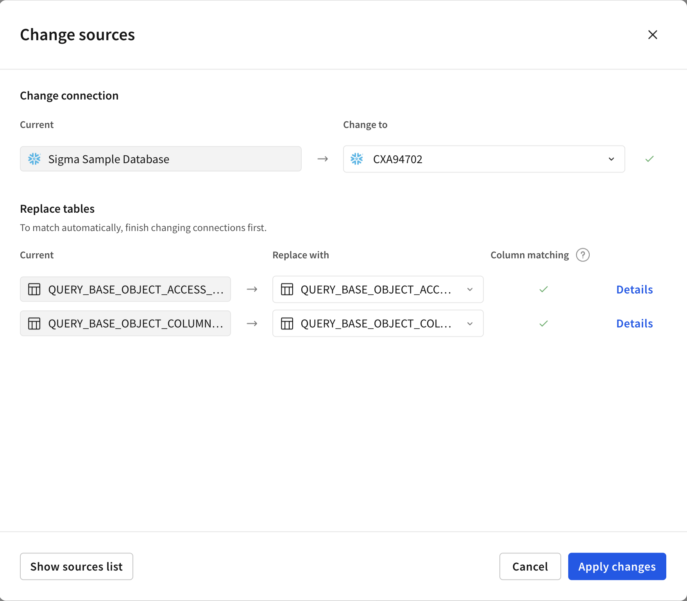

author: obashaw
id: snowflake_object_usage_template_setup
summary: snowflake_object_usage_template_setup
categories: templates
environments: web
status: Published
feedback link: https://github.com/sigmacomputing/sigmaquickstarts/issues
tags: default
lastUpdated: 2026-07-21

# Snowflake Object Usage Template Setup

## Overview 
Deploy Sigma's Snowflake Object Usage template to understand usage patterns for  objects in your Snowflake account.

There are two steps to setting up the template:
  1.  Create the `query_base_object_access_history` and `query_base_object_column_access_history` tables in your Snowflake account
  2.  Launch the template in Sigma and **Swap Sources** to the tables created in step 1

<aside class="positive">
<strong>IMPORTANT:</strong>  Some screens in Sigma may appear slightly different from those shown in QuickStarts. This is because Sigma is continuously adding and enhancing functionality. Rest assured, Sigma’s intuitive interface ensures that any differences will not prevent you from successfully completing any QuickStart.
</aside>

For more information on Sigma's product release strategy, see [Sigma product releases.](https://help.sigmacomputing.com/docs/sigma-product-releases)

### Target Audience
Anyone who is trying to understand which objects in Snowflake are being used, who is using them and which systems are accessing them.

### Prerequisites

<ul>
  <li>A computer with a current browser. It does not matter which browser you want to use.</li>
  <li>Access to your Snowflake account with the ability to create tables and grant access to the role used in your Sigma connection.</li>
  <li>Access to your Sigma environment.</li>
</ul>

<button>[Sigma Free Trial](https://www.sigmacomputing.com/free-trial/)</button>

### What You’ll Learn
How to deploy Sigma's **Snowflake Object Usage** template.

### What You’ll Build
<ul>
  <li>The "query_base_object_access_history" table in Snowflake that shows every base object used by each query.
  <li>The "query_base_object_column_access_history" table in Snowflake that shows every column used by each query.
  <li>A Sigma workbook that shows you how Snowflake objects and columns are being used by Sigma and any other system querying Snowflake.
</ul>

<!-- END OF OVERVIEW -->

## Building the object access history table

You will create the `query_base_object_access_history` table by running the attached SQL script in your Snowflake account.

[Download the SQL script here!](https://github.com/sigmacomputing/quickstarts-public/blob/main/snowflake-object-usage-template/query_base_object_access_history.sql)

This script creates a table called `query_base_object_access_history` that has one row per Snowflake object used by a query. Thus, a single query may have many rows in the table.  It is constructed by taking Snowflake's `access_history` view and laterally flattening the `base_objects` column.  The query tag is parsed to extract additional metadata on Sigma-created queries.

The script also sets up incremental materialization of the new `query_base_object_access_history` table so that it updates nightly.

The initial build of the table is set to look back 180 days, but you can change that if desired.

<aside class="positive">
<strong>NOTE:</strong>  
Snowflake distinguishes between "base" objects accessed by a query and "direct" objects accessed by a query.  If a query selects from a Snowflake view, that would likely appear in the list of direct objects accessed.  If the view references a few source tables (or other objects), those objects would appear in the list of base objects accessed by the query.

The tables you're creating in this quickstart reference the base objects accessed by a query.
</aside>

**The script requires you to specify a few parameters:**
<ul>
  <li>materialization_role_name : the role that will create and update the table
  <li>target_database / target_schema : the target destination for the table
  <li>task_warehouse : the warehouse used to create and update the table
  <li>sigma_role_name : the role used in your Sigma connection
</ul>

Run the SQL script in your Snowflake account, and then verify that you can see the new table in the Sigma connection browser.

<!-- END OF SECTION-->

## Building the column access history table

You will create the `query_base_object_column_access_history` table by running the attached SQL script in your Snowflake account.

[Download the SQL script here!](https://github.com/sigmacomputing/quickstarts-public/blob/main/snowflake-object-usage-template/query_base_object_column_access_history.sql)

This script creates a table called `query_base_object_column_access_history` that has one row per column used by each query. Again, a single query will likely have many rows in the table.  It is constructed by taking Snowflake's `access_history` view, laterally flattening the `base_objects` column and laterally flattening the `columns` array inside `base_objects`.  The query tag is parsed to extract additional metadata on Sigma-created queries.

The script also sets up incremental materialization of the new `query_base_object_column_access_history` table so that it updates nightly.

The initial build of the table is set to look back 180 days, but you can change that if desired.

<aside class="positive">
<strong>NOTE:</strong>  
Like the previous step, the query_base_object_column_access_history table in this section references the base objects accessed by a query, not direct objects accessed.
</aside>

**The script requires you to specify a few parameters:**
<ul>
  <li>materialization_role_name : the role that will create and update the table
  <li>target_database / target_schema : the target destination for the table
  <li>task_warehouse : the warehouse used to create and update the table
  <li>sigma_role_name : the role used in your Sigma connection
</ul>

Run the SQL script in your Snowflake account, and then verify that you can see the new tables in the Sigma connection browser.
 

<!-- END OF SECTION-->

## Deploying the Template
Duration: 5

Once you have created the `query_base_object_access_history` and `query_base_object_column_access_history` tables, go to Sigma.

From the home page, navigate to the `Templates` section, then search for `Snowflake Object Usage`.

Click on the `Snowflake Object Usage` template, then click "Use Template".

You will see a blue banner at the top of the screen asking you to swap your data in.  Click on **Change sources**.

Verify that Sigma has found the `query_base_object_access_history` and `query_base_object_column_access_history` tables, then click `Apply Changes`:

Click `Save As` and give your workbook a title.

**That's all there is to it!**  

You should now see the Snowflake Object Usage Template on top of your own data. 

For example:

<!-- END OF SECTION-->

## What we've covered
Duration: 0

In this QuickStart, we created the `query_base_object_access_history` and `query_base_object_column_access_history` tables and launched Sigma's `Snowflake Object Usage` template.

<!-- THE FOLLOWING ADDITIONAL RESOURCES IS REQUIRED AS IS FOR ALL QUICKSTARTS -->
**Additional Resource Links**

Be sure to check out all the latest developments at [Sigma's First Friday Feature page!](https://quickstarts.sigmacomputing.com/firstfridayfeatures/)

[Help Center Home](https://help.sigmacomputing.com) 
[Sigma Community](https://community.sigmacomputing.com/) 
[Sigma Blog](https://www.sigmacomputing.com/blog/) 
 

&emsp;
&emsp;

<!-- END OF WHAT WE COVERED -->
<!-- END OF QUICKSTART -->
