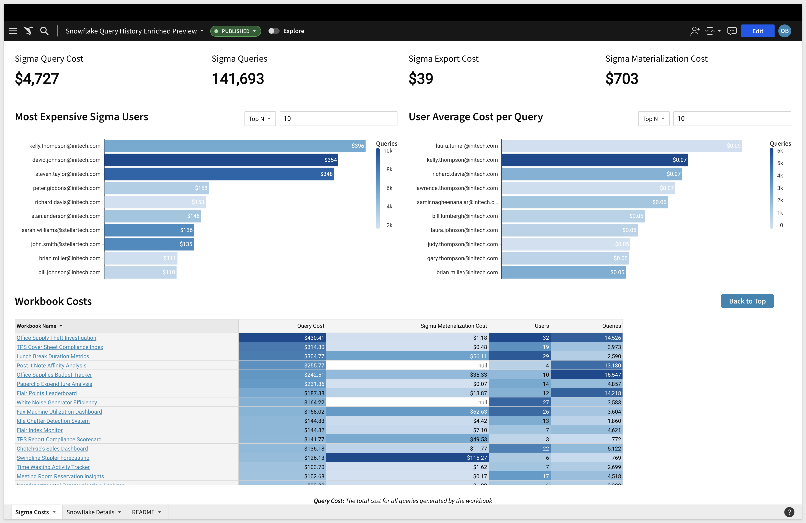
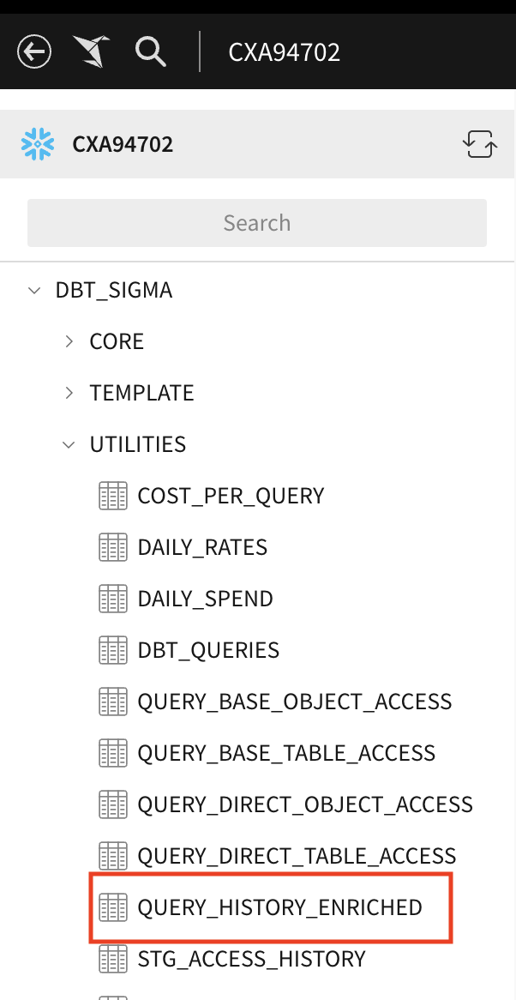
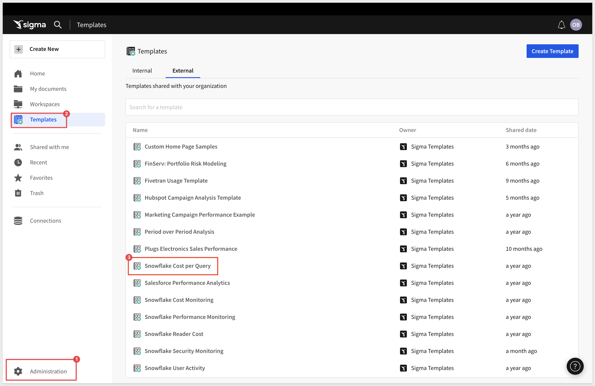
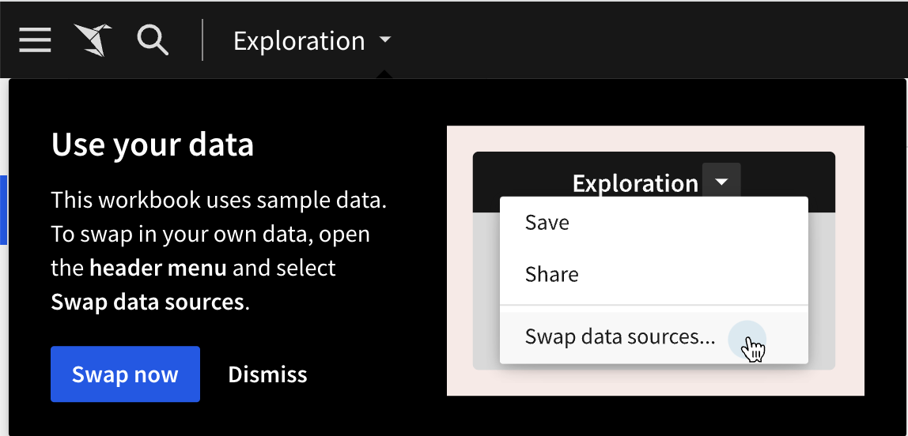
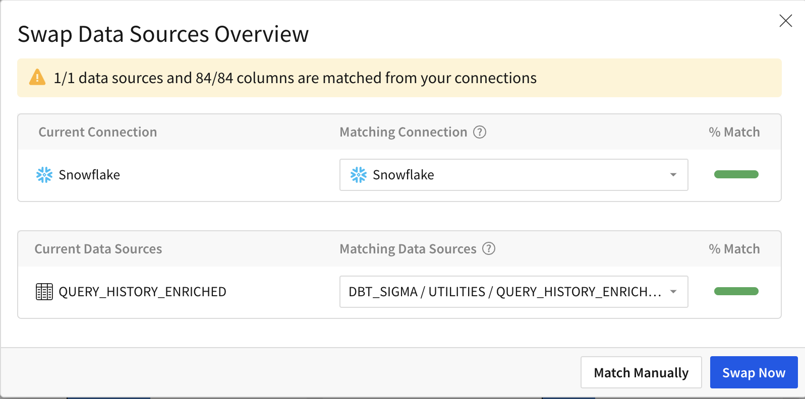

author: obashaw
id: snowflake_cost_per_query_template_setup
summary: snowflake_cost_per_query_template_setup
categories: templates
environments: web
status: Published
feedback link: https://github.com/sigmacomputing/sigmaquickstarts/issues
tags: default
lastUpdated: 2023-11-16

# Snowflake Cost per Query Template Setup

## Overview 
This **QuickStart** provides instructions on how to set up Sigma's **Snowflake Cost per Query** template. 

This template give you a prebuilt analysis of Snowflake costs by Sigma workbook / user and by Snowflake user, role and warehouse.

There are two steps to setting up the template:
<ol>
  <li>Create the `query_history_enriched` table in your Snowflake account
  <li>Launch the template in Sigma and **Swap Sources** to the table created in step 1
</ol>


<!-- <aside class="postive">
<strong>IMPORTANT:</strong><br> No customer data is stored in the Audit Log. Only events/actions and context is logged. 
</aside> -->


### Target Audience
Anyone who is trying to calculate the Snowflake cost-per-query or aggregate costs across different dimensions.

### Prerequisites

<ul>
  <li>A computer with a current browser. It does not matter which browser you want to use.</li>
  <li>Access to your Snowflake account with the ability to create tables and grant access to the role used in your Sigma connection.</li>
  <li>Access to your Sigma environment.</li>
</ul>

<button>[Sigma Free Trial](https://www.sigmacomputing.com/free-trial/)</button>

### What You’ll Learn
How to deploy Sigma's **Snowflake Cost per Query** template.

### What You’ll Build
<ul>
  <li>The `query_history_enriched` table in Snowflake that calculates the cost (in currency) for every query
  <li>A Sigma workbook that calculates query cost across Sigma workbooks / users and across Snowflake users, roles and warehouses.
</ul>


<!-- END OF OVERVIEW -->

## Building the query_history_enriched table with dbt
Duration: 5
<aside class="positive">
<strong>IMPORTANT:</strong><br> If your company does not use dbt, skip this page and advance to step 3 
</aside>

One way to create the `query_history_enriched` table is by deploying the <a href="(https://github.com/get-select/dbt-snowflake-monitoring/tree/main">dbt-snowflake-monitoring</a> dbt package from <a href="https://select.dev/">Select</a>.

This package has a model called **query_history_enriched** that enriches the Snowflake `query_history` table with query cost information.  It will calculate the actual cost (in currency) for every query run in your Snowflake account.

Once the package has been deployed, Sigma needs to be able to access the table(s) created.  
<ol>
  <li>Identify the role used in your Sigma connection.
  <li>Run the following command: 
</ol>   

```plaintext
grant select on table {database name}.{schema name}.query_history_enriched to role {role used in Sigma connection};
```
Note that you may need to grant usage on the database and schema that host this table.

Verify that you can see the new table(s) in the Sigma connection browser.
<br/>

<br/>

Then, advance to step 4.


<!-- END OF SECTION-->

## Building the query_history_enriched table without dbt
Duration: 5
<aside class="positive">
<strong>IMPORTANT:</strong><br> If your company uses dbt, ignore this page and go back to step 2 
</aside>

Another way to create the `query_history_enriched` table is by running the attached SQL script in your Snowflake account.
<a href="https://github.com/sigmacomputing/sigmaquickstarts/blob/master/site/sigmaguides/src/snowflake_cost_per_query_template/assets/query_history_enriched.sql">Download the SQL script here!</a>

Make sure that your role has the following privileges:
<ul>
  <li>create table (in your database/schema of choice)
  <li>create function
</ul>

Run the SQL script in your Snowflake account, and then run the following statements to give Sigma access to the table:
```plaintext
grant select on table {database name}.{schema name}.query_history_enriched to role {role used in Sigma connection};
```
You may also need to grant usage on the database/schema to the role used in the Sigma connection.

Verify that you can see the new table(s) in the Sigma connection browser.


<!-- END OF SECTION-->

## Deploying the Template
Duration: 5

Once you have created the `query_history_enriched` table, go to Sigma.
From the home page, navigate to the **Templates** section, then to **External**.

Click on the `Snowflake Cost per Query` template.
<br/>

<br/>
<br/>
You will be prompted to swap data sources. Click **Swap Now**.
<br/>

<br/>
<br/>
Then verify that Sigma has found the `query_history_enriched` table and click **Swap Now**.
<br/>

<br/>
<br/>
Click **Save As** and give your workbook a title.

And that's all there is to it!  You should now see the Snowflake Cost per Query Template on top of your own data. 


<!-- END OF SECTION-->


## What we've covered
Duration: 0

In this QuickStart we created the `query_history_enriched` table and launched Sigma's **Snowflake Cost per Query** template.
<br>
<!-- THE FOLLOWING ADDITIONAL RESOURCES IS REQUIRED AS IS FOR ALL QUICKSTARTS -->
**Additional Resource Links**

Be sure to check out all the latest developments at [Sigma's First Friday Feature page!](https://quickstarts.sigmacomputing.com/firstfridayfeatures/)

[Help Center Home](https://help.sigmacomputing.com/hc/en-us)<br>
[Sigma Community](https://community.sigmacomputing.com/)<br>
[Sigma Blog](https://www.sigmacomputing.com/blog/)<br>
<br>

[](https://twitter.com/sigmacomputing)&emsp;
[](https://www.linkedin.com/company/sigmacomputing)&emsp;
[](https://www.facebook.com/sigmacomputing)


<!-- END OF WHAT WE COVERED -->
<!-- END OF QUICKSTART -->