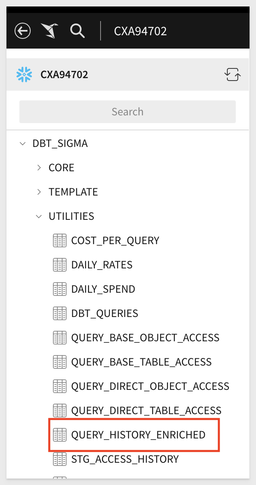
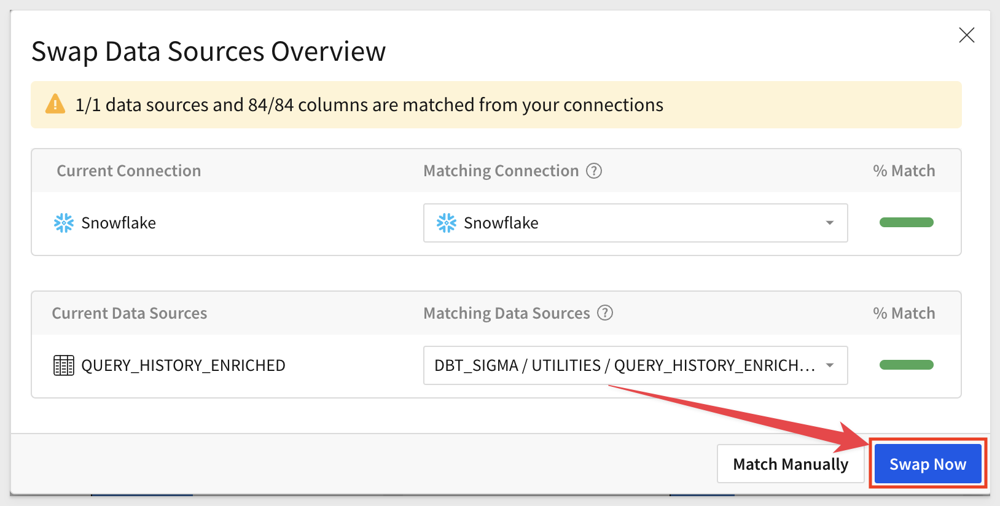

author: obashaw
id: snowflake_cost_per_query_template_setup
summary: snowflake_cost_per_query_template_setup
categories: templates
environments: web
status: Published
feedback link: https://github.com/sigmacomputing/sigmaquickstarts/issues
tags: default
lastUpdated: 2023-11-30

# Snowflake Cost per Query Template Setup

## Overview 
This **QuickStart** provides instructions on how to set up Sigma's **Snowflake Cost per Query** template. 

This template give you a prebuilt analysis of Snowflake costs by Sigma workbook / user and by Snowflake user, role and warehouse.

There are two steps to setting up the template:
  1.  Create the `query_history_enriched` table in your Snowflake account
  2.  Launch the template in Sigma and **Swap Sources** to the table created in step 1

### Target Audience
Anyone who is trying to calculate the Snowflake cost-per-query or aggregate costs across different dimensions.

### Prerequisites

<ul>
  <li>A computer with a current browser. It does not matter which browser you want to use.</li>
  <li>Access to your Snowflake account with the ability to create tables and grant access to the role used in your Sigma connection.</li>
  <li>Access to your Sigma environment.</li>
</ul>

<button>[Sigma Free Trial](https://www.sigmacomputing.com/free-trial/)</button>

### What You’ll Learn
How to deploy Sigma's **Snowflake Cost per Query** template.

### What You’ll Build
<ul>
  <li>The "query_history_enriched" table in Snowflake that calculates the cost (in currency) for every query.
  <li>A Sigma workbook that calculates query cost across Sigma workbooks / users and across Snowflake users, roles and warehouses.
</ul>

<!-- END OF OVERVIEW -->

## Building the query_history_enriched table

You will create the `query_history_enriched` table by running the attached SQL script in your Snowflake account.

[Download the SQL script here!](https://github.com/sigmacomputing/quickstarts-public/blob/main/snowflake_cost_per_query_template/query_history_enriched.sql)

This script takes Snowflake's new `query_attribution_history` table, which attributes compute credits to each query, and uses it to enrich the `query_history` table.  The script also sets up incremental materialization of the new `query_history_enriched` table so that it updates nightly.

**The script requires you to specify a few parameters:**
<ul>
  <li>materialization_role_name : the role that will create and update the query_history_enriched table
  <li>database_name / schema_name : the target destination for the query_history_enriched table
  <li>materialization_warehouse_name : the warehouse used to create and update the query_history_enriched table
  <li>sigma_role_name : the role used in your Sigma connection
</ul>

Run the SQL script in your Snowflake account, and then verify that you can see the new table(s) in the Sigma connection browser.
 

<!-- END OF SECTION-->

## Deploying the Template
Duration: 5

Once you have created the `query_history_enriched` table, go to Sigma.

From the home page, navigate to the `Templates` section, then to `External`.

Click on the `Snowflake Cost per Query` template:

You will be prompted to swap data sources. Click `Swap Now`:

Verify that Sigma has found the `query_history_enriched` table and click `Swap Now`:

Click `Save As` and give your workbook a title.

**That's all there is to it!**  

You should now see the Snowflake Cost per Query Template on top of your own data. 

For example:

<!-- END OF SECTION-->

## What we've covered
Duration: 0

In this QuickStart we created the `query_history_enriched` table and launched Sigma's `Snowflake Cost per Query` template.

If you're interested in a Snowflake Optimization tool, check out [Select!](https://select.dev)

<!-- THE FOLLOWING ADDITIONAL RESOURCES IS REQUIRED AS IS FOR ALL QUICKSTARTS -->
**Additional Resource Links**

Be sure to check out all the latest developments at [Sigma's First Friday Feature page!](https://quickstarts.sigmacomputing.com/firstfridayfeatures/)

[Help Center Home](https://help.sigmacomputing.com) 
[Sigma Community](https://community.sigmacomputing.com/) 
[Sigma Blog](https://www.sigmacomputing.com/blog/) 
 

&emsp;
&emsp;

<!-- END OF WHAT WE COVERED -->
<!-- END OF QUICKSTART -->
