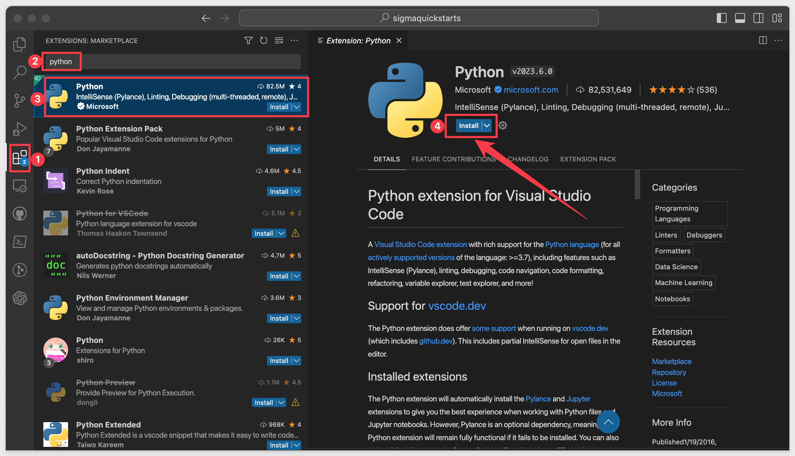

author: pballai
id: snowflake_snowpark_udf_python
summary: snowflake_snowpark_udf_python
categories: snowflake
environments: web
status: Published
feedback link: https://github.com/sigmacomputing/sigmaquickstarts/issues
tags: Getting Started, Analytics, Data Engineering, BI, Business Intelligence, Sigma, Sigma Computing, Snowflake, Dashboarding, Visualization, Analysis, Excel, Spreadsheet, Embedding


# Snowpark UDF's with Python
<!-- The above name is what appears on the website and is searchable. -->

## Overview 
Duration: 5 

### QuickStart Approach
This QuickStart serves as an introduction to using Snowflake Snowpark (Snowpark) to create user defined functions (UDF) and leverage them directly in Sigma to enable advanced functionality with ease. 

There are many areas of discussion possible as Snowpark touches on data quality, data modeling, machine learning (ML), data science, analytics and more. With that in mind, we will narrow the scope for this QuickStart to high level education on Snowpark with a focus on UDF's and using them in Sigma. 

### What is Snowpark?
Snowflake Snowpark is a new feature of the Snowflake Data Cloud platform that allows developers to write custom code using popular programming languages like Java, Scala, and Python, and execute it directly within Snowflake. It provides a powerful and flexible way to process data within Snowflake without having to move data in and out of the platform.

With Snowpark, developers can write custom data processing code that can be executed on data stored in Snowflake. Snowpark uses a custom SQL pushdown mechanism to optimize code execution and minimize data movement. This means that developers can write complex data processing logic using familiar programming languages, while leveraging the power and scalability of Snowflake's cloud-based data warehouse.

Some of the key benefits of using Snowpark include:

    Simplified data processing: Snowpark provides a powerful and flexible way to process data within Snowflake without having to move data in and out of the platform, which simplifies the data processing pipeline and reduces complexity.

    Language flexibility: Snowpark supports popular programming languages like Java, Scala, and Python, which allows developers to write code using the language they are most comfortable with.

    Efficient data processing: Snowpark uses a custom SQL pushdown mechanism to optimize code execution and minimize data movement, which makes data processing more efficient and reduces the overall processing time.

    Platform integration: Snowpark integrates seamlessly with other Snowflake features like Snowflake's data sharing and data marketplace, which makes it easy to build data applications and solutions using Snowflake.

### Snowpark Worksheets
Snowflake Snowpark worksheets for Python are interactive notebooks that allow developers to write, test, and execute custom Python code directly within Snowflake. These worksheets provide a powerful and flexible way to develop and test Python-based data processing logic using the Snowflake Data Cloud platform.

Snowpark worksheets for Python provide a familiar environment for Python developers to work with. Developers can use popular Python libraries like pandas, NumPy, and scikit-learn to read, process, and analyze data stored in Snowflake. The worksheets also support the use of Snowpark APIs and libraries for working with Snowflake-specific features like Snowflake metadata, security, and data sharing.

Some of the key features of Snowpark worksheets for Python include:

    Interactive development environment: Snowpark worksheets provide a rich and interactive environment for developing Python-based data processing logic. Developers can write and execute code within the worksheet, and see the results immediately.

    Familiar Python environment: Snowpark worksheets support the use of popular Python libraries like pandas, NumPy, and scikit-learn, which allows developers to work with familiar tools and frameworks.

    Seamless integration with Snowflake: Snowpark worksheets integrate seamlessly with other Snowflake features like data sharing and data marketplace, which makes it easy to develop and deploy data solutions using Snowflake.

    Secure and scalable: Snowpark worksheets provide a secure and scalable environment for developing and testing Python-based data processing logic. Snowflake's cloud-based data warehouse provides the scalability and reliability required for processing large amounts of data.

Overall, Snowflake Snowpark worksheets for Python provide a powerful and flexible environment for developing and testing custom Python-based data processing logic directly within Snowflake. This allows developers to take full advantage of the Snowflake Data Cloud platform and its capabilities for data processing and analysis.

### The impact of Snowpark

As of January 31, 2023 [Snowflake has more than 7,820 customers, including 573 of the Forbes Global 20002, and continues to grow rapidly.](https://www.snowflake.com/wp-content/uploads/2021/05/SnowflakeFastFactsSheet.pdf)

Given the size of Snowflake's installed base, the implications of Snowpark on the ML and data science markets are significant and could potentially have several impacts, including:

    Improved Efficiency: With Snowpark, data scientists and developers can write and run code directly on the Snowflake platform, which can lead to improved efficiency and faster development cycles. This could potentially lead to the creation of more accurate and reliable ML models.

    Increased Collaboration: Snowpark enables data scientists and developers to collaborate more easily on projects by allowing them to work on the same platform and share code and data. This could potentially lead to more efficient and effective teamwork and could also foster innovation.

    Enhanced Data Management: Snowpark could potentially improve data management by allowing data scientists to work directly with the data on the Snowflake platform. This could lead to better data governance, security, and quality.

    Competition: The introduction of Snowpark could potentially increase competition in the ML and data science markets as Snowflake is a major player in the cloud data platform space. Other vendors may need to develop similar features to remain competitive.

[Sunny Bedi, CIO of Snowflake](https://www.snowflake.com/blog/2023-predictions-for-chief-data-officers/) anticipates several trends that data executives should pay attention to including:

 <ul>
      <li>The infrastructure for data science will be platform-based.</li>
      <li>Business intelligence (BI) folks will graduate to become data scientists.</li>
      <li>Data science will start to permeate every department in an organization.<li>
</ul>

Considering all of this, Snowpark is something that data professionals need to pay attention to. 

### Persona for this QuickStart

We will demonstrate (at a high-level) how we can start to use Snowpark as a **developer** (using Python) might do. Given the depth of Snowpark, we will start with what amounts to a "Hello World" sort of use case.

This will give us the software configurations and a base understanding of the workflow involved. In subsequent QuickStarts in this series, we will increase the complexity by diving into specific uses cases found in real world applications, leveraging Sigma. 

 ### Target Audience
Anyone interested in learning about Snowpark and how to leverage UDFs in Sigma.

Developers who are interesting in creating Snowpark UDFs in Python (and other supported languages) and leveraging them within Sigma to provide advanced functionality to Sigma users.

<aside class="postive">
<strong>IMPORTANT:</strong><br> This QuickStart assumes users are familiar with basic software installation and configuration. Not all steps will be shown as they are commonly used methods. 
</aside>

<ul>
  <li>A computer with a current browser. It does not matter which browser you want to use.</li>
  <li>Access to your Sigma environment. A Sigma trial environment is acceptable and preferred.</li>
  <li>A Snowflake account with the proper administrative and security admin access.</li>
  <li>A development environment of choice. We will demonstration with Microsoft VSCode and related extensions</li>
  <li>Miniconda for required Python packages</li>
</ul>

<aside class="postive">
<strong>IMPORTANT:</strong><br> Sigma recommends that you do not use production resources when doing QuickStarts.
</aside>

<button>[Sigma Free Trial](https://www.sigmacomputing.com/free-trial/)</button> <button>[Snowflake Free Trial](https://signup.snowflake.com/)</button> <button>[Microsoft VSCode](https://code.visualstudio.com/download)</button> <button>[MiniConda](https://docs.conda.io/en/latest/miniconda.html)</button>

### What You’ll Learn from here

We will learn how to setup a local development environment, configure it for Python, connect to Snowflake, create and test Snowpark UDFs and use them in Sigma.

<aside class="postive">
<strong>IMPORTANT:</strong><br> We will demonstrate using MAC but the steps are very similar for Windows and Linux. 
</aside>

### What You’ll Build

asDAsdasd


<!-- END OF OVERVIEW -->

## **Setup Minconda**
Duration: 20

We will start by installing a "thin" version of Anaconda called "MiniConda". 

Miniconda is the much smaller (about 200 MB vs. 4+ gig) installer version of Conda and will save us time and disk-space compared with installing the full Anaconda application. 

Conda is an open-source, cross-platform, language-agnostic package manager and environment management system. It was originally developed to solve difficult package management challenges faced by Python data scientists, and today is a popular package manager for Python and R.

It includes only Conda, Python, the packages they depend on, and a small number of other useful packages, including pip, zlib and a few others. Packages that are not included, have to be called at runtime or installed individually.

[Use the following link to download the Miniconda.](https://docs.conda.io/en/latest/miniconda.html) Download the version that includes **Python 3.8 or above** based on your operating system and its configuration (32 bit or 64 bit).

<aside class="negative">
<strong>NOTE:</strong><br> Snowpark requires Python version 3.7 or later.
</aside>

After downloading the operation system appropriate version from Miniconda, go ahead and run the installation, accepting the license and all the defaults.

Close the installed (we can delete the installation file too):


Now that MiniConda is installed (along with our selected version of Python; v3.8), we can move to the next step.


<!-- END OF NEXT SECTION-->


## **Setup VSCode**
Duration: 20

[Install VSCode from Microsoft's download site.](https://code.visualstudio.com/download)

Once the software is installed, we need to configure it for our use case. 

Open VSCode and click the sidebar icon for `Extentions`. 

Search for `Python` and select the extension from the list as shown. Click `Install`:



<aside class="negative">
<strong>NOTE:</strong><br> VSCode may notify you (in the lower left corner of the application) that it requires a restart. Go ahead and select restart. This is required when the extension needs to perform additional registration with VSCode.
</aside>


We now have a development environment ready for programming but we need to do a little more.


<!-- END OF NEXT SECTION-->

## **Create a Python Environment**
Duration: 20

Since we installed MiniConda, every available Conda package is not present in our system. While this saves install time and saves disk-space, we will have to be aware that each VScode project will need to have required package dependencies installed at runtime. 

We could solve this by installing packages globally but we prefer to avoid that and maintain tight control of our development environment. 

To properly support this control, we will make use of `Python environments` to create project/package isolation. 

For our first project, we will create a Python environment called `snowpark`.

In our local computer, navigate to where Miniconda is installed. The default is based on your computer username.

Right-click and open a terminal session:


First, let's see what environments already exist. Run the command:
```plaintext
conda env list
```

We should see the "base" environment that is included with Miniconda. 


Now let's create our "snowpark" environment for our VSCode project. Run the command:
```plaintext
conda create --name snowpark python=3.8
```

When prompted to proceed, type `y` and hit return:


Listing the environments again, we should see `base` and `snowpark` with base being the current select noted by the "*":
```plaintext
conda env list
```


We are ready with our new conda environment called `snowpark`. 

Before we use this environment in VS Code, we should to install packages we will plan to use later in this QuichStart, inside our `snowpark` environment.

To install packages inside our `snowpark` environment, we need to first activate it. Run the command:
```plaintext
conda activate snowpark
```

`snowpark` is activated and we can confirm that by looking at the conda env list again:


The only package our simple UDF will require is called `pandas`.

<aside class="negative">
<strong>NOTE:</strong><br> Pandas is a popular open-source data analysis library for Python that provides powerful and easy-to-use data structures and data analysis tools. It is widely used in data science and data analytics to manipulate and analyze data in various formats such as CSV, Excel, SQL databases, and more.
</aside>

 Run the command to install `pandas` in our `snowpark` environment:
```plaintext
conda install pandas
```

As before, when prompted to proceed, press `y` and hit enter:


The installation of pandas also installed many other dependencies. One is called `numpy` and we will also use this in our project later but do not need to install it again.

<aside class="negative">
<strong>NOTE:</strong><br> NumPy is a numerical computing package for Python that provides support for large, multi-dimensional arrays and matrices, along with a large library of mathematical functions to operate on these arrays.
</aside>

### Snowpark Python Package

Snowflake provides a package that allows us to connect to Snowpark remotely. 

 Run the command to install it:
```plaintext
conda install snowflake-snowpark-python 
```
<aside class="negative">
<strong>NOTE:</strong><br> It is normal to see a few failure messages while it is installing (as it tries to reach resources). It should end with three consecutive "done" messages.
</aside>

<aside class="positive">
<strong>IMPORTANT:</strong><br> Packages are powerful and can really accelerate development. There are thousands of packages available with the list growing every day.
</aside>

Open VSCode again. We select the Python interpreter we want to use for our project.

Access the VSCode editor commands. `Ctrl+Shift+P` will bring you directly to the editor commands.

<aside class="negative">
<strong>NOTE:</strong><br> This is not the same thing as the VSCode search bar that is always on by default.
</aside>

In the editor bar, type `select inter` and you should see `Python: Select Interpreter` listed. Select that.


There are a few (likely) versions installed and we want to select the one that is based on our `snowpark` environment.

We can tell which that is as it will say `snowpark`. 


<aside class="negative">
<strong>NOTE:</strong><br> We have seen VSCode request another restart after this step so check (lower left corner of VSCode) to see if it is required again. 
</aside>

After restart (if required), VSCode will revert to the default Python environment so change that back to `snowpark` again. 

Make sure that the Python Interpreter selected in blue is `snowpark`, indicating that it is active.


<aside class="negative">
<strong>NOTE:</strong><br> It is possible to change the default but that is a distraction and we want to just start building.
</aside>

We are now setup to start developing our Snowpark UDF.


<!-- END OF NEXT SECTION-->

## **My First UDF**
Duration: 20

For our first UDF, we will use the NumPy package to create a UDF in Snowpark that can be later called by Sigma by name. We will keep this very simple and calculate the greatest common denominator (GCD) between two input values.

GCD is not a Sigma function (today) so calculating that in Sigma requires more effort that we would want. A UDF that is shared and can be called by any Sigma user, using the Sigma user interface directly, is highly desireable.

Part of the VSCode with Python includes `Jupyter Notebooks`. 

A Jupyter notebook in VS Code is a file format that allows you to create and edit interactive documents that combine code, text, and visualizations. Jupyter notebooks are often used for data science, machine learning, and scientific computing tasks.

For the purposes of this QuickStart, they are not all that different than other tools you probably have used with a just a few built-in controls to locate while using the Notebook. 

To create a new Jupyter notebook, just open the command palette in VSCode as before `Ctrl + Shift + p` and type “New Jupyter notebook” without any quotation, and click it to create a new notebook.


The first thing we prefer to do is save the blank workbook so that we can make incremental saves anytime we want.

Like any other application, click `File` > `Save` and give it name. We used `getting-started.ipynb`. In this case, the file extension (.ipynb)
is important to use.


We have a blank Jupyter notebook. There are really three main features we will use in this exercise.

 <li>
    <ol type="n"> 
      <li><strong>1:</strong> Adds a new codeblock to the workbook. Codeblocks can be run independantly, which is useful for our exercise.</li>
      <li><strong>2:</strong> Individual codeblock</li>
      <li><strong>3:</strong> Run the code in the codeblock that the arrow is adjacent to.</li>
    </ol>
  </li>


With that out of the way, lets do a quick test to make sure all of this is working.

Type `1+1` in only codeblock and click the run (arrow) button on the left side of the codeblock. 

If it produces an answer of 2, then it is working well.

In our case, an error is thrown and this is typically when using Minoconda but simple to resolve. VSCode prompts to install the required packages so we can just select `Install` and let VSCode do the conda package install for us.


After the install is done (maybe 20 seconds), the quick test produces a positive result. Note the green checkmark; this is what we always want to see when testing.


Now that we are sure that 1+1 = 2, we can move on. 

Click the add a new `codeblock` (+Code).

Copy this code into the new block:
```plaintext
# SNOWFLAKE AUTHENTICATION
from snowflake.snowpark import Session
import snowflake.snowpark.functions as F
import snowflake.snowpark.types as T

connection_parameters = {
    "account": "Your Snowflake Account Number", 
    "user": "Your Snowflake username",
    "password": "Your  Snowflake password",
    "application": "Sigma_PassThroughPython",
    # optional default parameters
    "role": "ACCOUNTADMIN",
    "warehouse": "Your warehouse",
    "database": "your database",
    "schema": "your schema",
    }  
session = Session.builder.configs(connection_parameters).create()
```

<aside class="positive">
<strong>IMPORTANT:</strong><br> We need the Snowflake Role that Sigma will later use to call the UDF. You may have to provide a connection to your own Snowflake instance as you cannot use the Sigma Sample Database Snowflake connection for this purpose.
If you signed up for a Snowflake trail, you can simply use the ACCOUNTADMIN role that is standard in Snowflake trail accounts.
</aside>

After you have configured the required values, run this codeblock as usual. We should get the positive result (green checkmark) indicating that we our VSCode project is connected to Snowflake, based on the configured parameters:


Now that we are connected, we want to create another codeblock to define our greatest common denominator (GCD) UDF.

In a new codeblock, copy and paste this code:
```plaintext
# Define our greatest common denominator UDF
def udf_Greatest_Common_Denominator(df: pd.DataFrame) -> pd.Series:
    import pandas as pd
    import numpy
    
    df = df.astype('int')
    Arg1 = df.iloc[:, 0]
    Arg2 = df.iloc[:, 1]

    gcd = numpy.gcd(Arg1, Arg2)
    return gcd
```

This code defines a user-defined function (UDF) in Python that calculates the greatest common denominator (GCD) of two numbers in a Pandas DataFrame. 

Here is a breakdown of each line of the code:

```plaintext
# Define our greatest common denominator UDF:
```
This is a comment that describes what the following code does.

```plaintext
def udf_Greatest_Common_Denominator(df: pd.DataFrame) -> pd.Series:
```
This line defines the UDF called udf_Greatest_Common_Denominator, which takes a single argument df of type pd.DataFrame, and returns a pd.Series object. The UDF expects a DataFrame with two columns containing the two numbers for which to compute the GCD.

```plaintext
import pandas as pd
import numpy
```
This line imports the panda and numpy libraries which provides a gcd function that we will use to calculate the GCD. While we already have numpy installed in our local environment, it is not going to exist on our Snowpark instance for this UDF unless we specify to import it when the UDF is defined.

```plaintext
df = df.astype('int')
```
This line converts the DataFrame df to an integer data type.

```plaintext
Arg1 = df.iloc[:, 0]
Arg2 = df.iloc[:, 1]
```
These two lines extract the first and second columns of the DataFrame df and assign them to Arg1 and Arg2, respectively.

```plaintext
gcd = numpy.gcd(Arg1, Arg2)
```
This line uses the numpy.gcd function to calculate the GCD of Arg1 and Arg2, and assigns the result to the variable gcd.

```plaintext
return gcd
```
This line returns the GCD value as a pd.Series object from the UDF.

Now that it is all explained, run the codeblock.

As before, we should see a green checkmark:


### Register the Function in Snowflake

Our new UDF takes in two float arguments (the two columns in which to find the smallest common denominator against), so we need to specify that in the registrations using the `input_types` as:
```plaintext
 [T.FloatType()]*2 
```

Copy this code to a new codeblock in VSCode:
```plaintext
### Register UDF
udf_Greatest_Common_Denominator = session.udf.register(func=udf_Greatest_Common_Denominator, 
    name="GCD_UDF", 
    input_types=[T.FloatType()]*2,
    return_type = T.FloatType(),
    stage_location='@My_UDFS',
    replace=True,
    max_batch_size =  1000,
    is_permanent=True, 
    packages=['numpy','pandas'],
    comment = "Algorithm to find Greatest Common Denominator",
    session=session)
```
Some things to note:

1: Note that we had to specify the numpy and pandas libraries. <br><br>
2: We gave it a name `GCD_UDF`. We will call this UDF by that name from Sigma later.<br><br>
3: We have to make the registered UDF available to the Snowflake connection that is being used in Sigma.<br>

Run the codeblock. It will likely fail: 


This is because we specified a Snowflake Stage, but forgot to create it. Lets do that.

In a Snowflake **SQL Worksheet**, run this command using the warehouse and database that we connected to Snowflake in VSCode. We want the Stage to exist where we want it.
```plaintext
CREATE STAGE IF NOT EXISTS My_UDFS
```


After creating the required Snowflake Stage, re-run takes a bit longer (17 seconds...a lifetime!) to run:


Lastly, we need to register the UDF (item #3 on the list) by running this code in a new VSCode codeblock:
```plaintext
query = session.sql('grant all on function GCD_UDF(float, float) to role ACCOUNTADMIN')
query.collect()
```


<aside class="positive">
<strong>IMPORTANT:</strong><br> We haver defined a new function and stored it in Snowflake but we have not tested that it works. Let's assume it does (or has been created and tested by someone else in your company) and we just want to use it in Sigma. Later in this QuickStart, there is an optional section that covers how to test this UDF on our local machine, with VSCode. 
</aside>

## **UDF in Sigma**
Duration: 20


<!-- END OF NEXT SECTION-->


### Optional Section

For this next demonstration, we will create a Snowpark Dataframe and use 


<!-- END OF NEXT SECTION-->


## What we've covered
Duration: 5

In this lab we learned how to.........

INSERT FINAL IMAGE OF BUILD IF APPROPRIATE

<!-- THE FOLLOWING ADDITIONAL RESOURCES IS REQUIRED AS IS FOR ALL QUICKSTARTS -->
**Additional Resource Links**

[Help Center Home](https://help.sigmacomputing.com/hc/en-us)<br>
[Sigma Community](https://community.sigmacomputing.com/)<br>
[Sigma Blog](https://www.sigmacomputing.com/blog/)<br>
<br>

[](https://twitter.com/sigmacomputing)&emsp;
[](https://www.linkedin.com/company/sigmacomputing)
[](https://www.facebook.com/sigmacomputing)


<!-- END OF WHAT WE COVERED -->
<!-- END OF QUICKSTART -->