author: pballai
id: starter_apps_budget_variance
summary: Explore Sigma's Budget Variance Analysis Starter App — a ready-to-use finance app for tracking actuals against budget, documenting variance commentary, building AI-assisted reforecast scenarios, and routing them through executive approval.
categories: starterapps
environments: web
status: Hidden
feedback link: https://github.com/sigmacomputing/sigmaquickstarts/issues
tags: 
lastUpdated: 2026-07-12

# Budget Variance Analysis Starter App

## Overview
Duration: 5

Sigma's **Starter Apps** are ready-to-use applications built on Sigma's native features and connected to sample data. Each one ships fully functional — you can explore it immediately, learn how it's built by switching to edit mode, and adapt it to your own data and workflows without starting from scratch.

The **Budget Variance Analysis** app gives finance and FP&A teams a structured end-to-end workflow: identify where actuals diverged from budget, document the explanation, build a reforecast scenario with AI-assisted recommendations, and route it through executive sign-off — all within a single connected workbook. Once approved, the new baseline is locked and the cycle resets for the next period.

This QuickStart walks through how the app works as a user, how it's designed under the hood, and how to connect it to your own financial data.

### Target Audience
Finance and FP&A teams evaluating or adopting Sigma for variance and reforecast workflows. Solutions Engineers and technical stakeholders exploring the app as a reference design.

### Prerequisites

<ul>
  <li>Access to a Sigma environment.</li>
  <li>The Budget Variance Analysis Starter App available in your org — find it under <code>Templates</code> > <code>Starter Apps</code>.</li>
  <li><strong>Write access enabled on a connection</strong> — required for input tables that store scenario data, analyst commentary, and budget overrides. See <a href="https://help.sigmacomputing.com/docs/set-up-write-access">Set up write access</a></li>
  <li><strong>AI provider configured for your organization</strong> — required for the inline AI reforecast and approval recommendations. See <a href="https://help.sigmacomputing.com/docs/configure-ai-features-for-your-organization">Configure AI features for your organization</a></li>
  <li>Some familiarity with Sigma workbooks is helpful but not required.</li>
</ul>

<aside class="positive">
<strong>NOTE:</strong><br> If you don't see Starter Apps in your Templates section, contact your Sigma administrator to confirm availability in your org.
</aside>

### What You'll Learn
- How the five-page variance-to-reforecast cycle works end to end
- How to document variance commentary and flag items for reforecast
- How AI recommendations surface on the Reforecast Budget and Executive Signoff pages
- The data architecture that powers named scenarios, budget overrides, and approval tracking
- How to connect the app to your own financial warehouse data


<!-- END OF SECTION-->

## Exploring the App
Duration: 10

### Open and Save the Template

Navigate to `Templates` in the left sidebar. The Budget Variance Analysis app appears in the `Made by Sigma` collection:

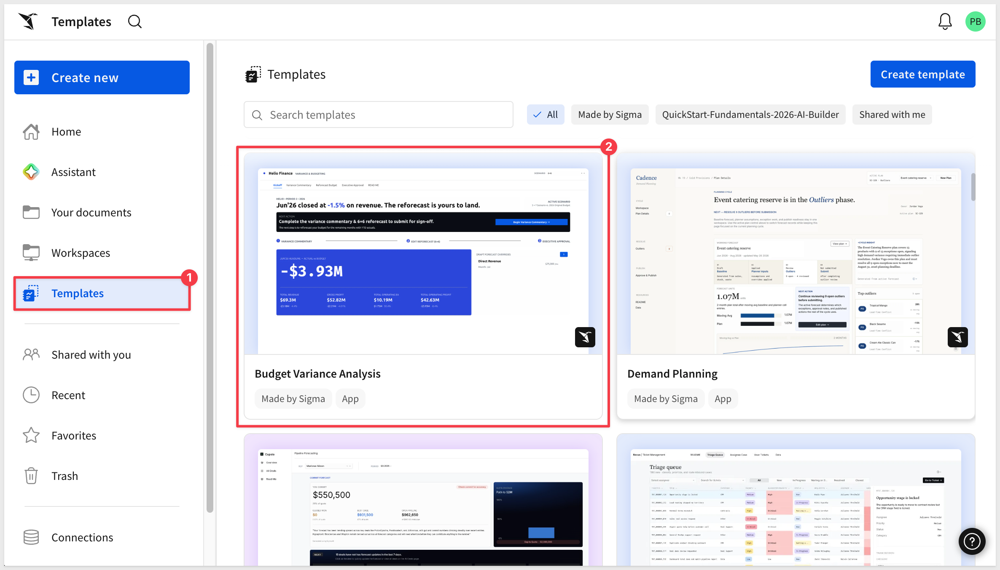

Click the template card to open a preview. Before clicking `Use template`, confirm the two requirements shown on the detail page are met:

- **Write access enabled on a connection** — required for all input tables in the app
- **AI provider set up in your organization** — required for inline AI recommendations

Click `Use template`:

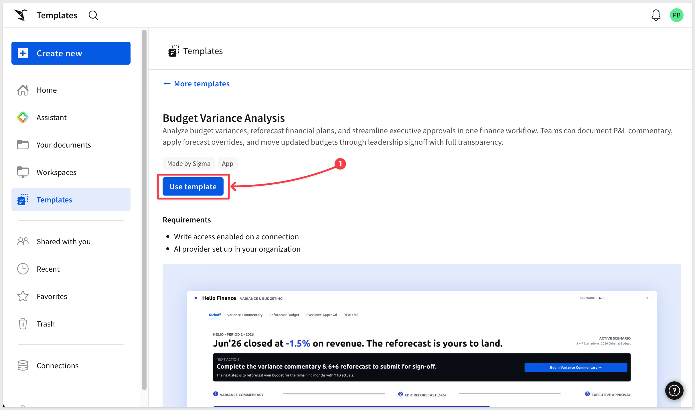

Click `Save as`, give the workbook a name, and choose a folder to save it: 

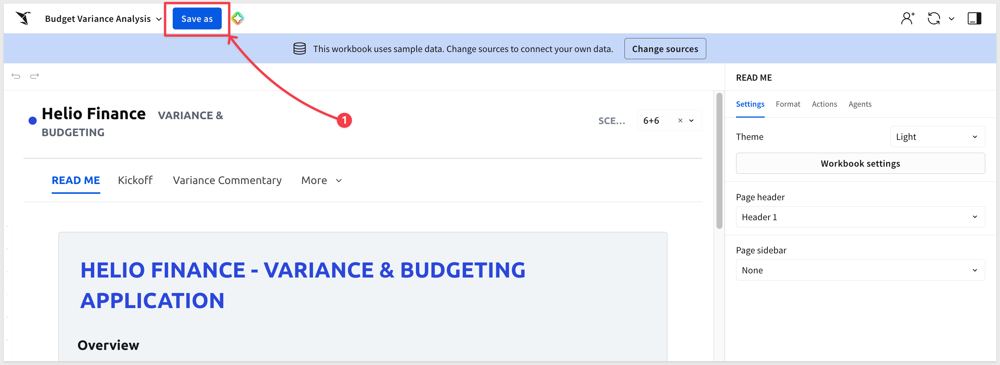

The app opens to its `READ ME` page:

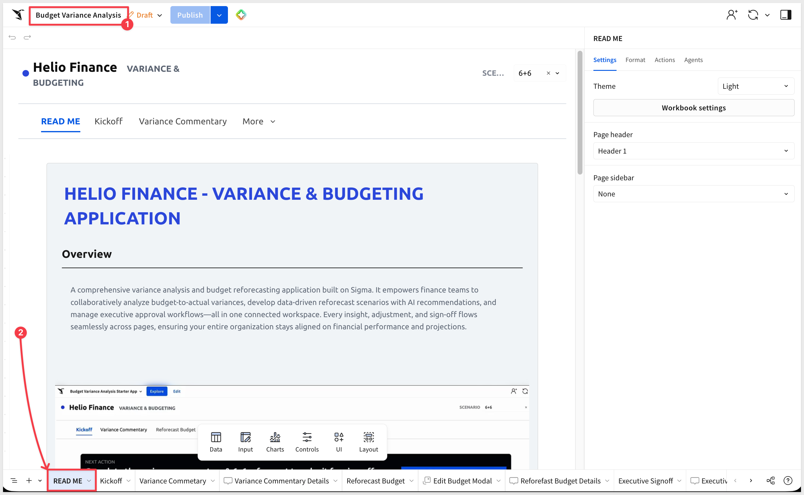

### App Pages

The app is organized across five visible pages, each serving a distinct role in the planning cycle:

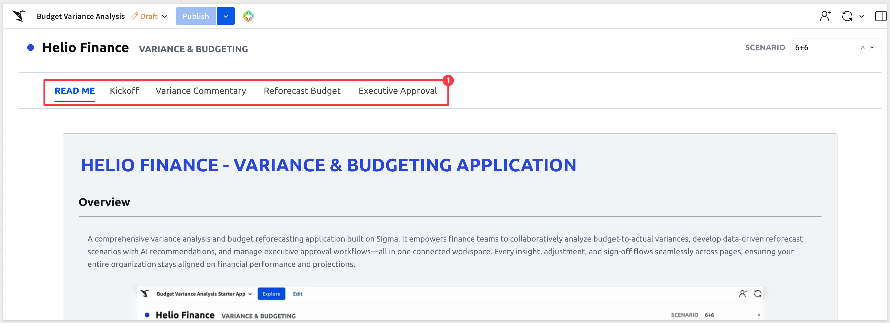

| Page | Purpose |
|------|---------|
| **READ ME** | Setup instructions and a summary of the five-step workflow |
| **Kickoff** | Planning command center — headline metrics, active scenario status, and your next action |
| **Variance Commentary** | Workspace for documenting budget-to-actual explanations by category |
| **Reforecast Budget** | Editable pivot for adjusting the forecast with AI recommendations |
| **Executive Signoff** | Final approval workspace — review, sign off, and lock the new baseline |

### The Kickoff Page

The Kickoff page is where each planning cycle begins. It surfaces the most important context at a glance:

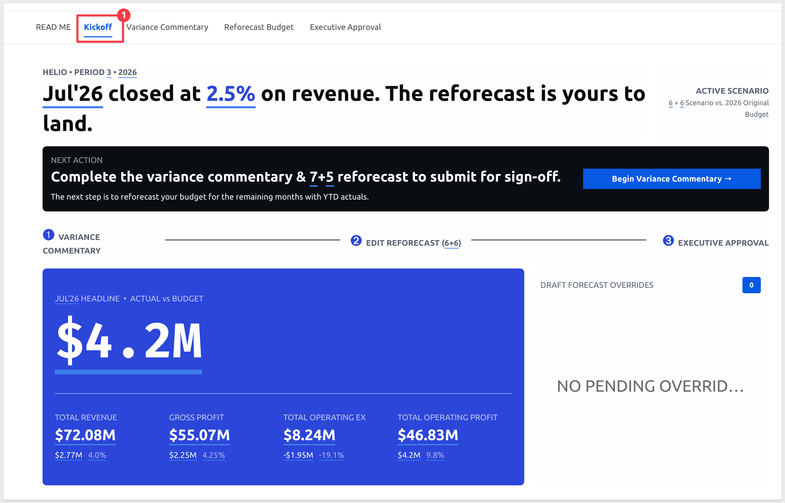

**Headline metric** — the current period's revenue variance percentage against budget, calculated live from the warehouse. The figure updates automatically as new actuals close.

**Period metrics panel** — Total Revenue, Gross Profit, Total Operating Expenses, and Total Operating Profit for the current month, with month-over-month dollar and percentage change shown alongside each figure.

**Next Action prompt** — a dark card that states the outstanding task for the current cycle: completing variance commentary and submitting the reforecast for sign-off.

**Three-step workflow navigator** — links to Variance Commentary (➊), Reforecast Budget (➋), and Executive Approval (➌), keeping the cycle visible at all times.

**Draft Forecast Overrides** — a live feed of budget adjustments that have been staged but not yet approved, so analysts and managers can see what's in flight.

A sixth page, `Data`, is hidden and contains all source tables. It is covered in the Under the Hood section.

### Planning Scenarios

The app ships with six pre-built planning scenarios, visible as radio buttons in the `SCENARIO` filter on the Variance Commentary page:

| Scenario | Meaning |
|----------|---------|
| `1+11` | 1 month of actuals closed, 11 months to forecast |
| `2+10` | 2 months closed, 10 to forecast |
| `3+9` | 3 months closed, 9 to forecast |
| `4+8` | 4 months closed, 8 to forecast |
| `5+7` | 5 months closed, 7 to forecast |
| `6+6` | 6 months closed, 6 to forecast |
| `Original Budget` | The approved baseline — no adjustments |

The X+Y naming is standard FP&A (Financial Planning and Analysis) shorthand for a **rolling monthly reforecast**. 

`X` is the number of months where real results — called *actuals* — have been recorded and locked. 

`Y` is the number of months still open for forecasting. X and Y always add up to 12 because the fiscal year is 12 months long.

In practice, finance teams run this process every month-end: close the prior month's actuals, explain where performance differed from the budget (variance commentary), update the forecast for the remaining open months, and submit it for executive approval. Then the cycle repeats. The scenario name advances by one each month — `1+11` in January, `2+10` in February, and so on.

`Original Budget` is the annual plan approved at the start of the fiscal year. It never changes — it's the fixed baseline that every scenario is measured against. When an executive sees a `6+6` reforecast, they're comparing it to whatever the company agreed the full year should look like back in January.

The sample data in this app covers the first six months, so scenarios run through `6+6`. A deployment connected to a full year of data would typically include scenarios through `11+1`.

<aside class="positive">
<strong>FOLLOW ALONG:</strong><br> The steps that follow use the <code>6+6</code> scenario and the Travel and Entertainment category to walk through the complete workflow. Select <code>6+6</code> on the Variance Commentary page to follow along with the example.
</aside>


<!-- END OF SECTION-->

## Documenting Variance Commentary
Duration: 10

The Variance Commentary page is where analysts explain **why actuals diverged from budget** before touching any forecast numbers. 

Commentary is linked to a specific scenario and flows forward automatically to the Executive Signoff page — so the executive sees the analyst's rationale alongside the variance data, without a separate briefing.

The table has two tabs: `Analyst Commentary` for adding explanations line by line, and `P&L` for a summary income statement view. The `Commentary` column is the only editable column and is editable in published mode — no edit access to the workbook is required:

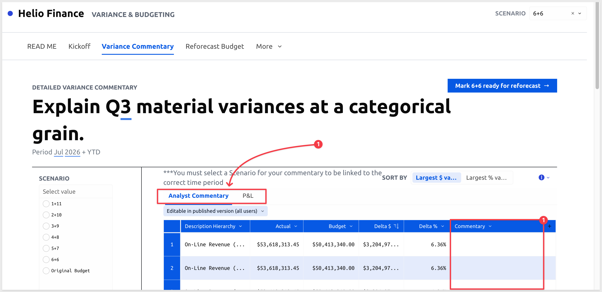

### Selecting a Scenario

Before we go further, set the workbook to use `Published` mode:

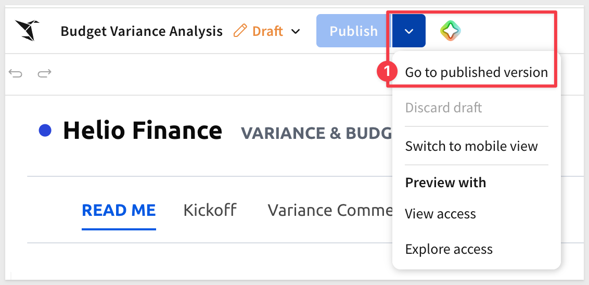

The `SCENARIO` radio buttons on the left panel link your commentary to a specific planning cycle. Selecting a scenario here also sets it as the **Active Scenario** on the Reforecast Budget page — so whatever scenario you choose on this page carries forward into the forecast and approval steps automatically.

Select `6+6` to follow the example:

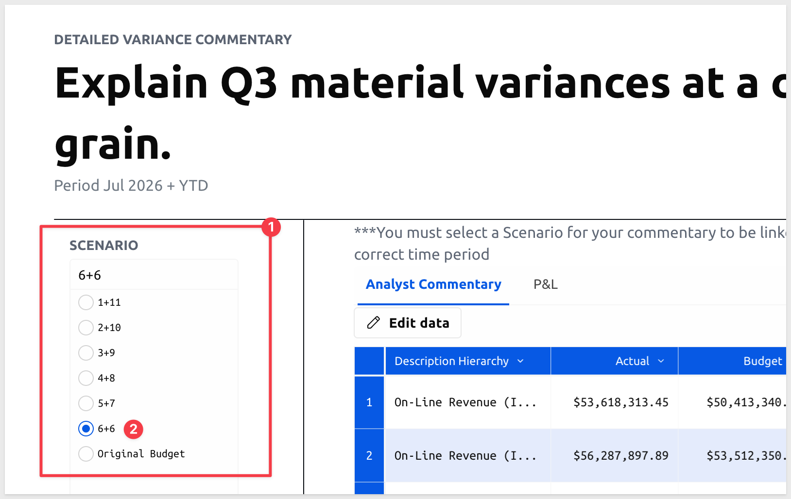

<aside class="negative">
<strong>IMPORTANT:</strong><br> Select a scenario before typing any commentary. Commentary entered without a scenario selected will not link correctly to the Reforecast Budget or Executive Signoff pages.
</aside>

### Filtering to the Biggest Variances

Scrolling down the page we can use `CATEGORY`, `SITE`, and `SORT BY` to narrow the table to the lines that need explanation. 

Start with `Largest $ variance` to surface the biggest dollar misses first:

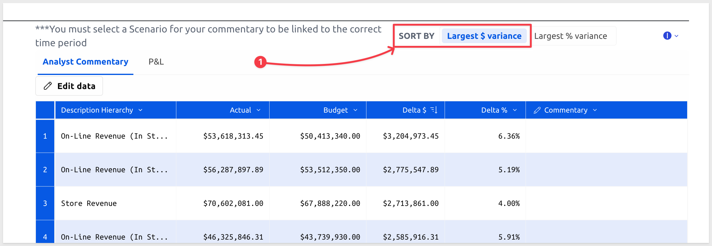

For this example, check `Travel and Entertainment` in the `CATEGORY` filter.

The table updates to show all account-level rows within `Travel and Entertainment`, sorted by largest dollar variance. 

Airfare shows the largest overage — approximately $1,359,206 actual against a $1,241,450 budget, a difference of roughly $117,756 at 9.49%:

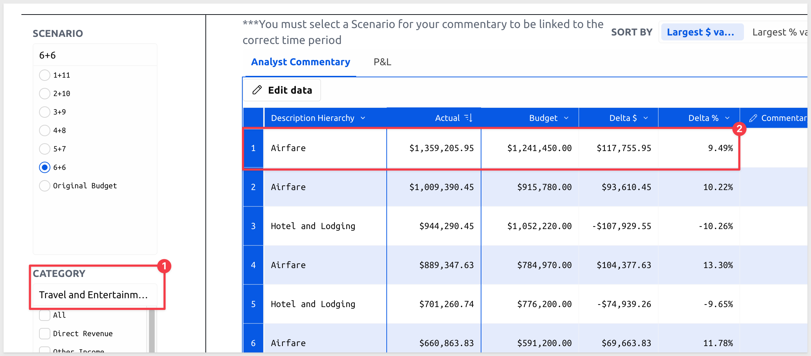

### Adding Commentary

Click any cell in the `Commentary` column and type your explanation directly into the row. For the Airfare overage:

```copy-code
Airfare spend exceeded budget by approximately 9.5% through the first half of the year, driven by expanded field sales headcount and increased client visit frequency. Elevated spend is expected to continue through year-end as the team reaches full quota capacity.
```

Click `Save`:

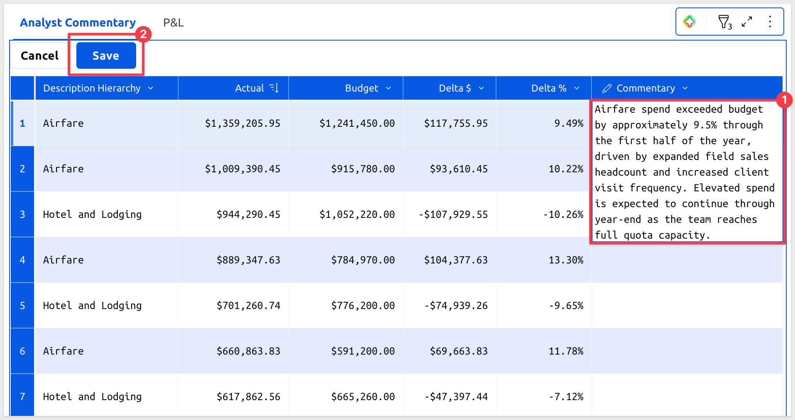 

Repeat for any other lines that need explanation — `Hotel and Lodging` shows a favorable variance (under budget) that may also warrant a note.

Once commentary is complete for the period, click the `Mark 6+6 ready for reforecast →` button. This signals to the manager that the commentary step is done and the `6+6` scenario is ready for forecast adjustments:

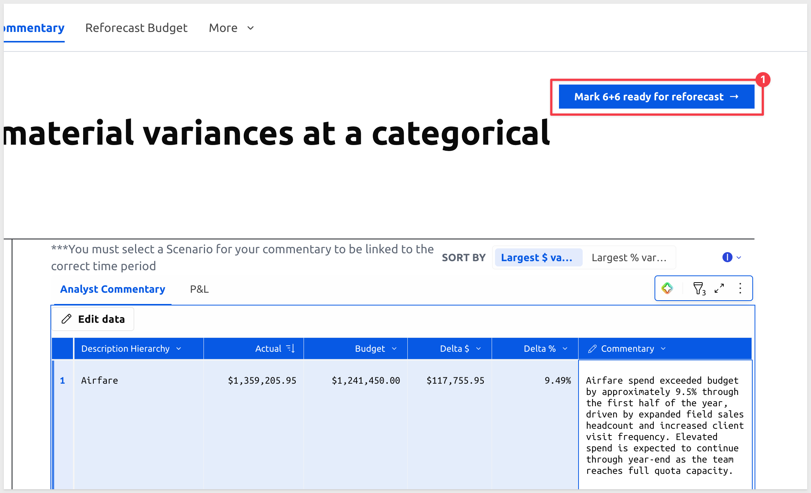 

A message appears confirming the update:

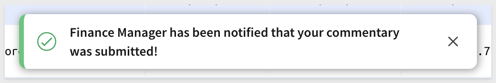 

<aside class="positive">
<strong>MULTI-USER WORKFLOW:</strong><br> The Budget Variance Analysis app is designed for multiple roles working in sequence:
<ul>
  <li><strong>Analyst</strong> — documents variances on the Variance Commentary page and marks the scenario ready for reforecast.</li>
  <li><strong>Manager</strong> — opens the Reforecast Budget page, sees <code>6+6</code> as the active scenario, and applies forecast adjustments.</li>
  <li><strong>Executive</strong> — reviews the submitted scenario on the Executive Signoff page and formally approves it.</li>
</ul>
Each role works on a different page — no coordination outside the app is required.
</aside>

**WHY IT MATTERS:**<br>
Commentary isn't a side document — it's embedded in the data and travels with the scenario through every downstream step. When the executive opens the Signoff page, the Airfare explanation appears inline next to the delta figures. Finance teams replace the email chain and the deck with a single annotated view that all stakeholders read from the same source.


<!-- END OF SECTION-->

## Building the Reforecast
Duration: 10

The Reforecast Budget page is where managers revise the forecast for the remaining months of the fiscal year. Because you selected `6+6` on the Variance Commentary page, it is already set as the Active Scenario here — no additional selection is needed:

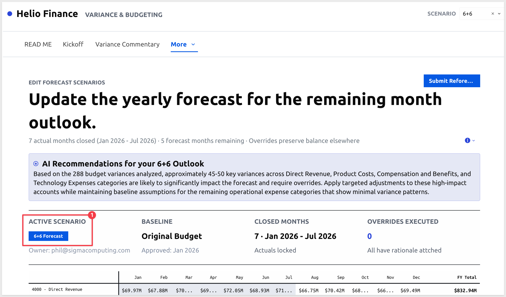

### AI Recommendations

At the top of the page, an AI recommendation summarizes which accounts are most likely to carry variance forward and which should remain on baseline. For `6+6`, the model has analyzed the six months of closed actuals and the commentary entered in the prior step:

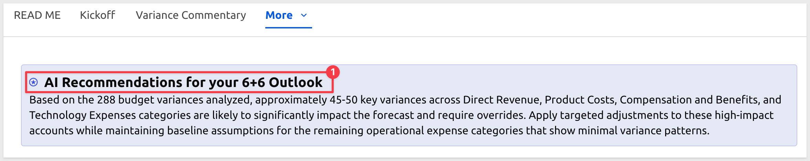

<aside class="positive">
<strong>NOTE:</strong><br> The AI recommendation is a starting point. Use it alongside your commentary and judgment to decide which accounts need adjustment.
</aside>

### Scenario Status Bar

Below the recommendation, the status bar shows four metrics for the active scenario:

- **Baseline** — the original approved budget, locked as the comparison reference
- **Closed Months** — the number of actual months locked (Jan through June for `6+6`)
- **Overrides Executed** — count of budget lines adjusted so far; starts at zero

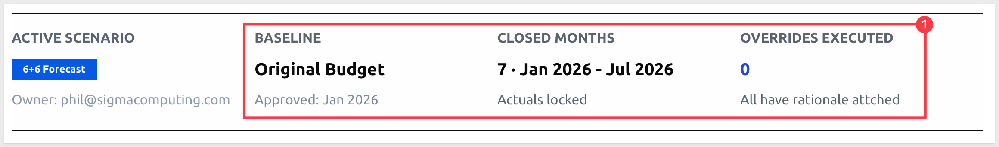

### Adjusting the Forecast

The pivot table shows P&L categories as rows and months as columns. **Grey cells** are closed actuals — locked, not editable. **White cells** are open forecast months. **Blue cells** have an override applied.

Click any white cell to open the **Edit Budget Modal**:

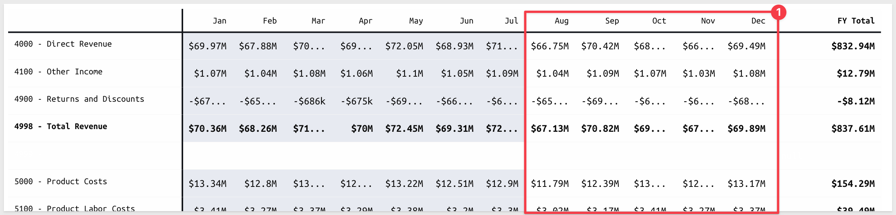

The modal shows:
- The **AI recommendation** for the scenario
- **Baseline KPI** and **New Forecast KPI** — the before and after for that row
- **Actuals Trend Chart** — the closed-month trend to inform the adjustment
- **Override Delta** — quick-select buttons (`-25k`, `-10k`, `0`, `+10k`, `+25k`) or type a custom value (signed)
- **Rationale** — required before `Apply Override` activates

For Travel and Entertainment: click any open `6300 - Travel and Entertainment` cell, select `+25k` to reflect the elevated spend trend, and enter a rationale:

```copy-code
T&E running 11-12% above budget on elevated airfare spend. Applying +$25K/month for remaining 6 months based on current headcount and planned client visit schedule.
```

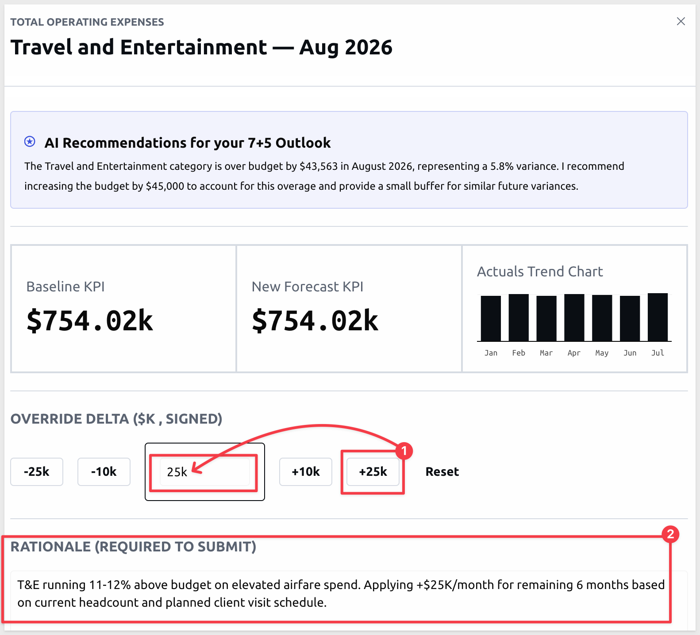

Scroll down and click `Apply Override` and close the modal.

The `Travel and Entertainment` cells for the remaining forecast months turn blue in the pivot:

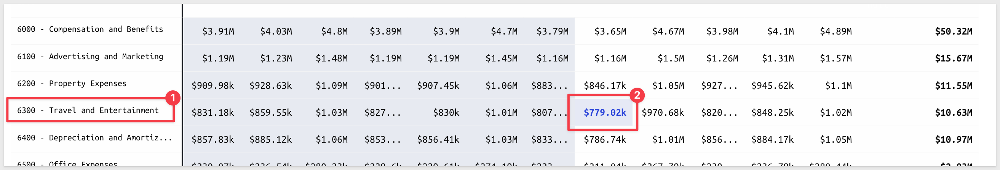

The `Overrides Executed` count is incremented:

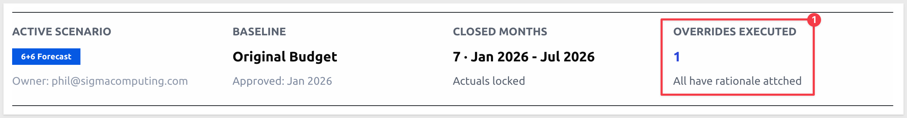

Repeat for any other accounts where the AI recommendation or your analysis suggests adjustment.

When all overrides are in place, click `Submit Reforecast`.:

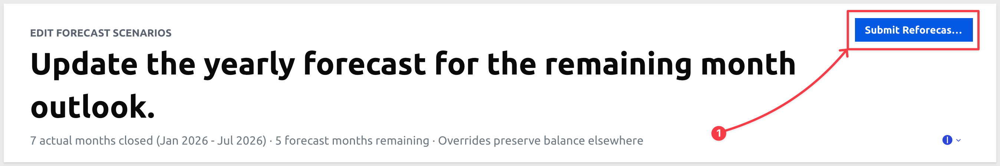

The `6+6` scenario moves to Executive Signoff with a status of `Pending`.

**WHY IT MATTERS:**<br>
Every adjustment requires a rationale before it can be applied — the modal enforces this. The result is a complete, timestamped audit trail of every forecast change, linked to the scenario and visible to anyone who opens the workbook. There is no separate log to maintain.


<!-- END OF SECTION-->

## Executive Signoff
Duration: 5

Once submitted, the `6+6` scenario appears on the Executive Signoff page with a status of `Pending`. This page is intended for authorized reviewers — executives or budget owners who have the authority to approve the reforecast as the official plan.

<!--  -->

### Reviewing the Submission

The page header identifies the scenario (`6+6`), who submitted it, and the submission timestamp — providing full visibility into the approval pipeline before any decision is made.

Below the header, a full-year pivot compares the reforecast against the original budget across all P&L categories on a YTD basis:

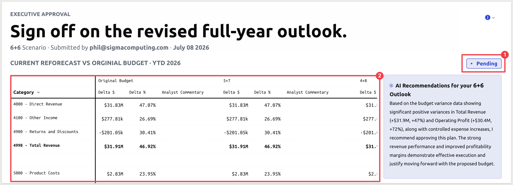

The analyst commentary entered on the `Variance Commentary` page appears inline in the pivot alongside the delta figures:

If multiple scenarios have been submitted, they appear as side-by-side columns in the pivot, allowing the executive to compare approaches before committing to one.

### AI Approval Recommendation

Alongside the pivot, Sigma generates a recommendation framed from the executive's perspective. The model reviews the delta $ and delta % figures and the analyst commentary across the full scenario, then returns a 1–2 sentence read on whether the plan is adequately supported:

<!-- 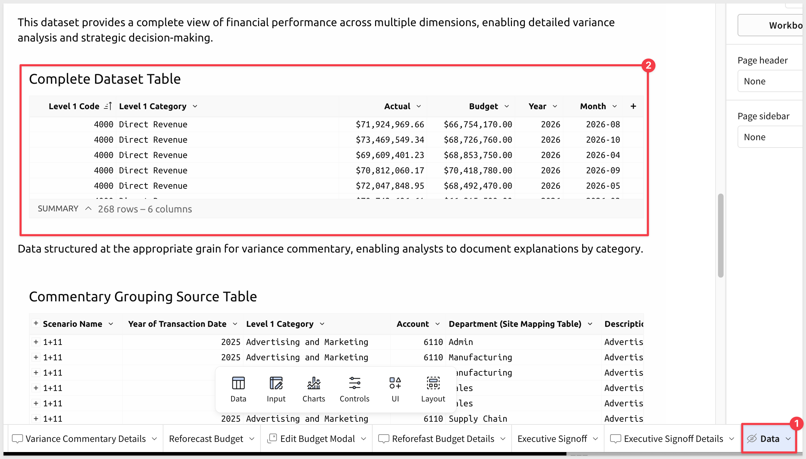 -->

The recommendation surfaces the key factors worth weighing — it doesn't make the decision.

### Signing Off

The sign-off panel on the right shows the current scenario status and an optional `Executive Note` text area. Add a note if warranted:

```copy-code
T&E trend confirmed by field team expansion. Approved with the expectation that H2 travel normalizes as onboarding completes.
```

Click `Sign Off` to officially approve the `6+6` scenario. It is designated as the current baseline moving forward. The planning cycle closes, and the next period begins.


<!-- END OF SECTION-->

## Under the Hood
Duration: 10

Understanding the data architecture helps you adapt the app to your own data or apply its patterns to other workbooks.

### Data Sources

The app connects to two warehouse tables in Snowflake's sample `PLUGS_ELECTRONICS_FINANCIALS` schema:

- **`COMPLETE_FINANCIALS`** — transaction-level financial data with a `Scenario` column that distinguishes `Actual` from `Budget` rows. This is the primary source for all variance calculations.
- **`ACCOUNT_HIERARCHY`** — account codes, Level 1 categories (e.g., Direct Revenue, Compensation and Benefits), and P&L section groupings (Revenue, Cost of Goods Sold, Operating Expenses).

Three additional input tables extend the warehouse data:

- **`Site Mapping Table`** — maps product area or location values from the warehouse to departments, sites, and countries for geographic filtering
- **`Custom Account Hierarchy Rows Table`** — lets you define additional account category codes not present in the warehouse hierarchy
- **`Submitted Scenarios Table`** — tracks every named scenario with its status, owner, and executive notes

### The Data Pipeline

The app uses Sigma's transpose feature to calculate financial statement subtotals (Gross Profit, Operating Profit) that don't exist as individual rows in the warehouse:

<!--  -->

1. **Group by Section** — transactions are grouped by P&L section (Revenue, Cost of Goods Sold, Operating Expenses) and time period, summing Actual and Budget separately.
2. **Row-to-column transpose** — the three sections become column values, enabling calculated fields: `Gross Profit = Revenue - COGS`, `Operating Profit = Gross Profit - Operating Expenses`.
3. **Column-to-row transpose** — the calculated subtotals are converted back to rows and unioned with the detail-level account data to form a single financial statement source.

This pipeline runs for both actuals and budget amounts in parallel, then the two are unioned into `Complete Dataset Table` — the final source for all pivot tables in the app.

### The Scenario and Override Architecture

Each named scenario is created by adding a row to `Submitted Scenarios Table`. The app then cross-joins that scenario against every row of `Complete Dataset Table`, creating a full copy of the budget data for each scenario in `Base Data for Pivot Overrides Table`.

`Base Data for Pivot Overrides Table` is a linked input table — it inherits all warehouse rows and adds three editable columns:

| Column | Type | Purpose |
|--------|------|---------|
| Adjustment | Number | Dollar change to the budget for this cell |
| Adjustment Reason | Text | Required rationale for the override |
| Override? | Checkbox | Marks the row as intentionally adjusted |

The effective budget for each cell is `Base Budget + Adjustment` (falling back to `Base Budget` when no override exists). The pivot tables on the Reforecast Budget and Executive Signoff pages read from this table, so every override is reflected immediately.

### Inline AI

The AI recommendations on the Reforecast Budget and Executive Signoff pages use Sigma's `CallText` function to call an AI model inline — no external service or separate integration required:

```copy-code
CallText("ai_complete", "claude-4-sonnet", "[system prompt] + scenario data")
```

The function assembles the prompt from live workbook values — category names, actuals, budgeted amounts, and analyst commentary — and returns a recommendation directly into a text element on the page. The AI runs within Sigma's governed environment, subject to your organization's AI configuration and audit logging.

**WHY IT MATTERS:**
`CallText` brings AI analysis to the point of decision without requiring a separate tool or export step. The recommendation is generated from the same data the analyst and executive are already looking at — and it's governed by the same permissions, audit logs, and access controls that apply to the rest of the workbook.


<!-- END OF SECTION-->

## Connect Your Own Data
Duration: 10

The app ships connected to Plugs Electronics sample data. Connecting it to your own financial data requires pointing the warehouse sources to your tables and configuring the supporting input tables to match your account structure.

### Warehouse Table Requirements

The app expects two warehouse tables. Your data should conform to the following schema or be transformed to match it:

**Financial transactions table** (replaces `COMPLETE_FINANCIALS`):

| Column | Type | Description |
|--------|------|-------------|
| Account | Text | Account code |
| Description Account Hierarchy | Text | Account description |
| Transaction Date | Date | Transaction date |
| Scenario | Text | `"Actual"` or `"Budget"` — used to split actuals from budget |
| Amount | Number | Transaction amount |
| Product Area | Text | Location or business unit identifier |
| Region | Text | Geographic region |
| Department | Text | Department name |

**Account hierarchy table** (replaces `ACCOUNT_HIERARCHY`):

| Column | Type | Description |
|--------|------|-------------|
| Account | Text | Account code (joins to financial transactions) |
| Level 1 Code | Number | Numeric P&L category code |
| Level 1 Category | Text | Category name (e.g., `"Direct Revenue"`, `"Compensation and Benefits"`) |
| Section | Text | P&L section: `"Revenue"`, `"Cost of Goods Sold"`, or `"Operating Expenses"` |

### Reconnecting the Sources

In the workbook's `Data` page (switch to edit mode and unhide it), locate `Complete Financials Table` and `Account Hierarchy Table`. Use the element panel to reconnect each to your warehouse tables.

<aside class="positive">
<strong>NOTE:</strong><br> The app applies a one-year date shift (<code>DateAdd("year", 1, ...)</code>) to the sample data to keep it current. Remove this shift when connecting to live data that is already in the correct year.
</aside>

### Configuring the Input Tables

After reconnecting the warehouse sources, configure the three supporting input tables on the `Data` page:

**Site Mapping Table** — populate with your organization's location-to-department mappings. Each row maps a `Product Area` value from the financial table to a `Department`, `Site`, and `Country`.

**Custom Account Hierarchy Rows Table** — if your chart of accounts includes subtotal rows that aren't in the warehouse (e.g., a custom `"Total Gross Profit"` row), add them here with their Level 1 Code and Section. The app uses these to insert spacing and subtotal rows into the financial statement view.

**Submitted Scenarios Table** — the template ships with six pre-built scenarios (`1+11` through `6+6`) plus `Original Budget`. When connecting to your own data, replace these with scenario names that match your organization's planning cadence. The scenario name selected on the Variance Commentary page becomes the Active Scenario on the Reforecast Budget page, so names should be meaningful to analysts and executives alike.

### Validating the Connection

After reconnecting, open the `Kickoff` page in view mode. If the headline metric and period cards show numbers, the data pipeline is working. If they show errors or blanks, check that the `Scenario` column in your financial table uses the exact values `"Actual"` and `"Budget"` — the `SumIf` formulas throughout the app depend on this exact match.


<!-- END OF SECTION-->

## What We've Covered
Duration: 3

<!-- Write last, after all technical sections are reviewed and finalized -->


<!-- END OF SECTION-->
