author: pballai
id: starter_apps_demand_planning
summary: Explore Sigma's Demand Planning Starter App — a ready-to-use operations app for building demand forecasts by product and time period, resolving outliers, and publishing approved plans to downstream stakeholders.
categories: starterapps
environments: web
status: Hidden
feedback link: https://github.com/sigmacomputing/sigmaquickstarts/issues
tags: 
lastUpdated: 2026-07-09

# Demand Planning Starter App

## Overview
Duration: 5

Sigma's **Starter Apps** are ready-to-use applications built on Sigma's native features and connected to sample data. Each one ships fully functional — you can explore it immediately, learn how it's built by switching to edit mode, and adapt it to your own data and workflows without starting from scratch.

The **Demand Planning** app gives supply chain and operations teams a single workspace to create demand forecasts, incorporate planner assumptions, resolve statistical outliers, and publish approved plans to stores or downstream systems — all against live data. A moving average baseline is generated automatically, and AI surfaces cycle health, exception rationale, and operational impact at each stage of the workflow.

This QuickStart walks through how the app works as a user, how it's designed under the hood, and how to connect it to your own data.

### Target Audience
Supply chain, operations, and planning teams evaluating or adopting Sigma for demand and inventory planning workflows. Solutions Engineers and technical stakeholders exploring the app as a reference design.

### Prerequisites

<ul>
  <li>Access to a Sigma environment.</li>
  <li>The Demand Planning Starter App available in your org — find it under <code>Templates</code> > <code>Starter Apps</code>.</li>
  <li><strong>Write access enabled on a connection</strong> — required for input tables to store planning data. See <a href="https://help.sigmacomputing.com/docs/set-up-write-access">Set up write access</a></li>
  <li><strong>AI provider configured for your organization</strong> — required for AI cycle insights, outlier rationale, and operational impact summaries. See <a href="https://help.sigmacomputing.com/docs/configure-ai-features-for-your-organization">Configure AI features for your organization</a></li>
  <li>Some familiarity with Sigma workbooks is helpful but not required.</li>
</ul>

<aside class="positive">
<strong>NOTE:</strong><br> If you don't see Starter Apps in your Templates section, contact your Sigma administrator to confirm availability in your org.
</aside>

### What You'll Learn
- How the Demand Planning app works across its four-stage planning workflow
- The key design patterns behind the app and why they're built that way
- How to connect the app to your own warehouse data


<!-- END OF SECTION-->

## Exploring the App
Duration: 10

### Open and Save the Template

Navigate to `Templates` in the left sidebar. The Demand Planning app appears in the `Made by Sigma` collection:

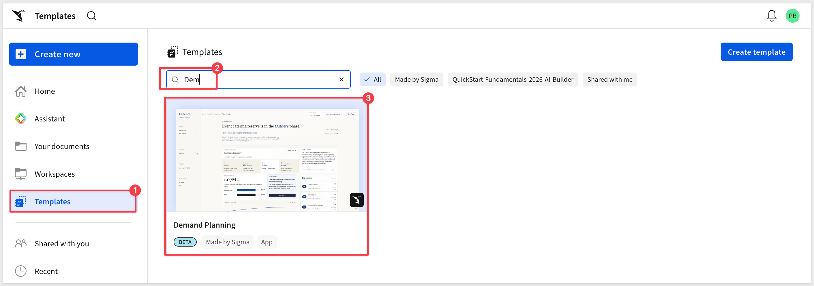

Click the template card to open a preview. Before clicking `Use template`, confirm both requirements shown on the detail page are met:

- **Write access enabled on a connection** — required for input tables to store planning data. See [Set up write access](https://help.sigmacomputing.com/docs/set-up-write-access)
- **AI provider set up in your organization** — required for AI summaries. See [Configure AI features for your organization](https://help.sigmacomputing.com/docs/configure-ai-features-for-your-organization)

Once both are in place, click `Use template`. Sigma creates a personal copy in your workspace that you can explore, edit, and connect to your own data without affecting the original template:

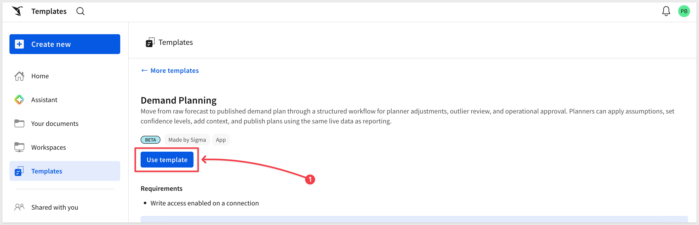

Click `Save as` and give the workbook a name:
```copy-code
Demand Planning
```

<aside class="positive">
<strong>NOTE:</strong><br> The original template remains unchanged in the gallery — your saved copy is the working version.
</aside>

### README Page

The app opens on its **README** page, which describes the purpose of each page and the five-step workflow at a glance. A short demo video walks through the core planning cycle. The README is worth reading before diving in — it describes what each page does and the order to follow:

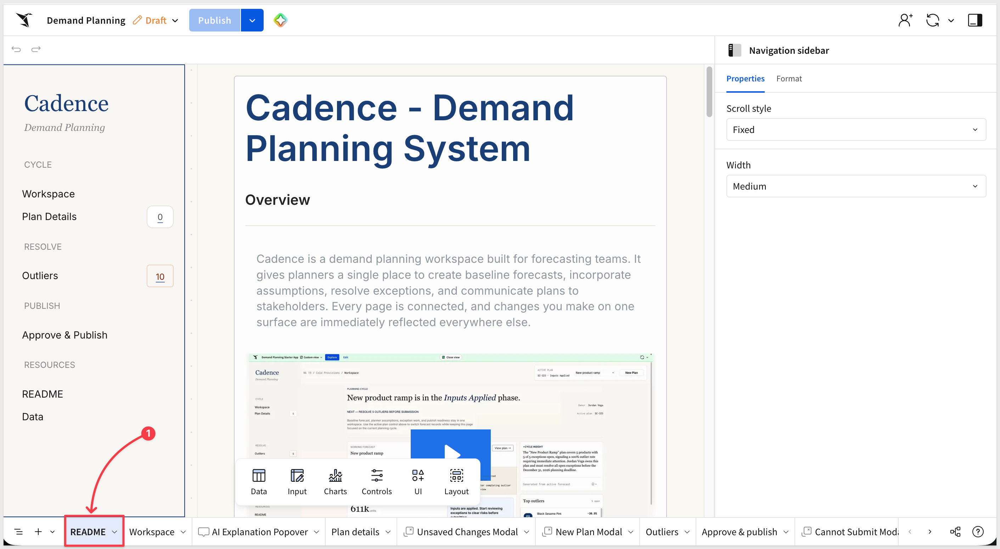

<aside class="negative">
<strong>NOTE:</strong><br> The README is visible to all users of the app. If you adapt this template for your org, update it to reflect your actual product catalog, planning cadence, and any changes to the default data source.
</aside>

### Workspace Page

The **Workspace** page is the app's front door for each planning cycle. It shows the active forecast at a glance — current stage, open exception count, forecast unit total, and an AI-generated cycle insight summarizing plan health and next action:

<!-- 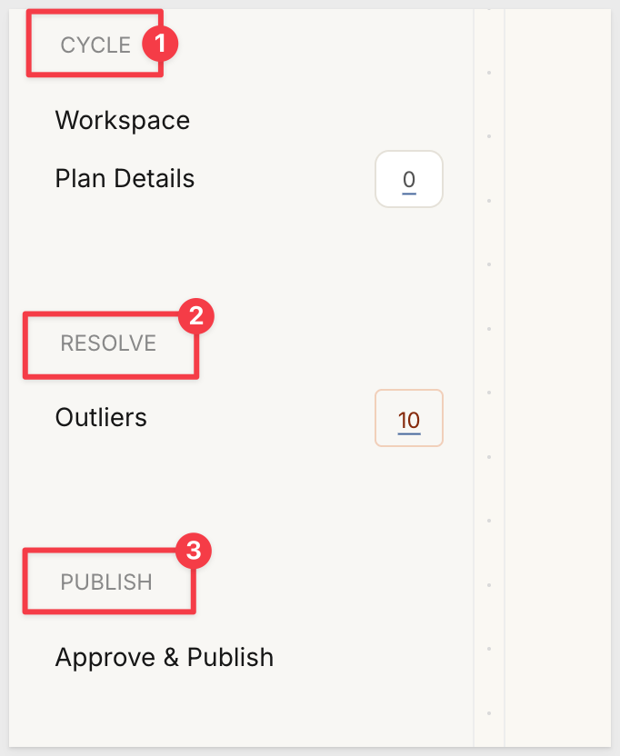 -->

The four-stage progress tracker shows where the active plan stands: **Baseline → Planner inputs → Outliers → Submit**. Each badge updates automatically as the plan moves through the workflow.

Below the tracker, two KPI tiles show total forecast units:

- **Moving Avg** — the system-generated baseline total across the plan horizon
- **Plan** — the working total after any planner cell overrides are applied

<!-- 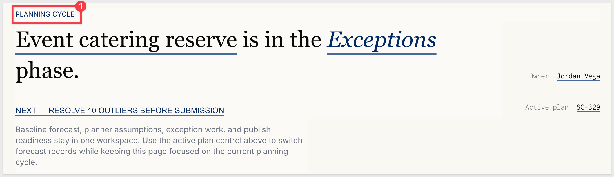 -->

A line chart plots both series by month, making it easy to see where plan and baseline diverge across the forecast window.

The **Cycle Insight** panel generates a two-sentence AI summary of the active plan: how many products it covers, open exceptions out of total, the immediate next action based on current status, and the planning deadline. The prompt driving this summary is editable — covered in the **Under the Hood** section.

At the bottom, a **Top Outliers** list shows the highest-variance exceptions for the active plan, with product name, exception type, and percent deviation from the moving average baseline:

<!-- 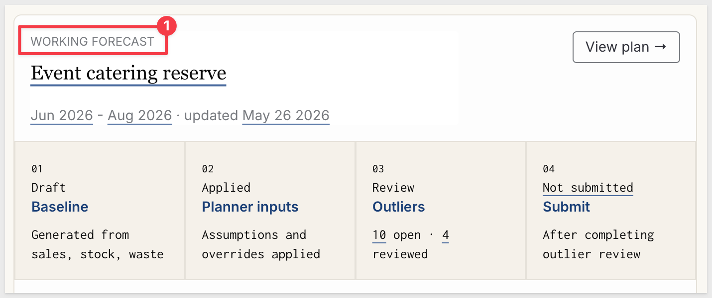 -->


<!-- END OF SECTION-->

## The Planning Workflow
Duration: 15

The app follows a four-stage workflow. The `Workspace` page tracks the active plan's stage at all times; each of the remaining three pages corresponds to one stage. Before creating a new plan, place the workbook in `Published` mode using the toggle in the header.

### Stage 1: Create a Plan

Creating a plan starts on the **Data** page. Navigate to `Data` and locate the **Forecast Scenarios** input table. Add a new row with:

- `Scenario Id` — a unique identifier for this plan (e.g., `SCN-2026-Q3`)
- `Scenario Name` — a descriptive label for this planning cycle
- `Owner` — the planner responsible
- `Start` and `End` — the forecast horizon (month-level dates)
- `Selected Products` — the product IDs to include in this plan

<!-- 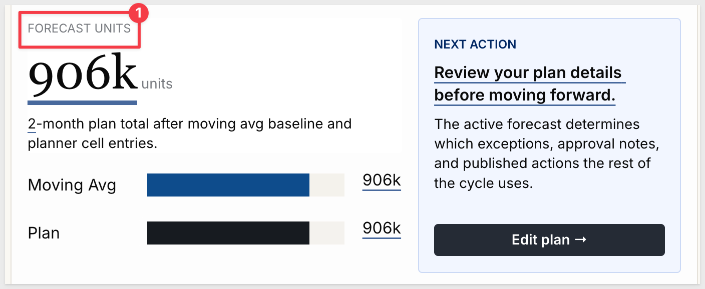 -->

Once saved, the scenario appears immediately in the active plan selector on the `Workspace` page. Select it to make it the active forecast for all pages.

<aside class="positive">
<strong>NOTE:</strong><br> The active plan selector drives the entire workspace — switching it changes which scenario's exceptions, pivot data, and AI summaries are displayed across all pages. Multiple planners can work against separate scenarios simultaneously without affecting each other.
</aside>

### Stage 2: Plan Details

Navigate to the **Plan Details** page. This is where you review the baseline and apply planner assumptions.

The **Scenario Record and Scope** panel lets you edit the plan's name, owner, start and end dates, and product selection directly from this page:

<!-- 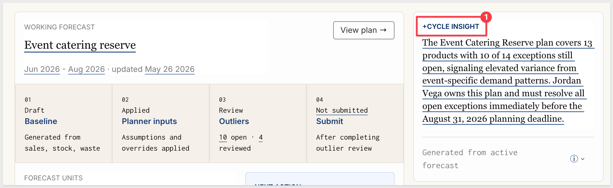 -->

The **Pivot Planning Table** shows forecast units by product (rows) and month (columns). Each cell reflects the effective plan value — either the moving average baseline or a planner override if one has been entered. Three totals above the pivot show the current state:

- **Baseline** — total moving average units across all products and months
- **Working** — total plan units after any overrides
- **Δ vs Baseline** — percent difference between working and baseline

<!-- 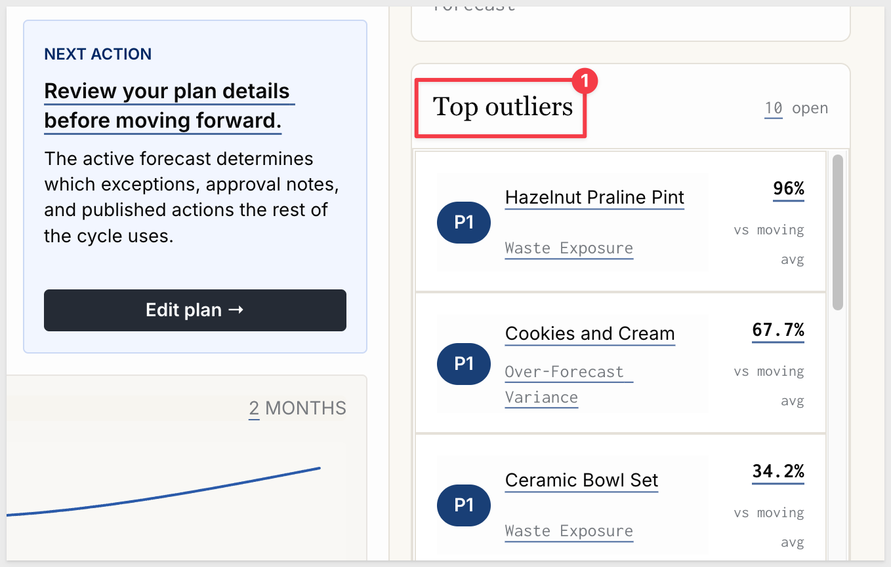 -->

To apply a planner assumption, click any cell in the pivot table. Enter a new unit value, add a confidence level and rationale note, then save. Cells with a planner override are highlighted in blue; values more than 10% above the moving average appear in green, more than 10% below in red:

<!-- 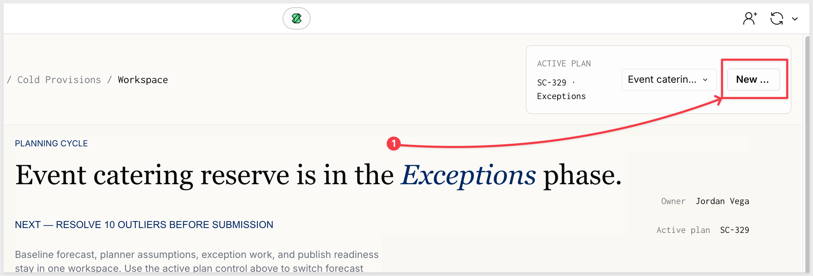 -->

<aside class="negative">
<strong>NOTE:</strong><br> Once a plan is submitted in Stage 4, the pivot table is locked. Editing a submitted plan reopens it as a draft and resets it to Stage 2.
</aside>

### Stage 3: Resolve Outliers

Navigate to the **Outliers** page. This is where you work through flagged product-month combinations before the plan can be submitted.

The outlier queue on the left lists all exceptions for the active plan, filterable by exception type. Each row shows the product name, exception type, and percent deviation from the moving average. The queue counts open and resolved items at the top:

<!-- 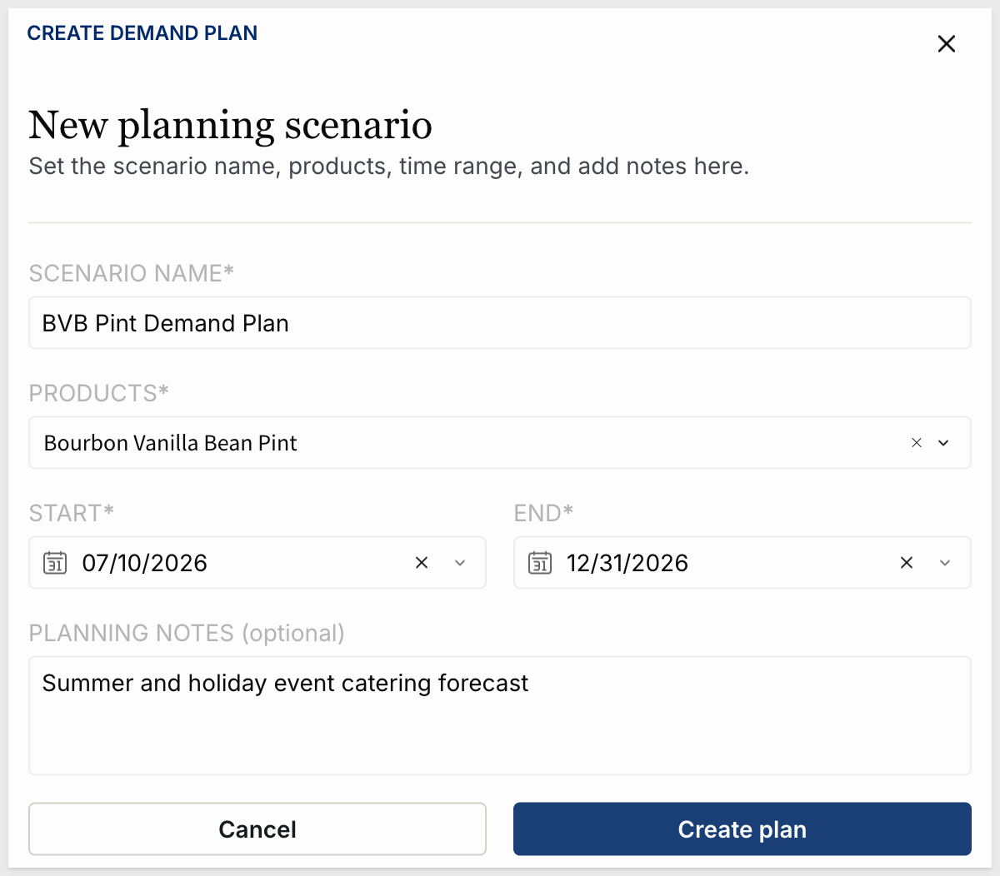 -->

Select any outlier to open its detail panel. The panel shows product name, exception ID, baseline units vs working units, percent deviation, and an AI-generated **System Rationale** explaining the specific cause:

<!-- 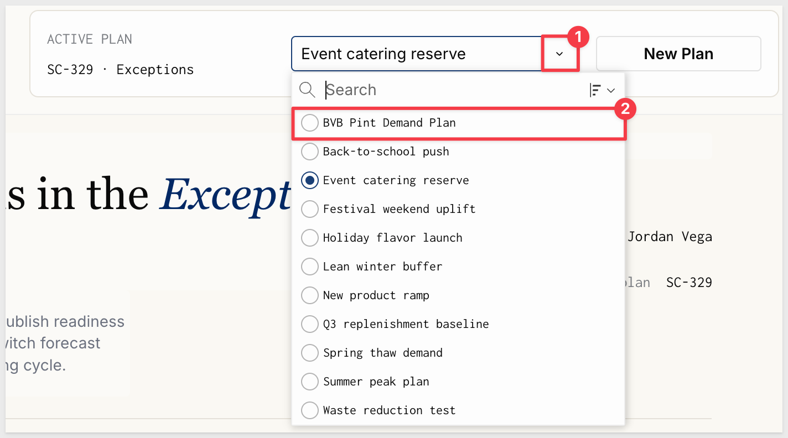 -->

**WHY IT MATTERS:**
The System Rationale is scoped deliberately — it describes the cause using only the data it's given, without inventing context. Planners get a consistent, data-grounded explanation for every exception without manually cross-referencing the source table.

Each outlier offers three resolution options:

- **Snap to moving average** — accepts the baseline value and closes the exception
- **Manual override** — enter a specific unit value with a rationale note
- **Accept variance** — keeps the current working value and documents the accepted risk

<!-- 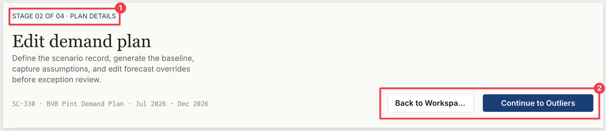 -->

All outliers must be resolved before the plan can advance to Stage 4. The Workspace page and Approve & Publish page both display the open exception count as a gate check.

### Stage 4: Approve and Publish

Navigate to the **Approve & Publish** page. This is the operations review before the plan is locked and published downstream.

The page shows a **Plan vs Moving Average Summary** with four KPIs: Moving Avg Total, Plan Total, Delta Units, and Delta Percent:

<!-- 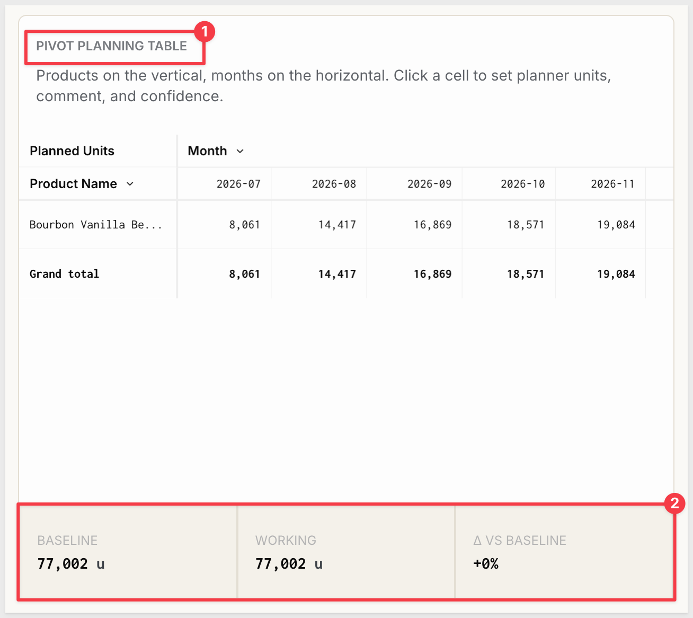 -->

An AI-generated **Operational Impact** summary appears alongside the KPIs. It delivers a two-sentence assessment: plan name, volume vs baseline, and a clear approve/reject/revise recommendation with the key reason. The prompt is editable from the Data page.

The **Outlier Review** panel confirms exception status — all items should show as resolved before approving:

<!-- 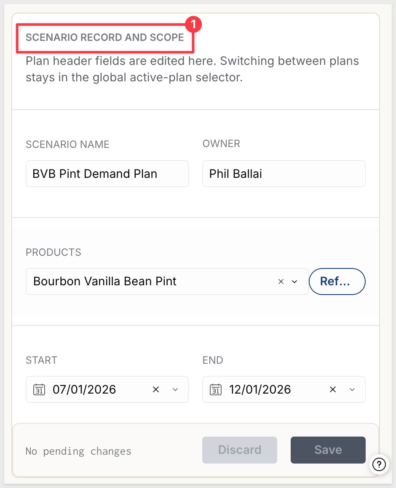 -->

Add **Approval Notes** in the text field, then publish the plan. Once published, the plan is locked and the action list is available for downstream handoff — store operators receive the replenishment or production actions generated from the approved forecast.

<!-- 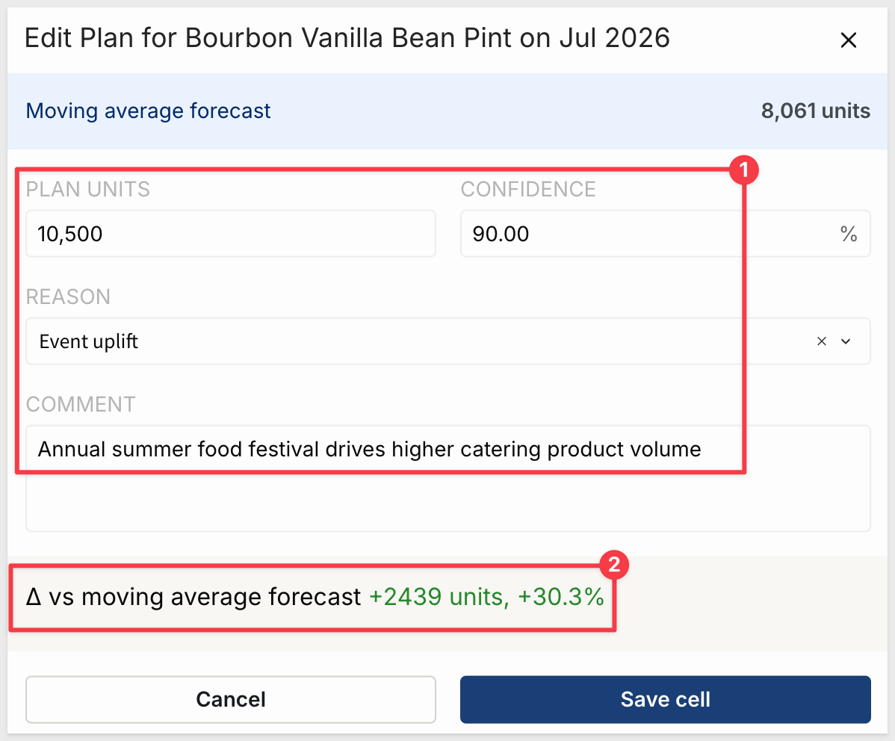 -->


<!-- END OF SECTION-->

## Under the Hood
Duration: 10

The **Data** page contains every backend table that powers the app. Each table is labeled with a description of its purpose. Here's how the pieces fit together.

### The Data Sources

The app draws from two warehouse tables:

- **PRODUCTS** — the product catalog with three columns: `Product Id`, `Product Name`, and `Product Line`. This is the dimension table used to resolve product names throughout the app.
- **ORDER_LINES** — historical order line transactions, aggregated at the workbook level to the `Product Id × Month` grain. Two key calculated columns:
  - `Units` — `Sum([Units Consumed])` — total units sold per product per month
  - `MovingAvg of Units` — `MovingAvg([Units], 2, 2)` — a 2-period moving average with a 2-period lag

<!-- 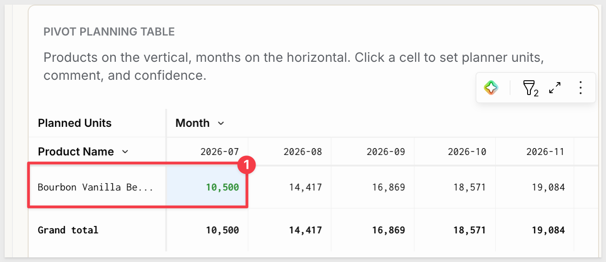 -->

The 2-period lag is intentional: it ensures the moving average reflects completed periods rather than the current in-progress month, which would otherwise pull the baseline toward incomplete data.

These are the two tables you replace when connecting to your own data. See the **Connect Your Own Data** section for details.

### The Moving Average Fallback Chain

The `Forecasts` linked input table contains a `Units` column that resolves the baseline value for each product-month combination using a cascading `Coalesce` with year-over-year fallbacks:

```copy-code
Coalesce(
  [Moving Average Units],
  Lookup([Moving Average Units], [Product Id], [Product Id], DateAdd("year", -1, [Month of Date]), [Month of Date]),
  Lookup([Moving Average Units], [Product Id], [Product Id], DateAdd("year", -2, [Month of Date]), [Month of Date]),
  ... up to 5 years back ...,
  0
)
```

If the current period has a moving average from `ORDER_LINES`, it uses that. If not — for a new product or a future month with no history — it looks back one year, then two, up to five. If no match is found, it defaults to zero.

**WHY IT MATTERS:**
This pattern keeps the baseline populated for all product-month combinations regardless of data gaps or product age. A new SKU added to the plan mid-year picks up its year-ago baseline automatically rather than showing zero, giving planners a reasonable starting point without manual intervention.

### The Forecast Scaffold

The central structural pattern here is the same as in the Revenue Forecasting app: a **forecast scaffold** that generates the complete grid of input rows before any planner data is entered.

The scaffold is a derived table called `Date Spine and Forecast Scenarios and Orders Joined`, built from three sources:

1. **Date Spine** — an input table with one row per month from 2020 through 2035. This is the temporal backbone.
2. **Forecast Scenarios** — joined to the Date Spine on a date range condition so only months within a scenario's `Start`–`End` window are included.
3. **ORDER_LINES** — joined without a matching key, fanning out across every distinct `Product Id`.

That third join — no shared key, one side applied to every row of the date spine result — is a cross join. The result is exactly one row for every combination of scenario × product × forecast month:

<!-- 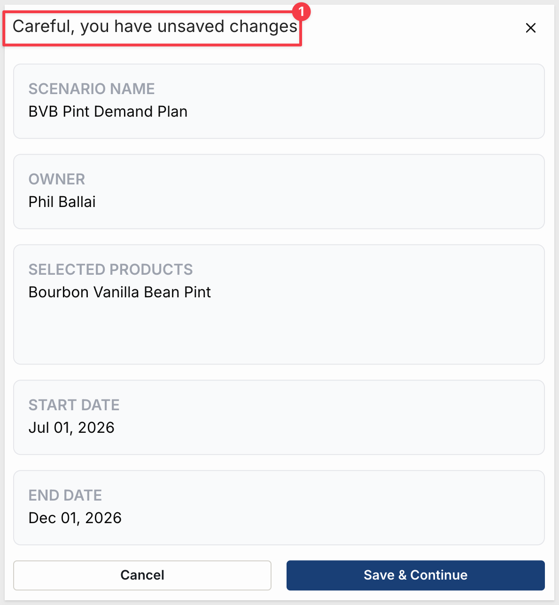 -->

**The Linked Input Table**

`Forecasts` is a linked input table that uses this scaffold as its row source. A linked input table can only write values into rows that already exist in its source — it cannot create new rows on its own.

When a planner enters a unit override for a specific product and month, that value is stored in `Units Override`. The `Overall` column resolves the effective plan value:

```copy-code
Coalesce([Units Override], [Units])
```

If a planner has entered a value, it wins. If not, the moving average baseline fills in automatically.

**WHY IT MATTERS:**
The scaffold eliminates the most common failure mode in demand planning input tables: missing product-month combinations. Every valid slot is pre-generated from the scenario's configuration, and the linked input table only accepts values into those pre-defined rows. Planners cannot accidentally skip a month or add a row for a product outside the plan's scope.

### Outlier Detection and Resolution

The `Outliers statuses input` table stores pre-populated exception records for each scenario. Each row represents one flagged product-month combination and carries:

- `EXCEPTION_TYPE` — the category of outlier (e.g., demand spike, stock risk)
- `PRIORITY` — P0 (high) or lower, used to sort the exception queue
- `BASELINE_UNITS` and `WORKING_UNITS` — the moving average value vs the current plan value
- `STATUS` — Open, Resolved, or Escalated
- `RESOLUTION_TYPE` — what action was taken (snap to moving average, manual override, accept variance)
- `ACCEPTED_RISK` — free-text rationale when the variance is accepted

The `Forecast Scenarios` input table derives its `Open Exceptions` and `Exception Count` values from this table via `Lookup(CountIf(...))`, making the exception gate on the Workspace and Approve & Publish pages dynamic without any additional queries.

### AI Prompts as Editable Controls

All three AI summaries in the app — Cycle Insight (Workspace), System Rationale (Outliers), and Operational Impact (Approve & Publish) — are driven by text-area controls stored on the Data page, not hardcoded into workbook elements:

<!-- 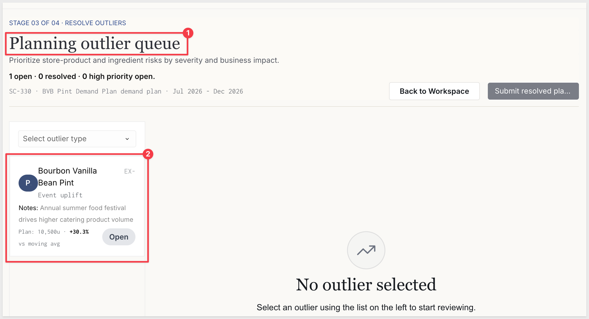 -->

The three prompts are:

- `AI Workspace Prompt` — drives the Workspace cycle insight (plan health, open exceptions, next action, deadline)
- `AI Exception Rationale Prompt` — drives the Outlier detail panel (two-sentence exception explanation, data-grounded, no invented context)
- `AI Operational Impact Prompt` — drives the Approve & Publish assessment (volume vs baseline, approve/reject recommendation)

**WHY IT MATTERS:**
Storing prompts as controls separates content from structure. Operations leads can tune what each AI summary says — adjusting focus, tone, or level of detail — without touching any formulas or workbook elements. The prompts are visible and auditable from a single page, which matters when AI output is part of an approval workflow.


<!-- END OF SECTION-->

## Connect Your Own Data
Duration: 5

The Demand Planning app is designed to work with any product-level sales or consumption dataset. The two source tables to replace are **PRODUCTS** and **ORDER_LINES** on the Data page.

### What the App Needs

**Products table:**

| Column | Description |
|--------|-------------|
| Product Id | A unique identifier for each product |
| Product Name | A display name resolved throughout the app |
| Product Line | A grouping dimension (used in the outlier detail panel) |

**Order Lines table (aggregated to Product × Month grain):**

| Column | Description |
|--------|-------------|
| Product Id | Matches the Products table |
| Month | A date truncated to month granularity |
| Units | A numeric measure of consumption or sales volume |
| MovingAvg of Units | `MovingAvg([Units], 2, 2)` — computed at the workbook level |

The raw transaction table can be at any grain — the workbook's grouping configuration handles the aggregation.

### How to Swap the Sources

On the `Data` page, open **PRODUCTS** in edit mode. Use `Change source` to point the table at your own connection and product dimension table. Map your columns to `Product Id`, `Product Name`, and `Product Line`.

Then open **ORDER_LINES** in edit mode. Use `Change source` to point it at your transaction table. Map your product ID, date, and units columns to the existing column references. The `MovingAvg` formula is applied at the workbook level and recalculates automatically once your `Units` column is mapped.

<!-- 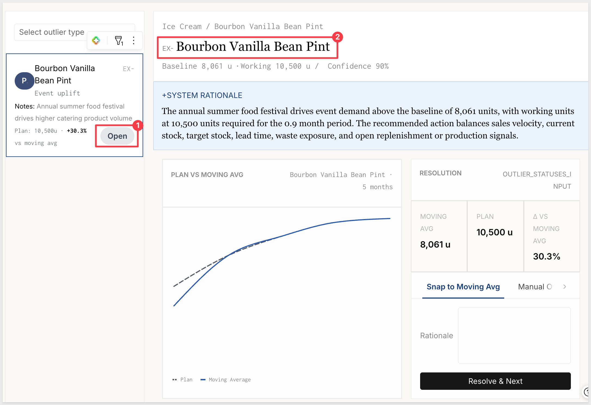 -->

<aside class="negative">
<strong>NOTE:</strong><br> The Date Spine, Forecast Scenarios, Forecasts, Outliers, and Store Actions input tables all use the same Snowflake connection as the sample data for write-back storage. If you're connecting to a different warehouse, update those input table sources as well to ensure plan data is written to the correct location.
</aside>

### What Carries Over Automatically

Once sources are swapped and columns are mapped correctly:

- The forecast scaffold re-generates using your product IDs and any scenario date ranges configured
- The moving average fallback chain resolves against your historical data automatically
- The pivot planning table shows your products and months without any formula changes
- The AI summaries continue to work without any changes to the prompts
- The outlier queue populates from whatever exception records exist in the Outliers input table

The main manual step after swapping sources is populating the Outliers table with exceptions from your data — either from an upstream detection process, or by using Sigma to flag outliers from live data and writing them back.


<!-- END OF SECTION-->

## What We've Covered
Duration: 5

<!-- [TODO: write after all sections are reviewed and complete] -->

**Additional Resource Links**

[Blog](https://www.sigmacomputing.com/blog/)<br>
[Community](https://community.sigmacomputing.com/)<br>
[Help Center](https://help.sigmacomputing.com/hc/en-us)<br>
[QuickStarts](https://quickstarts.sigmacomputing.com/)<br>

Be sure to check out all the latest developments at [Sigma's First Friday Feature page!](https://quickstarts.sigmacomputing.com/firstfridayfeatures/)
<br>

[](https://twitter.com/sigmacomputing)&emsp;
[](https://www.linkedin.com/company/sigmacomputing)&emsp;
[](https://www.facebook.com/sigmacomputing)


<!-- END OF WHAT WE COVERED -->
<!-- END OF QUICKSTART -->
