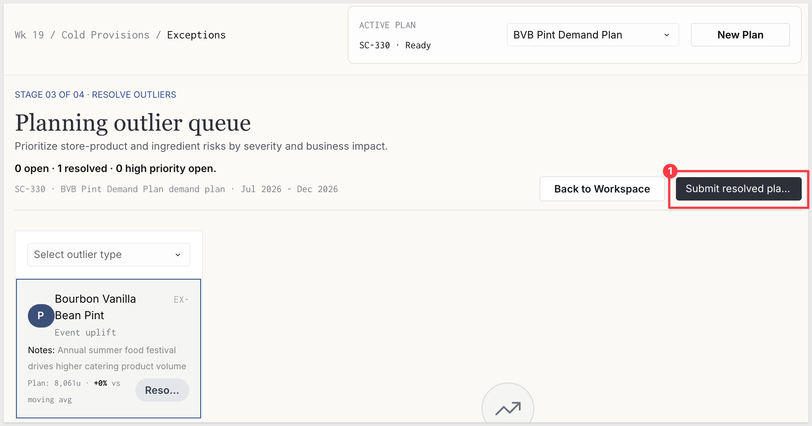
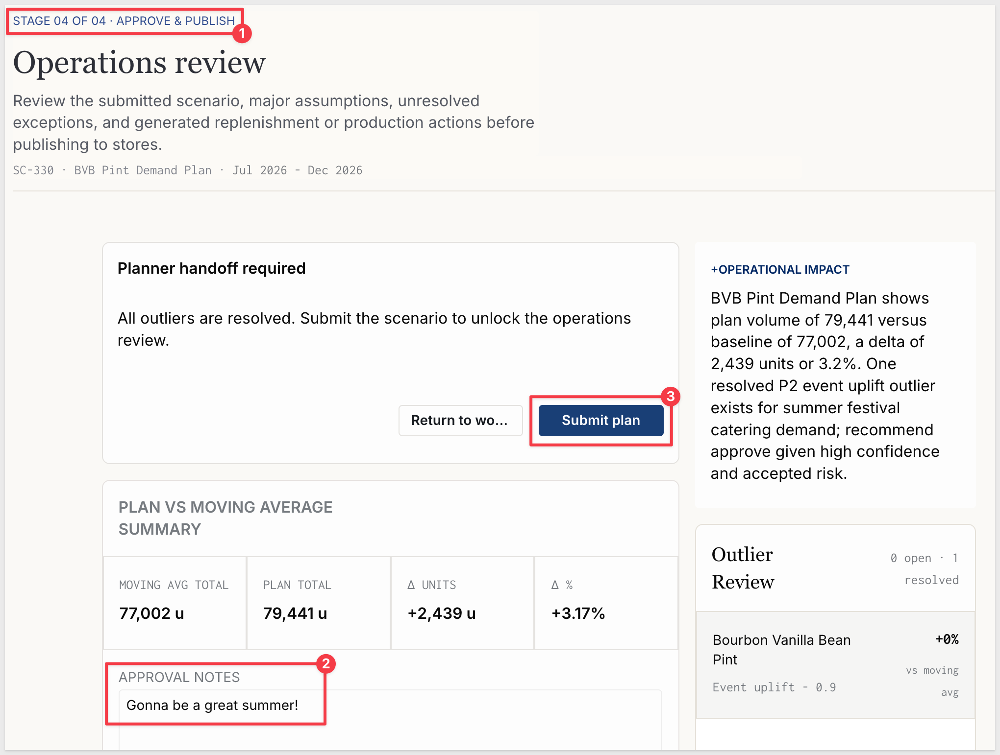
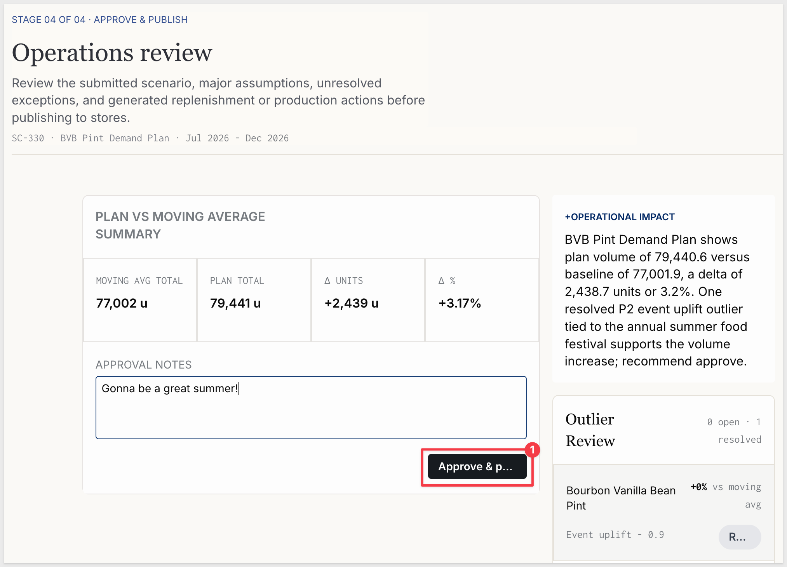
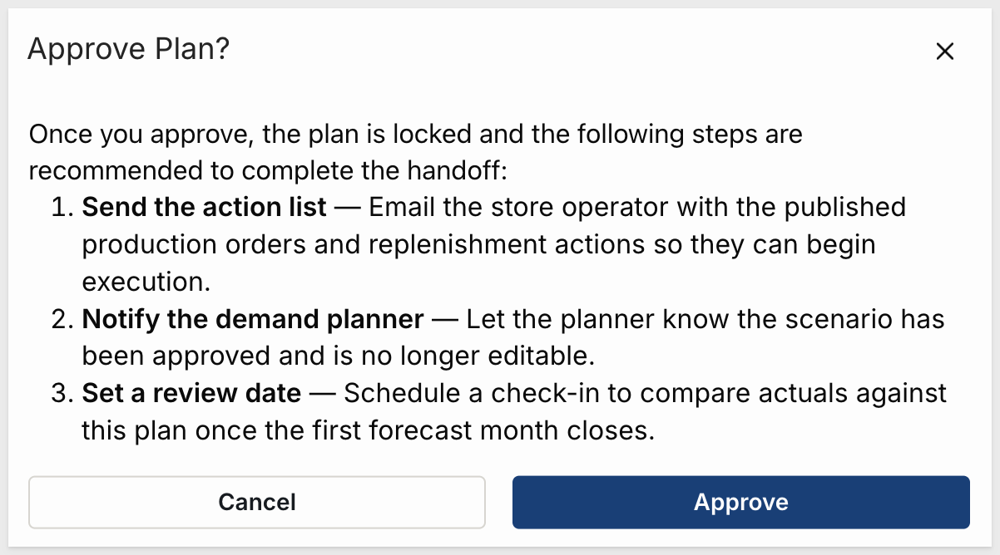
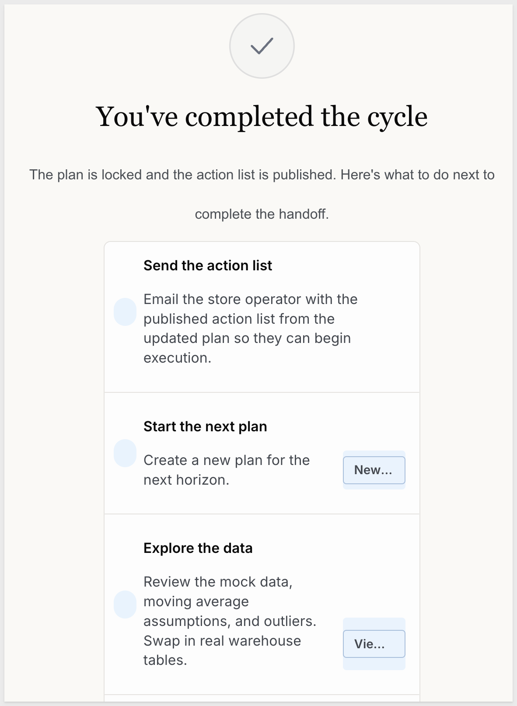
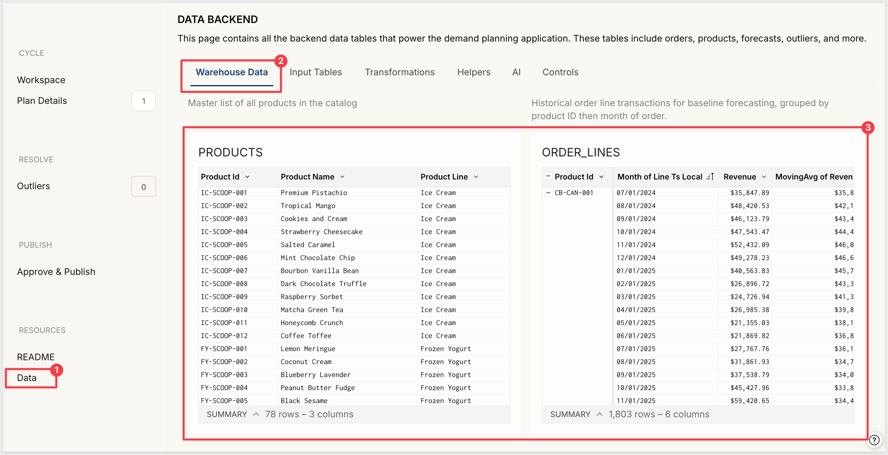
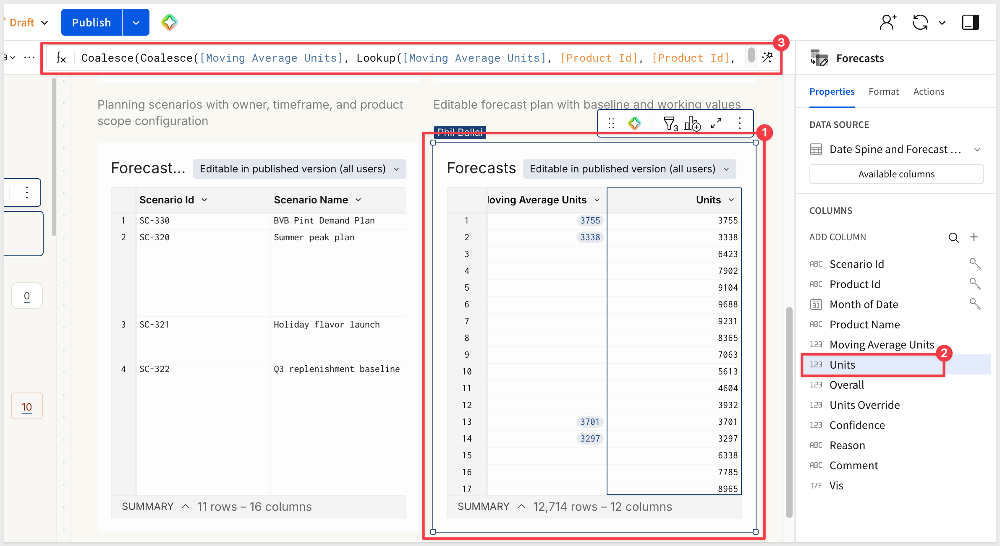
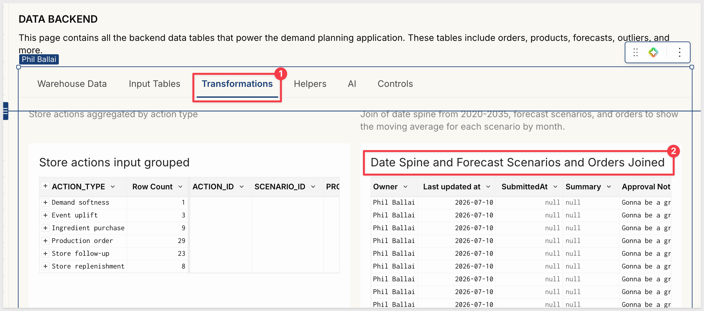
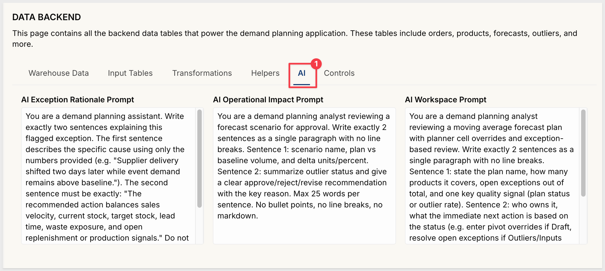

author: pballai
id: starter_apps_demand_planning
summary: Explore Sigma's Demand Planning Starter App — a ready-to-use operations app for building demand forecasts by product and time period, resolving outliers, and publishing approved plans to downstream stakeholders.
categories: starterapps
environments: web
status: Hidden
feedback link: https://github.com/sigmacomputing/sigmaquickstarts/issues
tags: 
lastUpdated: 2026-07-11

# Demand Planning Starter App

## Overview
Duration: 5

Sigma's **Starter Apps** are ready-to-use applications built on Sigma's native features and connected to sample data. Each one ships fully functional — you can explore it immediately, learn how it's built by switching to edit mode, and adapt it to your own data and workflows without starting from scratch.

The **Demand Planning** app gives supply chain and operations teams a single workspace to create demand forecasts, incorporate planner assumptions, resolve statistical outliers, and publish approved plans to stores or downstream systems — all against live data. A moving average baseline is generated automatically, and AI surfaces cycle health, exception rationale, and operational impact at each stage of the workflow.

This QuickStart walks through how the app works as a user, how it's designed under the hood, and how to connect it to your own data.

<aside class="negative">
<strong>NOTE:</strong><br> Starter Apps are actively developed and improved by Sigma. The screens, field names, and workflow steps shown in this QuickStart reflect the app at the time of publication and may differ slightly from what you see in your environment.
</aside>

### Target Audience
Supply chain, operations, and planning teams evaluating or adopting Sigma for demand and inventory planning workflows. Solutions Engineers and technical stakeholders exploring the app as a reference design.

### Prerequisites

<ul>
  <li>Access to a Sigma environment.</li>
  <li>The Demand Planning Starter App available in your org — find it under <code>Templates</code> > <code>Starter Apps</code>.</li>
  <li><strong>Write access enabled on a connection</strong> — required for input tables to store planning data. See <a href="https://help.sigmacomputing.com/docs/set-up-write-access">Set up write access</a></li>
  <li><strong>AI provider configured for your organization</strong> — required for AI cycle insights, outlier rationale, and operational impact summaries. See <a href="https://help.sigmacomputing.com/docs/configure-ai-features-for-your-organization">Configure AI features for your organization</a></li>
  <li>Some familiarity with Sigma workbooks is helpful but not required.</li>
</ul>

<aside class="positive">
<strong>NOTE:</strong><br> If you don't see Starter Apps in your Templates section, contact your Sigma administrator to confirm availability in your org.
</aside>

### What You'll Learn
- How the Demand Planning app works across its four-stage planning workflow
- The key design patterns behind the app and why they're built that way
- How to connect the app to your own warehouse data


<!-- END OF SECTION-->

## Exploring the App
Duration: 10

### Open and Save the Template

Navigate to `Templates` in the left sidebar. The Demand Planning app appears in the `Made by Sigma` collection:


Click the template card to open a preview. Before clicking `Use template`, confirm both requirements shown on the detail page are met:

- **Write access enabled on a connection** — required for input tables to store planning data. See [Set up write access](https://help.sigmacomputing.com/docs/set-up-write-access)
- **AI provider set up in your organization** — required for AI summaries. See [Configure AI features for your organization](https://help.sigmacomputing.com/docs/configure-ai-features-for-your-organization)

Once both are in place, click `Use template`. Sigma creates a personal copy in your workspace that you can explore, edit, and connect to your own data without affecting the original template:


Click `Save as` and give the workbook a name:
```copy-code
Demand Planning
```

<aside class="positive">
<strong>NOTE:</strong><br> The original template remains unchanged in the gallery — your saved copy is the working version.
</aside>

### README Page

The app opens on its **README** page, which describes the purpose of each page and the five-step workflow at a glance. A short demo video walks through the core planning cycle. The README is worth reading before diving in — it describes what each page does and the order to follow:


<aside class="negative">
<strong>NOTE:</strong><br> The README is visible to all users of the app. If you adapt this template for your org, update it to reflect your actual product catalog, planning cadence, and any changes to the default data source.
</aside>

### Workspace Page

The **Workspace** page is the app's front door for each planning cycle. The left sidebar doubles as the stage navigator — sections are grouped as **CYCLE** (Workspace, Plan Details), **RESOLVE** (Outliers), and **PUBLISH** (Approve & Publish), each with a live badge showing open item counts. The active plan selector at the top of the page controls which forecast all pages display:


At the top of the main content area, a large `PLANNING CYCLE` headline announces the active plan's current phase: *"[Plan name] is in the Exceptions phase."* Directly below it, a `NEXT` action link names the immediate required step (for example, `NEXT — RESOLVE 10 OUTLIERS BEFORE SUBMISSION`) so the planner's next action is always visible without navigating elsewhere:


Below the headline, the **WORKING FORECAST** card shows the plan's date range and a four-stage progress tracker. Each stage card has two labels: a status label on top (Draft, Applied, Review, Not submitted) and the stage name below (**Baseline, Planner inputs, Outliers, Submit**), plus a short description of what that stage covers:


The **FORECAST UNITS** block shows the plan total as a single large number with two horizontal comparison bars — **Moving Avg** (blue, the system-generated baseline) and **Plan** (the working total after any planner cell overrides are applied). A contextual **NEXT ACTION** callout sits alongside it, surfacing the recommended step with a direct action button. A **Moving Avg vs Plan** line chart below plots both series across the forecast horizon:


The **Cycle Insight** panel on the right generates a two-sentence AI summary of the active plan: products covered, open exceptions out of total, next action based on current status, and the planning deadline. The prompt driving this summary is editable — covered in the **Under the Hood** section:


The **Top Outliers** list shows the highest-variance exceptions for the active plan, with product name, exception type, priority badge, and percent deviation from the moving average baseline. An `Open queue` button at the bottom links directly to the Outliers page:


<!-- END OF SECTION-->

## The Planning Workflow
Duration: 15

The app follows a four-stage workflow. 

The `Workspace` page tracks the active plan's stage at all times; each of the remaining three pages corresponds to one stage. 

Before creating a new plan, place the workbook in `Published` mode using the toggle in the header.

### Stage 1: Create a Plan

Creating a plan starts from the **Workspace** page. Click the `New...` button in the active plan selector at the top of the page:


A `CREATE DEMAND PLAN` modal opens. Fill in the fields using the sample values below, or substitute your own:

- Scenario Name:

```copy-code
BVB Pint Demand Plan
```

- Products: `Bourbon Vanilla Bean Pint`
- Start: `07/01/2026`
- End: `12/01/2026`
- Planning Notes:

```copy-code
Summer and holiday event catering forecast
```


Click `Create plan`. 

The new plan appears in the active plan selector and we can select it or any other of the pre-built examples:


<aside class="positive">
<strong>NOTE:</strong><br> The active plan selector drives the entire workspace — switching it changes which scenario's exceptions, pivot data, and AI summaries are displayed across all pages. Multiple planners can work against separate scenarios simultaneously without affecting each other.
</aside>

### Stage 2: Plan Details

Click `View plan`:

The **Plan Details** page opens with the stage indicator `STAGE 02 OF 04 · PLAN DETAILS` at the top. Two header buttons — `Back to Workspace` and `Continue to Outliers` — let you move between stages without using the sidebar:


The page has a two-column layout. The left side shows the **PIVOT PLANNING TABLE** — products on rows, months in `YYYY-MM` format on columns. Three footer KPIs below the table track the running totals: **BASELINE**, **WORKING**, and **Δ VS BASELINE**:


The right side shows the **SCENARIO RECORD AND SCOPE** panel where plan metadata (Scenario Name, Owner, Products, Start/End) is editable without leaving the page. The `Refresh` button next to Products regenerates the forecast scaffold after any product selection change:


To apply a planner assumption, click the `2026-07` cell for Bourbon Vanilla Bean Pint. 

A modal opens showing the moving average baseline (8,061 units) as the reference. 

Enter the following values to record an event-driven uplift:

- **Plan Units:**

```copy-code
10500
```
- **Confidence:**

```copy-code
90
```
- **Reason:** select the value that best describes the demand driver (e.g., seasonal event, promotional)
- **Comment:**

```copy-code
Annual summer food festival drives higher catering product volume
```

The **Δ vs moving average forecast** line at the bottom updates live — at 10,500 units it shows +2,439 units, +30%. Click `Save cell` to apply:


<aside class="negative">
<strong>NOTE:</strong><br> Once a plan is submitted in Stage 4, the pivot table is locked. Editing a submitted plan reopens it as a draft and resets it to Stage 2.
</aside>

Click the `Continue to Outliers` button.


We are warned that we need to `Save & Continue`. Go ahead and do that:


### Stage 3: Resolve Outliers

This is where you work through flagged product-month combinations before the plan can be submitted.

The outlier queue on the left lists all exceptions for the active plan, filterable by type. Each row shows the product name, exception type, the comment entered during the plan edit, the working plan value, and the percent deviation from the moving average:


Click `Open` on any outlier to load its detail panel. The panel shows the product line and product name as a breadcrumb, a stats line (Baseline, Working, Confidence), and an AI-generated **+SYSTEM RATIONALE** that explains the specific cause. Below the rationale, a **PLAN VS MOVING AVG** chart plots both series for the full plan horizon. The **RESOLUTION** section on the right shows three comparison KPIs (Moving Avg, Plan, Δ vs Moving Avg) and resolution tabs:


**WHY IT MATTERS:**<br>
The System Rationale is scoped deliberately — it explains the variance using only the data it's given, without inventing context. Planners get a consistent, data-grounded explanation for every exception without manually cross-referencing the source table.

The resolution tabs let you choose how to close each exception:

- **Snap to Moving Avg** — resets the plan cell to the moving average baseline and closes the exception
- **Manual Override** — enter a specific unit value with a rationale note
- A third tab covers accepting the current variance with a documented risk rationale

After review, click `Resolve & Next` to close the exception and advance to the next one in the queue.

When all exceptions are resolved, the `Submit resolved plan` button becomes active. Click it to advance the plan to Stage 4:



### Stage 4: Approve and Publish

The **Approve & Publish** page opens with the stage indicator `STAGE 04 OF 04 · APPROVE & PUBLISH` and the heading **"Operations review"**. The page subtitle summarizes what to check: submitted scenario, major assumptions, unresolved exceptions, and generated replenishment or production actions before publishing to stores.

A **Planner handoff required** card confirms outlier status. When all outliers are resolved it reads: *"All outliers are resolved. Submit the scenario to unlock the operations review."*

The **PLAN VS MOVING AVERAGE SUMMARY** card shows four KPIs — **MOVING AVG TOTAL**, **PLAN TOTAL**, **Δ UNITS**, and **Δ %**. On the right, the **+OPERATIONAL IMPACT** panel shows an AI-generated assessment: plan volume vs baseline, any outstanding exception context, and a clear approve/reject recommendation. The **Outlier Review** panel confirms all exceptions are resolved.

Fill in the **APPROVAL NOTES** field before submitting:

```copy-code
Gonna be a great summer!
```

Then click `Submit plan`:



Clicking `Submit plan` unlocks the operations review. The **Planner handoff required** card is replaced by the full summary view, and an `Approve & Publish` button appears. Click it:



An **Approve Plan?** confirmation modal opens. It lists three recommended handoff steps to complete after approval:

1. **Send the action list** — Email the store operator with the published production orders and replenishment actions so they can begin execution
2. **Notify the demand planner** — Let the planner know the scenario has been approved and is no longer editable
3. **Set a review date** — Schedule a check-in to compare actuals against this plan once the first forecast month closes



Click `Approve`. The plan locks and a **"You've completed the cycle"** confirmation screen appears with three next-step actions:

- **Send the action list** — email the store operator with the published action list so they can begin execution
- **Start the next plan** — open the `New...` modal to create the next planning horizon
- **Explore the data** — navigate to the Data page to review the underlying tables or swap in real warehouse data




<!-- END OF SECTION-->

## Under the Hood
Duration: 10

The **Data** page contains every backend table that powers the app. Each table is labeled with a description of its purpose. Here's how the pieces fit together.

### The Data Sources

The app draws from two warehouse tables:

- **PRODUCTS** — the product catalog with three columns: `Product Id`, `Product Name`, and `Product Line`. This is the dimension table used to resolve product names throughout the app.
- **ORDER_LINES** — historical order line transactions, aggregated at the workbook level to the `Product Id × Month` grain. Two key calculated columns:
  - `Units` — `Sum([Units Consumed])` — total units sold per product per month
  - `MovingAvg of Units` — `MovingAvg([Units], 2, 2)` — a 2-period moving average with a 2-period lag



The 2-period lag is intentional: it ensures the moving average reflects completed periods rather than the current in-progress month, which would otherwise pull the baseline toward incomplete data.

These are the two tables you replace when connecting to your own data. See the **Connect Your Own Data** section for details.

### The Moving Average Fallback Chain

The `Forecasts` linked input table (on the `Input Tables` tab) contains a `Units` column that resolves the baseline value for each product-month combination using a cascading `Coalesce` with year-over-year fallbacks:

```code
Coalesce(
  [Moving Average Units],
  Lookup([Moving Average Units], [Product Id], [Product Id], DateAdd("year", -1, [Month of Date]), [Month of Date]),
  Lookup([Moving Average Units], [Product Id], [Product Id], DateAdd("year", -2, [Month of Date]), [Month of Date]),
  ... up to 5 years back ...,
  0
)
```



If the current period has a moving average from `ORDER_LINES`, it uses that. If not — for a new product or a future month with no history — it looks back one year, then two, up to five. If no match is found, it defaults to zero.

**WHY IT MATTERS:**<br>
This pattern keeps the baseline populated for all product-month combinations regardless of data gaps or product age. A new SKU added to the plan mid-year picks up its year-ago baseline automatically rather than showing zero, giving planners a reasonable starting point without manual intervention.

### The Forecast Scaffold

The **forecast scaffold** generates the complete grid of input rows before any planner data is entered.

The scaffold is a derived table called `Date Spine and Forecast Scenarios and Orders Joined`, built from three sources:

1. **Date Spine** — an input table with one row per month from 2020 through 2035. This is the temporal backbone.
2. **Forecast Scenarios** — joined to the Date Spine on a date range condition so only months within a scenario's `Start`–`End` window are included.
3. **ORDER_LINES** — joined without a matching key, fanning out across every distinct `Product Id`.

That third join — no shared key, one side applied to every row of the date spine result — is a cross join. The result is exactly one row for every combination of scenario × product × forecast month:



**The Linked Input Table**

`Forecasts` is a linked input table that uses this scaffold as its row source. A linked input table can only write values into rows that already exist in its source — it cannot create new rows on its own.

When a planner enters a unit override for a specific product and month, that value is stored in `Units Override`. The `Overall` column resolves the effective plan value:

```code
Coalesce([Units Override], [Units])
```

If a planner has entered a value, it wins. If not, the moving average baseline fills in automatically.

**WHY IT MATTERS:**<br>
The scaffold eliminates the most common failure mode in demand planning input tables: missing product-month combinations. Every valid slot is pre-generated from the scenario's configuration, and the linked input table only accepts values into those pre-defined rows. Planners cannot accidentally skip a month or add a row for a product outside the plan's scope.

### Outlier Detection and Resolution

The `Outliers statuses input` table stores pre-populated exception records for each scenario. Each row represents one flagged product-month combination and carries:

- `EXCEPTION_TYPE` — the category of outlier (e.g., demand spike, stock risk)
- `PRIORITY` — P0 (high) or lower, used to sort the exception queue
- `BASELINE_UNITS` and `WORKING_UNITS` — the moving average value vs the current plan value
- `STATUS` — Open, Resolved, or Escalated
- `RESOLUTION_TYPE` — what action was taken (snap to moving average, manual override, accept variance)
- `ACCEPTED_RISK` — free-text rationale when the variance is accepted

The `Forecast Scenarios` input table derives its `Open Exceptions` and `Exception Count` values from this table via `Lookup(CountIf(...))`, making the exception gate on the Workspace and Approve & Publish pages dynamic without any additional queries.

### AI Prompts as Editable Controls

All three AI summaries in the app are stored as editable prompts on the Data page's **AI** tab — not hardcoded into workbook elements. The Data page is organized into tabs (Warehouse Data, Input Tables, Transformations, Helpers, AI, Controls); the `AI` tab shows the three prompts side by side:



- `AI Exception Rationale Prompt` — drives the System Rationale in the Outlier detail panel (two-sentence explanation, data-grounded, no invented context)
- `AI Operational Impact Prompt` — drives the Approve & Publish assessment (volume vs baseline, approve/reject recommendation)
- `AI Workspace Prompt` — drives the Cycle Insight on the Workspace page (plan health, open exceptions, next action, deadline)

**WHY IT MATTERS:**<br>
Storing prompts on a dedicated tab separates content from structure. Operations leads can tune what each AI summary says — adjusting focus, tone, or level of detail — without touching any formulas or workbook elements. The prompts are visible and auditable in one place, which matters when AI output is part of an approval workflow.


<!-- END OF SECTION-->

## Connect Your Own Data
Duration: 5

The Demand Planning app is designed to work with any product-level sales or consumption dataset. The two source tables to replace are **PRODUCTS** and **ORDER_LINES** on the Data page.

### What the App Needs

**Products table:**

| Column | Description |
|--------|-------------|
| Product Id | A unique identifier for each product |
| Product Name | A display name resolved throughout the app |
| Product Line | A grouping dimension (used in the outlier detail panel) |

**Order Lines table (aggregated to Product × Month grain):**

| Column | Description |
|--------|-------------|
| Product Id | Matches the Products table |
| Month | A date truncated to month granularity |
| Units | A numeric measure of consumption or sales volume |
| MovingAvg of Units | `MovingAvg([Units], 2, 2)` — computed at the workbook level |

The raw transaction table can be at any grain — the workbook's grouping configuration handles the aggregation.

### How to Swap the Sources

On the `Data` page, open **PRODUCTS** in edit mode. Use `Change source` to point the table at your own connection and product dimension table. Map your columns to `Product Id`, `Product Name`, and `Product Line`.

Then open **ORDER_LINES** in edit mode. Use `Change source` to point it at your transaction table. Map your product ID, date, and units columns to the existing column references. The `MovingAvg` formula is applied at the workbook level and recalculates automatically once your `Units` column is mapped.

<!--  -->

<aside class="negative">
<strong>NOTE:</strong><br> The Date Spine, Forecast Scenarios, Forecasts, Outliers, and Store Actions input tables all use the same Snowflake connection as the sample data for write-back storage. If you're connecting to a different warehouse, update those input table sources as well to ensure plan data is written to the correct location.
</aside>

### What Carries Over Automatically

Once sources are swapped and columns are mapped correctly:

- The forecast scaffold re-generates using your product IDs and any scenario date ranges configured
- The moving average fallback chain resolves against your historical data automatically
- The pivot planning table shows your products and months without any formula changes
- The AI summaries continue to work without any changes to the prompts
- The outlier queue populates from whatever exception records exist in the Outliers input table

The main manual step after swapping sources is populating the Outliers table with exceptions from your data — either from an upstream detection process, or by using Sigma to flag outliers from live data and writing them back.


<!-- END OF SECTION-->

## What We've Covered
Duration: 5

This QuickStart walked through the Cadence - Demand Planning System from end to end: exploring the workspace, running a full planning cycle across all four stages, and examining the design decisions that make the app work.

The **four-stage planning workflow** — Create, Plan Details, Resolve Outliers, Approve & Publish — is the operational pattern worth carrying forward. Each stage gate is a deliberate checkpoint that structures collaboration between planners, reviewers, and approvers. That structure applies to any planning domain where multiple people need to contribute sequentially before a plan goes live.

The **forecast scaffold with linked input table** is the core technical pattern. The scaffold pre-generates every valid plan row by joining a date spine, scenario definitions, and products before any planner touches it. The linked input table can only write back to those pre-generated slots, which prevents bad row creation and keeps the plan grid clean. This same pattern works for headcount planning, capacity planning, or any scenario where you need structured write-back against a known set of rows.

The **moving average with fallback chain** handles a realistic data problem: not every product has a complete history. By chaining five years of lookbacks and resolving to zero only as a last resort, the baseline remains useful even for new SKUs or products with gaps. You can adapt this fallback logic to any forecasting model that needs to handle sparse data gracefully.

The **AI prompts as editable controls** show how to integrate AI assistance without hardcoding it. Three prompts — exception rationale, operational impact, and workspace summary — live on a dedicated AI tab in the Data page, where they can be tuned to match the business context, the data, or the audience, all without touching the underlying formulas.

**Additional Resource Links**

[Blog](https://www.sigmacomputing.com/blog/)<br>
[Community](https://community.sigmacomputing.com/)<br>
[Help Center](https://help.sigmacomputing.com/hc/en-us)<br>
[QuickStarts](https://quickstarts.sigmacomputing.com/)<br>

Be sure to check out all the latest developments at [Sigma's First Friday Feature page!](https://quickstarts.sigmacomputing.com/firstfridayfeatures/)
<br>

[](https://twitter.com/sigmacomputing)&emsp;
[](https://www.linkedin.com/company/sigmacomputing)&emsp;
[](https://www.facebook.com/sigmacomputing)


<!-- END OF WHAT WE COVERED -->
<!-- END OF QUICKSTART -->
