author: pballai
id: starter_apps_headcount_planning
summary: starter_apps_headcount_planning
categories: starterapps
environments: web
status: Published
feedback link: https://github.com/sigmacomputing/sigmaquickstarts/issues
tags: default
lastUpdated: 2026-07-16

# Headcount Planning Starter App

## Overview
Duration: 5

Sigma's **Starter Apps** are ready-to-use applications built on Sigma's native features and connected to sample data. Each one ships fully functional — you can explore it immediately, learn how it's built by switching to edit mode, and adapt it to your own projects without starting from scratch.

The **Headcount Planning** app — called **Headway** — gives workforce planning teams a single surface to review their current roster, model headcount scenarios against revenue targets, stage new hires and backfills, and submit a fiscal year plan for leadership approval. Monthly compensation projections update automatically as changes are made, and an AI advisor is available throughout the planning process.

This QuickStart walks through how the app works as a user, how it's designed under the hood, and how to adapt it to your own workforce data.

### Target Audience
HR business partners, finance teams, and workforce planning managers evaluating or adopting Sigma for headcount planning. Solutions Engineers and technical stakeholders exploring the app as a reference design for roster management and scenario modeling.

### Prerequisites

<ul>
  <li>Access to a Sigma environment.</li>
  <li>The Headcount Planning Starter App available in your org — find it under <code>Templates</code> > <code>Starter Apps</code>.</li>
  <li><strong>Write access enabled on a connection</strong> — required for input tables to store roster changes and plan submissions. See <a href="https://help.sigmacomputing.com/docs/set-up-write-access">Set up write access</a></li>
  <li><strong>AI provider configured for your organization</strong> — required for the Plan Advisor chat assistant and AI-generated manager recommendations. See <a href="https://help.sigmacomputing.com/docs/configure-ai-features-for-your-organization">Configure AI features for your organization</a></li>
  <li>Some familiarity with Sigma workbooks is helpful but not required.</li>
</ul>

<aside class="positive">
<strong>NOTE:</strong><br> If you don't see Starter Apps in your Templates section, contact your Sigma administrator to confirm availability in your org.
</aside>

### What You'll Learn
- How the Headcount Planning app works from workforce review through plan submission
- The key design patterns behind the app and why they're built that way
- How to connect the app to your own workforce data


<!-- END OF SECTION-->

## Exploring the App
Duration: 10

### Open and Save the Template

Navigate to `Templates` in the left sidebar. The Headcount Planning app appears in the `Made by Sigma` collection:

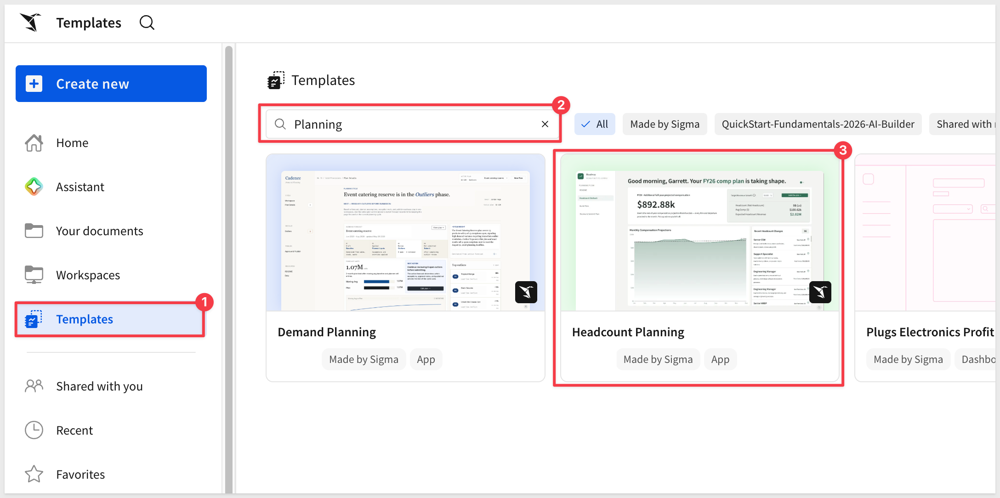

Click the template card to open a preview. Before clicking `Use template`, confirm the two requirements shown on the detail page are met:

- **Write access enabled on a connection** — required for input tables to store roster changes. See [Set up write access](https://help.sigmacomputing.com/docs/set-up-write-access)
- **AI provider set up in your organization** — required for the Plan Advisor and Manager Recommendations. See [Configure AI features for your organization](https://help.sigmacomputing.com/docs/configure-ai-features-for-your-organization)

Once both are in place, click `Use template`. Sigma creates a personal copy in your workspace that you can explore, edit, and populate with your own data without affecting the original template:


Click `Save as` and give the new workbook a name:
```copy-code
Headcount Planning
```

<aside class="positive">
<strong>NOTE:</strong><br> The original template remains unchanged in the gallery — your saved copy is the working version.
</aside>

### README Page

The app opens on its **README** page — an introduction built directly into the workbook that orients new users without requiring any external documentation:

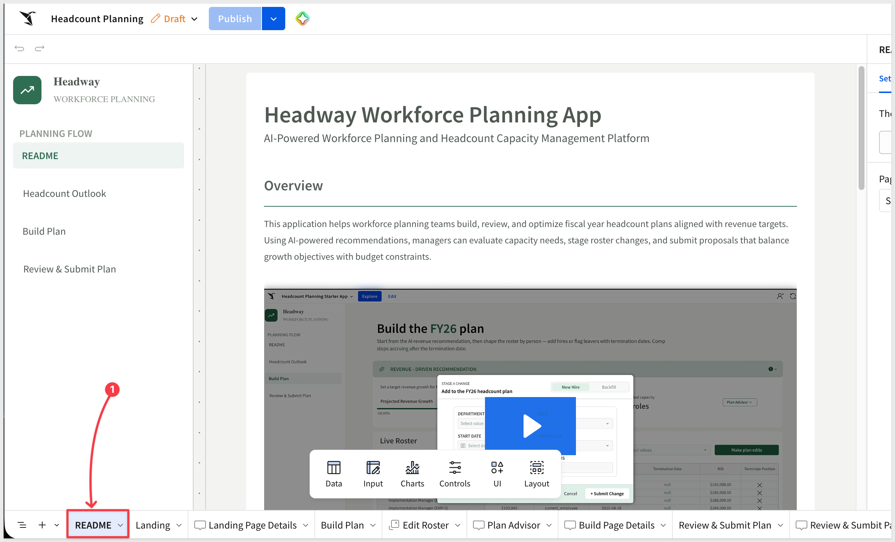

The README includes a short demo video, a six-step getting-started guide, and a map of the app's three main pages. The recommended sequence is:

1. Review Current Workforce — view headcount metrics on the Headcount Outlook page
2. Set Revenue Target — enter a growth percentage to generate hiring recommendations
3. Build Your Plan — review the AI recommendation and stage roster changes
4. Use the Plan Advisor — ask the AI chat assistant for hiring strategy guidance
5. Review and Submit — verify proposed changes by department and submit for approval
6. Track Monthly Projections — return to Headcount Outlook to see how staged changes affect rest-of-year compensation

<aside class="negative">
<strong>NOTE:</strong><br> The README page is visible to all users of the app. If you adapt this template for your org, update it to reflect your actual fiscal year, team context, and any changes from the sample data.
</aside>

Place the workbook into `Published` mode:

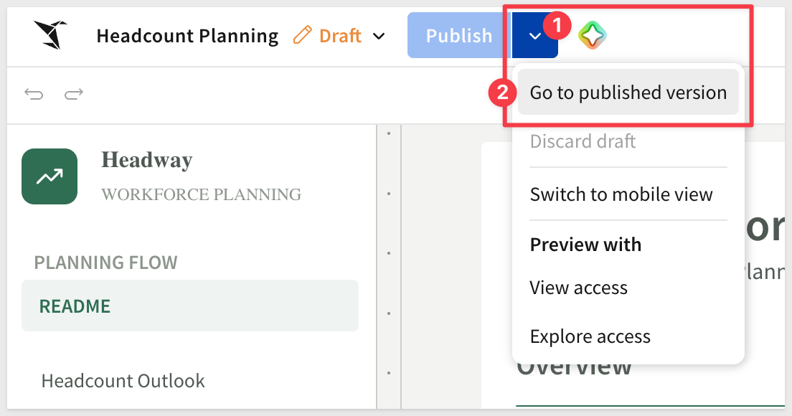

### Headcount Outlook Page

The **Headcount Outlook** page is the workforce planning dashboard and starting point. The left side displays the current fiscal year's additional projected compensation as a large hero number, with a brief description of what it represents. The right side shows a metrics panel with a **Target Revenue Growth** control and three key figures:

- **Headcount (Net Headcount)** — active headcount adjusted for the target revenue growth
- **Avg Comp ($)** — average salary across non-terminated employees
- **Expected Headcount Revenue** — projected revenue output for the fiscal year, scaled by the growth target

A `Build the plan ->` button in the metrics panel navigates directly to the Build Plan page.

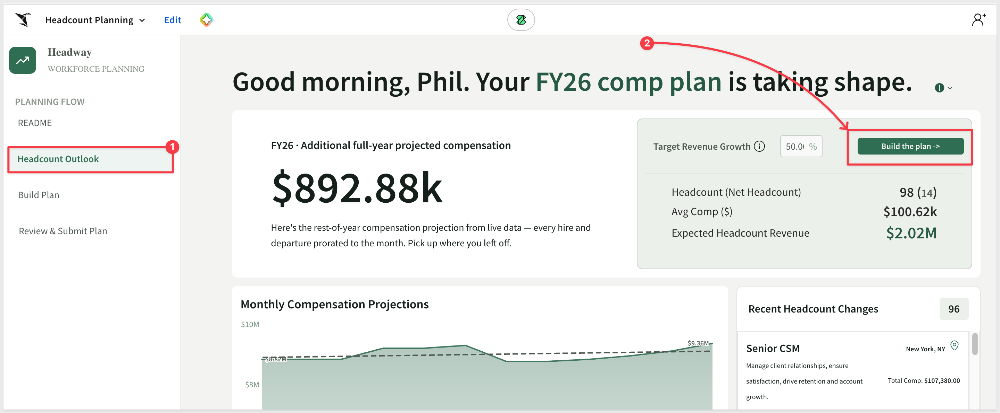

The **Monthly Compensation Projections** area chart below shows rest-of-year compensation cost by month, with a linear trendline. Each month reflects the prorated impact of current roster members — new hires and departures are factored in at the month they take effect.

The **Recent Headcount Changes** panel on the right lists roles that have been staged or recently modified. Each card shows the position name, location, total compensation, and a one-line AI-generated role description.

### Build Plan Page

The **Build Plan** page is the primary workspace for constructing the fiscal year headcount plan. It has two main sections: the revenue-driven recommendation panel and the Live Roster.

The **Revenue-Driven Recommendation** panel calculates how many roles to add based on a revenue growth target. A slider lets you set the projected growth percentage; the recommendation updates instantly to show the number of additional roles implied by that target:

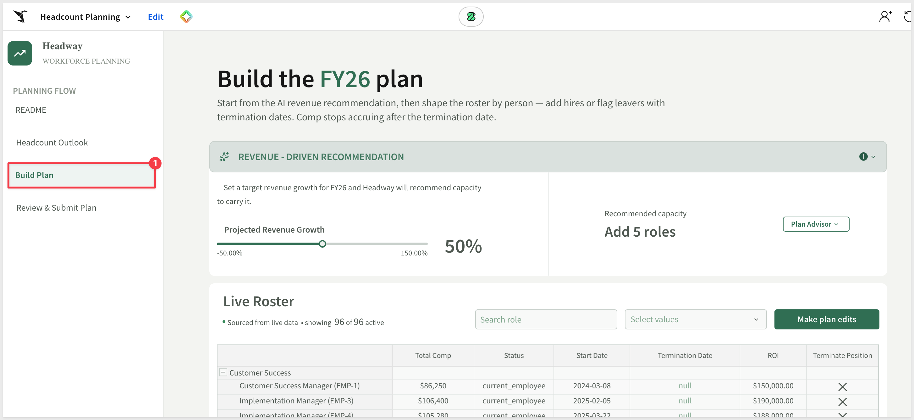

The **Live Roster** below shows every active employee, grouped by Department and Role. Use the role search and department filter to scope the view. Each row shows headcount, salary, bonus, total compensation, status, start date, termination date, and an ROI estimate.

To stage changes, click `Make plan edits` to open the staging form. The form has two tabs — `New Hire` and `Backfill` — and collects Department, Role, Start Date, Location, Salary, and Bonus (as a decimal, e.g. `0.15` for 15%). Click `+ Submit Change` to write the staged row to the Live Roster immediately. To mark an existing position for termination, use the `Terminate Position` column directly in the Live Roster:

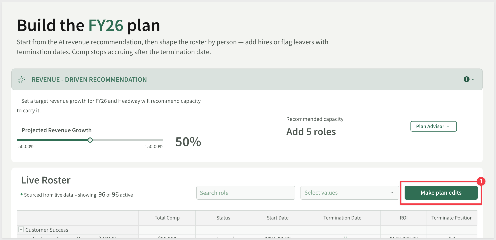

To get AI-guided hiring advice, click `Plan Advisor` to launch the chat assistant.

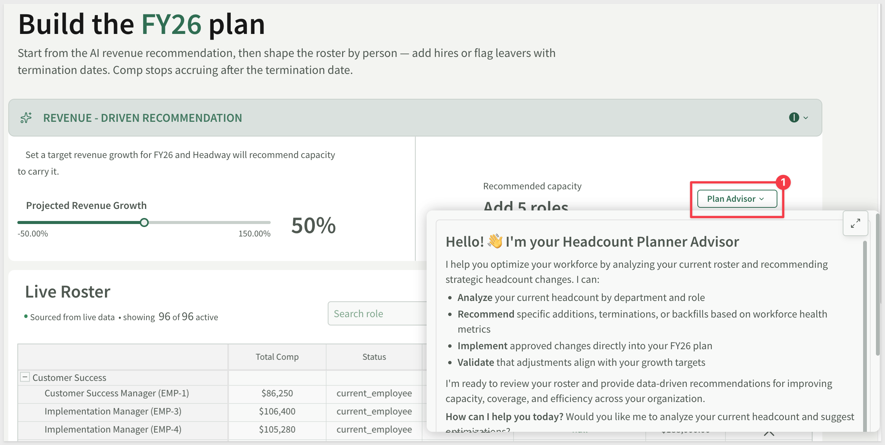

### Review & Submit Plan Page

The **Review & Submit Plan** page is the final checkpoint before submitting the fiscal year roster for approval:

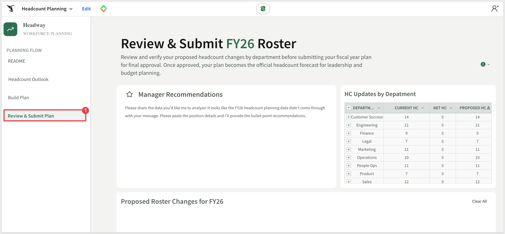

The **Manager Recommendations** section shows an AI-generated analysis of the proposed changes — role-by-role guidance on whether to approve or deny each staged action, with approval flagged in green and denial in red.

Below it, **HC Updates by Department** summarizes proposed headcount changes at the department level: current HC, net change, and proposed total — with color-coded conditional formatting to make additions and reductions visible at a glance.

**Proposed Roster Changes for FY** provides a row-level view of every staged change: department, position, status, headcount delta, cost, revenue impact, start date, and termination date.

Use `Clear All` to reset the plan or `Submit` to send it forward for leadership review.


<!-- END OF SECTION-->

## Planning Headcount
Duration: 10

This section walks through the end-to-end planning workflow using the sample Headway data.

### Step 1: Review Your Workforce Baseline

Navigate to the **Headcount Outlook** page. With Target Revenue Growth set to the default value, review the three summary metrics at the top:

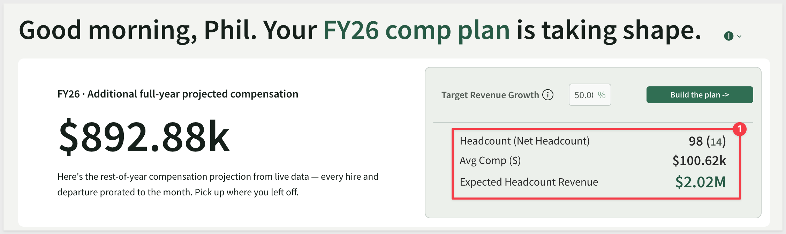

These numbers represent your baseline: what you currently have, what it costs on average, and how much revenue that headcount is expected to generate. This is the starting point before any scenarios are modeled.

Scroll down to the **Monthly Compensation Projections** chart. The rest-of-year view shows how compensation cost accumulates month by month based on current roster state:

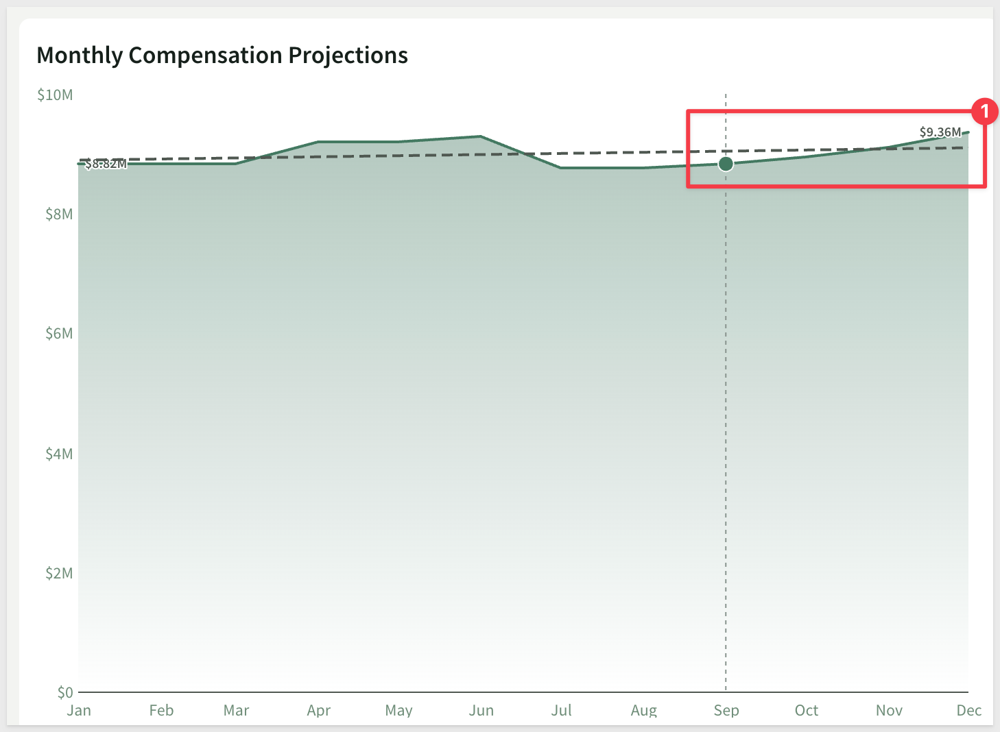

The trendline projects where costs are heading if no changes are made. Use this as context before setting a revenue target.

### Step 2: Set a Revenue Target

Enter a target revenue growth percentage in the **Target Revenue Growth** control. For this walkthrough, enter:

```copy-code
75
```

The metrics and chart update to reflect a 75% revenue growth scenario. The Headcount (Net Headcount) metric shows the total headcount required to carry that growth, and the Expected Headcount Revenue adjusts accordingly.

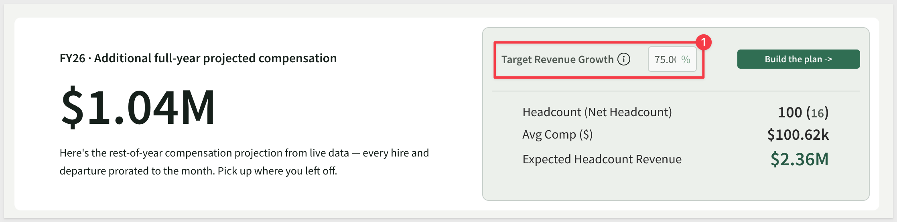

<aside class="positive">
<strong>NOTE:</strong><br> The revenue growth control on Headcount Outlook and the revenue growth slider on Build Plan are independent — set both to the same value for a coherent planning view. The Headcount Outlook control adjusts the summary metrics display. The Build Plan slider drives the recommended capacity calculation.
</aside>

### Step 3: Review the Recommendation and Build the Plan

Navigate to the **Build Plan** page. The **Projected Revenue Growth** slider is already to `75%` to match the target you set on Headcount Outlook.

The recommendation panel calculates the number of additional roles implied by that growth rate and displays them at the top of the page:

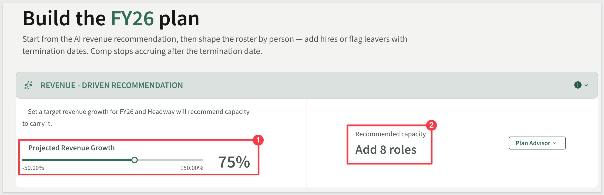

Click `Make plan edits` to open the **Stage a Change** form. Select the `New Hire` tab and fill in the fields:

- Department: `Sales`
- Role: `Account Executive`
- Start Date: Set for 1 month forward
- Location: `New York, NY`
- Salary: `95000`
- Bonus: `0.15`

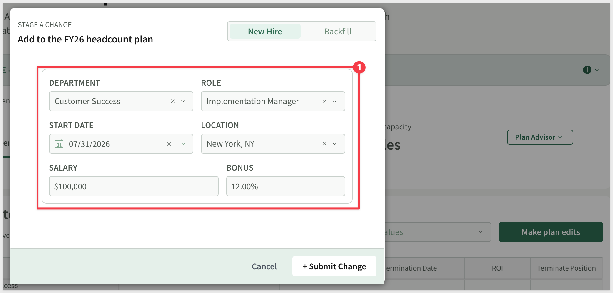

Click `+ Submit Change`. The new hire row appears in the Live Roster immediately with a status of `offer_pending` and a green row highlight. 

The roster header updates to show the new total — for example, "11 of 10 active" when one staged hire sits above the active baseline:

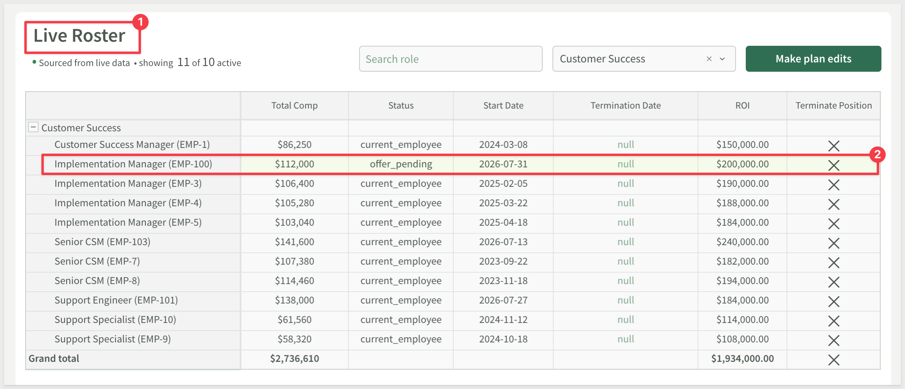

To mark an existing position for termination, click the **X** in the `Terminate Position` column on that row — the status changes to `pending_termination` and the row turns red:

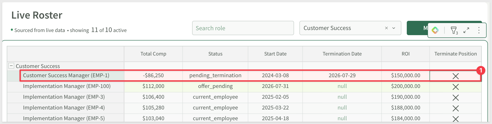

Repeat for each position you want to add or flag. The Live Roster reflects every staged change inline before anything is submitted.

<aside class="negative">
<strong>NOTE:</strong><br> Staged changes write to an input table — they are not permanent until submitted on the Review & Submit page. You can clear all staged changes at any time.
</aside>

### Step 4: Use the Plan Advisor

Click `Plan Advisor` on the Build Plan page to open the AI chat assistant.

Maximize the window to full screen:

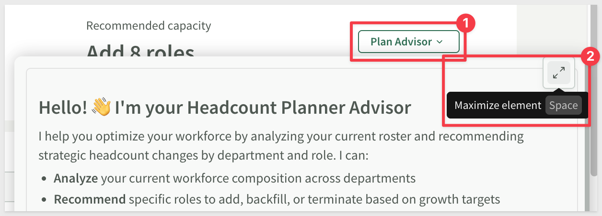

The Plan Advisor has access to your current roster context. Ask it questions about hiring strategy, compensation tradeoffs, or capacity planning decisions. Example prompts:

```copy-code
Which departments are most understaffed relative to revenue output?
```

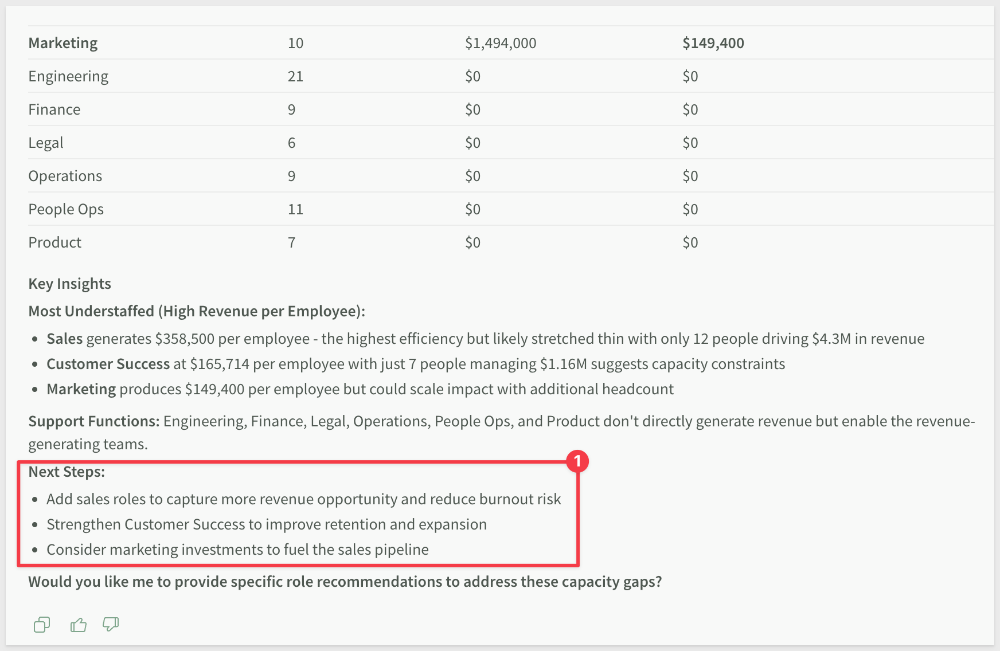

```copy-code
What's the compensation impact of adding three mid-level salespeople in Q3?
```

The advisor generates responses based on the live roster data visible in the workbook:

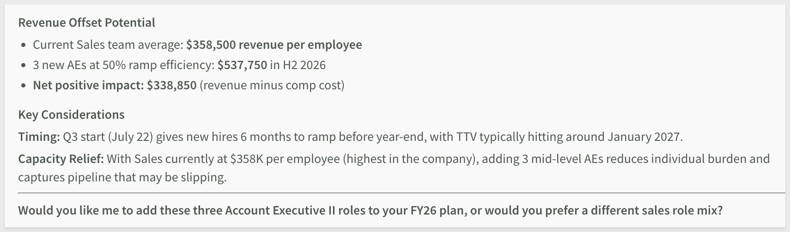

Minimize and close the panel when done and continue refining the plan in the Live Roster.

### Step 5: Review and Submit

Navigate to **Review & Submit Plan**. The **Manager Recommendations** panel at the top shows an AI-generated review of your proposed changes:

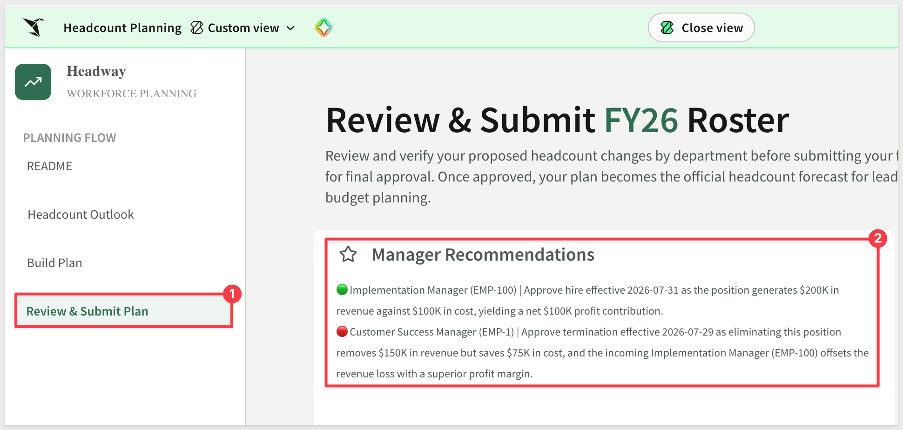

Review the HC Updates by Department table to confirm the department-level headcount delta is what you intended.

Scroll down to verify the **Proposed Roster Changes for FY** table. Confirm each staged change — position, status, cost, and revenue impact — before submitting:

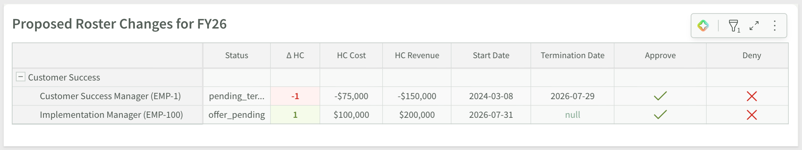

Click `Approve` or `Deny` for each row. Return to **Headcount Outlook** to see the Monthly Compensation Projections chart updated to reflect the full impact of your staged changes.

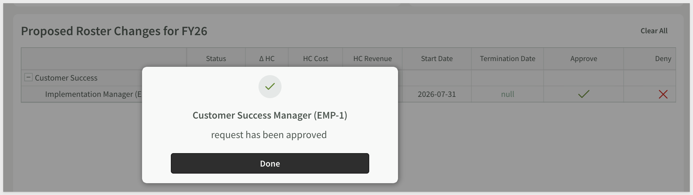


<!-- END OF SECTION-->

## AI Features
Duration: 5

The Headcount Planning app includes three AI features, each targeting a different stage of the planning workflow. All use `CallText()` formulas or Sigma's native chat element — no external AI pipeline is required.

### AI Role Descriptions on Headcount Outlook

On the **Headcount Outlook** page, each card in the Recent Headcount Changes panel shows a short AI-generated role description:

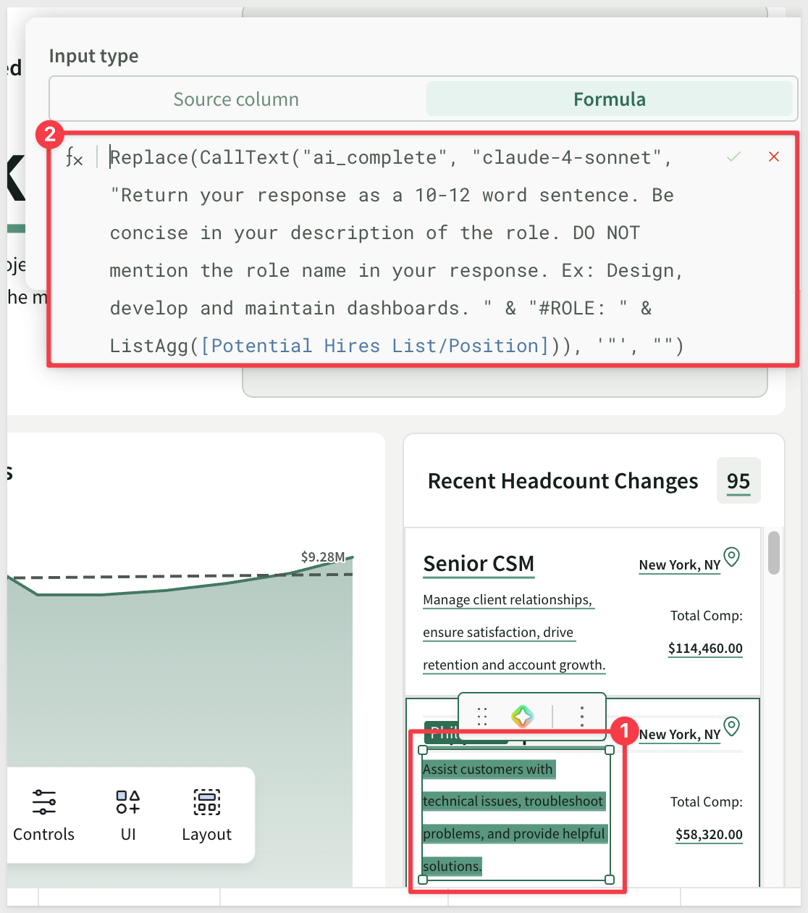

The description is generated by a `CallText()` formula embedded in a text element. The prompt instructs the model to return a 10-to-12-word sentence describing the role without mentioning the role name — a concise orientation for reviewers scanning a list of proposed changes:

```
Replace(CallText
("ai_complete", "claude-4-sonnet", 
"Return your response as a 10-12 word sentence. 
Be concise in your description of the role. 
DO NOT mention the role name in your response.
Ex: Design, develop and maintain dashboards. 
" & "#ROLE: " & ListAgg([Potential Hires List/Position])), '"', "")
```

### Manager Recommendations on Review & Submit

On the **Review & Submit Plan** page, the Manager Recommendations section generates an AI analysis of every staged roster change:

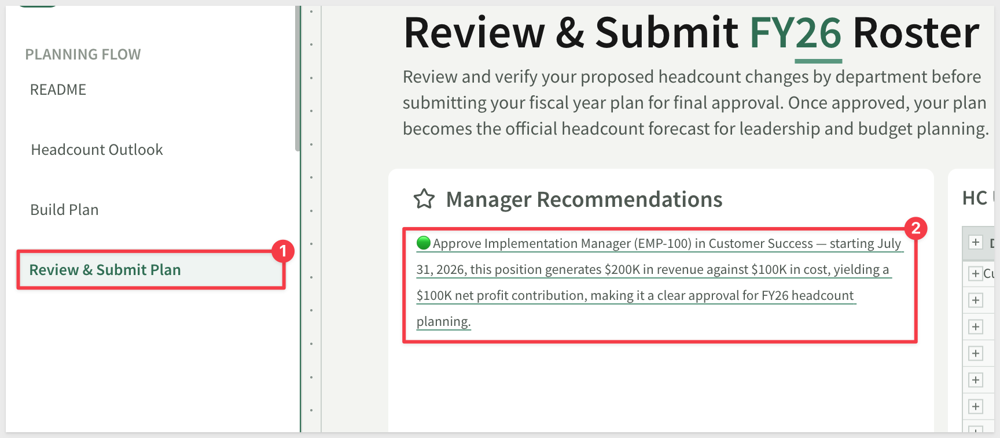

The prompt passes the full set of proposed changes — department, position, status, cost, revenue impact, and dates — to the model and asks it to produce a one-bullet-per-position recommendation. Approvals are marked with a green indicator and denials with red. Terminations are evaluated by the same logic: an approved termination (one the model agrees with) is red; a denied termination (one the model recommends reversing) is green.

The prompt and output structure are fully visible in edit mode — open the text element to inspect or modify the instruction directly.

### Plan Advisor Chat

The **Plan Advisor** uses a button and a popover:

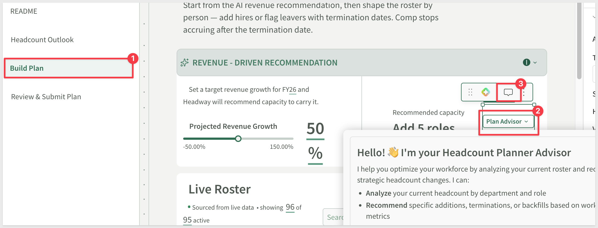

Clicking the "chat" icon exposes the popover page (when in edit mode). This page has the Sigma `Chat` element on it.

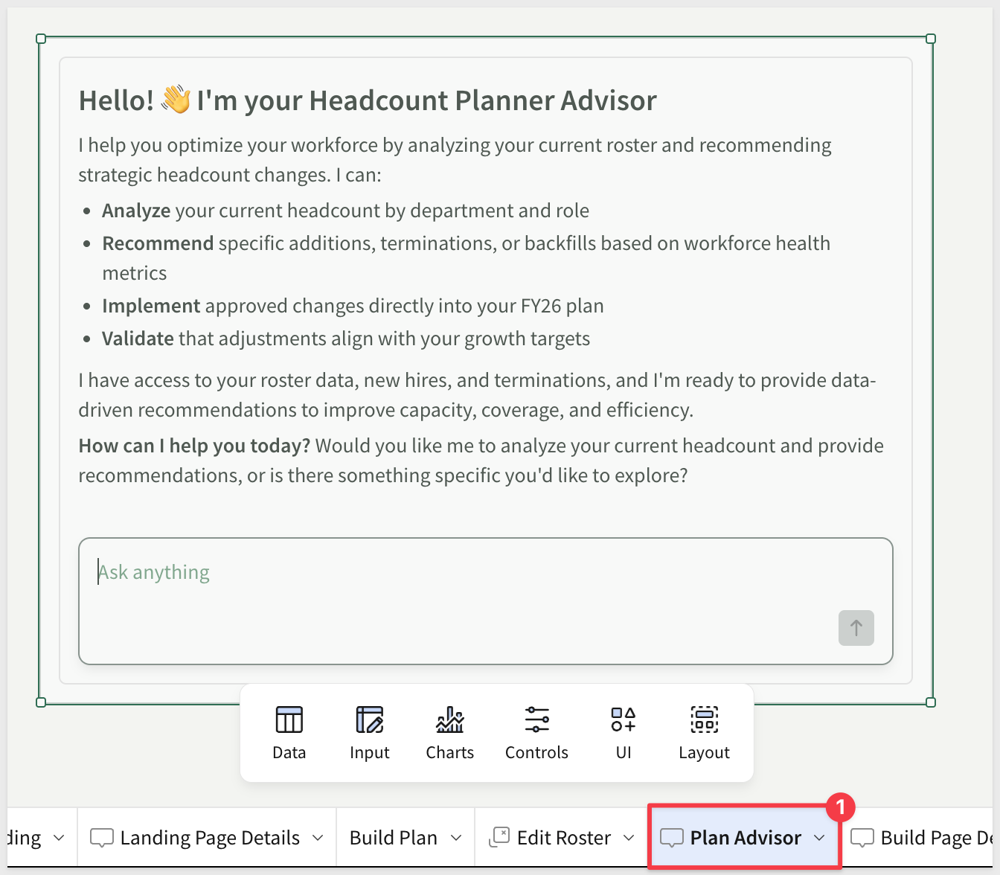

The chat element has an AI Agent configured to guide its operation:

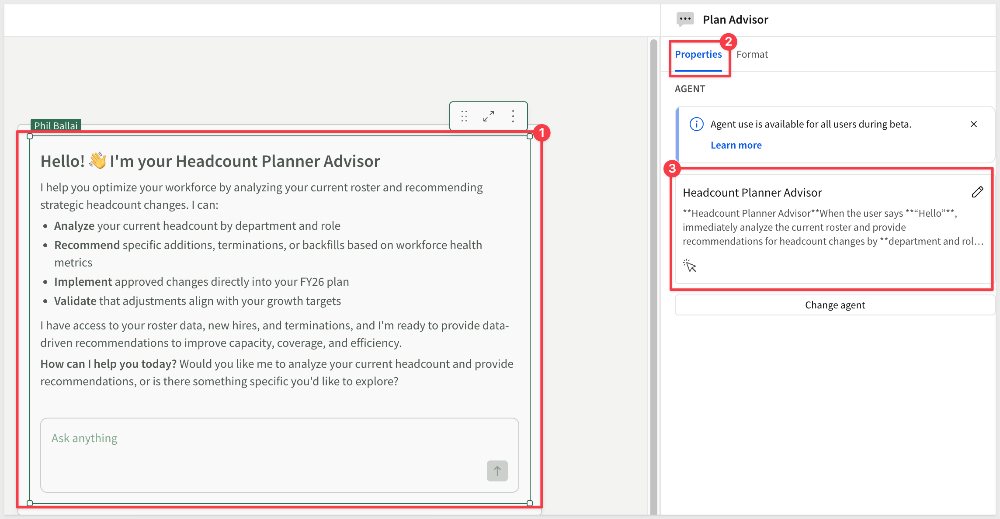

Clicking the pencil icon for the agent allows you to govern how the AI operates:

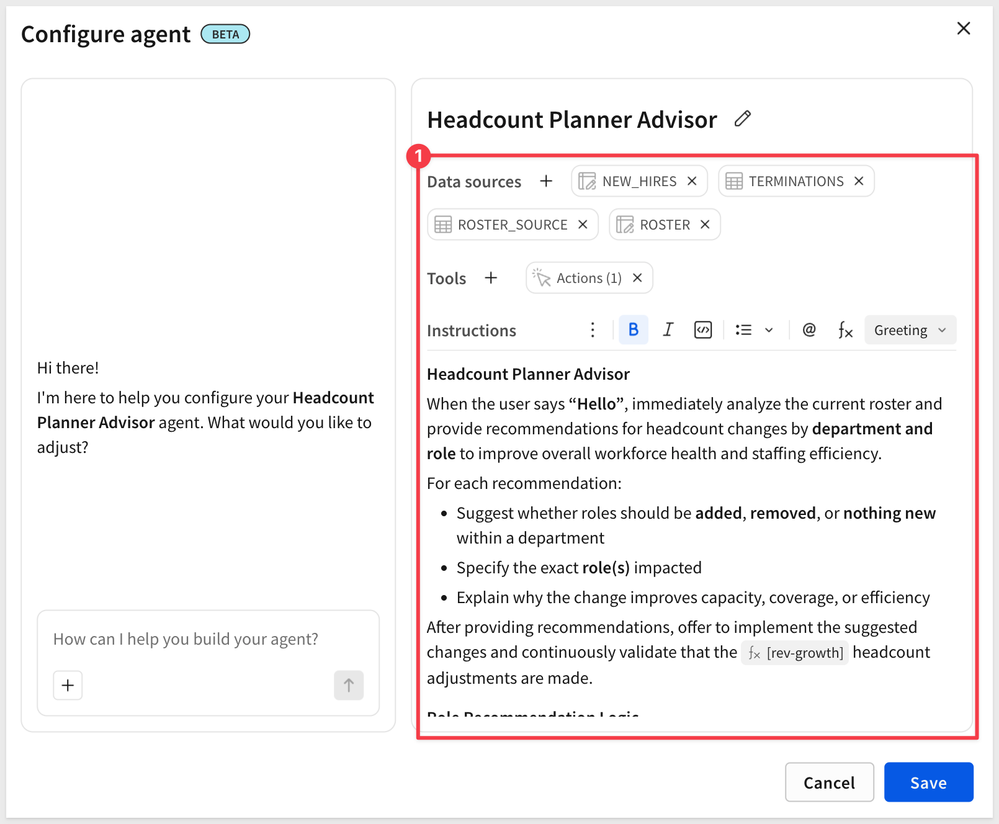


This gives the AI access to the roster data visible in the workbook and responds to open-ended questions about hiring strategy, compensation scenarios, capacity decisions and even what actions it is able to perform on behalf of a user.

<aside class="positive">
<strong>WHY IT MATTERS:</strong><br> All three AI features operate on data the user can already see — they don't require separate data exports or AI integrations. The AI works within Sigma's permissions model, which means every recommendation is grounded in the same live roster a manager is already reviewing.
</aside>


<!-- END OF SECTION-->

## Under the Hood
Duration: 10

Place the workbook in `Edit` mode to explore how the app is built.

### Input Tables

The app uses three input tables and one computed source, all visible on the **Data** page in Edit mode:

**ROSTER** — 99 rows, Plan = `Baseline`. The core employee records: one row per current or historical employee with full compensation and employment details (Position, POSITION_NAME, DEPARTMENT, SALARY, BONUS %, EXPECTED_START_DATE, TERMINATION_DATE, TTV, ROI, Revenue, and more). This is the stable source of truth for existing headcount and is editable in Published mode by all users.

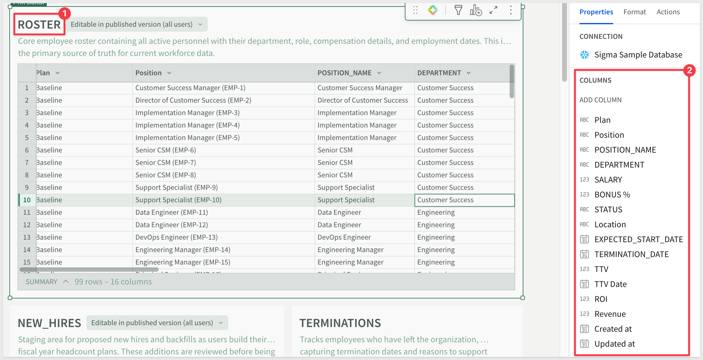

**NEW_HIRES** — staging table for proposed new hires and backfills. When a planner submits the `Stage a Change` form, a row is written here with a Plan value of `FY26_Plan_YYYY-MM-DD` (timestamped to the submission). All additions accumulate here until the plan is cleared or submitted.

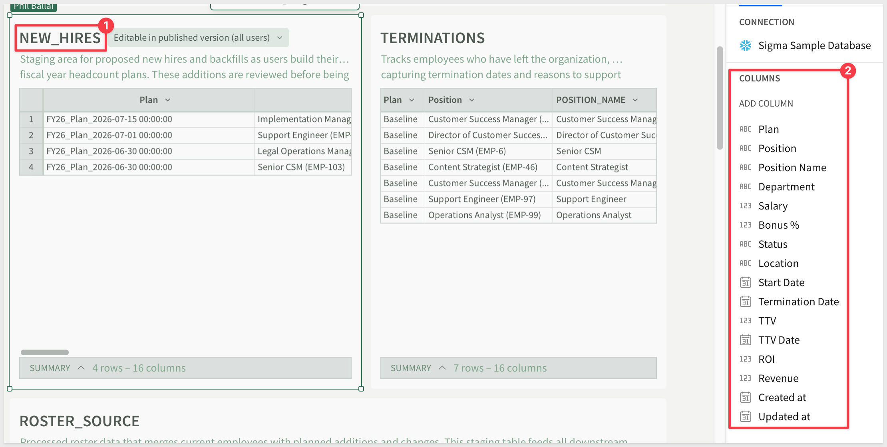

**TERMINATIONS** — tracks employees who have left or are flagged for departure, storing termination dates and supporting prorated compensation calculations:

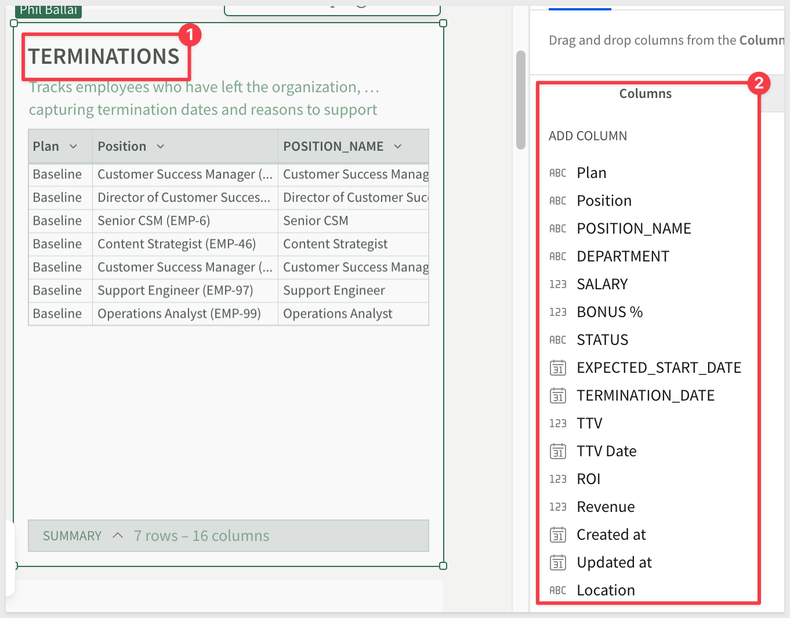

**ROSTER_SOURCE** — a computed merge of ROSTER, NEW_HIRES, and TERMINATIONS (103 rows = 99 baseline + 4 staged in the sample). Every visualization in the app — the Live Roster, the Headcount Outlook metrics, the monthly comp projections, the Review & Submit tables — reads from ROSTER_SOURCE, not from the individual input tables directly:

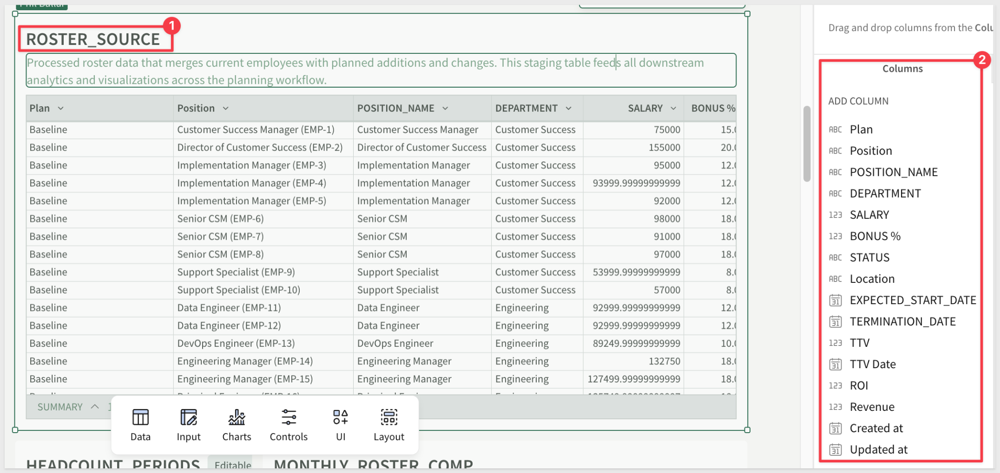

This separation keeps the baseline stable while staged changes accumulate incrementally in NEW_HIRES. ROSTER_SOURCE gives every downstream element a consistent merged view without duplicating data across tables.

### Monthly Compensation Calculations

The MONTHLY_ROSTER_COMP table drives the Monthly Compensation Projections chart on the Headcount Outlook page. It stores pre-aggregated monthly records with:

- **DATE** — the first day of each month in the fiscal year
- **HC COST** — total compensation for that month
- **HC REVENUE** — revenue generated by the workforce in that month
- **CUMULATIVE HC REVENUE** — running total of revenue through that month
- **NEW HC / TERMINATED HC** — headcount movement in that month

The area chart filters to the current fiscal year using a `current year` date filter, displays months on the x-axis formatted as `%b` (abbreviated month name), and overlays a linear trendline:

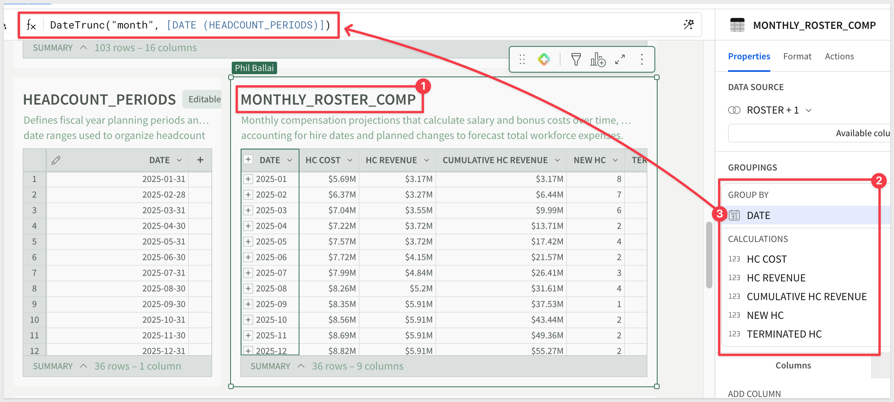

### Revenue-Driven Recommendation Formula

The recommended capacity calculation on Build Plan is a formula — not a model call. It scales the current active headcount by one-tenth of the revenue growth percentage:

```
Count([ROSTER_SOURCE/STATUS]) * ([rev-growth-1] / 10)
```

At 75% projected growth, this recommends adding 7.5% of the current roster. The slider control sets the `rev-growth-1` value, which drives both the percentage display and the role count recommendation in real time.

<!-- 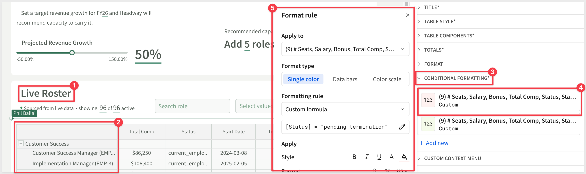 -->

### Conditional Formatting on the Live Roster

The Live Roster pivot table uses two conditional formats to make plan status visible without filtering:

- **Green row** (`#F4FBE9`) — rows where Status is `offer_pending` or `backfilled_employee` (newly staged roles)
- **Red row** (`#FFF2F0`) — rows where Status is `pending_termination`


These formats are applied at the pivot table level — no formula column is required. The same color logic carries through to the HC Updates by Department table on Review & Submit, where the NET HC and PROPOSED HC Δ columns use the same green/red palette.

### Status-Driven Visibility

The Live Roster on the Build Plan page excludes `terminated_employee` rows by default, so terminated positions disappear from planning surfaces automatically — there's no manual cleanup step when terminations are logged:

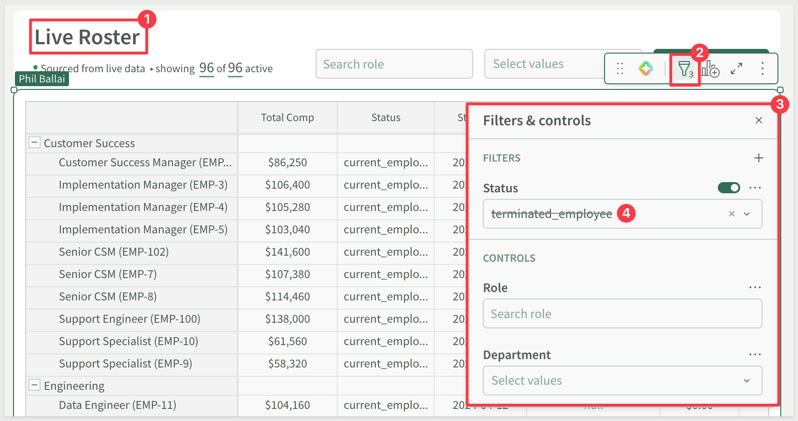

The **HC Updates by Department** table on `Review & Submit` uses the same `STATUS` field to separate headcount into three buckets: 
- `current_employee`
- `offer_pending` / `backfilled_employee`
- `terminated_employee` / `pending_termination`

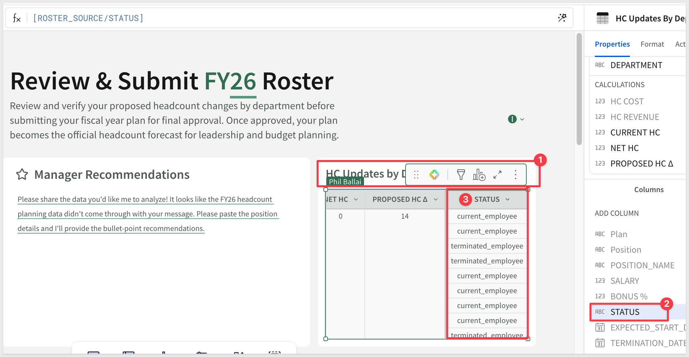

The color-coded NET HC and PROPOSED HC Δ columns reflect the same green/red logic as the Live Roster row highlights.

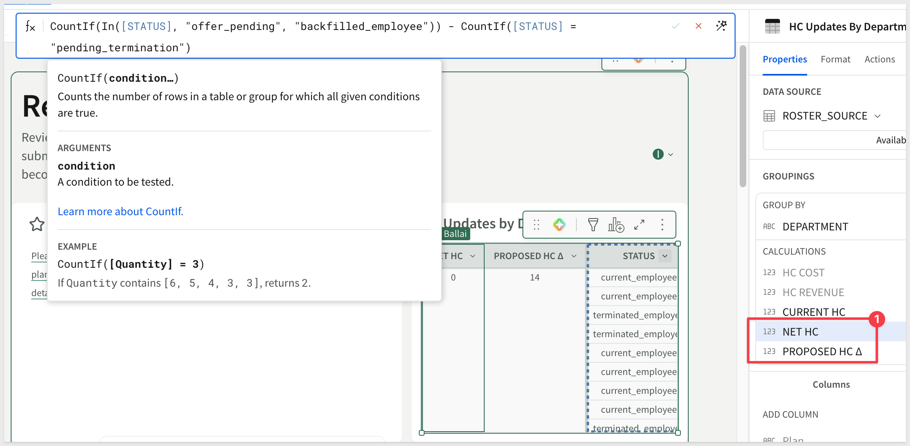


<!-- END OF SECTION-->

## Connect Your Own Data
Duration: 5

Because the Headcount Planning app writes to input tables backed by a warehouse connection, connecting it to your own workforce data comes down to two steps: pointing the input tables to the correct connection and replacing the sample roster with your actual employee records.

### Verify the Write-Back Connection

On the **Data** page (visible in Edit mode), open the ROSTER, NEW_HIRES, and TERMINATIONS input tables and confirm each one points to a warehouse where your org has write access. Input table connection settings are managed directly on the input table — select the table, then use the connection dropdown in its configuration to update the target warehouse.

<!--  -->

<aside class="negative">
<strong>NOTE:</strong><br> All input tables should point to the same connection. Mixing connections across tables in the same app can cause unexpected behavior when Sigma resolves joins at query time.
</aside>

### Load Your Workforce Data

The sample data uses fictional Headway employees. To replace it with your actual roster:

1. Open the ROSTER input table in `Edit data` mode
2. Delete or overwrite the sample rows with your employee records

The minimum required columns are:

| Column | Description |
|--------|-------------|
| Position | Role title |
| POSITION_NAME | Display name for the role |
| DEPARTMENT | Team or org unit |
| SALARY | Base salary |
| BONUS % | Bonus as a decimal (e.g., 0.15 for 15%) |
| STATUS | Use `current_employee` for existing headcount |
| EXPECTED_START_DATE | Hire date |

Revenue and ROI columns (TTV, TTV Date, ROI, Revenue) are optional — the core planning and submission workflow functions without them, but the ROI column on the Live Roster will show blank values.

### What Carries Over Automatically

Once the roster is updated with your data:

- The Headcount Outlook page metrics recalculate from your actual headcount and compensation
- Monthly Compensation Projections reflect your real salary distribution and start dates
- The revenue-driven recommendation scales from your actual roster size
- AI-generated role descriptions on Headcount Outlook generate from your actual position names
- Manager Recommendations on Review & Submit analyze your actual proposed changes

No formula changes are needed — the app reads from the ROSTER table and applies the same calculations regardless of which employees are in it.

<aside class="positive">
<strong>NOTE:</strong><br> Your personal copy of the template starts with Headway sample data pre-loaded. Once you've loaded your own roster, delete the sample rows from the ROSTER input table to start with a clean planning baseline.
</aside>


<!-- END OF SECTION-->

## What We've Covered
Duration: 5

The Headcount Planning Starter App demonstrates how Sigma's native features — input tables, controls, conditional formatting, and AI — can be composed into a full workforce planning workflow without external tools or custom code.

Three input tables — ROSTER, NEW_HIRES, and TERMINATIONS — feed a computed ROSTER_SOURCE that every visualization reads from, keeping the baseline stable while staged changes accumulate. Controls drive scenario calculations dynamically. Monthly compensation projections are derived from the same data as the planning surface, so they update in real time as changes are staged. The recommendation formula gives planners a quantified starting point tied directly to their revenue target — not a static benchmark.

The three AI features each serve a distinct purpose: role-level context for reviewers scanning proposed changes on Headcount Outlook, open-ended advisory during the build phase via the Plan Advisor, and structured approval guidance on the submission page. All three operate on data the user is already looking at, within Sigma's existing permissions model.

These patterns — scenario modeling via controls, status-driven conditional formatting, and AI layered over live tabular data — apply to any operational planning workflow where structured data entry and real-time scenario analysis need to coexist in a single interface.

**Additional Resource Links**

[Blog](https://www.sigmacomputing.com/blog/)<br>
[Community](https://community.sigmacomputing.com/)<br>
[Help Center](https://help.sigmacomputing.com/hc/en-us)<br>
[QuickStarts](https://quickstarts.sigmacomputing.com/)<br>

Be sure to check out all the latest developments at [Sigma's First Friday Feature page!](https://quickstarts.sigmacomputing.com/firstfridayfeatures/)
<br>

[](https://twitter.com/sigmacomputing)&emsp;
[](https://www.linkedin.com/company/sigmacomputing)&emsp;
[](https://www.facebook.com/sigmacomputing)


<!-- END OF WHAT WE COVERED -->
<!-- END OF QUICKSTART -->
