author: pballai
id: starter_apps_marketing_analytics
summary: starter_apps_marketing_analytics
categories: starterapps
environments: web
status: Hidden
feedback link: https://github.com/sigmacomputing/sigmaquickstarts/issues
tags: 
lastUpdated: 2026-07-14

# Marketing Analytics Starter App

## Overview
Duration: 5

Sigma's **Starter Apps** are ready-to-use applications built on Sigma's native features and connected to sample data. Each one ships fully functional — you can explore it immediately, learn how it's built by switching to edit mode, and adapt it to your own data and workflows without starting from scratch.

The **Marketing Analytics** app gives marketing teams a unified workspace to monitor campaign performance, track budget pacing across channels, build customer segments for targeted outreach, and analyze A/B test results — all against live data. An AI-generated morning brief surfaces the most important signals at the start of each day, and AI-powered statistical analysis helps teams determine when experiment results are ready to act on.

This QuickStart walks through how the app works as a user, how it's designed under the hood, and how to connect it to your own data.

<aside class="negative">
<strong>NOTE:</strong><br> Starter Apps are actively developed and improved by Sigma. The screens, field names, and workflow steps shown in this QuickStart reflect the app at the time of publication and may differ slightly from what you see in your environment.
</aside>

### Target Audience
Marketing analysts, campaign managers, and growth teams evaluating or adopting Sigma for campaign analytics and audience targeting workflows. Solutions Engineers and technical stakeholders exploring the app as a reference design.

### Prerequisites

<ul>
  <li>Access to a Sigma environment.</li>
  <li>The Marketing Analytics Starter App available in your org — find it under <code>Templates</code> > <code>Starter Apps</code>.</li>
  <li><strong>AI provider configured for your organization</strong> — required for the Morning Brief AI summary and A/B test analysis. See <a href="https://help.sigmacomputing.com/docs/configure-ai-features-for-your-organization">Configure AI features for your organization</a></li>
  <li>Some familiarity with Sigma workbooks is helpful but not required.</li>
</ul>

<aside class="positive">
<strong>NOTE:</strong><br> If you don't see Starter Apps in your Templates section, contact your Sigma administrator to confirm availability in your org.
</aside>

### What You'll Learn
- How the Marketing Analytics app works across its four main pages
- The key design patterns behind the app and why they're built that way
- How to connect the app to your own warehouse data


<!-- END OF SECTION-->

## Exploring the App
Duration: 5

### Open and Save the Template

Navigate to `Templates` in the left sidebar. The Marketing Analytics app appears in the `Made by Sigma` collection:

<!-- 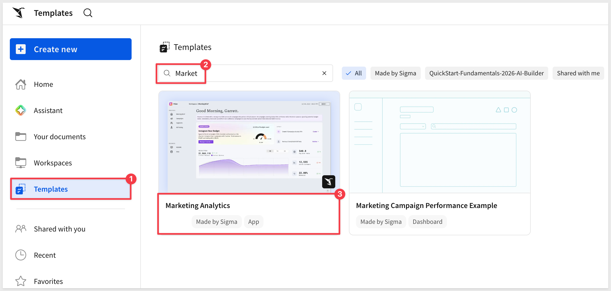 -->

Click the template card to open a preview. Before clicking `Use template`, confirm the requirement shown on the detail page is met:

- **AI provider set up in your organization** — required for the Morning Brief summary and A/B test analysis. See [Configure AI features for your organization](https://help.sigmacomputing.com/docs/configure-ai-features-for-your-organization)

Once that's in place, click `Use template`. Sigma creates a personal copy in your workspace that you can explore, edit, and connect to your own data without affecting the original template:

<!-- 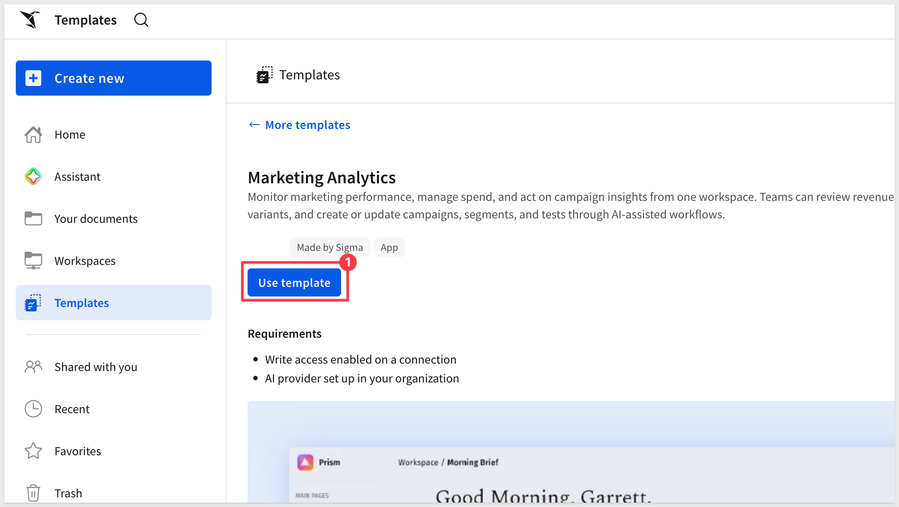 -->

Click `Save as` and give the workbook a name:
```copy-code
Marketing Analytics
```

<aside class="positive">
<strong>NOTE:</strong><br> The original template remains unchanged in the gallery — your saved copy is the working version.
</aside>

### README Page

The app opens on its **README** page, which describes the purpose of each page and the recommended daily workflow at a glance. A short demo video walks through the core features. The README is worth reading before diving in:

<!-- 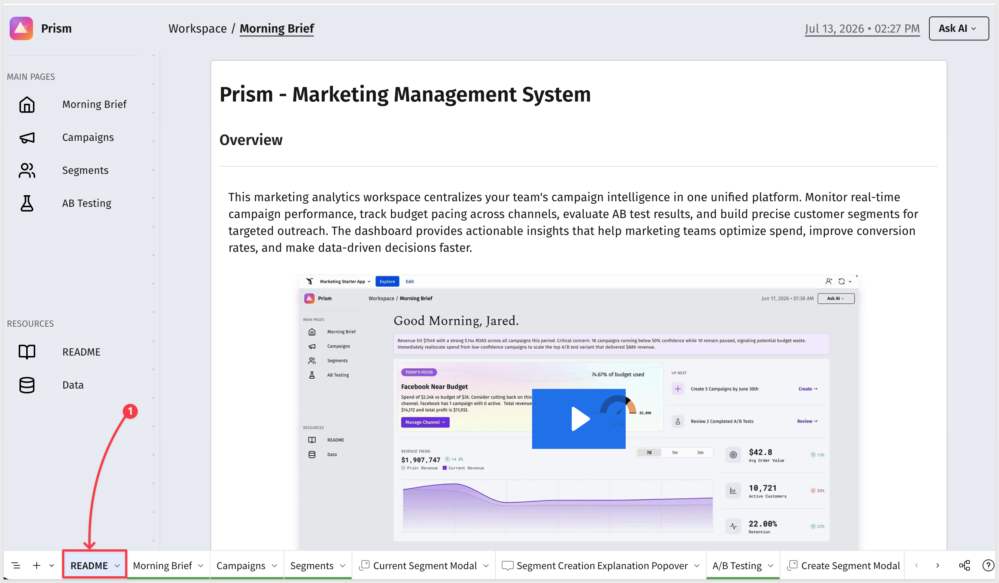 -->

The five-step workflow described in the README:

1. **View Your Morning Brief** — review key metrics, revenue trends, and campaign health to start the day
2. **Review Campaign Budget Pacing** — monitor spend versus plan across all channels and identify campaigns needing adjustment
3. **Build and Refine Customer Segments** — define audience criteria based on customer lifetime value, purchase behavior, and demographics
4. **Analyze A/B Test Performance** — compare variant metrics and determine which approaches drive the highest engagement and conversion
5. **Act on AI Recommendations** — review AI-generated insights throughout the app to identify optimization opportunities

<aside class="negative">
<strong>NOTE:</strong><br> The README is visible to all users of the app. If you adapt this template for your org, update it to reflect your actual data sources, campaign taxonomy, and any workflow changes.
</aside>


<!-- END OF SECTION-->

## Morning Brief
Duration: 10

The **Morning Brief** is the app's starting point for each day. It surfaces the most important signals across campaigns and A/B tests in a single view, without requiring the user to navigate across pages first.

### Personalized Greeting and AI Summary

The page opens with a personalized greeting — `Good Morning, [First Name]` — pulled from the logged-in user's profile using `CurrentUserFirstName()`.

Directly below the greeting, an AI-generated paragraph summarizes the current state of the marketing portfolio. The brief is generated at page load using live data, covering campaign revenue and spend, active vs. paused campaign counts, low-confidence campaigns, and A/B test outcomes:

<!-- 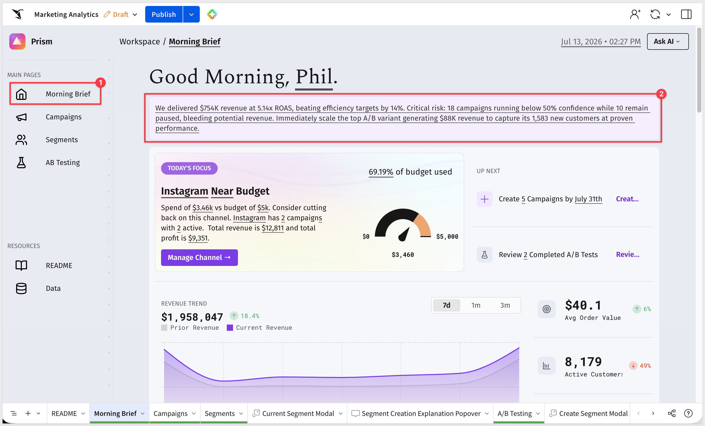 -->

The prompt is stored as an editable control on the Data page, so the framing and focus of the summary can be adjusted without touching the underlying formulas. See the **Under the Hood** section for details.

### Over-Budget Channel Alert

A prominent alert card highlights the channel currently consuming the highest share of its budget. The card shows:

- The channel name and current status (Over or Near budget)
- Spend vs. budget as a percentage
- Absolute spend and budget figures
- Campaign count and active campaign count for that channel
- Total revenue and profit from that channel

<!-- 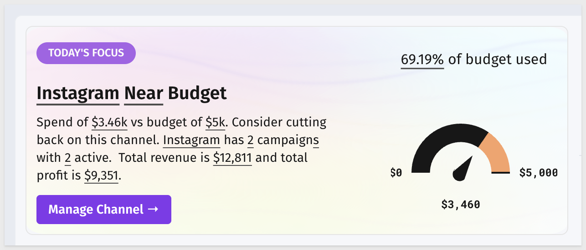 -->

This card updates dynamically — if no channel is over budget, it reflects the channel nearest to its limit.

### Up Next

Below the alert card, an **Up Next** panel lists the two most time-sensitive actions for the current period:

- **Create campaigns** — shows the number of campaigns to create before end of month and the target date
- **Review completed A/B tests** — shows the count of completed tests awaiting a decision

<!-- 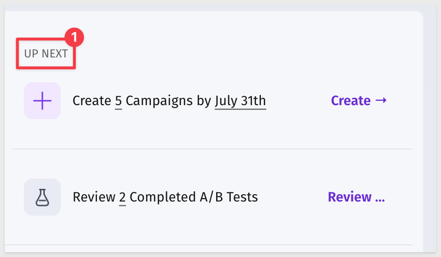 -->

### Revenue Trend

A segmented time period control lets you switch the revenue trend chart between **7d**, **1m**, and **3m** views. The KPI card below the control shows last-week revenue with a week-over-week comparison:

<!-- 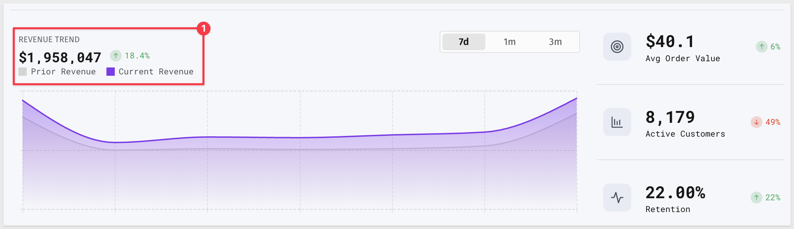 -->

This section is designed to be a 30-second read — the goal is to identify whether the number is trending the right direction before navigating to deeper pages.


<!-- END OF SECTION-->

## Budgeting Campaigns
Duration: 10

The **Budgeting Campaigns** page is where you monitor spend versus planned budgets across all marketing channels and campaigns for the current period.

### Budget Pacing Overview

The top of the page shows a summary of budget pacing across all channels. Visual indicators highlight over-spend and under-spend situations so the most critical channels surface immediately:

<!-- 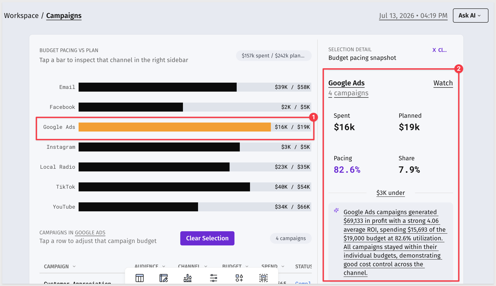 -->

### Campaign Detail

Clicking into an individual campaign opens a detail view showing:

- Performance metrics: impressions, click-through rate, conversion rate
- Spend vs. budget: actual spend, planned budget, and variance
- Return on ad spend (ROAS) and profit

<!-- 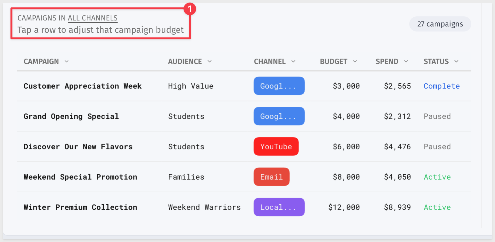 -->

Use this page for weekly budget reviews and mid-campaign optimizations. The channel-level view shows which channels are delivering the best return relative to their budget allocation, while the campaign-level view identifies specific campaigns to pause, adjust, or scale.

<aside class="positive">
<strong>WHY IT MATTERS:</strong><br> Monitoring budget pacing against plan at the channel and campaign level prevents overspend from going undetected until end-of-period. The visual pacing indicators give campaign managers an immediate signal on where to focus before they need to pull a separate report.
</aside>


<!-- END OF SECTION-->

## Segments
Duration: 10

The **Segments** page lets you define customer audience groups using behavioral and demographic filters, then preview the segment size and total value before saving.

### Building a Segment

The segment builder works through a set of filter criteria on the left panel. Available dimensions include:

- **Customer Lifetime Value (CLV) percentile** — target high-value customers by percentile range
- **Purchase recency** — filter by days since last purchase
- **Payment preferences** — filter by preferred payment method
- **Location** — filter by region or market

As you adjust the filters, the right panel updates in real time to show:

- **Segment size** — the number of customers matching the current criteria
- **Total customer value** — the aggregate CLV of matched customers
- A distribution chart showing how the filtered segment sits within the full customer base

<!-- 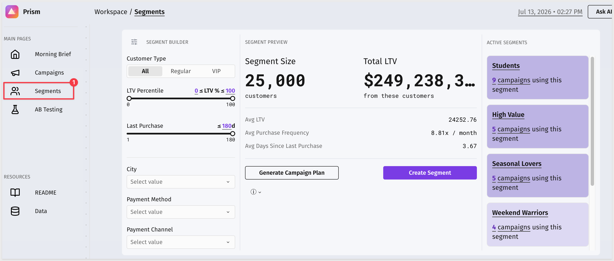 -->

### Saving a Segment

Once the segment criteria are set and the size looks right, give the segment a name and click `Save`. Saved segments are available for use in campaign targeting:

<!-- 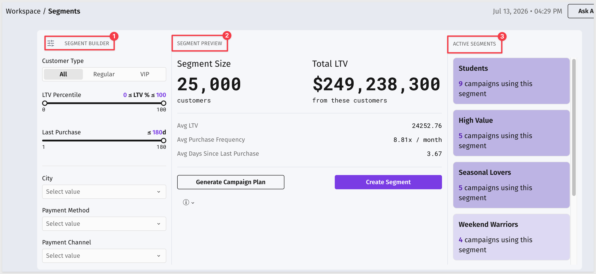 -->

<aside class="positive">
<strong>WHY IT MATTERS:</strong><br> Building segments directly in the same environment where campaign data lives eliminates the copy-paste loop between analytics tools and campaign platforms. Marketers can define an audience, verify its size, and hand it off to campaign execution without exporting to a spreadsheet.
</aside>


<!-- END OF SECTION-->

## AB Testing
Duration: 10

The **AB Testing** page displays all active and completed experiments with side-by-side performance comparisons across variants.

### Experiment List

The page opens with a list of experiments, each showing its current status — Active, Completed, or Winner Declared. Clicking an experiment loads the variant comparison:

<!-- 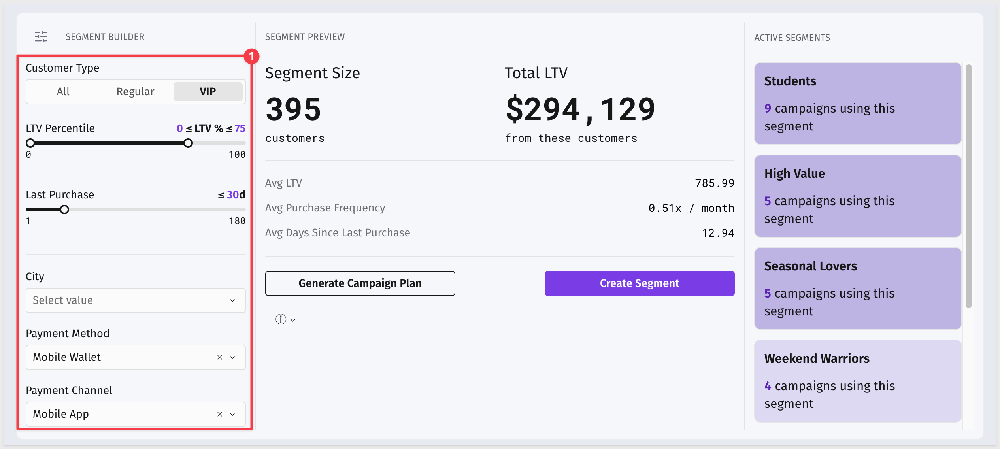 -->

### Variant Comparison

For each experiment, the detail view shows a side-by-side breakdown of all variants. The metrics shown for each variant include:

- Impressions
- Click-through rate (CTR)
- Conversion rate
- Customer acquisition cost (CAC)
- Revenue
- New customers acquired

<!-- 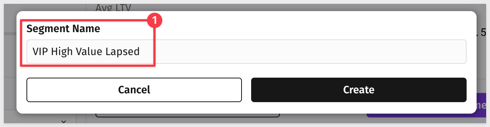 -->

### AI-Powered Statistical Analysis

For experiments where results look promising but statistical significance isn't clear, use the `Request analysis` button to generate an AI assessment. The analysis evaluates whether the observed differences are significant given the sample sizes, and returns a recommendation on whether to declare a winner, extend the test, or conclude it without a winner:

<!-- 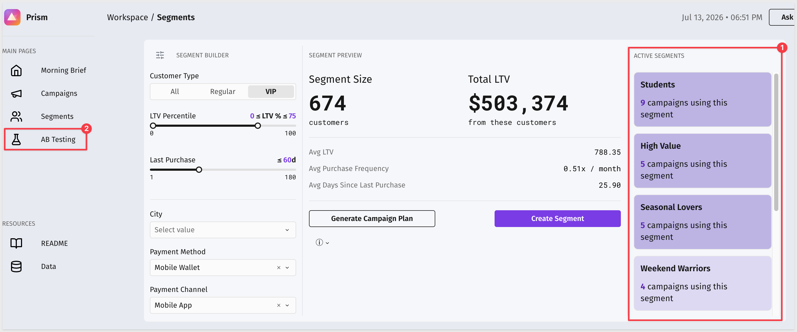 -->

<aside class="positive">
<strong>WHY IT MATTERS:</strong><br> Calling a test too early based on directional results is one of the most common mistakes in A/B testing. The AI analysis applies statistical reasoning to the actual sample sizes rather than relying on a marketer's intuition about whether the lift is "big enough."
</aside>


<!-- END OF SECTION-->

## Under the Hood
Duration: 10

The **Data** page contains every backend table that powers the app. Each table is labeled with its purpose. Here's how the pieces fit together.

### The Data Sources

The app draws from several warehouse tables covering:

- **Marketing Campaigns** — campaign-level records with status, channel, budget, actual spend, ROAS, revenue, profit, and confidence score
- **AB Tests** — experiment records with status (Active, Completed, Winner Declared) and test metadata
- **AB Variants** — variant-level records for each experiment: impressions, CTR, conversion rate, CAC, revenue, and new customers
- **Orders / Order Lines** — transactional data used to compute revenue trend KPIs and customer segmentation dimensions

<!-- 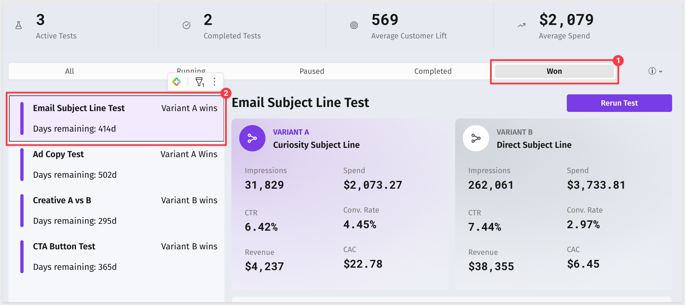 -->

These are the tables you replace when connecting to your own data. See the **Connect Your Own Data** section for details.

### AI Prompts as Editable Controls

All AI-generated content in the app is driven by editable prompts stored on the Data page's **AI** tab — not hardcoded into workbook elements. This includes:

- **Morning Brief prompt** — drives the daily portfolio summary. The prompt injects live campaign metrics (revenue, spend, ROAS, active vs. paused counts, low-confidence campaigns, A/B test outcomes) into the model context before generating the summary
- **AB Test analysis prompt** — drives the statistical significance assessment on the AB Testing page

<!-- 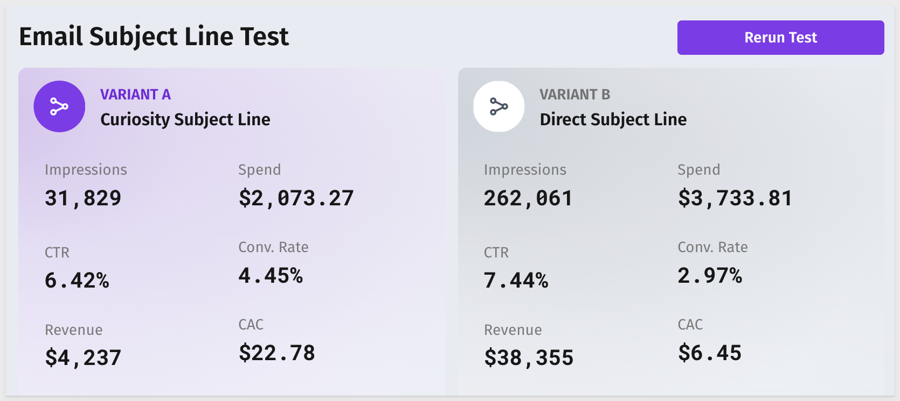 -->

<aside class="positive">
<strong>WHY IT MATTERS:</strong><br> Storing prompts on a dedicated tab separates content from structure. Marketing operations leads can adjust what the AI brief covers — adding channels, changing the focus, or tuning the tone — without touching any formulas or layout. The prompts are visible and auditable in one place.
</aside>

### The Over-Budget Channel Card

The alert card on the Morning Brief is driven by a helper table called `Over Budget Channel` that pre-aggregates the channel with the highest spend-to-budget ratio. The `If([Actual Spend] > [Budget], "Over", "Near")` label and the dynamic text are applied at the card level against this pre-computed result, keeping the card logic simple while the filtering happens in the helper:

<!-- 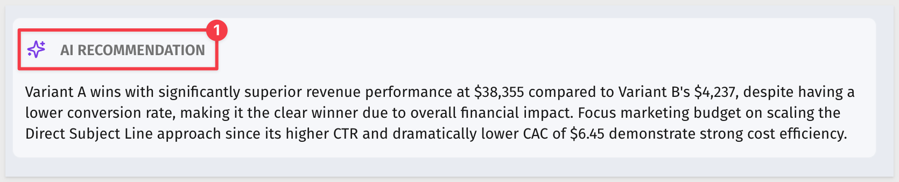 -->


<!-- END OF SECTION-->

## Connect Your Own Data
Duration: 5

The Marketing Analytics app is designed to work with any campaign management and order dataset. The source tables to replace are on the Data page.

### What the App Needs

**Marketing Campaigns table:**

| Column | Description |
|--------|-------------|
| Campaign Id | Unique campaign identifier |
| Status | Active, Paused, or Completed |
| Channel | Marketing channel (e.g., Email, Paid Social, Search) |
| Budget Usd | Planned budget for the campaign |
| Actual Spend Usd | Current spend against the budget |
| Revenue | Revenue attributable to the campaign |
| ROAS | Return on ad spend |
| Profit | Revenue minus spend |
| Confidence Score | A 0–1 score indicating model or analyst confidence in attribution |

**AB Tests and AB Variants tables:**

| Column | Description |
|--------|-------------|
| Test Id | Unique experiment identifier |
| Status | Active, Completed, or Winner Declared |
| Variant metrics | Impressions, CTR, conversion rate, CAC, revenue, new customers per variant |

**Orders / Order Lines table:**

| Column | Description |
|--------|-------------|
| Order Ts Local | Transaction timestamp used for revenue trend calculations |
| Order Total Usd | Order value used for KPI aggregation |
| Store Id | Dimension used in customer segmentation |

### How to Swap the Sources

On the `Data` page, open each source table in edit mode. Use `Change source` to point the table at your own connection and warehouse tables. Map your columns to the existing column references used throughout the workbook.

<!-- 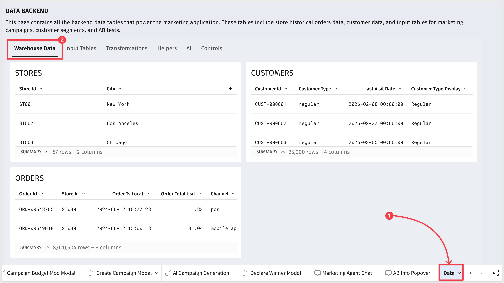 -->

<aside class="negative">
<strong>NOTE:</strong><br> Column names in Sigma formulas and controls reference the source table columns by name. After swapping sources, verify that your column names match — or update the formula references on the Data page if they differ.
</aside>

### What Carries Over Automatically

Once sources are swapped and columns are mapped correctly:

- The Morning Brief AI summary recalculates against your live campaign data
- The Over-Budget Channel card reflects your actual spend and budget figures
- The Segments builder populates from your customer and order data
- The AB Testing page displays your experiments and variants
- The Up Next panel counts from your campaign and test records


<!-- END OF SECTION-->

## What We've Covered
Duration: 5

This QuickStart walked through the Marketing Analytics app from end to end: exploring the daily Morning Brief, monitoring campaign budgets, building customer segments, analyzing A/B tests, and examining the design decisions that make the app work.

The **AI-generated Morning Brief** demonstrates a practical pattern for surface-level operational intelligence. Rather than requiring a dashboard review to understand portfolio health, the brief delivers a plain-language summary of the most important signals — generated from live data at load time, against a prompt that any marketing operations lead can tune without touching formulas. The same pattern applies to any domain where a daily summary would reduce time-to-action.

The **budget pacing view** with channel and campaign drill-through shows how to structure a monitoring workflow so the right level of detail is one click away rather than a separate report. The channel-level view answers "where is the problem?" and the campaign view answers "which specific campaign?". That two-level structure is reusable in any operational app where spend, utilization, or capacity needs to be tracked against a plan.

The **segment builder** demonstrates how to bring audience definition into the same environment as the underlying data. Filtering by CLV percentile, recency, payment preference, and location — with a live preview of segment size and value — closes the loop between analysis and activation without an export step.

The **A/B test analysis with AI significance testing** shows how to integrate statistical reasoning into an operational workflow without requiring the user to understand the math. The AI assessment takes the sample sizes and observed metrics as input and returns a recommendation — a pattern directly applicable to any experiment-driven decision process.

**Additional Resource Links**

[Blog](https://www.sigmacomputing.com/blog/)<br>
[Community](https://community.sigmacomputing.com/)<br>
[Help Center](https://help.sigmacomputing.com/hc/en-us)<br>
[QuickStarts](https://quickstarts.sigmacomputing.com/)<br>

Be sure to check out all the latest developments at [Sigma's First Friday Feature page!](https://quickstarts.sigmacomputing.com/firstfridayfeatures/)
<br>

[](https://twitter.com/sigmacomputing)&emsp;
[](https://www.linkedin.com/company/sigmacomputing)&emsp;
[](https://www.facebook.com/sigmacomputing)


<!-- END OF WHAT WE COVERED -->
<!-- END OF QUICKSTART -->
