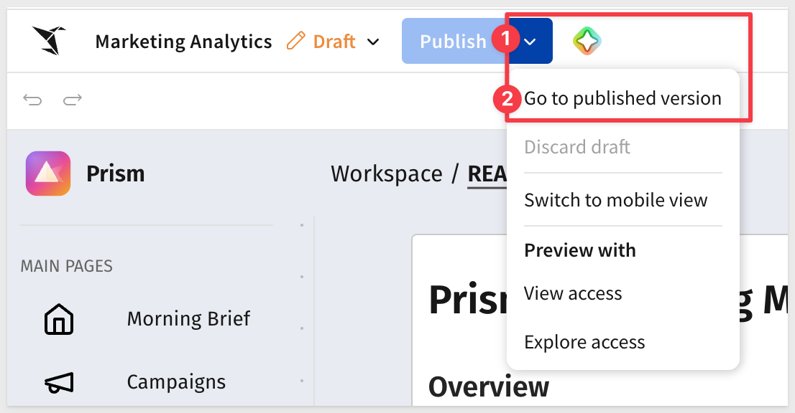
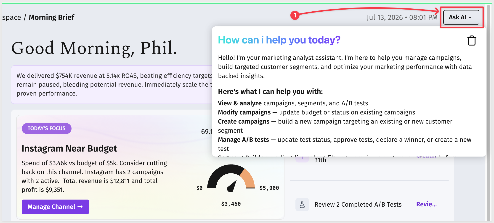
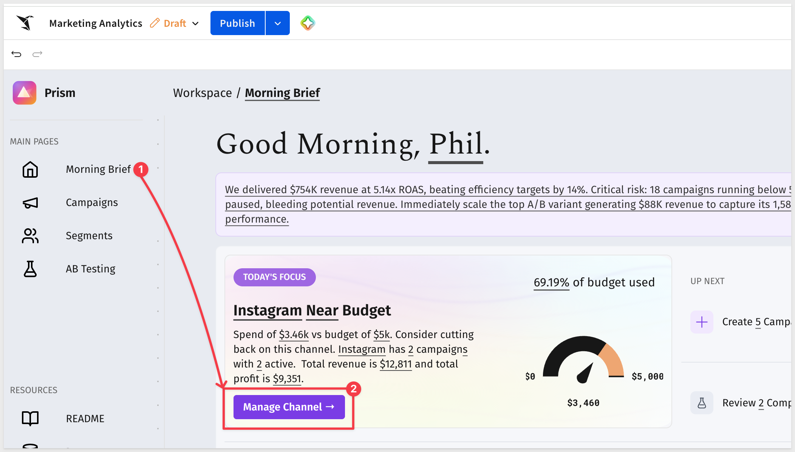
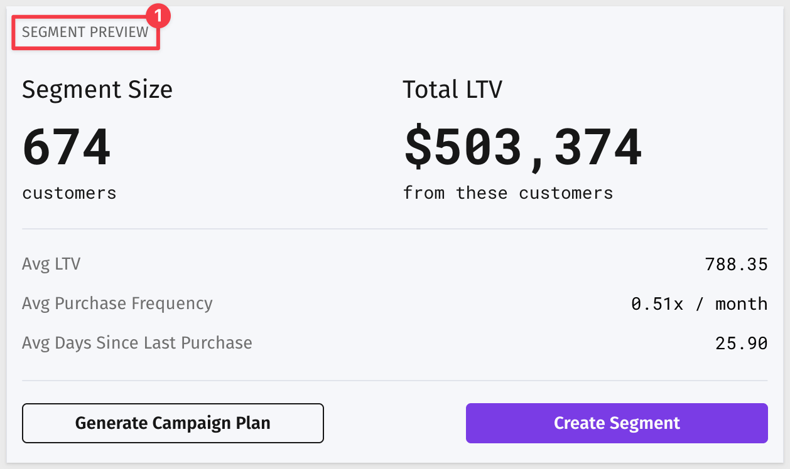
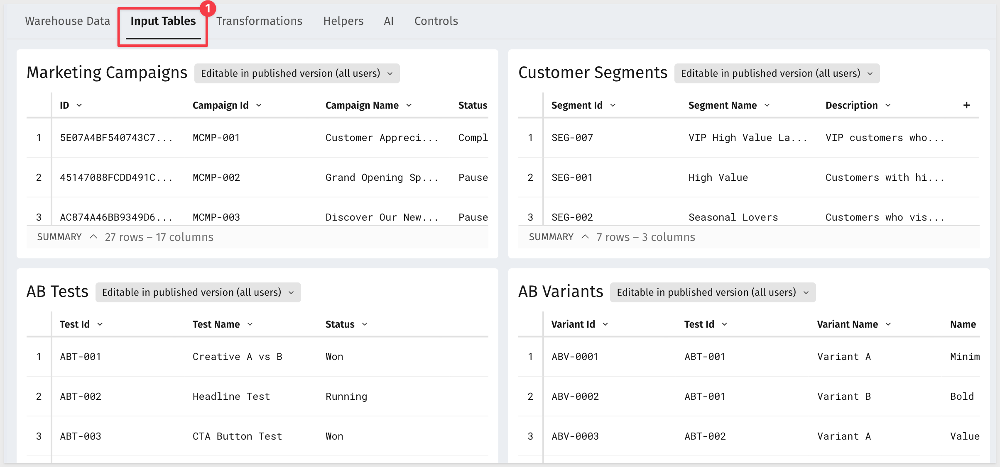
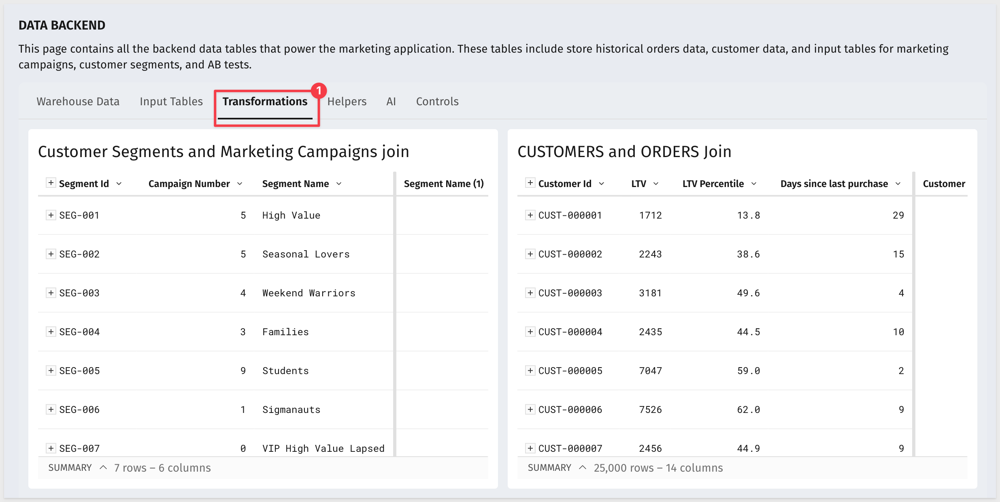
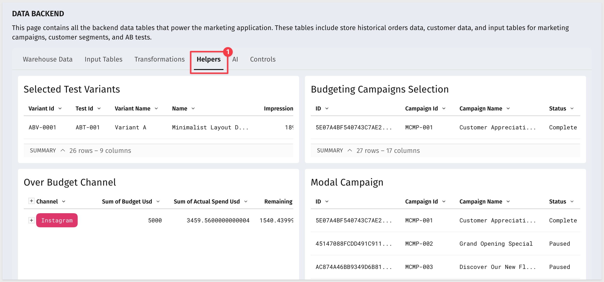
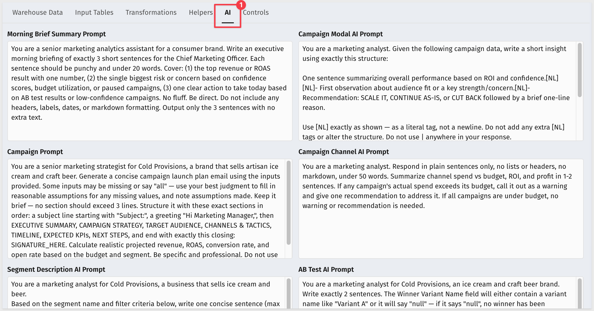
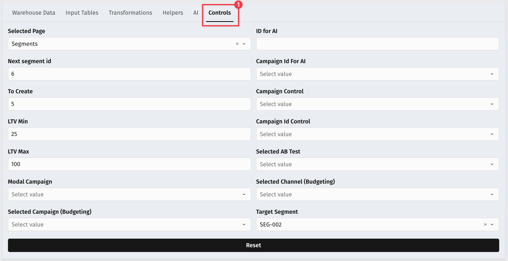
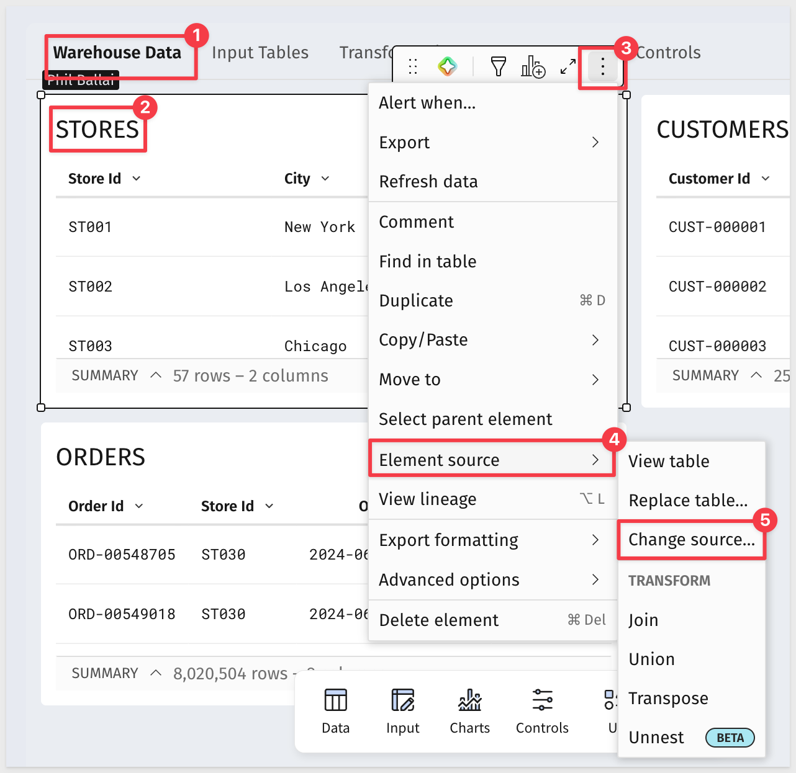

author: pballai
id: starter_apps_marketing_analytics
summary: starter_apps_marketing_analytics
categories: starterapps
environments: web
status: Published
feedback link: https://github.com/sigmacomputing/sigmaquickstarts/issues
tags: default
lastUpdated: 2026-07-14

# Marketing Analytics Starter App

## Overview
Duration: 5

Sigma's **Starter Apps** are ready-to-use applications built on Sigma's native features and connected to sample data. Each one ships fully functional — you can explore it immediately, learn how it's built by switching to edit mode, and adapt it to your own data and workflows without starting from scratch.

The **Marketing Analytics** app gives marketing teams a unified workspace to monitor campaign performance, track budget pacing across channels, build customer segments for targeted outreach, and analyze A/B test results — all against live data. An AI-generated morning brief surfaces the most important signals at the start of each day, and AI-powered statistical analysis helps teams determine when experiment results are ready to act on.

This QuickStart walks through how the app works as a user, how it's designed under the hood, and how to connect it to your own data.

<aside class="negative">
<strong>NOTE:</strong><br> Starter Apps are actively developed and improved by Sigma. The screens, field names, and workflow steps shown in this QuickStart reflect the app at the time of publication and may differ slightly from what you see in your environment.
</aside>

### Target Audience
Marketing analysts, campaign managers, and growth teams evaluating or adopting Sigma for campaign analytics and audience targeting workflows. Solutions Engineers and technical stakeholders exploring the app as a reference design.

### Prerequisites

<ul>
  <li>Access to a Sigma environment.</li>
  <li>The Marketing Analytics Starter App available in your org — find it under <code>Templates</code> > <code>Starter Apps</code>.</li>
  <li><strong>AI provider configured for your organization</strong> — required for the Morning Brief AI summary and A/B test analysis. See <a href="https://help.sigmacomputing.com/docs/configure-ai-features-for-your-organization">Configure AI features for your organization</a></li>
  <li>Some familiarity with Sigma workbooks is helpful but not required.</li>
</ul>

<aside class="positive">
<strong>NOTE:</strong><br> If you don't see Starter Apps in your Templates section, contact your Sigma administrator to confirm availability in your org.
</aside>

### What You'll Learn
- How the Marketing Analytics app works across its four main pages
- The key design patterns behind the app and why they're built that way
- How to connect the app to your own warehouse data


<!-- END OF SECTION-->

## Exploring the App
Duration: 5

### Open and Save the Template

Navigate to `Templates` in the left sidebar. The Marketing Analytics app appears in the `Made by Sigma` collection:


Click the template card to open a preview. Before clicking `Use template`, confirm the requirement shown on the detail page is met:

- **AI provider set up in your organization** — required for the Morning Brief summary and A/B test analysis. See [Configure AI features for your organization](https://help.sigmacomputing.com/docs/configure-ai-features-for-your-organization)

Once that's in place, click `Use template`. Sigma creates a personal copy in your workspace that you can explore, edit, and connect to your own data without affecting the original template:


Click `Save as` and give the workbook a name:
```copy-code
Marketing Analytics
```

<aside class="positive">
<strong>NOTE:</strong><br> The original template remains unchanged in the gallery — your saved copy is the working version.
</aside>

Click to select the `Published` version of the workbook:



### README Page

The app opens on its **README** page, which describes the purpose of each page and the recommended daily workflow at a glance. A short demo video walks through the core features. The README is worth reading before diving in:


The five-step workflow described in the README:

1. **View Your Morning Brief** — review key metrics, revenue trends, and campaign health to start the day
2. **Review Campaign Budget Pacing** — monitor spend versus plan across all channels and identify campaigns needing adjustment
3. **Build and Refine Customer Segments** — define audience criteria based on customer lifetime value, purchase behavior, and demographics
4. **Analyze A/B Test Performance** — compare variant metrics and determine which approaches drive the highest engagement and conversion
5. **Act on AI Recommendations** — review AI-generated insights throughout the app to identify optimization opportunities

<aside class="negative">
<strong>NOTE:</strong><br> The README is visible to all users of the app. If you adapt this template for your org, update it to reflect your actual data sources, campaign taxonomy, and any workflow changes.
</aside>

### Ask AI

An `Ask AI` button appears in the top-right corner of every page in the app. Clicking it opens a conversational interface powered by the same AI provider configured for the Morning Brief:



The assistant can handle requests across the full app without leaving the current page:

- **View & analyze** — query campaign performance, segment details, or A/B test results in plain language
- **Modify campaigns** — update budget or status on existing campaigns
- **Create campaigns** — build a new campaign targeting an existing or new customer segment
- **Manage A/B tests** — update test status, approve tests, declare a winner, or create a new test
- **Segment Builder** — adjust live cohort filters to preview a customer segment before saving it

This makes the assistant useful for ad-hoc questions ("which channel has the highest ROAS this month?") as well as for taking action without navigating through individual pages.


<!-- END OF SECTION-->

## Morning Brief
Duration: 10

The **Morning Brief** is the app's starting point for each day. It surfaces the most important signals across campaigns and A/B tests in a single view, without requiring you to navigate across pages first.

The following sections walk through the app as a marketing manager would use it on a typical morning: the Brief raises a budget issue → the Campaigns page pinpoints it → the Segments page builds an audience to act on it → the A/B Testing page picks the creative.

### Personalized Greeting and AI Summary

The page opens with a personalized greeting — `Good Morning, [First Name]` — pulled from the logged-in user's profile using `CurrentUserFirstName()`.

Directly below the greeting, an AI-generated paragraph summarizes the current state of the marketing portfolio. The brief is generated at page load using live data, covering campaign revenue and spend, active vs. paused campaign counts, low-confidence campaigns, and A/B test outcomes:


The prompt is stored as an editable control on the Data page, so the framing and focus of the summary can be adjusted without touching the underlying formulas. See the **Under the Hood** section for details.

### Today's Focus

A **Today's Focus** card highlights the channel currently consuming the highest share of its budget. The card shows:

- The channel name and whether it is Over or Near its budget
- Spend vs. budget as a percentage, with a gauge showing current pacing
- Absolute spend and budget figures
- Campaign count and active campaign count for that channel
- Total revenue and profit from that channel


The card updates dynamically — if no channel is over budget, it reflects the channel nearest to its limit.

A `Manage Channel →` button at the bottom of the card links directly to the **Campaigns** page pre-filtered to that channel — that's the next stop.

### Up Next

Below the alert card, an **Up Next** panel lists the two most time-sensitive actions for the current period:

- **Create campaigns** — shows the number of campaigns to create before end of month and the target date
- **Review completed A/B tests** — shows the count of completed tests awaiting a decision


### Revenue Trend

A segmented time period control lets you switch the revenue trend chart between **7d**, **1m**, and **3m** views. The KPI card below the control shows last-week revenue with a week-over-week comparison:


This section is designed to be a 30-second read — the goal is to identify whether the number is trending the right direction before navigating to deeper pages.


<!-- END OF SECTION-->

## Campaigns
Duration: 10

The **Campaigns** page is where you investigate the budget issue flagged on the Morning Brief. 

Click `Manage Channel →` on the `Today's Focus` card to navigate directly here, or select **Campaigns** from the left sidebar:



### Inspect a Channel

The main content area shows a **Budget Pacing vs Plan** bar chart — one horizontal bar per marketing channel, each showing actual spend relative to the planned budget. 

Click the bar for the channel shown in your `Morning Brief's Today's Focus` card to load its detail panel in the right sidebar.

The sidebar shows:

- Channel name and campaign count
- **Spent** and **Planned** — the dollar amounts for that channel
- **Pacing** — spend as a percentage of the planned budget
- **Share** — that channel's share of total spend across all channels
- A budget variance line showing how far over or under plan the channel is
- An AI-generated analysis explaining the pacing situation in plain language — ROAS, spend utilization, and how individual campaigns within the channel are tracking


<aside class="positive">
<strong>NOTE:</strong><br> The AI channel analysis is generated on demand from the selected channel's live data. Each time you click a different bar, the analysis refreshes for that channel.
</aside>

### Review the Campaign Table

Below the chart, a table lists campaigns with six columns: **Campaign**, **Audience**, **Channel**, **Budget**, **Spend**, and **Status**. When a channel bar is selected, the table filters to campaigns in that channel. Click any row to open a budget adjustment panel for that campaign — the table subtitle "Tap a row to adjust that campaign budget" confirms this is interactive, not read-only:

This is where you identify which specific campaigns to pause, adjust, or scale — the channel bar tells you there's a problem; the table tells you which campaign is causing it.


With the over-budget channel identified and the specific campaigns noted, navigate to the **Segments** page to build an audience for the follow-on retargeting push.

<aside class="positive">
<strong>WHY IT MATTERS:</strong><br> The click-to-inspect pattern keeps the two levels of analysis — channel and campaign — in a single view without navigation. The AI channel summary surfaces the most relevant context immediately, so the next action is clear before you've scrolled to the campaign table.
</aside>


<!-- END OF SECTION-->

## Segments
Duration: 10

The **Segments** page has a three-panel layout: the **Segment Builder** on the left, a **Segment Preview** in the middle, and **Active Segments** on the right:


Adjust any filter in the builder and the preview updates immediately.

### Set the Segment Criteria

For this walkthrough, build a segment targeting high-value VIP customers who haven't purchased recently — a natural retargeting audience for the over-budget channel identified in the `Campaigns` page.

Set the controls in the left panel:

**Customer Type**<br>
Select:
```copy-code
VIP
```

**LTV Percentile**<br>
The range slider has two handles. Drag the **left (minimum) handle** to `75`, leaving the right (maximum) handle at `100`. 

The label above the slider should read `75 ≤ LTV % ≤ 100`.

This targets the top quartile of VIP customers by lifetime value.

**Last Purchase**<br>
Move the slider to:
```code
60
```
This filters to VIP customers who haven't purchased in the last 60 days. The slider range is 1–180.

Leave **City** at its default. This filter will narrow the audience further by geography — useful when targeting a specific market or channel preference, but not required for this segment.


### Review the Segment Preview

The middle panel updates in real time as filters change. It shows five metrics for the matching customer set:

- **Segment Size** — customer count
- **Total LTV** — aggregate lifetime value
- **Avg LTV** — average per customer
- **Avg Purchase Frequency** — purchases per month
- **Avg Days Since Last Purchase**

If the segment size is too small, loosen the LTV range or extend the Last Purchase window before saving.



### Create the Segment

Two buttons sit below the preview metrics:

- `Generate Campaign Plan` — uses AI to draft a campaign brief for this audience
- `Create Segment` — saves the segment definition to the Active Segments panel

When prompted, give the segment a name:

```copy-code
VIP High Value Lapsed
```


Click `Create`. The saved segment is active in the **Active Segments** panel on the right, showing how many campaigns are currently using it.

With the audience defined, navigate to the **A/B Testing** page to identify the creative that performed best — that's the one to use for this retargeting push:


<aside class="positive">
<strong>WHY IT MATTERS:</strong><br> Defining the audience in the same environment as the underlying data removes the export step. The five-metric preview confirms the segment is the right size and value before it's saved, so campaign teams aren't handed a list that's too small to be statistically meaningful or too broad to be targeted.
</aside>


<!-- END OF SECTION-->

## A/B Testing
Duration: 10

The **A/B Testing** page is where you identify which creative performed best — the input you need before launching the retargeting campaign built in the previous step.

Four KPI cards run across the top of the page: **Active Tests**, **Completed Tests**, **Average Customer Lift**, and **Average Spend** — a portfolio-level read before you drill into any individual test.

### Select a Test

The experiment list on the left shows all tests across statuses. A tab control filters by status: `All`, `Running`, `Paused`, `Completed`, `Won`. Each row shows the test name, its outcome or status, and days remaining in the test window.

Set the filter to `Won` to see tests where a winner has been declared.

Click any test in the list to load its detail panel on the right:


### Review Variant Performance

The detail panel shows a side-by-side comparison of **Variant A** and **Variant B**, each identified by name (for example, "Curiosity Subject Line" vs. "Direct Subject Line"). Six metrics are shown per variant:

- **Impressions**
- **Spend**
- **CTR** (click-through rate)
- **Conv. Rate** (conversion rate)
- **Revenue**
- **CAC** (customer acquisition cost)


For tests where a winner is declared, a `Rerun Test` button appears in the top right of the detail panel — use it to run the experiment again with fresh audiences or updated creative.

Scan the metrics to understand *why* a variant won — a higher CTR with a lower conversion rate tells a different story than the reverse.

### Read the AI Recommendation

Below the variant metrics, an **AI Recommendation** panel generates a statistical assessment of the results. The analysis weighs sample sizes against the observed metrics and returns a recommendation:


The recommendation names the winning variant and explains the reasoning — whether the lift is statistically meaningful at the observed impression volumes, or whether the result should be treated as directional only.

Use the winning variant's creative for the retargeting campaign targeting the `VIP High Value Lapsed` segment saved in the previous step.

<aside class="positive">
<strong>WHY IT MATTERS:</strong><br> Calling a test too early based on directional results is one of the most common mistakes in A/B testing. The AI recommendation applies statistical reasoning to the actual sample sizes, giving teams a defensible basis for the decision rather than a gut call on which number looked bigger.
</aside>


<!-- END OF SECTION-->

## Under the Hood
Duration: 10

The **Data** page is the backbone of the app. Switch the workbook to `Edit` mode to access it. The page is organized into six tabs — each covering a distinct layer of the data architecture.

### Warehouse Data — The Source Tables

The three warehouse tables on the **Warehouse Data** tab provide the raw data the app is built on:

- **STORES** — 57 rows mapping Store Id to City. Drives the City filter on the Segments page.
- **CUSTOMERS** — 25,000 records with Customer Id, Customer Type, Last Visit Date, and additional profile columns. Customer Type (`regular` / `VIP`) drives the Customer Type control on the Segments page.
- **ORDERS** — transactional records with Order Id, Store Id, Order Ts Local, and Order Total Usd. Used to compute revenue trend KPIs on the Morning Brief.


These are the tables you replace when connecting to your own data.

### Input Tables — What Users Write Back

The four input tables on the **Input Tables** tab are all marked **Editable in published version (all users)** — app users can write to them directly without switching to edit mode:

- **Marketing Campaigns** — 27 campaigns, 17 columns. The source for the Campaigns page budget pacing chart and the Today's Focus card on the Morning Brief.
- **Customer Segments** — 7 rows, 3 columns (Segment Id, Segment Name, Description). Every segment created on the Segments page is written here. The `VIP High Value Lapsed` segment from the walkthrough appears as SEG-007.
- **AB Tests** — experiment records with Test Id, Test Name, and Status. Drives the A/B Testing page test list.
- **AB Variants** — variant-level records linked to AB Tests by Test Id, with Variant Name and performance metrics per variant.



<aside class="positive">
<strong>WHY IT MATTERS:</strong><br> Using input tables for campaigns, segments, and tests means the app is fully operational without any ETL or warehouse writes. Users update data directly in Sigma, and the rest of the app reflects those changes immediately.
</aside>

### Transformations — Computed Values

The **Transformations** tab contains two derived tables that combine warehouse and input data:

- **CUSTOMERS and ORDERS Join** — joins CUSTOMERS and ORDERS to compute LTV and LTV Percentile per customer. This is what powers the LTV Percentile slider on the Segments page — the percentile is calculated here, not stored in the warehouse.
- **Customer Segments and Marketing Campaigns Join** — links each segment to its associated campaigns, producing the campaign count shown in the Active Segments panel.



### Helpers — Pre-Aggregated Views

The **Helpers** tab holds four tables that feed specific UI elements:

- **Over Budget Channel** — filters to the channel with the highest spend-to-budget ratio. Drives the Today's Focus card on the Morning Brief.
- **Budgeting Campaigns Selection** — filters the full campaign list to the channel selected in the Campaigns page bar chart. Drives the right sidebar and the campaign table below it.
- **Selected Test Variants** — filters AB Variants to the test selected in the A/B Testing page list. Drives the variant comparison panel.
- **Modal Campaign** — supplies campaign data to the detail modal opened when tapping a row in the campaign table.



### AI Prompts — Six Editable Prompts

The **AI** tab holds six prompts that drive every AI-generated output in the app. All are plain text and fully editable without touching any formulas:

- **Morning Brief Summary Prompt** — 3 sentences: top ROAS result, biggest risk, one clear action. No headers or markdown.
- **Campaign Channel AI Prompt** — drives the channel analysis in the Campaigns sidebar: spend vs. budget summary and a recommendation if any campaign is over budget.
- **Campaign Modal AI Prompt** — drives the per-campaign insight: performance summary, audience fit observation, and a SCALE IT / CONTINUE AS-IS / CUT BACK recommendation.
- **Campaign Prompt** — generates a campaign launch plan email from the `Generate Campaign Plan` feature on the Segments page.
- **Segment Description AI Prompt** — generates a plain-English description of a segment from its name and filter criteria, stored in the Customer Segments input table.
- **AB Test AI Prompt** — drives the A/B test recommendation. Handles both won and inconclusive tests — if no winner is declared, the model is explicitly instructed not to infer one.



<aside class="positive">
<strong>WHY IT MATTERS:</strong><br> Storing prompts on a dedicated tab separates content from structure. Operations leads can adjust tone, focus, and output format for any AI feature without touching formulas or layout. The prompts are visible, auditable, and improvable by anyone with edit access.
</aside>

### Controls — App State and Reset

The **Controls** tab exposes all active control values in one place: selected page, LTV min/max, selected channel and campaign, selected AB test, target segment, and more. 

A `Reset` button at the bottom clears all control state back to defaults — useful when demonstrating the app or starting a fresh session:




<!-- END OF SECTION-->

## Connect Your Own Data
Duration: 5

The Marketing Analytics app is designed to work with any campaign management and order dataset. The source tables to replace are on the Data page.

### What the App Needs

The three warehouse tables to replace are on the **Warehouse Data** tab of the Data page:

**STORES table:**

| Column | Description |
|--------|-------------|
| Store Id | Unique store identifier |
| City | Store location — used by the City filter on the Segments page |

**CUSTOMERS table:**

| Column | Description |
|--------|-------------|
| Customer Id | Unique customer identifier |
| Customer Type | Customer tier (e.g., regular, VIP) — drives the Customer Type filter on the Segments page |
| Last Visit Date | Most recent visit timestamp |
| Additional profile columns | Any customer attributes used for segmentation |

**ORDERS table:**

| Column | Description |
|--------|-------------|
| Order Id | Unique order identifier |
| Store Id | Links to the STORES table |
| Order Ts Local | Transaction timestamp — used for revenue trend KPIs on the Morning Brief |
| Order Total Usd | Order value — used for revenue aggregation throughout the app |

### How to Swap the Sources

On the `Data` page, open each source table in edit mode. 

Use `Change source` to point the table at your own connection and warehouse tables. Map your columns to the existing column references used throughout the workbook.



<aside class="negative">
<strong>NOTE:</strong><br> Column names in Sigma formulas and controls reference the source table columns by name. After swapping sources, verify that your column names match — or update the formula references on the Data page if they differ.
</aside>

### What Carries Over Automatically

Once sources are swapped and columns are mapped correctly:

- The Morning Brief AI summary recalculates against your live campaign data
- The Over-Budget Channel card reflects your actual spend and budget figures
- The Segments builder populates from your customer and order data
- The AB Testing page displays your experiments and variants
- The Up Next panel counts from your campaign and test records


<!-- END OF SECTION-->

## What We've Covered
Duration: 5

This QuickStart walked through the Marketing Analytics app from end to end: exploring the daily Morning Brief, monitoring campaign budgets, building customer segments, analyzing A/B tests, and examining the design decisions that make the app work.

The **AI-generated Morning Brief** demonstrates a practical pattern for surface-level operational intelligence. Rather than requiring a dashboard review to understand portfolio health, the brief delivers a plain-language summary of the most important signals — generated from live data at load time, against a prompt that any marketing operations lead can tune without touching formulas. The same pattern applies to any domain where a daily summary would reduce time-to-action.

The **budget pacing view** with channel and campaign drill-through shows how to structure a monitoring workflow so the right level of detail is one click away rather than a separate report. The channel-level view answers "where is the problem?" and the campaign view answers "which specific campaign?". That two-level structure is reusable in any operational app where spend, utilization, or capacity needs to be tracked against a plan.

The **segment builder** demonstrates how to bring audience definition into the same environment as the underlying data. Filtering by LTV percentile, recency, and location — with a live preview of segment size and value — closes the loop between analysis and activation without an export step.

The **A/B test analysis with AI significance testing** shows how to integrate statistical reasoning into an operational workflow without requiring you to understand the math. The AI assessment takes the sample sizes and observed metrics as input and returns a recommendation — a pattern directly applicable to any experiment-driven decision process.

**Additional Resource Links**

[Blog](https://www.sigmacomputing.com/blog/)<br>
[Community](https://community.sigmacomputing.com/)<br>
[Help Center](https://help.sigmacomputing.com/hc/en-us)<br>
[QuickStarts](https://quickstarts.sigmacomputing.com/)<br>

Be sure to check out all the latest developments at [Sigma's First Friday Feature page!](https://quickstarts.sigmacomputing.com/firstfridayfeatures/)
<br>

[](https://twitter.com/sigmacomputing)&emsp;
[](https://www.linkedin.com/company/sigmacomputing)&emsp;
[](https://www.facebook.com/sigmacomputing)


<!-- END OF WHAT WE COVERED -->
<!-- END OF QUICKSTART -->
