author: pballai
id: starter_apps_pipeline_forecasting
summary: Explore and configure the Pipeline Forecasting app template, which uses input tables and an AI-generated summary to track Gut, Commit, and Best Case forecast calls against CRM data.
categories: apptemplates
environments: web
status: Published
feedback link: https://github.com/sigmacomputing/sigmaquickstarts/issues
tags: default
lastUpdated: 2026-07-27

# Pipeline Forecasting App Template

## Overview
Duration: 5

Sigma's **App Templates** are ready-to-use applications built on Sigma's native features and connected to sample data. Each one ships fully functional — you can explore it immediately, learn how it's built by switching to edit mode, and adapt it to your own data and workflows without starting from scratch.

The **Pipeline Forecasting** app gives sales reps and managers a single workspace to categorize open deals, submit forecast calls (Gut, Commit, Best Case), track quota coverage, and monitor how the forecast has moved week over week — all against live CRM data. An AI-generated summary surfaces the rep's current position and any deals that need attention, and a configurable staleness threshold flags deals that haven't been updated within the expected cadence.

This QuickStart walks through how the app works as a user, how it's designed under the hood, and how to connect it to your own data.

<aside class="negative">
<strong>NOTE:</strong><br> App Templates are actively developed and improved by Sigma. The screens, field names, and workflow steps shown in this QuickStart reflect the app at the time of publication and may differ slightly from what you see in your environment.
</aside>

### Target Audience
Sales representatives, frontline managers, and revenue operations teams evaluating or adopting Sigma for pipeline forecasting workflows. Solutions Engineers and technical stakeholders exploring the app as a reference design.

### Prerequisites

<ul>
  <li>Access to a Sigma environment.</li>
  <li>The Pipeline Forecasting App Template available in your org — find it under <code>Templates</code> > <code>App Templates</code>.</li>
  <li><strong>Write access enabled on a connection</strong> — required for input tables to store forecast submissions and quota data. See <a href="https://help.sigmacomputing.com/docs/set-up-write-access">Set up write access</a></li>
  <li><strong>AI provider configured for your organization</strong> — required for the AI forecast summary on the Home page. See <a href="https://help.sigmacomputing.com/docs/configure-ai-features-for-your-organization">Configure AI features for your organization</a></li>
  <li>Some familiarity with Sigma workbooks is helpful but not required.</li>
</ul>

<aside class="positive">
<strong>NOTE:</strong><br> If you don't see App Templates in your Templates section, contact your Sigma administrator to confirm availability in your org.
</aside>

### What You'll Learn
- How the Pipeline Forecasting app works across its two main pages
- How reps submit and track Gut, Commit, and Best Case forecast calls per deal
- The key design patterns behind the app and why they're built that way
- How to connect the app to your own CRM data


<!-- END OF SECTION-->

## Exploring the App
Duration: 10

### Open and Save the Template

Navigate to `Templates` in the left sidebar. The Pipeline Forecasting app appears in the `Made by Sigma` collection:

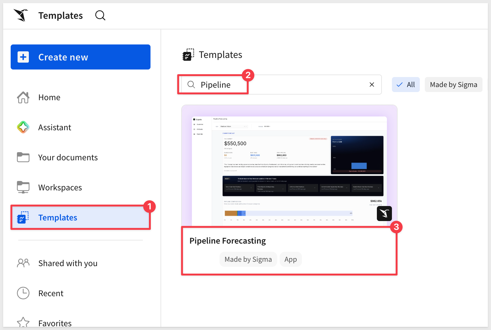

Click the template card to open a preview. Before clicking `Use template`, confirm both requirements shown on the detail page are met:

- **Write access enabled on a connection** — required for input tables to store forecast and quota data. See [Set up write access](https://help.sigmacomputing.com/docs/set-up-write-access)
- **AI provider set up in your organization** — required for the AI summary. See [Configure AI features for your organization](https://help.sigmacomputing.com/docs/configure-ai-features-for-your-organization)

Once both are in place, click `Use template`. Sigma creates a personal copy in your workspace that you can explore, edit, and connect to your own data without affecting the original template:

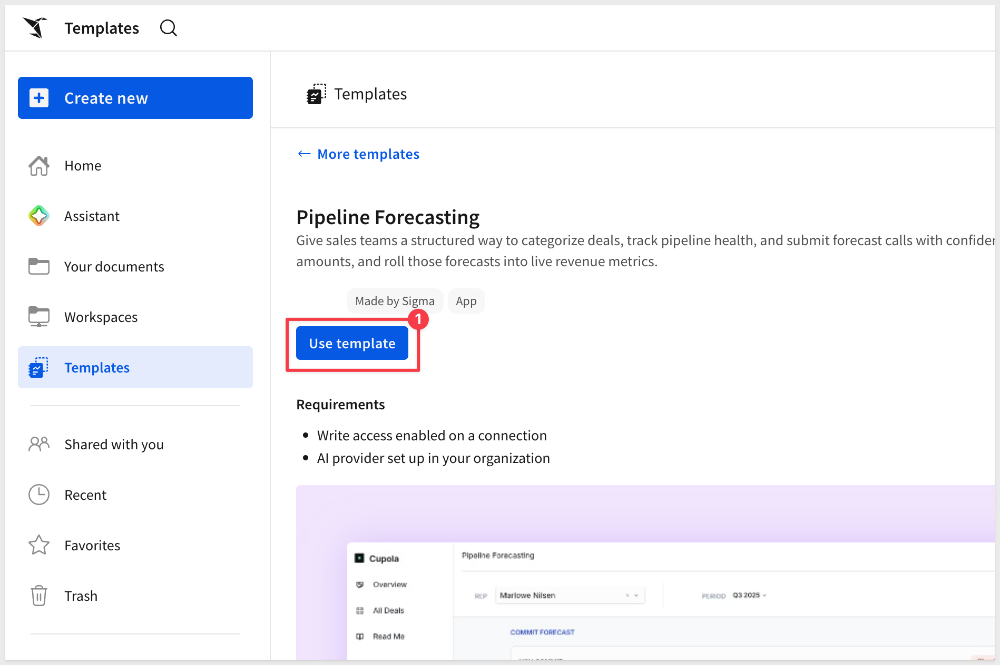

Click `Save as` and give the workbook a name:
```copy-code
Pipeline Forecasting
```

<aside class="positive">
<strong>NOTE:</strong><br> The original template remains unchanged in the gallery — your saved copy is the working version.
</aside>

### README Page

The app opens on its **README** page, which describes the purpose of each page and the four-step workflow at a glance. A short demo video walks through the core forecasting cycle. The README is worth reading before diving in — it describes what each page does and the order to follow:

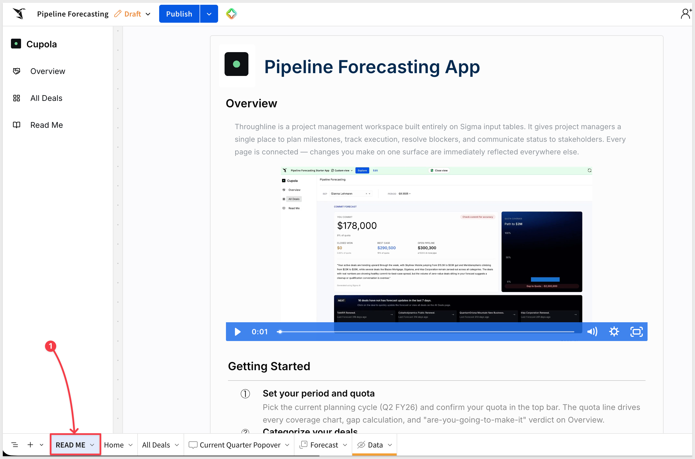

The four steps are:

1. **Set your period and quota** — pick the current planning cycle (e.g., Q2 FY26) and confirm your quota in the top bar. The quota line drives every coverage chart, gap calculation, and forecast verdict on the Home page.
2. **Categorize your deals** — walk the Board and assign each open deal a forecast category — Commit, Best Case, Pipeline, or Omit. Uncategorized deals pin to the top until you call them.
3. **Add manager calls** — submit your Gut, Commit, and Best Case values for each deal through the deal detail overlay.
4. **Execute on the board** — keep deal categories current as the quarter progresses. Flag any changes to Commit, Gut, or Best Case as deals move through stages.

The **Application Pages** section at the bottom of the README summarizes each page in the workbook:

- **Overview** — your forecast in one screen. Commit number with a quota coverage gauge stacking Closed → Commit → Best Case, pipeline composition chart, stale-deal alert, and week-over-week forecast trend.
- **All Deals** — every open deal in one list, grouped by forecast category with Uncategorized pinned to the top. Each row is inline-editable — change a category, edit a note, or submit a call without leaving the page.

<aside class="negative">
<strong>NOTE:</strong><br> The README is visible to all users of the app. If you adapt this template for your org, update it to reflect your actual CRM objects, fiscal calendar, and any changes to the default data source.
</aside>


<!-- END OF SECTION-->

## The Forecasting Workflow
Duration: 15

### Home Page — Your Forecast at a Glance

Open to the `Published` version:

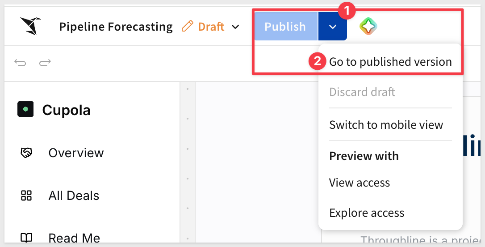

Before exploring the dashboard, set the two selectors at the top of the page:

- **REP** — the sales rep whose forecast you're viewing
- **PERIOD** — the fiscal quarter. For the sample data, select `Q2 2026`

<aside class="negative">
<strong>NOTE:</strong><br> The PERIOD selector controls everything on the page — quota line, deal coverage, AI summary, and pipeline charts all filter to the selected quarter. If the period isn't set correctly, the dashboard will appear empty or show unexpected values.
</aside>

The **Home** page (labeled **Overview** in the workbook nav) is the starting point for every forecasting session. It shows the full picture for the active quarter and rep in a single view.

At the top left, a **COMMIT FORECAST** card shows the rep's current Commit as a large number with quota percentage below it.

Three supporting KPIs sit alongside it — **CLOSED WON**, **BEST CASE**, and **OPEN PIPELINE** — each with a quota coverage line:

Below the KPIs, an AI-generated forecast summary (labeled "Generated using Sigma AI") reads the rep's forecast history and surfaces two sentences: the current trajectory and the deals most likely to affect the outcome. The summary updates as new forecast submissions are added.

A **QUOTA COVERAGE** bar on the right stacks Closed Won, Commit, and Best Case as normalized segments against the quota line, showing path-to-quota at a glance:

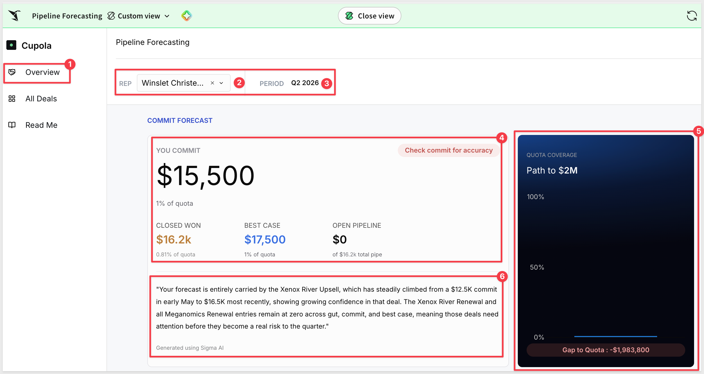

### The NEXT Alert

A dark **NEXT** banner below the main KPIs counts deals that haven't had a forecast update within the configured cadence (default: 7 days). It shows the count and a short message prompting action. Clicking any deal in the list opens its detail overlay directly:

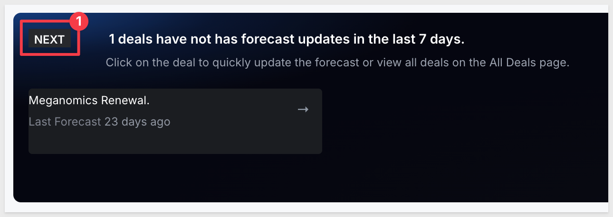

<aside class="positive">
<strong>NOTE:</strong><br> The staleness threshold is configurable — see the <strong>Under the Hood</strong> section for how the <code>Forecast Cadence (days)</code> control works.
</aside>

### Pipeline Composition and Forecast Trend

Two panels at the bottom of the Home page give pipeline-level context:

- **PIPELINE COMPOSITION** — a horizontal stacked bar chart showing how open pipeline splits across forecast categories (Commit, Best Case, Gut, Remaining). Each segment is labeled with its percentage of total open pipeline, making coverage gaps visible at a glance.
- **HOW YOUR FORECAST HAS MOVED** — a step-line chart plotting Commit, Gut, and Best Case week over week across the quarter. Each data point represents a weekly snapshot of cumulative forecast submissions. Use this to see whether the forecast has been moving up, down, or holding steady.

At the bottom right, an **ACV BY STAGE** bar chart shows total pipeline value at each opportunity stage — useful for understanding where dollar risk is concentrated in the funnel:

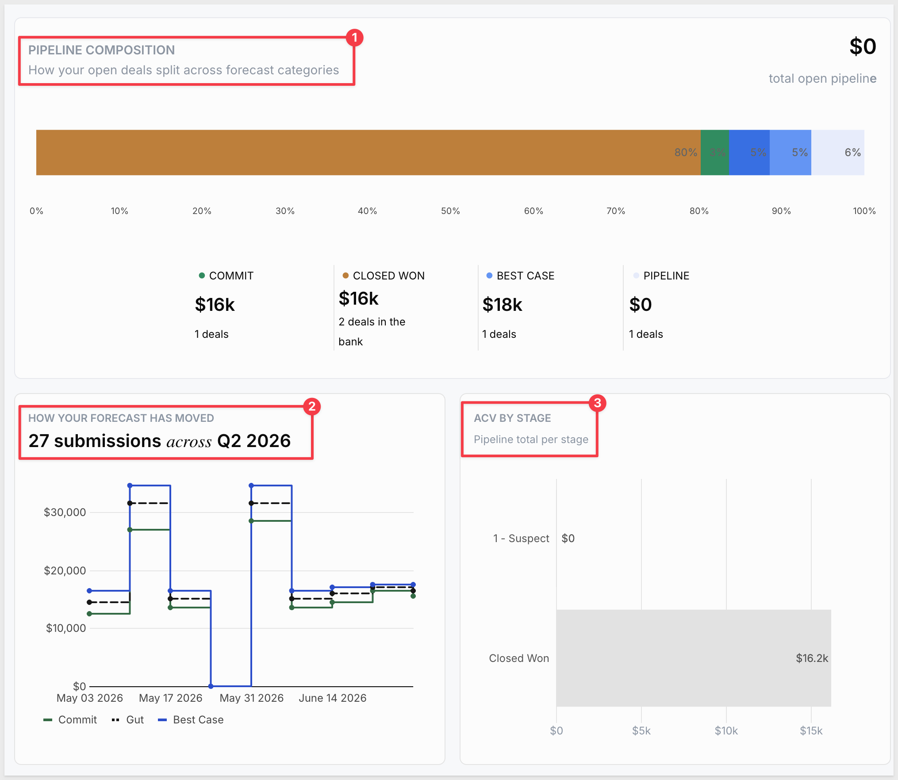

### All Deals Page — Work the Board

The **All Deals** page is where reps categorize deals and submit forecast calls. The header shows the current quarter and two filters — `All` (show every deal) and a toggle that filters to deals that need a call (those outside the cadence threshold).

Two counters in the header update live:
- **Committed** — count of deals with at least one forecast submission
- **Needs your call** — count of deals flagged as stale by the cadence control

Deals are displayed in two groups. **Committed** deals appear below the header with deal name, stage, ACV, and the three forecast values (Commit, Gut, Best Case) displayed inline. A `Closes` date appears at the top right of each card:

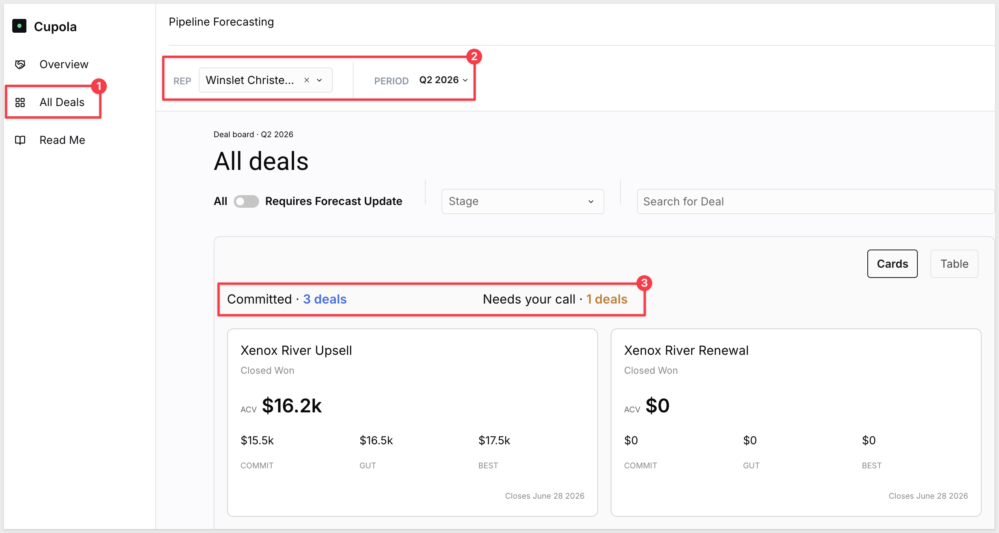

Clicking any deal card opens a **deal detail overlay**. The overlay shows the deal name, stage, ACV, and close date, along with editable Commit, Gut, and Best Case fields. Enter your forecast values and click `Save` to record the submission. The submission is timestamped and stored in the Forecasts input table, and the deal's "Days Since Last Forecast" counter resets immediately.

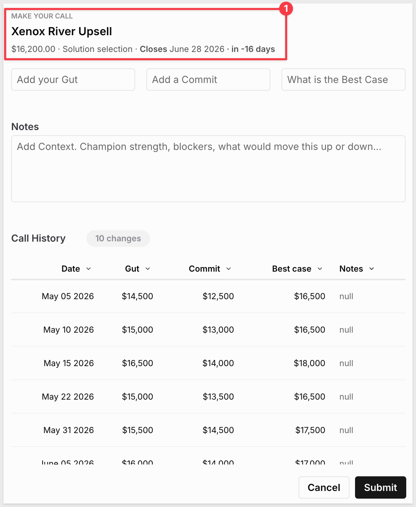

<aside class="negative">
<strong>NOTE:</strong><br> Forecast submissions are append-only — each save creates a new timestamped record. The app always resolves to the most recent submission per deal. Editing an existing submission does not overwrite history.
</aside>

After submitting calls, return to the `Home` page. The Commit number, quota coverage gauge, and AI summary all reflect the updated submissions immediately.


<!-- END OF SECTION-->

## Try It: A Complete Forecasting Cycle
Duration: 10

This section walks through the end-to-end workflow using the sample data that ships with the app. Follow along to see how a rep starts their session, identifies what needs attention, submits forecast calls, and checks the updated dashboard — all without leaving the workbook.

### Step 1: Select a Rep and Period

The **REP** and **PERIOD** selectors at the top of the Home page control whose forecast you're viewing. Select the following to match this walkthrough:

- Rep: `Winslet` (type to search — the full name is truncated in the dropdown)
- Period: `Q2 2026`

<aside class="negative">
<strong>NOTE:</strong><br> The PERIOD selector is the most important setup step in the app. Every metric, chart, deal card, and AI summary on the Home page filters to the selected quarter. The sample data is configured for <code>Q2 2026</code> — using a different period will result in an empty or misleading dashboard.
</aside>

Orient to Winslet's current position before doing anything else:

- **YOU COMMIT: $15,500** — 1% of a $2M quota. The gap is significant.
- **CLOSED WON: $16.2K** — 0.81% of quota already in the bank
- **BEST CASE: $17,500** — 1% of quota; upside barely moves the needle
- **OPEN PIPELINE: $0** — of $16.2K total pipe; all remaining deals are currently uncategorized

The **AI summary** has already flagged the core risk: Xenox River Upsell is carrying the entire forecast (and growing), while Meganomics Renewal is sitting at zero across every forecast category:

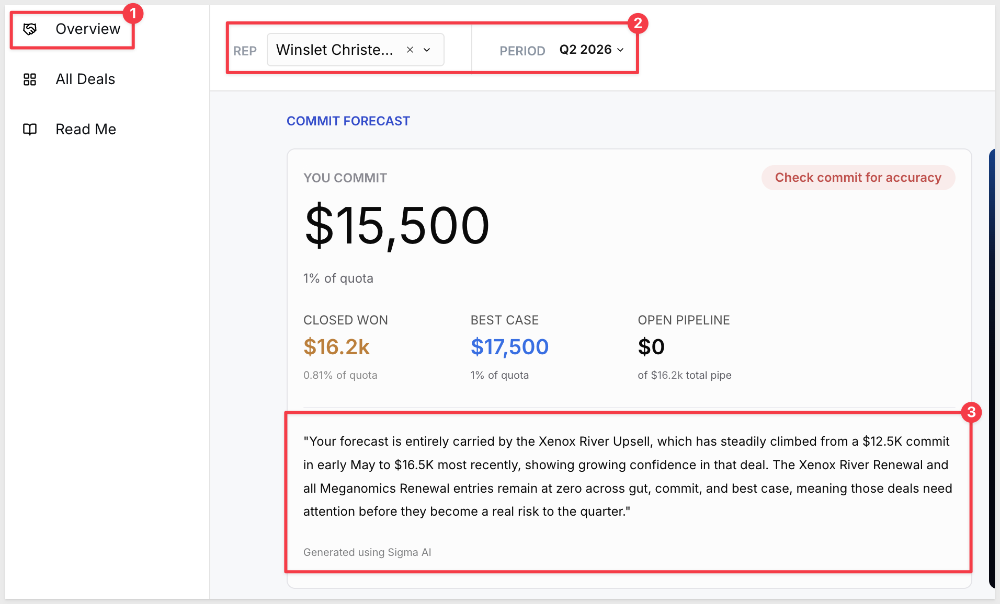

The **QUOTA COVERAGE** panel on the right confirms the picture — the stacked segments barely register against the $2M quota line, with a `Gap to Quota: -$1,983,800` label at the bottom.

### Step 2: Check the NEXT Alert

The dark **NEXT** banner surfaces the deals the AI summary just flagged — the ones with no recent forecast updates. Meganomics Renewal should appear here, sitting at zero across every forecast category.

The NEXT banner surfaces it automatically so Winslet doesn't have to scan the full deal list to find what's stale:


### Step 3: Go to All Deals

Navigate to the **All Deals** page. Enable the `Requires Forecast Update` toggle to filter to just the stale deals:

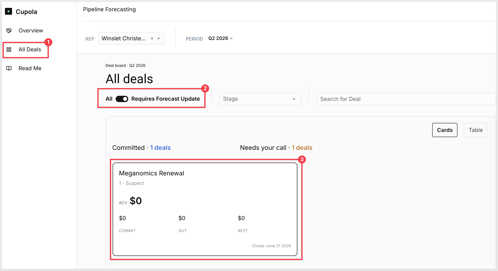

The board shows committed deals on the left and **Needs your call** deals on the right. The stale deal card aligns with what the AI summary and NEXT banner flagged — Meganomics Renewal with $0 across every forecast category:

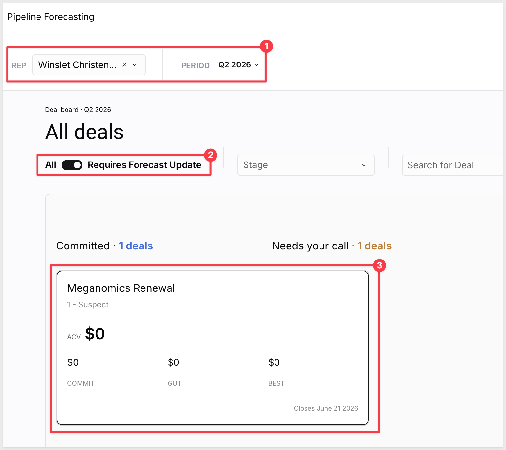

### Step 4: Submit a Forecast Call

Click **Meganomics Renewal** to open the forecast overlay. The overlay shows deal context — name, stage (1 - Suspect), ACV ($0), close date (June 21 2026) — so Winslet has what's needed to make a call without switching to the CRM.

Enter the following values to record a first forecast submission for this renewal:

**Gut:**
```copy-code
12000
```
**Commit:**
```copy-code
8000
```
**Best Case:**
```copy-code
15000
```
**Notes:**
```copy-code
Renewal at risk — no activity in 3 weeks. Following up this week to gauge timeline and decision maker availability.
```

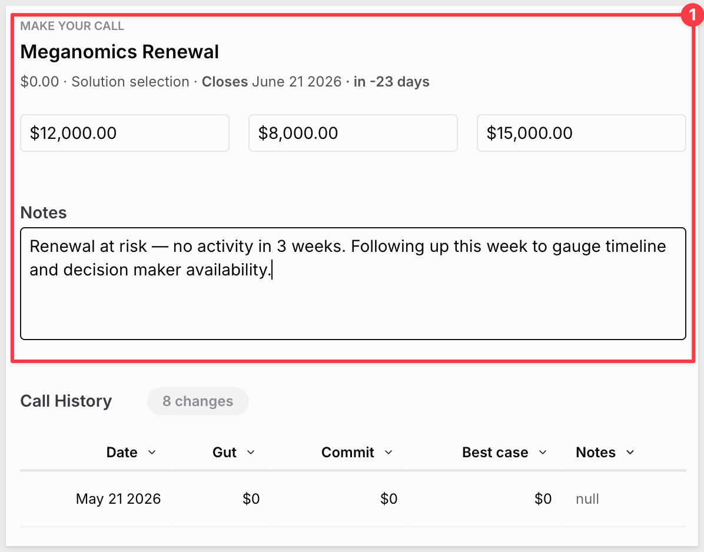

Click `Submit`. The submission is written to the input table (on the `Data` page > `Input tables` tab) immediately.

<aside class="negative">
<strong>NOTE:</strong><br> After submitting, the deal card values may not update immediately in the sample data environment. The write to the input table succeeds — confirm by navigating to the Data page and inspecting the Forecasts input table. In live use with current CRM data, values update immediately after submitting.
</aside>

<aside class="positive">
<strong>NOTE:</strong><br> The Notes field is where risk context and next steps live. Managers reviewing the board can read what the rep knows without scheduling a sync — making the notes field as important as the numbers.
</aside>

Once submitted, the **Needs your call** count drops to zero.

### Step 5: Return to the Home Page

Navigate back to the **Home** page. Every metric reflects the submissions just made:

- **YOU COMMIT: $23,500** — up from $15,500; the Meganomics Renewal $8K commit is now included
- **BEST CASE: $32,500** — up from $17,500; the $15K best case is now part of the coverage picture
- **NEXT banner: 0 deals** — the queue is cleared; no stale deals remain

The **AI summary** has regenerated and now reflects the activity. It tracks the trajectory of each deal since the quarter began, calling out which deals have moved and which still carry risk:

<!--  -->

The **HOW YOUR FORECAST HAS MOVED** line chart adds a new data point for this week's submissions. Over the course of a quarter, this chart shows whether the forecast has been consistent, improving, or eroding — giving managers a trend to discuss on the weekly call rather than comparing numbers from memory.

<aside class="positive">
<strong>WHY IT MATTERS:</strong><br> The entire cycle — check the dashboard, work the board, submit calls, review the updated metrics — takes under 10 minutes for a rep with a well-maintained pipeline. The app is designed to replace the weekly spreadsheet update and the manager follow-up that comes after it.
</aside>


<!-- END OF SECTION-->

## Under the Hood
Duration: 10

The **Data** page contains every backend table that powers the app. Each table includes a description of its purpose. The page is organized into tabs: `Warehouse Sources`, `Input Tables`, `Linked Input Tables`, `Transformations`, and `Helpers`. Here's how the pieces fit together.

Place the workbook into `Edit` mode.

### The Data Sources

The app draws from three warehouse tables, visible under the `Warehouse Sources` tab:

- **OPPORTUNITIES_ENRICHED** — the core CRM opportunities table (10,337 rows, 10 columns). Contains all deal information from the warehouse including stages, forecast categories, amounts, and close dates. This is the single source of truth for all deal data throughout the app.
- **Reps** — a sales representatives table (192 rows, 2 columns) with Opportunity Owner Guid and Opportunity Owner User Name. Used as one side of the cross join that generates the complete rep × quarter quota grid.
- **Fiscal Calendar** — maps each calendar date to fiscal periods (quarters, years). Enables time-based filtering and aggregations aligned with the org's fiscal calendar rather than standard calendar dates.

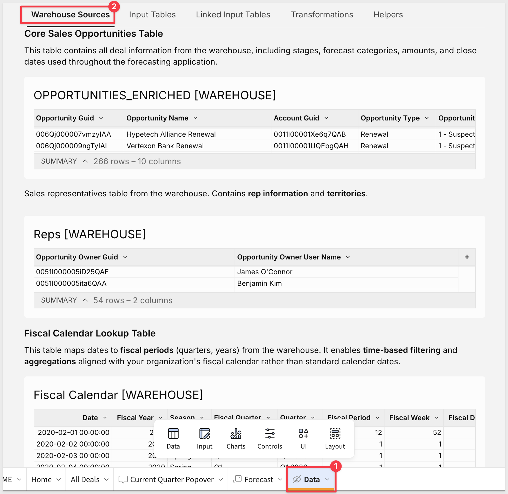

These three tables are the ones to replace when connecting to your own data. See the **Connect Your Own Data** section for details.

### The Forecasts Input Table

`[INPUT TABLE] Forecasts` is the core writeback table. Reps submit a new row for each deal call, recording:

| Column | Type | Purpose |
|--------|------|---------|
| Opportunity ID | Text | The deal being called — links to OPPORTUNITIES_ENRICHED |
| Date | Datetime | When the forecast was submitted |
| Gut | Number | Rep's gut-feel forecast for the deal |
| Commit | Number | Rep's committed forecast |
| Best Case | Number | Rep's upside forecast |
| Notes | Text | Free-text call notes |

Three lookup columns are derived automatically: `Opportunity Name`, `Opportunity Owner Guid`, and `Quarter` — all resolved from the Opportunity ID without the rep entering them manually.

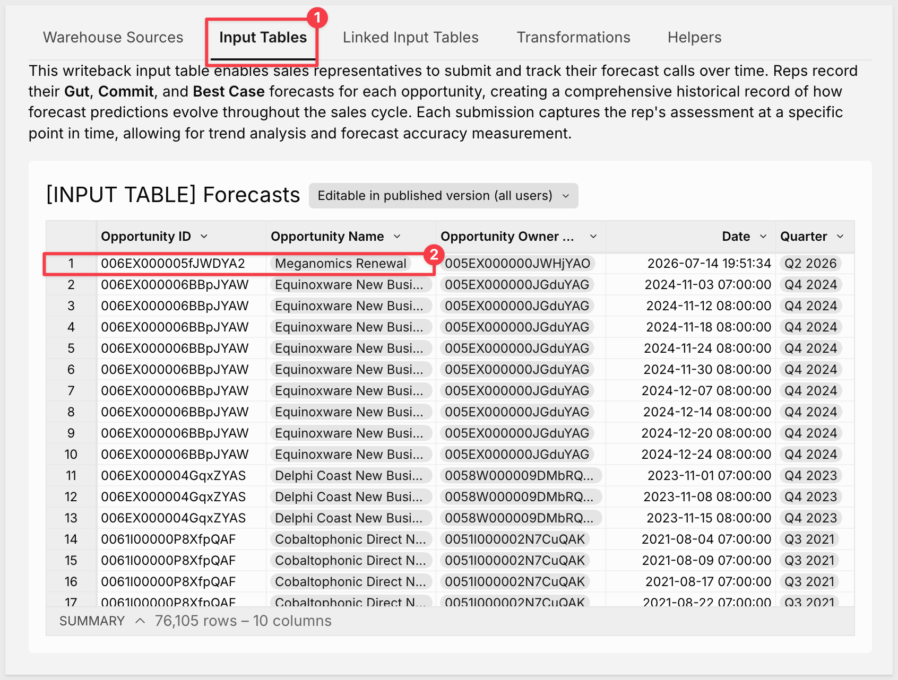

**WHY IT MATTERS:**<br>
The append-only submission model means every forecast call is preserved. The rep's trajectory across the quarter is a complete audit trail — not just the current state. That history powers the week-over-week trend chart and makes it possible to see whether a rep's Commit has been stable, climbing, or eroding.

### Latest Forecasts — RowNumber for Current State

The **Latest Forecasts** table is a transformation (visible under the `Transformations` tab) that extracts just the most recent submission per deal. It uses `RowNumber([Date], "desc")` partitioned by `Opportunity ID` to rank submissions newest-first, then filters to `Forecast Rank = 1`:

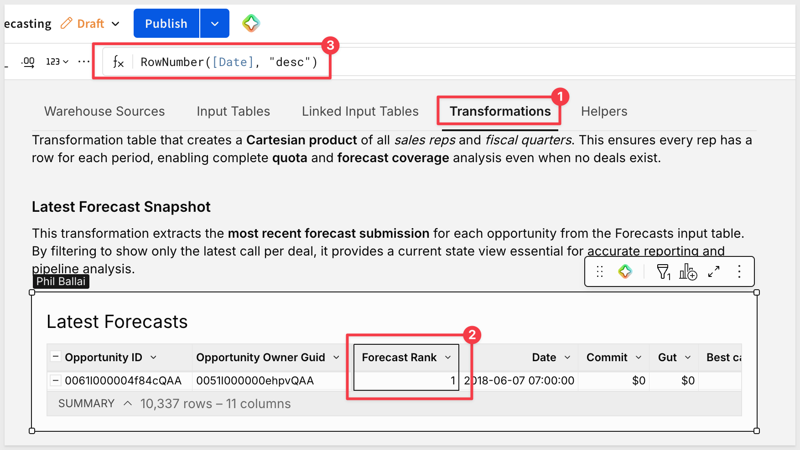

The result is one row per deal — the rep's current call — which feeds into the **Rep Summary** aggregation table and the All Deals deal cards.

**WHY IT MATTERS:**<br>
The `RowNumber` pattern is a lightweight alternative to a max-date subquery. It ranks within a partition, so the "most recent" logic is computed at the workbook level without a warehouse round-trip. Any new submission immediately becomes rank 1, and the dashboard reflects it without any additional refresh logic.

### Rep × Quarter Cross Join for Quota Coverage

The **Quota** linked input table allows managers to set quota targets per rep per quarter. To ensure every rep has a row for every quarter — even before any deals exist or any quota is entered — a `Reps x Quarter Cross Join` table generates the full grid first.

The cross join is a Cartesian product of `Reps [WAREHOUSE]` and `Fiscal Calendar [WAREHOUSE]` — every combination of rep × fiscal quarter. It produces 560,640 rows across 3 columns (Opportunity Owner Guid, Opportunity Owner User Name, Quarter) and lives under the `Transformations` tab.

<!--  -->

The `Quota [LINKED INPUT TABLE]` (visible under the `Linked Input Tables` tab) uses this cross join as its row source. The table is marked **Editable in draft** — managers open the workbook in draft mode to set or adjust quota targets per rep per quarter. The `Quota` column writes back to the warehouse; the rep and quarter columns are read-only, pulled from the cross join.

**WHY IT MATTERS:**<br>
Without the cross join, the quota table would only have rows for rep × quarter combinations that already appear in the opportunities data. New reps or future quarters would be missing, and the coverage gauge would show no quota line. The cross join guarantees completeness: every rep has a quota slot for every quarter, whether or not they have any deals yet.

### Rep Summary — Aggregating the Forecast

The **Rep Summary** table joins quota data with deal metrics to produce the per-rep aggregates used throughout the Home dashboard. For each rep, it calculates:

- `Commit`, `Gut`, `Best Case` — summed from Latest Forecasts
- `Closed Won` and `Closed Won Count` — filtered from OPPORTUNITIES_ENRICHED on `"Closed Won"` stage
- `Total Pipeline`, `Open Pipeline`, and their counts
- Net values (`Commit (net)`, `Gut (net)`, `Best Case (net)`) — each category minus the category below it, used for the stacked quota coverage chart
- `Remaining Pipe` — total pipeline minus Best Case

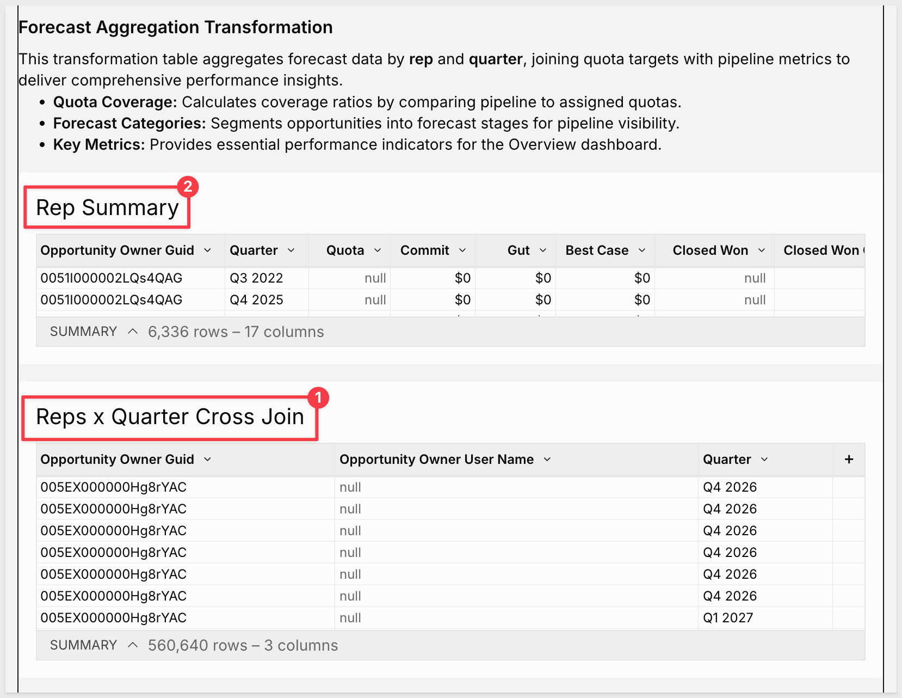

### AI Summary as an Editable Prompt

The AI-generated forecast summary on the Home page is driven by a prompt stored in the `Ai Summary` control on the `Helpers` tab of the Data page. The prompt instructs the model to return a two-sentence plain-text summary in a conversational, direct tone. It includes an example output style so the model understands the expected register, and a fallback instruction: if no data is available, return `Cannot generate AI Summary` rather than fabricating output.

The prompt is stored as a workbook control — not hardcoded into the text element formula — so it can be tuned without touching the workbook structure:

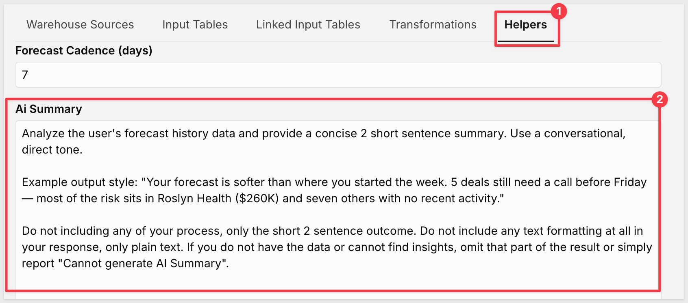

The formula in the Home page text element calls `CallText("ai_complete", "claude-sonnet-4-6", ...)`, passing the `Ai Summary` prompt value alongside a `ListAgg` of the rep's recent forecast submissions as context.

**WHY IT MATTERS:**<br>
Storing the AI prompt as an editable control separates what the model is asked from how the result is displayed. Sales managers can adjust the summary's focus — emphasizing Commit risk, deal count, or cadence gaps — without modifying the underlying workbook formula. The prompt is visible and auditable in one place, which matters when AI output informs a manager's weekly call.

### The Forecast Cadence Control

A number control labeled `Forecast Cadence (days)` on the `Helpers` tab (default: 7) sets the staleness threshold in days. Any deal where `DateDiff("day", [UPDATED], Now()) > [forecast-cadence]` is flagged as needing an update. The `Requires Forecast Update` column on the Deals table evaluates this condition and feeds both the NEXT banner count and the `Needs your call` filter on All Deals.

To change the cadence for your team, edit the default value of the `Forecast Cadence (days)` control on the `Helpers` tab:

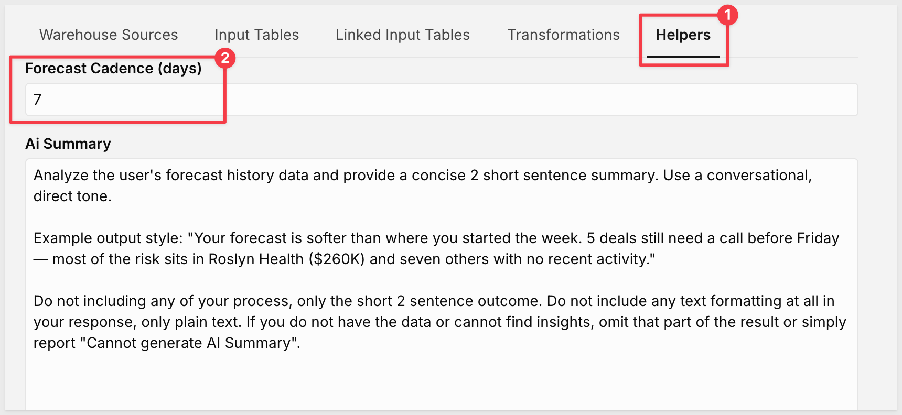


<!-- END OF SECTION-->

## Connect Your Own Data
Duration: 5

The Pipeline Forecasting app is designed to work with any CRM opportunities dataset that tracks deal stages, amounts, and owners. The three source tables to replace are **OPPORTUNITIES_ENRICHED**, **Reps**, and **Fiscal Calendar** on the Data page.

### What the App Needs

**Opportunities table:**

| Column | Description |
|--------|-------------|
| Opportunity Guid | Unique deal identifier |
| Opportunity Name | Display name shown in deal cards and the overlay |
| Opportunity Type | Deal type (e.g., New, Renewal, Expansion) |
| Opportunity Stage Name | Current pipeline stage — `"Closed Won"` is expected for closed deals |
| Opportunity ACV Amount | Annual contract value or deal amount |
| Opportunity Owner Guid | Unique rep identifier — used to join quotas and aggregate per-rep metrics |
| Opportunity Owner User Name | Rep display name |
| Opportunity Close Date | Expected close date — used to resolve fiscal quarter |

**Fiscal Calendar table:**

| Column | Description |
|--------|-------------|
| Date | One row per calendar date |
| Fiscal Quarter | Quarter label (e.g., `Q2`) |
| Fiscal Year | Fiscal year (e.g., `2026`) |
| Quarter (derived) | `[Fiscal Quarter] & " " & Text([Fiscal Year])` — the combined label used throughout the app |

The calendar table is used solely to resolve quarter labels from close dates. If your CRM data already carries a quarter field, you can simplify or bypass this lookup.

**Reps table:**

| Column | Description |
|--------|-------------|
| Opportunity Owner Guid | Unique rep identifier — must match the GUID in OPPORTUNITIES_ENRICHED |
| Opportunity Owner User Name | Rep display name shown in the REP selector and deal cards |

This is typically a deduplicated list of reps pulled from the same CRM connection as the Opportunities table. It's used as one side of the cross join that generates the complete rep × quarter quota grid.

### How to Swap the Sources

On the `Data` page, open **OPPORTUNITIES_ENRICHED [WAREHOUSE]** in edit mode. Use `Change source` to point the table at your own connection and opportunities table. Map your columns to the column names the app expects — especially `Opportunity Guid`, `Opportunity Owner Guid`, and `Opportunity Stage Name`, which appear as join keys and filter conditions throughout the workbook.

Open **Reps [WAREHOUSE]** and point it at a deduplicated list of rep IDs and display names from your CRM or HR system. The Opportunity Owner Guid must match the values in OPPORTUNITIES_ENRICHED for the cross join and quota grid to function correctly.

Then open **Fiscal Calendar [WAREHOUSE]** in edit mode and point it at your organization's fiscal calendar table, or replace it with a simpler quarter derivation if your opportunities table already carries a quarter column.

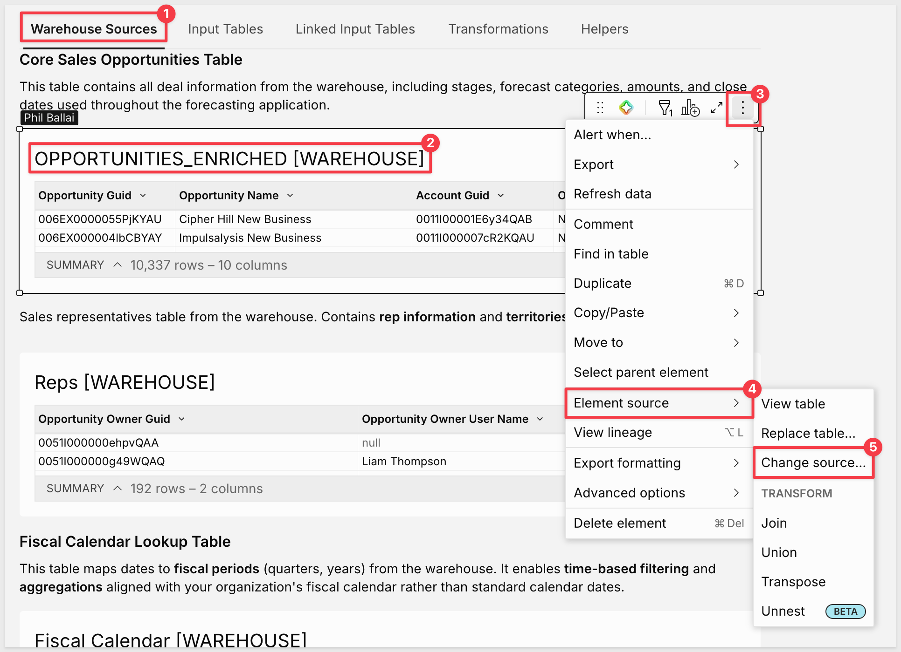

<aside class="negative">
<strong>NOTE:</strong><br> The Forecasts and Quota input tables write back to the same Snowflake connection as the sample data. If you're connecting to a different warehouse, update those input table sources as well to ensure forecast submissions and quota data are written to the correct location.
</aside>

### What Carries Over Automatically

Once sources are swapped and columns are mapped correctly:

- The **Latest Forecasts** transformation continues to rank submissions by date and return the most recent per deal — no formula changes needed
- The **Rep Summary** aggregation recalculates against your opportunities and quota data automatically
- The **Reps × Quarter cross join** regenerates using your rep and fiscal quarter data
- The AI summary continues to work without any changes to the prompt
- The NEXT banner and cadence flag recalculate against your deal update timestamps

The main manual step after swapping sources is entering initial quota values for each rep in the `Quota [LINKED INPUT TABLE]` — and populating the Forecasts input table with a seed round of deal submissions before the trend chart has data to plot.


<!-- END OF SECTION-->

## What We've Covered
Duration: 5

This QuickStart walked through the Pipeline Forecasting app from end to end: exploring the Home dashboard, working the All Deals board, and examining the design decisions that make the app function.

The **append-only forecast submission model** is the operational pattern worth carrying forward. Every deal call is a new timestamped record — not an overwrite — which means the rep's trajectory across the quarter is preserved in full. That history powers the week-over-week trend chart and makes forecast accuracy analysis possible after the quarter closes. The same pattern applies to any domain where you want a complete submission history rather than just current state.

The **RowNumber for latest-record resolution** is a reusable technique for any time-series input table. By partitioning on a deal ID and ranking submissions by date descending, the app always surfaces the most recent call per deal without a max-date subquery or warehouse round-trip. Stack this on top of an append-only input table in any Sigma workbook where you need both history and current state.

The **cross join for complete coverage grids** solves a common problem: aggregations that should produce a row for every combination of two dimensions even when the fact table has gaps. The Reps × Quarter cross join guarantees every rep has a quota slot for every fiscal quarter, regardless of whether they have any deals. This pattern applies directly to headcount planning, capacity allocation, or any scenario where you need to enforce completeness before managers enter targets.

The **AI prompt as an editable control** shows how to make AI output configurable without exposing formulas. The forecast summary prompt lives on the Data page as a text-area control — managers can tune what the model focuses on, and the change takes effect immediately without touching the workbook structure. The same approach works for any AI-assisted app where the business context changes more often than the underlying data model.

**Additional Resource Links**

[Blog](https://www.sigmacomputing.com/blog/)<br>
[Community](https://community.sigmacomputing.com/)<br>
[Help Center](https://help.sigmacomputing.com/hc/en-us)<br>
[QuickStarts](https://quickstarts.sigmacomputing.com/)<br>

Be sure to check out all the latest developments at [Sigma's First Friday Feature page!](https://quickstarts.sigmacomputing.com/firstfridayfeatures/)
<br>

[](https://twitter.com/sigmacomputing)&emsp;
[](https://www.linkedin.com/company/sigmacomputing)&emsp;
[](https://www.facebook.com/sigmacomputing)


<!-- END OF WHAT WE COVERED -->
<!-- END OF QUICKSTART -->
