author: pballai
id: starter_apps_project_management
summary: Explore Sigma's Project Management Starter App — a ready-to-use ops app for planning milestones, tracking execution, resolving blockers, and communicating project health across your portfolio.
categories: starterapps
environments: web
status: Hidden
feedback link: https://github.com/sigmacomputing/sigmaquickstarts/issues
tags: 
lastUpdated: 2026-07-16

# Project Management Starter App

## Overview
Duration: 5

Sigma's **Starter Apps** are ready-to-use applications built on Sigma's native features and connected to sample data. Each one ships fully functional — you can explore it immediately, learn how it's built by switching to edit mode, and adapt it to your own projects without starting from scratch.

The **Project Management** app — built on the "Throughline" sample — gives project managers a single place to plan milestones, track execution, resolve blockers, and communicate status to stakeholders. Every page is connected: changes you make on one surface are immediately reflected everywhere else. AI-generated project summaries and blocker analysis surface context automatically, alongside the work.

This QuickStart walks through how the app works as a user, how it's designed under the hood, and how to start managing your own projects with it.

### Target Audience
Project managers, operations teams, and program managers evaluating or adopting Sigma for project tracking. Solutions Engineers and technical stakeholders exploring the app as a reference design for input-table-based apps.

### Prerequisites

<ul>
  <li>Access to a Sigma environment.</li>
  <li>The Project Management Starter App available in your org — find it under <code>Templates</code> > <code>Starter Apps</code>.</li>
  <li><strong>Write access enabled on a connection</strong> — required for input tables to store projects, milestones, and tickets. See <a href="https://help.sigmacomputing.com/docs/set-up-write-access">Set up write access</a></li>
  <li><strong>AI provider configured for your organization</strong> — required for AI project summaries and blocker analysis. See <a href="https://help.sigmacomputing.com/docs/configure-ai-features-for-your-organization">Configure AI features for your organization</a></li>
  <li>Some familiarity with Sigma workbooks is helpful but not required.</li>
</ul>

<aside class="positive">
<strong>NOTE:</strong><br> If you don't see Starter Apps in your Templates section, contact your Sigma administrator to confirm availability in your org.
</aside>

### What You'll Learn
- How the Project Management app works from project creation through portfolio reporting
- The key design patterns behind the app and why they're built that way
- How to start managing your own projects and team members with it


<!-- END OF SECTION-->

## Exploring the App
Duration: 10

### Open and Save the Template

Navigate to `Templates` in the left sidebar. The Project Management app appears in the `Made by Sigma` collection:

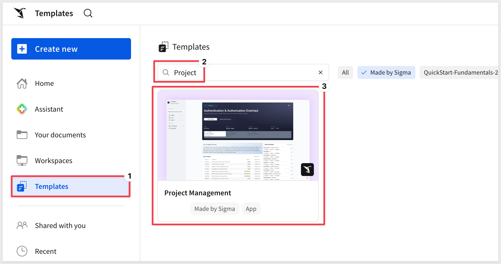

Click the template card to open a preview. Before clicking `Use template`, confirm the two requirements shown on the detail page are met:

- **Write access enabled on a connection** — required for input tables to store all project data. See [Set up write access](https://help.sigmacomputing.com/docs/set-up-write-access)
- **AI provider set up in your organization** — required for the AI summaries on Home and Ticket Details. See [Configure AI features for your organization](https://help.sigmacomputing.com/docs/configure-ai-features-for-your-organization)

Once both are in place, click `Use template`. Sigma creates a personal copy in your workspace that you can explore, edit, and populate with your own data without affecting the original template:

<!-- 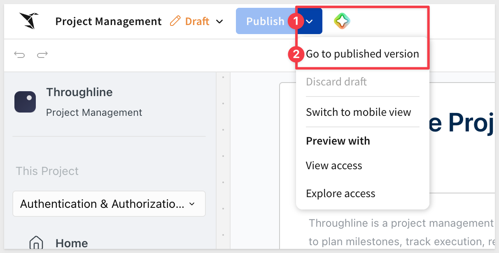 -->

Click `Save as` and give the new workbook a name:
```copy-code
Project Management
```

<aside class="positive">
<strong>NOTE:</strong><br> The original template remains unchanged in the gallery — your saved copy is the working version.
</aside>

### README Page

The app opens on its **README** page — an introduction built directly into the workbook that orients new users without requiring any external documentation:

<!-- 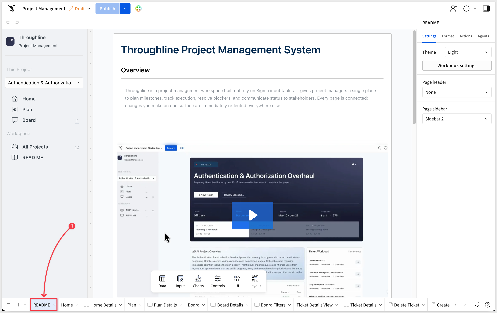 -->

The README includes a short demo video walking through the core workflow, a five-step getting-started guide, and a map of the app's pages. Read through it before diving in — it describes what each page does and the sequence to follow:

1. Create your project
2. Define milestones
3. Add plan items
4. Execute on the board
5. Review and communicate

<aside class="negative">
<strong>NOTE:</strong><br> The README page is visible to all users of the app. If you adapt this template for your org, update it to reflect your own project names, team context, and any changes from the sample Throughline data.
</aside>

### Home Page

The **Home** page is the app's front door for an individual project. Select a project from the sidebar to load it. The hero section shows the project name, health status, owner, timeline, and overall plan item completion at a glance:

<!-- 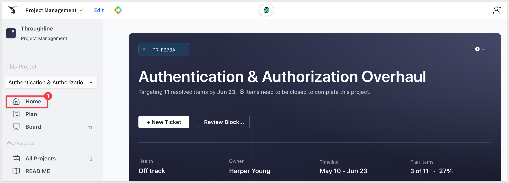 -->

Below the hero, the page breaks into four areas:

- **Milestone progress strip** — each milestone shows its name, date range, and status. The strip reflects the full sequence of milestones for the selected project.
- **AI Project Overview** — a one-to-two sentence AI-generated summary of the project's current state, including health, active blockers, and urgent items. The prompt is driven by a `CallText()` formula — covered in **Under the Hood**.
- **Ticket Workload** — a per-team-member breakdown showing queued, active, and completed tickets for this project.
- **Open Tickets table** — a sortable list of all non-done tickets, sorted by due date. Click the comment bubble icon on any ticket to navigate to **Ticket Details View**.

<!-- 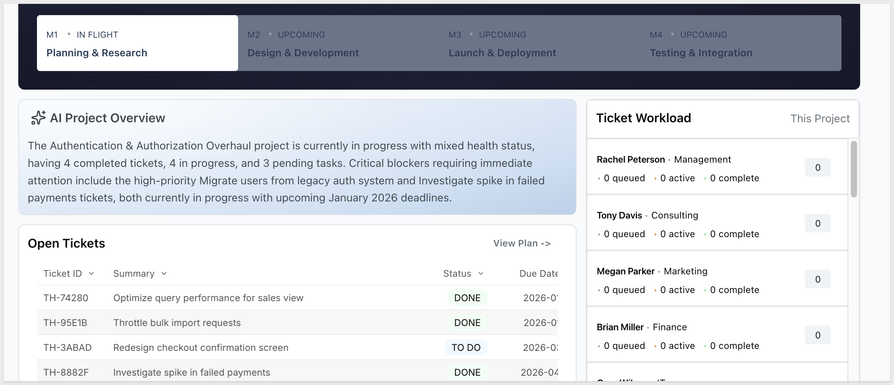 -->

### Plan Page

The **Plan** page organizes the selected project's work by milestone. A summary bar at the top shows the total milestone count alongside how many are done and in-flight:

<!-- 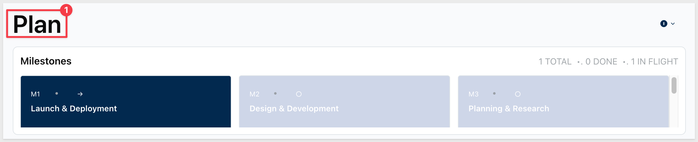 -->

Select any milestone in the left panel to expand it. The detail table shows every plan item under that milestone with its assignee, priority, status, due date, and team. Rows where the status is `TO DO` or `BLOCKER` and the due date falls past the milestone end date are highlighted in red — an automatic signal that something is at risk of missing its window.

<!-- 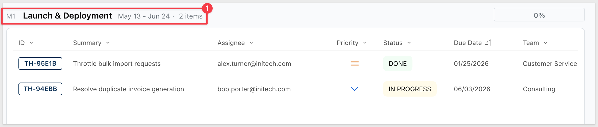 -->

The completion percentage for each milestone is displayed inline and updates as tickets move to `DONE` on the Board.

### Board Page

The **Board** page is the execution surface. It presents a Kanban view of all tickets in the selected project, organized into four columns:

- **To Do** — work not yet started
- **In Progress** — work actively being done
- **Blocked** — work that can't proceed
- **Done** — completed work

<!-- 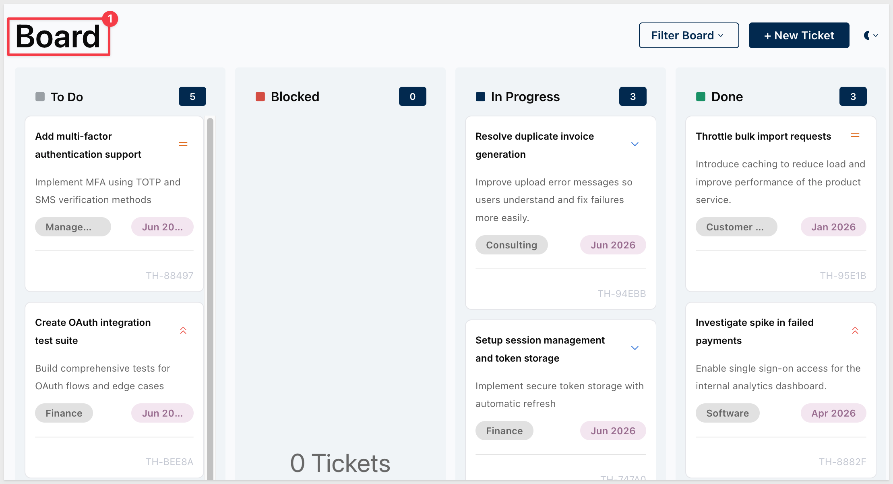 -->

Each card shows the ticket summary, priority icon, description snippet, and abbreviated ticket ID. The Blocked column uses a distinct red header to make impediments visible at a glance.

Move work through statuses by editing the ticket's Status field — either directly on the Board or via the Ticket Details View.

### All Projects Page

The **All Projects** page provides a portfolio view across every active project in the app:

<!-- 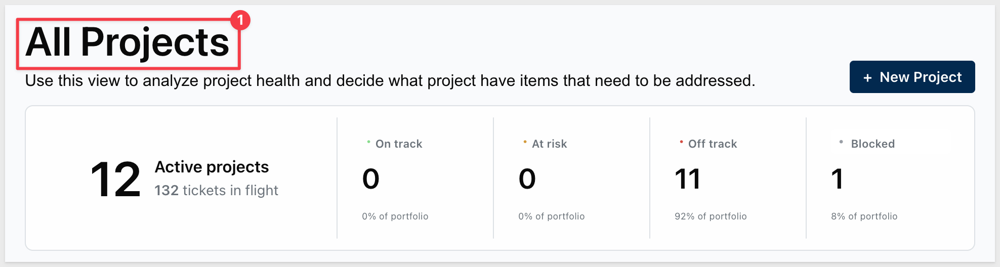 -->

Four summary tiles at the top show portfolio counts by health status: **On track**, **At risk**, **Off track**, and **Blocked**. A segmented filter below the tiles lets you scope the project cards to a single health category instantly.

Each project card shows:

- Project ID, name, and owner
- Health icon (color-coded to status)
- Days, weeks, or months remaining until the end date

Use this page for cross-project prioritization, leadership reporting, and identifying which projects need immediate attention.


<!-- END OF SECTION-->

## Managing a Project
Duration: 10

The app uses a three-tier hierarchy: **Projects → Milestones → Tickets**. Each layer is an input table on the Data page, and changes flow through to every page in real time.

Before creating anything, place the workbook in `Published` mode using the toggle in the header:

<!-- 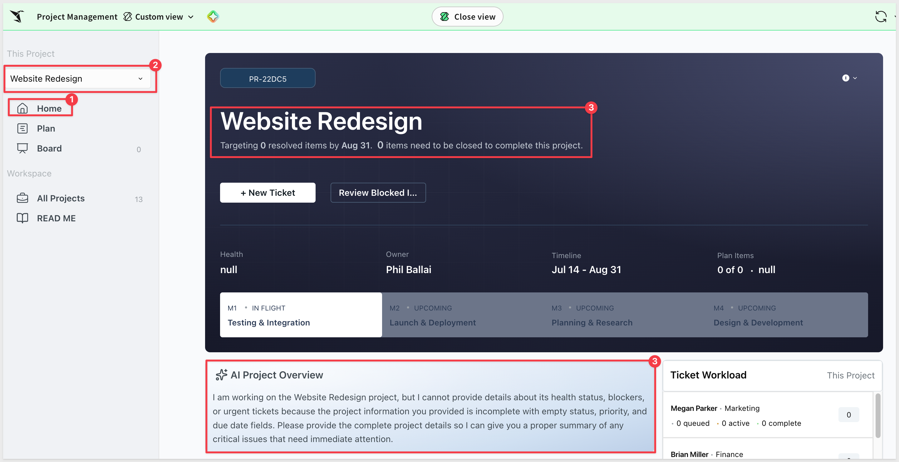 -->

### Step 1: Create a Project

Navigate to the **Data** page and open the **Projects Inputs** table. Click `Edit data` and add a new row with:

- Project Name
- Owner (user email)
- Goal or description
- Start Date and End Date

The new project appears immediately in the **All Projects** portfolio view and becomes selectable from the sidebar on Home, Plan, and Board.

<!--  -->

<aside class="positive">
<strong>NOTE:</strong><br> Project health is calculated automatically from the milestone and ticket state — you don't set it manually. A project becomes "At risk" or "Off track" based on blocker counts and due date proximity.
</aside>

### Step 2: Define Milestones

Open the **Milestones Inputs** table on the Data page. Add a row for each phase of your project with:

- Milestone Name
- Project ID (linking it to the project you just created)
- Start Date and End Date
- Description

Milestones appear in the Plan page sidebar and in the milestone progress strip on Home. The order reflects their date range, not insertion order.

<!-- 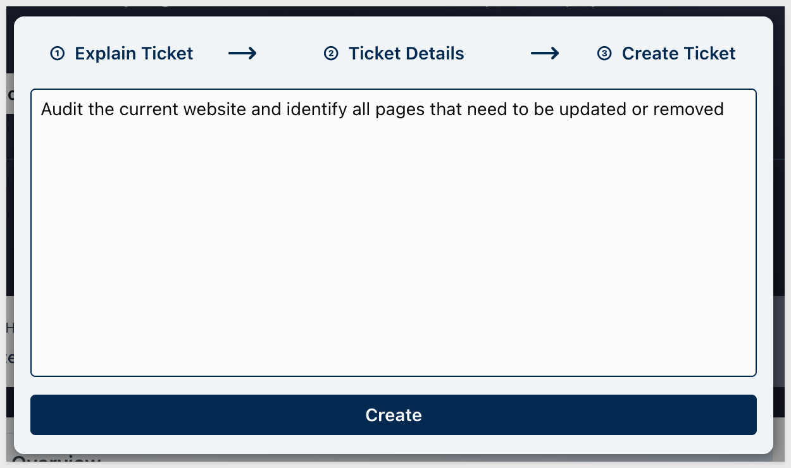 -->

### Step 3: Add Plan Items (Tickets)

Open the **Ticket Inputs** table on the Data page. For each piece of work, add a row with:

- Summary
- Status (`TO DO` to start)
- Priority (`LOW`, `MEDIUM`, or `HIGH`)
- Assignee (user email — auto-populates Team from the Employees table)
- Due Date
- Project ID and Milestone ID

<!-- 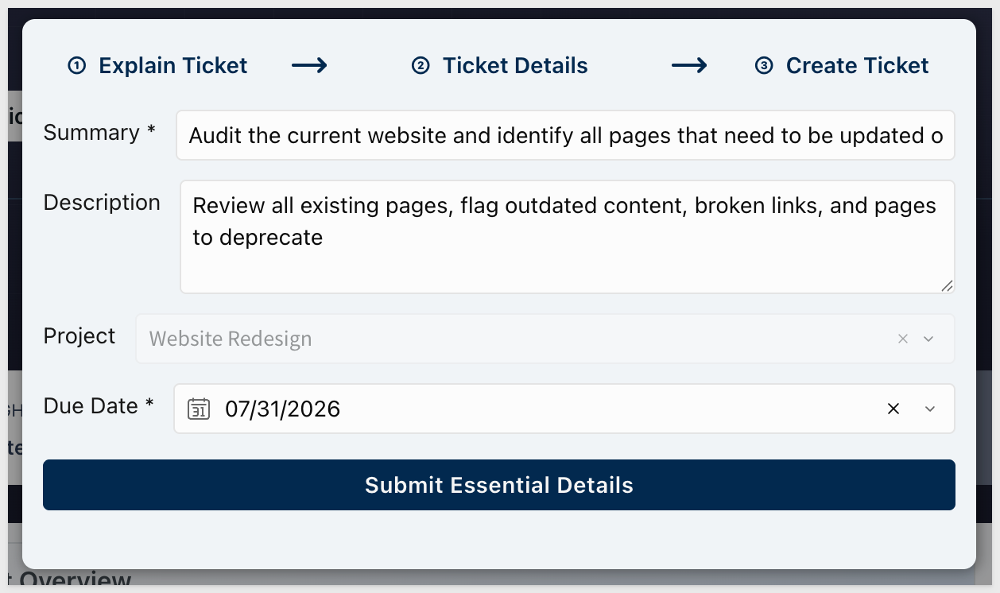 -->

Tickets appear immediately on the Board and in the Plan page under their assigned milestone.

<aside class="negative">
<strong>NOTE:</strong><br> The Team field on each ticket is derived automatically from the Assignee field via a Lookup against the Employees table. If a user isn't in the Employees table, their team will show as blank.
</aside>

### Step 4: Execute on the Board

Return to the **Board** page. As work progresses, update ticket statuses directly in `Ticket Inputs` — or click the comment bubble on a ticket in the Open Tickets table on Home to open **Ticket Details View**, where you can update status, log comments, and get an AI-generated blocker analysis.

<!-- 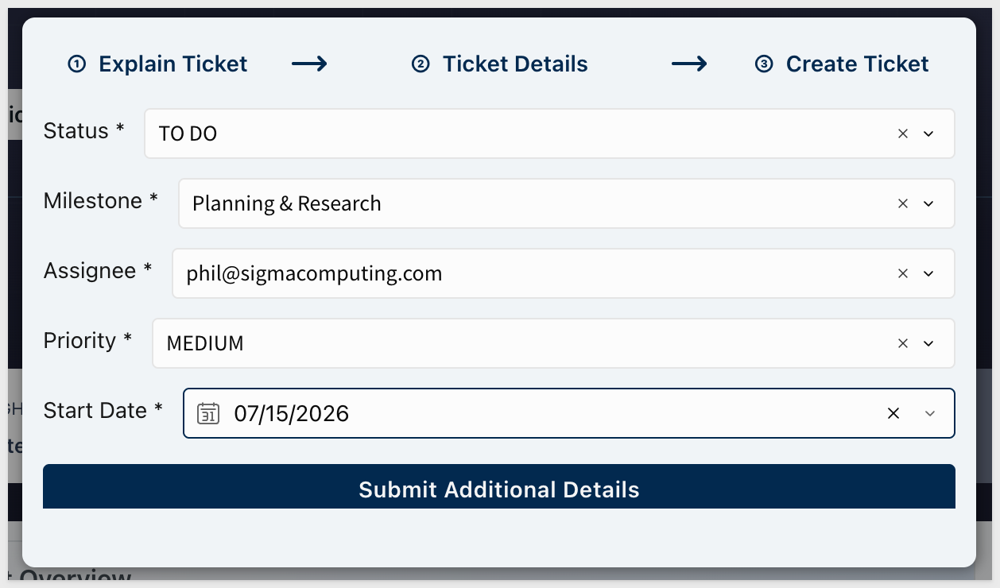 -->

The Board, Home, and Plan pages all reflect status changes in real time. Milestone completion percentages update as tickets move to `DONE`.

### Step 5: Check Project Health on Home

Return to **Home** and select your project from the sidebar. The AI Project Overview will generate a concise summary of current state, flagging any blockers or urgent items. The Ticket Workload section shows how work is distributed across your team at a glance.

<!-- 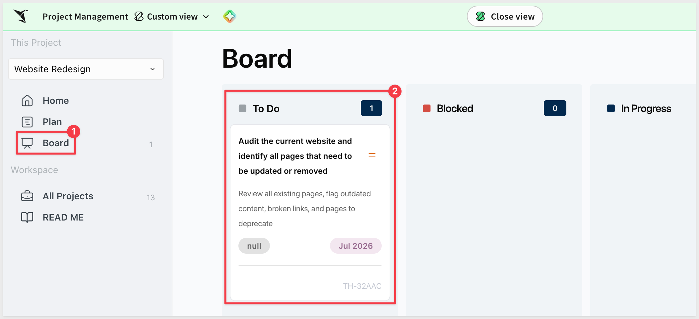 -->

Use the **All Projects** page to view your project alongside others and monitor portfolio health.


<!-- END OF SECTION-->

## AI Features
Duration: 5

The Project Management app includes two AI features, both powered by `CallText()` formulas embedded directly in workbook elements. Neither requires a separate AI agent or chat interface — the AI runs as part of the page layout.

### AI Project Overview

On the **Home** page, the AI Project Overview panel generates a one-to-two sentence summary of the selected project's current state:

<!-- 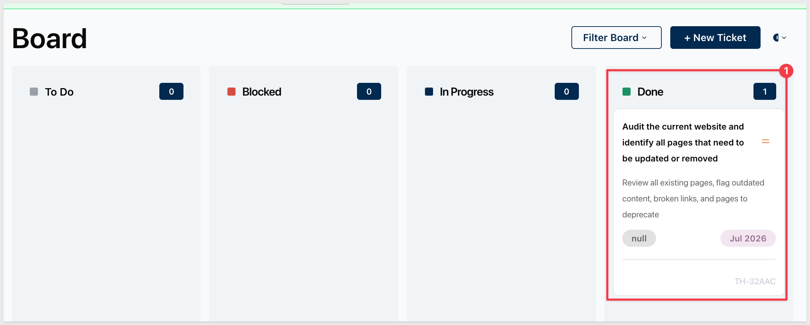 -->

The summary includes:

- Project name and current health status
- Any tickets with blockers or urgent priority
- Overall progress signal

The formula behind it aggregates ticket data — summaries, statuses, priorities, and due dates — and passes them to the model in a single `CallText()` call. It re-evaluates automatically when the project selection changes.

### AI Blocker Analysis

On the **Ticket Details View** page, selecting a blocked ticket triggers an AI-generated analysis of the blocker:

<!-- 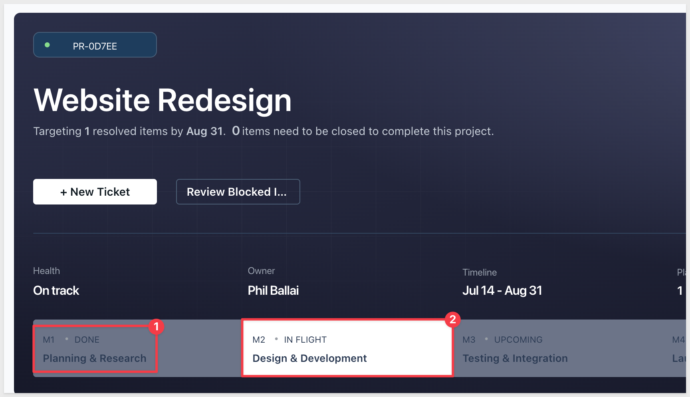 -->

The analysis draws on the ticket's summary, status, priority, due date, and any comments logged against it. It generates a concise, actionable read on the severity and likely resolution path — marked **High** severity in red when the ticket is in `BLOCKED` status.

Both summaries update dynamically as the underlying data changes. No manual refresh is needed.

**WHY IT MATTERS:**<br>
These AI features work within Sigma's existing permissions model — they can only access the data the user can already see, and they generate output on-demand rather than storing it. That keeps AI insight tightly coupled to live project state, which is exactly what operational tracking requires.


<!-- END OF SECTION-->

## Under the Hood
Duration: 10

The **Data** page contains every backend table that powers the app. It's accessible to anyone with edit access and is self-documenting — each input table is labeled with a description of what it does:

<!-- 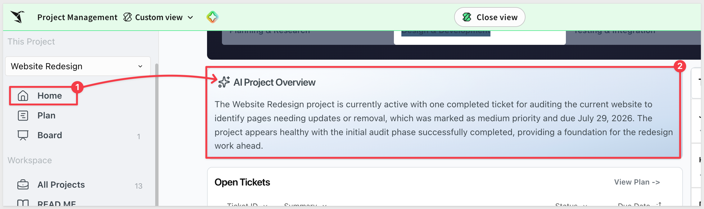 -->

Here's how the pieces fit together.

### The Three-Tier Input Table Model

All data in this app lives in input tables — there is no external warehouse data source to query. The hierarchy is:

**Projects Inputs** → stores one row per project with name, owner, goal, and dates.

**Milestones Inputs** → stores one row per milestone, linked to a project via `Project ID`. Milestones define the phases of a project and their date ranges.

**Ticket Inputs** → stores one row per ticket (plan item), linked to both a project and a milestone via `Project ID` and `Milestone ID`. Tickets carry the full execution detail: summary, status, priority, assignee, due date, and description.

**Ticket Comments** → stores comments logged against individual tickets from the Ticket Details View.

<!-- 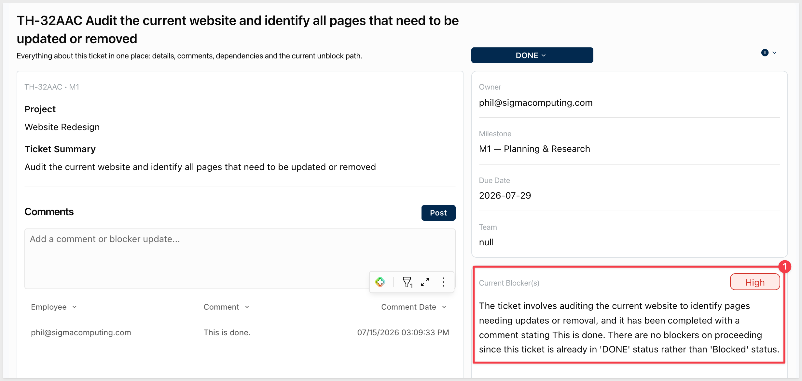 -->

This hierarchy means you can model any project structure — flat task lists, multi-phase programs, or cross-team portfolios — by varying how many milestones you create and how you assign tickets to them.

### Lookup-Derived Fields

Several fields in the app are calculated via `Lookup()` rather than stored directly:

- **Project Name** on Ticket Inputs is `Lookup([Projects Inputs/Project Name], [Project ID], [Projects Inputs/Project ID])` — resolved from the Projects table, never duplicated.
- **Milestone Name** on Ticket Inputs is similarly resolved from the Milestones table.
- **Team** on Ticket Inputs is `Lookup([Employees/Contact Job Department], [Assignee], [Employees/Identity User Email])` — auto-populated from the Employees table when an assignee email is entered.

This keeps the input tables narrow — users enter only the foreign key (an ID or email), and the display value is resolved at query time.

**WHY IT MATTERS:**<br>
Lookup-derived fields prevent the most common failure mode in multi-table apps: denormalized copies of the same value drifting out of sync. If an employee changes departments or a project is renamed, the update propagates everywhere automatically — no manual corrections required.

### Priority and Status Icons

Ticket priority and status are displayed as SVG icons rather than text labels. Both use `If()` formulas to map a stored text value (e.g., `"HIGH"`, `"BLOCKED"`) to a base64-encoded SVG data URI:

- Priority icons use different Lucide icons and colors per level: blue chevron-down for `LOW`, orange equal for `MEDIUM`, red chevrons-up for `HIGH`.
- Status is displayed as color-coded pills on the Ticket Inputs table using the `pills: color-by-option` setting — each status value gets a distinct background color automatically.

<!-- 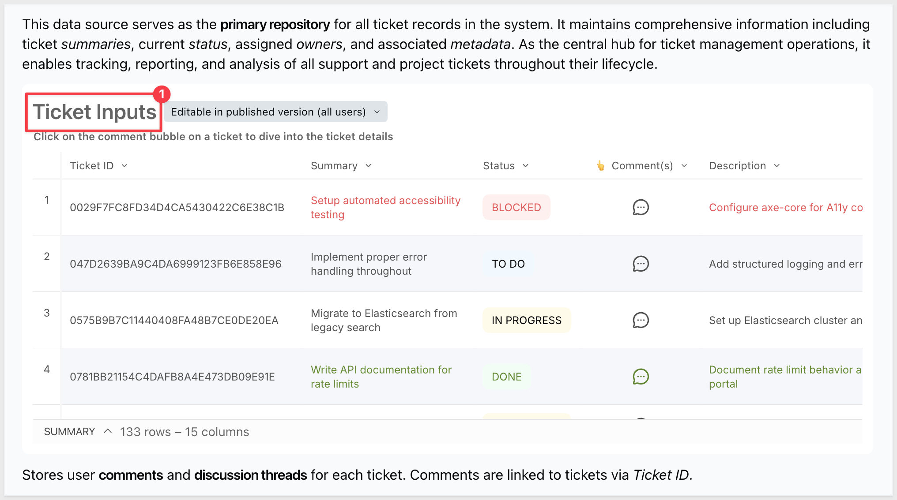 -->

### Conditional Formatting on the Plan Page

The Plan page applies a conditional row highlight to flag overdue work:

```
([Status] = "TO DO" or [Status] = "BLOCKER") and [Due Date] > [Selected Milestone Step/End Date]
```

Any ticket that hasn't started (or is blocked) and whose due date falls past the end of its milestone is highlighted in `#FFF1F0` (a light red background). This runs as a built-in conditional format on the Plan table — no formula column or manual filter required.

### AI Prompts as Inline Formulas

Unlike the Revenue Forecasting app, where AI prompts are stored as editable controls on the Data page, the Project Management app embeds the AI prompts directly in `CallText()` formulas within the canvas text elements.

Both prompts follow the same pattern: assemble a structured context string from live ticket data using `ListAgg()`, pass it to the model, and strip any stray quote characters from the output with `Replace()`:

```
Replace(
  CallText(
    "ai_complete",
    "claude-4-sonnet",
    "<instruction text>" & 
    "#PROJECT: " & [Selected Project/Project Name] & 
    "#TICKETS: " & ListAgg([Selected Project Tickets/Summary]) & 
    "#STATUS: " & ListAgg([Selected Project Tickets/Status]) & ...
  ),
  '"', ""
)
```

To modify what the AI writes, open the text element in edit mode and update the instruction string directly. The formula is visible and editable for anyone with edit access to the workbook.

<!-- 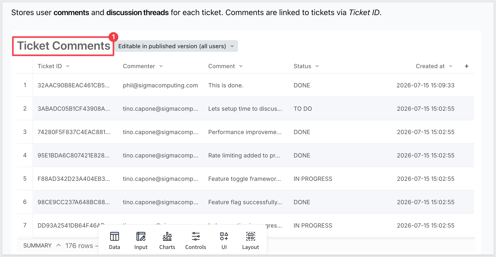 -->


<!-- END OF SECTION-->

## Connect Your Own Data
Duration: 5

Because the Project Management app runs entirely on input tables — with no external warehouse data source — connecting it to your own data is primarily about two things: pointing the input tables to the correct warehouse connection for write-back storage, and loading your existing project data.

### Verify the Write-Back Connection

All input tables (Projects, Milestones, Tickets, Comments) write to a Snowflake connection. On the **Data** page, open any input table and confirm the connection points to a warehouse where your org has write access.

If you need to move the tables to a different connection, use `Change source` on each input table to update the target.

<aside class="negative">
<strong>NOTE:</strong><br> All input tables should point to the same connection. Mixing connections across tables in the same app can cause unexpected behavior when Sigma resolves joins and lookups at query time.
</aside>

### Update the Employees Table

The **Employees** table is the only reference table in the app — it's used to auto-populate the Team field on tickets via a Lookup. By default it contains Throughline sample employee data.

To use real org members, replace the Employees table data with your own employee directory. The minimum required columns are:

| Column | Description |
|--------|-------------|
| Identity User Email | The email address used to log into Sigma |
| Org Member Full Name | Display name |
| Contact Job Department | Team or department label |

<!-- 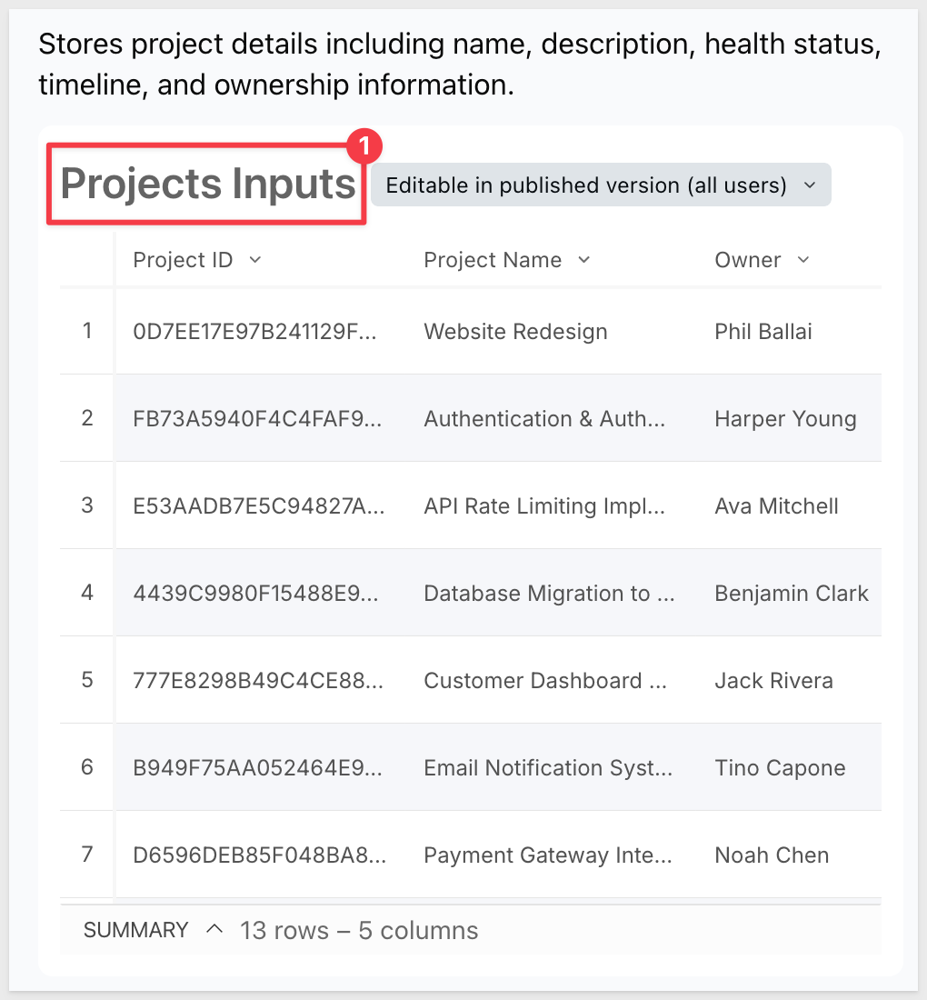 -->

Once updated, any ticket assigned to a real user email will automatically show the correct team in the Team field.

### Load Your Existing Projects

If you're migrating from a spreadsheet or another project tracking tool, you can bulk-load data into the input tables by importing rows directly. On any input table, click `Edit data` and paste structured data from a spreadsheet or export.

Alternatively, start fresh: add your projects, milestones, and first batch of tickets manually using the workflow in **Managing a Project**. The Throughline sample data can be deleted from the input tables once your own projects are in place.

<aside class="positive">
<strong>NOTE:</strong><br> The sample data ships in a separate Throughline workspace. Your personal copy of the template uses the same input tables but starts with the sample rows loaded. Delete any sample projects from Projects Inputs to start with a clean slate — their tickets and milestones will stop appearing automatically once the project rows are removed.
</aside>

### What Carries Over Automatically

Once the Employees table is updated and your projects are loaded:

- Team fields on all tickets resolve to your actual org departments
- Health status calculations on Home and All Projects run against your project data
- AI Project Overview and Blocker Analysis generate summaries based on your tickets
- The Plan page conditional formatting flags your overdue items automatically

No formula changes are needed — the app is parameterized by the data in the input tables, not hardcoded to the sample content.


<!-- END OF SECTION-->

## What We've Covered
Duration: 5

The Project Management Starter App demonstrates what's possible when Sigma's native input tables are composed into a multi-surface operational workflow. Projects, milestones, and tickets live in three connected input tables — changes on any one propagate to every page in real time. The Kanban board, milestone plan, portfolio view, and ticket detail drill-down all draw from the same source of truth.

The Lookup-derived field pattern — storing only foreign keys and resolving display values at query time — keeps the data model clean and prevents the denormalization drift that plagues spreadsheet-based project tracking. Priority and status icons map stored text values to visual representations without requiring separate columns. The conditional format on the Plan page surfaces overdue work automatically without any user action.

The AI features follow a pattern worth reusing: assemble live context from the workbook's data using `ListAgg()`, pass it to a model via `CallText()`, and surface the result inline as part of the page layout. No separate AI tool or pipeline is needed — the AI operates on the same data the user is already looking at.

These patterns apply broadly to any operational app where structured data entry, multi-level drill-down, and real-time status reporting need to coexist in a single interface.

**Additional Resource Links**

[Blog](https://www.sigmacomputing.com/blog/)<br>
[Community](https://community.sigmacomputing.com/)<br>
[Help Center](https://help.sigmacomputing.com/hc/en-us)<br>
[QuickStarts](https://quickstarts.sigmacomputing.com/)<br>

Be sure to check out all the latest developments at [Sigma's First Friday Feature page!](https://quickstarts.sigmacomputing.com/firstfridayfeatures/)
<br>

[](https://twitter.com/sigmacomputing)&emsp;
[](https://www.linkedin.com/company/sigmacomputing)&emsp;
[](https://www.facebook.com/sigmacomputing)


<!-- END OF WHAT WE COVERED -->
<!-- END OF QUICKSTART -->
