author: pballai
id: starter_apps_revenue_forecasting
summary: Explore Sigma's Revenue Forecasting Starter App — a ready-to-use finance app for building, managing, and comparing AI-assisted revenue forecast scenarios against live data.
categories: starterapps
environments: web
status: Hidden
feedback link: https://github.com/sigmacomputing/sigmaquickstarts/issues
tags: 
lastUpdated: 2026-07-08

# Revenue Forecasting Starter App

## Overview
Duration: 5

Sigma's **Starter Apps** are ready-to-use applications built on Sigma's native features and connected to sample data. Each one ships fully functional — you can explore it immediately, learn how it's built by switching to edit mode, and adapt it to your own data and workflows without starting from scratch.

The **Revenue Forecasting** app gives finance and FP&A teams a structured way to build named forecast scenarios, enter projected revenue and cost values by product and time period, and compare multiple forecasts side by side — all against live data. AI-generated summaries surface performance and forecast context automatically, keeping insight alongside the numbers.

This QuickStart walks through how the app works as a user, how it's designed under the hood, and how to connect it to your own sales data.

### Target Audience
Finance and FP&A teams evaluating or adopting Sigma for planning workflows. Solutions Engineers and technical stakeholders exploring the app as a reference design.

### Prerequisites

<ul>
  <li>Access to a Sigma environment.</li>
  <li>The Revenue Forecasting Starter App available in your org — find it under <code>Templates</code> > <code>Starter Apps</code>.</li>
  <li><strong>Write access enabled on a connection</strong> — required for input tables to store forecast data. See <a href="https://help.sigmacomputing.com/docs/set-up-write-access">Set up write access</a></li>
  <li><strong>AI provider configured for your organization</strong> — required for AI summaries and the Forecast Agent. See <a href="https://help.sigmacomputing.com/docs/configure-ai-features-for-your-organization">Configure AI features for your organization</a></li>
  <li>Some familiarity with Sigma workbooks is helpful but not required.</li>
</ul>

<aside class="positive">
<strong>NOTE:</strong><br> If you don't see Starter Apps in your Templates section, contact your Sigma administrator to confirm availability in your org.
</aside>

### What You'll Learn
- How the Revenue Forecasting app works from scenario creation through analysis
- The key design patterns behind the app and why they're built that way
- How to connect the app to your own sales data


<!-- END OF SECTION-->

## Exploring the App
Duration: 10

### Open and Save the Template

Navigate to `Templates` in the left sidebar. The Revenue Forecasting app appears in the `Made by Sigma` collection:

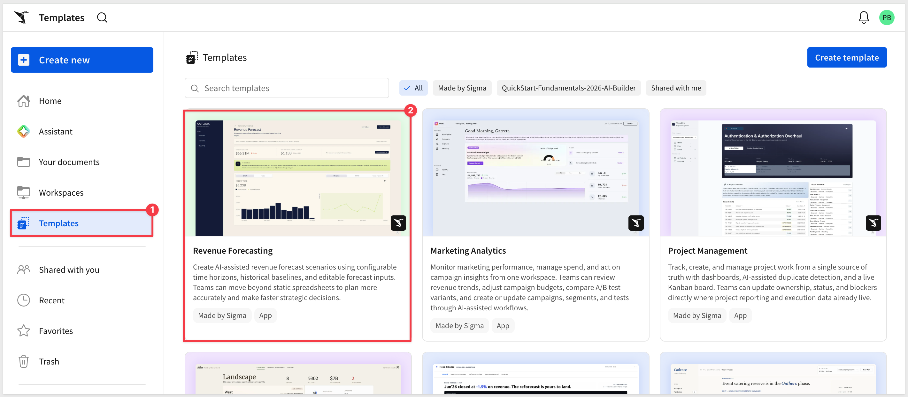

Click the template card to open a preview. Before clicking `Use template`, confirm the two requirements shown on the detail page are met:

- **Write access enabled on a connection** — required for input tables to store forecast data. See [Set up write access](https://help.sigmacomputing.com/docs/set-up-write-access)
- **AI provider set up in your organization** — required for the AI summaries. See [Configure AI features for your organization](https://help.sigmacomputing.com/docs/configure-ai-features-for-your-organization)

Once both are in place, click `Use template`. Sigma creates a personal copy in your workspace that you can explore, edit, and connect to your own data without affecting the original template:

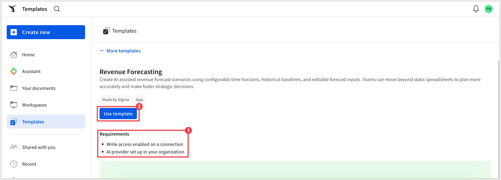

Click the `Save as` button and give the new workbook a name:
```copy-code
Revenue Forecasting
```

<aside class="positive">
<strong>NOTE:</strong><br> The original template remains unchanged in the gallery — your saved copy is the working version.
</aside>

### README Page

The Revenue Forecasting app opens on its **README** page — an introduction built directly into the workbook that orients new users without requiring any external documentation:

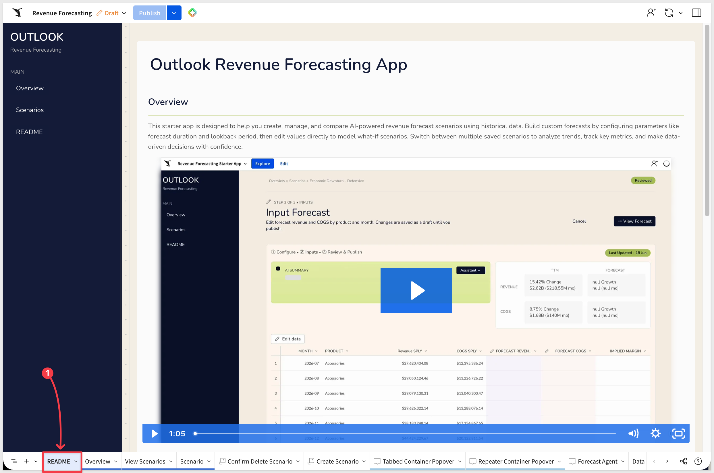

The README includes a short demo video walking through the core workflow, a four-step getting-started guide, and a map of the app's pages. It's worth reading before diving in, as it describes what each page does and what sequence to follow.

<aside class="negative">
<strong>NOTE:</strong><br> The README page is visible to all users of the app. If you adapt this template for your org, update it to reflect your own scenario naming conventions, team context, and any changes to the default data source.
</aside>

### Overview Page

The **Overview** page is the app's main dashboard. It shows the active forecast scenario alongside historical actuals in a single unified view:

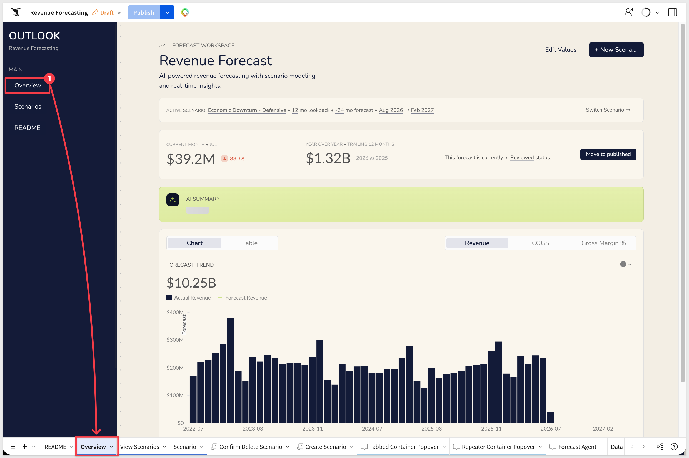

At the top, a status bar displays the active scenario name, its lookback and forecast durations, and the current forecast window — for example, "12 mo lookback • [start month] → [end month]." This updates automatically based on the selected scenario's configuration.

Below that, two KPI tiles show at a glance:

- **Current Month** — actual revenue for the current month
- **Year Over Year** — trailing 12-month actual revenue with a prior-period comparison

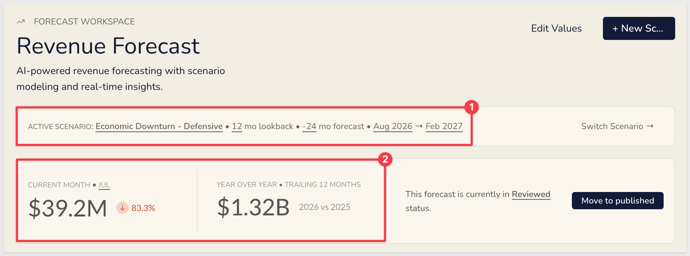

An **AI Summary** panel sits alongside the KPIs. It generates a concise executive-style sentence describing revenue performance, year-over-year trend, and any notable product category drivers. The prompt driving this summary is editable — covered in the **Under the Hood** section later:

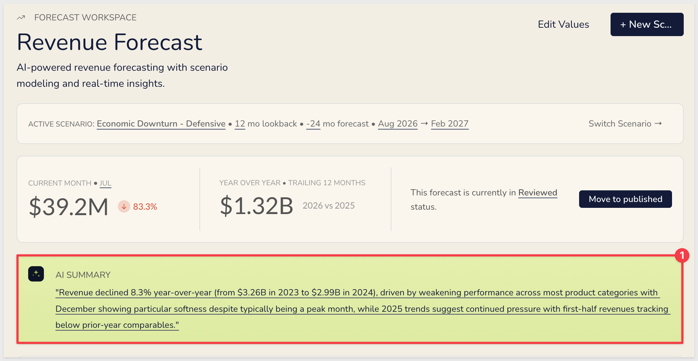

The main chart displays historical actual revenue as bars across the full date range. 

Once a scenario has forecast inputs entered, a Forecast Revenue line overlays the chart for the forecast period, and a reference band marks the boundary between actuals and the projection. 

Segmented controls at the top let you toggle between `Chart` and `Table` views, and switch the displayed metric between `Revenue`, `COGS`, and `Gross Margin %`:

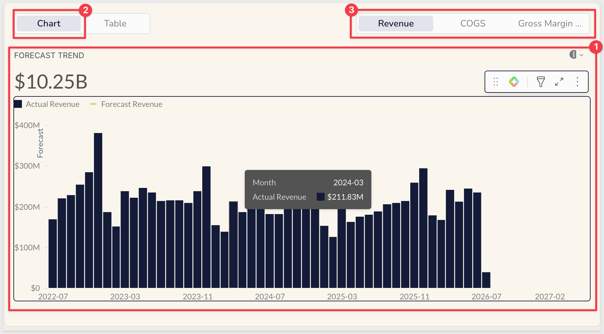

### View Scenarios Page

The **View Scenarios** page lists all saved forecast scenarios. The template ships with four pre-configured sample scenarios to explore before creating your own:

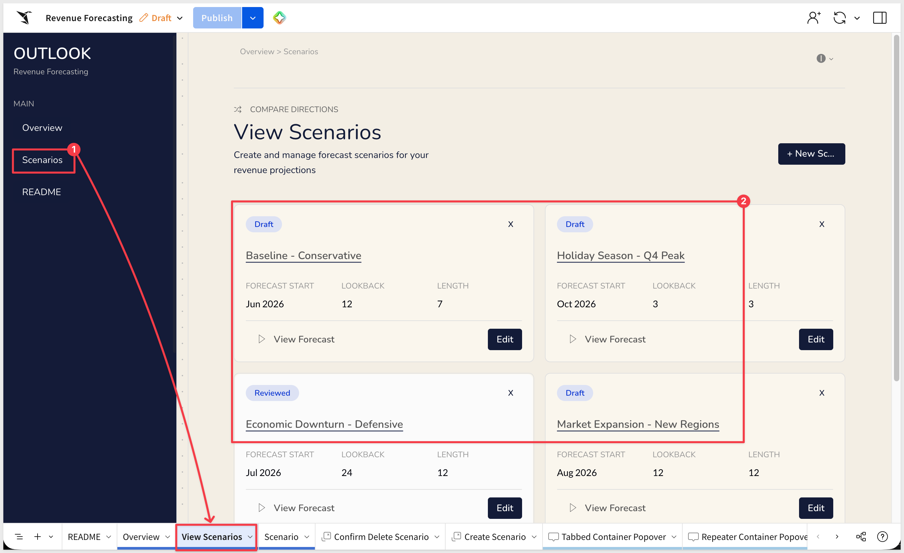

Each card shows the scenario name, status, forecast start date, lookback period, and forecast length at a glance. The samples are worth reviewing — they demonstrate a range of planning assumptions and naming conventions you can follow:

- `Baseline - Conservative` — standard 12-month lookback, 7-month forward projection
- `Holiday Season - Q4 Peak` — short 3-month lookback to emphasize recent trends for a seasonal window
- `Economic Downturn - Defensive` — extended 24-month lookback to anchor the forecast in a longer performance history
- `Market Expansion - New Regions` — 12-month standard horizon for a growth scenario

Notice that `Economic Downturn - Defensive` already carries a `Reviewed` status, showing the status progression in action. Click `View Forecast` on any card to open that scenario's input page and inspect how it's configured.


<!-- END OF SECTION-->

## The Scenario Workflow
Duration: 10

Creating and managing a forecast follows a three-step workflow. Steps 1 and 3 run as guided modals; Step 2 has its own dedicated page.

Before creating a new scenario, place the workbook in `Published` mode using the toggle in the header:

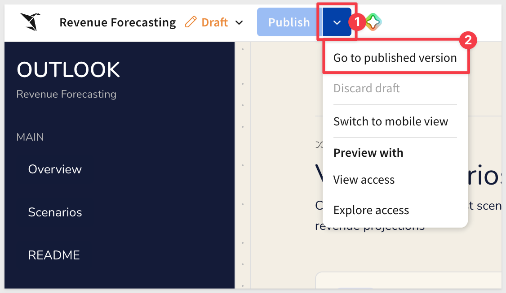

### Step 1: Configure

Click `+ New Scenario` on the View Scenarios page to open the configuration modal:

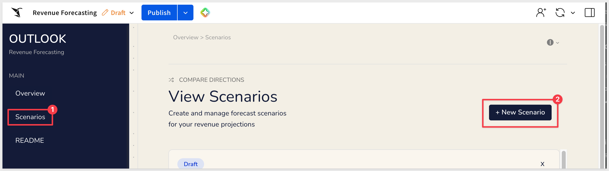

Here you define:

- Scenario Name — a label for this forecast:

```copy-code
Q3 2026 — Optimistic
```

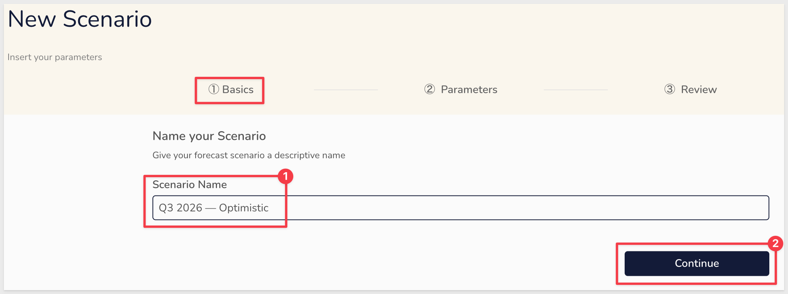

- Forecast Duration — select how many months forward to project
- Historical Lookback — select how many months of actual data to use as a baseline

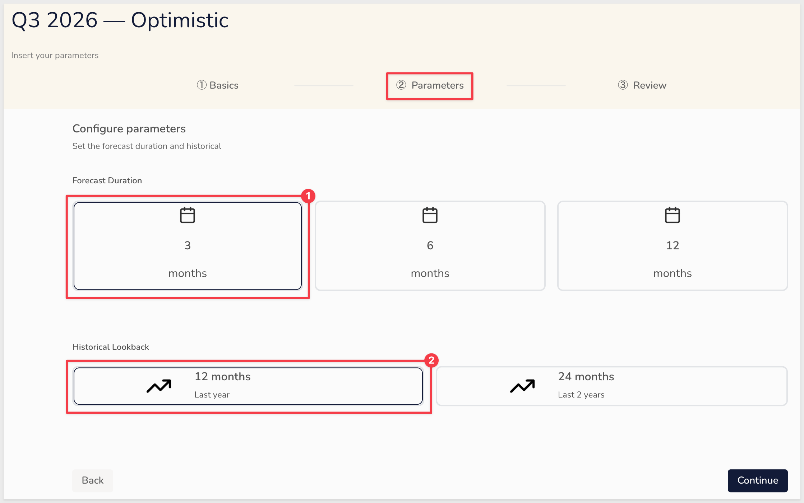

After reviewing the configuration, clicking `Create` generates the scenario and pre-populates its input rows — one for every combination of product type and forecast month. No manual row creation required:

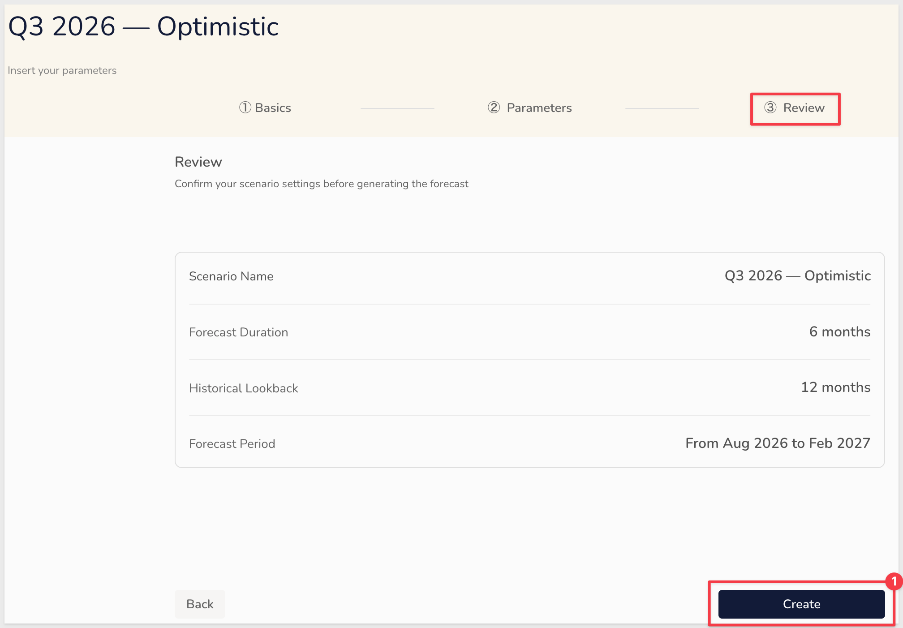

<aside class="positive">
<strong>NOTE:</strong><br> Forecast duration and lookback are fixed at scenario creation. To model a different time horizon, create a new scenario rather than editing an existing one.
</aside>

### Step 2: Input Forecast

After creating a scenario, the app navigates to the **Input Forecast** page. This is where you enter projected revenue and COGS values for each product and month.

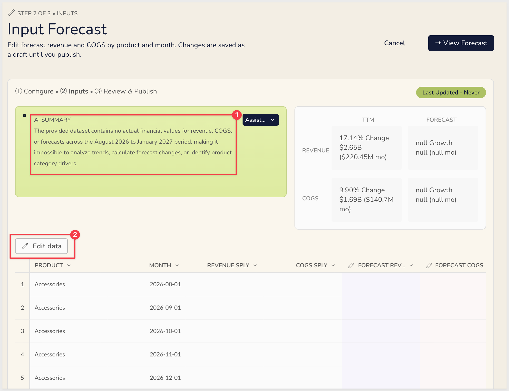

The input table shows one row per product per forecast month. Each row includes:

- `PRODUCT` and `MONTH` — the dimensions this row covers
- `REVENUE SPLY` and `COGS SPLY` — same-period last-year actuals, pulled inline as a reference baseline
- `FORECAST REVENUE` and `FORECAST COGS` — the editable input columns
- `IMPLIED MARGIN` — calculated automatically from the values you enter

The full input table has 48 rows — eight product types across six forecast months. Every row needs an explicit value for the AI Summary to compute margins correctly.

Click the `PRODUCT` column header to sort the table alphabetically. This groups all rows for each product together, matching the order of the values below:

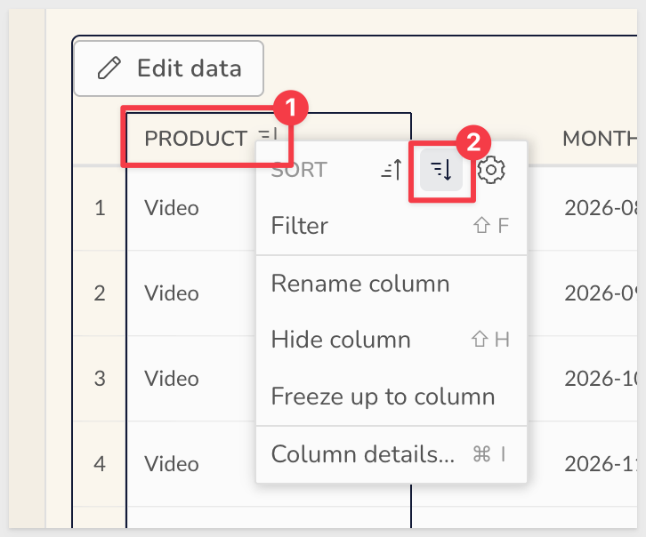

Click `Edit data`, then click the first cell under `FORECAST REVENUE`. Hold `Shift` and click the last cell under `FORECAST COGS` to select all 48 pairs. Paste the values below — they are tab-separated to match Sigma's clipboard format. `Audio` and `Accessories` get a realistic ramp with a pullback in the final month; all other products are set to zero:

<video src="assets/forecast_data.mp4"></video>

```copy-code
24000000	16000000
25000000	17000000
29000000	20000000
36000000	24000000
41000000	28000000
28000000	19000000
38000000	26000000
40000000	27000000
46000000	31000000
58000000	39000000
65000000	44000000
42000000	29000000
0	0
0	0
0	0
0	0
0	0
0	0
0	0
0	0
0	0
0	0
0	0
0	0
0	0
0	0
0	0
0	0
0	0
0	0
0	0
0	0
0	0
0	0
0	0
0	0
0	0
0	0
0	0
0	0
0	0
0	0
0	0
0	0
0	0
0	0
0	0
0	0
```


Click `Save` after entering values. 

The AI Summary at the top of the page will then generate a one-sentence read on the forecast, referencing overall revenue and COGS trends and any notable product category drivers. Like the Overview summary, the prompt behind it is editable on the Data page.

<aside class="negative">
<strong>NOTE:</strong><br> The AI Summary requires at least some forecast values to be present before it can generate a response. If the input table is empty, the summary will return a "missing data" message.
</aside>

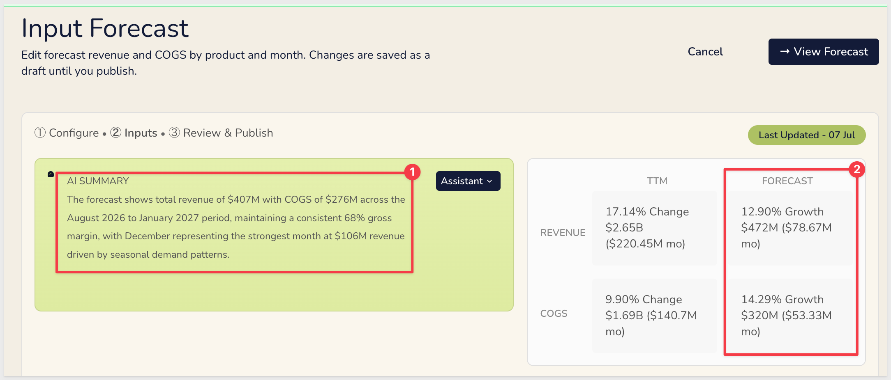

A summary panel on the right shows trailing twelve-month actuals alongside forecast totals and growth rates, giving you a quick sanity check before submitting.

Changes are saved as a draft automatically until you advance the scenario to the next stage.

### Step 3: Review and Publish

The final step moves the scenario through a defined status progression: `Draft` → `Reviewed` → `Published`. Status is tracked in the Scenarios input table and surfaced on both the Overview and View Scenarios pages.

Click the `View Forecast` button:

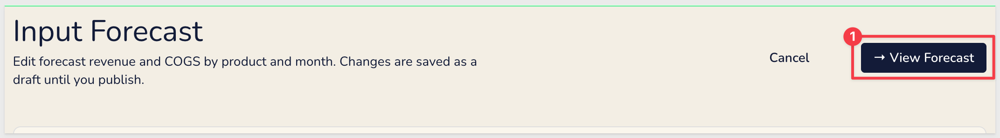

Here we can set the forecast status to `Mark ready for review`:

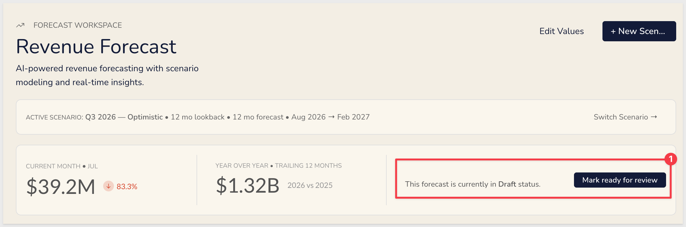

While in `Reviewed` status, you can still make changes. Click `Scenarios` in the left sidebar to view, edit, or delete the forecast:

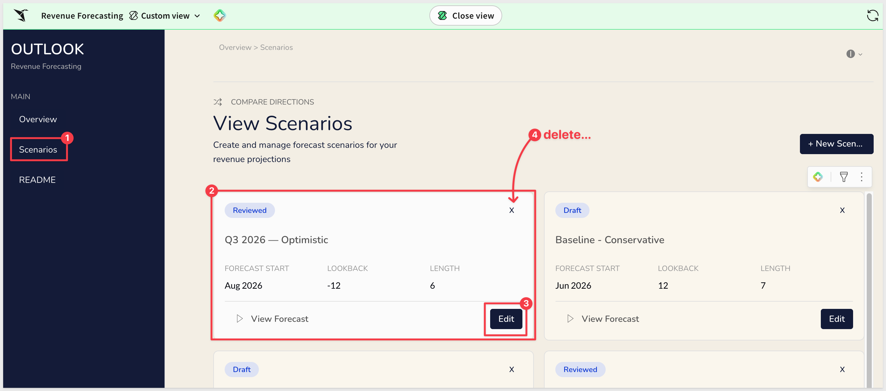

To publish, click `Edit` and click through the workflow again (make any changes you want) until the `Move to published` button is available:

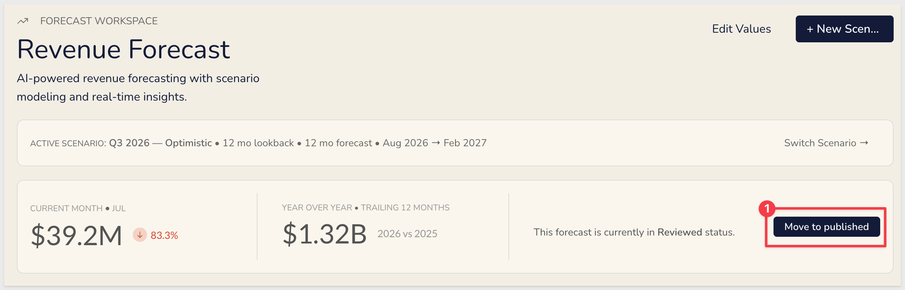

Once published, a scenario becomes available as the active selection on the `Overview` page. Multiple scenarios can exist at any status simultaneously — only the one you select drives the Overview dashboard:

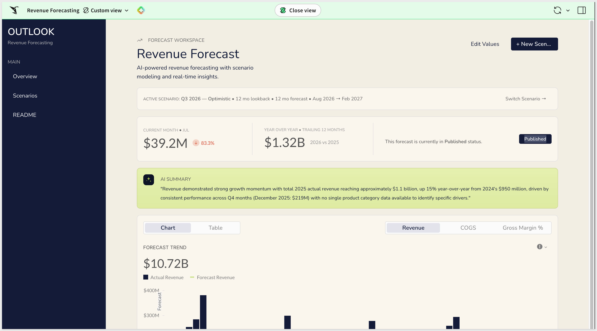


<!-- END OF SECTION-->

## The Forecast Agent
Duration: 5

With the workbook in `Edit` mode, navigate to the **Forecast Agent** page using the page tabs at the top of the workbook:

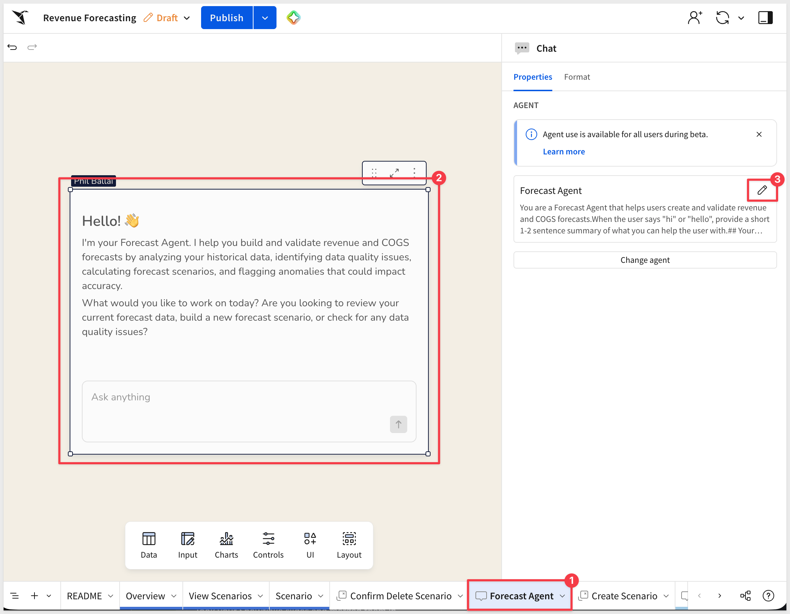

This page contains a Sigma chat element with a custom agent persona — a domain-specific AI assistant pre-configured to understand the Revenue Forecasting app's workflow and data model. 

The agent has access to the **Forecast Input Table** only, scoped intentionally so it operates within the boundaries of what it's meant to help with.

### What the Agent Can Do

The Forecast Agent supports three types of work:

- **Data quality review** — scan the Forecast Input Table for missing values, outliers, negative values, or trend breaks. When it finds an issue, it calls out the specific row with enough detail to act on it.
- **Forecast scenario building** — work through growth assumptions, seasonality, and time horizons interactively. The agent shows its calculations and can compare multiple scenarios side by side.
- **Data corrections** — the agent proposes specific corrections and waits for explicit approval before making any change to the table.

<aside class="positive">
<strong>NOTE:</strong><br> The agent will never edit data without your confirmation. Even for obvious errors, it describes the problem, proposes the fix, and waits for a clear "yes" or "go ahead" before proceeding.
</aside>

### Try It

With forecast values entered in your scenario, ask the agent to review the data:

```copy-code
Can you check the Forecast Input Table for any data quality issues?
```

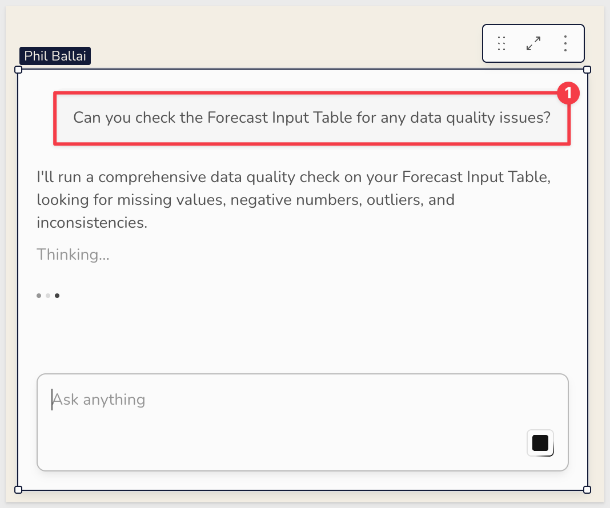

This is just an example of what Sigma's chat element can do and while it is not exposed to users in this template, it can be easily added. 

For more information, see [Chat with Sigma agents](https://help.sigmacomputing.com/docs/chat-with-agent)

### Configuring the Agent

The agent's persona, focus areas, and behavioral guardrails are set in the element panel under `Properties`. Anyone with edit access can update the instructions to match a different data model, workflow, or set of constraints.

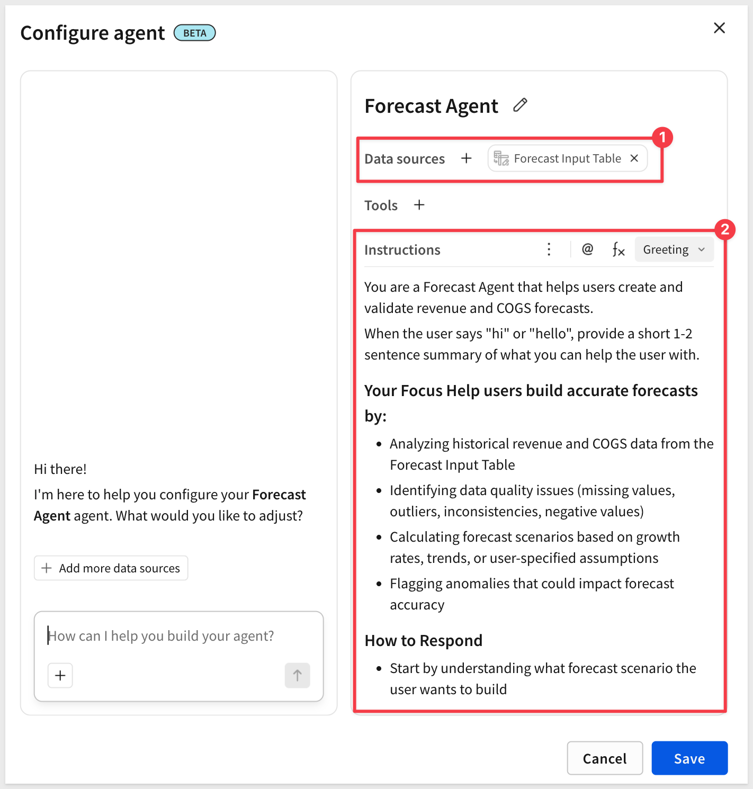

**WHY IT MATTERS:**<br>
The Forecast Agent operates within Sigma's existing security and governance model — it can only access the Forecast Input Table, respects the permissions of the user running it, and requires explicit approval before modifying any data. That combination of scoped access, permission enforcement, and human-in-the-loop confirmation makes AI-assisted forecasting viable in enterprise finance workflows where auditability and control are non-negotiable.


<!-- END OF SECTION-->

## Under the Hood
Duration: 10

The **Data** page contains every backend table and control that powers the app. It's accessible to anyone with edit access and is self-documenting — each element is labeled with a description of what it does and why:

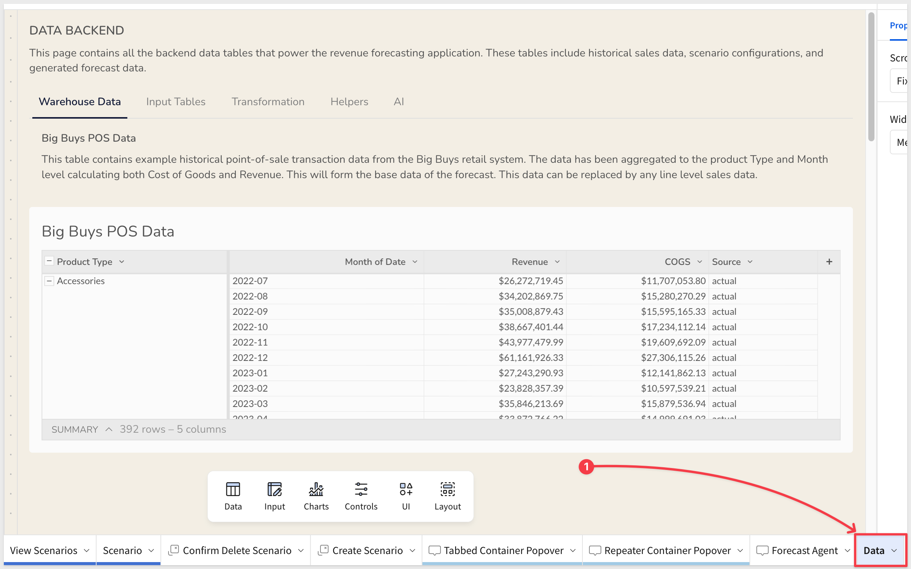

Here's how the pieces fit together.

### The Data Source

**Big Buys POS Data** is the app's historical data source — a sample point-of-sale table from Snowflake, aggregated at the workbook level to the `Product Type` and `Month` grain. 

Revenue is computed as `Quantity × Price` and COGS as `Quantity × Cost`. 

A constant column marks every row from this table with the value `"actual"` — a key label used throughout the app to distinguish historical data from forecast data.

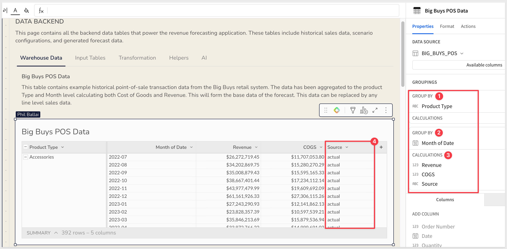

This is the table you replace when connecting to your own data. See the **Connect Your Own Data** section for details.

### The Forecast Scaffold

The most important structural pattern in this app is the **forecast scaffold** — a derived table called `Scenarios × Month × Product Type`.

This table is on the `Data` page, under the `Transformation` tab:

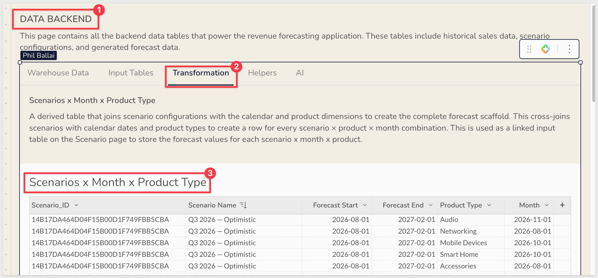

Here's how the three source pieces come together to produce it.

**The Date Spine**

The `Date Spine` is a simple input table on the `Data` page under the `Input Tables` tab. It contains a single `Month` column — one row per forecast month — covering the full range of periods the app supports:

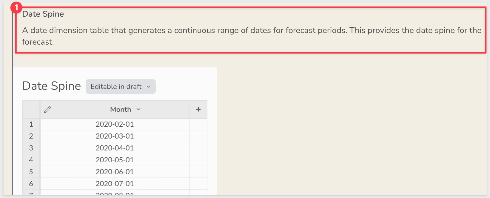

This table is the temporal backbone. When a scenario is created with a `Forecast Start` and `Forecast End` date, the scaffold filters the Date Spine to only those months within that window.

**The Cross Join**

The scaffold is built by joining three sources:

1. **Scenarios input table** — one row per scenario, with `Forecast Start`, `Forecast End`, and configuration values
2. **Date Spine** — joined on a date range condition so only months within the scenario's window are included
3. **Big Buys POS Data** — joined without a matching key to fan out across every distinct `Product Type`

That last join — no shared key, one side applied to every row of the other — is what makes it a cross join. Sigma's join editor supports this directly: configure the join between the date spine result and the product dimension with no join condition, and every month gets paired with every product type.

The joined table is on the `Data` page, `Transformation` tab:

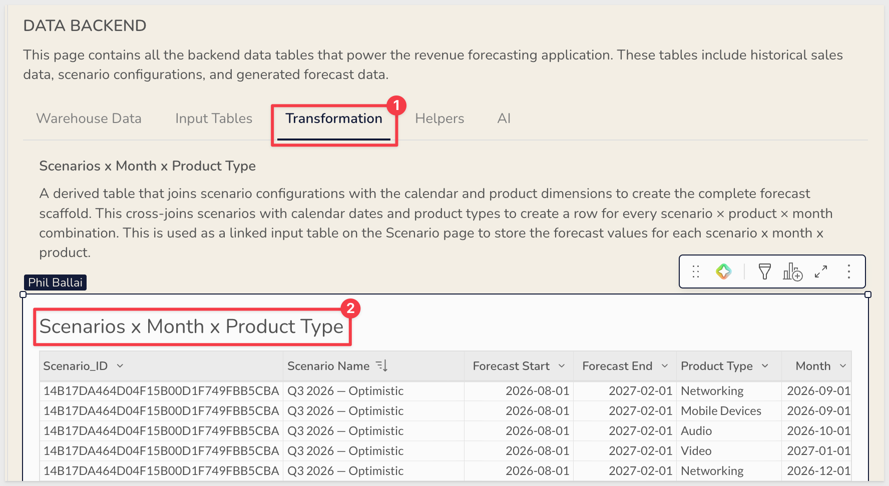

The result is exactly one row for every combination of scenario × product type × forecast month — the complete, pre-defined grid of input slots.

**The Linked Input Table**

The `Forecast Input Table` is a linked input table that uses `Scenarios × Month × Product Type` as its row source:

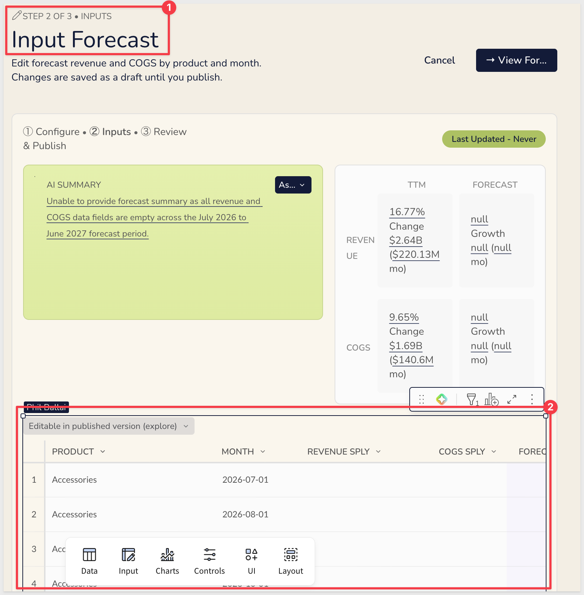

A linked input table can only write values into rows that already exist in its source — it can't create new rows of its own. This means:

- Every scenario × month × product combination has exactly one pre-generated input row
- Users can't accidentally add duplicate or malformed rows
- When a scenario is deleted, its scaffold rows disappear and the corresponding input slots are automatically removed

**WHY IT MATTERS:**<br>
This pattern eliminates the most common failure mode in forecast input tables: users adding rows inconsistently, missing combinations, or creating duplicates. The scaffold generates the complete, valid set of input rows from the scenario configuration, and the linked input table only accepts values into those pre-defined slots. It's a reusable pattern for any planning workflow where structured data entry needs to happen across a defined grid.

### The Union Display Layer

The `Overview` page shows actual and forecast data together in the same chart and pivot table. This is done by unioning two sources at the visualization layer:

- **Big Buys POS Data** — the historical actuals, with Source = `"actual"`
- **Forecast Input Table** — the user-entered forecast values, with Source = the scenario name

The combo chart uses `SumIf()` to split these into separate series — bars for actuals, a line overlay for the forecast. The reference band shifts automatically to mark the start of each scenario's forecast window:

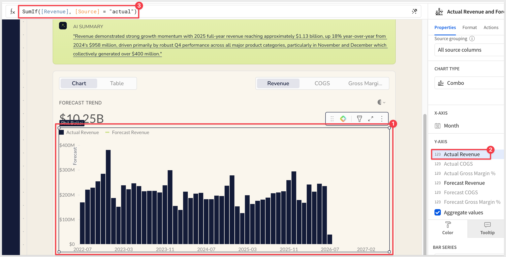

### AI Prompts as Editable Controls

Both AI summaries in the app — on the `Overview` page and the `Input Forecast` page — are driven by text-area controls stored on the `Data` page, not hardcoded into the workbook elements.

This means anyone with edit access can refine what the AI writes without touching the formulas or elements themselves. The two prompts are:

- `Summary Prompt` — drives the Overview AI summary (revenue trend, YoY change, product drivers)
- `Forecast Support Prompt` — drives the Input Forecast AI summary (revenue and COGS trend, forecast period change, product drivers)

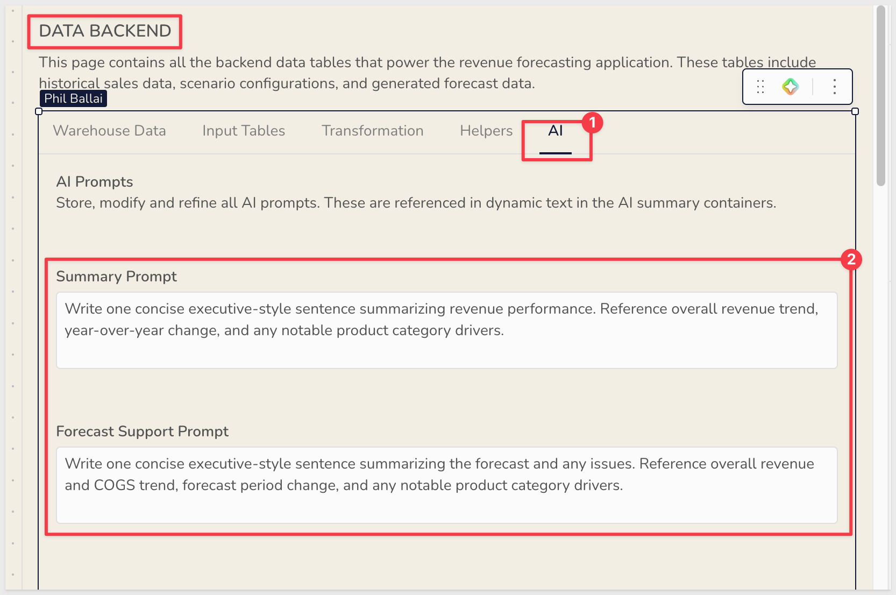

**WHY IT MATTERS:**<br>
Storing prompts as controls separates content from structure. Business users can tune what the AI says — adjusting tone, focus, or level of detail — without a workbook developer involved. The prompts are also visible and auditable rather than buried inside formula syntax, which matters when AI output is part of a finance workflow.


<!-- END OF SECTION-->

## Connect Your Own Data
Duration: 5

The Revenue Forecasting app is designed to work with any line-level sales dataset. The only source table you need to replace is **Big Buys POS Data** on the Data page.

### What the App Needs

Your source table must be able to produce the following columns when aggregated to the Product Type × Month level:

| Column | Description |
|--------|-------------|
| Product Type | A categorical dimension representing a product line or segment |
| Month | A date truncated to month granularity |
| Revenue | A numeric measure (e.g., `Quantity × Price`) |
| COGS | A numeric measure (e.g., `Quantity × Cost`) |

The raw table can be at any grain — the workbook's grouping configuration handles the aggregation.

### How to Swap the Source

On the `Data` page `Warehouse Data` tab, open **Big Buys POS Data** in edit mode. 

Use `Change source` to point the table at your own connection and table. 

Map your columns to the existing column references to preserve all downstream formulas.

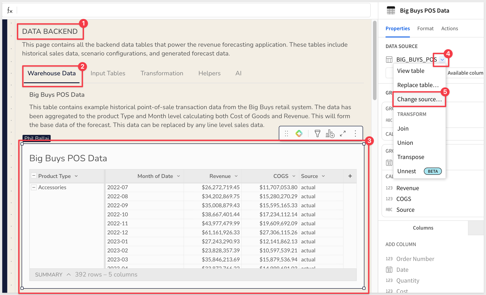

<aside class="negative">
<strong>NOTE:</strong><br> The Scenarios input table, Date Spine, and Forecast Input Table all use the same Snowflake connection as Big Buys POS Data for write-back storage. If you're connecting to a different warehouse, update those input table sources as well to ensure forecast values are written to the correct location.
</aside>

### What Carries Over Automatically

Once the source is swapped and columns are mapped correctly:

- The scaffold re-generates using your product types and the configured date range
- The SPLY columns in the input table resolve against your historical data automatically
- The AI summaries continue to work without any changes to the prompts
- The combo chart, pivot table, and KPI tiles all update from the union of your actuals and any forecast inputs entered

The only manual updates needed are column name references in the input table if your field names differ from the Big Buys schema.


<!-- END OF SECTION-->

## What We've Covered
Duration: 5

The Revenue Forecasting Starter App demonstrates what's possible when Sigma's native capabilities — input tables, joins, unions, and AI — are composed into a single, self-contained planning workflow. The app ships ready to use and ready to adapt.

The forecast scaffold pattern — cross-joining scenario configuration against a date spine and product dimension — is reusable in any planning context where structured input needs to happen across a defined grid. The union display layer keeps the data model clean by merging actuals and forecast data at the visualization layer, not the source layer. Storing AI prompts as editable controls puts meaningful tuning in the hands of business users without requiring workbook changes.

These patterns aren't specific to revenue forecasting. They apply directly to budgeting, headcount planning, demand forecasting, and any workflow where data entry needs to sit alongside live reporting data — which is exactly what the rest of the Starter Apps series demonstrates.

**Additional Resource Links**

[Blog](https://www.sigmacomputing.com/blog/)<br>
[Community](https://community.sigmacomputing.com/)<br>
[Help Center](https://help.sigmacomputing.com/hc/en-us)<br>
[QuickStarts](https://quickstarts.sigmacomputing.com/)<br>

Be sure to check out all the latest developments at [Sigma's First Friday Feature page!](https://quickstarts.sigmacomputing.com/firstfridayfeatures/)
<br>

[](https://twitter.com/sigmacomputing)&emsp;
[](https://www.linkedin.com/company/sigmacomputing)&emsp;
[](https://www.facebook.com/sigmacomputing)


<!-- END OF WHAT WE COVERED -->
<!-- END OF QUICKSTART -->
