author: pballai
id: starter_apps_shift_management
summary: starter_apps_shift_management
categories: starterapps
environments: web
status: Hidden
feedback link: https://github.com/sigmacomputing/sigmaquickstarts/issues
tags: 
lastUpdated: 2026-07-18

# Shift Management Starter App

## Overview
Duration: 5

Sigma's **Starter Apps** are ready-to-use applications built on Sigma's native features and connected to sample data. Each one ships fully functional — you can explore it immediately, learn how it's built by switching to edit mode, and adapt it to your own projects without starting from scratch.

The **Shift Management** app — called **Clockwork** — gives restaurant and hourly-workforce teams a single surface for building weekly schedules, tracking attendance, logging clock-in and clock-out times, and monitoring labor costs against budget. Managers can spot coverage gaps at a glance, fill open shifts, flag attendance issues in real time, and get an AI-generated briefing on the week's operational priorities. The same structure adapts to any team that manages shift-based scheduling — retail, hospitality, healthcare, or operations.

This QuickStart walks through how the app works across each of its pages, how the AI summary is built, and how to adapt it for your own team.

### Target Audience
Restaurant managers and operations leads evaluating Sigma for shift scheduling and workforce tracking. Solutions Engineers and technical stakeholders exploring the app as a reference design for input-table-driven scheduling, attendance tracking, and AI-assisted labor operations.

### Prerequisites

<ul>
  <li>Access to a Sigma environment.</li>
  <li>The Shift Management Starter App available in your org — find it under <code>Templates</code> > <code>Starter Apps</code>.</li>
  <li><strong>Write access enabled on a connection</strong> — required for the input tables that store shift definitions, assignments, attendance records, and budget data. See <a href="https://help.sigmacomputing.com/docs/set-up-write-access">Set up write access</a></li>
  <li><strong>AI provider configured for your organization</strong> — required for the Agent Summary on the Labor Performance page. See <a href="https://help.sigmacomputing.com/docs/configure-ai-features-for-your-organization">Configure AI features for your organization</a></li>
  <li>Some familiarity with Sigma workbooks is helpful but not required.</li>
</ul>

<aside class="positive">
<strong>NOTE:</strong><br> If you don't see Starter Apps in your Templates section, contact your Sigma administrator to confirm availability in your org.
</aside>

### What You'll Learn
- How Clockwork manages the full scheduling workflow — from building the weekly schedule through tracking attendance and analyzing labor costs
- How the AI Agent Summary on the Labor Performance page is built and what data it draws from
- The data model behind the app and the key design patterns it uses
- How to adapt the app for your team and connect it to your own employee data


<!-- END OF SECTION-->

## Exploring the App
Duration: 10

### Open and Save the Template

Navigate to `Templates` in the left sidebar. The Shift Management app appears in the `Made by Sigma` collection:

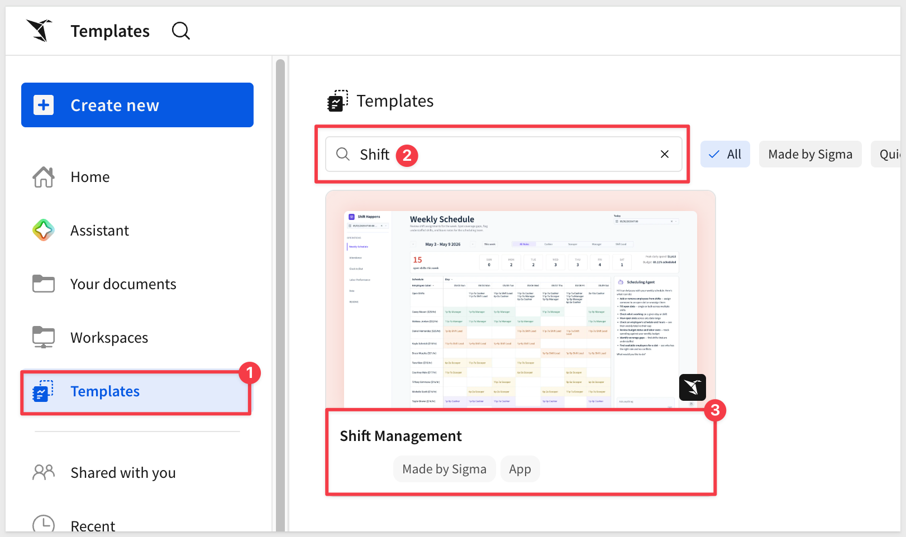

Click the template card to open a preview. Before clicking `Use template`, confirm both requirements shown on the detail page are met:

- **Write access enabled on a connection** — required for input tables to store shifts, assignments, and attendance records. See [Set up write access](https://help.sigmacomputing.com/docs/set-up-write-access)
- **AI provider set up in your organization** — required for the Agent Summary on the Labor Performance page. See [Configure AI features for your organization](https://help.sigmacomputing.com/docs/configure-ai-features-for-your-organization)

Once both are in place, click `Use template`. Sigma creates a personal copy in your workspace:

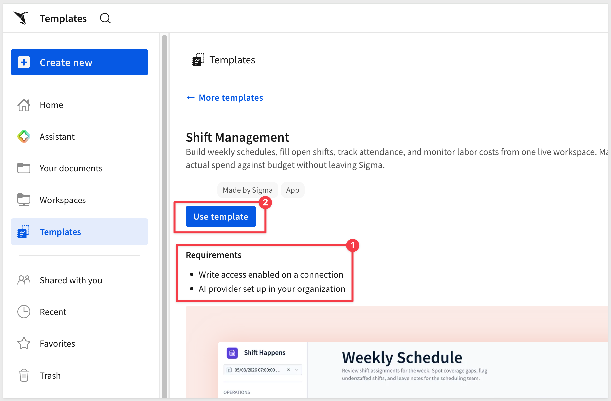

Click `Save as` and give the workbook a name:
```copy-code
Shift Management
```

<aside class="positive">
<strong>NOTE:</strong><br> The original template remains unchanged in the gallery — your saved copy is the working version.
</aside>

### README Page

The app opens on its **README** page — an orientation guide built directly into the workbook:

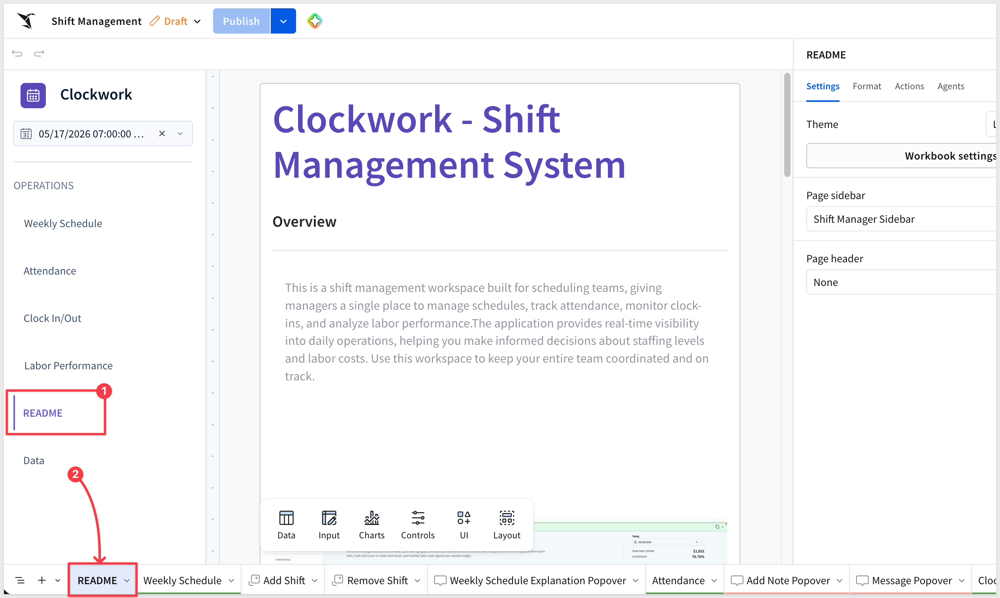

The README includes a demo video, a five-step getting-started guide, and a description of each application page. The recommended sequence is:

1. **Create Weekly Schedule** — build shift assignments by adding employees to shifts throughout the week
2. **Review Schedule Coverage** — check the Weekly Schedule page to ensure all shifts are properly staffed and balanced across roles
3. **Track Attendance** — monitor scheduled vs. actual attendance on the Attendance page to spot no-shows or late arrivals
4. **Monitor Clock In/Out Activity** — use the Clock In/Out page to log employee punch times and flag early or late clock-ins
5. **Analyze Labor Performance** — review labor costs, overtime, and variance against budget on the Labor Performance page

<aside class="negative">
<strong>NOTE:</strong><br> The README page is visible to all users of the app by default. If you adapt this template for your org, update the getting-started steps to reflect your team's shift types, roles, and schedule cycle.
</aside>

Place the workbook into `Published` mode:

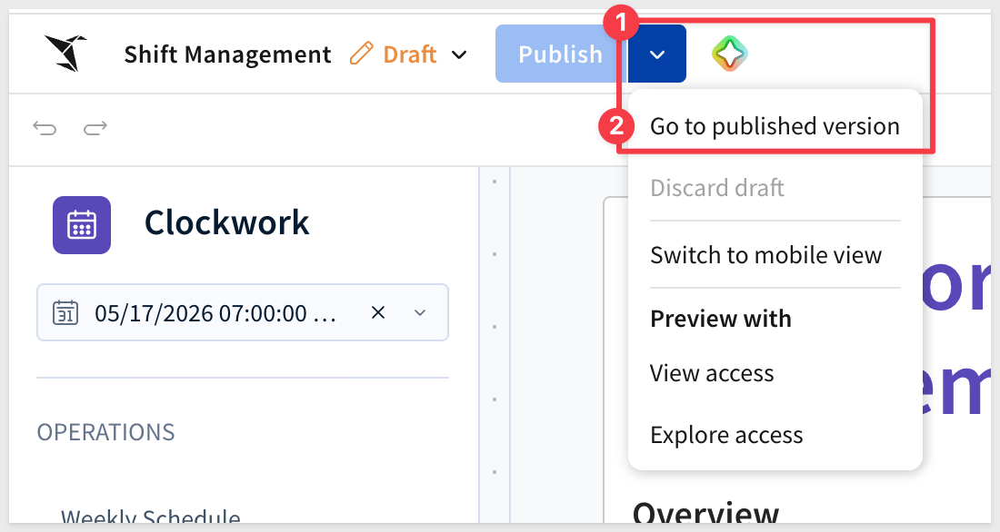

### App Pages

Clockwork has four active pages and a hidden data backend:

- **Weekly Schedule** — the scheduling hub: view and edit shift assignments by day and employee, spot coverage gaps, and monitor labor cost against budget
- **Attendance** — day-level attendance view: track who has clocked in, flag no-shows and late arrivals, and add notes to individual shifts
- **Clock In/Out** — employee self-service surface for logging punch times; designed to be embedded in a mobile app so workers can clock in from their phones
- **Labor Performance** — weekly cost summary: actual vs. projected spend by day, an AI-generated manager briefing, and an employee-level hours and cost breakdown
- **Data** — hidden backend containing all input tables, derived views, and AI prompt controls

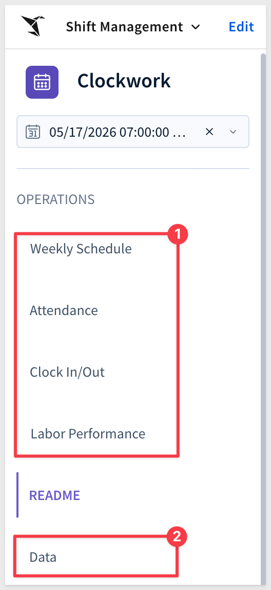


<!-- END OF SECTION-->

## Building the Weekly Schedule
Duration: 10

The **Weekly Schedule** page is the manager's primary workspace for building and maintaining the week's shift assignments.

### Page Header

The header shows a live count of shifts that still need coverage this week and two KPI tiles on the right:

- **PEAK DAILY SPEND** — the highest single-day projected labor cost across the week, calculated using `Greatest(SumIf(...))` across all seven days
- **SCHEDULED** — total projected cost as a percentage of the weekly budget, pulled via `Lookup` from the Weekly Budget input table

A date range control at the top lets you navigate between weeks. The date range title updates dynamically — `{{[dates-input].start | %b %-d}} - {{[dates-input].end | %b %-d %Y}}` — so the header always reflects the selected week.

<!-- 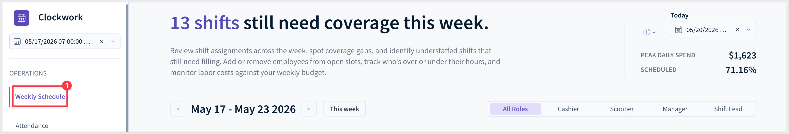 -->

### Needed Coverage by Day

Below the header, a seven-day strip shows open shift counts by day (SUN through SAT). Each day's count comes from `CountIf([New Schedule/Employee label] = "Open Shifts", ...)` filtered to that specific day. Days with open slots stand out at a glance, making it easy to prioritize which days to fill first.

<!-- 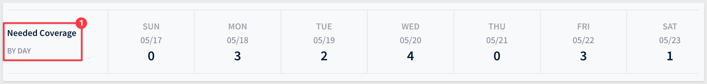 -->

### Schedule Grid

The main schedule grid is a pivot table organized by shift name (rows) and day (columns). Each cell shows the assigned employee name or `Open Shifts` for unfilled slots. A `Role` segmented filter at the top of the grid lets you narrow the view to a single role — useful when staffing specific positions like Cook or Bartender.

To assign an employee to an open slot, click the cell and select from the employee dropdown. The assignment is written to the **Shift Assignments** input table:

<!-- 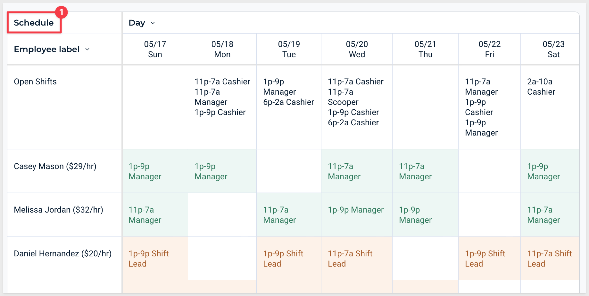 -->

<aside class="positive">
<strong>NOTE:</strong><br> The "Open Shifts" label in unfilled cells is not a null — it's a placeholder employee in the Open Shifts Employee input table. This lets the pivot table display coverage gaps as visible rows rather than empty cells. The pattern is explained in the Under the Hood section.
</aside>

### Employee Hours and Cost Summary

Below the schedule grid, a per-employee summary table shows scheduled hours, projected cost, and whether any employee is approaching or over their weekly hour limit. This makes it straightforward to balance hours across the team before publishing:

<!-- 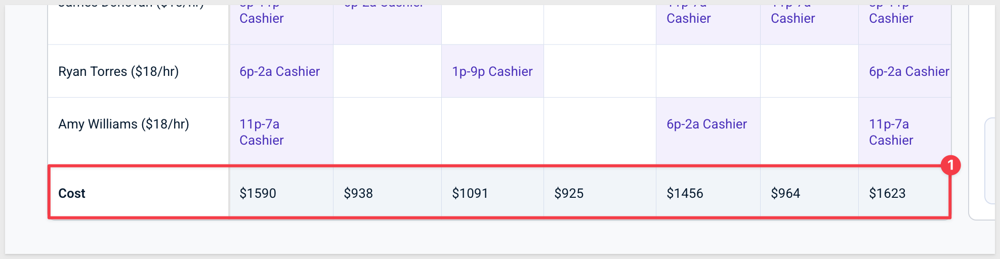 -->


<!-- END OF SECTION-->

## Tracking Attendance
Duration: 10

The **Attendance** page gives managers a real-time view of who has shown up, who is late, and who has not appeared for their scheduled shift.

### Page Header

The header KPI shows **SCHEDULED TODAY** — a count of assigned employees (excluding open slots) for the selected date. A `Today` date control at the top of the page lets you move between days without navigating away:

<!-- 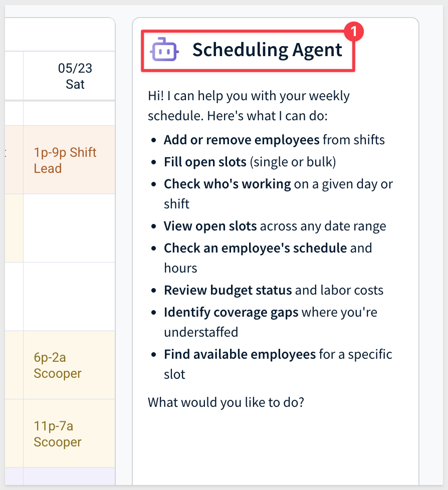 -->

### Attendance Table

The main table shows one row per shift assignment for the selected day. Columns include:

- **EMPLOYEE** and **ROLE** — who is scheduled and in what position
- **SHIFT** — shift name with color-coded pill (Opening, Morning, Mid, Afternoon, Evening, Closing)
- **SCHEDULED START / END** — the shift's planned start and end times
- **CLOCK IN / CLOCK OUT** — actual punch times from the Attendance input table (blank if not yet logged)
- **STATUS** — `On Time`, `Late`, `No Show`, `Early Out`, `On Shift`, or `Completed`, rendered as color-coded pills

To update an attendance record, click the row to select it, then edit the status or add notes directly in the table. Changes write to the **Attendance** input table:

<!-- 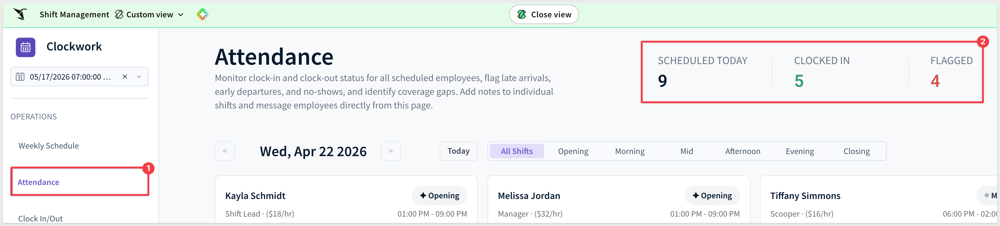 -->

<aside class="positive">
<strong>NOTE:</strong><br> The status values and their color assignments are defined in the Attendance input table's column configuration on the Data page. To add a new status category, update the input table's allowed values there — no formula changes required.
</aside>

### Flagging Issues

The Attendance page also surfaces a late/over metric in the header. Employees who clock in more than a few minutes past their scheduled start time, or who clock out early, appear with their Delta values visible. The **Delta** column in the underlying Attendance table is a computed formula: `DateDiff("minute", [scheduled_start], [actual_clock_in])` — a positive number means the employee clocked in late; a negative number means they arrived early.

<!-- 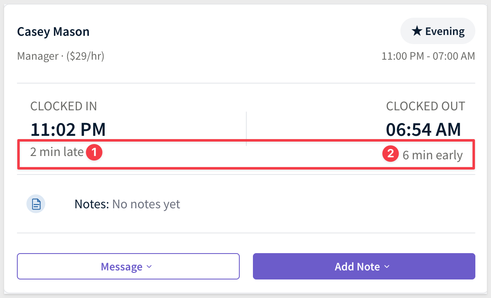 -->

**WHY IT MATTERS:**<br>
Attendance records in Clockwork are write-surfaces, not read-only imports. Managers mark status directly in the app rather than in a separate system, and those records immediately power the Labor Performance summary and AI briefing. A single input table connects the scheduling, attendance, and cost layers — no sync required.


<!-- END OF SECTION-->

## Monitoring Clock In/Out
Duration: 5

The **Clock In/Out** page is a simplified self-service surface designed for hourly employees to log their own punch times. It is intentionally minimal — a live clock, a date display, and a name search — so it works well when embedded in a mobile app.

### Employee Self-Selection

The page opens with a live time display and the current date, then prompts: "Who's clocking in?" Employees type their first or last name to filter the employee list. Selecting their name loads their shifts for the day:

<!-- 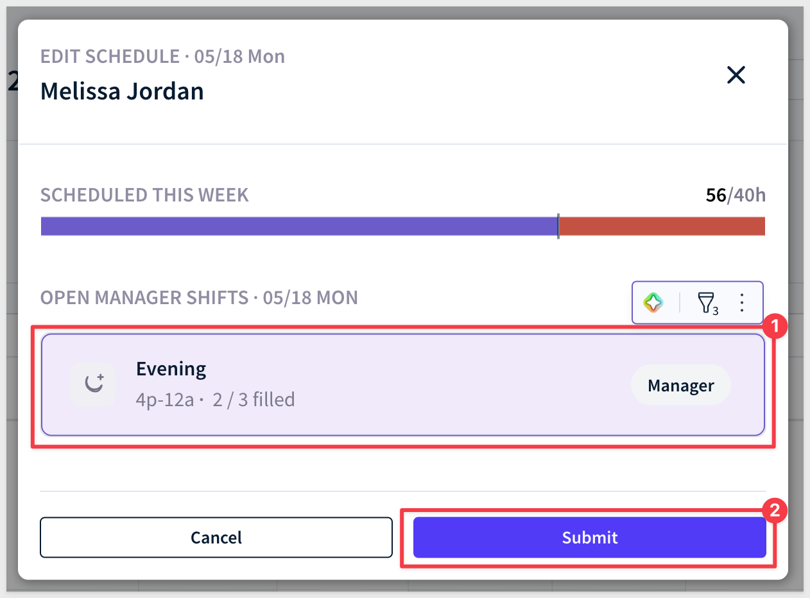 -->

### Today's Shifts

Once an employee is selected, the page shows all shifts assigned to them for the current day, with scheduled start and end times and the current clock-in and clock-out values (shown as `TBD` until logged). Buttons allow the employee to clock in or clock out for each shift:

<!-- 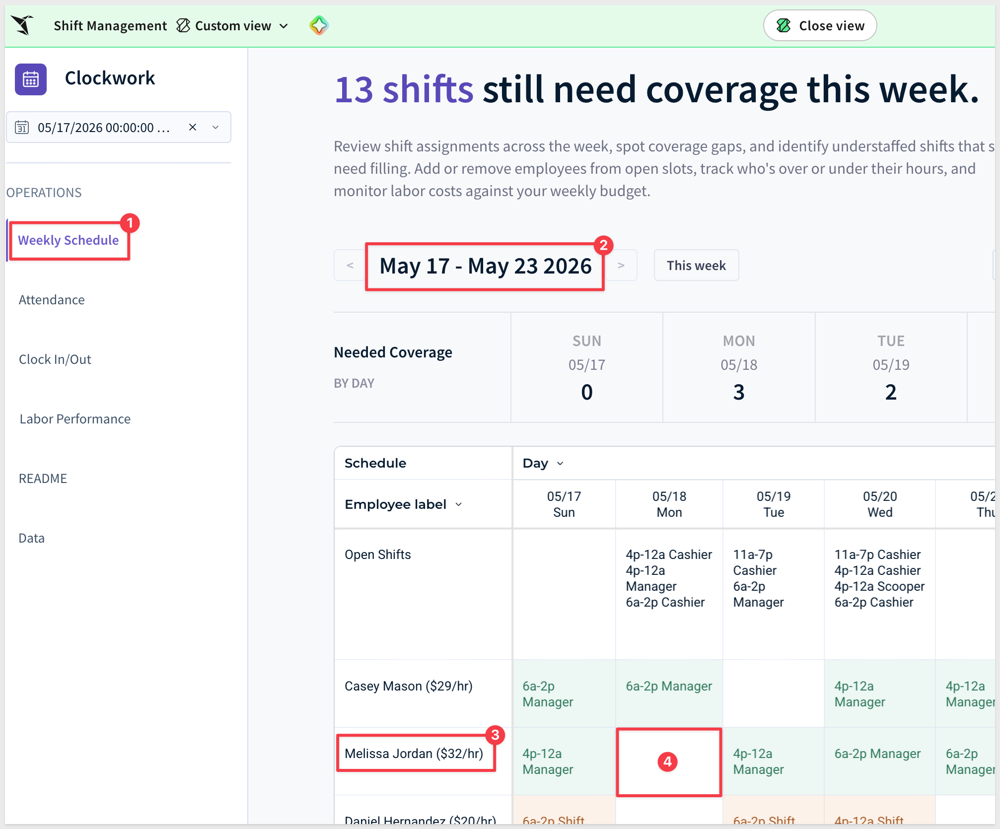 -->

The clock-in and clock-out times are written to the **Attendance** input table's `actual_clock_in` and `actual_clock_out` fields. The `Delta` column computes the difference from scheduled time automatically, so late arrivals are flagged in the Attendance manager view without any manual calculation.

<aside class="negative">
<strong>NOTE:</strong><br> The Clock In/Out page uses the `today-input` date control shared with other pages. In a production deployment, this control would typically be driven by the current date automatically rather than set manually by a manager. The template uses a fixed date to keep the sample data consistent for evaluation.
</aside>

### Mobile Embed

The README notes that this page is designed to be embedded in a mobile app, allowing workers to clock in and out directly from their phones at the store. Sigma's embed capability lets you surface specific workbook pages in an external application without exposing the full workspace:

<!-- 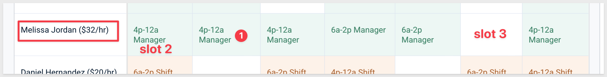 -->


<!-- END OF SECTION-->

## Analyzing Labor Performance
Duration: 10

The **Labor Performance** page gives managers a weekly cost summary — how much has been spent against budget, how projected and actual spending compares by day, and an AI-generated briefing on the week's most pressing operational priorities.

### Page Header

The headline KPI reads: "Labor cost is **X% of budget** this week." The percentage is computed dynamically — actual cost divided by the sum of actual plus remaining budget — and updates as attendance records come in:

<!--  -->

Below the headline, a single line shows the dollar variance: `{{[WEEKLY BUDGET/Weekly Budget] - [ACTUAL SPEND/Sum of Actual Cost]}}` followed by `over budget`, `at budget`, or `under budget` based on the sign.

### AI Agent Summary

The page includes a prominent **AGENT SUMMARY** panel that delivers a brief, action-oriented manager briefing. It is implemented as a `CallText("ai_complete", "claude-sonnet-4-6", ...)` formula directly in a text element — a live formula that runs each time the page loads or the date range changes:

<!-- 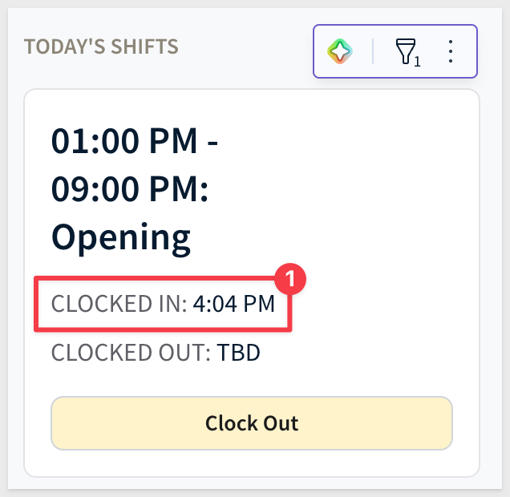 -->

The formula assembles a structured payload before passing it to the model. It concatenates the prompt control text with `CountIf` metrics computed inline:

- Week date range
- Total open slots
- Open slots broken down by role (Cook, Server, Bartender, Host) and day of week
- Employees currently in overtime
- Employees near overtime (within 4 hours of their weekly limit)
- Late clock-ins and early outs for the week
- Remaining unfilled shifts

The model — instructed by the `ai-weekly-ops-prompt` control — returns a briefing in 75 words or fewer: one to two sentences on the most urgent priority, followed by up to three directive bullets. The format is designed for speed: a manager glancing at the page gets the three things that need action today, without reading through raw tables.

To see the formula, place the workbook in `Edit` mode and click the Agent Summary text element. The full `CallText(...)` expression appears in the element body:

<!-- 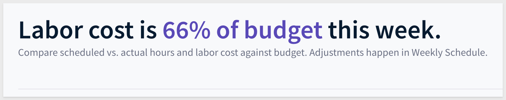 -->

**WHY IT MATTERS:**<br>
The AI briefing is not a separate service or integration — it is a formula in a text element, governed by Sigma's existing permission model and driven by a prompt stored in an editable control. Operations managers can adjust the briefing's focus (e.g., emphasize overtime risk over coverage gaps) by editing the prompt on the Data page, without touching any formula. The model's inputs are explicit Sigma expressions — the same `CountIf` values a manager could read in the table below — which makes the output auditable and explainable.

### Budget vs. Actual Bar Chart

Below the AI summary, a bar chart shows daily labor spend — actual cost, projected cost, and remaining budget — for each day of the selected week. This makes it easy to see which days ran over projection and how much runway remains for the week:

<!--  -->

### Employee-Level Breakdown

A table at the bottom of the page shows each employee's actual hours, projected cost, actual cost, and weekly totals. Overtime is visible here — employees whose actual hours exceed their weekly maximum appear with cost calculated at the overtime rate:

<!-- 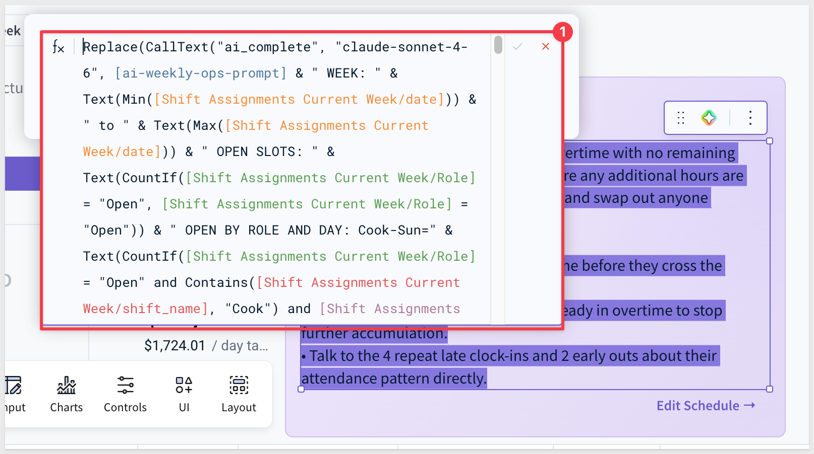 -->


<!-- END OF SECTION-->

## Under the Hood
Duration: 10

Place the workbook in `Edit` mode to explore how the app is built. The **Data** page contains all data tables organized into labeled sections.

### Warehouse Source

The **Employees** table is sourced from `EXAMPLES.COLD_PROVISIONS.EMPLOYEES` in the connected warehouse. It provides the master employee directory: Employee Number, Employee Name, Role, Max Weekly Hours, Hourly Rate USD, and Overtime Rate USD. This is the only table that comes from the warehouse — all scheduling data lives in input tables:

<!-- 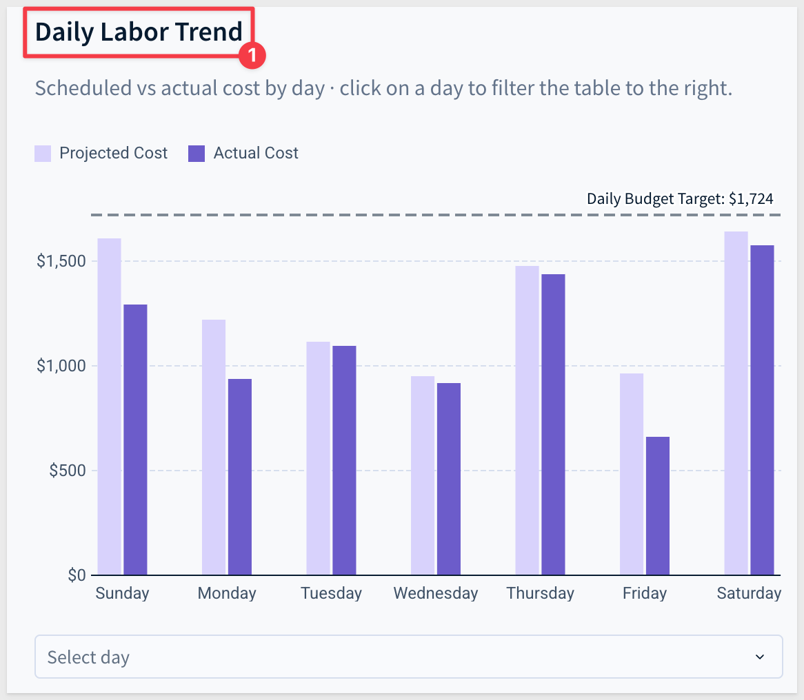 -->

### Input Tables

Five input tables store all application data:

**Shifts** *(Editable in draft)* — the shift template library. Each row defines a shift type for a specific day and week: `shift_id`, `store_id`, `date`, `day_of_week`, `shift_name`, `start_time`, `end_time`, `duration_hours`, `min_staff_needed`, and `week_id`. Computed columns on this table aggregate employee names assigned to each shift and look up projected and actual shift costs from Shift Assignments.

**Shift Assignments** *(Editable in published version)* — the primary scheduling table. Each row links one employee to one shift on one date: `assignment_id`, `shift_id`, `shift_name`, `employee_id`, `date`, `required_role`, `has_open_slot` (checkbox), `scheduled_start`, and `scheduled_end`. Computed columns resolve employee names, look up clock-in and clock-out times from Attendance, and calculate Projected Cost and Actual Cost using the overtime-aware formula described below.

**Attendance** *(Editable in published version)* — clock-in and clock-out records. Each row captures `actual_clock_in`, `actual_clock_out`, `status` (On Time / Late / No Show / Early Out / On Shift / Completed), `scheduled_start`, and `scheduled_end`. Two computed columns — `Delta` and `Delta Out` — calculate the difference between scheduled and actual times in minutes using `DateDiff("minute", ...)`.

**Weekly Budget** *(Editable in draft)* — per-week labor budget targets. Each row stores `week_id`, `week_start`, `week_end`, `labor_budget`, and `store_id`. Budget figures are looked up across the app using `Lookup([Weekly Budget/labor_budget], [week_id], [Weekly Budget/week_id])`.

**Open Shifts Employee** *(Editable in draft)* — a single-row placeholder representing unfilled shift slots. When `has_open_slot` is true in Shift Assignments, this placeholder employee is used to make the coverage gap visible in the schedule grid as "Open Shifts" rather than a null:

<!-- 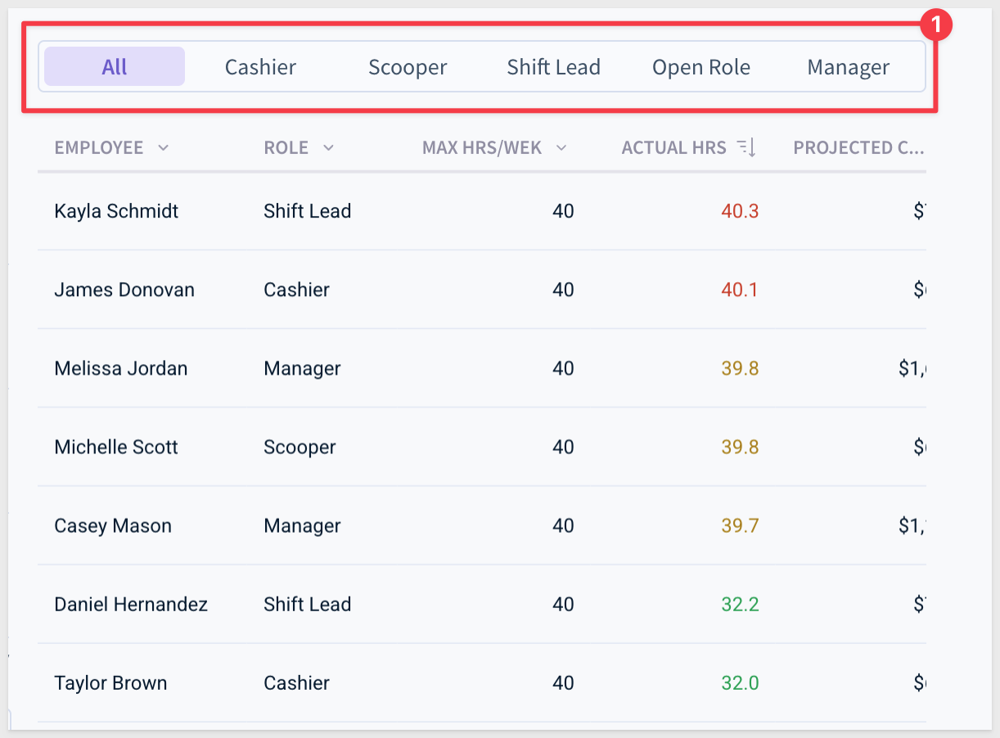 -->

### Employees Table (Union)

The **Employees** derived table on the Data page is a union of the warehouse `EMPLOYEES` table and the `Open Shifts Employee` input table. This union is what powers the employee dropdown in the schedule grid and all employee lookups across the app. The Open Shifts Employee row participates in the union so that open-slot rows resolve to "Open Shifts" as an employee name — the same lookup path that resolves real employee names:

<!-- 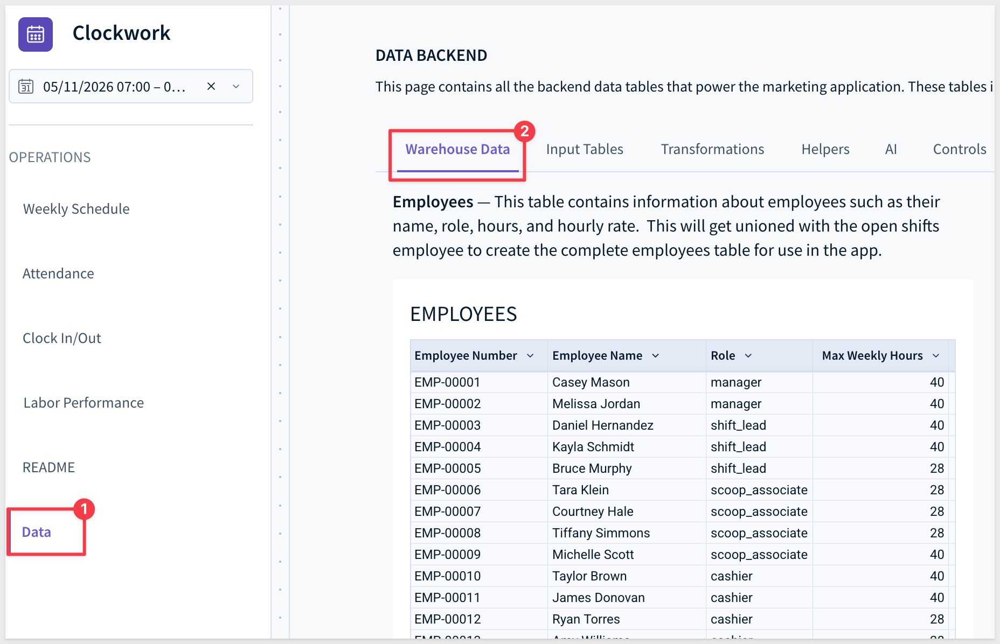 -->

### Overtime-Aware Cost Calculation

The `Projected Cost` and `Actual Cost` columns in Shift Assignments use a `Least/Greatest` pattern to split weekly hours at the employee's `max_hours_per_week` limit:

```copy-code
If([Weekly Total Projected Hours] = 0, 0,
  [Effective Hours] * (
    Least([Weekly Total Projected Hours], [max_hours_per_week]) / [Weekly Total Projected Hours] * [Hourly Rate]
    + Greatest(0, [Weekly Total Projected Hours] - [max_hours_per_week]) / [Weekly Total Projected Hours] * [Overtime Hourly Rate]
  )
)
```

This formula apportions each shift's cost between the regular rate (for the fraction of hours within the weekly limit) and the overtime rate (for hours above it). The apportionment recalculates automatically whenever hours are added or removed — no manual adjustments needed when the schedule changes mid-week.

### CallText for the AI Briefing

The Agent Summary on the Labor Performance page is implemented as a `CallText()` formula in a text element — not a Sigma Agent, but a direct model call via a formula. The formula itself assembles the model's input by concatenating the `[ai-weekly-ops-prompt]` control value with `CountIf` and `CountDistinctIf` expressions:

```copy-code
CallText("ai_complete", "claude-sonnet-4-6",
  [ai-weekly-ops-prompt]
  & " WEEK: " & Text(Min([Shift Assignments Current Week/date])) & " to " & Text(Max(...))
  & " OPEN SLOTS: " & Text(CountIf([...Role] = "Open", ...))
  & " OPEN BY ROLE AND DAY: Cook-Sun=" & Text(CountIf(...))
  ... (additional role/day breakdowns)
  & " EMPLOYEES IN OVERTIME: " & Text(CountDistinctIf(...))
  & " LATE CLOCK-INS: " & Text(CountIf(...))
)
```

The model receives a structured text payload — not raw table data — and returns a formatted briefing. Because the model's inputs are explicit Sigma expressions, the briefing is grounded in the same numbers visible in the charts and tables on the page.

### Controls on the Data Page

All coordination and AI prompt controls are stored on the Data page:

- **ai-weekly-ops-prompt** — the system prompt for the Agent Summary on Labor Performance; instructs the model to return a 75-word briefing with up to three action bullets
- **ai-schedule-briefing-prompt** — an alternate prompt for a shorter schedule-review briefing; editable without formula changes
- **Date formatted**, **selected-date-range**, **today-input**, **dates-input** — date coordination controls shared across pages
- **selected-role**, **Selected employee**, **Selected shift**, **Selected Assignment**, **Selected Day** — element-coordination controls that pass selected context into lookups and conditional visibility

<!-- 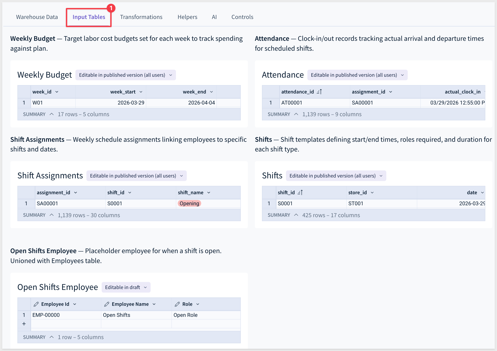 -->

Because prompts are stored as editable text-area controls rather than hardcoded strings, operations managers can adjust the briefing's focus — overtime risk, coverage gaps, attendance patterns — without touching any formula.


<!-- END OF SECTION-->

## Adapt for Your Team
Duration: 5

Clockwork is designed to adapt. The scheduling structure — shift templates, employee assignments, attendance tracking, and cost calculations — works for any team that manages shift-based labor. The most common adaptation steps are below.

### Connect Your Employee Data

The app sources its employee directory from a warehouse table. In the template, this is `EXAMPLES.COLD_PROVISIONS.EMPLOYEES`. To connect your own employee data:

1. In `Edit` mode, navigate to the `Data` page and select the **Employees** warehouse table
2. Update the source connection to point to your employee or HR table
3. Confirm the required columns are present — at minimum: Employee ID, Employee Name, Role, Max Weekly Hours, Hourly Rate USD, and Overtime Rate USD
4. Save and verify that the employee dropdown on the Weekly Schedule page reflects your team

<!-- 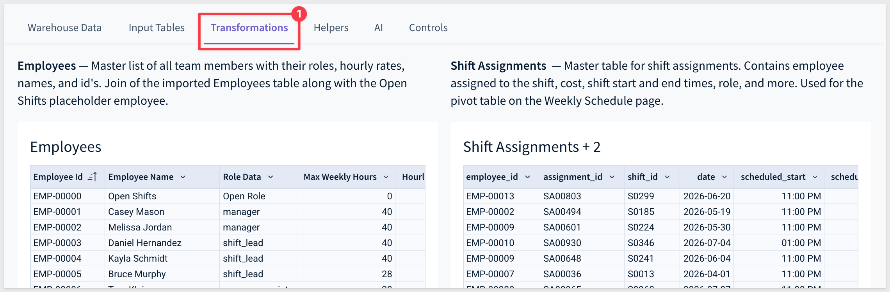 -->

<aside class="positive">
<strong>NOTE:</strong><br> If your organization does not have a warehouse employee table, you can replace the warehouse source with an additional input table to manage employees directly in Sigma.
</aside>

### Update Shift Templates

The **Shifts** input table defines the shift types available in your schedule. To configure shifts for your team:

1. Open the workbook in `Edit` mode
2. Navigate to the `Data` page and select the **Shifts** input table
3. Add, edit, or remove rows to reflect your shift schedule — update `shift_name`, `start_time`, `end_time`, and `duration_hours` for each shift type
4. Update `min_staff_needed` to match your minimum coverage requirements per shift

Changes to the Shifts table immediately appear in the Weekly Schedule grid. The schedule grid's pivot groups by shift name, so new shift types become new rows automatically.

### Set Your Weekly Budget

The **Weekly Budget** input table holds the labor budget targets the app tracks against. To configure it:

1. Navigate to the `Data` page and select the **Weekly Budget** input table
2. Add a row for each week you want to track: `week_id`, `week_start`, `week_end`, `labor_budget`, and `store_id`
3. The Labor Performance page and the Weekly Schedule KPIs update automatically as budget rows are added

### Update the AI Briefing Prompt

The **ai-weekly-ops-prompt** control on the Data page can be edited to change what the Agent Summary emphasizes. The default prompt focuses on open slots, overtime, and attendance patterns. For a retail context, you might adjust the prompt to reference your role names (e.g., `Floor Associate`, `Shift Lead`) and focus on foot-traffic-driven coverage requirements.

<aside class="negative">
<strong>NOTE:</strong><br> The Agent Summary formula passes structured `CountIf` data to the model in a fixed format. If you add new roles or shift names that need to appear in the briefing, the formula's inline breakdowns (e.g., `Cook-Sun=...`, `Server-Mon=...`) will need to be updated to reflect the new roles. The prompt alone cannot change what data the model receives.
</aside>


<!-- END OF SECTION-->

## What We've Covered
Duration: 3

The Shift Management Starter App demonstrates how Sigma's native features — input tables, `Lookup` joins, computed cost formulas, and `CallText` for AI-generated summaries — can be composed into a full scheduling and workforce management system without external tools or custom application code.

The scheduling layer is worth examining closely. Rather than tracking open shifts with nulls, Clockwork uses a placeholder employee unioned into the employee table — every slot in the schedule grid has a row, either assigned to a real employee or to "Open Shifts." This makes coverage gaps visible in the pivot table without special filtering, and means the same `CountIf` that drives the header KPI also feeds the AI briefing.

The cost calculation pattern is reusable across any hourly workforce context. The `Least/Greatest` split between regular and overtime hours means a single formula handles all schedule configurations correctly — no separate overtime columns, no manual adjustments when hours change. Connect it to an employee table with `max_hours_per_week` and hourly rates, and the cost math is automatic.

**Additional Resource Links**

[Blog](https://www.sigmacomputing.com/blog/)<br>
[Community](https://community.sigmacomputing.com/)<br>
[Help Center](https://help.sigmacomputing.com/hc/en-us)<br>
[QuickStarts](https://quickstarts.sigmacomputing.com/)<br>

Be sure to check out all the latest developments at [Sigma's First Friday Feature page!](https://quickstarts.sigmacomputing.com/firstfridayfeatures/)
<br>

[](https://twitter.com/sigmacomputing)&emsp;
[](https://www.linkedin.com/company/sigmacomputing)&emsp;
[](https://www.facebook.com/sigmacomputing)


<!-- END OF SECTION-->
