author: pballai
id: starter_apps_territory_management
summary: starter_apps_territory_management
categories: apptemplates
environments: web
status: Published
feedback link: https://github.com/sigmacomputing/sigmaquickstarts/issues
tags: default
lastUpdated: 2026-07-27

# Territory Management App Template

## Overview
Duration: 5

Sigma's **App Templates** are ready-to-use applications built on Sigma's native features and connected to sample data. Each one ships fully functional — you can explore it immediately, learn how it's built by switching to edit mode, and adapt it to your own projects without starting from scratch.

The **Territory Management** app — called **Atlas** — gives sales operations teams a single surface to monitor portfolio health across all regions, diagnose which territories are underperforming or overloaded, and model account reassignments to rebalance workload distribution. AI-generated diagnostics identify problem regions and recommend specific account moves, with an editable linked input table to execute and persist changes.

This QuickStart walks through how the app works as a user, how it's designed under the hood, and how to connect it to your own Salesforce or CRM data.

### Target Audience
Sales operations managers, revenue operations teams, and sales leaders evaluating or adopting Sigma for territory planning. Solutions Engineers and technical stakeholders exploring the app as a reference design for CRM-connected planning and AI-assisted decision making.

### Prerequisites

<ul>
  <li>Access to a Sigma environment.</li>
  <li>The Territory Management App Template available in your org — find it under <code>Templates</code> > <code>App Templates</code>.</li>
  <li><strong>Write access enabled on a connection</strong> — required for the REGION and TERRITORY input tables. See <a href="https://help.sigmacomputing.com/docs/set-up-write-access">Set up write access</a></li>
  <li><strong>AI provider configured for your organization</strong> — required for AI-generated region diagnostics and rebalancing recommendations. See <a href="https://help.sigmacomputing.com/docs/configure-ai-features-for-your-organization">Configure AI features for your organization</a></li>
  <li>Some familiarity with Sigma workbooks is helpful but not required.</li>
</ul>

<aside class="positive">
<strong>NOTE:</strong><br> If you don't see App Templates in your Templates section, contact your Sigma administrator to confirm availability in your org.
</aside>

### What You'll Learn
- How the Territory Management app works from portfolio review through account reassignment
- The key design patterns behind the app and why they're built that way
- How to connect the app to your own CRM data


<!-- END OF SECTION-->

## Exploring the App
Duration: 10

### Open and Save the Template

Navigate to `Templates` in the left sidebar. The Territory Management app appears in the `Made by Sigma` collection:

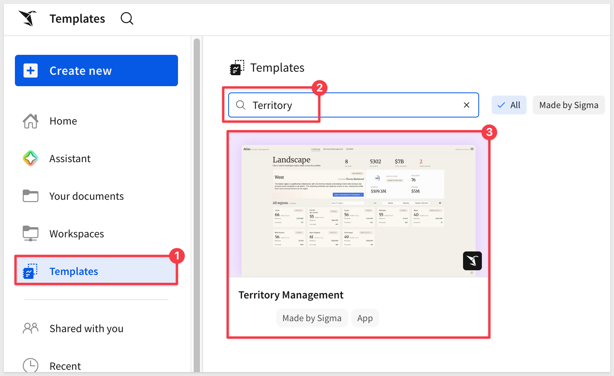

Click the template card to open a preview. Before clicking `Use template`, confirm the two requirements shown on the detail page are met:

- **Write access enabled on a connection** — required for input tables to store region and territory data. See [Set up write access](https://help.sigmacomputing.com/docs/set-up-write-access)
- **AI provider set up in your organization** — required for AI diagnostics and recommended moves. See [Configure AI features for your organization](https://help.sigmacomputing.com/docs/configure-ai-features-for-your-organization)

Once both are in place, click `Use template`. Sigma creates a personal copy in your workspace:

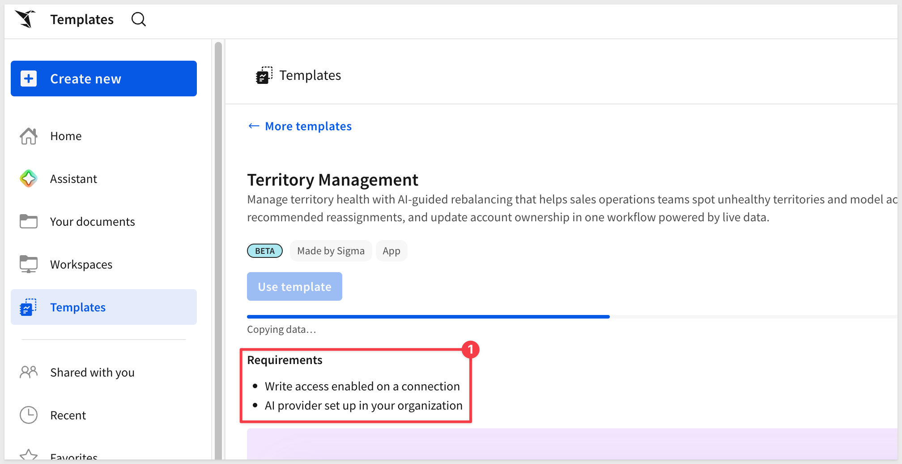

Click `Save as` and give the workbook a name:
```copy-code
Territory Management
```

<aside class="positive">
<strong>NOTE:</strong><br> The original template remains unchanged in the gallery — your saved copy is the working version.
</aside>

### README Page

The app opens on its **README** page — an orientation guide built directly into the workbook:

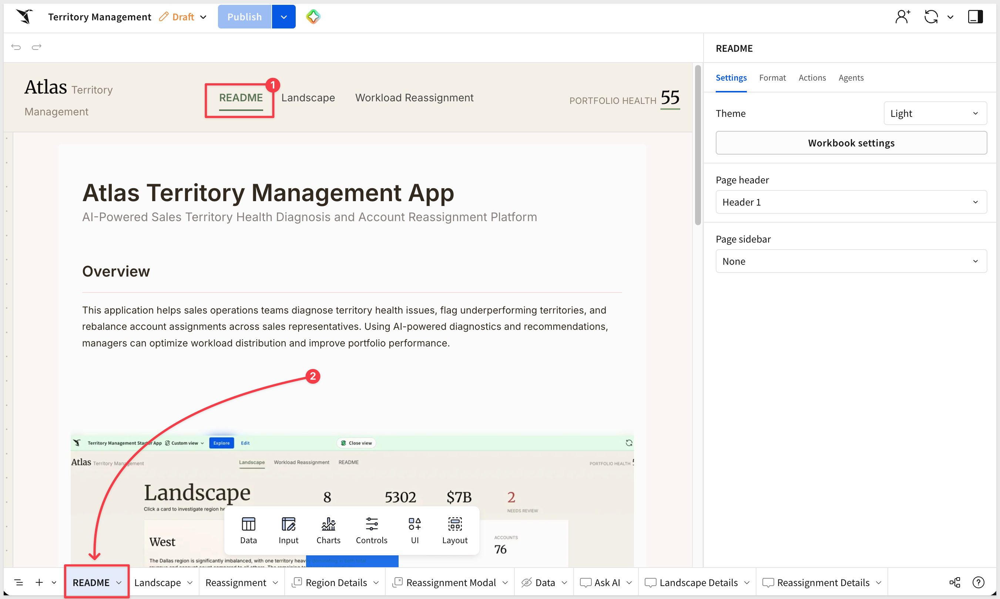

The README includes a demo video, a six-step getting-started guide, and a map of the app's two main pages. The recommended sequence is:

1. **Monitor Portfolio Health** — view overall portfolio metrics on the Landscape page
2. **Diagnose Problem Territories** — click a region card to review its health detail and AI diagnosis
3. **Flag Territories for Rebalancing** — mark overloaded or underperforming regions for action
4. **Model Reassignments** — use the Workload Reassignment page to review AI-recommended account moves
5. **Execute Changes** — update account assignments in the linked input table
6. **Monitor Results** — return to Landscape to verify health scores improve after reassignment

<aside class="negative">
<strong>NOTE:</strong><br> The README page is visible to all users of the app. If you adapt this template for your org, update it to reflect your actual territory structure, team names, and any changes from the sample data.
</aside>

Place the workbook into `Published` mode:

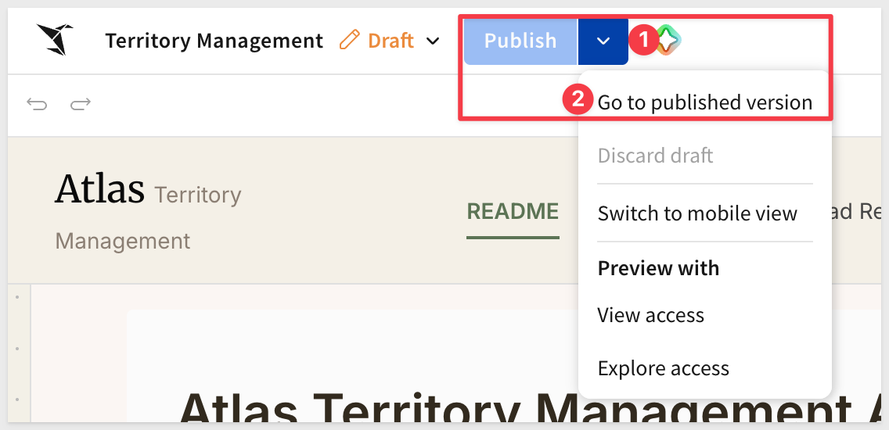

### Landscape Page

The **Landscape** page is the portfolio health monitoring dashboard. A **PORTFOLIO HEALTH** score in the top-right corner gives an at-a-glance read on the overall portfolio. Below it, four KPI tiles provide portfolio-wide counts:

- **REGIONS** — total number of sales regions in the portfolio
- **ACCOUNTS** — total account count across all regions
- **TOTAL REVENUE** — sum of annual revenue across all customer accounts
- **NEEDS REVIEW** — count of regions where the Health Score falls below 50, shown in red

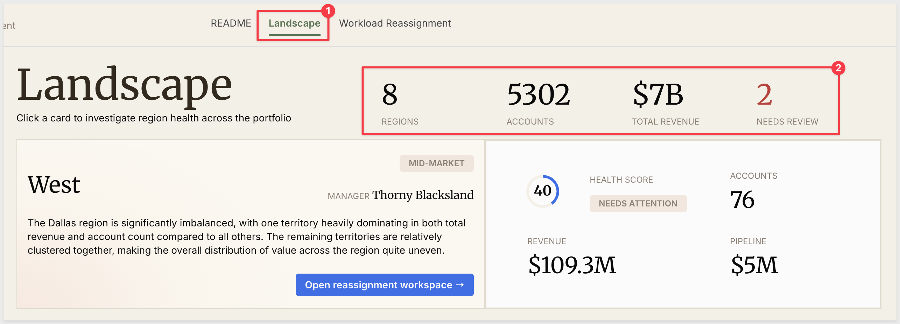

The left portion of the page shows a detail panel for the currently selected region. The panel displays the region name, its segment type badge (e.g., `Mid-Market`, `Enterprise`), the assigned manager, and an AI-generated diagnosis sentence.

The right side of the panel shows a **Health Score donut gauge** alongside quantitative metrics — accounts, revenue, and pipeline. An **`Open reassignment workspace →`** button at the bottom of the panel opens the region workspace modal:

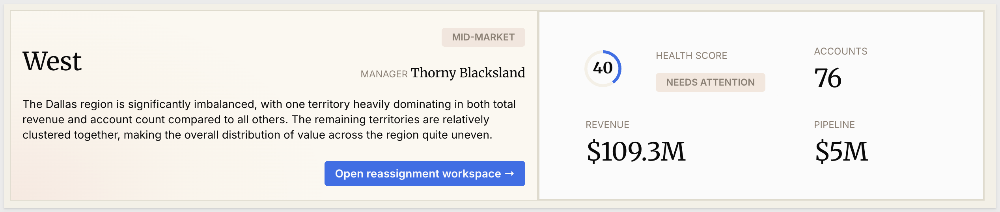

Below the detail panel, the **All regions** section shows a row of region cards — one per region. Each card displays the region name, health label badge, Health Score, revenue, and account count. Cards for healthy regions are labeled; problem regions are visually distinguished by their health label color. A header shows the total number of healthy regions at a glance.

Two controls let you narrow the card view:
- **Search for a region** — text input that filters cards by region name
- **Health filter** — segmented control to show All, Stable, Healthy, or Needs Attention regions

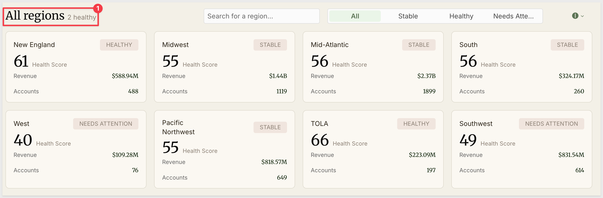

### Workload Reassignment Page

The **Workload Reassignment** page is the workspace for modeling and executing account rebalancing. A queue on the left lists all regions flagged for rebalancing, showing the health label, account count, revenue, and a brief AI-generated action summary for each.

Clicking a region in the queue loads its detail in the right panel — an **AI Recommended Moves** section with specific guidance, plus an account table grouped by territory and account executive showing account names, types, and revenue:

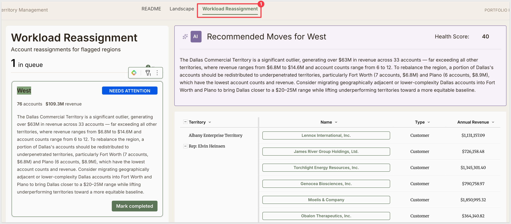


<!-- END OF SECTION-->

## Diagnosing Territory Health
Duration: 10

The Landscape page is the primary diagnostic surface. This section walks through a full diagnostic cycle on a sample region.

### Review the Portfolio Overview

Open the Landscape page. 

Use the `safety` filter to isolate problem regions. Select `Needs Attention` to hide healthy regions and focus only on those requiring action:

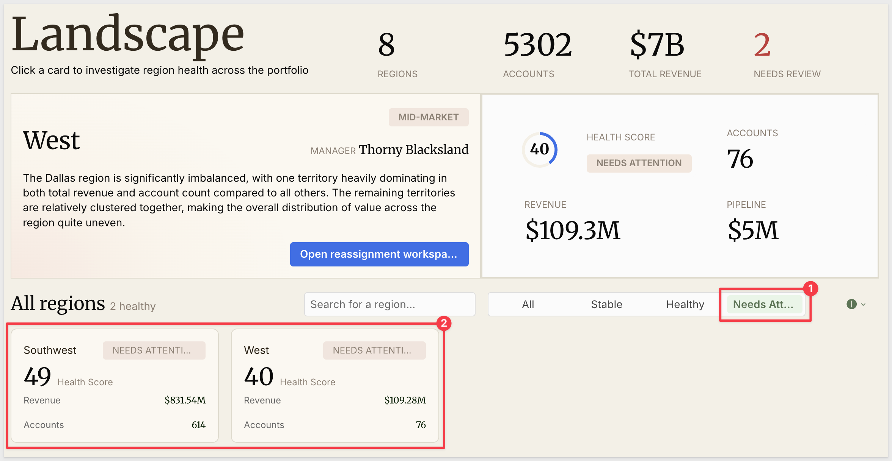

### Investigate a Region

Clicking a region card updates the detail panel at the top of the page. The left side of the panel shows the region name, its segment type badge (`SMB`, `Mid-Market`, `Enterprise`), the assigned manager, and an AI-generated 2–3 sentence diagnosis. The right side shows a **Health Score donut gauge** with the health label, plus account count, revenue, and pipeline. An `Open reassignment workspace →` button at the bottom of the panel opens the region workspace modal:

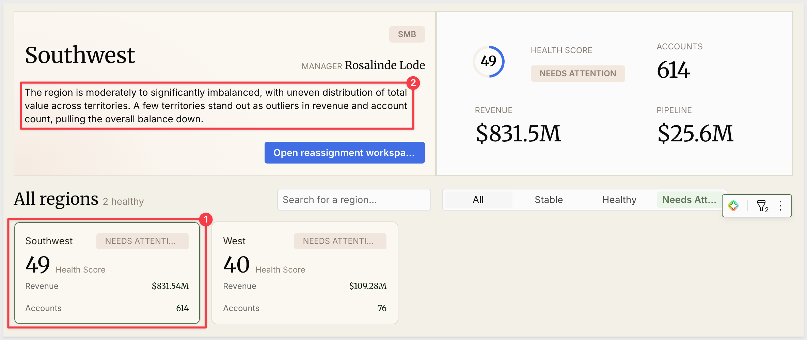

The **Health Score** is a workload distribution metric. Regions where accounts are evenly distributed across territories score higher; regions where a small number of territories carry a disproportionate share of accounts or revenue score lower. The score thresholds are:

| Score | Label |
|---|---|
| 60 and above | Healthy |
| 50–59 | Stable |
| 40–49 | Needs Attention |
| Below 40 | Critical |

### Region Workspace Modal

Clicking `Open reassignment workspace →` opens a modal for that specific region. The modal header shows the health label, Health Score, account count, and revenue at a glance.

The left side of the modal displays the **REP WORKLOAD ROSTER** — a table of all reps in the region, with their territory name, account count, revenue, territory pipeline, and region pipeline. This view makes it easy to spot which reps are carrying disproportionate workload.

The right side has two tabs — **Chat** and **Diagnosis**:

- **Diagnosis** — shows the same AI-generated region summary that appears in the Landscape detail panel
- **Chat** — shows AI-generated bullet recommendations for specific account moves (e.g., "Move 10–15 mid-tier accounts from Atlanta to Orlando"), followed by a conversational prompt and an **Ask anything** input for follow-up questions

The Chat tab is a live AI session primed with the region's territory data — you can ask follow-up questions about specific accounts, reps, or territories and get tailored guidance.

At the bottom of the modal, a **`Flag for Reassignment`** button adds the region to the Workload Reassignment queue:

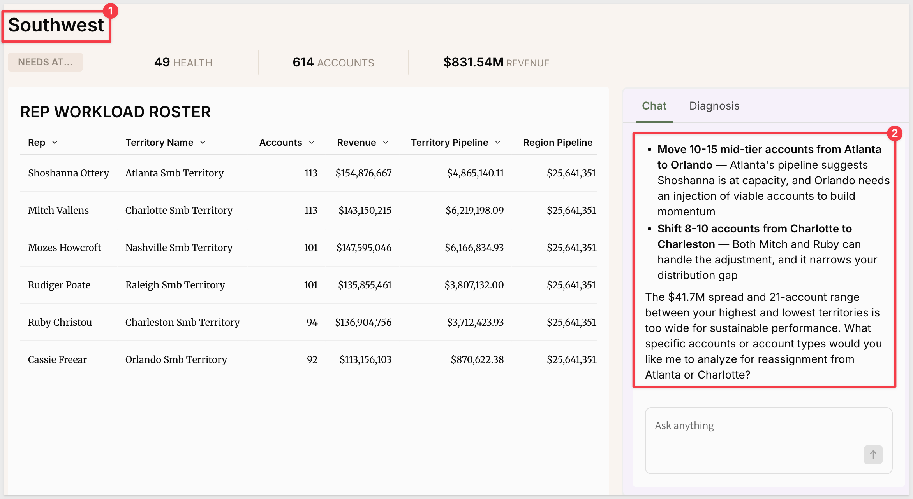

### Flag a Region for Rebalancing

When a region needs formal rebalancing, click `Flag for Reassignment` at the bottom of the region workspace modal:

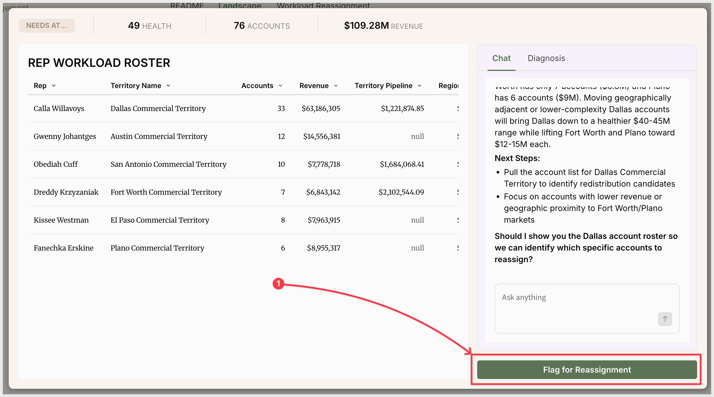

This sets the `flagged_for_rebalance` field on the REGION input table and immediately adds the region to the queue on the Workload Reassignment page:

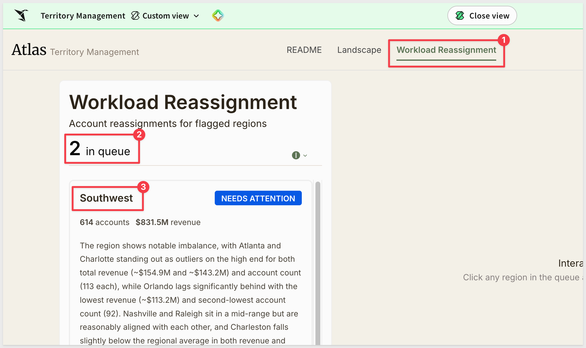

<aside class="positive">
<strong>NOTE:</strong><br> Flagging a region doesn't modify any assignments — it only adds the region to the queue on the Workload Reassignment page so you can review and execute moves there.
</aside>


<!-- END OF SECTION-->

## Rebalancing and Reassigning Accounts
Duration: 10

### Select a Region from the Queue

On the **Workload Reassignment** page, the left sidebar shows the rebalancing queue — all regions where `flagged_for_rebalance` is checked. The header shows how many regions are in queue. Each queue card shows the region name, health label badge, account count, revenue, and the full AI action recommendation text. A **`Mark completed`** button at the bottom of each card removes the region from the queue once rebalancing is done.

The right panel starts with an **Interactive workflow panel** placeholder until a region is selected.

Click a region card to load its workspace in the right panel.

### Review AI Recommendations and Current Assignments

The right panel shows **Recommended Moves for [Region Name]** with the region's Health Score. The AI recommendation is a detailed paragraph — specific territory names, account counts, and revenue figures — identifying which territories are outliers and what moves would bring the region closer to balance:

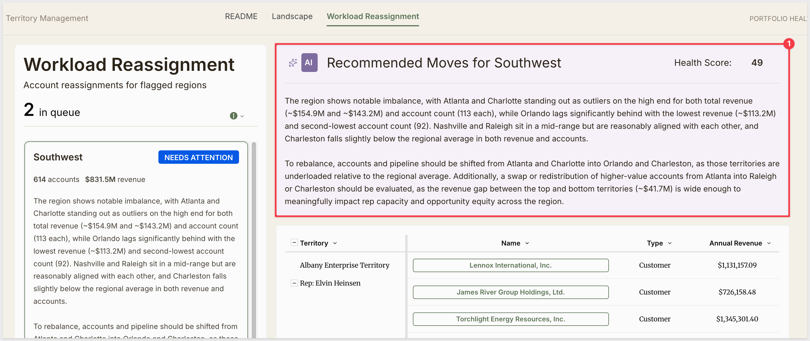

Below the recommendation, an account table shows all accounts in the region, grouped by Territory and the assigned rep. Each row shows the account name, type (Customer or Prospect), and annual revenue. This view makes it easy to identify which territories have the most revenue concentration and which are underserved.

### Execute Account Reassignments

The app supports manually reassigning account by clicking the account name in the table and changing the rep assigned:

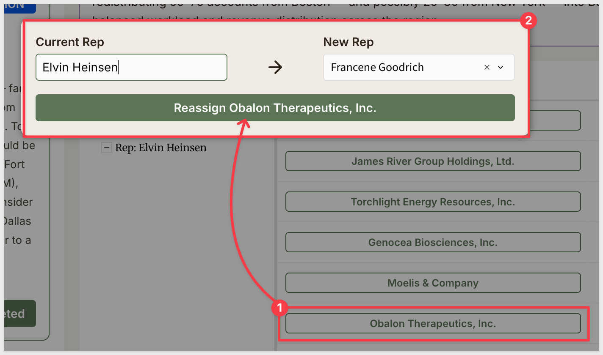

We can let AI make the assignments and review them instead before accepting the changes. 

After reviewing the AI recommendations and the account table, scroll down and click **`REASSIGN WITH AI`** at the bottom of the queue panel:

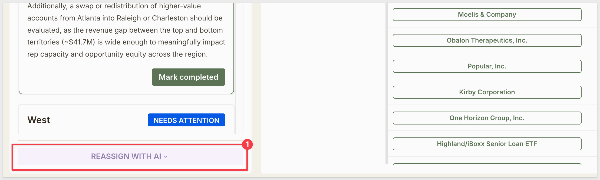

Now we can chat with the AI and have it perform tasks for us (with the correct permissions enforced):

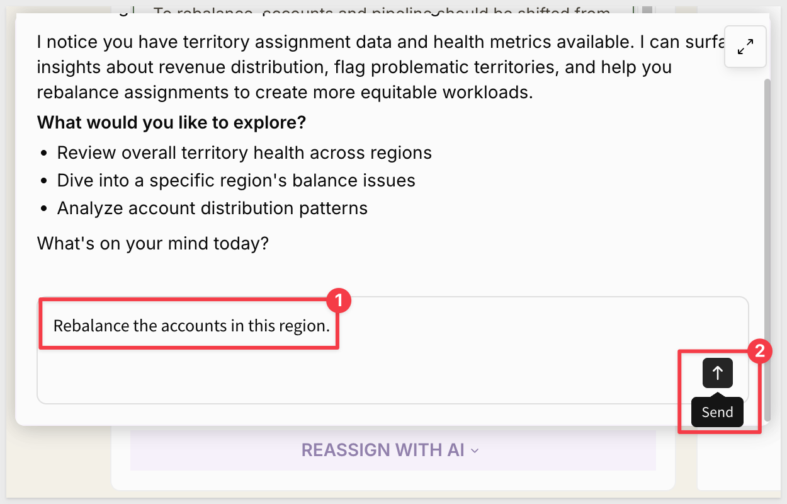

<aside class="negative">
<strong>NOTE:</strong><br> Reassignments write directly to the warehouse-backed TERRITORY ASSIGNMENT table. Changes are permanent — there is no staging step before they take effect. Review the AI recommendations carefully before executing moves.
</aside>

Once the reassignments are applied, click `Mark completed` on the queue card to remove the region from the queue:

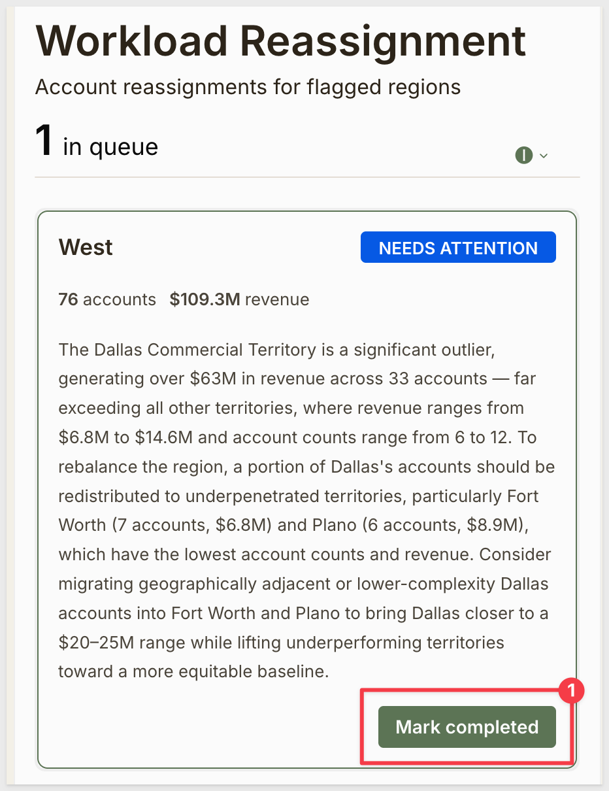

Return to the Landscape page to verify that Health Scores improve for the rebalanced region.


<!-- END OF SECTION-->

## AI Features
Duration: 5

The app uses three AI-powered surfaces, all driven by `CallText("ai_complete", "claude-sonnet-4-6", ...)` calls computed in the HEALTH analytics table. The text elements that display AI content on the Landscape and Workload Reassignment pages reference these pre-computed columns by source column binding — the AI runs at the data layer, not in the UI element itself.

### AI Region Diagnosis

The **Diagnosis** content appears in two places: the Landscape detail panel when a region card is clicked, and the **Diagnosis** tab of the region workspace modal. Both reference the `AI Summary Clean` column from the HEALTH table — a 1–2 sentence characterization of the region's balance state, without specific territory names, values, or recommendations:

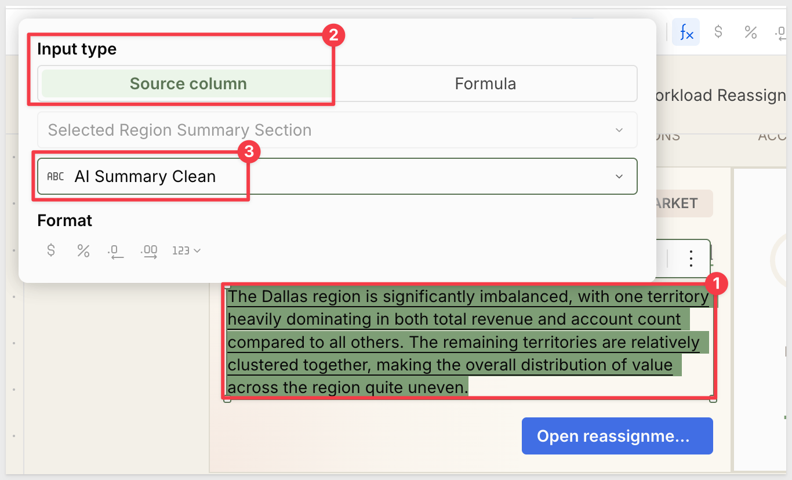

The prompt instructs the model to use the Health Score as the primary signal, identify outlier patterns, and keep the output high-level. It's an orientation, not an action plan.

### Region Workspace Chat

The **Chat** tab in the region workspace modal is an interactive AI session primed with that region's live territory data. It opens with AI-generated bullet recommendations — specific account moves with rep names and territory names called out — followed by a conversational prompt.

The **Ask anything** input lets you continue the conversation: ask which accounts to prioritize, request analysis by account type or revenue band, or get guidance on specific rep capacity questions. The session is scoped to the selected region's data:

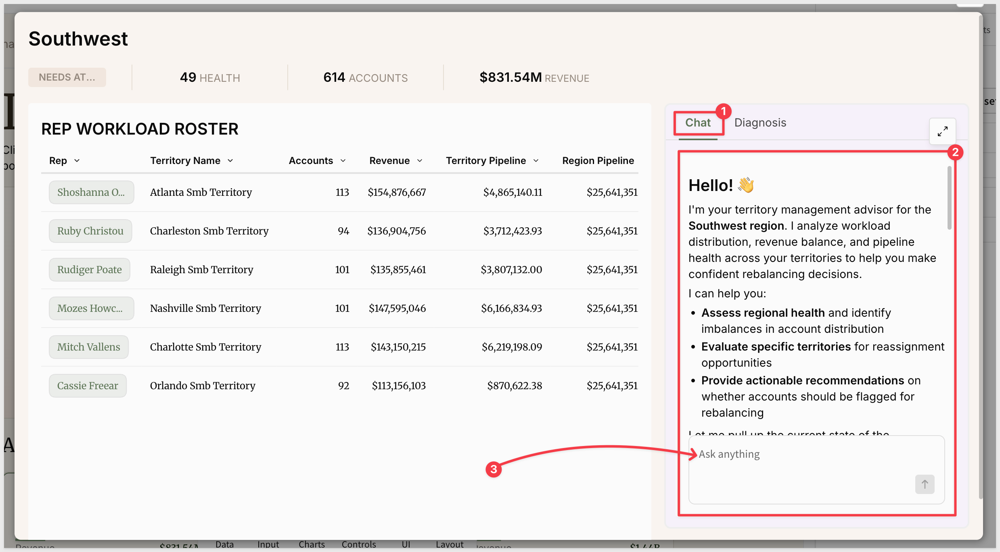

### AI Recommended Moves

On the Workload Reassignment page, selecting a flagged region loads its AI action output in the right panel — a detailed recommendation with specific territory names, account counts, and revenue figures identifying what to move and where:

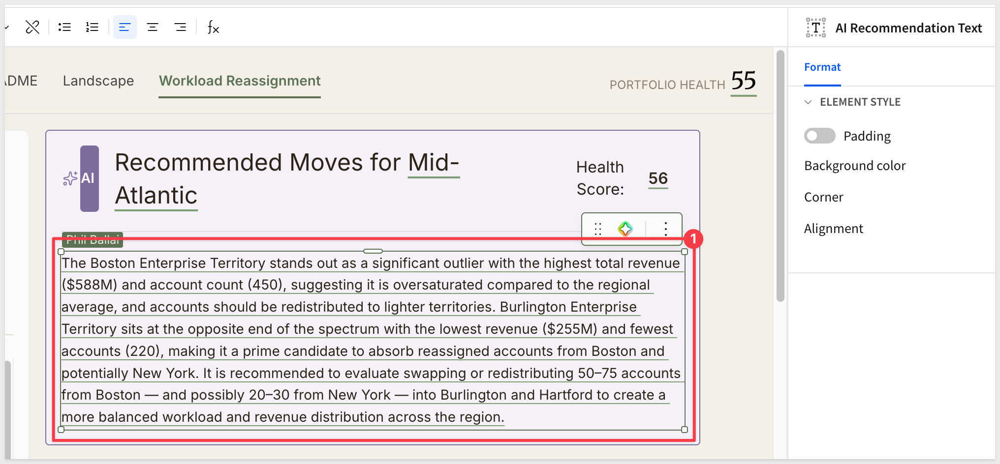

The AI action column is stored on the `Data` page in the `REGION HEALTH FLATTENED` table:

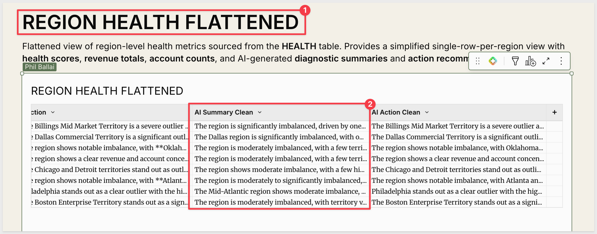

### Editing the AI Prompts

Both the Diagnosis and Recommended Moves prompts are stored as editable text-area controls on the **Data** page (visible in Edit mode). The controls are named `Region Health Summary Prompt` and `Region Health Action Prompt`:

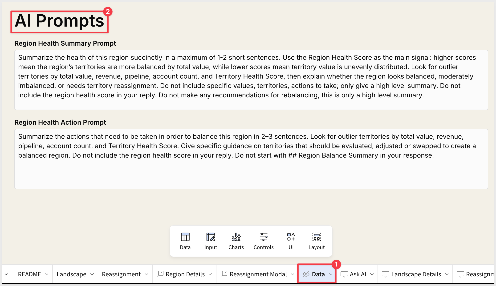

Because they're controls rather than hardcoded strings, the prompts can be updated without touching the underlying formula. This lets sales ops teams tune the AI guidance — adjusting tone, focus areas, or output format — without requiring workbook edit access to the formula layer.

**WHY IT MATTERS:**<br>
Editable prompt controls decouple the AI instruction layer from the workbook logic. Sales ops teams can adjust what the AI emphasizes — revenue concentration, account count imbalance, pipeline coverage — without needing a developer to update formulas. The same model, different focus.


<!-- END OF SECTION-->

## Under the Hood
Duration: 10

Place the workbook in `Edit` mode to explore how the app is built.

### Data Model

The app's data layer is organized in seven tables, all visible on the **Data** page in Edit mode:

**REGION** — an input table defining the top-level sales organization. Each row is a region with a `region_id`, `region_name`, `type`, and `manager_user_id`. The `manager_name` is a Lookup against the USER table. The `flagged_for_rebalance` checkbox is the write field that drives the Reassignment queue.

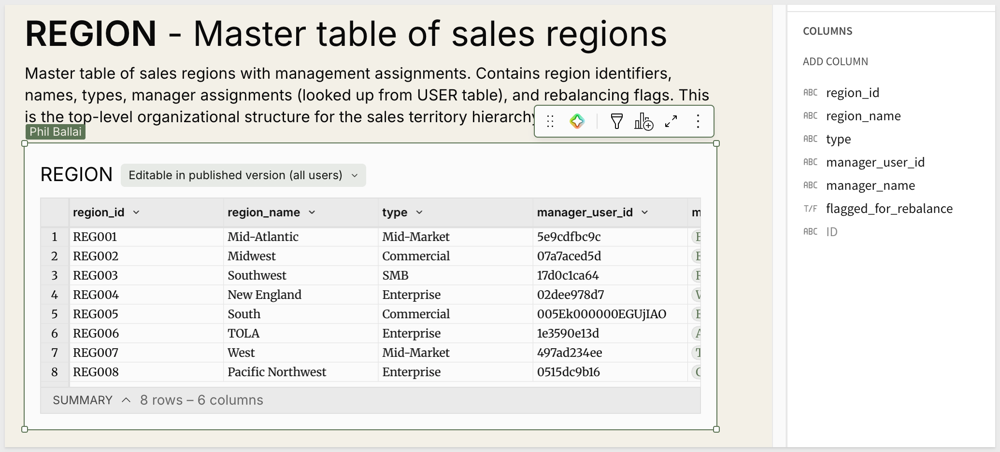

**TERRITORY** — an input table defining individual territories within regions. Each row links a territory to its parent region (`region_id`) and assigned account executive (`ae_user_id`), with both names resolved via Lookup from the REGION and USER tables.

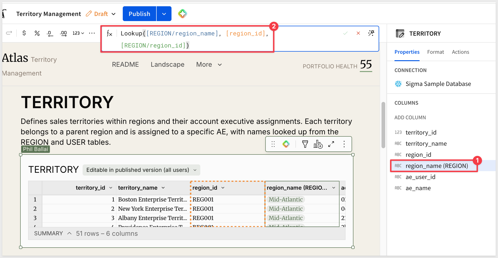

**USER** — a standard warehouse table sourced from `APPLICATIONS.SALESFORCE.USER`. Provides the full user directory including account executives and managers.

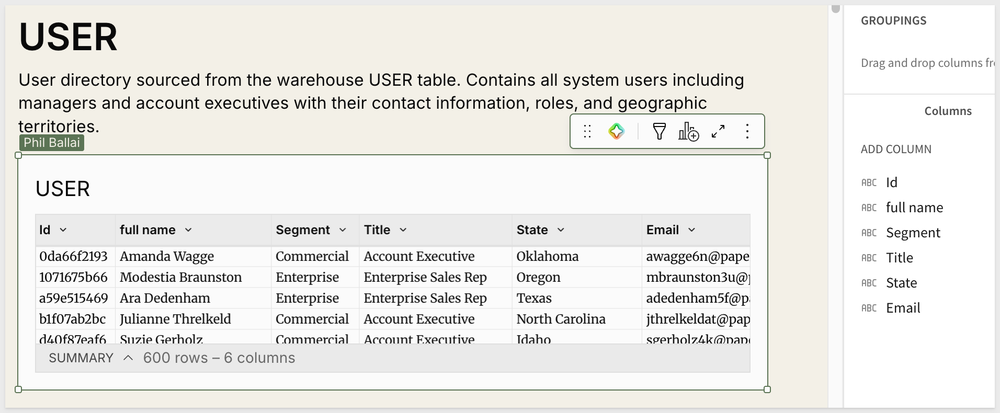

**ACCOUNT** — a standard warehouse table sourced from `APPLICATIONS.SALESFORCE.ACCOUNT`. Contains account master data: name, type, billing address, industry, and annual revenue (scaled by dividing by 10,000 for display).

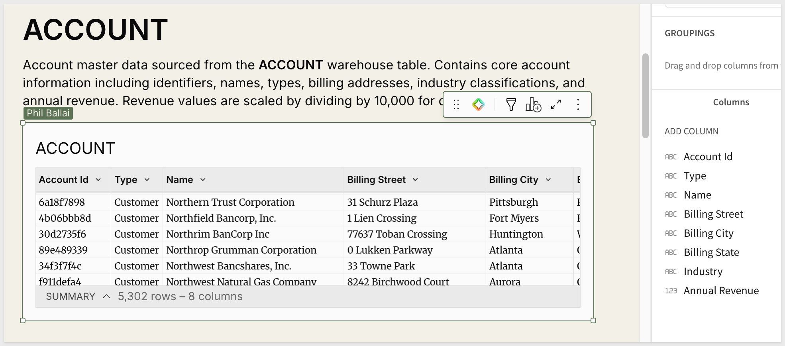

**ACCOUNT TERRITORY ASSIGNMENT** — a linked input table connected to ACCOUNT. It inherits all account rows and adds an editable `Territory_Id` column that links each account to a territory. Lookups on this column resolve the territory name, region name, and AE name from the TERRITORY table. This is the write surface for executing reassignments.

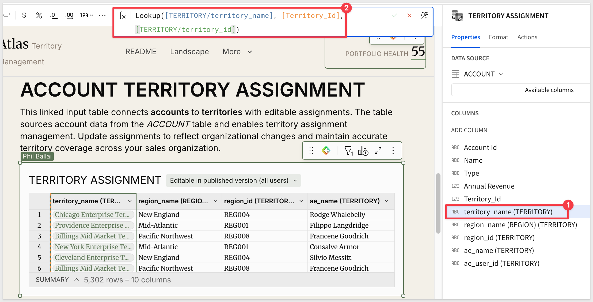

**TERRITORY HEALTH** — a multi-level grouped analytics table derived from TERRITORY ASSIGNMENT. It computes metrics at two grouping levels:
- **Region level**: Health Score, region revenue, pipeline, account count, Health Label, and both AI outputs
- **Territory level**: territory revenue, pipeline, and account count

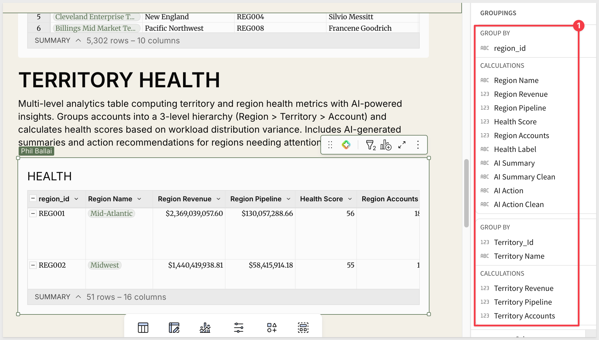

**REGION HEALTH FLATTENED** — a flattened view of the TERRITORY HEALTH table's region-level grouping. One row per region, containing all metrics and AI outputs needed by the Landscape and Workload Reassignment pages.

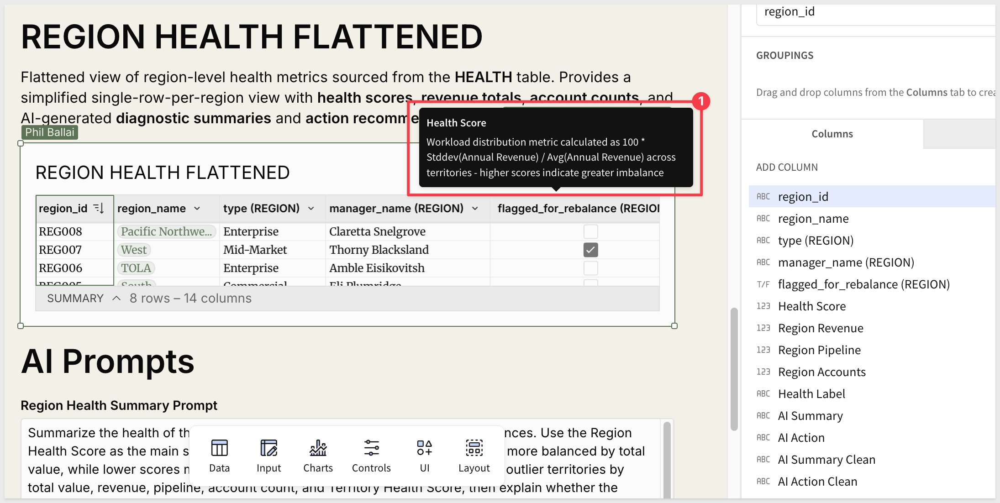

### TERRITORY HEALTH Score Formula

The TERRITORY HEALTH Score is calculated at the region level in the TERRITORY HEALTH table:

```copy-code
100 * Stddev([Annual Revenue]) / Avg([Annual Revenue])
```

This is a coefficient of variation — it measures how spread out account revenue values are across the territories in a region. When account revenue is distributed evenly, the score is higher. When a few territories dominate, the score falls. Regions scoring below 50 appear in the NEEDS REVIEW KPI and in the `Needs Attention` or `Critical` health label tiers.

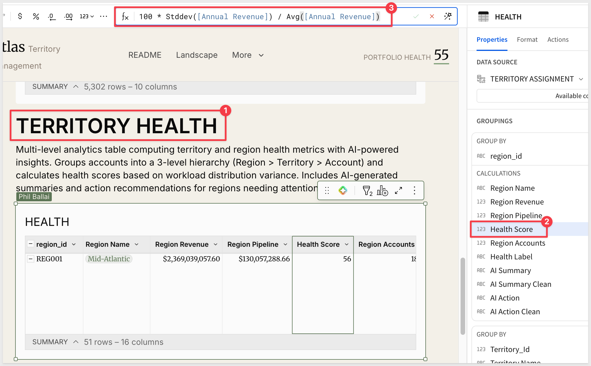

The Health Label is applied with a stepped `If()` formula:

```copy-code
Max(If([Health Score] >= 60, "Healthy",
    If([Health Score] >= 50, "Stable",
       If([Health Score] >= 40, "Needs Attention", "Critical"))))
```

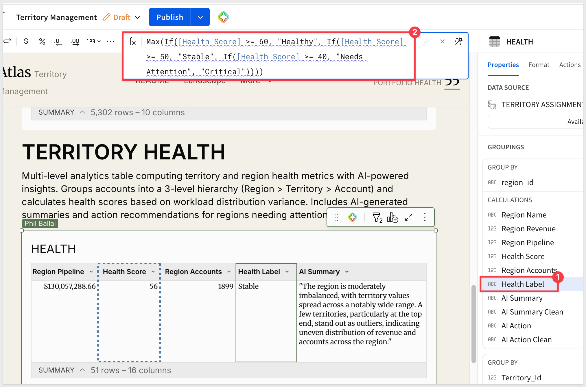

### Linked Input Table Pattern

The ACCOUNT TERRITORY ASSIGNMENT table is a **linked input table** — it inherits all rows from the ACCOUNT warehouse table automatically, so every account appears in the assignment surface without manual data entry. The only column that users write to is `Territory_Id`. Lookups on that column pull territory name, region, and AE assignment from the TERRITORY table.

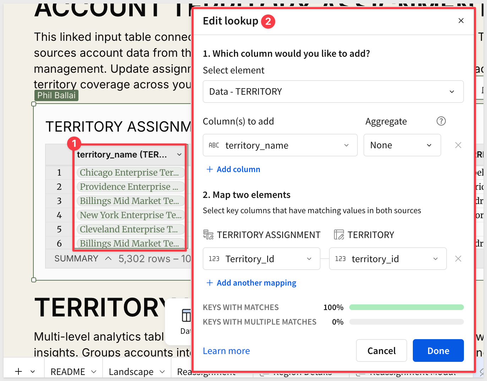

This pattern lets the app stay current with your CRM account data without a separate ETL step: new accounts added to the ACCOUNT table appear in TERRITORY ASSIGNMENT automatically and just need a territory assignment.

**WHY IT MATTERS:**<br>
The linked input table pattern keeps operational data (territory assignments) separated from source-of-record data (account master, user directory). Sales ops can reassign accounts without touching the CRM, while the CRM remains the single source of truth for account attributes and user data.

### Repeater Containers

Both the region cards on the Landscape page and the flagged regions queue on the Workload Reassignment page use **repeater containers** — layout elements that render one copy of a design per row in a data source. The region card repeater reads from REGION HEALTH FLATTENED; the queue repeater reads from the same table filtered to `flagged_for_rebalance = true`.

This means a single card design scales across as many regions as exist in the data — no manual duplication required, and new regions appear automatically as they're added to the REGION input table.

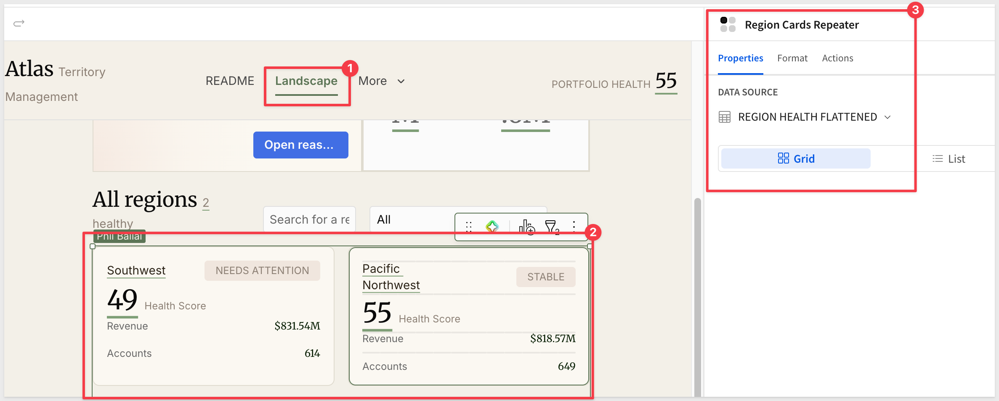


<!-- END OF SECTION-->

## Connect Your Own Data
Duration: 5

The Territory Management app reads from two Salesforce warehouse tables (`USER` and `ACCOUNT`) and writes to three input tables (`REGION`, `TERRITORY`, and `ACCOUNT TERRITORY ASSIGNMENT`). Connecting it to your own CRM data comes down to two steps: pointing the warehouse sources to your tables and populating the input tables with your org structure.

### Update the Warehouse Sources

On the **Data** page (visible in Edit mode), the USER and ACCOUNT tables are sourced from `APPLICATIONS.SALESFORCE`. To connect your own data:

Select the USER table and update the source path to point to your user or rep directory

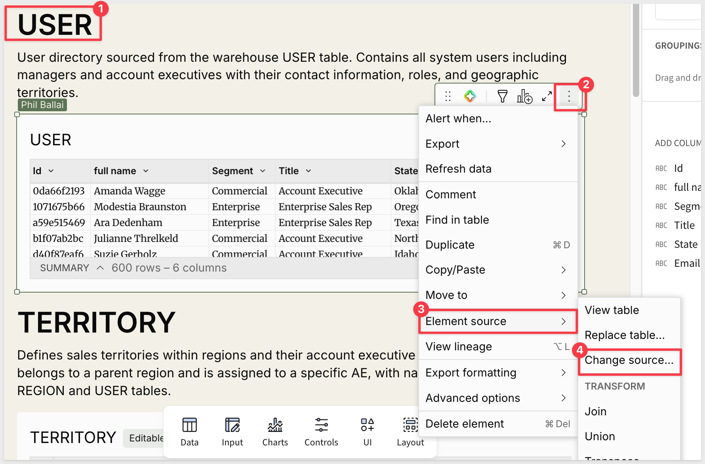

Select the ACCOUNT table and update the source path to point to your account master table

The minimum required columns for each are:

**USER** — your CRM's user/rep table needs:

| Column | Description |
|---|---|
| Id | Unique user identifier |
| Username / full name | Display name for managers and AEs |
| Title | Job title (used to distinguish AEs from managers) |
| Segment | Business segment |
| Territory / State | Geographic assignment |
| Email | Contact email |

**ACCOUNT** — your CRM's account table needs:

| Column | Description |
|---|---|
| Account Id | Unique account identifier |
| Name | Account name |
| Type | Customer or Prospect |
| Annual Revenue | Revenue value (the app scales by /10,000 — adjust if your values are already in smaller units) |
| Billing City / State | Address fields |
| Industry | Industry classification |

<aside class="positive">
<strong>NOTE:</strong><br> Column names in your source tables don't need to match exactly. After updating the source connection, remap any columns with different names in the element panel's column settings.
</aside>

### Populate the Input Tables

With warehouse sources connected, populate the three input tables with your org structure:

1. **REGION** — add one row per region. Include `region_id`, `region_name`, `type`, and the `manager_user_id` from your USER table. Leave `flagged_for_rebalance` unchecked.

2. **TERRITORY** — add one row per territory. Link each to its parent `region_id` and assign the `ae_user_id` of the owning account executive.

3. **ACCOUNT TERRITORY ASSIGNMENT** — the linked input table inherits all rows from ACCOUNT automatically. Assign a `Territory_Id` to each account to link it to the correct territory. The Lookup formulas resolve territory name, region, and AE name from there.

Once all three input tables are populated, the TERRITORY HEALTH analytics table recalculates health scores based on your actual account distribution, and the Landscape and Workload Reassignment pages reflect your real territory structure.

<aside class="negative">
<strong>NOTE:</strong><br> If accounts exist in TERRITORY ASSIGNMENT without a Territory_Id assigned, they will not contribute to any territory's health score. Assign all accounts before comparing region health scores.
</aside>


<!-- END OF SECTION-->

## What We've Covered
Duration: 3

The Territory Management App Template demonstrates how Sigma's native features — linked input tables, repeater containers, grouped analytics, and AI — can be composed into a full territory planning workflow without external tools or custom code.

The data model separates concerns cleanly: warehouse tables (USER, ACCOUNT) provide the source of truth for people and accounts; input tables (REGION, TERRITORY, ACCOUNT TERRITORY ASSIGNMENT) store the organizational structure and assignments; and a multi-level grouped analytics table computes health metrics from the combined dataset. Every visualization reads from that computed layer, so changes to assignments immediately propagate through health scores, KPIs, and AI outputs.

The linked input table pattern is the key enabler — accounts flow into the assignment surface automatically from the CRM, and one editable column is all that's needed to rebalance workload across the org. The same pattern applies to any operational workflow where structured assignments need to stay current with a source-of-record system without a separate data pipeline.

**Additional Resource Links**

[Blog](https://www.sigmacomputing.com/blog/)<br>
[Community](https://community.sigmacomputing.com/)<br>
[Help Center](https://help.sigmacomputing.com/hc/en-us)<br>
[QuickStarts](https://quickstarts.sigmacomputing.com/)<br>

Be sure to check out all the latest developments at [Sigma's First Friday Feature page!](https://quickstarts.sigmacomputing.com/firstfridayfeatures/)
<br>

[](https://twitter.com/sigmacomputing)&emsp;
[](https://www.linkedin.com/company/sigmacomputing)&emsp;
[](https://www.facebook.com/sigmacomputing)


<!-- END OF SECTION-->
