author: pballai
id: starter_apps_ticket_management
summary: starter_apps_ticket_management
categories: starterapps
environments: web
status: Hidden
feedback link: https://github.com/sigmacomputing/sigmaquickstarts/issues
tags: 
lastUpdated: 2026-07-16

# Ticket Management Starter App

## Overview
Duration: 5

Sigma's **Starter Apps** are ready-to-use applications built on Sigma's native features and connected to sample data. Each one ships fully functional — you can explore it immediately, learn how it's built by switching to edit mode, and adapt it to your own projects without starting from scratch.

The **Ticket Management** app — called **Nexus** — gives sales and RevOps teams a single surface for submitting, triaging, assigning, and resolving internal service requests. Nexus handles the full request lifecycle: requesters submit tickets through a clean form, coordinators triage and route them in a structured queue, and assignees work cases from a focused workspace with full conversation history, SLA timers, and AI assistance. The same structure adapts to IT, Finance, Operations, HR, or any team that manages request queues and resolution workflows.

This QuickStart walks through how the app works from each role, how it's designed under the hood, and how to adapt it for your own team's workflows.

### Target Audience
Sales operations and RevOps teams evaluating Sigma for internal request management. Solutions Engineers and technical stakeholders exploring the app as a reference design for AI-assisted ticketing, SLA monitoring, and multi-role workbook design.

### Prerequisites

<ul>
  <li>Access to a Sigma environment.</li>
  <li>The Ticket Management Starter App available in your org — find it under <code>Templates</code> > <code>Starter Apps</code>.</li>
  <li><strong>Write access enabled on a connection</strong> — required for the input tables that store tickets, messages, categories, priorities, roles, and SLA targets. See <a href="https://help.sigmacomputing.com/docs/set-up-write-access">Set up write access</a></li>
  <li><strong>AI provider configured for your organization</strong> — required for urgency scoring, routing suggestions, Nexus Assistant, and resolution summaries. See <a href="https://help.sigmacomputing.com/docs/configure-ai-features-for-your-organization">Configure AI features for your organization</a></li>
  <li>Some familiarity with Sigma workbooks is helpful but not required.</li>
</ul>

<aside class="positive">
<strong>NOTE:</strong><br> If you don't see Starter Apps in your Templates section, contact your Sigma administrator to confirm availability in your org.
</aside>

### What You'll Learn
- How Nexus works across its three audience views — requester, triage coordinator, and case assignee
- How AI drives urgency scoring, routing, real-time assistance, and resolution summaries
- The data model behind the app and the key design patterns it uses
- How to adapt the app for your team and connect it to your own data


<!-- END OF SECTION-->

## Exploring the App
Duration: 10

### Open and Save the Template

Navigate to `Templates` in the left sidebar. The Ticket Management app appears in the `Made by Sigma` collection:

<!-- 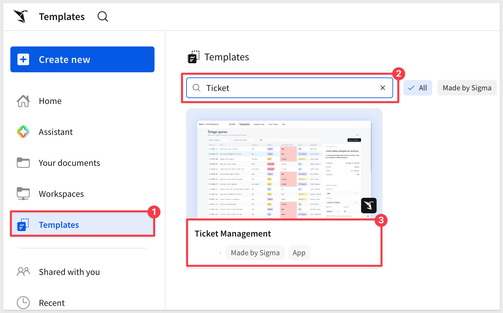 -->

Click the template card to open a preview. Before clicking `Use template`, confirm both requirements shown on the detail page are met:

- **Write access enabled on a connection** — required for input tables to store tickets, messages, and configuration data. See [Set up write access](https://help.sigmacomputing.com/docs/set-up-write-access)
- **AI provider set up in your organization** — required for urgency scoring, routing, and Nexus Assistant. See [Configure AI features for your organization](https://help.sigmacomputing.com/docs/configure-ai-features-for-your-organization)

Once both are in place, click `Use template`. Sigma creates a personal copy in your workspace:

<!-- 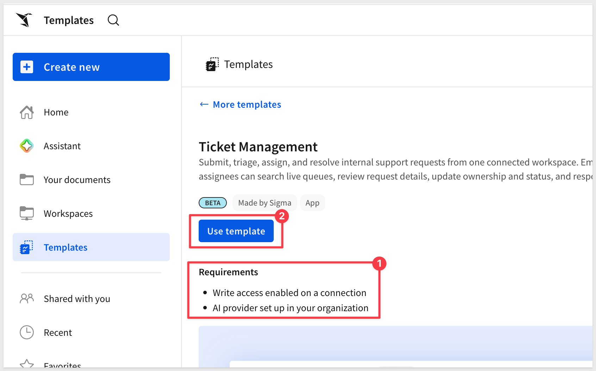 -->

Click `Save as` and give the workbook a name:
```copy-code
Ticket Management
```

<aside class="positive">
<strong>NOTE:</strong><br> The original template remains unchanged in the gallery — your saved copy is the working version.
</aside>

### README Page

The app opens on its **README** page — an orientation guide built directly into the workbook:

<!-- 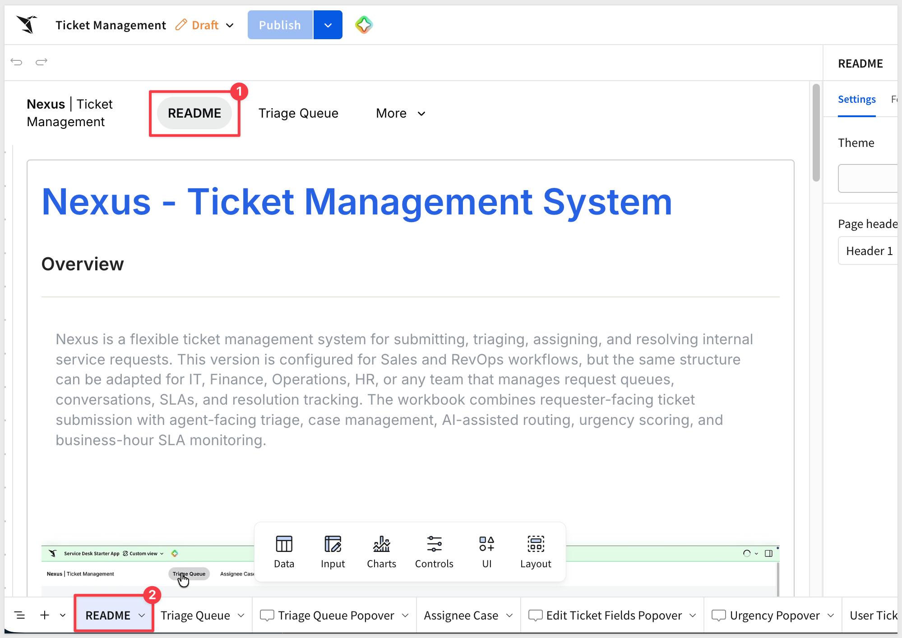 -->

The README includes a demo video, a five-step getting-started guide, and a description of each application page. The recommended sequence is:

1. **Submit a Request** — create a ticket with a subject, category, priority, and description; Nexus uses the details to suggest routing, urgency, and priority
2. **Review the Triage Queue** — confirm category, priority, and assignee; add internal notes
3. **Mark Tickets Ready** — move reviewed tickets into `In Progress` so the assigned owner can begin working
4. **Work Active Cases** — reply to requesters, monitor SLA risk, escalate when needed, and resolve completed work
5. **Review Completed Tickets** — use resolved and closed tickets to understand resolution patterns and SLA performance

<aside class="negative">
<strong>NOTE:</strong><br> The README page is visible to all users of the app by default. If you adapt this template for your org, update it to reflect your team's ticket categories, SLA targets, and workflow steps.
</aside>

Place the workbook into `Published` mode:

<!-- 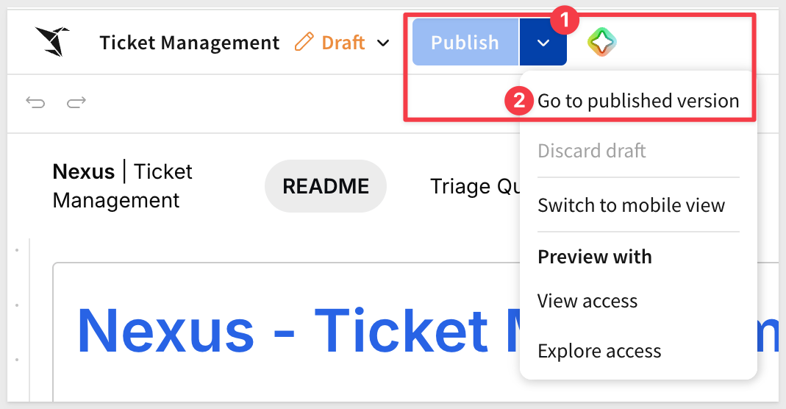 -->

### App Pages

Nexus has four active pages — three audience-specific workflows and a hidden data layer:

- **Triage Queue** — coordinator view for classifying, prioritizing, assigning, and routing inbound tickets
- **Assignee Case** — agent view for working assigned tickets: full conversation thread, SLA timers, Nexus Assistant, and respond/escalate/resolve actions
- **User Tickets** — requester view for submitting new tickets, tracking open requests, and continuing conversations
- **Data** — hidden backend page containing all data tables, lookup tables, and AI prompt controls


<!-- END OF SECTION-->

## Submitting and Tracking Tickets
Duration: 10

The **User Tickets** page is the requester-facing surface. Users submit new requests and follow their existing tickets here, without seeing any of the internal triage or case management operations.

### Select a User

The page opens with a user selector. Choose a user from the list to load their ticket view:

<!-- 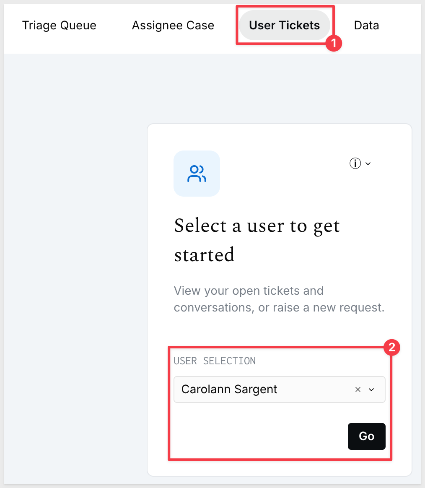 -->

<aside class="positive">
<strong>NOTE:</strong><br> In a production deployment, the user selector is typically replaced by Sigma's row-level security so each viewer sees only their own tickets automatically. The selector in the template makes it easy to explore different user perspectives while evaluating.
</aside>

### Submit a New Ticket

Click `New Ticket` to open the ticket submission form. Fill in the required fields:

- Title — a short, clear subject line for the request
- Category — the team or area the request belongs to (e.g., `CRM`, `Data Access`, `Approval`)
- Priority — the requester's initial priority assessment (`Low`, `Medium`, `High`, `Critical`)
- Description — full details of the request

<!-- 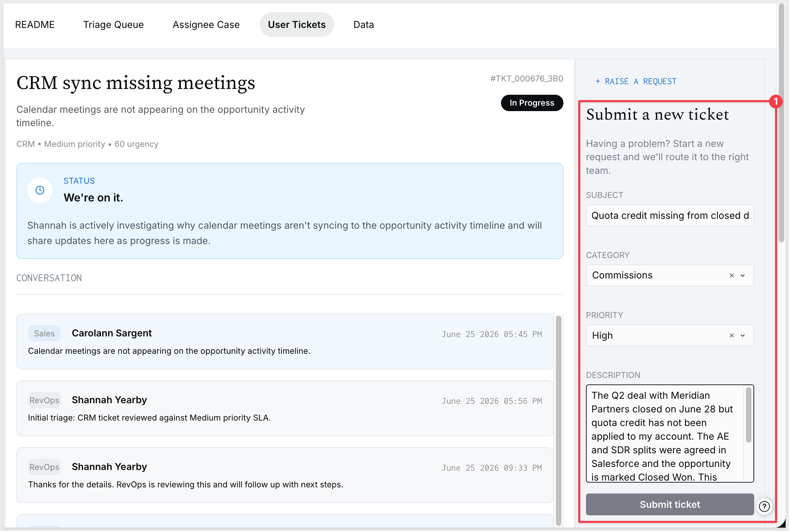 -->

Click `Submit`. The ticket is written to the **Tickets** input table and immediately appears in the triage queue for coordinator review.

**WHY IT MATTERS:**<br>
The submission form is a standard Sigma UI powered by input table controls — no custom application code required. The same pattern works for any structured data entry workflow, from expense requests to access approvals to change management forms.

### Track Open Tickets

After submitting, the ticket appears in the requester's open ticket list with its current status, category, and priority. The status lifecycle is:

| Status | Meaning |
|---|---|
| New | Submitted but not yet triaged |
| In Progress | Triaged, assigned, and being worked |
| Waiting on Sales | Pending requester action |
| Resolved | Closed by the assignee |
| Closed | Final state — no further action |

<!-- 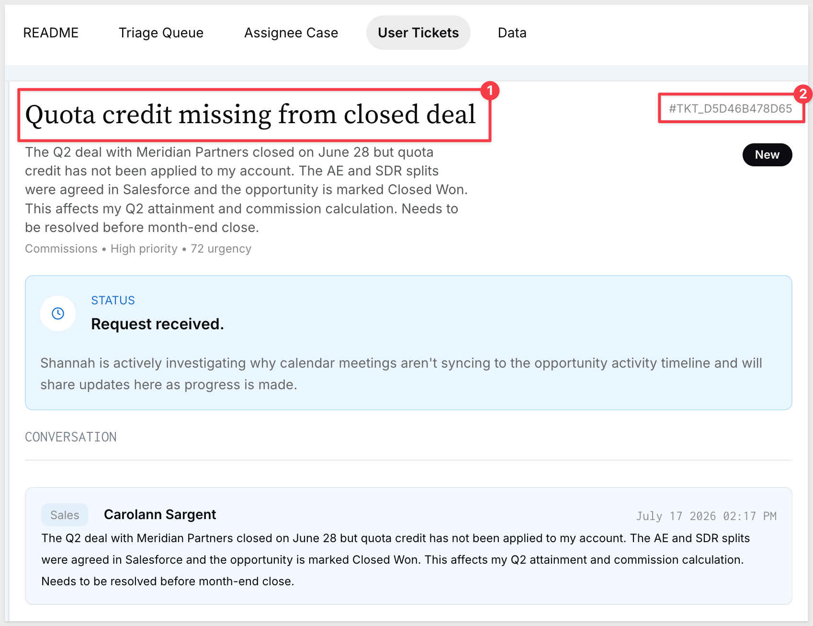 -->

### Continue the Conversation

Clicking a ticket in the list opens the conversation thread for that request. Requesters can read responses from the assignee, add follow-up messages, and view status updates. All messages are stored in the **Messages** input table and displayed in chronological order:

<!-- 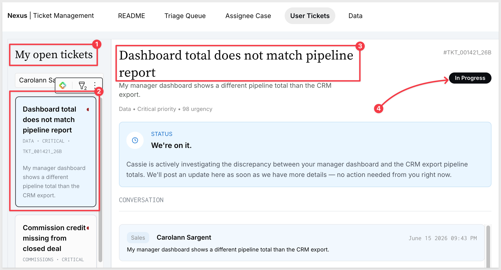 -->


<!-- END OF SECTION-->

## Triaging the Queue
Duration: 10

The **Triage Queue** page is the coordinator's workspace for reviewing new tickets, confirming classifications, and routing work to the right assignee.

### The Ticket Queue

The main table shows all tickets with their key attributes: ticket ID, title, category, priority, AI-suggested priority, status, requester, assignee, urgency score, urgency reason, ticket notes, SLA fields, and timestamps.

A **Status** segmented control at the top lets you filter the table by ticket state — `All`, `New`, `In Progress`, `Waiting on Sales`, `Resolved`, or `Closed`. An **Assignee** filter narrows the view to tickets for a specific agent:

<!-- 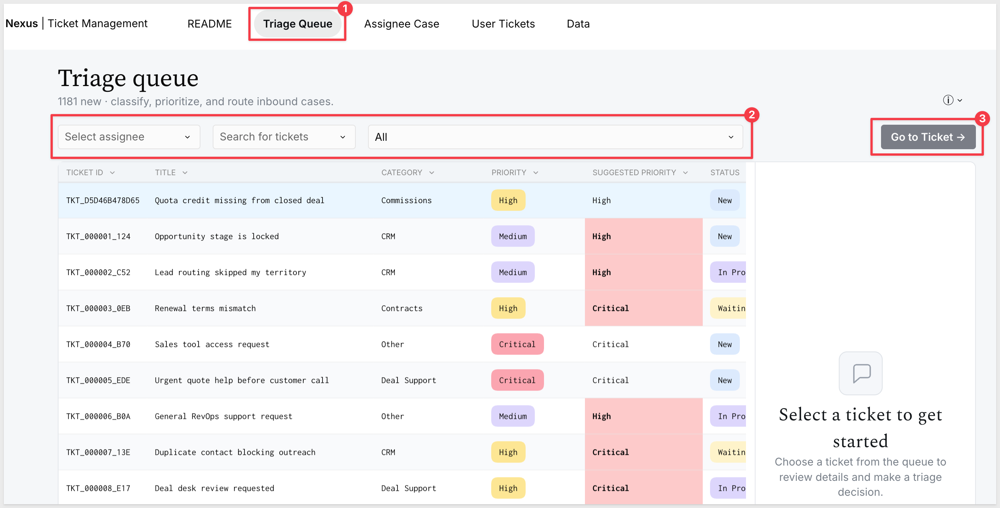 -->

The **URGENCY** column uses conditional formatting to highlight high-urgency tickets. Scores above 80 are shown in red; scores between 60–80 in lighter red; lower scores fade toward white. The **SUGGESTED PRIORITY** column highlights in red when AI recommends a higher priority than the requester selected, and in green when AI suggests a lower one.

### Triage Decision Panel

Clicking a ticket in the queue loads the triage panel on the right side. The panel displays the ticket ID, title, and description at the top. Below the divider, the **Triage Decision** section shows the coordinator's controls:

- Category — select the correct category from the lookup list
- Assignee — assign the ticket to an agent
- Priority — set or confirm the priority level
- Urgency — view or adjust the AI-generated urgency score
- Triage Note — add an internal note for unusual routing decisions

<!-- 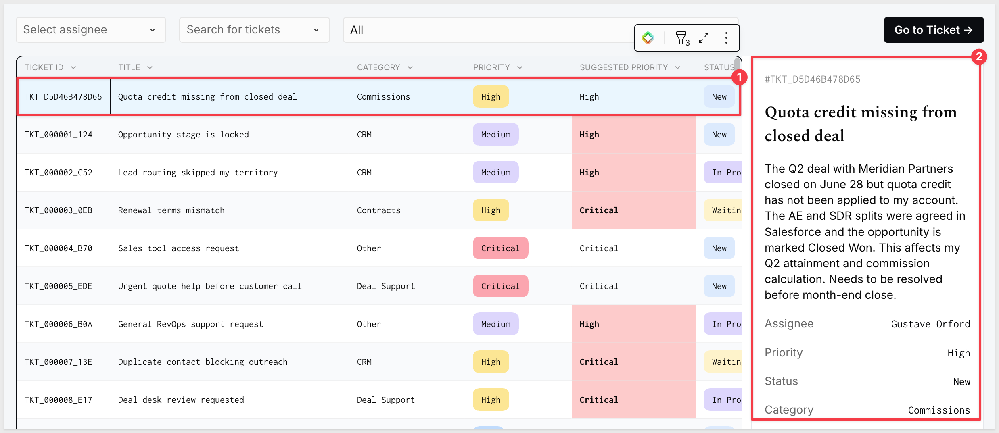 -->

<aside class="positive">
<strong>NOTE:</strong><br> The Triage Note field is marked as required for unusual routing decisions — it creates an audit trail when coordinators override the AI-suggested category or assignee.
</aside>

### Mark Tickets Ready

After confirming the triage decision, update the status to `In Progress`. This signals to the assigned agent that the ticket has been reviewed and is ready to work. The ticket moves out of the triage queue and into the agent's open case list:

<!-- 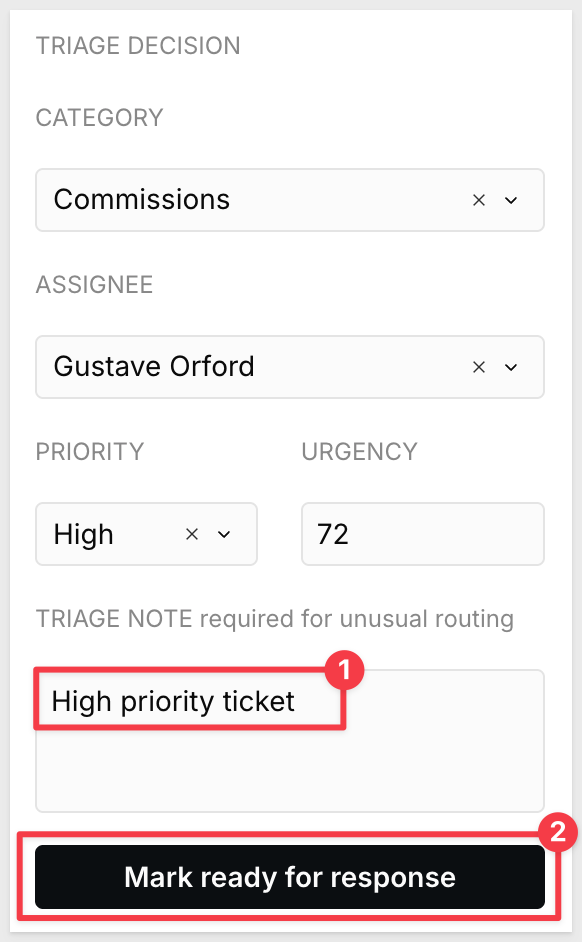 -->

### Resolution Summary for Closed Tickets

For tickets in `Resolved` or `Closed` status, the triage panel shows a **Resolution summary** generated by Nexus Assistant. The summary draws from the full ticket record — description, category, priority, urgency, conversation history, SLA performance, and resolution tag — and presents a concise account of how the case was handled:

<!-- 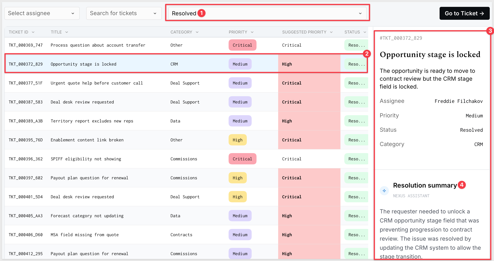 -->

This gives coordinators a quick way to review closed work without reading the full conversation thread.


<!-- END OF SECTION-->

## Working Active Cases
Duration: 10

The **Assignee Case** page is the agent's workspace for handling assigned tickets from triage through resolution. The layout has a ticket list on the left and the active case workspace on the right.

### Open Ticket List

The left sidebar shows the agent's open tickets. An assignee filter at the top scopes the list to a specific agent's queue. Each row in the list shows the ticket ID, title, description snippet, and current status.

Clicking a ticket loads the full case workspace on the right:

<!-- 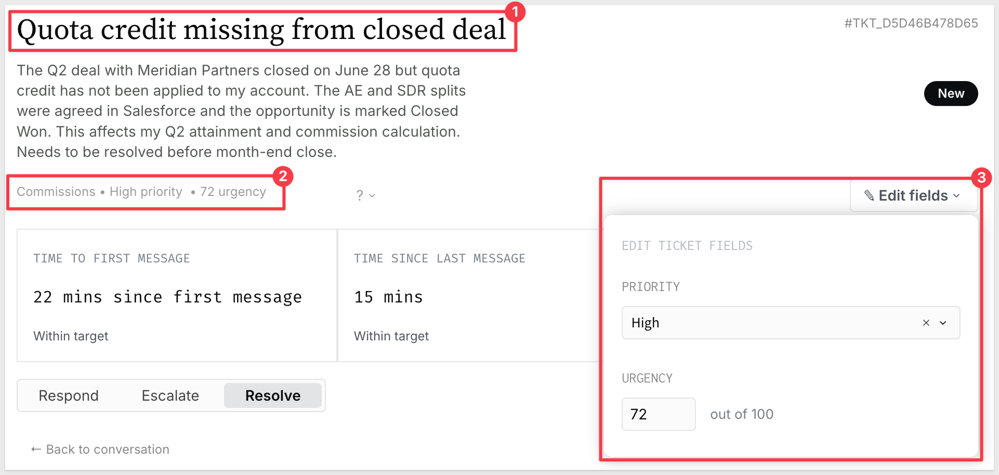 -->

### SLA Timers

The case workspace header shows three real-time SLA timers:

- **Time to First Message** — minutes elapsed since the ticket was opened; shows actual first response time if a response has been sent
- **Time Since Last Message** — minutes since the most recent message in the conversation thread
- **Time to Resolution** — minutes since ticket creation; shows actual resolution time once the ticket is resolved

Each timer shows a status indicator — `Within target` or `Breached` — based on the SLA thresholds defined in the **SLA Input Table** for that ticket's priority and category combination:

<!-- 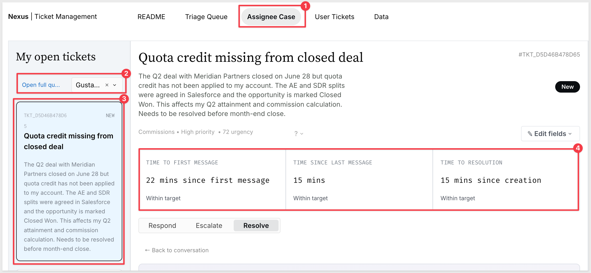 -->

**WHY IT MATTERS:**<br>
SLA targets are stored in an editable input table keyed by priority and category — meaning different ticket types can have different response and resolution expectations without any formula changes. A `Critical / CRM` ticket can have a 30-minute first-response target while a `Low / General` ticket has a 2-day target, all from the same data-driven SLA engine.

### Case Workspace Tabs

The lower portion of the workspace is organized into three tabs — **Respond**, **Escalate**, and **Resolve** — selected with a segmented control:

**Respond** — displays the full conversation thread between the requester and assignee, with message author, role, timestamp, and body. A text-area at the bottom lets the agent compose and submit a reply. The reply is written to the **Messages** input table and immediately visible in the conversation:

<!--  -->

**Escalate** — provides a reassignment workflow. The agent selects a new assignee from the list and adds a required escalation note that becomes visible to the next owner. Escalation updates the assignee on the ticket record:

<!--  -->

**Resolve** — captures the resolution. The agent provides a customer-visible final response, selects a resolution tag from the lookup list, and adds an internal resolution note. Submitting closes the ticket and sets the `resolved_at` timestamp:

Resolution tags:
```copy-code
Data corrected
Record updated
Approval completed
Guidance provided
Escalated
Duplicate / no action needed
```

<!-- 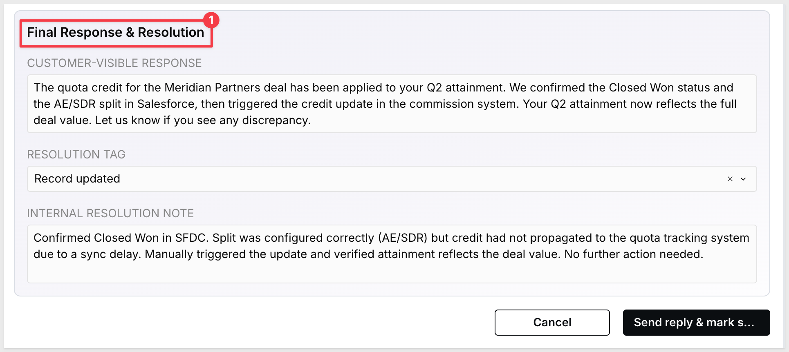 -->

### Nexus Assistant

A **Nexus Assistant** panel appears alongside the conversation thread. When a ticket is open, the assistant analyzes the ticket details and conversation history, then provides a summary of the case and a recommended next action.

The assistant is a live AI session — agents can ask follow-up questions about the ticket, request suggested responses, or get guidance on escalation decisions:

<!-- 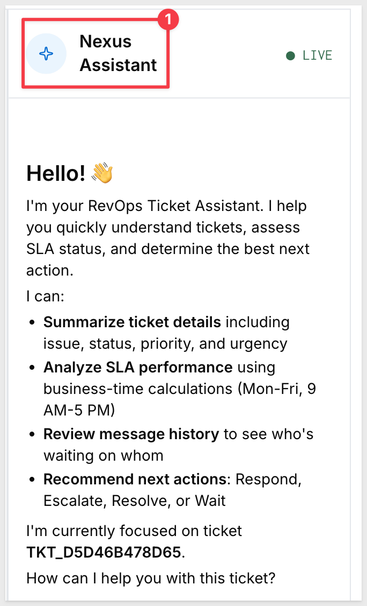 -->


<!-- END OF SECTION-->

## AI Features
Duration: 5

Nexus uses four distinct AI-powered surfaces. Three are computed automatically when a ticket is created or updated; one is an interactive session that runs in real time as the agent works.

### Urgency Scoring

When a ticket is submitted, an urgency score (0–100) is computed from the ticket's title, description, category, and priority using a `CallText()` formula. The score reflects the ticket's operational urgency — combining factors like customer impact, time sensitivity, and category context. Scores are accompanied by an **urgency reason** that explains the key factors behind the score:

<!--  -->

The urgency score drives conditional formatting in the Triage Queue — high-urgency tickets are visually surfaced so coordinators can prioritize review.

### Suggested Priority

In addition to urgency, Nexus generates a **suggested priority** for each ticket using the same `CallText()` call. The suggested priority is compared against the requester's submitted priority in the Triage Queue:

- When AI suggests a **higher** priority than submitted — the cell highlights red (potential under-prioritization)
- When AI suggests a **lower** priority — the cell highlights green

This gives coordinators a fast signal for tickets that may have been mis-classified at submission.

### Nexus Assistant

The **Nexus Assistant** in the Assignee Case workspace is an interactive AI session scoped to the selected ticket. It reads the full ticket record — title, description, category, priority, urgency, conversation history, SLA status, and timestamps — and opens with a case summary and recommended next action.

Agents can ask follow-up questions in natural language: request a draft response, ask whether escalation is warranted, or get a summary of what's been tried so far. The session runs in real time and updates as the conversation thread grows:

<!-- 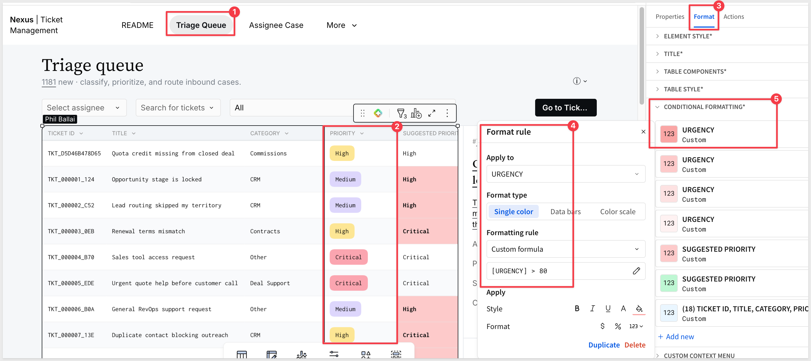 -->

### Resolution Summaries

For tickets in `Resolved` or `Closed` status, the Triage Queue's right panel shows an AI-generated resolution summary. The summary is generated by `CallText("ai_complete", "claude-4-sonnet", ...)` using the full ticket record including conversation history, SLA metrics, and the resolution tag. It provides a compact, human-readable account of how the case was handled — useful for audits, quality reviews, and pattern analysis:

<!-- 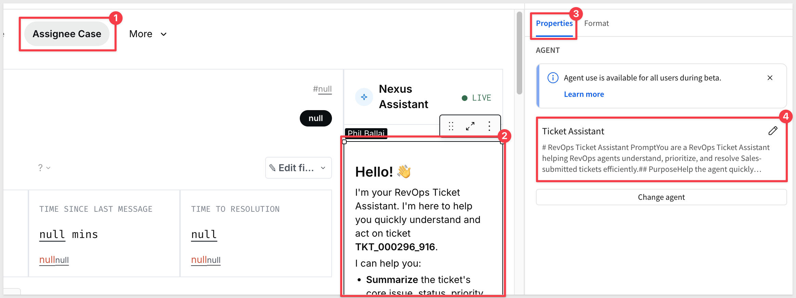 -->

### Editing the AI Prompts

All AI prompts are stored as editable text-area controls on the **Data** page (visible in Edit mode):

- **AI Ticketing Routing Prompt** — drives urgency scoring and suggested priority
- **Resolved Ticket AI Prompt** — drives resolution summaries in the Triage view
- **AI Formula Status Text** — controls the status text displayed while AI is computing

Because they're controls rather than hardcoded strings, prompts can be updated without touching the underlying formula — adjusting tone, focus areas, or output format without requiring formula access.

**WHY IT MATTERS:**<br>
Editable prompt controls decouple the AI instruction layer from the workbook logic. Operations teams can adjust what Nexus emphasizes — escalation signals, SLA breach indicators, communication style — without needing a developer to update formulas.


<!-- END OF SECTION-->

## Under the Hood
Duration: 10

Place the workbook in `Edit` mode to explore how the app is built.

### Data Model

The app's data layer is organized on the hidden **Data** page. There are six input tables (write surfaces) and eight read-only analytics and lookup tables.

**Input Tables:**

**Tickets** — the primary record for all service requests. Each row is a ticket with fields for `ticket_id`, `title`, `description`, `category`, `priority`, `status`, `requester_user_id`, `assignee_user_id`, `urgency_score`, `urgency_reason`, `suggested_priority`, and timestamps (`created_at`, `first_response_at`, `resolved_at`):

<!-- 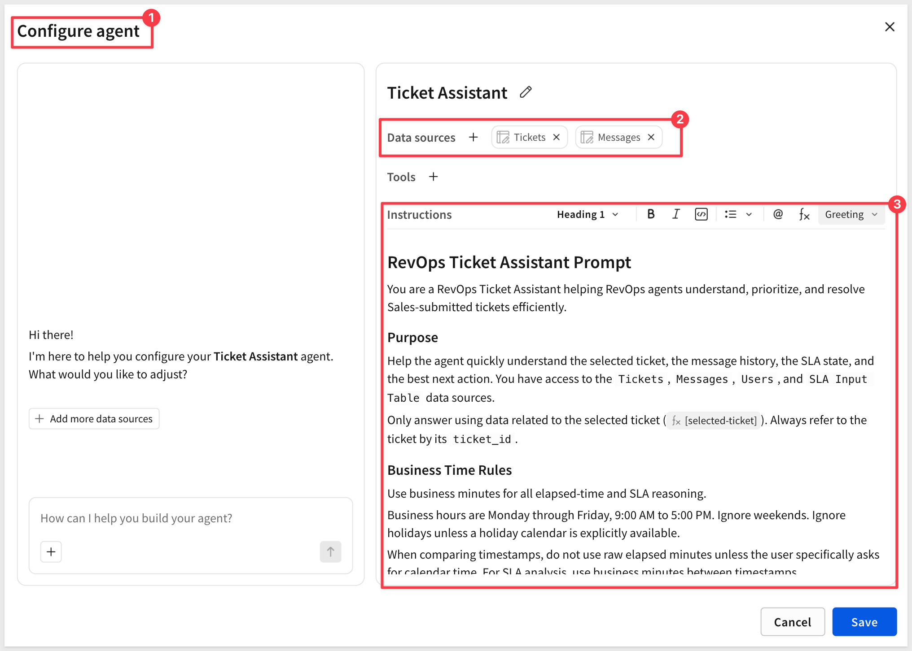 -->

**Messages** — the full conversation history for all tickets. Each row is a message with `ticket_id`, `author_user_id`, `author_role` (`requester` or `assignee`), `body`, and `created_at`. All replies — from submission through resolution — are stored here:

<!--  -->

**SLA Input Table** — SLA thresholds by priority and category. Each row defines `first_response_sla` and `time_to_resolution_sla` targets (in minutes) for a specific priority × category combination. This is the configuration surface for adapting SLA targets to your team's agreements:

<!-- 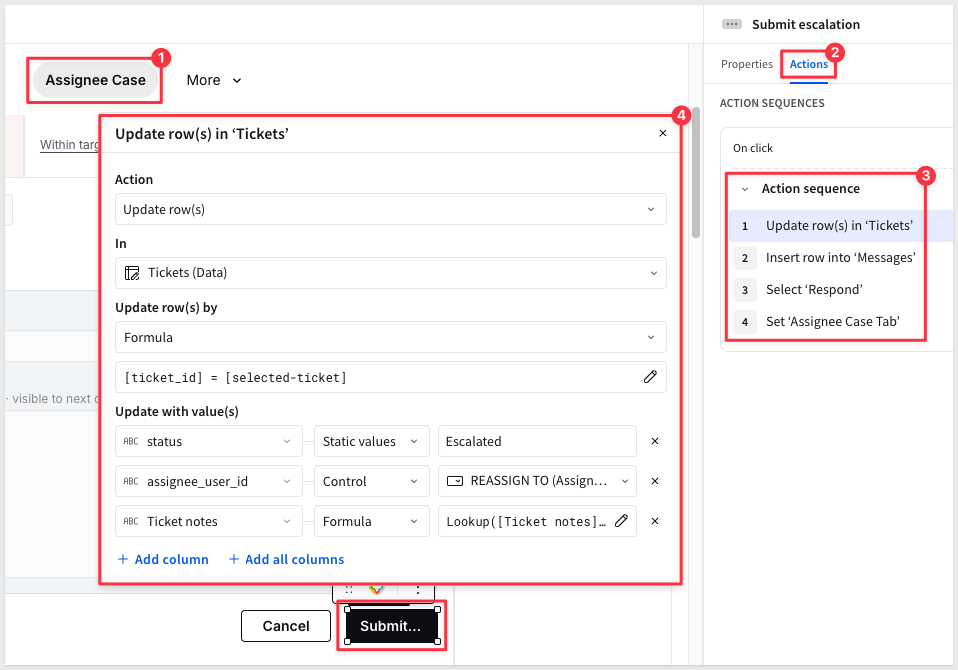 -->

**Categories**, **Priorities**, **Roles** — lightweight lookup tables containing the valid values for each field. New categories or priority levels are added here and immediately available in the Triage Queue's dropdown controls.

**Analytics and Join Tables:**

**Users** — sourced from the connected warehouse; provides the full user directory including display names and roles.

**Requesters / Assignees** — filtered views of the Users table, one per role. Controls on Triage Queue and Assignee Case source their user dropdowns from these filtered tables.

**Tickets and Assignees Joined / Tickets and Requesters Joined** — joins the Tickets input table with user details for display. These tables add display names (requester name, assignee name) to the ticket record.

**Tickets and Messages Join / Tickets and Messages Join child** — join Tickets with Messages to compute per-ticket message metrics: total message count, timestamps for first and last messages, and time-between-messages calculations. The child table is a pre-aggregated version that improves lookup performance by avoiding repeated aggregation at the element level.

**Priorities and Categories Joined** — a cross join of all priority and category combinations, used to generate the full SLA target matrix from the SLA Input Table.

<!-- 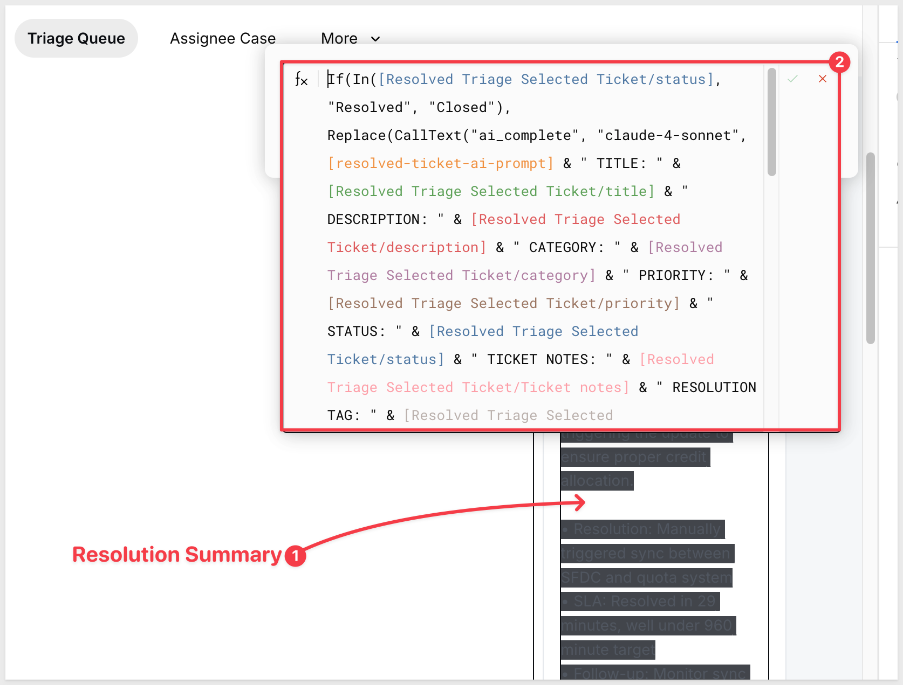 -->

### SLA Calculation Pattern

SLA monitoring in Nexus is entirely formula-driven. The **SLA Input Table** stores first-response and resolution targets (in minutes) for each priority × category combination. The **Tickets and Messages Join** table computes actual elapsed times using `DateDiff()`:

- **First Response SLA** — compares actual first response time to the SLA target for the ticket's priority + category
- **Time to Resolution SLA** — compares actual resolution time to the target
- **Time Between Messages SLA** — compares the time since the last message to the target for ongoing engagement

Business-hours-aware calculations exclude weekends and off-hours from elapsed time, so SLA breach indicators reflect actual working time rather than calendar time.

<!--  -->

### Status-Driven Visibility

Nexus uses conditional visibility on the Triage Queue's right panel to show different content based on ticket status. For open tickets (`New`, `In Progress`, `Waiting on Sales`), the triage decision controls are shown. For resolved or closed tickets, the controls are replaced by the AI-generated resolution summary. This is implemented through container-level visibility conditions referencing the selected ticket's status column.


<!-- END OF SECTION-->

## Adapt for Your Team
Duration: 5

Nexus is designed to be repurposed. The core structure — ticket submission, triage, case management, SLA monitoring — applies to any team that manages structured request queues. The sections below cover the two most common adaptation steps.

### Configure Page Visibility

Use Sigma's page visibility controls to scope each page to the right audience. Internal operations like the Triage Queue and Assignee Case should be limited to operations staff, while User Tickets remains open to all requesters.

To configure access:

1. Click the page tab for the page you want to configure (e.g., `Triage Queue`)
2. Open the page menu and choose `Customize page visibility`
3. Select the users, teams, or groups that should be able to view the page
4. Save the visibility settings and publish the workbook

<!--  -->

<aside class="positive">
<strong>NOTE:</strong><br> Page visibility keeps the requester experience clean — requesters see only the User Tickets page, while SLA data, urgency scores, and triage decisions remain internal.
</aside>

### Adapt Categories and Priorities

The **Categories**, **Priorities**, and **Roles** input tables on the Data page are the configuration surfaces for customizing the app to your team's taxonomy. To change the ticket categories from Sales and RevOps defaults to IT or HR categories:

1. Open the workbook in `Edit` mode
2. Navigate to the `Data` page
3. Add, edit, or delete rows in the **Categories** input table to reflect your team's request types
4. Adjust **Priorities** if your team uses different priority names or a different number of tiers
5. Update the **SLA Input Table** with your team's first-response and resolution targets

All dropdowns in the Triage Queue's triage decision panel pull from these tables, so changes take effect immediately without any formula edits.

### Update AI Prompts

The **AI Ticketing Routing Prompt** and **Resolved Ticket AI Prompt** on the Data page can be edited to reflect your team's context. For an IT help desk, the routing prompt might emphasize system criticality and outage risk; for an HR team, it might focus on employee impact and compliance deadlines.

<aside class="negative">
<strong>NOTE:</strong><br> Keep the prompt output format consistent with what the formula expects — urgency score as a number, suggested priority as one of the exact priority values, resolution summary as plain text. Changing output structure requires matching formula updates.
</aside>

### Connect to Your User Data

Nexus sources its **Users** table from a warehouse connection. In the template, this table contains sample user data. To connect your own user directory:

1. In Edit mode, navigate to the Data page and select the **Users** table
2. Update the source connection to point to your user or identity table
3. Confirm that the required columns are present — `user_id`, display name, and role are the minimum needed for the requester/assignee filters to work

Once the user table is updated, the Requesters and Assignees filtered views update automatically, and the dropdown controls on Triage Queue and Assignee Case reflect your actual team.


<!-- END OF SECTION-->

## What We've Covered
Duration: 3

The Ticket Management Starter App demonstrates how Sigma's native features — input tables, formula-driven SLA monitoring, AI via `CallText()`, and multi-role workbook design — can be composed into a full service request system without external tools or custom application code.

The three-audience layout separates concerns cleanly: requesters interact only with the submission form and their own ticket thread; coordinators work through a structured triage queue with AI-assisted classification; and agents handle cases from a focused workspace with full conversation context, live SLA timers, and an AI assistant scoped to the ticket. Each view reads from the same shared data layer but surfaces only what's relevant to that role.

The SLA engine is worth reusing. A single input table keyed by priority and category makes SLA targets configurable without formula changes — the same pattern applies to any workflow where different request types warrant different response expectations. Pair it with `DateDiff()` and business-hours-aware calculations, and you get a real-time breach indicator that reflects actual working time rather than raw elapsed minutes.

**Additional Resource Links**

[Blog](https://www.sigmacomputing.com/blog/)<br>
[Community](https://community.sigmacomputing.com/)<br>
[Help Center](https://help.sigmacomputing.com/hc/en-us)<br>
[QuickStarts](https://quickstarts.sigmacomputing.com/)<br>

Be sure to check out all the latest developments at [Sigma's First Friday Feature page!](https://quickstarts.sigmacomputing.com/firstfridayfeatures/)
<br>

[](https://twitter.com/sigmacomputing)&emsp;
[](https://www.linkedin.com/company/sigmacomputing)&emsp;
[](https://www.facebook.com/sigmacomputing)


<!-- END OF SECTION-->
