author: pballai
id: starter_apps_ticket_management
summary: Explore and adapt the Nexus ticket management App Template, covering requester, triage, and assignee views, AI-driven urgency scoring and resolution summaries, and the input-table data model.
categories: apptemplates
environments: web
status: Published
feedback link: https://github.com/sigmacomputing/sigmaquickstarts/issues
tags: default
lastUpdated: 2026-07-27

# Ticket Management App Template

## Overview
Duration: 5

Sigma's **App Templates** are ready-to-use applications built on Sigma's native features and connected to sample data. Each one ships fully functional — you can explore it immediately, learn how it's built by switching to edit mode, and adapt it to your own projects without starting from scratch.

The **Ticket Management** app — called **Nexus** — gives sales and RevOps teams a single surface for submitting, triaging, assigning, and resolving internal service requests. Nexus handles the full request lifecycle: requesters submit tickets through a clean form, coordinators triage and route them in a structured queue, and assignees work cases from a focused workspace with full conversation history, SLA timers, and AI assistance. The same structure adapts to IT, Finance, Operations, HR, or any team that manages request queues and resolution workflows.

This QuickStart walks through how the app works from each role, how it's designed under the hood, and how to adapt it for your own team's workflows.

### Target Audience
Sales operations and RevOps teams evaluating Sigma for internal request management. Solutions Engineers and technical stakeholders exploring the app as a reference design for AI-assisted ticketing, SLA monitoring, and multi-role workbook design.

### Prerequisites

<ul>
  <li>Access to a Sigma environment.</li>
  <li>The Ticket Management App Template available in your org — find it under <code>Templates</code> > <code>App Templates</code>.</li>
  <li><strong>Write access enabled on a connection</strong> — required for the input tables that store tickets, messages, categories, priorities, roles, and SLA targets. See <a href="https://help.sigmacomputing.com/docs/set-up-write-access">Set up write access</a></li>
  <li><strong>AI provider configured for your organization</strong> — required for urgency scoring, routing suggestions, Nexus Assistant, and resolution summaries. See <a href="https://help.sigmacomputing.com/docs/configure-ai-features-for-your-organization">Configure AI features for your organization</a></li>
  <li>Some familiarity with Sigma workbooks is helpful but not required.</li>
</ul>

<aside class="positive">
<strong>NOTE:</strong><br> If you don't see App Templates in your Templates section, contact your Sigma administrator to confirm availability in your org.
</aside>

### What You'll Learn
- How Nexus works across its three audience views — requester, triage coordinator, and case assignee
- How AI drives urgency scoring, routing, real-time assistance, and resolution summaries
- The data model behind the app and the key design patterns it uses
- How to adapt the app for your team and connect it to your own data


<!-- END OF SECTION-->

## Exploring the App
Duration: 10

### Open and Save the Template

Navigate to `Templates` in the left sidebar. The Ticket Management app appears in the `Made by Sigma` collection:


Click the template card to open a preview. Before clicking `Use template`, confirm both requirements shown on the detail page are met:

- **Write access enabled on a connection** — required for input tables to store tickets, messages, and configuration data. See [Set up write access](https://help.sigmacomputing.com/docs/set-up-write-access)
- **AI provider set up in your organization** — required for urgency scoring, routing, and Nexus Assistant. See [Configure AI features for your organization](https://help.sigmacomputing.com/docs/configure-ai-features-for-your-organization)

Once both are in place, click `Use template`. Sigma creates a personal copy in your workspace:


Click `Save as` and give the workbook a name:
```copy-code
Ticket Management
```

<aside class="positive">
<strong>NOTE:</strong><br> The original template remains unchanged in the gallery — your saved copy is the working version.
</aside>

### README Page

The app opens on its **README** page — an orientation guide built directly into the workbook:


The README includes a demo video, a five-step getting-started guide, and a description of each application page. The recommended sequence is:

1. **Submit a Request** — create a ticket with a subject, category, priority, and description; Nexus uses the details to suggest routing, urgency, and priority
2. **Review the Triage Queue** — confirm category, priority, and assignee; add internal notes
3. **Mark Tickets Ready** — move reviewed tickets into `In Progress` so the assigned owner can begin working
4. **Work Active Cases** — reply to requesters, monitor SLA risk, escalate when needed, and resolve completed work
5. **Review Completed Tickets** — use resolved and closed tickets to understand resolution patterns and SLA performance

<aside class="negative">
<strong>NOTE:</strong><br> The README page is visible to all users of the app by default. If you adapt this template for your org, update it to reflect your team's ticket categories, SLA targets, and workflow steps.
</aside>

Place the workbook into `Published` mode:


### App Pages

Nexus has four active pages — three audience-specific workflows and a hidden data layer:

- **Triage Queue** — coordinator view for classifying, prioritizing, assigning, and routing inbound tickets
- **Assignee Case** — agent view for working assigned tickets: full conversation thread, SLA timers, Nexus Assistant, and respond/escalate/resolve actions
- **User Tickets** — requester view for submitting new tickets, tracking open requests, and continuing conversations
- **Data** — hidden backend page containing all data tables, lookup tables, and AI prompt controls

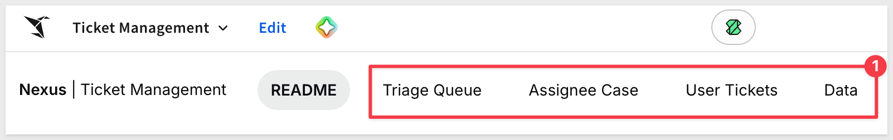


<!-- END OF SECTION-->

## Submitting and Tracking Tickets
Duration: 10

The **User Tickets** page is the requester-facing surface. Users submit new requests and follow their existing tickets here, without seeing any of the internal triage or case management operations.

The page has three columns: an open ticket list on the left, a ticket detail view in the center, and a submission form on the right.

### Select a User

The left column opens with a user selector. Choose a user from the list to load their open ticket queue:


<aside class="positive">
<strong>NOTE:</strong><br> In a production deployment, the user selector is typically replaced by Sigma's row-level security so each viewer sees only their own tickets automatically. The selector in the template makes it easy to explore different user perspectives while evaluating.
</aside>

### Submit a New Ticket

The right column always shows the **Submit a new ticket** form. A `+ RAISE A REQUEST` link at the top of the panel makes it easy to find. Fill in the four fields using the values below:

Subject:
```copy-code
Quota credit missing from closed deal
```

Category:
```copy-code
Commissions
```

Priority:
```copy-code
High
```

Description:
```copy-code
The Q2 deal with Meridian Partners closed on June 28 but quota credit has not been applied to my account. The AE and SDR splits were agreed in Salesforce and the opportunity is marked Closed Won. This affects my Q2 attainment and commission calculation. Needs to be resolved before month-end close.
```


Click `Submit ticket`. The ticket is written to the **Tickets** input table and immediately appears in the triage queue for coordinator review:


**WHY IT MATTERS:**<br>
The submission form is a standard Sigma UI powered by input table controls — no custom application code required. The same pattern works for any structured data entry workflow, from expense requests to access approvals to change management forms.

### Track Open Tickets and the Conversation

Clicking a ticket in the left column loads the full ticket detail in the center. The detail view shows:

- Ticket title, ID, and status badge
- A status update from the assigned agent ("We're on it.", for example) displayed prominently above the conversation
- Category, priority, and urgency score metadata
- The full conversation thread — messages from both the requester and the assignee in chronological order, with author name, role (`Sales`, `RevOps`), and timestamp

The status lifecycle is:

| Status | Meaning |
|---|---|
| New | Submitted but not yet triaged |
| In Progress | Triaged, assigned, and being worked |
| Waiting on Sales | Pending requester action |
| Resolved | Closed by the assignee |
| Closed | Final state — no further action |


All messages are stored in the **Messages** input table. New replies appear in the thread immediately after submission.


<!-- END OF SECTION-->

## Triaging the Queue
Duration: 10

The **Triage Queue** page is the coordinator's workspace for reviewing new tickets, confirming classifications, and routing work to the right assignee.

### The Ticket Queue

The page header shows a live count of open tickets and the queue's purpose: "classify, prioritize, and route inbound cases." The ticket table has three filter controls at the top:

- `Select assignee` — narrows the queue to tickets assigned to a specific agent
- `Search for tickets` — filters the table by ticket title or ID
- Status dropdown — filters by `All`, `New`, `In Progress`, `Waiting on Sales`, `Resolved`, or `Closed`

A `Go to Ticket →` button at the top right opens the Assignee Case workspace for the currently selected ticket.

The table columns are: TICKET ID, TITLE, CATEGORY, PRIORITY, SUGGESTED PRIORITY, and STATUS. Priority values use colored badges — Critical in pink, High in amber, Medium in lavender, Low in light blue. The **SUGGESTED PRIORITY** column highlights in bold red when AI recommends a higher priority than the requester selected:


The ticket we submitted — "Quota credit missing from closed deal" — appears at the top of the queue with status `New`.

### Triage Decision Panel

Clicking a ticket loads the right panel. The top of the panel shows the ticket's read-only metadata: ticket ID, title, description, assigned agent, priority, status, and category. This gives the coordinator a quick read on the ticket before making any changes:


Below the metadata, the **TRIAGE DECISION** section shows the editable controls:

- Category — confirm or change the ticket category
- Assignee — assign or reassign to an agent
- Priority — set or confirm the priority level
- Urgency — view or adjust the AI-generated urgency score
- Triage Note — add an internal note for unusual routing decisions (required when overriding AI suggestions)

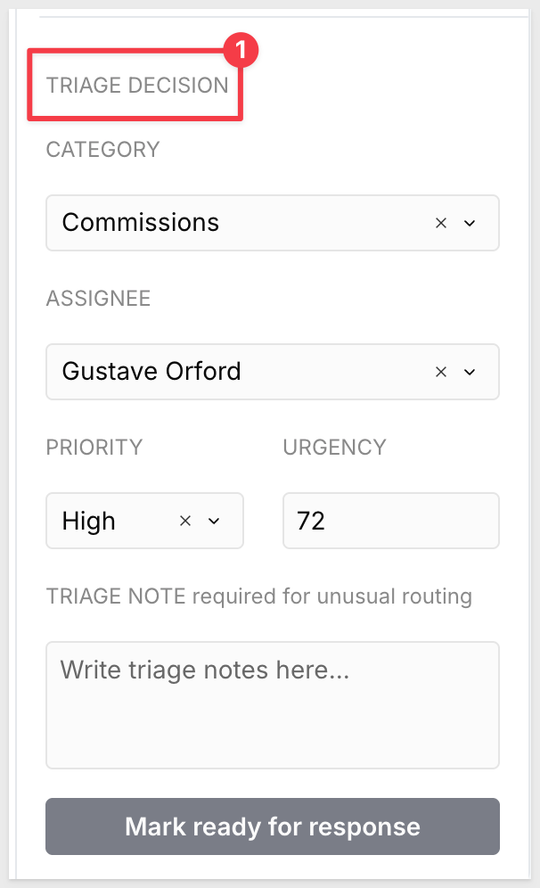

<aside class="positive">
<strong>NOTE:</strong><br> The Triage Note field creates an audit trail when coordinators override the AI-suggested category or assignee — useful for explaining non-standard routing to the next owner.
</aside>

### Mark Tickets Ready

After confirming the triage decision, update the ticket status to `In Progress`. This signals to the assigned agent that the ticket has been reviewed and is ready to work. The ticket moves out of the `New` state and into the agent's open case list on the Assignee Case page:


### Resolution Summary for Closed Tickets

For tickets in `Resolved` or `Closed` status, the right panel replaces the triage decision controls with a **Resolution summary** generated by Nexus Assistant. The summary draws from the full ticket record — description, category, priority, urgency, conversation history, SLA performance, and resolution tag — and presents a concise account of how the case was handled:


This gives coordinators a way to review closed work without reading the full conversation thread.


<!-- END OF SECTION-->

## Working Active Cases
Duration: 10

The **Assignee Case** page is the agent's workspace for handling assigned tickets from triage through resolution. The layout has three columns: a ticket list on the left, the active case workspace in the center, and the Nexus Assistant on the right.

### Open Ticket List

The left sidebar shows the agent's open tickets. An `Open full queue` link at the top opens the full queue view.

A `Select assignee` dropdown scopes the list to a specific agent. 

Each ticket card shows the ticket ID, status badge (`NEW` or `IN PROGRESS`), title, and description snippet.

Clicking a ticket card loads the full case workspace in the center:


### Case Workspace Header

The center panel header shows the ticket title, ticket ID, and status badge. Below the title, a single metadata line displays category, priority, and urgency score (`Contracts • Critical priority • 100 urgency`). An `Edit fields` button on the right opens an inline edit panel for updating ticket fields directly from this view.


### SLA Timers

Three timer cards sit below the metadata line:

- **TIME TO FIRST MESSAGE** — minutes elapsed since the ticket was created; shows actual first response minutes once a response has been sent
- **TIME SINCE LAST MESSAGE** — minutes since the most recent message in the conversation thread
- **TIME TO RESOLUTION** — minutes since ticket creation; shows actual resolution time once the ticket is resolved

When a timer exceeds its SLA threshold, the card background turns light red and shows a `● Breached` indicator. Thresholds are defined in the **SLA Input Table** by priority and category combination — a `Critical` ticket has tighter targets than a `Low` one:

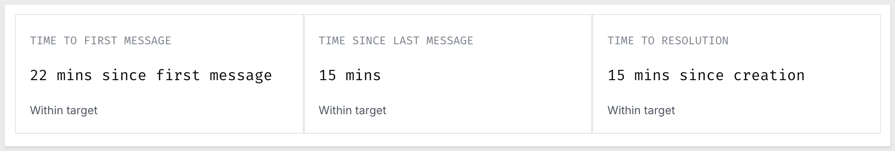

**WHY IT MATTERS:**<br>
SLA targets are stored in an editable input table keyed by priority and category — meaning different ticket types can carry different response and resolution expectations without any formula changes. A `Critical / Contracts` ticket can have a 30-minute first-response target while a `Low / Other` ticket has a 2-day target, all from the same data-driven SLA engine.

### Case Workspace Tabs

Three tabs below the SLA cards control the active workflow panel — **Respond**, **Escalate**, and **Resolve**:

**Respond** — displays the full conversation thread between the requester and assignee, with message author, role, timestamp, and body. A text-area at the bottom lets the agent compose and submit a reply. The reply is written to the **Messages** input table and immediately visible in the thread:

<!--  -->

**Escalate** — provides a reassignment workflow. A `← Back to conversation` link returns to the thread without submitting. The agent selects a new assignee from the `REASSIGN TO` dropdown and writes a required escalation note in the `ESCALATION NOTE` field (marked "visible to next owner"). Click `Submit escalation` to transfer ownership:

<!--  -->

**Resolve** — captures the resolution. The agent provides a customer-visible final response, selects a resolution tag, and adds an internal resolution note. Submitting closes the ticket and sets the `resolved_at` timestamp.

Use the following values to resolve the "Quota credit missing from closed deal" ticket:

Customer-visible response:
```copy-code
The quota credit for the Meridian Partners deal has been applied to your Q2 attainment. We confirmed the Closed Won status and the AE/SDR split in Salesforce, then triggered the credit update in the commission system. Your Q2 attainment now reflects the full deal value. Let us know if you see any discrepancy.
```

Resolution tag:
```copy-code
Record updated
```

Internal resolution note:
```copy-code
Confirmed Closed Won in SFDC. Split was configured correctly (AE/SDR) but credit had not propagated to the quota tracking system due to a sync delay. Manually triggered the update and verified attainment reflects the deal value. No further action needed.
```


The resolution information is added to the ticket upon submission:

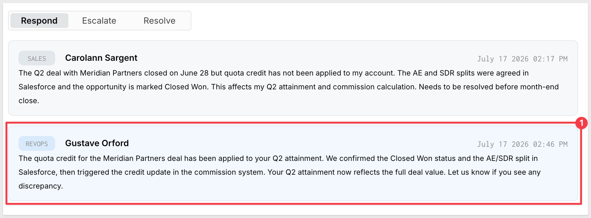

The ticket is shown as resolved in `User Tickets` for the user who reported the issue:

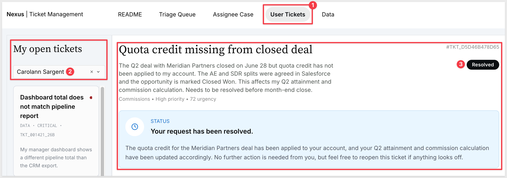

### Nexus Assistant

The **Nexus Assistant** panel on the right is powered by a Sigma Agent — a governed AI assistant with explicitly configured data access and instructions. It shows `● LIVE` when active. When a ticket is selected, the agent introduces itself and describes what it's analyzing:

- **Ticket details** — status, priority, urgency, and SLA state
- **Message history** — who said what, who's waiting, and whether follow-up is needed
- **Business-time SLA tracking** — first response, resolution, and reply deadlines using business hours (Mon–Fri, 9 AM – 5 PM)

The agent recommends whether to **Respond**, **Escalate**, **Resolve**, or **Wait**, then opens the conversation for follow-up questions. You can ask for a draft response, request a summary of what's been tried, or ask whether escalation is warranted. See the AI Features section for how the agent is configured and governed.


<!-- END OF SECTION-->

## AI Features
Duration: 5

Nexus uses AI across four surfaces, each with a different trigger and persistence model. At ticket submission, a Sigma Action sends ticket details to the model and writes routing, urgency, and priority results directly to the Tickets input table — stored once, read everywhere. For resolved tickets, the Triage Queue generates a resolution summary on demand via a live `CallText()` formula each time a coordinator selects the ticket. The Nexus Assistant is an interactive Sigma Agent that responds in real time as the case worker types. And the AI Formula Status Text prompt generates short requester-facing status updates that can be surfaced in the conversation thread.

### Routing, Urgency, and Suggested Priority

When a ticket is submitted, a Sigma **Action** on the submit button sends the ticket's subject, category, priority, and description to the AI model, along with a list of candidate assignees and their current open ticket counts. 

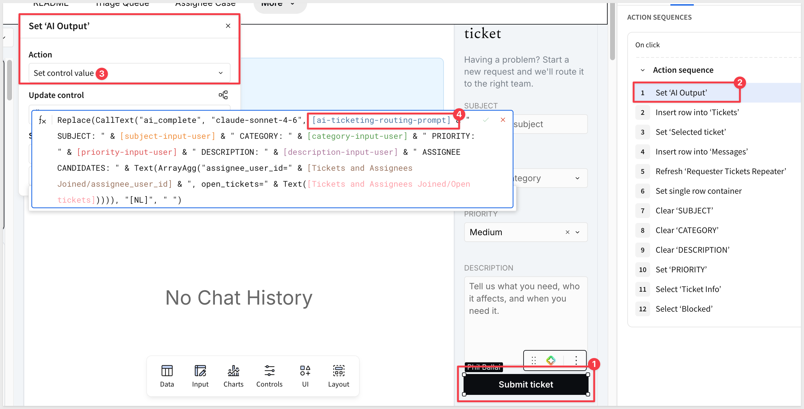

The action uses the **AI Ticketing Routing Prompt** (editable on the Data page) and expects the model to return a single JSON object:

```copy-code
{
  "assignee_user_id": "string",
  "urgency_score": number,
  "urgency_reason": "string",
  "suggested_priority": "Low|Medium|High|Critical"
}
```

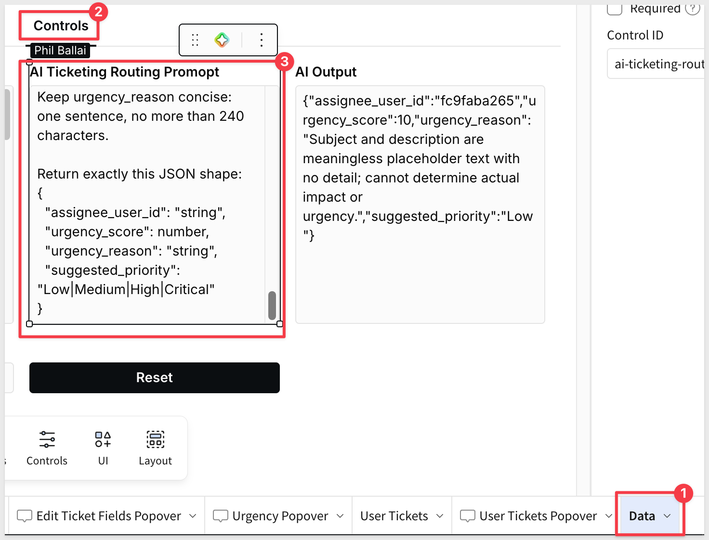


The action writes all four values back to the Tickets input table in one step:

- `assignee_user_id` — the AI-selected agent; the model prefers assignees who have handled the ticket's category before, and among qualified candidates picks whoever has the fewest open tickets
- `urgency_score` — a 0–100 score; the prompt instructs the model to use the requester's selected priority as a signal but not as gospel
- `urgency_reason` — one sentence (max 240 characters) explaining the key factors behind the score
- `suggested_priority` — must match the urgency bucket (0–24 = Low, 25–49 = Medium, 50–74 = High, 75–100 = Critical)

The urgency scale the model applies:

| Urgency | Score range | Typical signals |
|---|---|---|
| Critical | 75–100 | Active revenue risk, executive escalation, blocked deal, incorrect contract blocking signature |
| High | 50–74 | Time-sensitive approval, commission/payout risk, customer-facing sales issue |
| Medium | 25–49 | Standard RevOps request, single-record cleanup, non-urgent support |
| Low | 0–24 | Vague request, how-to question, minor cleanup, no clear deadline |

The urgency score drives conditional formatting in the Triage Queue — high-urgency tickets surface immediately. The suggested priority column highlights red when AI recommends a higher tier than the requester selected, and green when it recommends lower, giving coordinators a fast signal for misclassified submissions.


### Nexus Assistant

The **Nexus Assistant** in the Assignee Case workspace is powered by a **Sigma Agent** — not a chat element or formula, but a fully configured AI agent with explicit data access controls, instructions, and a scoped system prompt. In Edit mode, clicking the agent element (pencil icon) opens the **Configure agent** dialog:


The configuration has three parts:

**Data sources** — the agent is explicitly granted access to only the `Tickets` and `Messages` input tables. It cannot see SLA targets, the user directory, or any other table unless added here. This is the primary governance control: what data the AI can reason over is a builder decision, not an inference.

**Instructions** — a rich-text system prompt that defines the agent's role, purpose, and reasoning rules. The Nexus instructions include:
- **Purpose**: understand the selected ticket, message history, and SLA state; recommend Respond, Escalate, Resolve, or Wait
- **Scope**: only answer using data related to the selected ticket (`[selected-ticket]` — a formula reference that filters the agent's context to the active case)
- **Business Time Rules**: use business minutes for all SLA reasoning; business hours are Mon–Fri 9 AM – 5 PM; ignore weekends; do not use raw calendar minutes for SLA analysis unless explicitly asked

**Tools** — optional tools the agent can call; additional capabilities can be added here without changing the instructions.


You can ask follow-up questions in natural language: request a draft response, ask whether escalation is warranted, or get a summary of what's been tried. The session runs in real time against the live data sources and updates as the conversation thread grows.

**WHY IT MATTERS:**<br>
A Sigma Agent is governed infrastructure, not a general-purpose chatbot. The data sources it can access, the instructions it follows, and the tools it can call are all builder-controlled and version-managed with the workbook. Agents interact on top of Sigma's existing permission model — a viewer who can't see a column can't get the agent to surface it either. That makes it practical to deploy an AI assistant to a broad audience without a separate security review for every deployment.

### Resolution Summaries

Before the resolution summary can run, the resolution data has to exist on the ticket. When an agent submits the Resolve form on the Assignee Case page, a Sigma **Action** on the submit button writes the customer-visible response, resolution tag, internal note, and `resolved_at` timestamp back to the **Tickets** input table. 

Similarly, replies write new rows to the **Messages** input table and escalations update the `assignee_user_id` on the ticket — all via Actions on their respective buttons. To see these, go to the Assignee Case page in Edit mode and click any of the three action buttons (`Send reply`, `Submit escalation`, `Submit resolution`).


Once the ticket is in `Resolved` or `Closed` status, the Triage Queue's right panel generates the AI summary. This part is implemented as a `CallText("ai_complete", "claude-4-sonnet", ...)` expression directly in a text element — a live formula that runs on-demand when a coordinator selects the resolved ticket, not a stored value. 

It passes the full ticket record (title, description, category, priority, urgency, conversation history, SLA metrics, resolution tag) to the model and displays the output inline. In Edit mode, click the resolution summary text element in the Triage Queue to see the formula in the element body:


This approach — live `CallText()` in a text element rather than a stored column — means the summary is generated fresh each time it's viewed, using whatever data exists on the ticket at that moment. That's appropriate for a read-only summary that doesn't need to be queried or aggregated.

### Editing the AI Prompts

All AI prompts are stored as editable text-area controls on the **Data** page (visible in Edit mode):

- **AI Ticketing Routing Prompt** — drives assignee selection, urgency scoring, urgency reason, and suggested priority; returns JSON written back to the Tickets input table by the submit Action
- **Resolved Ticket AI Prompt** — drives resolution summaries in the Triage view
- **AI Formula Status Text** — generates 1–2 requester-facing sentences summarizing ticket status; used for in-thread status updates

Because they're controls rather than hardcoded strings, prompts can be updated without touching the underlying formula — adjusting tone, focus areas, or output format without requiring formula access.

**WHY IT MATTERS:**<br>
Editable prompt controls decouple the AI instruction layer from the workbook logic. Operations teams can adjust what Nexus emphasizes — escalation signals, SLA breach indicators, communication style — without needing a developer to update formulas.


<!-- END OF SECTION-->

## Under the Hood
Duration: 10

Place the workbook in `Edit` mode to explore how the app is built. The **Data** page contains all data tables and AI controls, organized into five tabs.

### Warehouse Source

The `Warehouse Source` tab holds a single **Users** table sourced from your connected warehouse. It supplies the full user directory — all requesters and assignees in the ticketing system — with `user_id`, `full_name`, `email`, `User Role Id`, and `Role`:

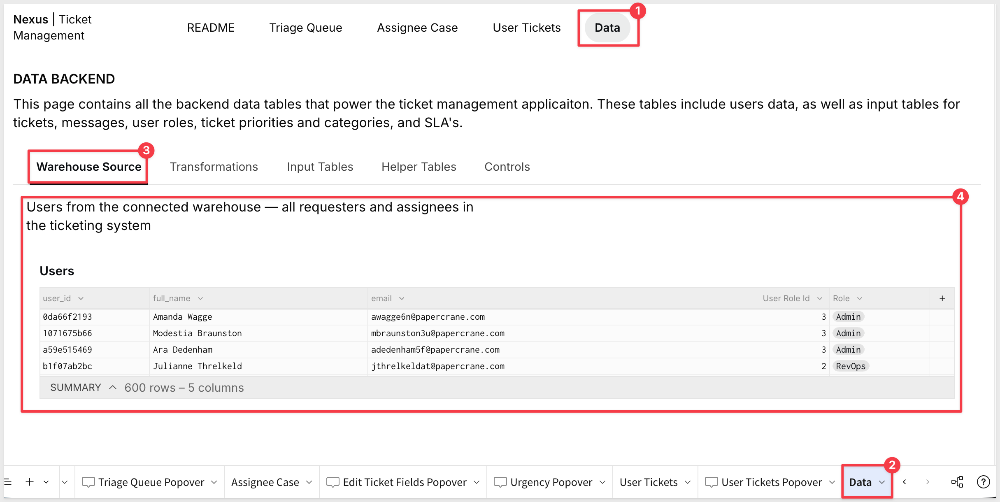

### Transformations

The `Transformations` tab holds four derived tables built on top of the warehouse source and input tables:

- **Tickets and Assignees Joined** — joins the Tickets input table with assignee user details to resolve display names across the app
- **Tickets and Requesters Joined** — same pattern for requester display names
- **Tickets and Messages Join** — joins Tickets with Messages to compute per-ticket message metrics: first and last message timestamps, time-between-messages, and SLA calculations
- **Priorities and Categories Joined** — a cross join of all priority and category combinations, used to generate the full SLA target matrix from the SLA Input Table

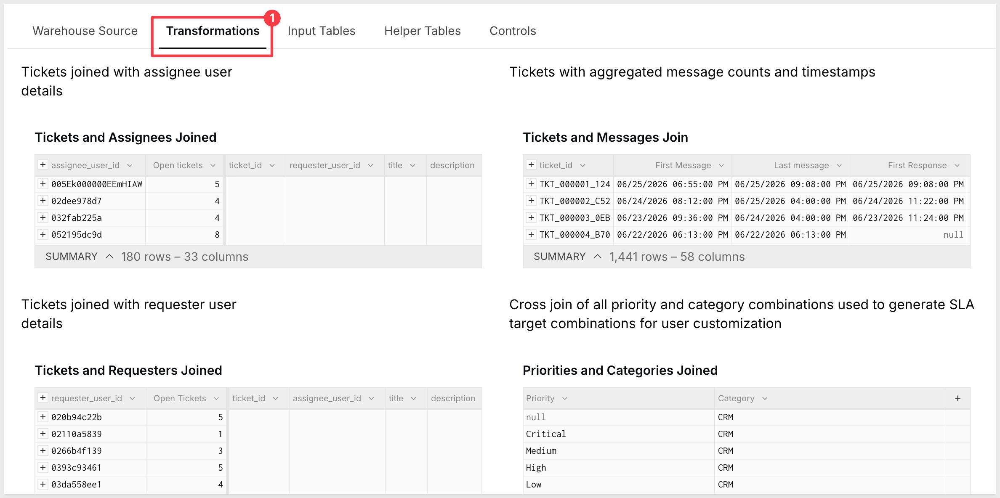

### Input Tables

The `Input Tables` tab holds the six write surfaces that store all application data:

**Tickets** *(Editable in published version — all users)* — the primary record for every service request. Fields include `ticket_id`, `title`, `description`, `category`, `priority`, `status`, `requester_user_id`, `assignee_user_id`, `urgency_score`, `urgency_reason`, `suggested_priority`, and timestamps.

**Messages** *(Editable in published version — all users)* — the full conversation history. Each row is a message with `ticket_id`, `author_user_id`, `author_role`, `body`, and `created_at`. All replies — from submission through resolution — are stored here.

**SLA Input Table** *(Editable in draft)* — SLA thresholds keyed by priority and category. Each row defines `First response` and `Next response` targets in minutes. Edit this table to match your team's SLA agreements — no formula changes required.

**Categories**, **Priorities**, **Roles** *(Editable in draft)* — lookup tables for the valid values in each field. New categories or priority levels added here immediately appear in the Triage Queue's dropdown controls.

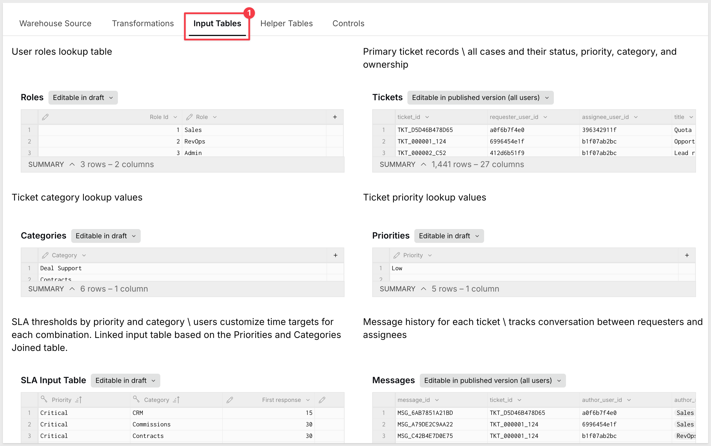

### Helper Tables

The `Helper Tables` tab holds three derived tables that support UI performance and filtering:

- **Requesters** — Users filtered to the Requester (Sales) role; sources the user selector on the User Tickets page
- **Assignees** — Users filtered to the Assignee (RevOps) role; sources the assignee dropdowns on Triage Queue and Assignee Case
- **Tickets and Messages Join child** — a pre-aggregated version of the Tickets and Messages Join table. Pre-aggregating avoids repeated group-by operations at the element level and improves rendering performance as ticket volume grows

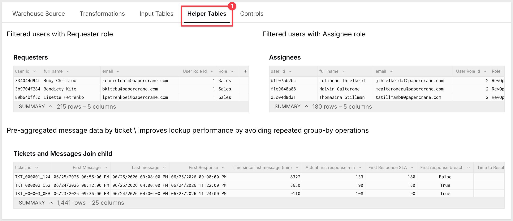

### Controls

The `Controls` tab holds the AI prompts and coordination controls that drive Nexus's AI features:

- **AI Ticketing Routing Prompt** — the system prompt for assignee selection, urgency scoring, and suggested priority; the submit Action passes this to the model and writes the JSON response back to the Tickets input table
- **Resolved Ticket AI Prompt** — the system prompt for resolution summaries; drives the `CallText()` formula in the Triage Queue right panel
- **AI Formula Status Text** — a prompt for generating 1–2 requester-facing sentences summarizing ticket status
- **AI Output** — stores the last routing JSON response; useful for debugging and verifying model output
- **Selected ticket** (×2) — coordination controls that pass the active ticket context into AI formulas
- **Reset** — clears AI output and resets coordination state

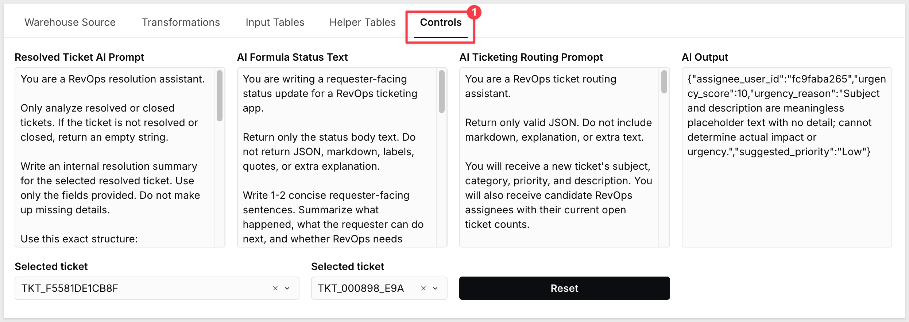

Because prompts are stored as editable text-area controls rather than hardcoded strings, they can be updated without touching any formula. Operations teams can adjust routing criteria, escalation signals, or communication style without requiring formula access.

### SLA Calculation Pattern

SLA monitoring in Nexus is entirely formula-driven. The **SLA Input Table** stores first-response and next-response targets (in minutes) for each priority × category combination. The **Tickets and Messages Join child** computes actual elapsed times using `DateDiff()`:

- **Actual first response min** — elapsed minutes from ticket creation to first reply
- **First Response SLA** — the target pulled from the SLA Input Table for that ticket's priority + category
- **First response breach** — boolean: actual > target
- **Time to Resolution SLA** and **Actual resolved min** — same pattern for case closure

Business-hours-aware calculations exclude weekends and off-hours from elapsed time, so breach indicators reflect actual working time rather than calendar minutes.

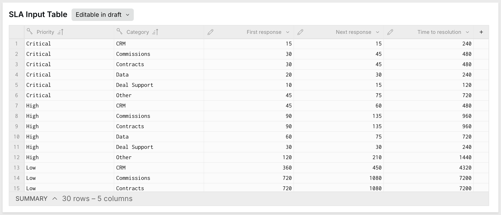

### Status-Driven Visibility

Nexus uses conditional visibility on the Triage Queue's right panel to show different content based on ticket status. For open tickets (`New`, `In Progress`, `Waiting on Sales`), the triage decision controls are shown. For resolved or closed tickets, the controls are replaced by the AI-generated resolution summary. This is implemented through container-level visibility conditions referencing the selected ticket's status column.


<!-- END OF SECTION-->

## Adapt for Your Team
Duration: 5

Nexus is designed to be repurposed. The core structure — ticket submission, triage, case management, SLA monitoring — applies to any team that manages structured request queues. The sections below cover the two most common adaptation steps.

### Configure Page Visibility

Use Sigma's page visibility controls to scope each page to the right audience. Internal operations like the Triage Queue and Assignee Case should be limited to operations staff, while User Tickets remains open to all requesters.

To configure access:

1. Click the page tab for the page you want to configure (e.g., `Triage Queue`)
2. Open the page menu and choose `Customize page visibility`
3. Select the users, teams, or groups that should be able to view the page
4. Save the visibility settings and publish the workbook

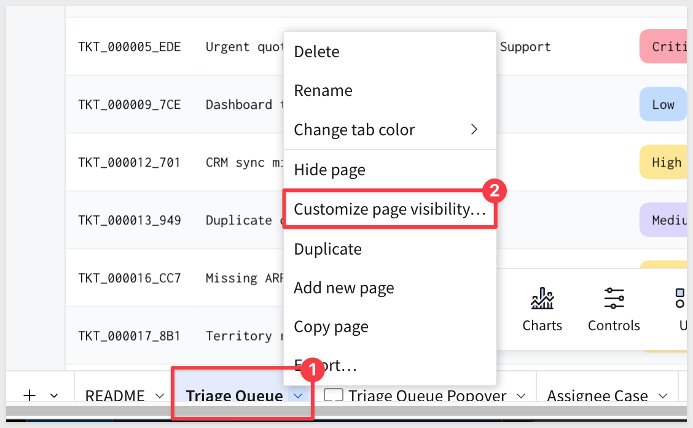

<aside class="positive">
<strong>NOTE:</strong><br> Page visibility keeps the requester experience clean — requesters see only the User Tickets page, while SLA data, urgency scores, and triage decisions remain internal.
</aside>

### Adapt Categories and Priorities

The **Categories**, **Priorities**, and **Roles** input tables on the Data page are the configuration surfaces for customizing the app to your team's taxonomy. To change the ticket categories from Sales and RevOps defaults to IT or HR categories:

1. Open the workbook in `Edit` mode
2. Navigate to the `Data` page
3. Add, edit, or delete rows in the **Categories** input table to reflect your team's request types
4. Adjust **Priorities** if your team uses different priority names or a different number of tiers
5. Update the **SLA Input Table** with your team's first-response and resolution targets

All dropdowns in the Triage Queue's triage decision panel pull from these tables, so changes take effect immediately without any formula edits.

### Update AI Prompts

The **AI Ticketing Routing Prompt** and **Resolved Ticket AI Prompt** on the Data page can be edited to reflect your team's context. For an IT help desk, the routing prompt might emphasize system criticality and outage risk; for an HR team, it might focus on employee impact and compliance deadlines.

<aside class="negative">
<strong>NOTE:</strong><br> Keep output formats intact when editing prompts. The routing prompt must return valid JSON with the exact field names the Action expects — changing field names or types breaks the write-back to the Tickets input table. The resolution prompt must return plain text; the text element reads it directly. Either way, structural changes to output format require matching formula updates.
</aside>

### Connect to Your User Data

Nexus sources its **Users** table from a warehouse connection. In the template, this table contains sample user data. To connect your own user directory:

1. In Edit mode, navigate to the Data page and select the **Users** table
2. Update the source connection to point to your user or identity table
3. Confirm that the required columns are present — `user_id`, display name, and role are the minimum needed for the requester/assignee filters to work

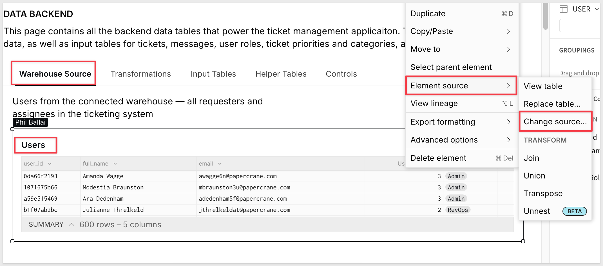

Once the user table is updated, the Requesters and Assignees filtered views update automatically, and the dropdown controls on Triage Queue and Assignee Case reflect your actual team.


<!-- END OF SECTION-->

## What We've Covered
Duration: 3

The Ticket Management App Template demonstrates how Sigma's native features — input tables, formula-driven SLA monitoring, Sigma Actions, Sigma Agents, and multi-role workbook design — can be composed into a full service request system without external tools or custom application code.

The three-audience layout separates concerns cleanly: requesters interact only with the submission form and their own ticket thread; coordinators work through a structured triage queue with AI-assisted classification; and agents handle cases from a focused workspace with full conversation context, live SLA timers, and an AI assistant scoped to the ticket. Each view reads from the same shared data layer but surfaces only what's relevant to that role.

The SLA engine is worth reusing. A single input table keyed by priority and category makes SLA targets configurable without formula changes — the same pattern applies to any workflow where different request types warrant different response expectations. Pair it with `DateDiff()` and business-hours-aware calculations, and you get a real-time breach indicator that reflects actual working time rather than raw elapsed minutes.

**Additional Resource Links**

[Blog](https://www.sigmacomputing.com/blog/)<br>
[Community](https://community.sigmacomputing.com/)<br>
[Help Center](https://help.sigmacomputing.com/hc/en-us)<br>
[QuickStarts](https://quickstarts.sigmacomputing.com/)<br>

Be sure to check out all the latest developments at [Sigma's First Friday Feature page!](https://quickstarts.sigmacomputing.com/firstfridayfeatures/)
<br>

[](https://twitter.com/sigmacomputing)&emsp;
[](https://www.linkedin.com/company/sigmacomputing)&emsp;
[](https://www.facebook.com/sigmacomputing)


<!-- END OF SECTION-->
