author: pballai
id: tables_fan_traps
summary: tables_fan_traps
categories: tables
environments: web
status: published
feedback link: https://github.com/sigmacomputing/sigmaquickstarts/issues
tags: default
lastUpdated: 2025-04-01

# Resolving The Fan Trap with Sigma and Snowflake UDF

## Overview 
Duration: 5 

When designing relational databases, improper relationships between tables can lead to incorrect query results. A common pitfall in data modeling is the `Fan Trap`. Understanding how fan traps occur and how to prevent them ensures accurate data retrieval and reporting.

A fan trap occurs when a one-to-many relationship is followed by another one-to-many relationship, leading to potential overcounting of values in queries.

In this QuickStart, we will explore a fan trap use case and one way to solve it in Sigma.

<aside class="positive">
<strong>IMPORTANT:</strong><br> Some screens in Sigma may appear slightly different from those shown in QuickStarts. This is because Sigma is continuously adding and enhancing functionality. Rest assured, Sigma’s intuitive interface ensures that any differences will not prevent you from successfully completing any QuickStart.
</aside>

For more information on Sigma's product release strategy, see [Sigma product releases.](https://help.sigmacomputing.com/docs/sigma-product-releases)

If something is not working as you expect, here is how to [contact Sigma support.](https://help.sigmacomputing.com/docs/sigma-support)

### Target Audience
The typical audience for this QuickStart includes users of Excel, common Business Intelligence or Reporting tools, and semi-technical users who want to try out or learn Sigma.

<aside class="negative">
<strong>NOTE:</strong><br> Some familiarity with Sigma is assumed. Not all steps will be shown as the basics are assumed to be understood.
</aside>

### Prerequisites

<ul>
  <li>A computer with a current browser. It does not matter which browser you want to use.</li>
  <li>Access to a Sigma environment. A trial is fine.</li>
  <li>Admin access to a Snowflake environment. A trial is fine.</li>
 </ul>

<aside class="positive">
<strong>IMPORTANT:</strong><br> Sigma recommends using non-production resources when completing QuickStarts.
</aside>

<button>[Sigma Free Trial](https://www.sigmacomputing.com/free-trial/)</button>

<aside class="negative">
<strong>IMPORTANT:</strong><br> Some features may carry the "Beta" tag. Beta features are subject to quick, iterative changes. As a result, the latest product version may differ from the contents of this document.
</aside>
 


## Data Modeling
Duration: 5

For this use case, we will use three small CSV files to create a data model in Sigma. This will allow us to see how a fan trap is created and resolved. 

This sample data can be used to derive reports and metrics related to baseball games, attendance, food sales, and so on.

The specific metrics we are after include an accurate accounting of sales per area, broken down by product line, and the sales per fan (attendee) for each product line.

<button>[Download the sample files](https://sigma-quickstarts-main.s3.us-west-1.amazonaws.com/csv/fan_trap.zip)</button>

After downloading, extract the files from `fan_trap.zip` to a known location on your computer. 

### Create a new data model
In Sigma, click `Create new` and select `Data Model:

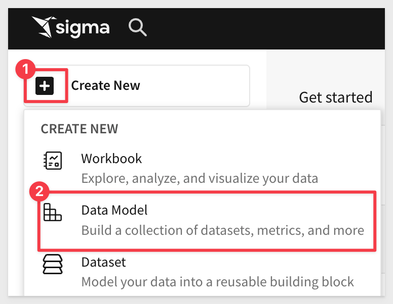

Select `Data` and then `Table` from the `Element bar`:

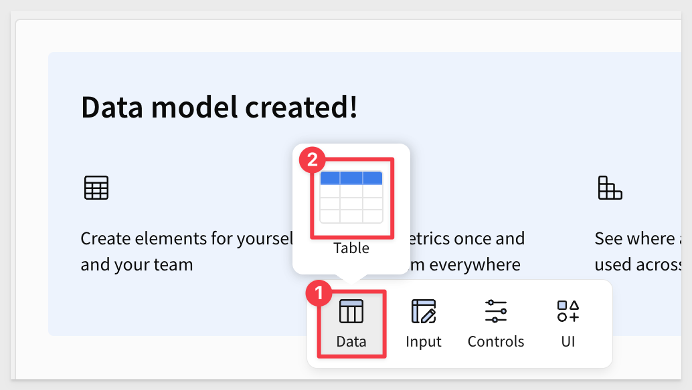

Click `Select source` > `CSV`:

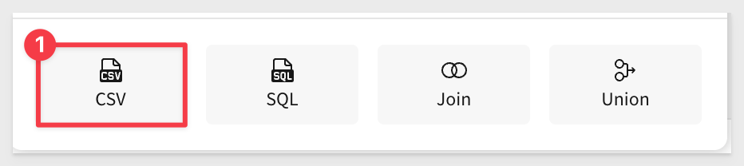

<aside class="negative">
<strong>NOTE:</strong><br> We will need to create a Snowflake custom function later, so access to a Snowflake account with ACCOUNTADMIN is required. A trial account can provide this if you don't already have a Snowflake account with ACCOUNTADMIN.
</aside>

For more information, see [Connect to Snowflake](https://help.sigmacomputing.com/docs/connect-to-snowflake)

Drag and drop the `events.csv` file onto the `Upload CSV` page (or use the browse button). Use **your Snowflake connection**; `ACCOUNTADMIN` rights is required. 

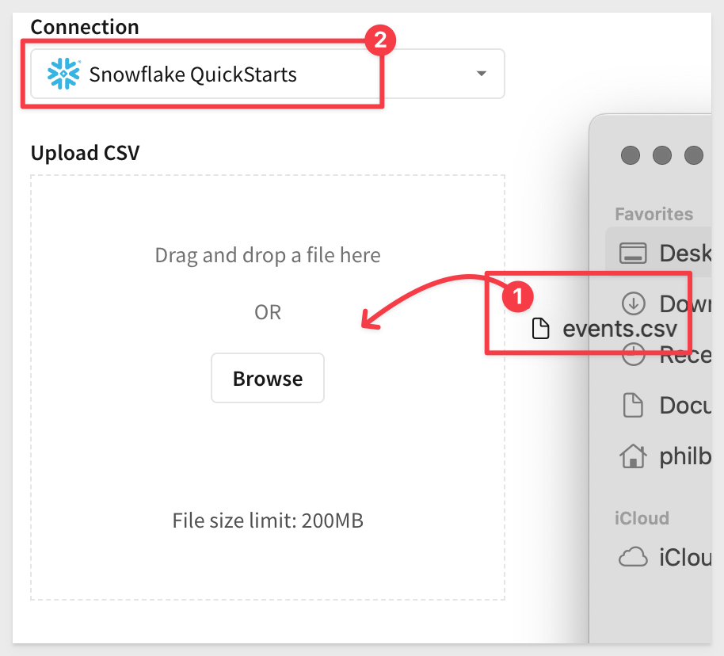

Once imported, Sigma will display the details for this CSV:

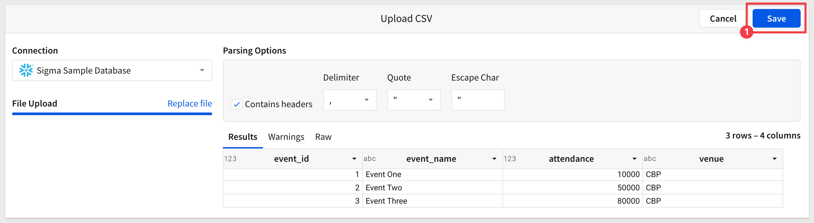

Click `Save`.

We now have one table on our page, with four columns containing information related to events:

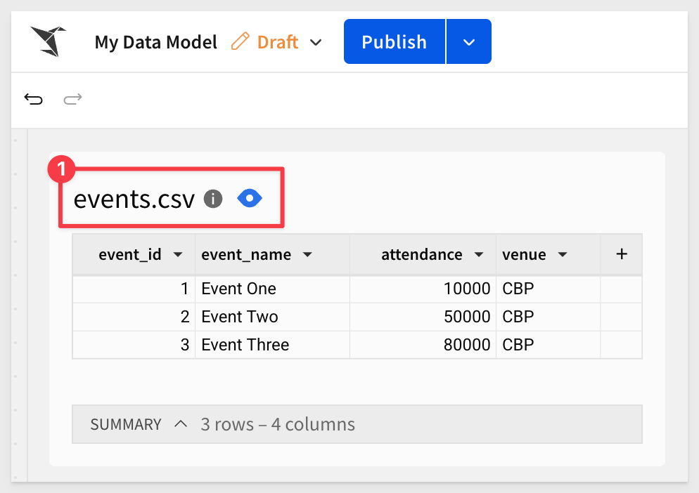

Repeat the same steps for the `order header.csv` and `order details.csv` files. Once completed, the page should look like this (after a little rearranging just to make it more readable):

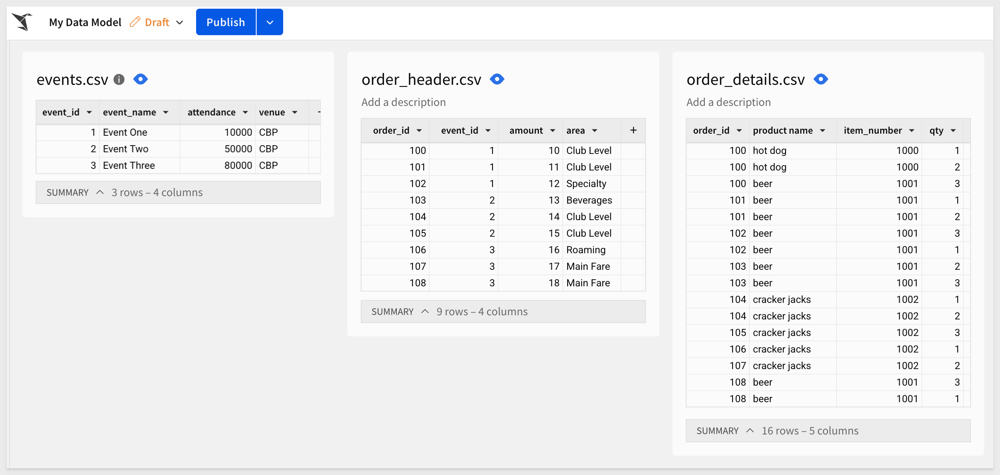

Save the data model as `Fan Trap Data Model` and click `Publish`.


<!-- END OF SECTION-->

## How the Fan Trap Happens
Duration: 5

In our sample data, the fan trap may occur because of the relationships between the tables:

**1:** events (One) → order_header (Many)
- Each event can have multiple orders.
- The amount field in order_header represents total revenue per order.

**1:** order_header (One) → order_details (Many)
- Each order contains multiple products.
- order_details breaks down the order into individual items with quantity and price.

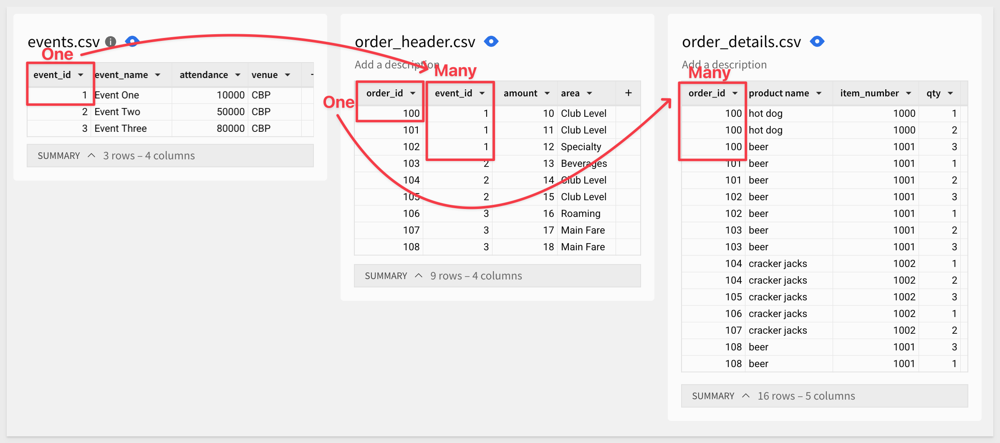

Let's join the tables and see what happens.

### Join the tables
Add a new table using `Data` > `Table` from the `Element bar.`

Select `Elements` and the `events.csv`. We will take all the columns; click `Select`:

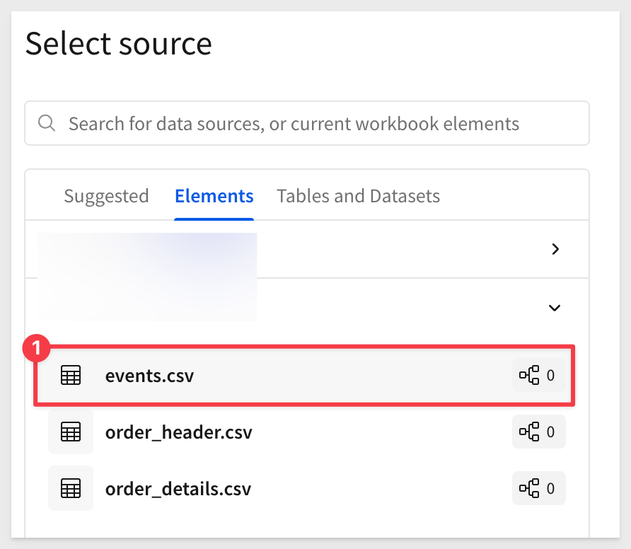

Once the copy of the `Events` table is added to the page, select `Element source` > `Join` from its menu:

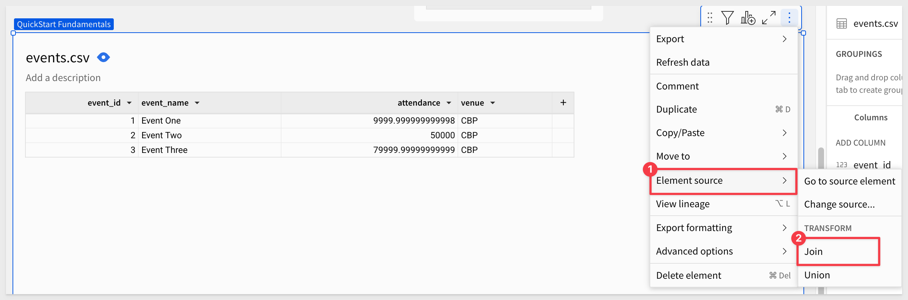

Again, select `Elements` and the `order_header.csv` file. Click `Select`.

Sigma should have created the correct join for us. If not, adjust as shown:

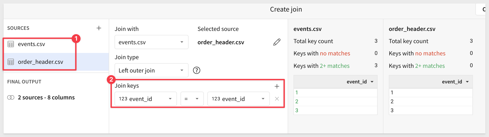

Click `Preview output`. Sigma shows us the lineage for the join, and we can also adjust which columns are selected (we will take them all):

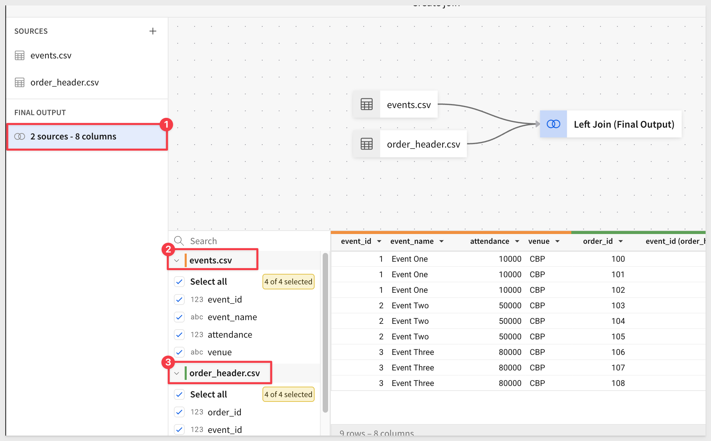

Click `Done`. We now have a joined table called `events.csv + 1`.

### Editing a join
Let's join the `order_details` table to this table. The process is the same, except this time, we will edit an existing join:

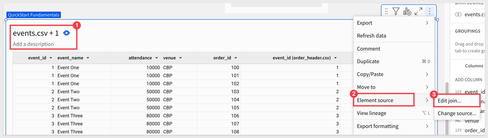

In the `Create join` UI, click the `+` icon to add another table, this time selecting `order_details.csv` from `Elements`. 

Change the `Join with` to `order_header.csv`:

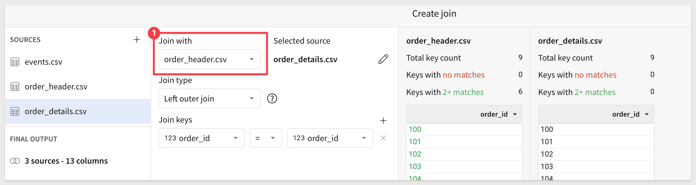

Click `Preview output`.

The lineage should look like this:

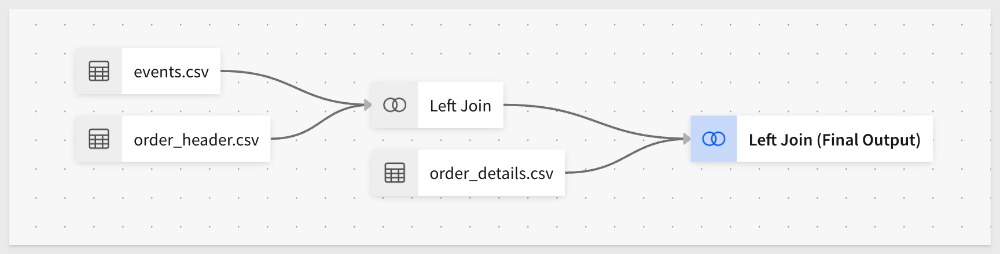

Our joined table is now named `events.csv + 2`. 

After some column formatting, hiding two columns and reordering, it looks like this:

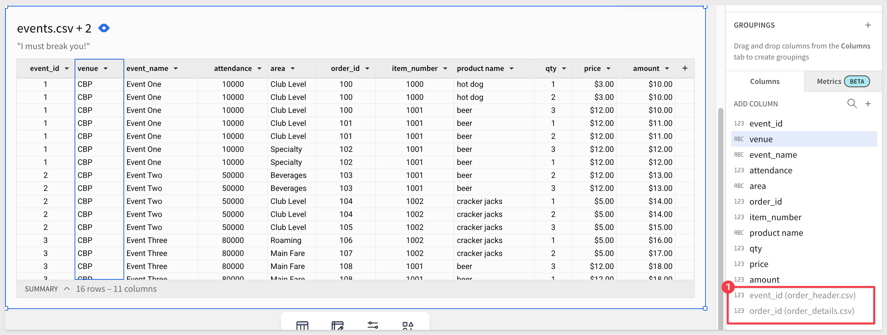

<aside class="negative">
<strong>NOTE:</strong><br> The formatting is a "nice to have" in data models as it improves readability. 
</aside>

We have created a simple example of a fan trap.

Click `Publish`.


<!-- END OF SECTION-->

## What happened
Duration: 5

To make this easier to spot, we can filter the `events.csv + 2` table to show only `order_id` = `100`:

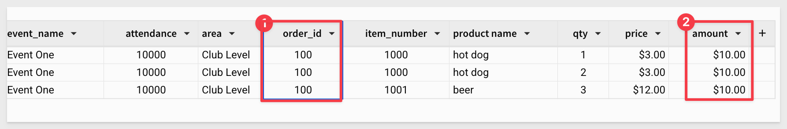

The `amount` column containing `10` for all rows, is clearly suspicious, especially given that it does not make sense if the calculation should be...
```code
qty * price 
```

... or represent revenue. But we did not have a revenue column to use in the sample data either.

If we filter the `order_details.csv` table for `order_id` = `100` we can see that the data looks fine:

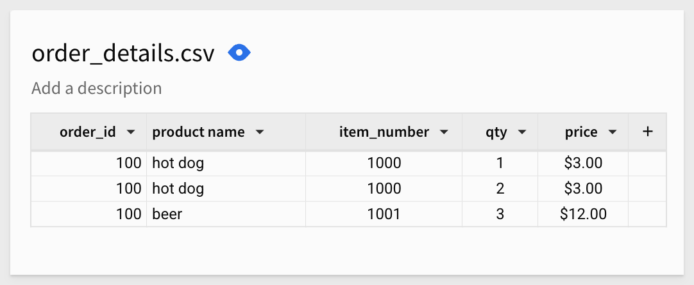


However, if we filter the `order_header.csv` table for `order_id` = `100` we can see that the `amount` is `10` and that is the source of our fan trap issue:

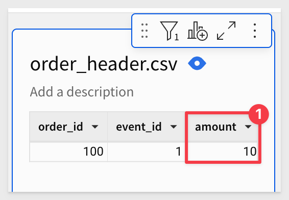

### What Went Wrong in the Join?
When we joined `order_header` to `order_details`, we introduced a one-to-many relationship. 

Each order in `order_header` can have multiple related products in `order_details`. 

This causes the amount from `order_header` to be duplicated for every product in the order.

### How This Affects the Data
When joined with `order_details`, each product row inherits the same total amount, which makes it appear that the revenue is much higher than it actually is.

For example, if an order’s total amount is $10.00, and that order has three products, the amount appears three times in the joined data. So when we sum the amount column, we incorrectly get:
```code
$10 + $10 + $10 = $30
```

But the correct total revenue should be calculated as:
```code
SUM(qty * price) per order
```

...not a repeated sum of the already-totaled amount.

### Adjust table visibility and filtering
First, remove the three filters set in the last section.

We want other users to only see the `events.csv + 2` table when using this data model. 

This is really simple to do; just click the `eye` icon next to each table's name to disable visibility to other users.

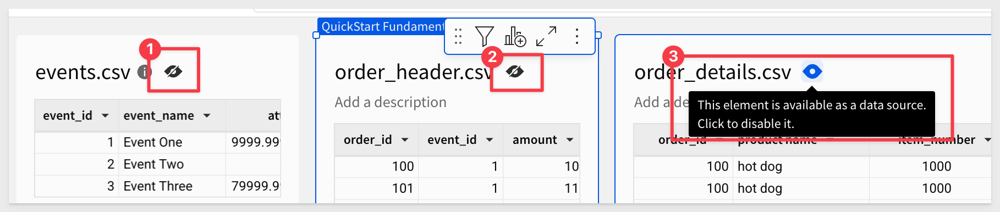

Sigma may warn you; accept that to disable all three and click `Publish`.


<!-- END OF SECTION-->

## Use the Data Model
Duration: 5

Return to the homepage and create a new workbook. 

Add a new `Pivot` from the `Element bar` and select the `Fan Trap Data Model` from the list of available data models. Since it was just created, it should be at the top of the list, but we can also search for it:

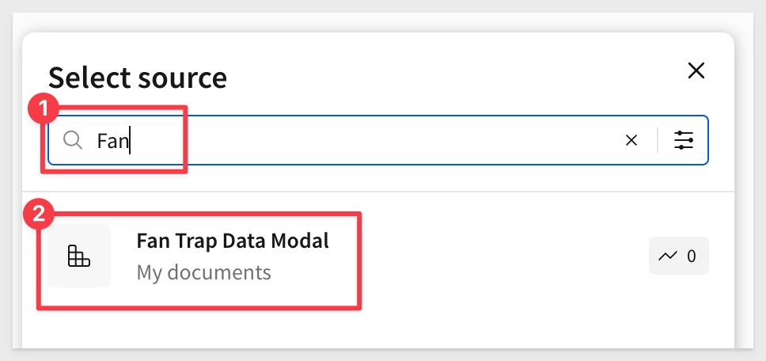

Because table visibility is disabled for the three imported CSV tables, they do not appear in the list:

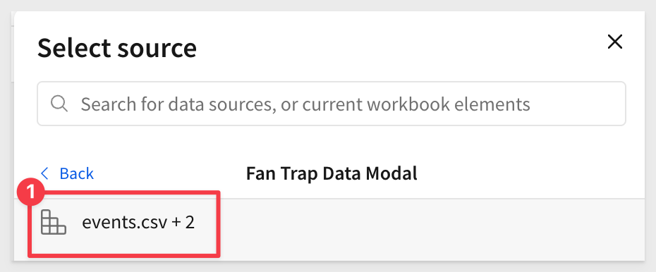

Select the `events.csv + 2` table. We now have a pivot to configure.

Set the pivot configuration as shown:

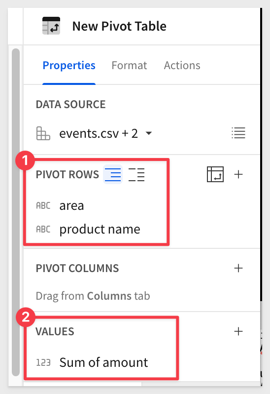

Now, we can see that the `Total` shows `$214` but if we add up all the `Sum of amount` rows, we get a total of `428`.

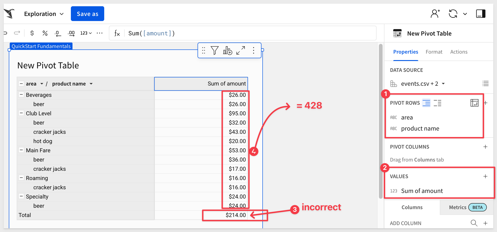

This is how a fan trap can cause real problems, as the issue propagates into downstream reports.

`Save` the workbook as `Fan Trap QuickStart`.


<!-- END OF SECTION-->

## Custom Functions 
Duration: 5

We could just resolve this in our data model or workbook, but instead, let's use a solution that is reusable.

### Create the Snowflake function
Log into a Snowflake instance with ACCOUNTADMIN permission.

Open a new `SQL worksheet` and run the following commented script:
```code
-- This will work in Snowflake trials. Adjust for your environment as required.
USE DATABASE SNOWFLAKE_SAMPLE_DATA;
USE SCHEMA TPCH_SF1;

CREATE DATABASE IF NOT EXISTS SIGMA_QUICKSTARTS;
USE DATABASE SIGMA_QUICKSTARTS;
CREATE SCHEMA IF NOT EXISTS CUSTOM_FUNCTIONS;
USE SCHEMA CUSTOM_FUNCTIONS;

------------------------------------------------------------
-- SUM_DISTINCT as AGGREGATE FUNCTION
-- Purpose: Sum values only once per unique key (e.g., order_id)
-- Useful for resolving fan traps where values would otherwise be duplicated in joins.
------------------------------------------------------------
CREATE OR REPLACE AGGREGATE FUNCTION CUSTOM_FUNCTIONS.SumDistinctAgg(id STRING, val FLOAT)
RETURNS FLOAT
LANGUAGE PYTHON
RUNTIME_VERSION=3.9
HANDLER = 'SumDistinct'
AS $$
# Define the class that Snowflake will use to process the aggregation
class SumDistinct:

  # Constructor: initialize a dictionary to store unique key-value pairs
  def __init__(self):
    self._values = {}

  # This exposes the current aggregate state (our dictionary) to Snowflake
  @property
  def aggregate_state(self):
    return self._values

  # Called for each row: store the value if both key and value are not None
  # Overwrites previous value if the same key appears again
  def accumulate(self, id, val):
    if id is None or val is None:
        return
    self._values[id] = val

  # Called when combining results from parallel executions (e.g., across partitions)
  # Merges dictionaries by updating keys with new ones (no deduplication needed here)
  def merge(self, other_values):
    if other_values:
        self._values.update(other_values)

  # Called at the end of aggregation: returns the final sum of all distinct values
  def finish(self):
    return sum(self._values.values()) if self._values else 0.0
$$;

GRANT USAGE ON DATABASE SIGMA_QUICKSTARTS TO ROLE ACCOUNTADMIN;
GRANT USAGE ON SCHEMA SIGMA_QUICKSTARTS.CUSTOM_FUNCTIONS TO ROLE ACCOUNTADMIN;
GRANT USAGE ON FUNCTION SIGMA_QUICKSTARTS.CUSTOM_FUNCTIONS.SUMDISTINCTAGG(STRING, FLOAT) TO ROLE ACCOUNTADMIN;

SHOW USER FUNCTIONS IN SCHEMA CUSTOM_FUNCTIONS;
```

Once complete, the new function will be listed:

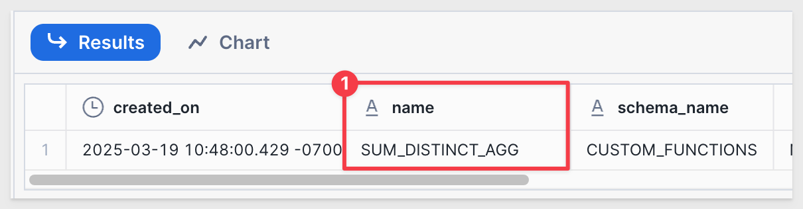<br>

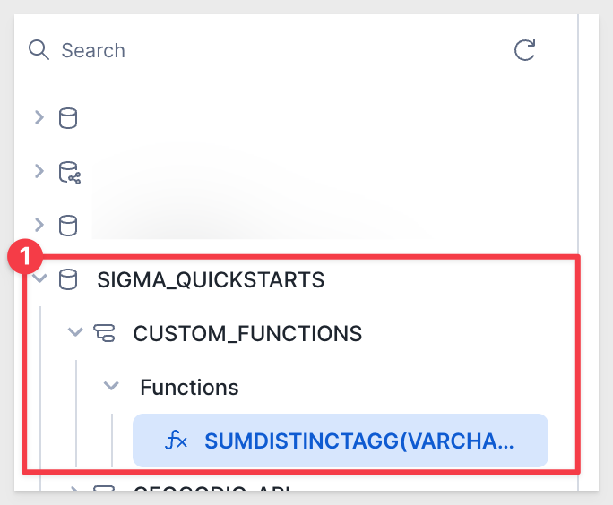

This Snowflake script:

- Prevents double counting by ensuring each id only contributes one distinct value.
- Handles large datasets efficiently using Python dictionaries.
- Works with Snowflake's distributed processing (via merge).
- Final result is a deduplicated sum of all values.

<aside class="positive"> <strong>NOTE:</strong><br> The version of the `SumDistinctAgg` function shown here is intentionally written for clarity and readability. It has not been performance-optimized so that the logic is easier to understand. For high-volume production use, small changes—such as skipping duplicate keys or using Python `__slots__`—can improve performance. 
</aside>

### Sigma custom function
In Sigma, navigate to `Administration` > `General Settings` and scroll to the bottom to find `Custom Functions`. Click `Add`:

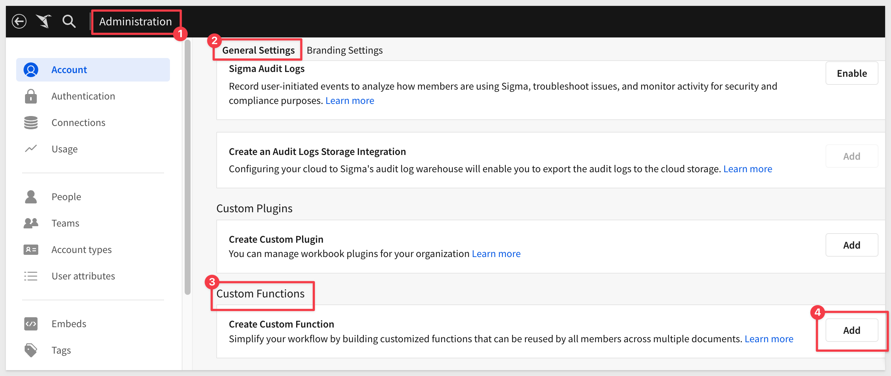

Configure the new custom function as:

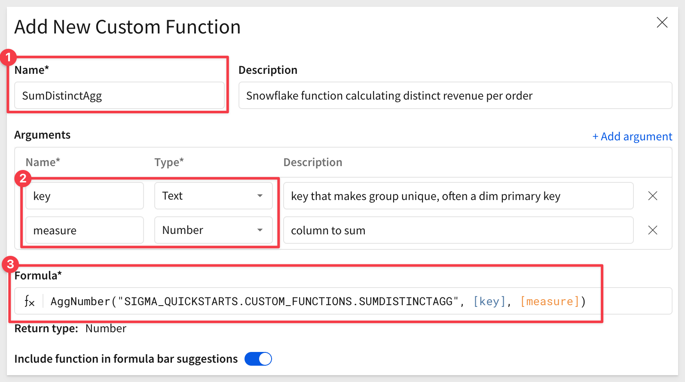

Here are the values to save typing:
```code
Name:        SumDistinctAgg
key          key that makes group unique, often a dim primary key
measure      column to sum
Formula:     AggNumber("SIGMA_QUICKSTARTS.CUSTOM_FUNCTIONS.SUMDISTINCTAGG", [key], [measure])  
```

In the formula, we are taking advantage of Sigma's [AggNumber](https://help.sigmacomputing.com/docs/aggnumber) function. 

The `AggNumber` function calls our `SUMDISTINCTAGG` warehouse aggregate function, passing in the `key` and `measure` values.

Click `Save`.


<!-- END OF SECTION-->

## Add Custom Function to Data Model
Duration: 5 min

We want the data model to be the accurate source of information for our use case. With that in mind, we want to add a metric to the data model and not the workbook.

Open the `Fan Trap Data Model`, click `edit` and then click on the `events.csv + 2` table. 

Click `Metrics` in the `Element panel` and click `+` to add a new metric:

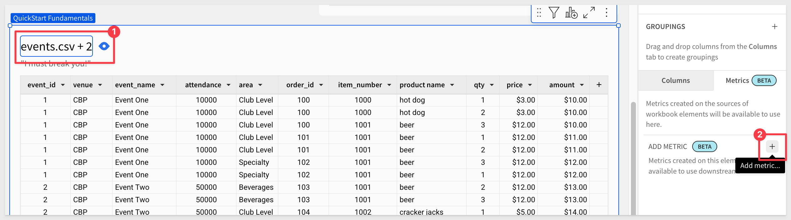

Configure the metric as shown.

Here are the values to save typing:
```code
Name:        Order Amount
Formula:     SumDistinctAgg([order_id], [amount])
```


Sigma is warning us about a problem in our formula.

Close the formula editor. A quick check of the `order_id` column reveals that it is a `NUMBER` datatype. Our function is expecting `TEXT` for the `key`, so this is why the formula warning:

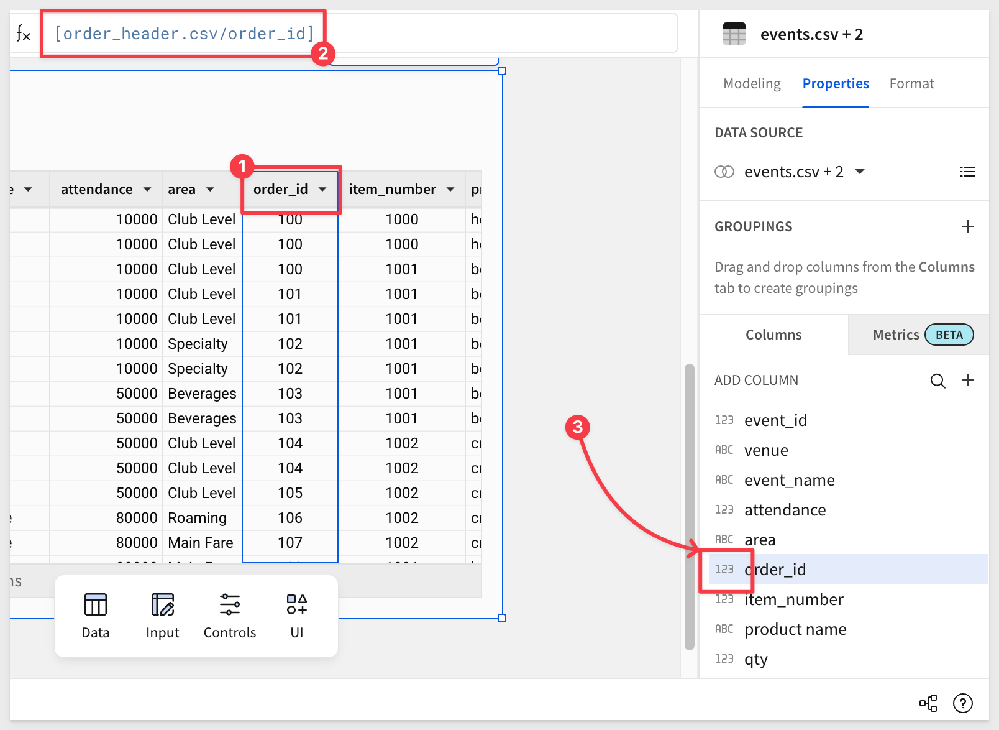

<aside class="negative">
<strong>NOTE:</strong><br> Using the incorrect data type is a really common problem. Fortunately, fixing them in Sigma is really simple.
</aside>

Open the `order_id` column menu and select `Transform` > `Convert to Text`:

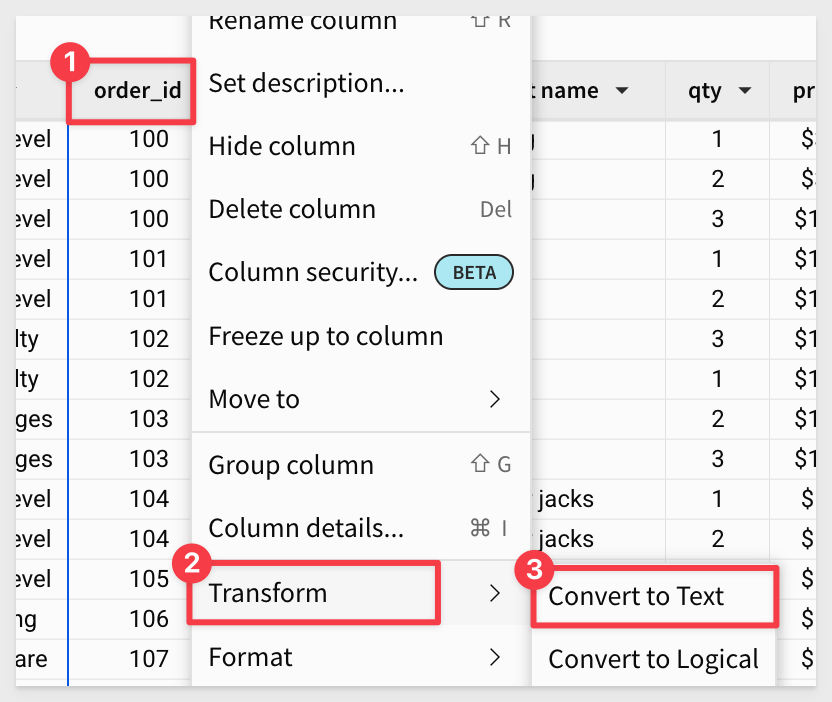

Sigma applies a text function to the `order_id` column. To make the values cleaner, we can also trim any trailing zeros:

```code
Trim(Text([order_header.csv/order_id]))
```

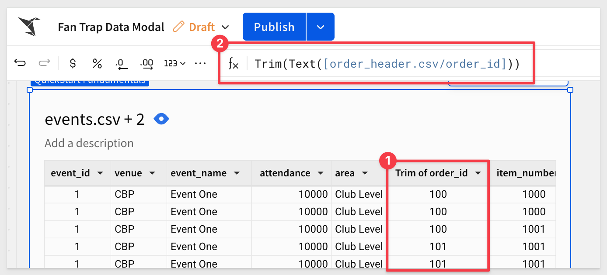

Rename the `Trim of order_id` back to `order_id`.

With that solved, go ahead and add the metric to the `events.csv + 2` table as before:

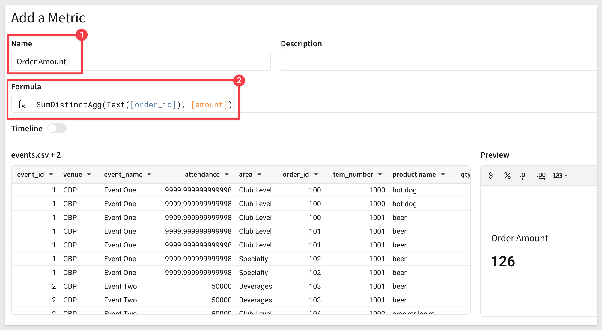

Make sure to click `Save` once the metric is configured.

<aside class="positive">
<strong>IMPORTANT:</strong><br> The name used for the metric is what we will reference in the workbook later.
</aside>

Click `Publish`.


<!-- END OF SECTION-->

## Add Metric to Pivot Table
Duration: 5 min

Return to the `Fan Trap QuickStart` workbook and click `edit`.

We can see the `Order Amount` metric listed. 

<aside class="negative">
<strong>NOTE:</strong><br> You may need to refresh the page if you had multiple browser tabs open.
</aside>

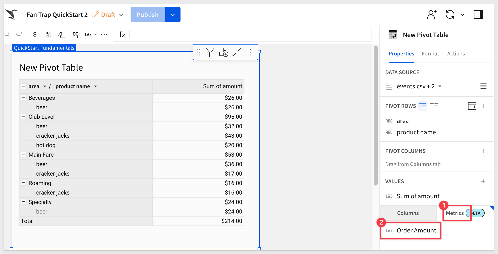

Add the `Order Amount` metric to the `VALUES` group. After some column formatting for currency, we can clearly see the differences between the two columns.

`Sum of Amount` is incorrect while `Order Amount` is correct and the fan trap is resolved:

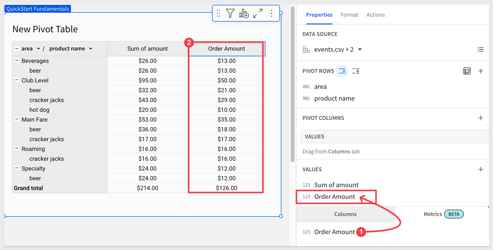

Now that we understand how to use custom functions to resolve a fan trap, we can apply this same logic to order important metrics.

For example, suppose we want to calculate revenue per attendee?

We can create another metric, reusing our existing custom function and simply adjusting for different key/measure values, columns and calculation:

```code
SumDistinctAgg(Text([order_id]), [amount]) / SumDistinctAgg(Text([event_id]), [attendance])
```

This formula correctly calculates revenue per attendee by dividing:
- Total order amount (ensuring no duplication from multiple products per order).
- Total event attendance (ensuring no duplication from multiple orders per event).

Using this formula avoids issues where multiple joins would otherwise inflate revenue per person. It also allows us to reuse the warehouse function via a Sigma custom function.

To be complete, the result looks like this:

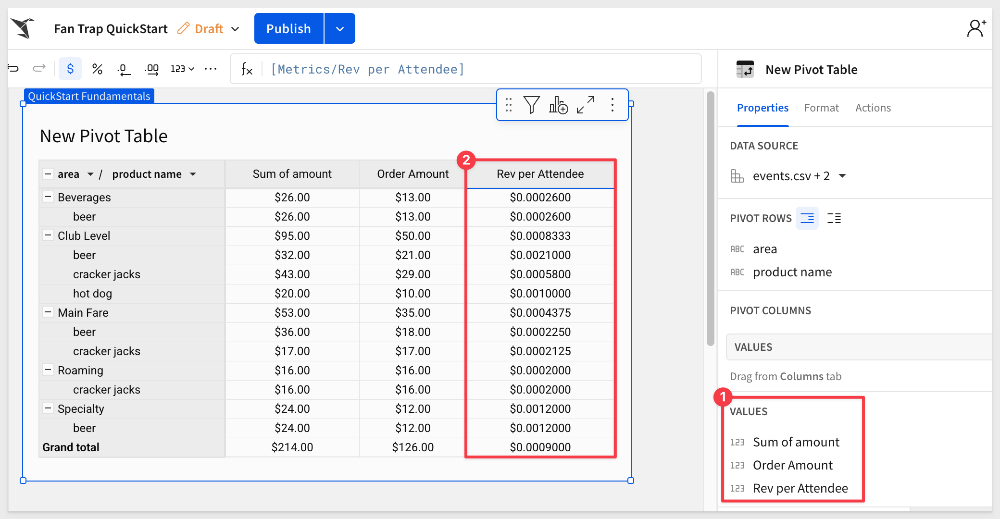


<!-- END OF SECTION-->

## Performance optimizations
Duration: 5

The version of the `SumDistinctAgg` function used earlier this QuickStart was intentionally written for clarity and ease of understanding. It works well for learning and smaller datasets.

For advanced users or production workloads involving large datasets, a performance-optimized version of the function can improve execution time by reducing unnecessary overwrites and memory usage.

In our small-scale tests, applying the optimized version to the same sample data reduced the execution time from 11 seconds to 9.4 seconds, a modest (@15%) but measurable improvement on a very small dataset.

Your results may vary based on:
- The size of your data
- Number of unique keys
- Snowflake warehouse size and configuration

This alternative version is provided as-is, with no guarantees, but may help in high-volume use cases. There may be additional ways to achieve optimal performance as well.

<aside class="positive"> <strong>NOTE:</strong><br> The optimized version changes behavior slightly: it keeps the <em>first</em> value per unique key instead of the last. This usually makes no difference for sum-based calculations, but may matter in other use cases. </aside>

```code
CREATE OR REPLACE AGGREGATE FUNCTION CUSTOM_FUNCTIONS.SumDistinctAgg(
  id STRING, val FLOAT
)
RETURNS FLOAT
LANGUAGE PYTHON
RUNTIME_VERSION=3.9
HANDLER = 'SumDistinct'
AS $$
class SumDistinct:
  __slots__ = ['_values']

  def __init__(self):
    self._values = {}

  @property
  def aggregate_state(self):
    return self._values

  def accumulate(self, id, val):
    if id is None or val is None:
      return
    if id not in self._values:
      self._values[id] = val

  def merge(self, other_values):
    if other_values:
      for k, v in other_values.items():
        if k not in self._values:
          self._values[k] = v

  def finish(self):
    return sum(self._values.values()) if self._values else 0.0
$$;
```

### What Was Optimized
**1:** Avoided overwriting existing keys in accumulate() by checking if id not in self._values:
- Improves performance by skipping unnecessary updates for duplicate keys.

**2:** Skipped redundant merges in merge() by only adding keys that don’t already exist:
- Reduces memory churn and speeds up distributed execution.

**3:** Added __slots__ declaration in the class:
- Slightly reduces memory overhead for the Python object.

### How we measured
While doing the steps earlier, we clicked the icon (as shown below) to refresh the pivot table:

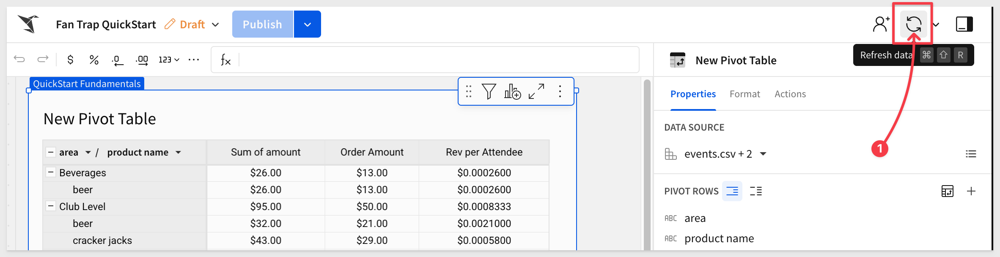

 Then we opened the [query history](https://help.sigmacomputing.com/docs/examine-workbook-queries#query-history-reference) and observed the `Run time` for the most recent query.

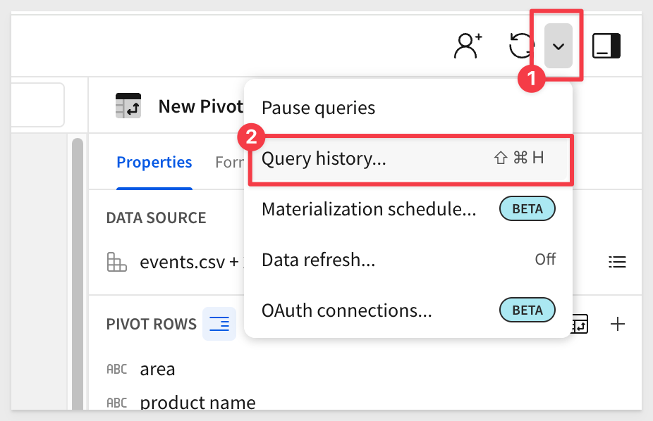<br>

In our case, it was 11 seconds:

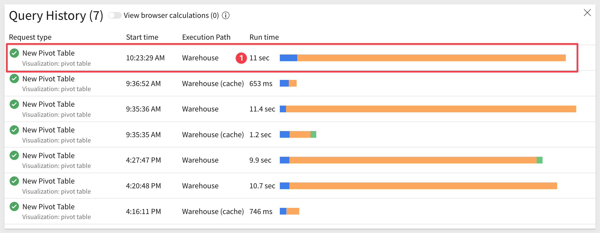<br>

Next we ran the adjusted Snowflake code provided above (in Snowflake), which uses the same function name.

Then we refreshed the browser tab and repeated the pivot refresh / query history test and observed the results:

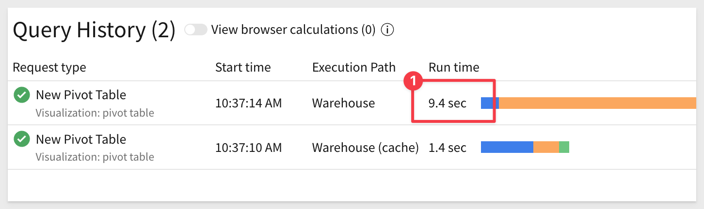

<aside class="positive"> <strong>Keep in mind:</strong><br> Performance improvements observed in this QuickStart were based on a small sample dataset. In real-world environments with larger volumes, results may vary based on data distribution, warehouse size, and other system factors. Always benchmark with your own data before adopting optimization strategies. </aside>


<!-- END OF SECTION-->


## What we've covered
Duration: 5

In this QuickStart, we explored how a fan trap can lead to inflated metrics due to unintended duplication in one-to-many joins. We demonstrated how to identify the issue, and then resolved it using a reusable Snowflake UDAF integrated into Sigma as a custom function. 

This approach ensures accurate aggregation across complex joins and provides a repeatable solution for other metrics as well. With these tools, you're now equipped to prevent fan traps and build more reliable data models in Sigma.

**Additional Resource Links**

[Blog](https://www.sigmacomputing.com/blog/)<br>
[Community](https://community.sigmacomputing.com/)<br>
[Help Center](https://help.sigmacomputing.com/hc/en-us)<br>
[QuickStarts](https://quickstarts.sigmacomputing.com/)<br>

Be sure to check out all the latest developments at [Sigma's First Friday Feature page!](https://quickstarts.sigmacomputing.com/firstfridayfeatures/)
<br>

[](https://twitter.com/sigmacomputing)&emsp;
[](https://www.linkedin.com/company/sigmacomputing)&emsp;
[](https://www.facebook.com/sigmacomputing)


<!-- END OF WHAT WE COVERED -->
<!-- END OF QUICKSTART -->