author: pballai
id: tables_json_parsing
summary: tables_json_parsing
categories: Tables
environments: web
status: Published
feedback link: https://github.com/sigmacomputing/sigmaquickstarts/issues
tags: default
lastUpdated: 2026-08-22

# Parsing JSON Data in Seconds
<!-- The above name is what appears on the website and is searchable. -->

## Overview 
Duration: 5 

This QuickStart demonstrates how a business user can easily work with columns of data stored in JSON format.

JSON (JavaScript Object Notation) has become a universal standard for data interchange on the web due to its simplicity, readability, and language-independent design.

Whether the data comes from a web API, a file, or a local source, knowing how to parse JSON is essential in modern data applications. Parsing refers to converting a JSON string into a format your analytics tool can understand and manipulate. This allows you to extract values, iterate through arrays, and read key-value pairs from objects.

For many business users, JSON can be frustrating because it typically requires a developer or ETL tool to flatten it into a more familiar columnar format. This adds time and requires technical expertise.

Sigma provides a much better way: you can directly and easily parse JSON inside Sigma, without waiting for developer intervention.

<aside class="positive">
<strong>IMPORTANT:</strong><br> Some screens in Sigma may appear slightly different from those shown in QuickStarts. This is because Sigma is continuously adding and enhancing functionality. Rest assured, Sigma’s intuitive interface ensures that any differences will not prevent you from successfully completing any QuickStart.
</aside>

For more information on Sigma's product release strategy, see [Sigma product releases](https://help.sigmacomputing.com/docs/sigma-product-releases)

If something is not working as you expect, here's how to [contact Sigma support](https://help.sigmacomputing.com/docs/sigma-support)

 ### Target Audience
Anyone who wants to parse JSON data quickly and easily to enable analytics.

### Prerequisites

<ul>
  <li>A computer with a current browser. It does not matter which browser you want to use.</li>
  <li>Access to your Sigma environment.</li>
  <li>Some familiarity with Sigma is assumed. Not all steps will be shown as the basics are assumed to be understood.</li>
</ul>

<aside class="postive">
<strong>IMPORTANT:</strong><br> Sigma recommends that you use non-production resources when doing QuickStarts.
</aside>

<button>[Sigma Free Trial](https://www.sigmacomputing.com/free-trial/)</button>

## Simple JSON Extraction
Duration: 20

Let’s assume we have a sample database that provides a list of all U.S. states, but the data is stored in a single JSON column.

Log in to Sigma and create a new `Workbook` and `Page`.

Rename the workbook `Parsing_JSON_QuickStart` and rename the page `US_Capitals`.

We’ll use a table from the `Sigma Sample Database`.

From the `Element ba`r, add a new `Data` > `Table` to the page:


In the `Source selector`, search for `State_inf` and select `STATE_INFO_JSON` from `FUN` > `USA_NAMES`:


Open the menu for `State Json` column and select `Extract columns...`:


Select all the columns except `STATE_ID` (since that already exists in the data). Click `Confirm`:

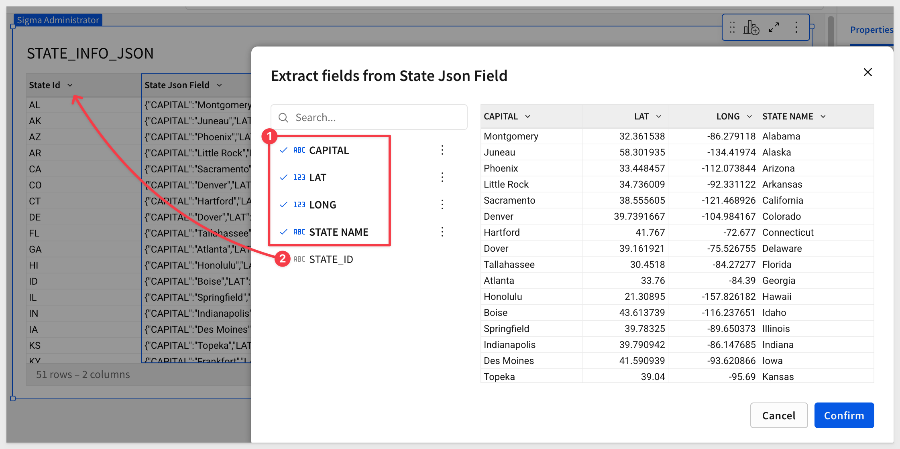

Next, open the menu for the `State Json` column and select `Hide column`.

You now have a clean table that can be used to power a map or support any of the other visualizations Sigma offers.

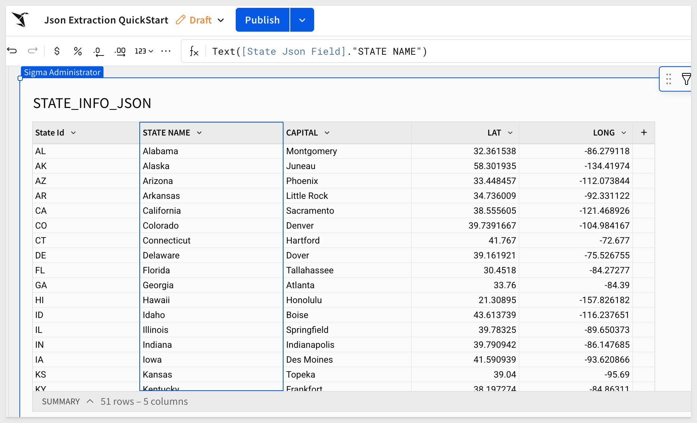 <aside class="positive"> <strong>IMPORTANT:</strong><br> Business users will LOVE being able to do this themselves—and developers will love not having to create extra ETL pipelines for it. </aside>

This exercise was simple, but it shows how easily business users can parse JSON data directly in Sigma—without relying on developers or additional tooling.

Click `Publish`.


<!-- END OF SECTION-->

## Nested JSON
Duration: 5

JSON isn’t always flat. It often contains nested objects (data inside data). That can be intimidating—until you use Sigma’s `Extract columns` wizard.

In this example, we want to identify customers tagged "at_risk" and send them a birthday promotion. But there’s a challenge: an ETL job merged customer details into the sales table as a JSON object—and the birthday is nested inside that object too.

Create a new `Page` in the same workbook and rename it `Nested_JSON`.

Add a new `Table` using the `Sigma Sample Database `and choose `RETAIL` > `PLUGS ELECTRONICS` > `PLUGS_ELECTRONICS_HANDS_ON_LAB_DATA:`

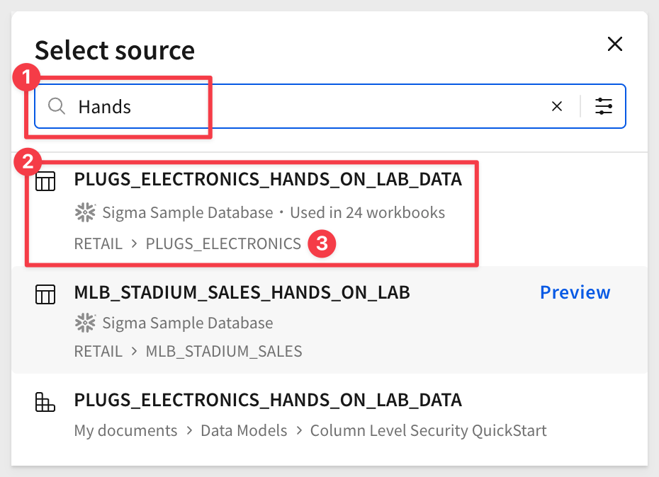

In the `Element panel` on the right side of the page, use `Shift+click` to select all 21 columns, `Hide` them, and leave only the `Cust Json` column visible:

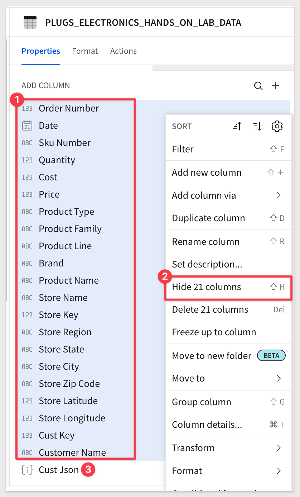

This just makes the page less busy for us.

Following the same workflow as before, open the menu on `Cust Json` and select `Extract columns...`.

In the `Extract fields from Cust Json` modal, choose the top-level fields you want, then expand `LOYALTY_EXTRA` and `BIRTHDAY` to select the nested fields:

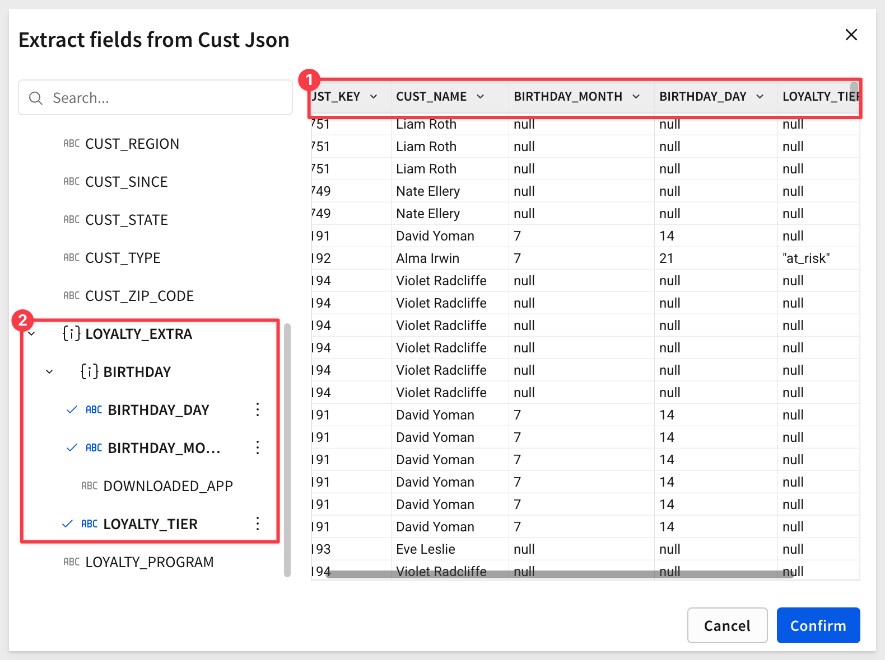

Hide the `Cust Json` column and click `Confirm`.

We can now see the "at_risk" flag in the data—but notice we can’t filter on these extracted columns or use column details. Why not?

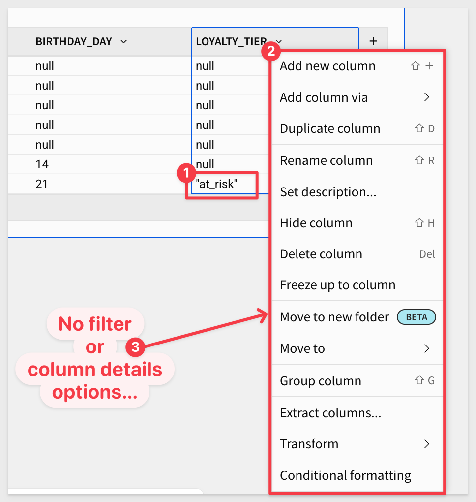 <aside class="positive"> <strong>IMPORTANT:</strong><br> Fields extracted from JSON are still treated as *semi-structured* (Variant). Variants don’t always appear in the filter builder, so you can’t simply select `"= at_risk"` from the UI. </aside>

You can confirm this in the `Element panel` > `Properties` pane, where the datatype is shown:

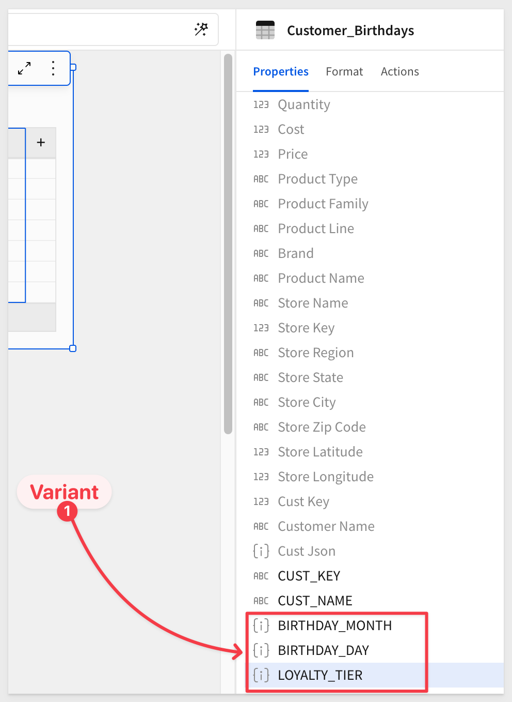

Fortunately, adjusting this is simple in Sigma.

Select the `LOYALTY_TIER` column and set its formula to:
```code
Text([Cust Json].LOYALTY_EXTRA.LOYALTY_TIER) = "at_risk"
```

Now the datatype is converted, and the "at_risk" cells display as True:

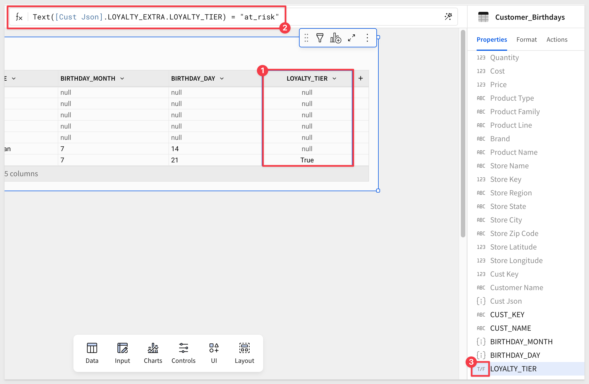

From here, it’s easy to add a filter on `LOYALTY_TIER` to show only `True` cells:

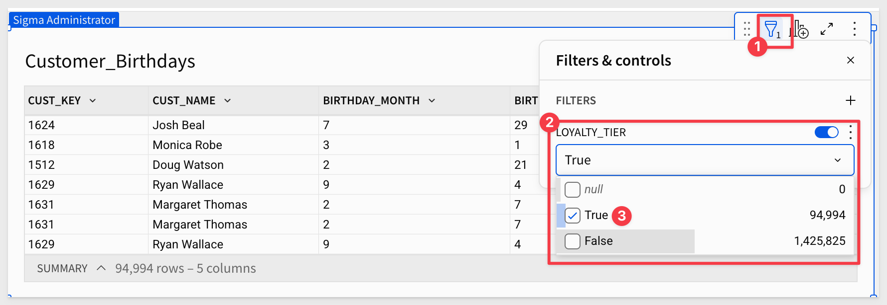

This gives us the list of customers to include in our promotion.

The key takeaway: nested JSON doesn’t block analysis. With Sigma, you can parse it, flatten it, and apply business logic directly—without waiting for an ETL job.


<!-- END OF SECTION-->

## JSON Arrays
Duration: 5

JSON can also contain arrays—lists of values or objects inside the JSON. In our next sample dataset, each customer record may include a children array with one or more child objects, each containing a name and age.

While Sigma’s `Extract columns` wizard makes nested objects simple, arrays require one extra step: formulas that use indexing. Sigma supports zero-based indexing ([0] for the first item, [1] for the second, etc.), allowing you to pull values out of arrays directly.

<button>[Download the Sample Array Data](https://sigma-quickstarts-main.s3.us-west-1.amazonaws.com/csv/json_array.csv)</button>

### Import the Sample CSV
Create a new `Page` in the same workbook and rename it `Array_JSON`.

Add a new `Table` to the page, this time selecting the `CSV` option:

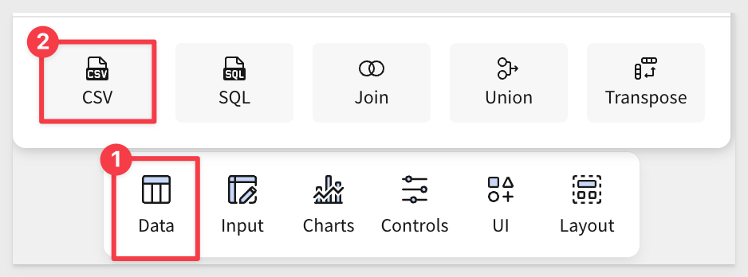

Select the `Sigma Sample Database`.

Browse to the location or drag and drop the `json_array.cs`v file into the `Upload CSV` box:

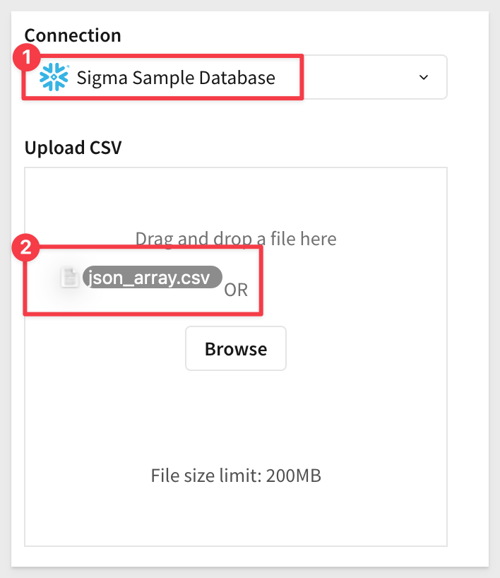

Sigma parses CSV data automatically, but you can review and adjust if needed; click `Save`:

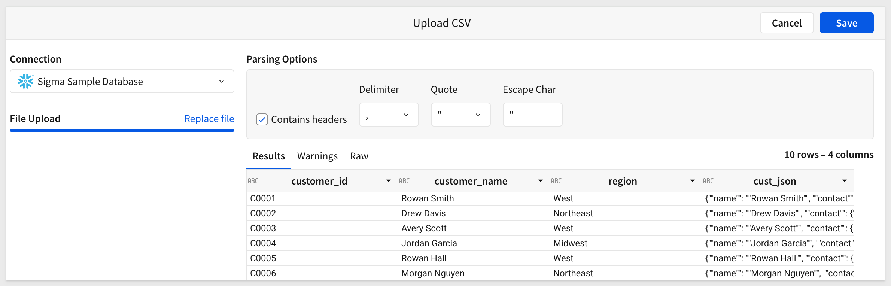

Once loaded, you’ll see a `cust_json` column. Try extracting it—you can’t.

<aside class="positive"> <strong>IMPORTANT:</strong><br> During CSV import, the parser identified the "cust_json" column as text. Extract is only available for columns stored as JSON. We could have fixed this during import but skipped that step.</aside>

No problem: from the `cust_jso`n column menu, select `Transform` > `Convert to JSON`:

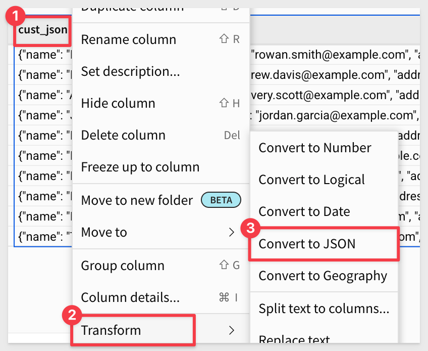

Now the `Extract columns` feature is available.

Expand `cust_json` and select the `name` field, (notice the array data under `children` but don't select them) then click `Confirm:`

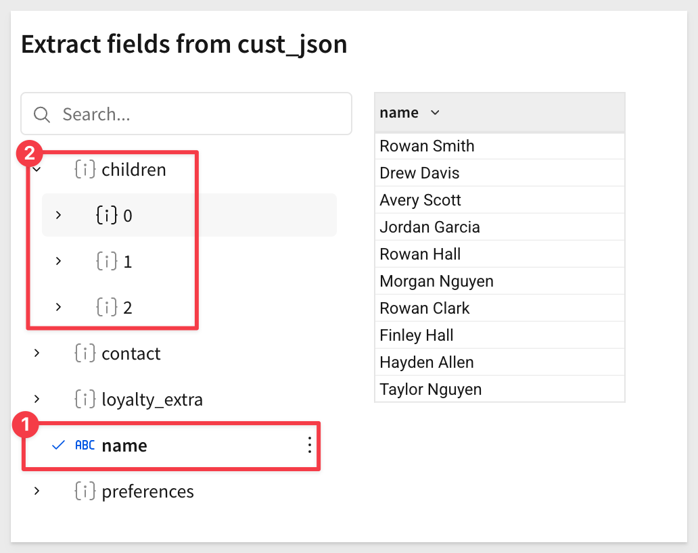

Next, hide a few unnecessary columns to reduce noise:

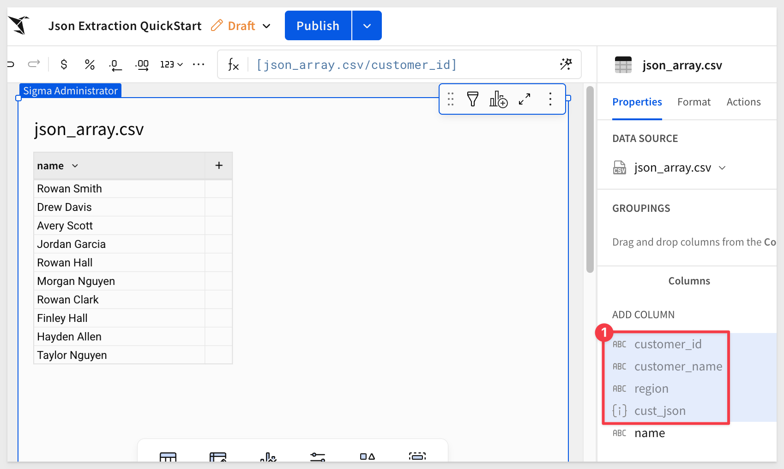

### Create calculated columns for array values

Now let’s use calculated columns to handle the children array.

<aside class="negative"> <strong>NOTE:</strong><br> Use hotkeys to save clicks.  quickly adds a new column. </aside>

Add calculated columns as follows:

Number of Children:
```code
ArrayLength([cust_json].children)
```

**First Child Name:**<br>
```code
Coalesce(Text([cust_json].children[0].name), "")
```

We use Coalesce to replace null values with empty cells when no children exist.

**First Child Age:**<br>
```code
If(ArrayLength([cust_json].children) > 0, Text([cust_json].children[0].age), "")
```

We check if the array has at least one child; otherwise, return an empty cell.

**Second Child Name (optional):**<br>
```code
Coalesce(Text([cust_json].children[1].name), "")
```

The result looks like this:

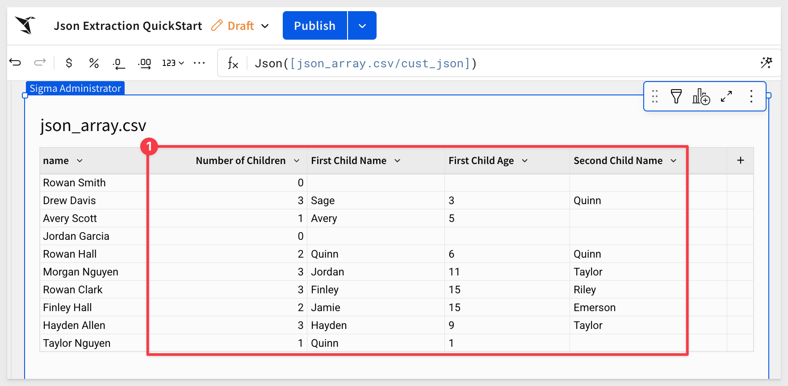


<!-- END OF SECTION-->

## What we've covered
Duration: 5

In this lab, we explored how to work with flat, nested, and array-based JSON using Sigma's intuitive interface. Business users can now extract columns directly from JSON objects, navigate nested fields, and even pull values from arrays—all without needing to rely on or wait for development resources.

This enables faster insights, reduces the dependency on ETL pipelines, and makes previously complex JSON data immediately usable for analytics.

<!-- THE FOLLOWING ADDITIONAL RESOURCES IS REQUIRED AS IS FOR ALL QUICKSTARTS -->
**Additional Resource Links**

Be sure to check out all the latest developments at [Sigma's First Friday Feature page!](https://quickstarts.sigmacomputing.com/firstfridayfeatures/)

[Help Center Home](https://help.sigmacomputing.com)<br>
[Sigma Community](https://community.sigmacomputing.com/)<br>
[Sigma Blog](https://www.sigmacomputing.com/blog/)<br>
<br>

[](https://twitter.com/sigmacomputing)&emsp;
[](https://www.linkedin.com/company/sigmacomputing)&emsp;
[](https://www.facebook.com/sigmacomputing)


<!-- END OF WHAT WE COVERED -->
<!-- END OF QUICKSTART -->
