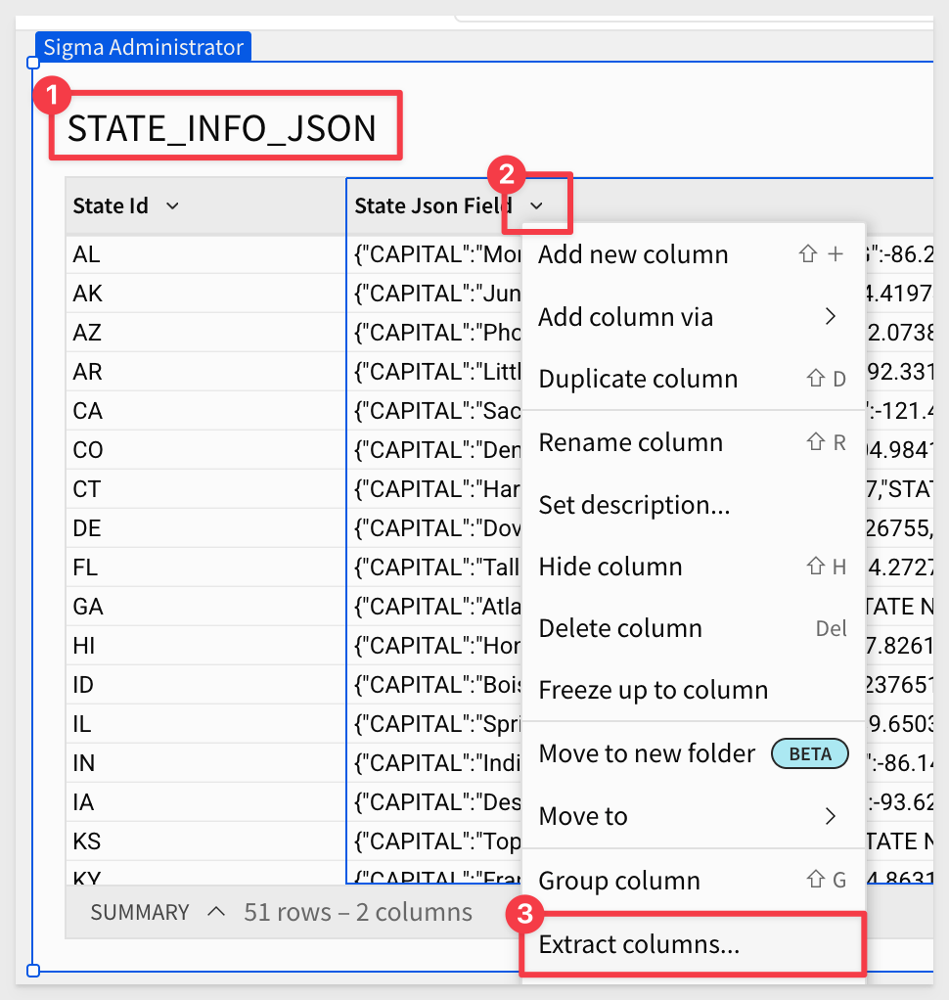

author: pballai
id: tables_json_parsing
summary: tables_json_parsing
categories: Tables
environments: web
status: Published
feedback link: https://github.com/sigmacomputing/sigmaquickstarts/issues
tags: default
lastUpdated: 2023-07-14

# Parsing JSON Data in Seconds
<!-- The above name is what appears on the website and is searchable. -->

## Overview 
Duration: 5 

This QuickStart discusses and demonstrates how a business user can easily handle columns of data that are stored in the JSON format.  

JSON, which stands for JavaScript Object Notation, has become a universally accepted standard for data interchange on the web due to its simplicity, readability, and language-independent nature. 

Whether you're receiving data from a web API, reading from a file, or working with local data, knowing how to parse JSON is crucial in modern software development

Parsing JSON data refers to the process of taking a piece of data (typically a string) in JSON format and converting it into a format that your programming language can understand and manipulate. 

This allows programs to extract values, iterate through arrays, and read key-value pairs from objects. 

Parsing JSON is not something the typical business user tackles and can be a source of frustration when they are presented data in this way. This results in requests to the development team to parse the data into a more comfortable, columnar format prior to making it available to users. This takes some time and must be done using code or other ETL (extract, transform, load) tool the developers have available. 

There is a much better way; using Sigma to directly (and easily) parse the data.

 ### Target Audience
Anyone who is trying to parse JSON data in the fastest way possible, to enable analytics applications.

### Prerequisites

<ul>
  <li>A computer with a current browser. It does not matter which browser you want to use.</li>
  <li>Access to your Sigma environment.</li>
  <li>Some familiarity with Sigma is assumed. Not all steps will be shown as the basics are assumed to be understood.</li>
</ul>

<aside class="postive">
<strong>IMPORTANT:</strong><br> Sigma recommends that you use non-production resources when doing QuickStarts.
</aside>

<button>[Sigma Free Trial](https://www.sigmacomputing.com/free-trial/)</button>
  
### What You’ll Learn
How to use Sigma to parse simple and nested JSON data.

## Map of US State Capitals from JSON
Duration: 20

Let's assume that we got a sample database that provides a list of all the US States, but the data came to us in a single JSON column. 

Login to Sigma and create a new `Workbook` and `Page`. 

Rename the Workbook to `Working with JSON Data` and rename the page to `US Capitals`.

We will use a table from the Sigma Sample Database.

Click to add a new table:


Select `TABLES AND DATASETS`.

 Select the `Sigma Sample Database`.

 Expand the `FUN` schema and then `USA_NAMES`.


Select `STATE_INFO_JSON`.

Only select the `State Json Field` and click the `Select` button:



We now have a table with the single column of Json data. 

**Now comes the awesome part!**

Click the `State Json Field` column's drop arrow and select `Extract Columns`:


We are presented with a list of the column data that Sigma was able to automatically parse from the JSON data. 

Click to select the fields `STATE NAME, CAPITAL, LAT, LONG` and click the `Confirm` button:


<aside class="positive">
<strong>IMPORTANT:</strong><br> Business users will LOVE that they can do this themselves and developers will love that they don't have to add ETL pipelines to handle it either.
</aside>

We don't really need to see the JSON column anymore so hide that.

We now have a clean table that we can use for our map:


Click to add a `Child Element` / `Visualization`:


Configure the new visualization as shown below:


Granted, this exercise was pretty simple, but it should be clear now that parsing JSON data is something any business user of Sigma can confidently do on their own.


<!-- END OF SECTION-->

## Nested JSON
Duration: 5

JSON data is not always "flat" as we saw in the previous example. In fact, it is very common to "nest" data elements inside a JSON file. In this case, the data is structured in a hierarchical manner, with "data inside data".

This can make extraction that much more problematic for a business user.

For example, a non-nested JSON object make look like this:
```JSON
{
  "name": "John",
  "age": 30,
  "city": "New York"
}
```

Where a nested JSON object is presented in a hierarchical format:


In this example, we want to send customers an offer on their birthday, but an ETL job merged their personal information into the sales table as a JSON object, and on top of that, the birthday detail is nested in the JSON object too!

Let's take a look at how Sigma handles this JSON nesting challenge.

Create a new `Page` in the same Workbook and rename it `Nested JSON`.

Create a new `Table` using the `Sigma Sample Database` and choose the `RETAIL` `PLUGS ELECTRONICS` / `PLUGS_ELECTRONICS_HANDS_ON_LAB_DATA` table.

We will only need the columns `Customer Name` and `Cust Json`. Click `Select` when done:


As before, click the drop arrow on the `Cust Json` column and select `Extract columns`.

We want to select the following columns to support our use case:


<aside class="negative">
<strong>NOTE:</strong><br> Sigma made it simple to work with nested JSON objects in the extraction workflow so that the user was not exposed to any real complexity.
</aside>

Hide the `Cust Json` column as we don't need to see that anymore.

A point to understand is that the parsed columns can be filtered except for the nested columns. If we want to filter those (BIRTHDAY_MONTH and BIRTHDAY_DAY), we need to cast them as text so that we can then filter out the rows with no record of the customer's birthday (null values).

For the `BIRTHDAY_MONTH` column, set the formula to:
```plaintext
Text([Cust Json].LOYALTY_EXTRA.BIRTHDAY.BIRTHDAY_MONTH)
```

Now we are able to filter out the null rows, using a filter on this column:


We could keep going on the use case, focusing on how we can add more value to it and not being blocked by nested JSON. 

If you are interested in reading more about how Sigma handles JSON, [please click here.](https://help.sigmacomputing.com/docs/extract-semi-structured-json-or-variant-data)


<!-- END OF SECTION-->

## What we've covered
Duration: 5

In this lab we learned how to leverage flat and nested JSON using Sigma's unique user interface. Business users are able to extract columns from JSON objects directly, without having to ask or wait for development resources.

<!-- THE FOLLOWING ADDITIONAL RESOURCES IS REQUIRED AS IS FOR ALL QUICKSTARTS -->
**Additional Resource Links**

Be sure to check out all the latest developments at [Sigma's First Friday Feature page!](https://quickstarts.sigmacomputing.com/firstfridayfeatures/)

[Help Center Home](https://help.sigmacomputing.com)<br>
[Sigma Community](https://community.sigmacomputing.com/)<br>
[Sigma Blog](https://www.sigmacomputing.com/blog/)<br>
<br>

[](https://twitter.com/sigmacomputing)&emsp;
[](https://www.linkedin.com/company/sigmacomputing)&emsp;
[](https://www.facebook.com/sigmacomputing)


<!-- END OF WHAT WE COVERED -->
<!-- END OF QUICKSTART -->
