author: pballai
id: tables_transpose_tables
summary: Learn how to use Sigma's Transpose table to reshape data in two directions — converting rows into columns for side-by-side category comparisons, and converting wide columns into rows for long-format analysis.
categories: tables
environments: web
status: Published
feedback link: https://github.com/sigmacomputing/sigmaquickstarts/issues
tags: Default
lastUpdated: 2026-04-24

# Reshaping Data with Transpose Tables

## Overview
Duration: 5

This QuickStart shows how to use Sigma's Transpose table to reshape data in two directions — converting rows into columns for side-by-side comparisons, and converting wide columns into rows for long-format analysis.

Most data arrives from the warehouse in one of two shapes that aren't analysis-ready:

- **Too narrow**: dimension values are stacked in rows when you want them spread across columns — one column per category, store, or time period
- **Too wide**: related metrics are split into separate columns when you want them stacked as rows — one row per observation per measure

Transpose addresses both. It operates directly on the data from your data platform and produces a reshaped output that you can then group, aggregate, filter, and chart within Sigma.

This QuickStart covers both directions using two Sigma sample datasets — `PLUGS_ELECTRONICS` for Row to Column, and `FLIGHTS` for Column to Row.

Along the way you'll learn how to:
- Add a Transpose table from any source table using `Element source` > `Transpose`
- Configure Row to Column — selecting a label column, value column, aggregate, and output dimensions
- Configure Column to Row — selecting columns to merge, naming the label and value output columns
- Add grouping and aggregations within the Transpose element to complete the analysis

<aside class="positive">
<strong>IMPORTANT:</strong><br> Some screens in Sigma may appear slightly different from those shown in QuickStarts. This is because Sigma continuously adds and enhances functionality. Rest assured, Sigma's intuitive interface ensures that any differences will not prevent you from successfully completing any QuickStart.
</aside>

For more information on Sigma's product release strategy, see [Sigma product releases](https://help.sigmacomputing.com/docs/sigma-product-releases)

If something doesn't work as expected, here's how to [contact Sigma support](https://help.sigmacomputing.com/docs/sigma-support)

### Target Audience
Analysts who need to reshape source data for comparison views, long-format analysis, or charting. Familiarity with Sigma workbooks and basic table operations is assumed.

### Prerequisites

<ul>
  <li>Access to your Sigma environment.</li>
  <li>A Sigma account type with at least <strong>Can Edit</strong> access to a workbook.</li>
  <li>Some familiarity with Sigma workbooks and table elements is assumed. Not all steps will be shown as the basics are expected to be understood.</li>
</ul>

<aside class="positive">
<strong>IMPORTANT:</strong><br> Sigma recommends using non-production resources when completing QuickStarts.
</aside>

<button>[Sigma Free Trial](https://www.sigmacomputing.com/free-trial/)</button>

<aside class="negative">
<strong>IMPORTANT:</strong><br> Some features may carry a "Beta" tag. Beta features are subject to quick, iterative changes. As a result, the latest product version may differ from the contents of this document.
</aside>


<!-- END OF SECTION-->

## Row to Column
Duration: 10

The Row to Column direction converts dimension values that are stacked in rows into separate columns — one column per unique value in the label column. Use this when you want a wide layout for side-by-side comparison.

**The data:**<br>
`PLUGS_ELECTRONICS_HANDS_ON_LAB_DATA` from the `RETAIL` schema — a retail transaction dataset including `Product Type`, `Cost`, `Store Region`, and `Store State`.

**The problem:**<br>
Each transaction has a product category in a single `Product Type` column. To compare cost across categories by store location, each category needs to be its own column.

### Set up the workbook

In Sigma, click `Create New` and select `Workbook`. Save the workbook as `Transpose Tables QuickStart`.

Rename the default page to `Data`. This page will hold both source tables. Add two additional pages: `Category Cost` for the Row to Column result, and `Delay Analysis` for the Column to Row result.

### Add the PLUGS source table

On the `Data` page, add a new table element and connect it to `PLUGS_ELECTRONICS_HANDS_ON_LAB_DATA` from the `RETAIL` schema. Leave the table as-is — no grouping or filtering needed before applying Transpose:

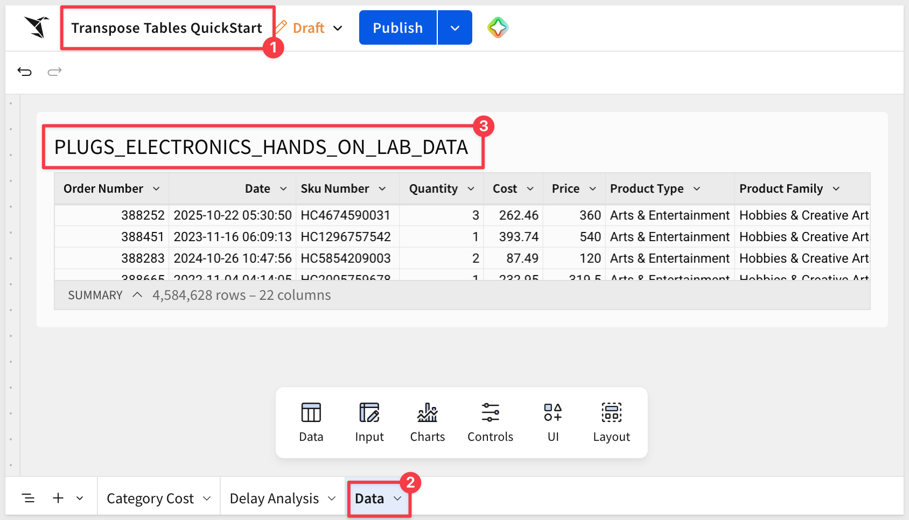

### Create a child table to transpose

Open the `3-dot` menu on the table and select to create `Child` table:

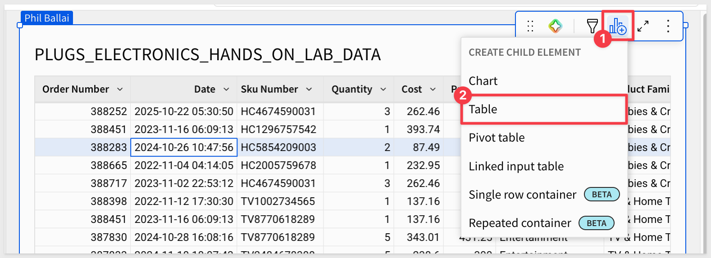

Using the `3-dot` menu but from the child table, move it to the `Category Cost` page.

### Transpose the child table

<aside class="positive">
<strong>WHY A SEPARATE DATA PAGE:</strong><br> Keeping source tables on a dedicated <code>Data</code> page separates raw data from analysis outputs. It gives other workbook builders a clear place to find the source, makes it easy to add new elements from the same data without cluttering output pages, and keeps the final pages focused on what the audience actually needs to see.

When data changes on the <code>Data</code> page, child tables reflect them automatically.

It is recommended to `Hide` data pages so that users do not see them.
</aside>

On the `Category Cost` page with the child table selected, click the `3-dot` menu and then select `Element source` > `Transpose`:

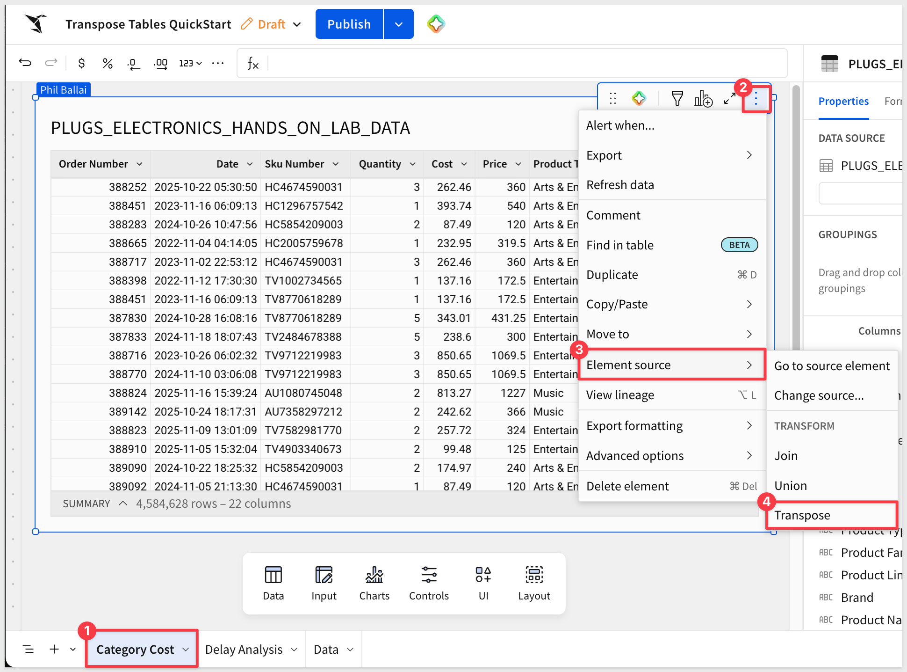

The Transpose configuration modal opens. The right panel labeled `Original table` shows a preview of the source data.

### Configure Row to Column

The modal defaults to `Row to Column`. Leave that selected and configure the following fields:

- Column to transpose: `Product Type`
- Value column: `Cost`
- Aggregate: `Sum`

Sigma reads the unique values in `Product Type` and creates one output column for each — `Arts & Entertainment`, `Computers`, `Entertainment`, `Mobiles`, `Music`, and `Photography`. We will use these in a moment.

The `Value column` (`Cost`) provides the numbers that populate those columns, aggregated by `Sum` within each output row.

### Select output columns

In the `Output columns` section, choose which additional columns to include alongside the transposed category columns. Check `Store Region` and `Store State` to retain the store location dimensions.

The output preview shows the row structure — one row per `Store Region` and `Store State` — but the `Product Type` columns are not included yet.

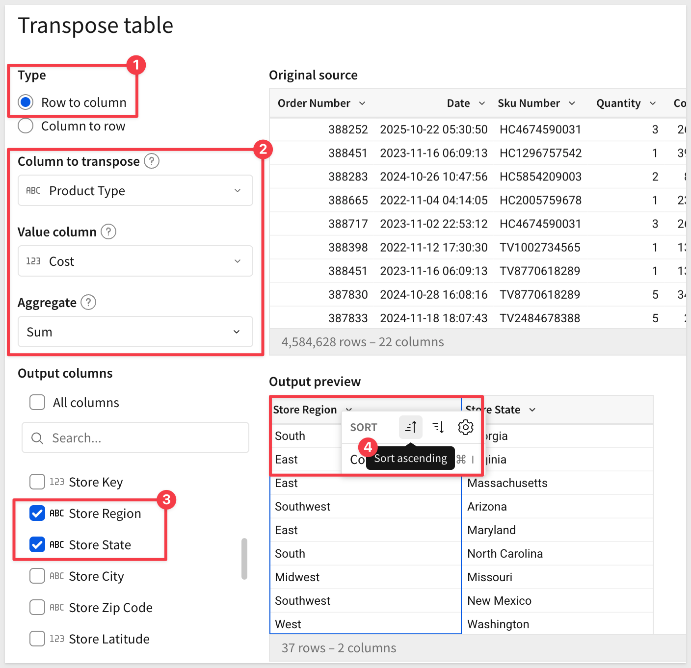

Scroll the `Output columns` list to select the product types to include. Select them all:

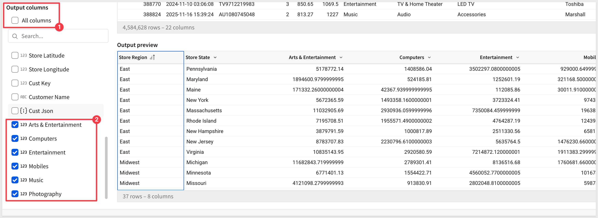

Click `Submit`.

After formatting the values as `Currency`, the table now shows store locations as rows and product categories as columns, with total cost summed across all transactions in each cell. 

This layout makes it straightforward to compare cost patterns across categories for any store region or state:

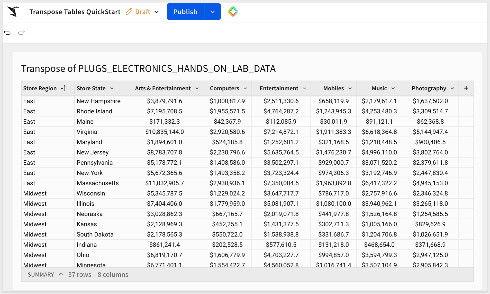

We could also take the extra step to group by `Store Region` and `Store State` to make the results really clear:

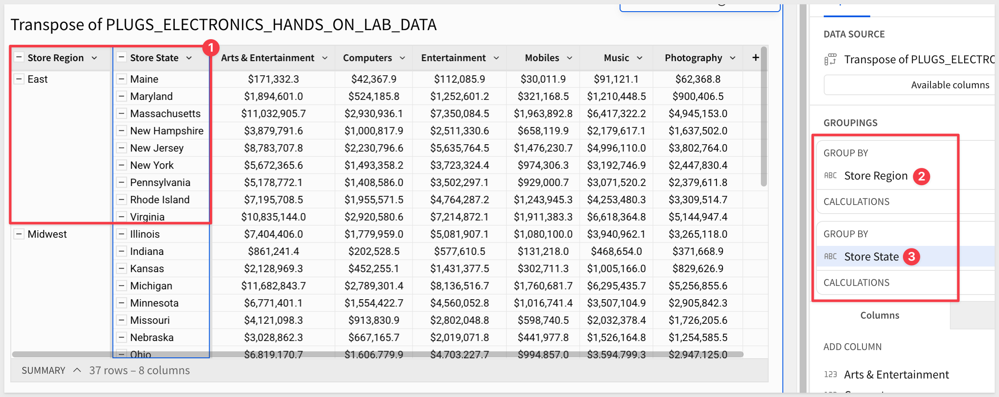

**WHY IT MATTERS:**<br>
The Row to Column direction eliminates the need to manually pivot or restructure data in the warehouse to produce a wide comparison layout. The reshape happens in Sigma, on live data, without any SQL or ETL work.


<!-- END OF SECTION-->

## Column to Row
Duration: 10

The Column to Row direction converts multiple columns into a single long-format output — each selected column becomes a row, with a label column identifying its origin. Use this when your source data has related metrics spread across separate columns that should be treated as a single measure.

**The data:**<br>
`FLIGHTS` from `Sigma Sample Database` > `EXAMPLES` > `FAA` — a flight operations dataset including `Airline` and five delay columns: `Air System Delay`, `Security Delay`, `Airline Delay`, `Late Aircraft Delay`, and `Weather Delay`.

**The problem:**<br>
Each delay type is a separate column. To compare delay types across airlines in a grouped view or chart, all delay values need to be in a single column with a label identifying the type.

### Add the FLIGHTS source table

On the `Data` page, add a second table element and connect it to `FLIGHTS` from `Sigma Sample Database` > `EXAMPLES` > `FAA`:

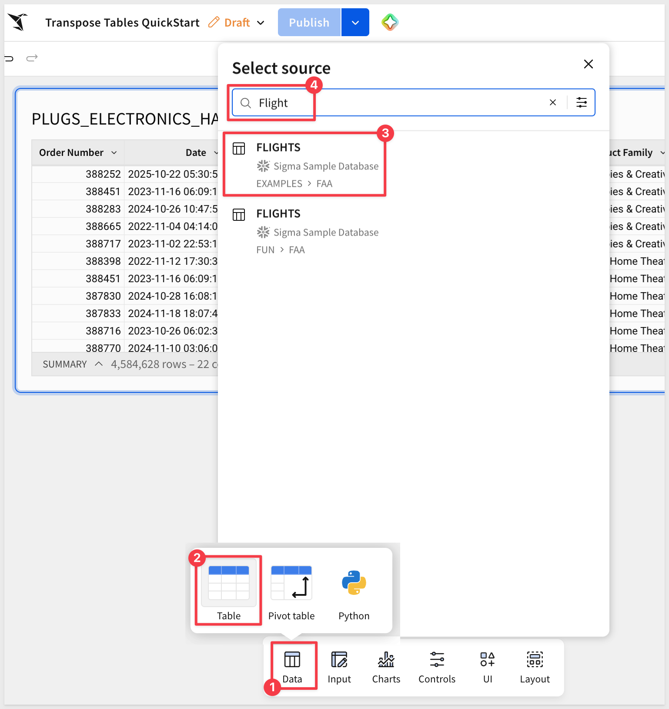

The `FLIGHTS` table has five delay columns — `Air System Delay`, `Security Delay`, `Airline Delay`, `Late Aircraft Delay`, and `Weather Delay` — each representing a different cause of delay in minutes.

### Create a child table

Once again, create a child table from `FLIGHTS` and move it to the `Delay Analysis` page.

### Add a Transpose table

On the `Delay Analysis` page, with the child table selected, click the `More` menu (three-dot icon) on the element, then select `Element source` > `Transpose`.

### Configure Column to Row

In the modal, select `Column to Row`.

The configuration fields change to reflect the column-to-row direction.

For `Columns to merge` select the five delay columns:
- Air System Delay
- Security Delay
- Airline Delay
- Late Aircraft Delay
- Weather Delay

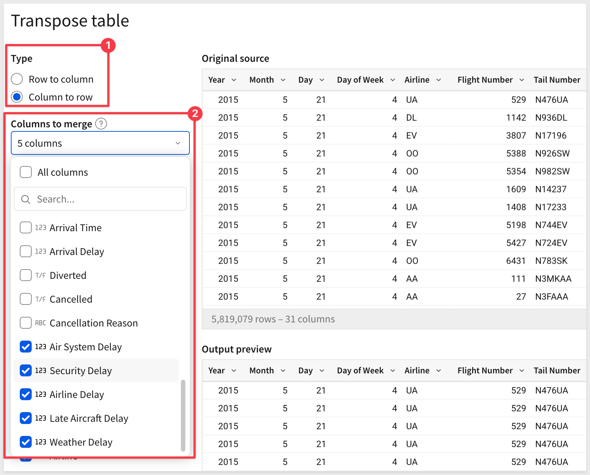

Change the label for `Column label for merged columns` to `Delay Type`.

Also change the label for `Column label for values` to `Delay Time`:

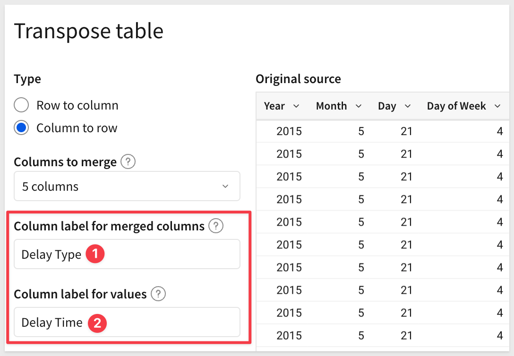

The `Columns to merge` selection determines which columns are collapsed into rows. 

`Column label for merged columns` names the new column that will hold the original column names as values. 

`Column label for values` names the column that holds the corresponding numeric values.

In the `Output columns` section, ensure `Airline` is included. Leave all other columns selected.

The output preview shows the long-format result — each flight now appears once per delay type:

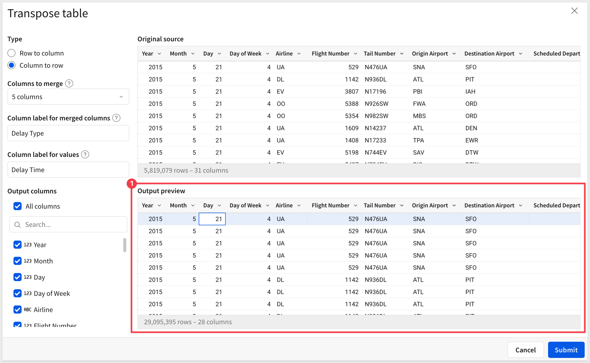

<aside class="positive">
<strong>WHY THE ROW COUNT EXPANDED:</strong><br> The original FLIGHTS table has 5,819,079 rows. With 5 delay columns selected, each source row produces 5 output rows — one per delay type. The result is 29,095,395 rows (5,819,079 × 5). This is expected behavior for Column to Row: the output row count always equals the source row count multiplied by the number of columns merged.
</aside>

Click `Submit`.

### Group within the Transpose element

Sigma creates the Transpose table on the `Data` page and names it `Transpose of FLIGHTS`. 

Now we can add grouping and a calculation to summarize the data.

In the element panel, drag `Airline` and `Delay Type` to the `Group By` section. Then click `+` next to `CALCULATIONS` and enter:

```copy-code
Sum([Delay Time])
```

Rename the column `Total Delay`.

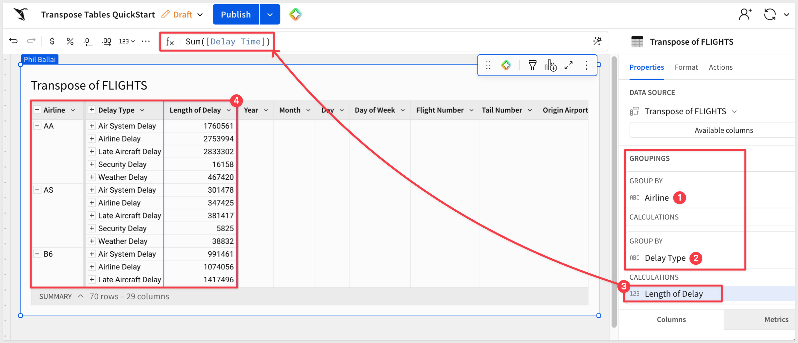

The table now shows one row per airline per delay type — 70 rows for 14 airlines × 5 delay types — with total delay in minutes.

Each airline's total delay minutes broken down by cause, in a format that supports filtering, sorting, and charting with a single value column.

**WHY IT MATTERS:**<br>
When delay types — or any set of related metrics — are stored as separate columns, comparing them requires either pivoting the query or working around the wide layout in every chart and filter. Column to Row collapses that complexity in one step, producing a long-format table that works naturally with Sigma's grouping and visualization tools.


<!-- END OF SECTION-->

## Limitations and Known Behaviors
Duration: 5

Transpose is a powerful reshaping tool, but its behavior differs from standard Sigma child table operations in important ways. Understanding these constraints before you build will save debugging time.

### Transpose operates on source data, not Sigma-computed results

Transpose goes directly to the data from your data platform — it does not operate on groupings, filters, or calculated columns applied to a Sigma workbook element. If you apply grouping or filtering to a table and then add Transpose, those transformations are not reflected in the transposed output.

This is by design and documented behavior. It is the reason this QuickStart adds Transpose directly to source tables rather than to grouped child tables.

**Grouping and aggregation can be added within the Transpose element after creation** — as shown in the Column to Row example — but they cannot be inherited from a parent element upstream.

### Input table restriction

Transpose cannot be applied directly to a Sigma Input table. If your source data is in an Input table, add a child table first and apply Transpose to the child.

### Row to Column: single value column only

The Row to Column direction supports only one value column per Transpose table. If you need to transpose multiple metrics into columns simultaneously, either use multiple Transpose tables or restructure the source data upstream.

### Row to Column: 200-column limit

The Row to Column direction generates one output column per unique value in the label column. If the label column contains more than 200 distinct values, the transpose will generate an error. Design your source data to limit cardinality before transposing if this is a concern.

### Row to Column: static column set

The set of output columns is determined at the time the Transpose is created and does not dynamically update when the connected data source changes. If new values appear in the label column after the Transpose is configured, the output will not include them — the Transpose must be reconfigured to reflect new values.

This limitation does not apply to Column to Row — output rows are derived from the selected source columns, which are fixed by design.

For the most recent information, see [Limitations](https://help.sigmacomputing.com/docs/transpose-a-table#limitations)


<!-- END OF SECTION-->

## What we've covered
Duration: 5

This QuickStart demonstrated both directions of Sigma's Transpose table using two real datasets — Row to Column with PLUGS Electronics for a wide category cost comparison, and Column to Row with FLIGHTS to convert five delay columns into a long-format breakdown by airline and delay type.

The key architectural point is that Transpose operates on data from the source, not on Sigma-computed transformations. Grouping, filtering, and calculations applied to a parent workbook element are bypassed. The correct pattern is to add Transpose directly to the source table, then add grouping and calculations within the Transpose element itself — as the FLIGHTS example demonstrates.

Both directions solve the same underlying problem: data that arrives in the wrong shape for the analysis you need. 
- Row to Column works when dimension values should be column headers. 
- Column to Row works when separate metric columns should be a single measure. 

Knowing which direction to apply — and understanding that the reshape happens at the source layer — is what makes Transpose predictable to use.

**Additional Resource Links**

[Transpose table](https://help.sigmacomputing.com/docs/transpose-a-table)<br>
[Blog](https://www.sigmacomputing.com/blog/)<br>
[Community](https://community.sigmacomputing.com/)<br>
[Help Center](https://help.sigmacomputing.com/hc/en-us)<br>
[QuickStarts](https://quickstarts.sigmacomputing.com/)<br>

Be sure to check out all the latest developments at [Sigma's First Friday Feature page!](https://quickstarts.sigmacomputing.com/firstfridayfeatures/)
<br>

[](https://twitter.com/sigmacomputing)&emsp;
[](https://www.linkedin.com/company/sigmacomputing)&emsp;
[](https://www.facebook.com/sigmacomputing)


<!-- END OF WHAT WE COVERED -->
<!-- END OF QUICKSTART -->
