author: pballai
id: use_cases_date_spines
summary: use_cases_date_spines
categories: use-cases
environments: web
status: Published
feedback link: https://github.com/sigmacomputing/sigmaquickstarts/issues
tags: default
lastUpdated: 2023-05-26

# Working with Date Spines

## Overview 
Duration: 5 

This QuickStart **QS** demonstrates how to leverage Date Spines using Sigma and sample data provided to all Sigma customers. 

Date spines are useful when a date exists in one table but not another and we still want to display that date even when there is no corresponding data when the tables are joined.  Gaps in the data result in information that is incomplete and is not desirable. 

For example, we may have sold products last year, but not this year. We still want the data to show this years dates, regardless the lack of sales. 

How do we display this if we cannot match on dates because there we no transactions for the same date this year? In comes a Date Spine.

A Date Spine will allow us to show a null value for this years dates, even though there are sales this year.

 ### Target Audience
Anyone who is interested in how reference tables (in this case, for dates) can be leveraged in Sigma.

### Prerequisites

<ul>
  <li>A computer with a current browser. It does not matter which browser you want to use.</li>
  <li>Access to your Sigma environment.</li>
  <li>Some familiarity with Sigma is assumed. Not all steps will be shown as the basics are assumed to be understood.</li>
</ul>

<aside class="postive">
<strong>IMPORTANT:</strong><br> Sigma recommends that you use non-production resources when doing QuickStarts.
</aside>

<button>[Sigma Free Trial](https://www.sigmacomputing.com/free-trial/)</button>
  
### What You’ll Learn
How to apply Sigma approved Markdown for your QS.

### What You’ll Build
[I good example of the Sigma style that we want to try to adhere to is here](https://quickstarts.sigmacomputing.com/guide/administration_audit_logging/index.html?index=..%2F..index#0)

INSERT IMAGE OF FINAL BUILD IF APPROPRIATE.........


<!-- NOTE: SIGMA LOGO REQUIRED AT END OF EACH ## SECTION -->
<!-- END OF OVERVIEW -->

## Date Spines
Duration: 10

A date table, also known as a calendar table or date-spine, is a reference table that contains a comprehensive list of dates. It helps solve several problems related to time-based analysis. 

For example, date spines solve problems related to filling in missing dates, facilitating time-based aggregation, handling irregular intervals, enabling time-based filtering, and enhancing visualization and reporting capabilities. They provide a structured framework for time-based analysis, ensuring consistent and accurate insights in analytics applications.

Here are some benefits and problems they address:

1. Fill in Missing Dates: One of the primary problems solved by a date table is filling in missing dates in datasets. Time series data often have gaps or missing values for certain dates. By joining the date table with the data table, you can ensure that all dates are present in the dataset, even if there is no corresponding data. This allows for consistent analysis and accurate calculations that require a complete time series.

2. Time-Based Aggregation: A date table provides a consistent and reliable way to aggregate data based on time intervals. For example, you can easily calculate monthly, quarterly, or yearly aggregates by grouping and summarizing data based on the dates in the date table. This simplifies calculations of metrics like averages, sums, or counts over specific time periods, enabling meaningful comparisons and trend analysis.

3. Handling Irregular Intervals: Time series data may not always have a regular interval between data points. There could be varying time gaps or irregular timestamps. A date table helps address this issue by providing a fixed set of evenly spaced dates. You can align the data points with the dates in the date table, ensuring consistent intervals and enabling accurate analysis and visualization of the data.

4. Time-Based Filtering and Slicing: A date table allows for easy filtering and slicing of data based on specific time periods. By leveraging the attributes in the date table, such as day of the week, month, or year, you can segment and analyze the data based on various temporal dimensions. This helps identify patterns, seasonality, and trends at different levels of granularity, enhancing the depth of analysis.

5. Visualization and Reporting: Date tables are invaluable for creating visualizations and reports with time-based axes. They provide a comprehensive set of dates and attributes that can be used as reference points for plotting and labeling data points. This ensures accurate and meaningful representation of time series data, enabling stakeholders to grasp patterns and trends quickly.

### Options for "gap" handling in data:

To be complete, we are listing the common methods used to address gaps in joined data.

 <li><strong></strong> In general, there are three ways to deal with these "gaps":
    <ol type="n"> 
      <li><strong>Exclude unmatched transactions:</strong>  If the requirement of your report is that only transactions with matching dates from both tables should be included, you could exclude the transactions from the table that does not have matching dates. This could be done by using a join clause that specifies that only matching records from both tables should be returned.</li>
      <li><strong>Include unmatched transactions with null values:</strong> If you need to include all transactions from both tables, but some transactions do not have matching dates, you could include those transactions in the report with null values for the missing date. This can be done by using a left or right join, which will return all records from one table and only matching records from the other table. In the case of a left join, the unmatched records from the right table will have null values for their corresponding fields in the result set.</li>
      <li><strong>Group transactions by date range:</strong>  If the requirement of your report is to group transactions by date range rather than by exact date, you could define date ranges that include transactions from both tables. This can be done by using a range-based join condition, such as "table1.date between table2.date - interval 1 day and table2.date + interval 1 day".</li>
      <li><strong>Use a Date Spine/Table:</strong> If the requirement is to include all relevant dates regardless if they exist or not in the primary table AND we want to add the date if they do not, and once they are added, show the corresponding value as null.</li>
    </ol>
  </li>

## Use Case
Duration: 20


<!-- END OF SECTION-->


## Creating the Date Spine
Duration: 20

Create a `New Workbook` for our use case and name it `Date Spine`. 

Rename the initial `Page` to `Data`.

Add a new `Table` to the page, selecting to `Write SQL` for the source data.

Select the `Sigma Sample Database` for the connection.

Paste the following code into the script window and click the `Run` button:
```SQL
WITH RECURSIVE date_spine AS (
  SELECT CURRENT_DATE AS date_week
  UNION ALL
  SELECT DATEADD('DAY', -1, date_week)
  FROM date_spine
  WHERE DATEADD('DAY', -1, date_week) >= DATEADD('MONTH', -51, CURRENT_DATE)
)
SELECT date_week AS "Day of Invoicedate"
FROM date_spine
WHERE DAYOFWEEK(date_week) = 0
ORDER BY date_week
```

This SQL script generates a date spine or a calendar table containing a list of dates starting from the current date and going back 51 months (approximately 4 years and 3 months). The script uses a recursive query to generate the date spine.

**Why 51 months?**

We happen to know that our sample data has an orders table that only goes back 51 months. As a convenance, Sigma updates it's sample data each day to increment dates by one day so that the data appears "fresh". Generating a Date Spine that uses a date range that is today and goes back 51 months (only showing Sundays in this case) keeps this QuickStart current as the dates get refreshed. 

<aside class="positive">
<strong>IMPORTANT:</strong><br> Spend a moment to consider how you might populate a date spine for your use cases. The little details can matter later.
</aside>

Click `Run` and then `Save`.

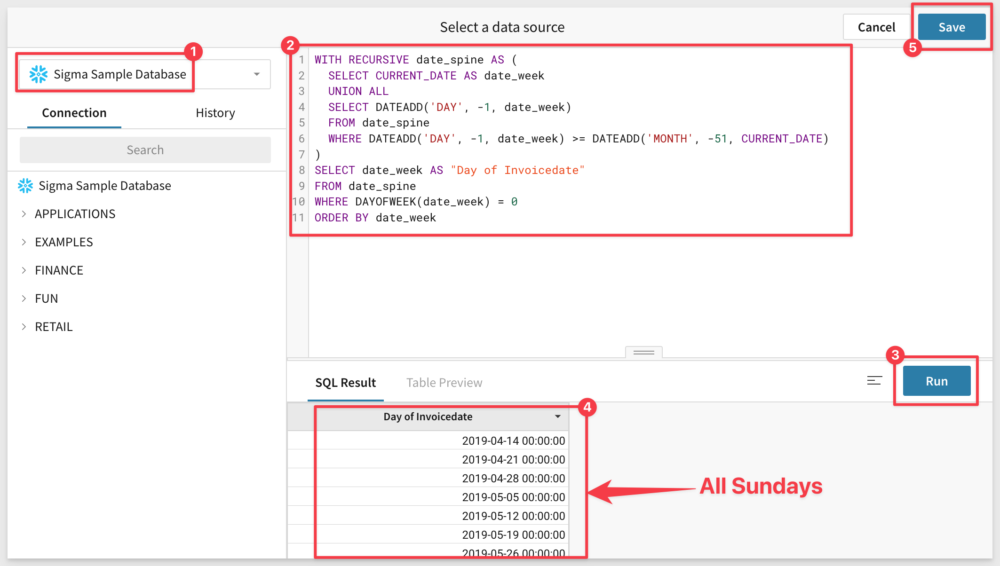

Rename the table to `Date Spine`.

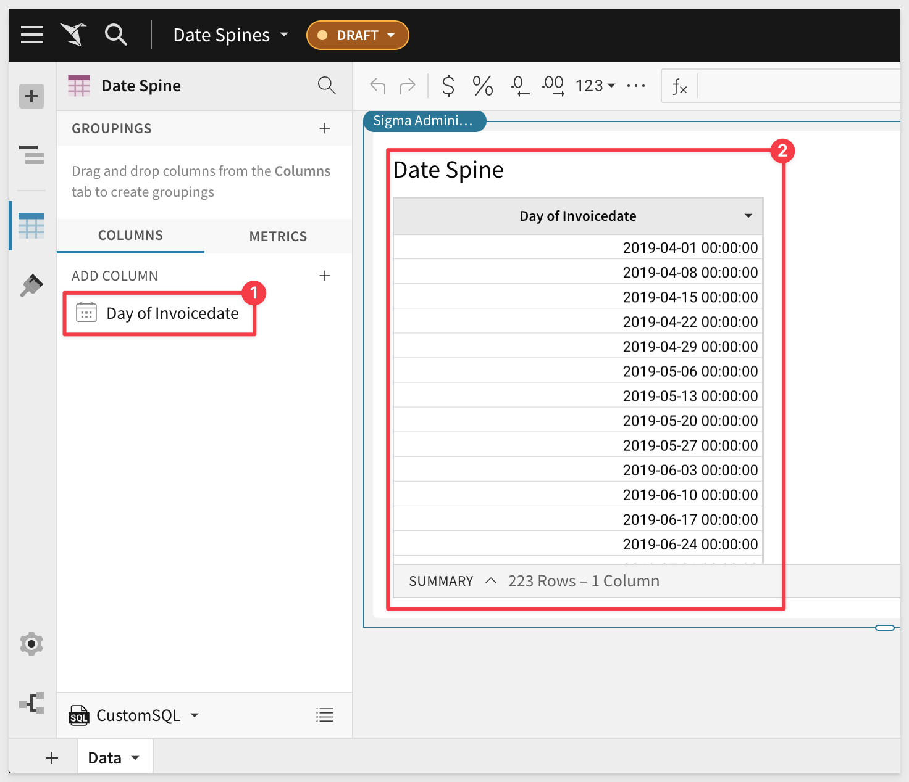

We now have a Date Spine as reference, that we can join with other tables to fill in date gaps in our data.


<!-- END OF SECTION-->

## Weekly Sales Data
Duration: 20

Before we can use the Date Spine, we need to create a table that contains the data we are after, and organized it in groups.

Create a new `Table` on the `Data` Page. 

This time, we want to use the `Sigma Sample Database` > `Retail` > `PLUGS_ELECTRONICS` > `PLUGS_ELECTRONICS_HANDS_ON_LAB_DATA` table. 

Select that and click the `Select` button:

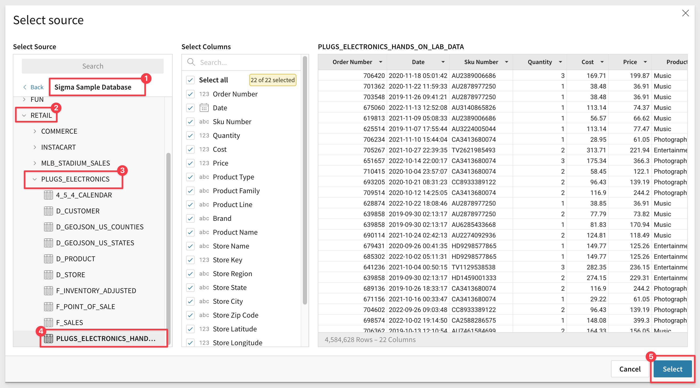

Rename the new table to `Weekly Sales`.

We will need to add a new column for profit, which is not included in the base table. 

Click on the `Price` column dropdown and select `Add new column`:

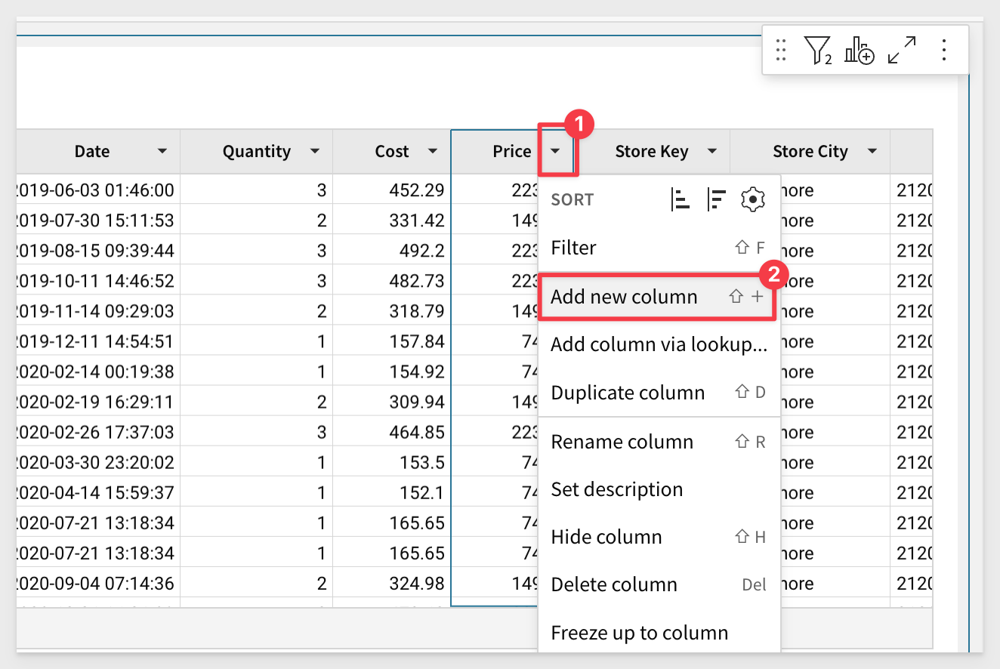

Rename the new column to `Profit` and set it's formula to:

```code
Sum([Price] * [Quantity] - [Cost])
```

Format the `Profit` column as `Currency`.

<aside class="negative">
<strong>NOTE:</strong><br> Some values may be negative, reflecting items sold at a loss.
</aside>

Before we start to manipulate the data, we will filter it down so that we are initially working with a small subset of the data. 

We want to look at a few specific records when we discuss each step.

This will also allow us to move as fast as possible through our iterations. 

When we are all done, we can remove the filters.

Set the filters on these columns, for these values:
```plaintext
Column:          Filter:
Product Type     Arts & Entertainment
Store Name       Chesterfield Store #555
Product Name     1091-Ink Pads
```

For example:

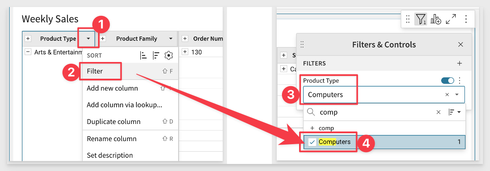

This filtering gives us 36 rows:

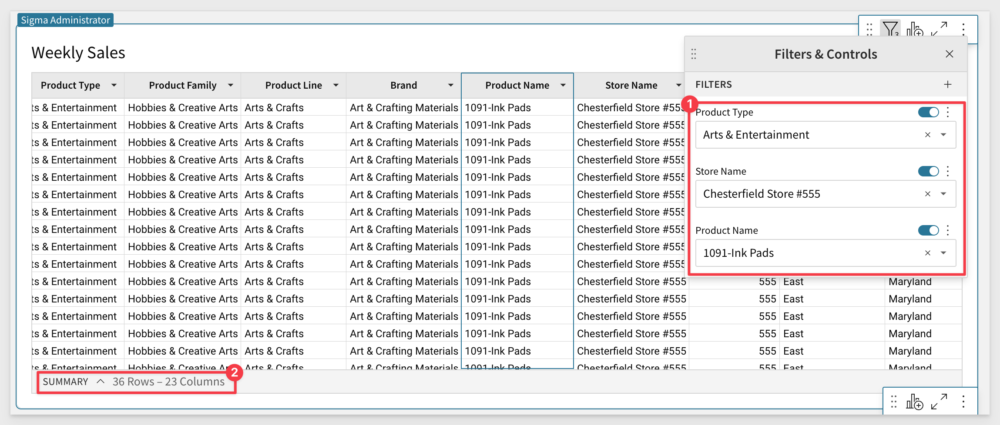

Now apply the following groupings to the new `Sales Weekly` table:

<aside class="negative">
<strong>NOTE:</strong><br> You should end up with nine independent groups as shown (we spilt the list into two so you don't have to scroll the QuickStart to see it all at once).
</aside>

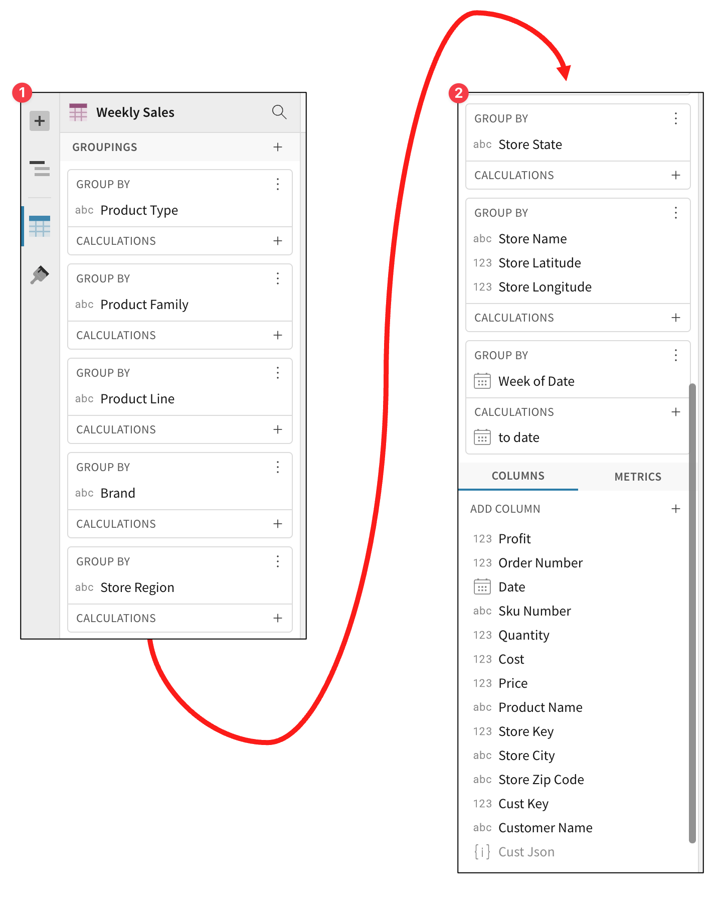

<aside class="negative">
<strong>NOTE:</strong><br> Take care to place columns in separate groups (as shown in the image below) using the "+" icon. 
</aside>

Truncate the `Date` column in the last grouping to `Week`. This column should be renamed `Week of Date`

We will enrich the data with two calculated columns, adding them to the `Week of Date` grouping:

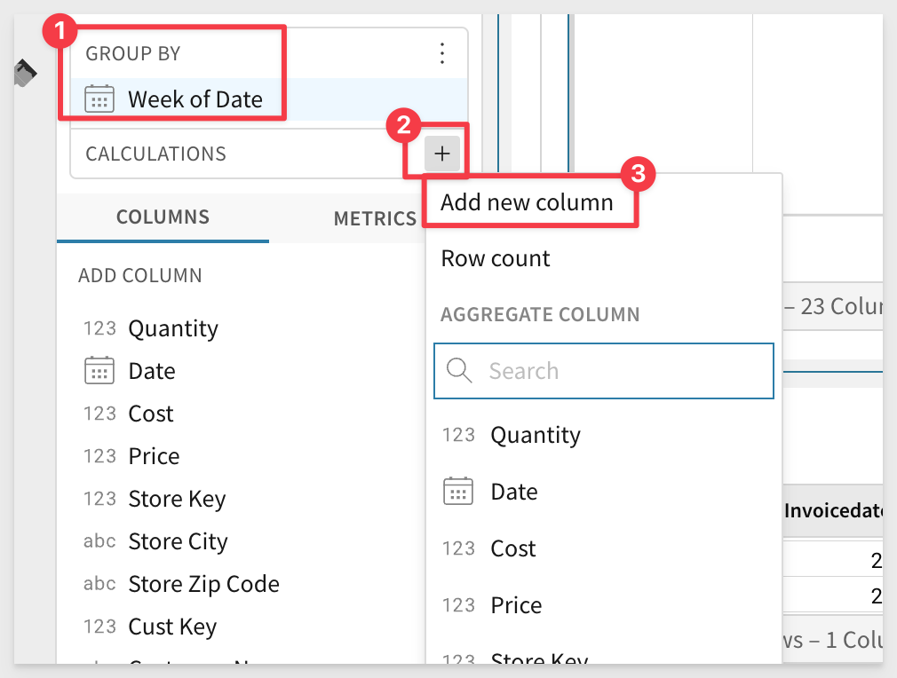

For the first new column we will rename it to `to date` and use this formula:
```code
Coalesce(DateAdd("millisecond", -1, Lead([Week of Date])), Today())
```

Rename this new column to `to date`.

In looking at the data, we can see that the value for `to date` is the value of the previous `Week of Date` - 1 day:

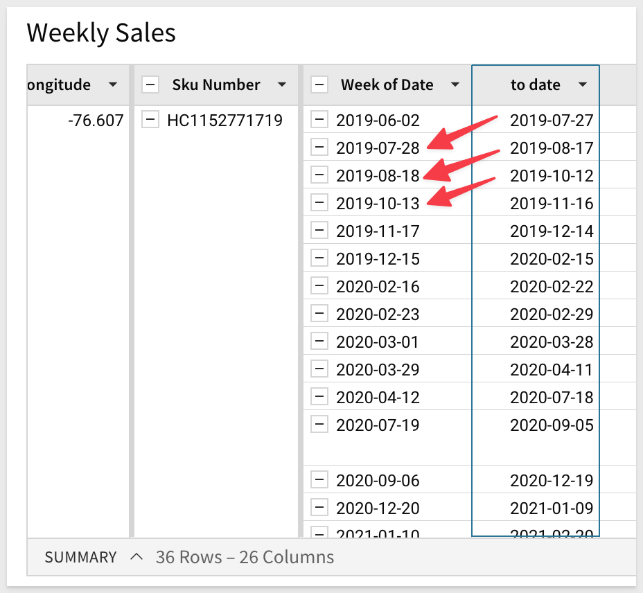

<aside class="negative">
<strong>NOTE:</strong><br> The previous function is getting the date of the next week (minus one millisecond), or if there is no next week in the data (i.e., we're looking at the last row), it gets today's date. It's essentially a way of looking ahead to the next week in the data, or using the current date if we're already at the end of the data.
</aside>

For the second new column we will rename it to `Sum of Profit` and use this formula:
```plaintext
Sum(Profit)
```

It is necessary to sum the `Profit` as there are days with more than one order for the same item on the same day.

`Weekly Sales` should now look similar to this (the dates may be slightly different; that is ok):

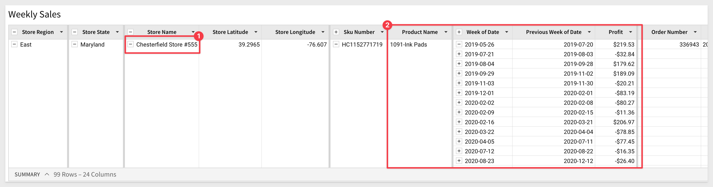


<!-- END OF SECTION-->


## Join Date Spine to Weekly Sales
Duration: 20

We are now ready to add the `Date Spine` table to `Weekly Sales` so that we can have a more complete set of data that includes missing weeks with null values injected for profit.

Click to create an new child table from the `Date Spine`:

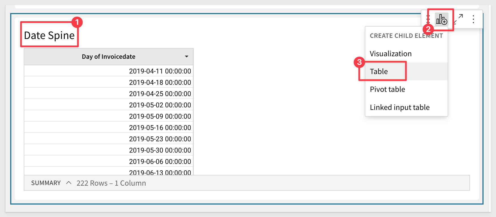

Rename the new table to `Weekly Sales + Date Spine` and move the table to the top of the workbook page.

Join the `Weekly Sales` table to it:

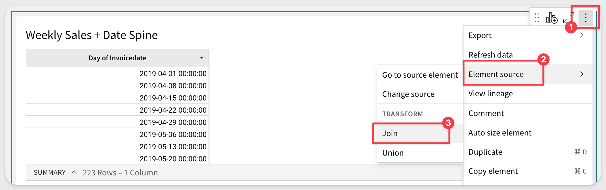

and select the `Weekly Sales` table:

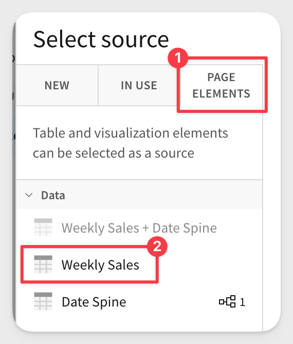

Click the `Select` button:

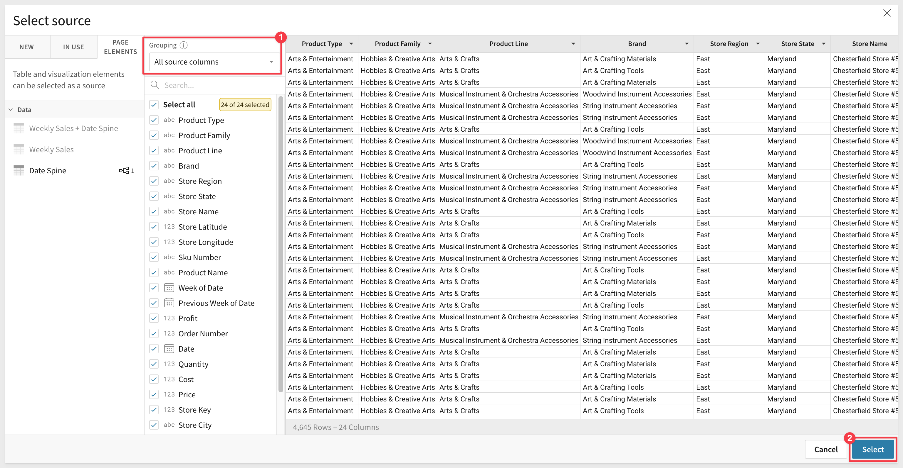

In the `Edit Join` page, click to select `Weekly Sales` table and set the initial join to `>=`. 

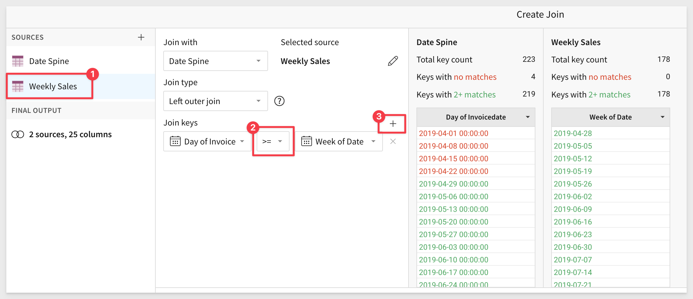

Then click the `+` to add an additional join.

Set the second join key as shown:

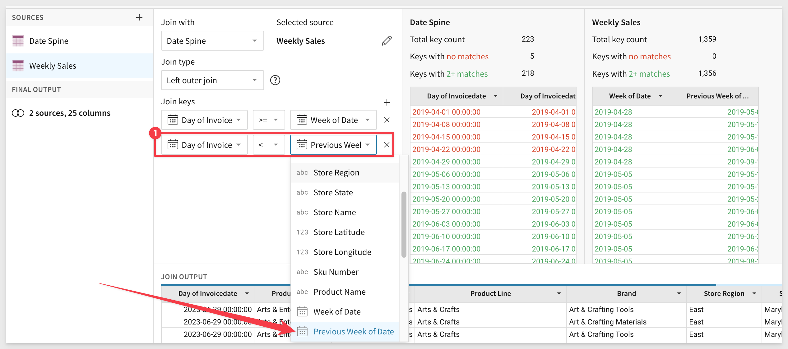

These two join conditions create a result set that includes all weeks from the Date Spine table .....ADD DETAILS PHIL

Click the `Preview Output` button.

We are shown the results and a graphical depiction of the data linage.

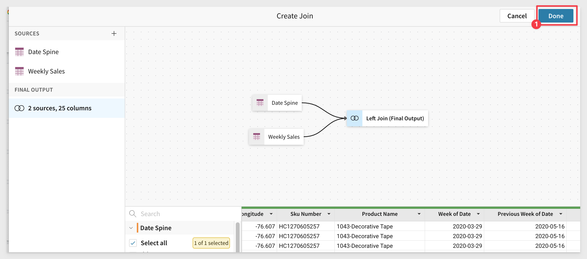

<aside class="negative">
<strong>NOTE:</strong><br> Lineage refers to the ancestry and relationships between data elements in a workbook. All workbooks contain a lineage display, allowing you to oversee and navigate these relationships. This can be very useful as your data relationships grow in complexity.
</aside>

To learn more about Data Lineage in Sigma, [click here.](https://help.sigmacomputing.com/hc/en-us/articles/4414895782291-Workbook-Data-Lineage)

We now have joined the two tables together.

In this case, we will just apply the same grouping and new columns we did already, but will not add back the calculated columns; those are already included in the new table.

Also notice that the new table's data is pre-filtered based on the filters of the `Weekly Sales` table. If we remove the filters from that table, both tables will reflect the change.

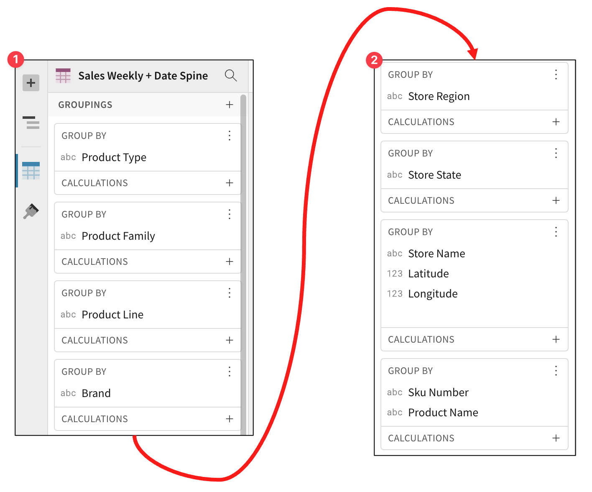

Let's make the table easier to read by removing the columns we won't be using:

NEED SCREENSHOT OF THE COLUMN LIST:


Next we will add two new columns:

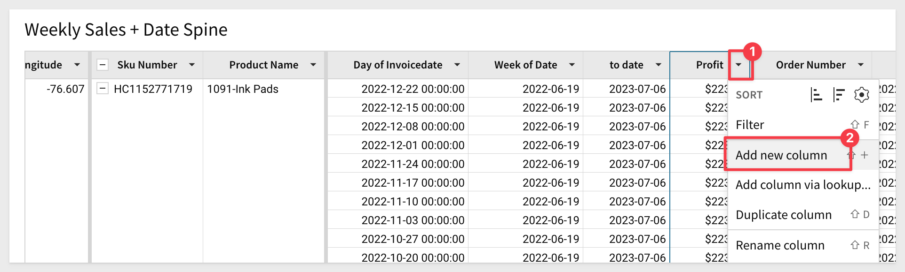

The first column to add is `Profit (Last Week)`:
```plainext
Lag(Profit)
```

The second column to add is `Profit (Last Year)`:
```plainext
Lag([Profit], 52)
```

To learn more about the Lag function, [click here.](https://help.sigmacomputing.com/hc/en-us/articles/360037431453-Lag)

When added, the new columns appear like this:

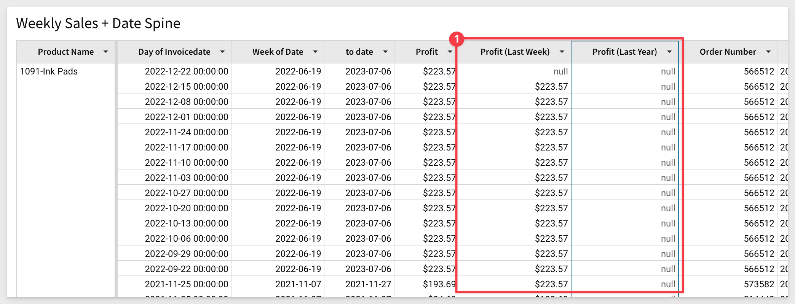

If we scroll down in the `Weekly Sales + Data Spine` table, we see that there are some extra rows of dates with null values for the rest of the columns. This is because we joined the `Data Spine` table, and it has values for the extra rows showing, but there are no corresponding sales in the `Weekly Sales` data. 

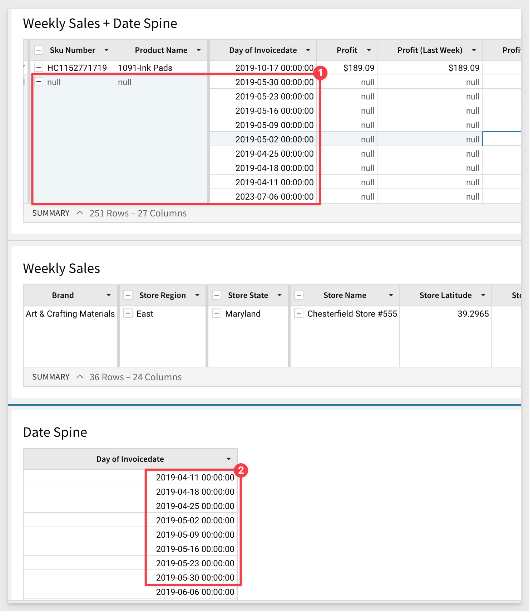


There are a few methods but let's do it with a new column and a formula that checks three other columns for null values:
```plainext
IsNull([Profit]) and IsNull([Profit (Last Week)]) and IsNull([Profit (Last Year)])
```

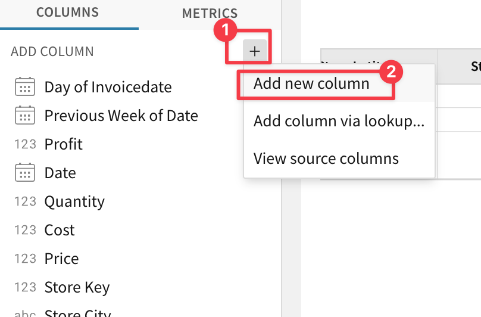

Rename the column `nullcheck` and set it to `hidden`.

In the `nullcheck` column, right click on a `false` value (any one will do), and select `keep only false`. This will automatically create a filter that results in false records only appear, based on the formula for `nullcheck`:

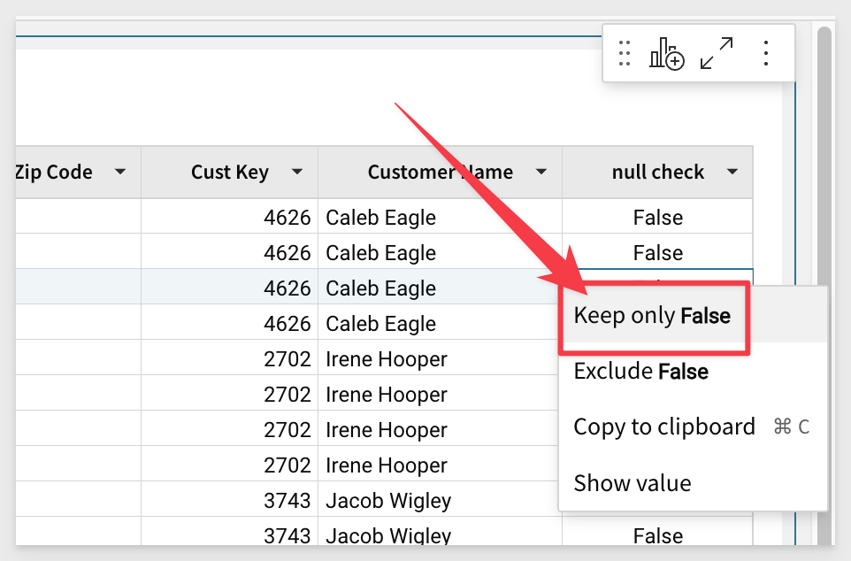


<!-- END OF SECTION-->


## **NEXT SECTION**
Duration: 20


<!-- END OF SECTION-->
## What we've covered
Duration: 5

In this lab we learned how to.........

INSERT FINAL IMAGE OF BUILD IF APPROPRIATE

<!-- THE FOLLOWING ADDITIONAL RESOURCES IS REQUIRED AS IS FOR ALL QUICKSTARTS -->
**Additional Resource Links**

[Help Center Home](https://help.sigmacomputing.com/hc/en-us)<br>
[Sigma Community](https://community.sigmacomputing.com/)<br>
[Sigma Blog](https://www.sigmacomputing.com/blog/)<br>
<br>

[](https://twitter.com/sigmacomputing)&emsp;
[](https://www.linkedin.com/company/sigmacomputing)
[](https://www.facebook.com/sigmacomputing)


<!-- END OF WHAT WE COVERED -->
<!-- END OF QUICKSTART -->