author: pballai
id: use_cases_finance_discounted_cash_flow
summary: use_cases_finance_discounted_cash_flow
categories: use-cases
environments: web
status: published
feedback link: https://github.com/sigmacomputing/sigmaquickstarts/issues
tags: default
lastUpdated: 2024-09-27

# Discounted Cash Flow

## Overview 
Duration: 5 

A discounted cash flow (**DCF**) is an analysis that values some type of asset over a period of time.

More simply put, it allows someone to understand how much future money is worth in today’s terms. 

Historically, this type of analysis has been done in traditional spreadsheet tools like Excel. While a reliable tool, financial analysts and accountants often encounter challenges when performing a DCF in Excel:

- Scalability Issues: Large datasets must be rolled up/aggregated to fit within Excel’s ~1 million row limit, leading to a loss of crucial data granularity.

- Manual Updates: The process must be repeated periodically (e.g., monthly or quarterly) as new data needs to be incorporated into the original model, making it time-consuming.

- Lack of Governance: Excel lacks built-in governance features, making it difficult to prevent mistakes and ensure accuracy both proactively and retroactively.

**That is where Sigma comes in.**

With a familiar spreadsheet interface, Excel power users can seamlessly transition to Sigma and recreate their work in an intuitive format. 

Our cloud-based architecture offers:

- Performance and Scalability: Handle datasets well beyond Excel's limits, leveraging the full compute power of your cloud data warehouse, maintaining crucial data granularity for more detailed insights.

- Automated Real-time Updates: Your DCF analysis automatically updates as new data flows into your cloud data warehouse, ensuring timely and accurate financial modeling.

- Enhanced Governance and Security: Sigma inherits all the governance features from your cloud data warehouse, including audit trails and version history, ensuring data accuracy and reducing risks associated with manual errors.

This QuickStart provides an example of DCF, based on Sigma provided sample data, so users can build on their own. 

<aside class="positive">
<strong>PLEASE READ:</strong><br> Sigma data apps are rapidly evolving, with new features being added regularly. If your Sigma instance does not have the specific feature shown (or if the UI has changed), please contact Sigma support for assistance in accessing the feature.
</aside>

[How to contact Sigma support](https://help.sigmacomputing.com/docs/sigma-support)

### Target Audience
Sigma users who are in a finance role or have interest in a discounted cash flow analysis.

### Prerequisites

<ul>
  <li>A computer with a current browser. It does not matter which browser you want to use.</li>
  <li>Access to your Sigma environment.</li>
  <li>Some familiarity with Sigma is assumed. Not all steps will be shown as the basics are assumed to be understood.</li>
</ul>

<aside class="postive">
<strong>IMPORTANT:</strong><br> Sigma recommends that you use non-production resources when doing QuickStarts.
</aside>

<button>[Sigma Free Trial](https://www.sigmacomputing.com/free-trial/)</button>

<aside class="positive">
<strong>IMPORTANT:</strong><br> Some screens in Sigma may appear slightly different from those shown in QuickStarts. This is because Sigma is continuously adding and enhancing functionality. Rest assured, Sigma’s intuitive interface ensures that any differences will not prevent you from successfully completing any QuickStart.
</aside>

For more information on Sigma's product release strategy, see [Sigma product releases.](https://help.sigmacomputing.com/docs/sigma-product-releases)
 


## Demonstration
Duration: 5

We will be using sample data provided by Sigma, which is included with all trial and production accounts.
<aside class="negative"> <strong>NOTE:</strong><br> In Sigma production accounts, the administrator has the option to disable the sample data connection. If the connection does not appear for you, that is the most likely reason. </aside>

### Workbook Setup
Log into Sigma and Create a new workbook.

Click the + and select TABLE; search for hands and select the `PLUGS_ELECTRONICS_HANDS_ON_LAB_DATA` table:

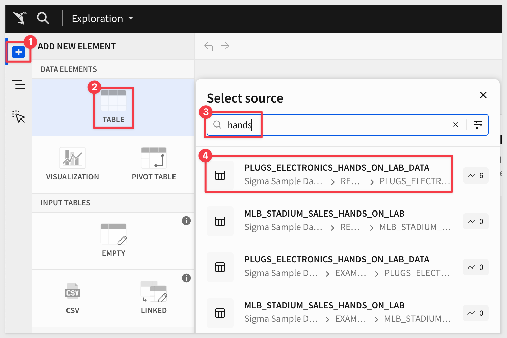

### Initial Setup
For this table, we have data from 2020 through 2024.

We want to create part of a DCF for each year, for each of the store regions.

First, we will group by `Store Region` and then create a second grouping on `Date`:

Set the formula for `Date` to:
```code
DateTrunc("year", [Date])
```

This gives us a row for each `Store Region` and `Year`:

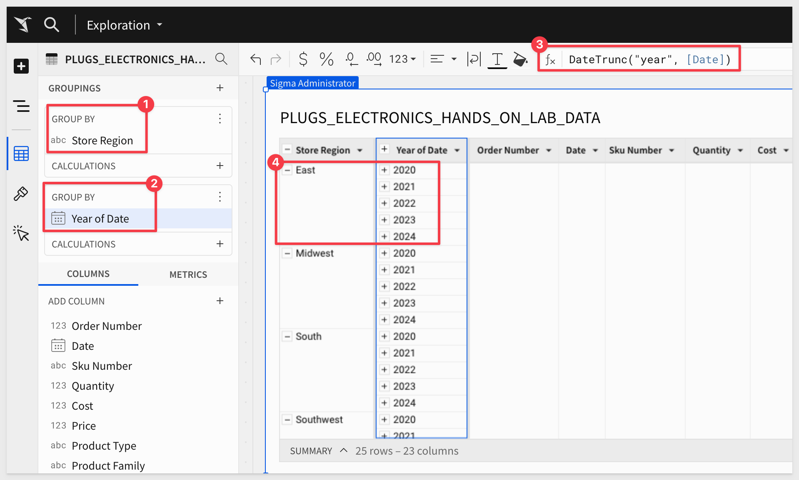

Filter on `Year of Date` for the last three years only:

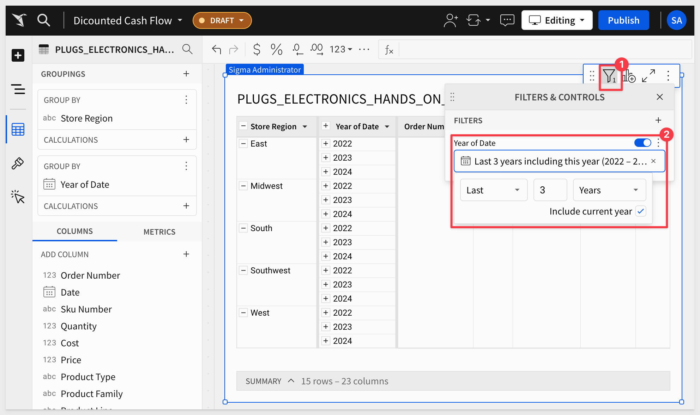

Add one more column as a `CALCULATION` in the `Year of Date`, setting its formula to:
```code
Rank([Year of Date], "desc")
```

This ensures that the most recent year is always numbered as `1`: 

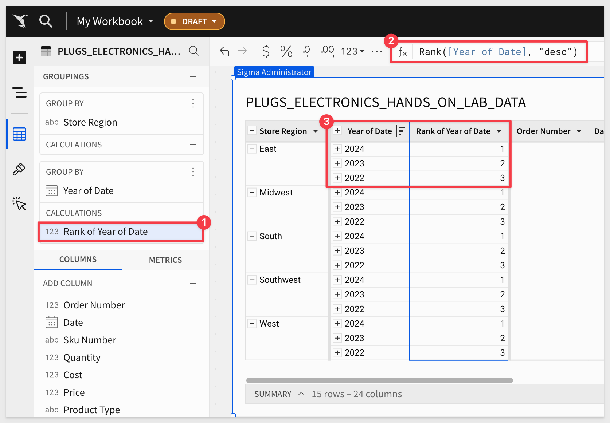

To start, we'll focus on three key components of the calculation:

- Carry Value (CV): represents the initial carrying value, which is essential for understanding the starting point of each period.
- Ending Carry Value (ECV): represents the value at the end of the period, before any reductions.
- Reduction: a change applied after establishing the beginning and ending carry values for the period.

The final step will be to calculate the actual Discounted Cash Flow (DCF) value.

### Create Columns
Add three new `CALCULATION` columns in the `Year of Date` group called ``CV 0``, `ECV 0` and `Reduction`.

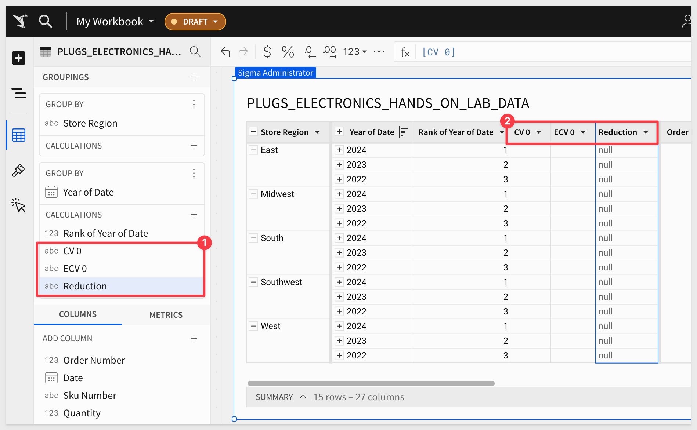

### Calculate Values for the First Year
Since we're starting with the first year, there won't be any `CV 0` initially. Therefore, there will only be an `ECV 0`, and no `Reduction` at this stage.

In the `ECV 0` column, insert the following formula:
```code
Subtotal(Sum([Price] * [Quantity]), "row_parent")
```

This calculation will give you the `ECV 0` for each `Store Region`, but keep in mind, this is only accurate for the first year. 

The calculation needs to be dynamic, as in year two, we'll introduce a carrying value, which in turn means we'll have a `Reduction`, resulting in an updated `ECV`.

<aside class="negative">
<strong>NOTE:</strong><br> The dollar values may not appear as shown in the screenshots. Our sample data is subject to change.
</aside>

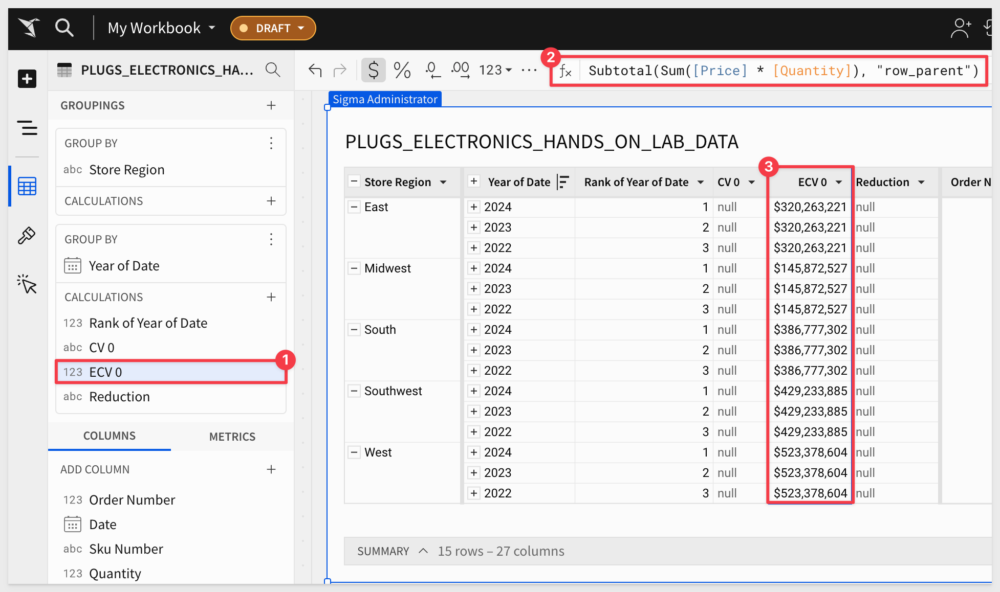

### Addressing the Recursive Logic
Here is where the challenge arises: the `ECV 0` column will inform the `CV 0` column, which then informs the `Reduction` column, and in turn, influences the `ECV` again. 

This cycle moves down row by row for each year, but since Sigma operates on a columnar basis, we need to handle this differently.

We will use helper columns to simulate this recursive logic.

### Adjusting the Ending Carry Value
Let’s first adjust `ECV 0` to ensure it is correctly calculated only for the first year.

Change the formula in `ECV 0` to:
```code
If([Rank of Year of Date] = 1, Subtotal(Sum([Price] * [Quantity]), "row_parent"))
```

This gives us:

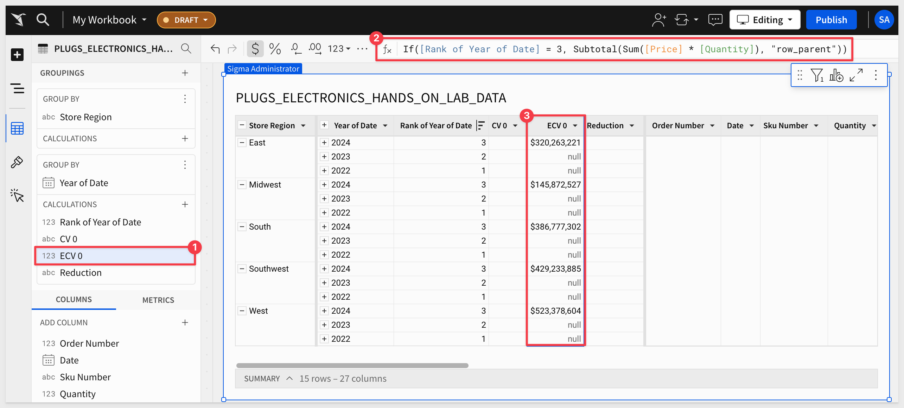

### Moving the Calculation Forward to Year 2
Now, let’s transfer this calculation as our carrying value for year two. 

In the `CV 0` column, insert:
```code
If([Rank of Year of Date] > 1, Lag([ECV 0], 1, Null))
```

This gives us (after sorting the `Year of Date` column to show the most recent date first):

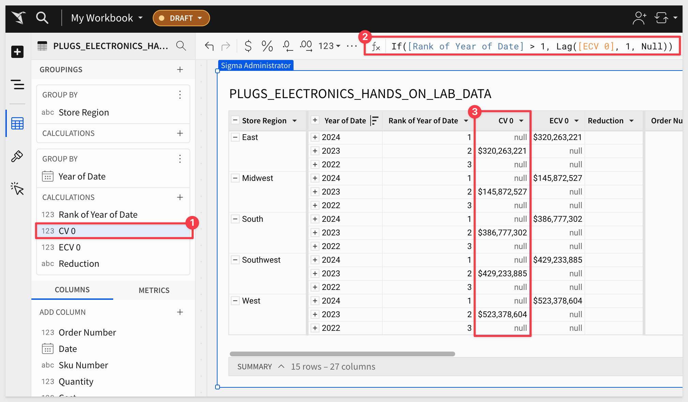

### Creating the Reduction Column
Next, define the `Reduction` column with the following formula:
```code
If([Rank of Year of Date] = 1, Null, Sum([Quantity] * [Price]))
```

This gives us:

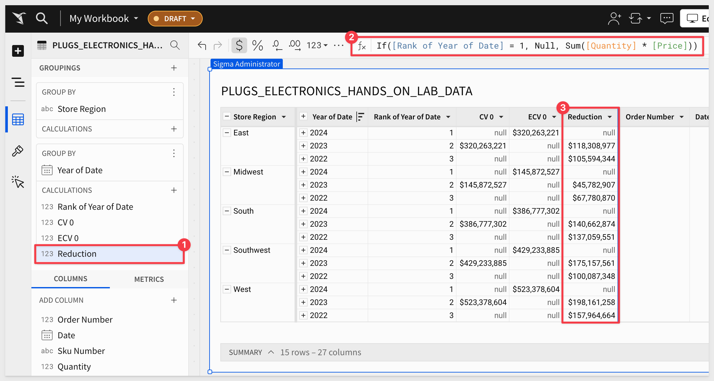

### Using Helper Columns for Subsequent Years
Now, we'll create additional helper columns to handle the recursive logic.

Add a new column in `CALCULATIONS` named `CV 1`; set its formula to:
```code
If([Rank of Year of Date] = 2, Lag([ECV 0], 1, Null) - [Reduction], Null)
```

Add a new column named `ECV 1`; set its formula to:
```code
If([Rank of Year of Date] = 2, [CV 1] - [Reduction], Null)
```

#### Repeat This Process for Last Year in the Table
Add a new column named `CV 2`; set its formula to:
```code
If([Rank of Year of Date] = 3, Lag([ECV 1], 1, Null) - [Reduction], Null)
```

Add a new column named `ECV 2`; set its formula to:
```code
If([Rank of Year of Date] = 3, [CV 2] - [Reduction], Null)
```

This gives us:

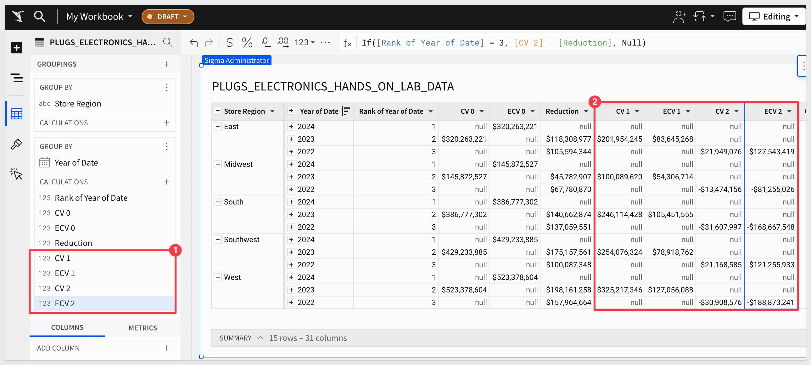


<!-- END OF SECTION-->

## Calculating the Final Carrying and Ending Value
Duration: 5 

Now that we’ve created all the necessary columns for carrying values (CV) and ending carry values (ECV) across multiple years, let's consolidate them into a single `Final CV` and `Final EV` column to represent the complete discounted cash flow analysis.

### Step 1: Create the Final Carrying and Ending Value Columns
Create two new columns in `CALCULATIONS` and rename them to `Final CV` and `Final ECV`.

Use the the following formulas for each:

**For Final CV:**
```code
Coalesce([CV 0], [CV 1], [CV 2])
```

This formula will select the first non-null carrying value from the available years. It effectively gathers the carrying value for each row across all years in one column.

**For Final ECV:**
```code
If(IsNotNull(Coalesce([CV 0], [CV 1], [CV 2])), Coalesce([ECV 0], [ECV 1], [ECV 2]), Null)
```

Similarly, this formula picks the first non-null ending value from all available EV columns, consolidating them into a single `Final ECV` column.

This gives us:

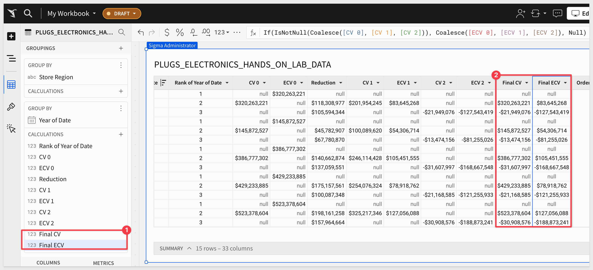

Hide all other `CV`, `ECV` and detail columns, now that the values are consolidated into `Final CV` and `Final EV`. 

This step will make your data cleaner and more user-friendly, ensuring the focus remains on the final results.

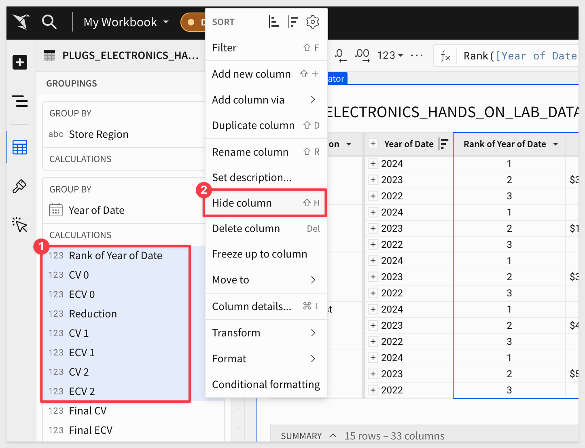

Unhide the `Reduction` column; we want to see that too.

This gives us:

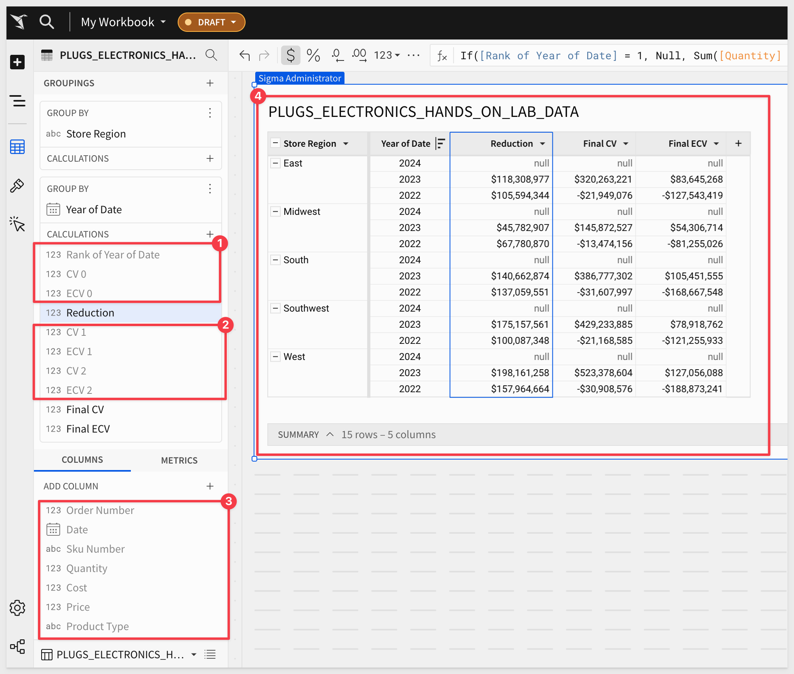

We can also replace the `null` values with a blank space, to clean up the table more.

Select the `Reduction`, `Final VC` and `Final ECV` columns (shift + click on each column), then open one of the column menus and select `Format` > `Custom`:

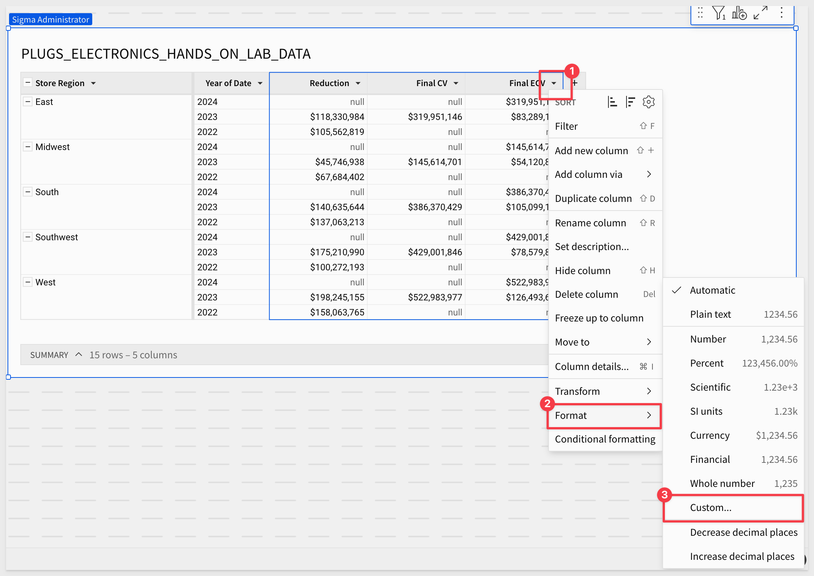

In the `Display null as`, just add one space (blank text) and click `Apply`:

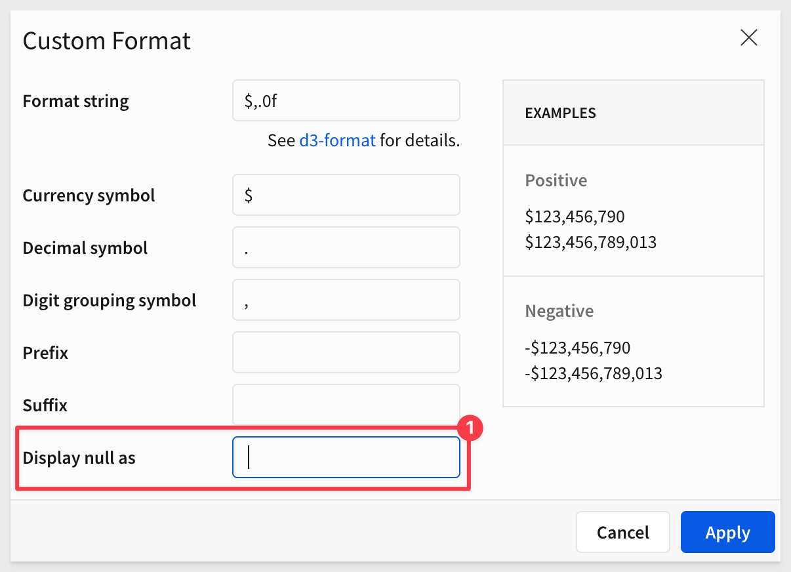

This gives us:

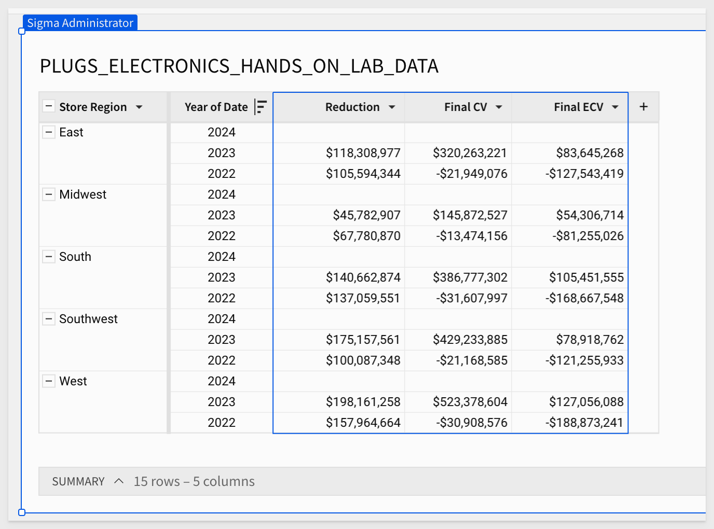


<!-- END OF SECTION-->


## Adding the Discount Rate and Calculating the Discounted Cash Flow (DCF)
Duration: 5 

Now we’ll calculate the discounted cash flow, which is the ultimate goal of this analysis.

### Create a Control Element for the Discount Rate:
Click the `+` to add a new `Control` element called at the top of your Sigma workbook. 

Rename the control to `Discount Rate (WACC)`

<aside class="negative">
<strong>NOTE:</strong><br> The WACC (Weighted Average Cost of Capital) represents the average rate of return a company is expected to pay to all its security holders to finance its assets. It is commonly used as the discount rate in financial modeling, such as Discounted Cash Flow (DCF) analysis, because it reflects the company's cost of capital from both equity and debt sources.
</aside>

This control will allow you to input different discount rates interactively, giving you the flexibility to test various scenarios.

#### Configure the Control
Set the control's configuration as shown.

Enter a percentage value that represents the discount rate (for example: .10). This rate will be applied to your DCF calculations:

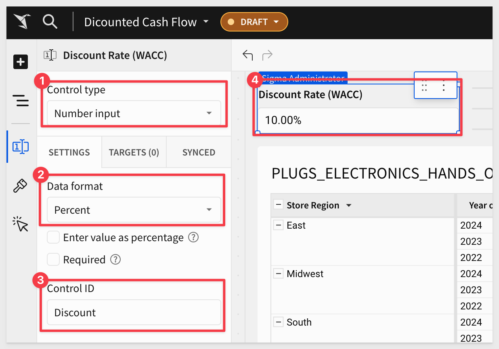

The `Discount Rate` is used to adjust future cash flows back to their present value. The higher the discount rate, the lower the present value, reflecting the time value of money.

### DCF Calculation:
Add a new column in `CALCULATIONS` and rename this column to `DCF`.

Enter the following formula into the DCF column:
```code
[Final ECV] / Power((1 + [Discount]), Number([Rank of Year of Date]))
```

This formula calculates the present value of the future cash flow (Final EV) by applying the discount rate over the specified number of years. 

The `Power` function adjusts the discount rate over the given year, which correctly discounts future values to the present.

The DCF column now represents the value of your asset, project, or investment discounted back to today's terms, using the specified discount rate.

The table now looks like this:

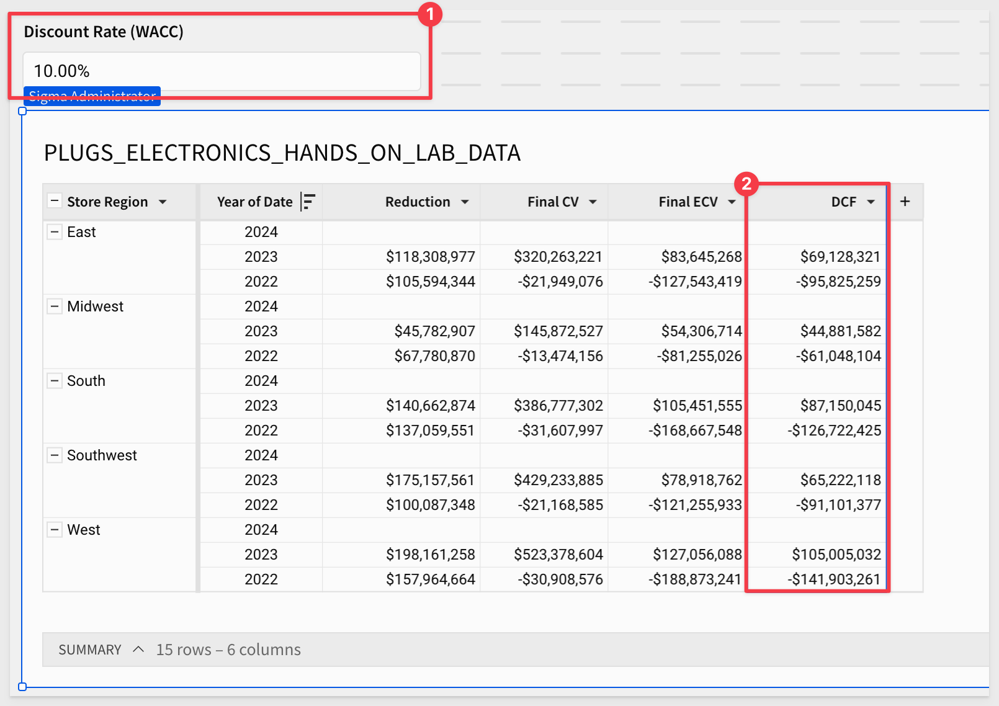

The `DCF` values now reflect a properly discounted cash flow analysis over time, with larger discounting applied to years further into the future.

At this point, we should give the table a more appropriate name, so that it is clear to user. 

Rename the table to `Multi-Year DCF Analysis for Store Regions` and `Publish` the workbook.

Save the workbook as `Discounted Cash Flow QuickStart`:

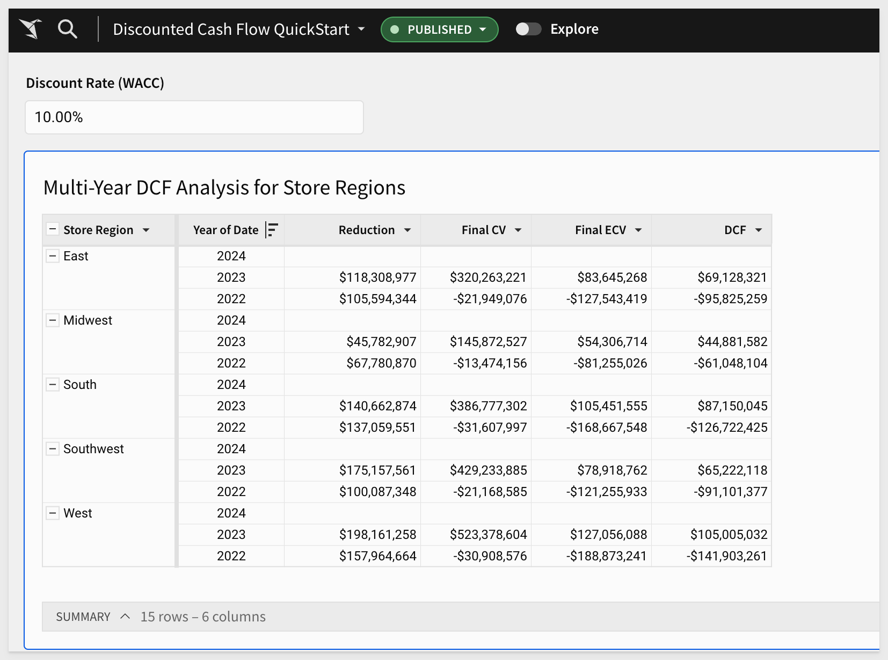


<!-- END OF SECTION-->

<!-- Hold this section for potential use later evn though it is very light so far - PB
## Calculating/Calling IRR and XIRR UDFs
Duration: 5 

In this section, we demonstrate and discuss the process of calculating the `Internal Rate of Return` (IRR) and `Extended Internal Rate of Return` (XIRR) using User-Defined Functions (UDFs). 

These calculations are essential in financial analysis to understand the profitability and rate of return of investments over time. The steps will demonstrate how to set up your data correctly, call the UDFs, and create custom functions for easier use.

For more information on using UDFs in Sigma, see [Create reusable custom functions](https://help.sigmacomputing.com/docs/custom-functions#create-custom-functions)

For readers who may be interested in using Snowflake Snowpark UDFs in Sigma, see this [QuickStart.](https://quickstarts.sigmacomputing.com/guide/snowflake_snowpark_udf_python/index.html?index=..%2F..index#0)
-->

## What we've covered
Duration: 5

In this QuickStart, we covered how to create a discounted cash flow (**DCF**) in Sigma, using sample data.

**Additional Resource Links**

[Blog](https://www.sigmacomputing.com/blog/)<br>
[Community](https://community.sigmacomputing.com/)<br>
[Help Center](https://help.sigmacomputing.com/hc/en-us)<br>
[QuickStarts](https://quickstarts.sigmacomputing.com/)<br>


Be sure to check out all the latest developments at [Sigma's First Friday Feature page!](https://quickstarts.sigmacomputing.com/firstfridayfeatures/)
<br>

[](https://twitter.com/sigmacomputing)&emsp;
[](https://www.linkedin.com/company/sigmacomputing)&emsp;
[](https://www.facebook.com/sigmacomputing)


<!-- END OF WHAT WE COVERED -->
<!-- END OF QUICKSTART -->
