\author: pballai
id: use_cases_fpna_report_based_on_template
summary: use_cases_fpna_report_based_on_template
categories: use-cases
environments: web
status: Use Cases
feedback link: https://github.com/sigmacomputing/sigmaquickstarts/issues
tags: default
lastUpdated: 2025-08-22

# Build a Custom FP&A Report based on a Template

## Overview
Duration: 5 

Finance professionals use FP&A (Financial Planning & Analysis) spreadsheets to forecast future performance, track actuals, and guide strategic decision-making. These spreadsheets serve as dynamic tools for modeling revenue, expenses, and key business drivers—enabling teams to compare real results to budgeted expectations.

By organizing data around departments, regions, time periods, and accounts, FP&A teams transform raw financials into meaningful insights. The result: more effective scenario modeling, executive reporting, and strategic planning.

In short, spreadsheets are how finance brings clarity and control to the uncertainty of business.

In This QuickStart, You’ll Learn How To:
- Use a pre-built FP&A template that accelerates setup and follows best practices
- Build an FP&A workbook from scratch or use the template as a starting point
- Create grouping calculations to organize data by account hierarchies, departments, regions, or time periods
- Join data across tables (e.g., linking journal entries to reference tables like accounts or cost centers)
- Union datasets to consolidate actuals, budgets, and forecasts into a single, cohesive view

This QuickStart will explain not just how the report is built, but why it’s structured this way—so you can confidently adapt the pattern for your own data.

When finished, you’ll have a complete and flexible FP&A workbook that supports planning, analysis, and reporting workflows:

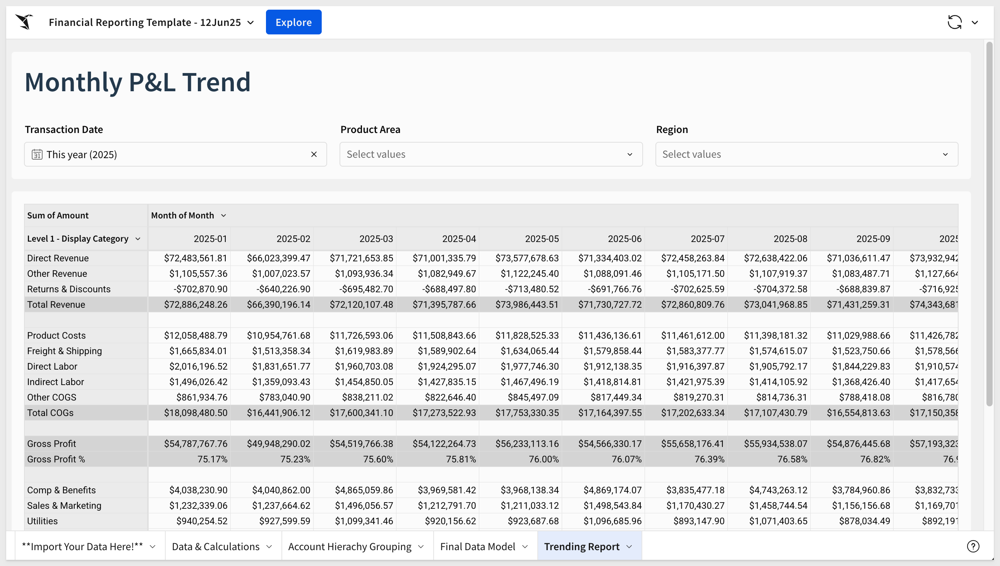

This QuickStart assumes the reader has a working knowledge of financial planning and reporting concepts. Familiarity with budgets, forecasts, actuals, and account structures will help you get the most value.

It is helpful if you are comfortable working with hierarchical or dimensional data structures (e.g., chart of accounts, regions, departments) for more advanced modeling but not required.

<aside class="positive">
<strong>IMPORTANT:</strong>  Some screens in Sigma may appear slightly different from those shown in QuickStarts. This is because Sigma continuously adds and enhances functionality. Rest assured, Sigma’s intuitive interface ensures that any differences will not prevent you from successfully completing any QuickStart.
</aside>

For more information on Sigma's product release strategy, see [Sigma product releases](https://help.sigmacomputing.com/docs/sigma-product-releases)

If something doesn’t work as expected, here's how to [contact Sigma support](https://help.sigmacomputing.com/docs/sigma-support)

### Target Audience
- FP&A professionals responsible for budgeting, forecasting, and financial reporting
- Financial analysts building models and tracking actuals vs. plan
- Business stakeholders who rely on financial data to make informed decisions
- Data teams that support finance by structuring, transforming, and delivering source data
- Teams using manual or spreadsheet-heavy processes and looking to modernize
- Users seeking to structure financial data (e.g., accounts, departments, regions) for scalable analysis
- Anyone aiming to build flexible, high-impact financial dashboards and reports

### Prerequisites
<ul>
  <li>Any modern browser is acceptable.</li>
  <li>Access to your Sigma environment.</li>
  <li>Some familiarity with Sigma is assumed. Not all steps will be shown, as the basics are assumed to be understood.</li>
 </ul>

<aside class="positive">
<strong>IMPORTANT:</strong>  Sigma recommends using non-production resources when completing QuickStarts.
</aside>

<button>[Sigma Free Trial](https://www.sigmacomputing.com/free-trial/)</button>

<aside class="negative">
<strong>IMPORTANT:</strong>  Some features may carry a "Beta" tag. Beta features are subject to quick, iterative changes. As a result, the latest product version may differ from the contents of this document.
</aside>
 

## Domain Explanation
Duration: 5

Finance professionals use FP&A (Financial Planning & Analysis) spreadsheets to forecast the future, track performance, and guide decision-making. These spreadsheets are dynamic tools for modeling revenue, expenses, and key business drivers—allowing teams to compare actual results to budgeted expectations.

By organizing data around departments, regions, time periods, and accounts, FP&A teams transform raw financials into actionable insights. This supports strategic planning, scenario modeling, and executive reporting.

In short, these spreadsheets bring clarity and control to the uncertainty of business.

### About the Financial Data
This QuickStart uses two core datasets commonly found in FP&A workflows:

**Financial Transaction** 
The financial transaction entries table forms the transactional backbone of your financials. It contains individual line items with key fields such as Transaction Date, Amount, Account, Department, and Region. It represents the raw, timestamped flow of financial activity across your business.

**Account Hierarchy** 
This dataset defines how financial accounts roll up into broader reporting categories (e.g., Revenue → Operating Income → Net Income). It enables you to group, categorize, and report on financials at multiple levels of granularity.

Together, these datasets allow you to model and visualize financial performance across departments, time periods, and account categories.

### Understanding the Financial Transaction Table
The Financial Transaction table typically includes three types of columns. (Note: Column order may vary depending on your data source.)

**1. Account Hierarchy Values:** 
Used to group data and create rollups in your FP&A report:
- Account (or Account Number)
- Account Hierarchy Description

**2. Core Transaction Fields:** 
Each line item includes transactional detail for analysis:
- Transaction Date
- Journal Entry ID
- Amount

**3. Transaction Dimensional Attributes:** 
Used to slice and filter financial data by business segments:
- Cust Key
- Product Area
- Region
- Department

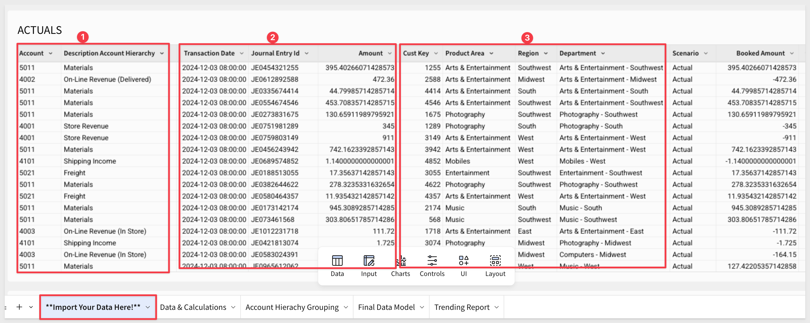

### Understanding the Account Hierarchy Table
The Account Hierarchy table typically contains three types of columns:

**1. Base-Level Hierarchy Information:** 
Used to define the relationship between accounts and categories. This enables the join to the journal entry table.

**2. Section/Grouping for Totals:** 
Defines high-level rollup categories that appear in reports:

Example values: Operating Expenses, Revenue, COGS

**3. Full Hierarchy Path (Level 1 to N):** 
Optional fields that represent the full drill path across levels. These allow display and aggregation at various levels of detail.

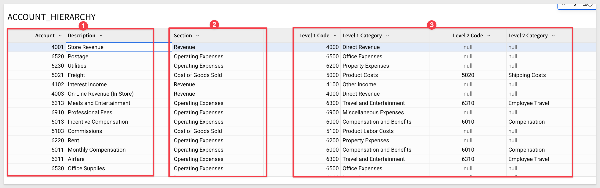

The combined dataset—ACTUALS with Hierarchy—is a standard join of the two tables using the Account field as the key:

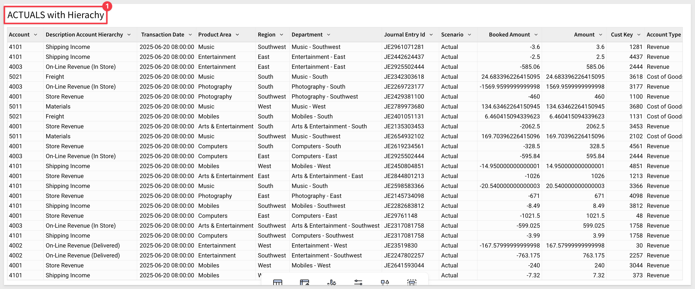

<!-- END OF SECTION-->

## Setting Up the Template
Duration: 5

To make this process easier, we have created a [template](https://help.sigmacomputing.com/docs/create-and-edit-workbook-templates) that is mostly configured.

Return to the Sigma homepage and click `Templates`. Click to select the `Financial Reporting Template Quickstart` template:

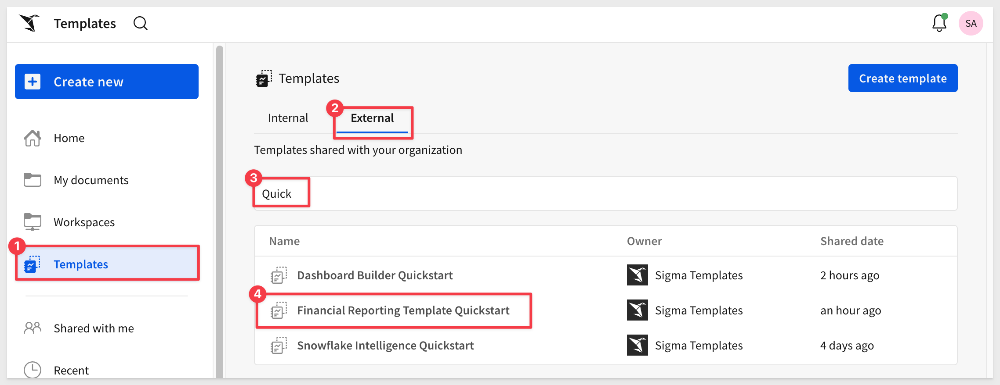

This creates a new (unsaved) workbook for us:

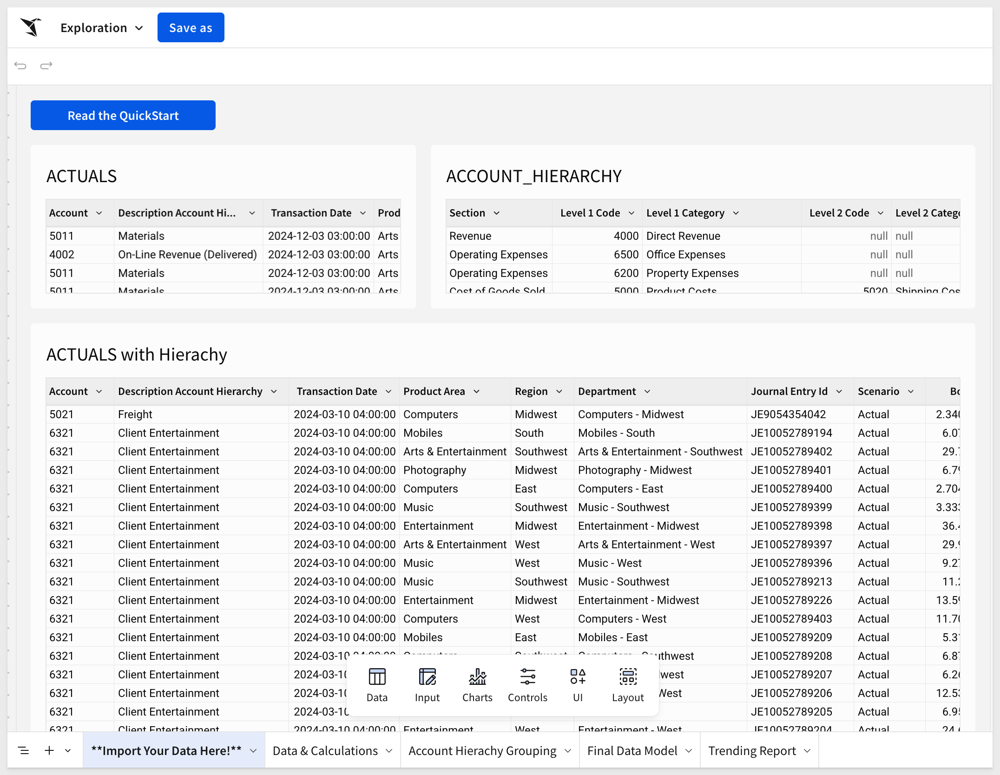

The template is initially configured with the `Sample Sigma Database`, which should allow for a clean mapping to your own instance.

Click `Save As` and give your new workbook a meaningful name—e.g., `FP&A QuickStart`.

If we open the page tab, `Trending Report` there is `No data`:

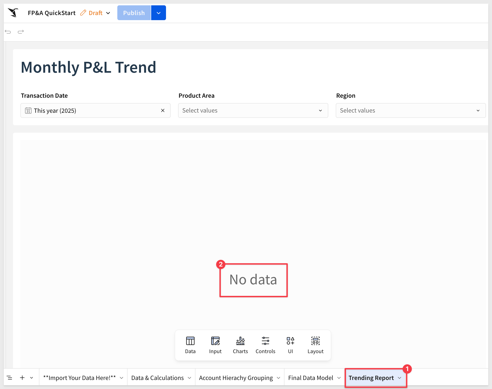

This happens because the pivot table in that tab uses a left join with a scaffold from the account hierarchy. The associated input table values do not transfer automatically.

### Step 3: Load Input Table Data from CSV
Let's correct this issue by loading data into the input tables using CSV files; a common practice when bringing external data to enrich existing data.

Download these files to your local computer's downloads folder:

<button>[Input Table 1](https://sigma-quickstarts-main.s3.us-west-1.amazonaws.com/csv/templates/fp%26a/FP%26A+Template+-+Input+Table+1.csv)</button>

<button>[Input Table 2](https://sigma-quickstarts-main.s3.us-west-1.amazonaws.com/csv/templates/fp%26a/FP%26A+Template+-+Input+Table+2.csv)</button>

Open FP&A Template - Input Table 1.csv in a text editor.

Select all rows and columns, then copy.

In Sigma, go to the `Account Hierarchy Grouping` page.

Paste the data into the `Standard Input – New Input Table`.

If your copy included the header row, just select it, right-click and select `Delete 1 row`:

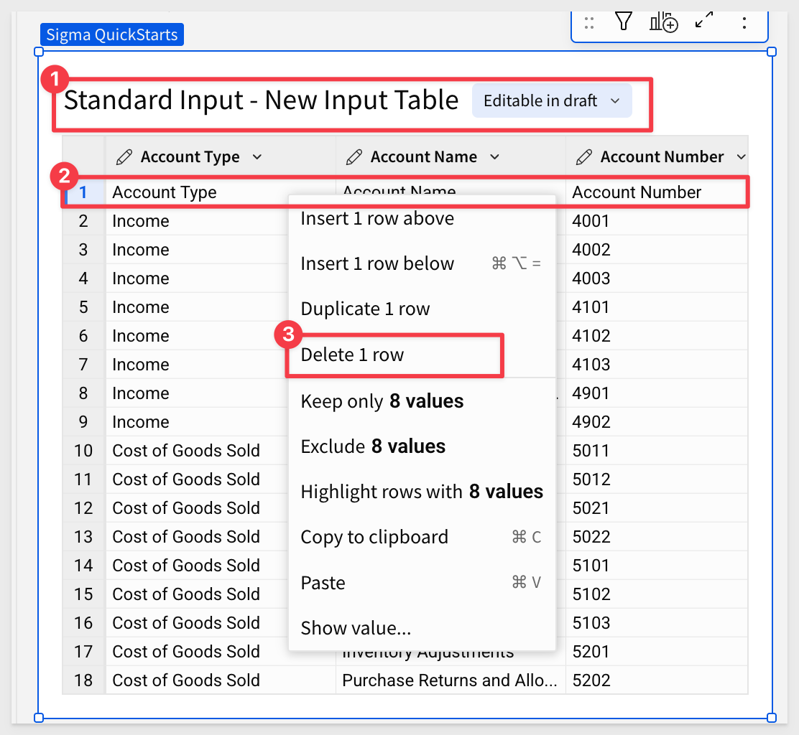

You should now have `46 rows` of data in this table.

Repeat the process for `Input Table 2`, pasting the `12 rows` into the `Manual Input – New Input Table`:

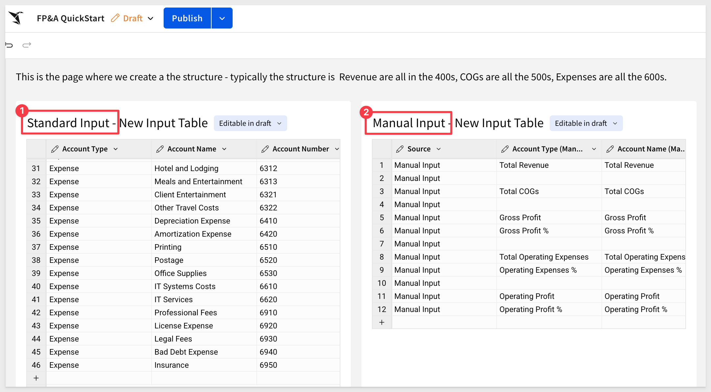

Now return to the` Trending Report`—you should see data populated in the pivot:

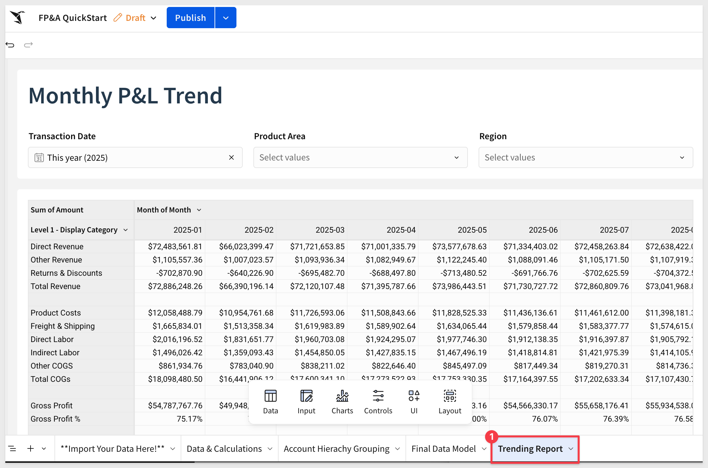

<!-- END OF SECTION-->

## Build Overview
Duration: 5

Before connecting your own data, let’s first orient you to the structure of the workbook and outline the major steps we'll walk through.

### Start With the End in Mind
We begin by looking at the output: the `Monthly P&L Trend` pivot table:

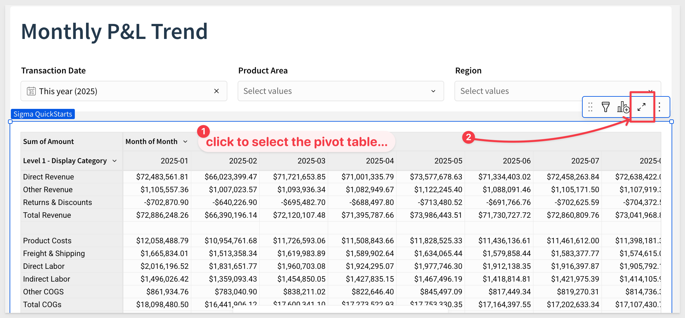

Expanding the pivot reveals the underlying grouped table that powers it:

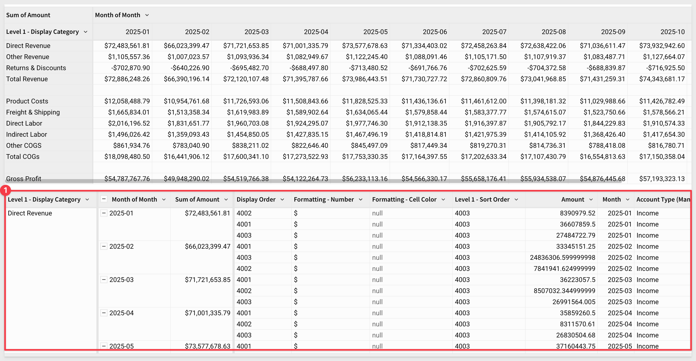

In Sigma, every pivot table is built on top of a grouped table. Expanding the grouped element allows us to inspect the aggregations and grouping logic behind the visualization:

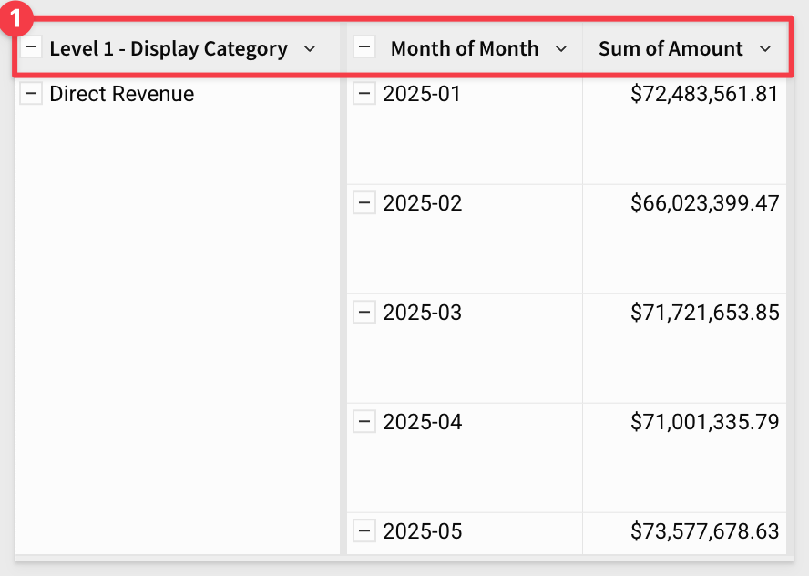

### Workbook lineage
To understand how the workbook is constructed, click the lineage icon in the lower-right corner:

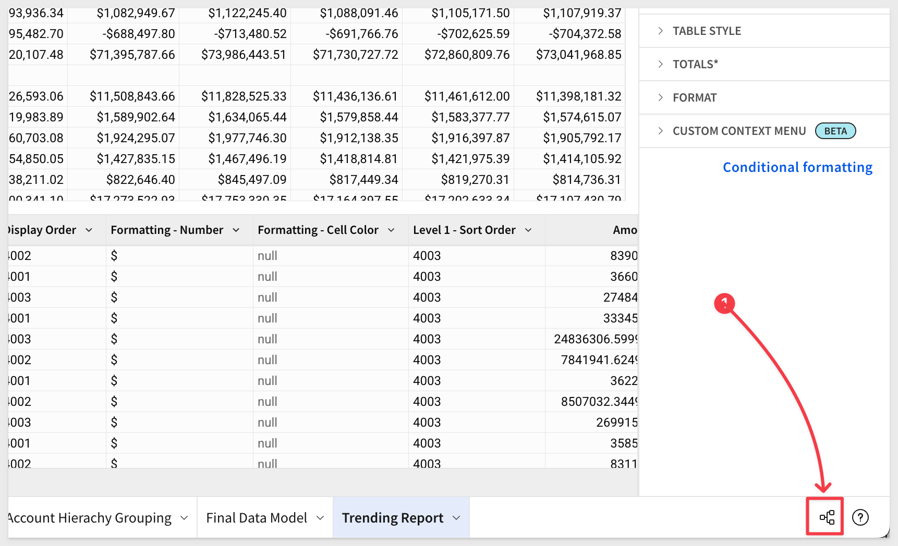

The workbook is primarily composed of three logical layers:

**1. Input Tables and Scaffold** 
We begin by reviewing the two input tables that define the rows used in the final pivot table. These form the scaffold for financial groupings:

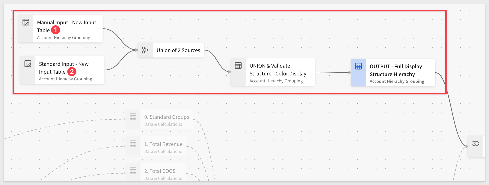

**2. Calculation Logic** 
Calculations are broken into three distinct stages, each building on the previous:
- Total Groupings
- Profit and Percentage Calculations
- Standard Groupings

These are later unioned into a single, unified dataset:

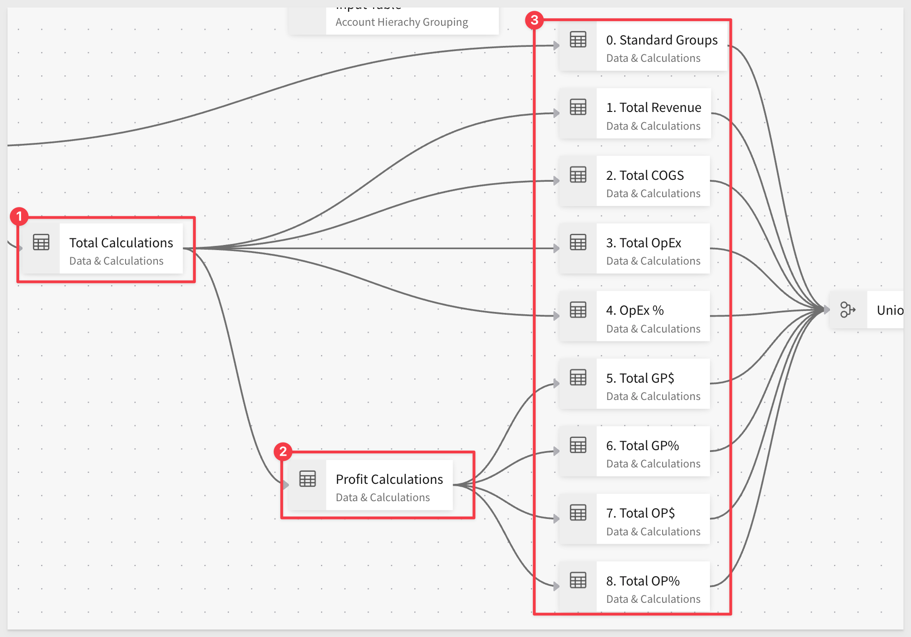

**3. Connected Data Sources** 
Finally, we review how external financial data is brought in and joined to the workbook. Understanding where the data comes from—and what’s in it—is key to adapting this template for your own needs:

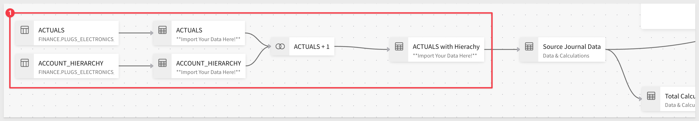

From here, we’ll dive into how the joins are configured.

<!-- END OF SECTION-->

## Build: Left Side Join
Duration: 5

This report uses a scaffolded pivot design—the pivot row values are pre-defined as a set of unique combinations across display categories.

While some groupings are based on aggregations in the data, this approach gives us full control over how multi-tiered groupings and drill paths are displayed. In this case, it’s best to manually generate the row scaffold.

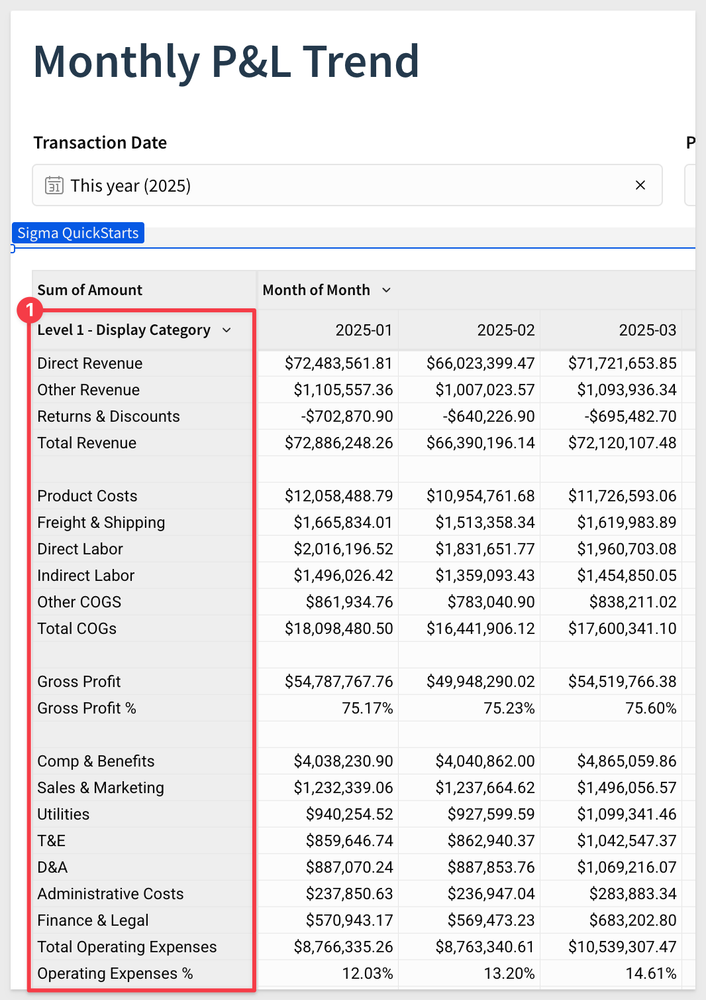

### The Join Structure
This design relies on a left join between a union of two input tables and the main dataset:

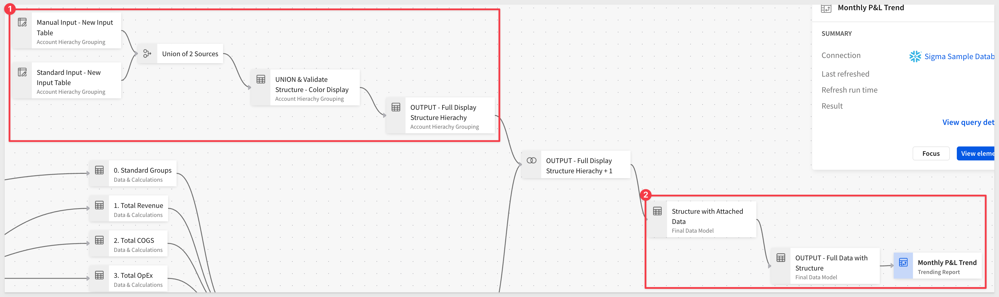

The two input tables represent different types of rows:

**1. Standard Input Table:** defines display rows based on existing account groupings 
**2. Manual Input Table:** allows you to inject specific rows for custom calculations or formatting

We include a validation step along the way to confirm the structure, and then use this combined set of rows as the scaffold to generate the final P&L report.

This design also ensures that if a row is missing in the final output, you can quickly trace it back to the scaffold.

### Scaffold Table Column Breakdown
Each row in the scaffold contains several types of information:

**1. Source Journal ID:** from the original journal entry data 
**2. Account Number:** associated with the financial row 
**3. Display Categories:** values used in the pivot table groupings (currently one level, but easily expandable) 
**4. Formatting:** optional display metadata for presentation control

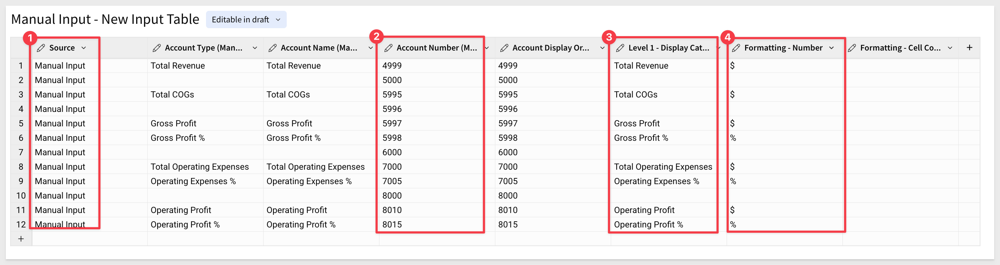

<aside class="positive">
<strong>IMPORTANT:</strong>  This approach ensures that important rows—such as planned accounts, empty time periods, or placeholder categories—always appear in the report, even if no transactions exist yet. It’s especially useful for maintaining consistent structure across budget vs. actual views, or for preserving display order during periods of zero activity.
</aside>

This method allows us to intentionally include any row in the dataset—even if no data exists for that row yet. We’ll test this capability later in Step 7.

<!-- END OF SECTION-->

## Build: Right Side Join
Duration: 5

The Account Hierarchy and Journal Data are already cleanly joined, so the next step is to validate the calculations being used throughout the workbook.

### Starting Point: Source Journal Data
Begin on the `Data & Calculations` page with the `Source Journal Data` table, which has already been cleaned and prepared for use.

This is also where filters are applied. Since the dataset includes columns such as `Transaction Date`, `Product Area`, and `Region`, building filters is straightforward.

For example, the `Transaction Date` filter control is tied to the `Transaction Date` column in the `Source Journal Data` table:

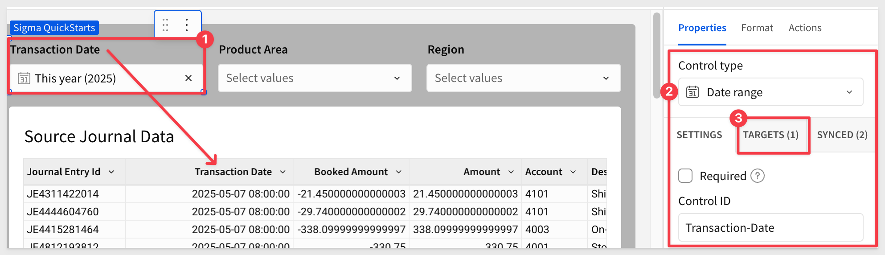

### Navigating Child Tables
Scroll down from the `Source Journal Data` table and you’ll find three buttons, each linking to a child table. These represent different views of the same underlying data:

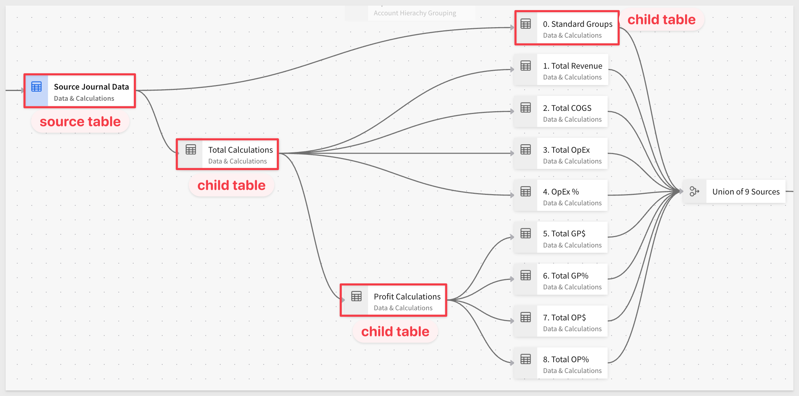

**1. Standard Groupings** 
Click the Standard Groupings button.
This child element groups data using the following fields:
- Account Type (Section)
- Description
- Account
- Month of Date

...with a calculation applied to the `Amount` column:

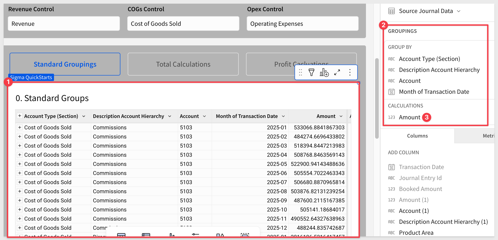

**2. Total Calculations** 
Click the `Total Calculations` button to view a different representation of the same data.

These calculations are grouped at the monthly level and use conditional formatting to highlight key values:

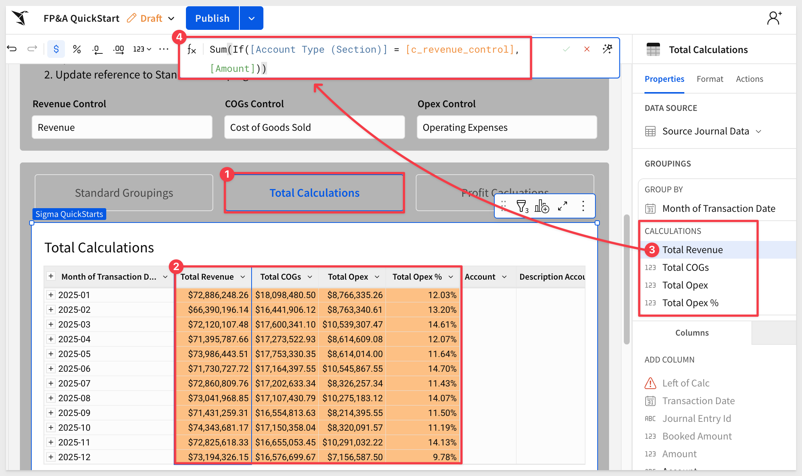

<aside class="negative"> <strong>NOTE:</strong>  Columns that contain direct calculations are highlighted in orange to make them easier to identify. 
</aside>

**3. Profit Calculations** 
Click the `Profit Calculations` button.

This third child table includes profit-specific metrics. It builds on previous calculations and introduces fields like:
- Absolute Profit
- Percentage Gross
- Operating Profit

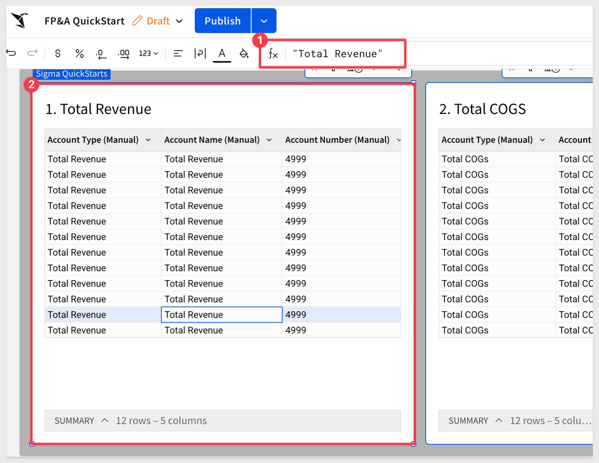

### Metric-Specific Tables and Union
To prepare for unioning with the left-hand scaffold, each metric is isolated into its own dedicated table.

For example, if you scroll down the page, you’ll see a table titled `1. Total Revenue`, which includes `Gross Profit`:

Eventually, all of these tables are unioned together into a single combined output: `OUTPUT – Union of Aggregations`.

Notice how rows like `Gross Profit` are collapsed into a clean, singular structure:

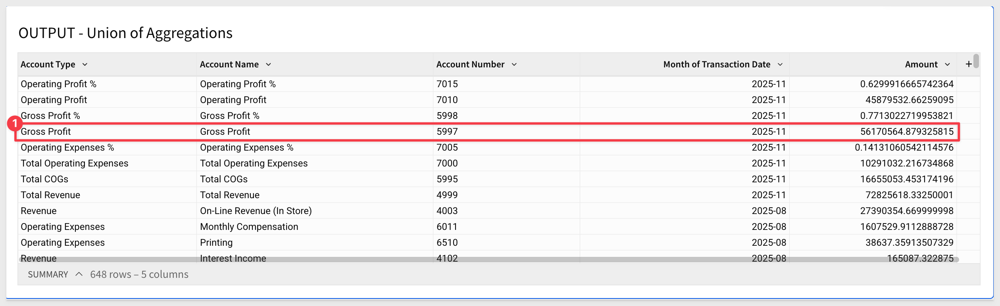

To inspect how the union was created select the `OUTPUT – Union of Aggregations` table.

Open the element’s menu.

Choose `Element Source` → `Edit Union`:

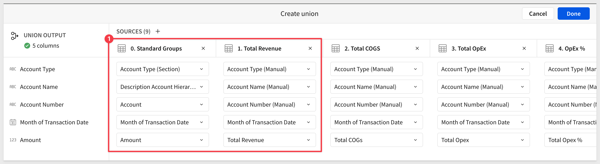

<!-- END OF SECTION-->

## Build: Customization
Duration: 5

To demonstrate customization, navigate to the `Account Hierarchy Grouping` page. Expand the `Manual Input – New Input Table` element to make all columns visible.

Add a new row with values similar to the example below:

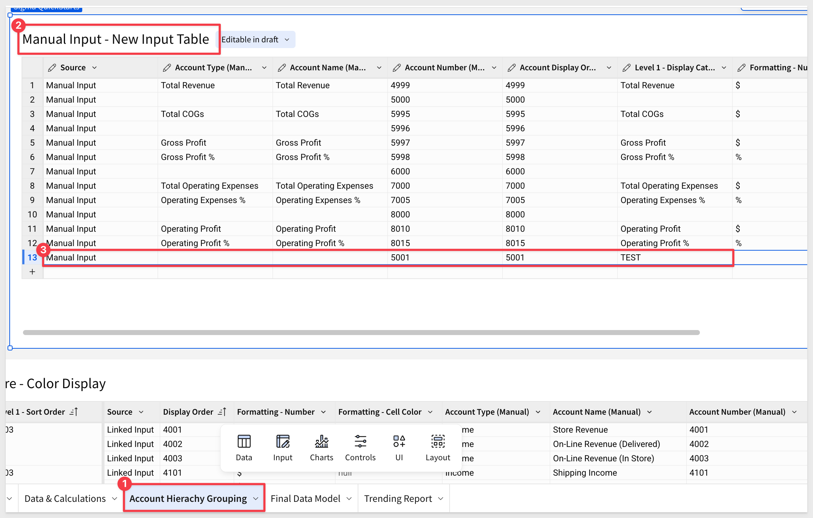

Now go back to the `Trending Report` page to see the effect of this small change:

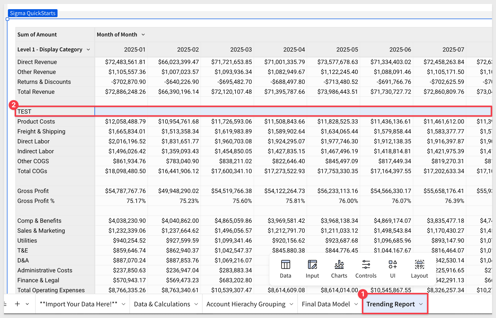

This method allows you to introduce custom rows or calculations directly into your report by leveraging the workbook’s existing logic. It's a powerful way to extend or modify the default behavior without altering the underlying data model.

### Managing Formatting
Sigma supports dynamic formatting driven by values from your input tables. This means you can control the appearance of rows—such as font color, background shading, number formatting, and conditional highlights—based on logic embedded in your data.

For example, columns like `format_type` or `highlight_flag` in your input table can be used to:
- Highlight key rows or metrics based on performance thresholds
- Apply different styles to actuals vs. forecasts
- Show or hide elements depending on user input or status values

By combining input tables with custom formulas and conditional formatting rules, you can create polished, responsive reports without hardcoding visual styling:

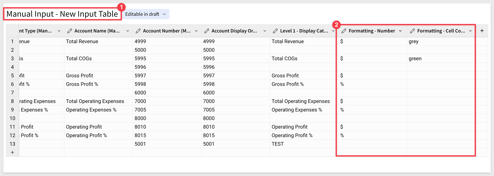

You can apply this formatting through a calculation and assign it directly within the row itself using the `Conditional Formatting` panel:

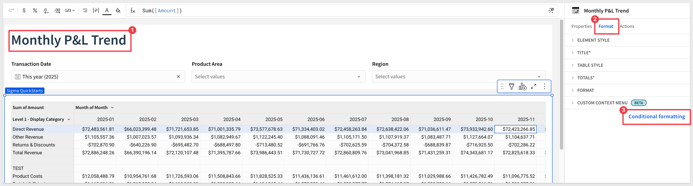

For example, applying the green highlight configured in the `Manual Input – New Input Table` for `Total COGs` results in:

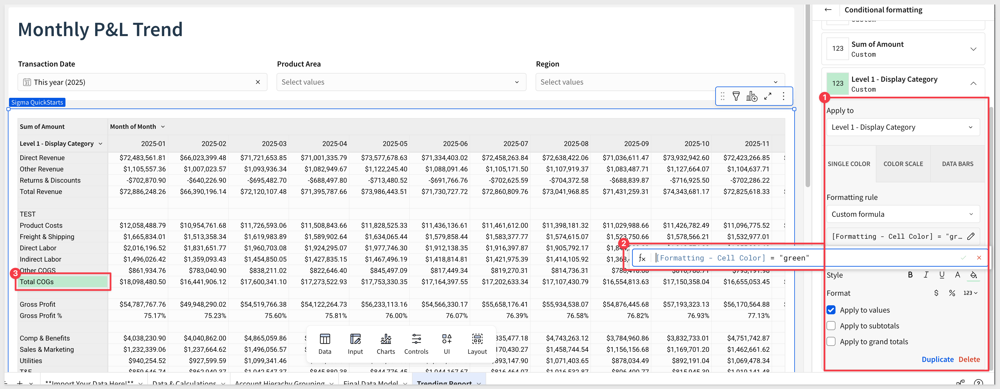

<!-- END OF SECTION -->

## What we've covered
Duration: 5

In this QuickStart, we walked through the process of building a dynamic and flexible FP&A report in Sigma using structured input tables, account hierarchies, and unioned calculations. Along the way, you learned how to:

- Use a pre-built Sigma template as a foundation
- Load custom data into input tables to scaffold pivot rows
- Explore workbook lineage and understand how joins and groupings power the report
- Structure key financial calculations and aggregate metrics
- Union multiple calculation layers into a single output table
- Apply dynamic formatting to drive polished, data-aware presentations

While this example uses Sigma’s sample data, the same design pattern can be easily adapted to your own organization’s financial data—enabling scalable, governed reporting directly from your cloud data warehouse.

**Additional Resource Links**

[Blog](https://www.sigmacomputing.com/blog/) 
[Community](https://community.sigmacomputing.com/) 
[Help Center](https://help.sigmacomputing.com/hc/en-us) 
[QuickStarts](https://quickstarts.sigmacomputing.com/) 

Be sure to check out all the latest developments at [Sigma's First Friday Feature page!](https://quickstarts.sigmacomputing.com/firstfridayfeatures/)
 

&emsp;
&emsp;

<!-- END OF WHAT WE COVERED -->
<!-- END OF QUICKSTART -->
